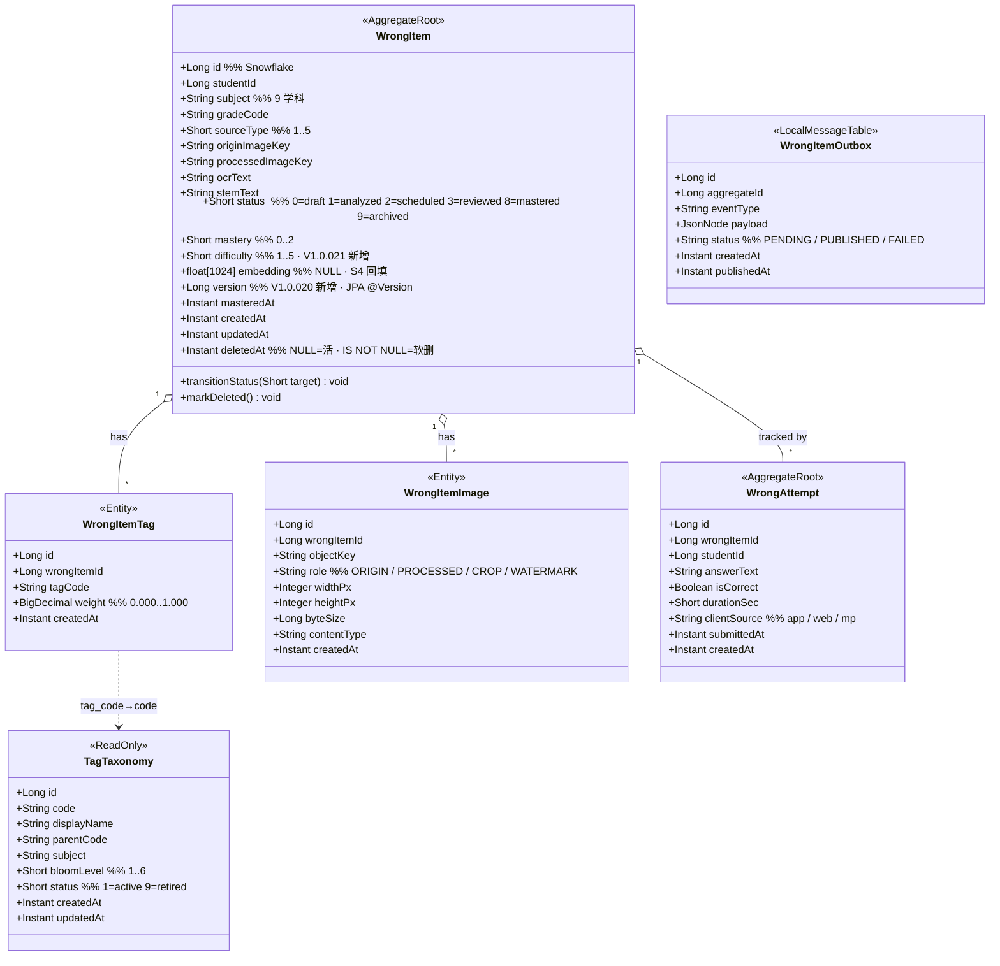
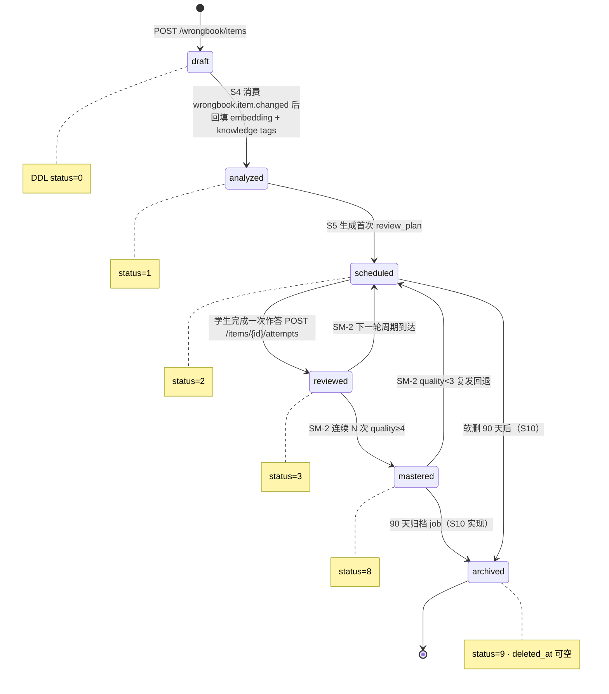
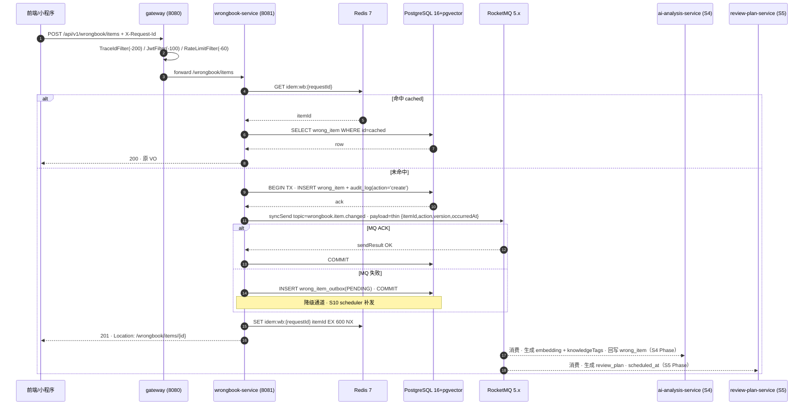
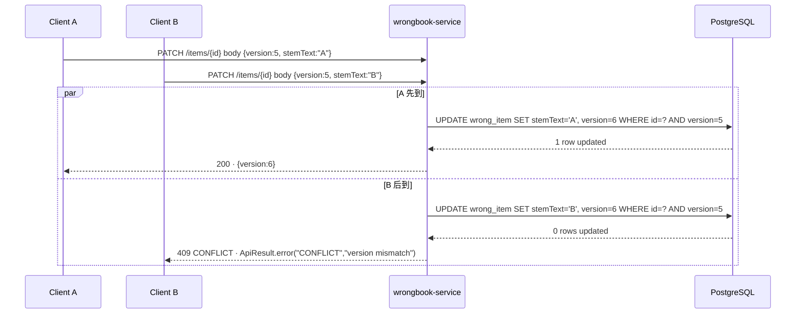
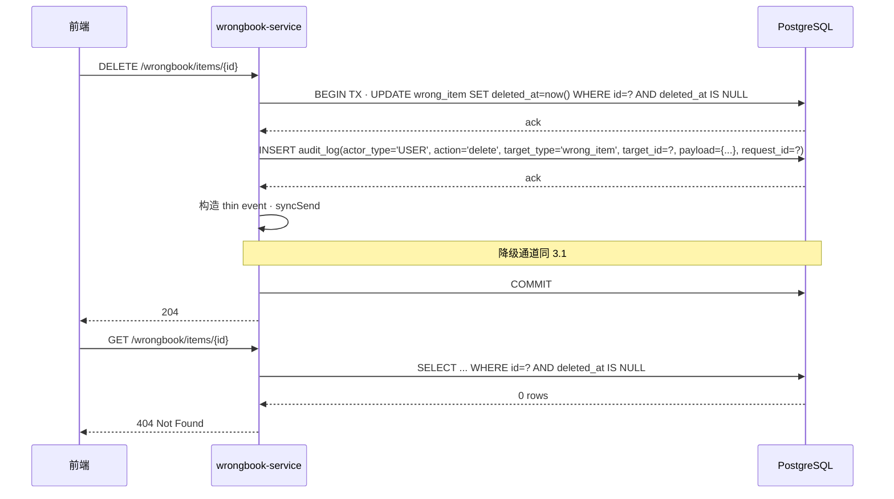

# S3 · 错题主域架构文档（wrongbook-service）

**定位**：本文件是 S3 Phase 代码符号的唯一真源（§1.7 规则 B）。G-Biz 通过后 Builder 方可启动 §2-§6 架构设计；G-Arch 通过后方可进入落地计划 §7.7 AI 执行步骤。

## 0. 业务架构图（Business Architecture · 锚点 #0-业务架构图）

```mermaid
flowchart LR
  subgraph Actors[角色]
    Student[学生]
    Parent[家长（观察）]
  end

  subgraph WrongbookCore[错题主域 · wrongbook-service · S3 本 Phase]
    Capture[错题采集入库]
    StateMachine[状态机<br/>draft → analyzed → scheduled → reviewed → mastered]
    TagAssoc[知识点标签关联]
    ImageConfirm[图片确认<br/>OSS key 登记]
    SoftDelete[软删 + 审计<br/>deleted_at · audit_log]
    OutboxEmit[事件发布<br/>wrongbook.item.changed]
  end

  subgraph DataLayer[持久层 · 来自 S1]
    WrongItem[(wrong_item)]
    WrongItemTag[(wrong_item_tag)]
    WrongItemImage[(wrong_item_image)]
    TagTaxonomy[(tag_taxonomy)]
    AuditLog[(audit_log)]
    Outbox[(wrong_item_outbox · S3 新增 V1.0.019)]
  end

  subgraph Infra[基础设施]
    RocketMQ[(RocketMQ 5.x<br/>wrongbook.item.changed)]
    Redis[(Redis 7<br/>idem:wb:{requestId})]
    OSS[(OSS/MinIO · S6)]
  end

  subgraph Downstream[下游消费 · 非 S3]
    AiAnalysis[ai-analysis-service<br/>S4 · 写回 embedding]
    ReviewPlan[review-plan-service<br/>S5 · 复习排期]
  end

  Student -->|POST /wrongbook/items| Capture
  Capture --> WrongItem
  Capture --> StateMachine
  StateMachine --> WrongItem
  TagAssoc --> WrongItemTag
  TagAssoc -.查询.-> TagTaxonomy
  ImageConfirm --> WrongItemImage
  ImageConfirm -.key 引用.-> OSS
  SoftDelete --> WrongItem
  SoftDelete --> AuditLog
  Capture --> OutboxEmit
  OutboxEmit -->|事务消息主通道| RocketMQ
  OutboxEmit -.|失败降级|.-> Outbox
  Capture -.|幂等键|.-> Redis
  RocketMQ --> AiAnalysis
  RocketMQ --> ReviewPlan
  Parent -.|只读 · S11|.-> WrongItem
```

## 1. 业务理解（0.1 段 · G-Biz 绑定）

**说明**：本段输出是 G-Biz 主动征询的输入；User 回答后将更新到 front matter.special_requirements。

### 1.1 业务范围（≤ 300 字）

本 Phase 实现 AI 错题本的核心领域服务 **wrongbook-service**，承载"错题条目 / 错题标签 / 错题图片 / 知识点分类"四类实体（其中 `wrong_item` 为唯一聚合根）的 CRUD + 领域事件发布。支持：①错题条目录入（文本 / OCR 结构化结果）；②条目生命周期（`wrong_item.status` 数值枚举 0/1/2/3/8/9 · 默认 0=draft）；③RocketMQ Outbox 事件发布（topic `wrongbook.item.changed` · action 枚举 created/updated/deleted）；④知识点标签关联（通过 `wrong_item_tag.tag_code` 引用 `tag_taxonomy.code`）；⑤软删除（`deleted_at` 时间戳 + Hibernate `@SQLDelete` + `@Where(clause="deleted_at IS NULL")`）与审计（`audit_log` append-only 同事务写入）；⑥同 `X-Request-Id` 幂等写入（Redis `idem:wb:{requestId}` TTL 10min）；⑦乐观锁冲突 409 返回（具体机制见 §1.3 漂移 D1）。**不负责**：AI 解析（S4）/ 复习排期（S5）/ 文件存储（S6）/ 前端 UI（S7）/ 匿名态（S11）/ pgvector `embedding` 向量写入（S4 消费事件后异步回填）。

### 1.2 假设清单（AI 当前推断 · 标 "S1-aligned" 即依 S1 已签字 DDL）

| 编号 | 假设 | 依据 | 状态 |
|---|---|---|---|
| A1 | `WrongItem` 是唯一聚合根，tag/image/attempt 均为其子实体（1:N） | 方案 §2A.2 + S1 DDL FK RESTRICT | **S1-aligned** |
| A2 | OCR 结构化结果：`wrong_item.ocr_text` + `wrong_item.stem_text` 双栏 · 图片走 `wrong_item_image` 表（多图 · role='ORIGIN'/'PROCESSED'/'CROP'/'WATERMARK'） | S1 DDL · 方案 §3.2 | **S1-aligned** |
| A3 | 状态机用手写枚举 + Service 层守卫（`@PrePersist/@PreUpdate` 校验）· 不引入 Spring Statemachine | 计划 §7.1 A3 · ADR 0010 候选 | 待 User 确认 |
| A4 | 软删用 `deleted_at TIMESTAMPTZ IS NULL` 判活（S1 A5 override · **非**计划 §7.1 A4 所述的 `deleted boolean`）· Hibernate `@SQLDelete` 执行 `UPDATE ... SET deleted_at = now()` · `@Where(clause = "deleted_at IS NULL")` | **S1 DDL 权威**（drift from 计划 §7.1 A4） | **S1-aligned · drift from plan** |
| A5 | `subject` 枚举 9 学科（math/physics/chinese/english/biology/chemistry/history/geography/politics）· S1 CHECK 约束即真源（drift from 计划 §7.1 A5 所述 5 学科） | **S1 DDL 权威** | **S1-aligned · drift from plan** |
| A6 | outbox 事件 payload 只带 `{itemId, action, version, occurredAt}` 四字段 · 下游反查 `GET /wrongbook/items/{id}` 取详情（thin payload） | 计划 §7.1 A6 | 待 User 确认（Round-2 Q2） |
| A7 | RocketMQ 事务消息 `syncSend` 为主通道 · 失败 catch 后降级写 `wrong_item_outbox`（S3 新增 V1.0.019）· outbox scheduler 自身留 S10 统一补发 | 计划 §7.1 A7 · ADR 0002 | 待 User 确认 |
| A8 | 乐观锁字段不存在于 S1 DDL（drift）· 需决策：新增 `version` 列 / 用 `updated_at` / 不加锁 | **drift blocker** | **Round-1 Q1 待决** |
| A9 | 幂等键作用域仅 POST 路由（`POST /wrongbook/items`）· PATCH/DELETE 天然幂等（依赖乐观锁或 FK） | 计划 §7.1 A9 | 待 User 确认 |
| A10 | `wrong_item.embedding vector(1024)` 字段本 Phase 保留 NULL · S4 异步消费 `wrongbook.item.changed` 后写回 | 计划 §7.1 A10 · S1 DDL | **S1-aligned** |
| A11 | 难度端点 `POST /items/{id}/difficulty` · S1 DDL 无 `difficulty` 列（drift）· 需决策：新增列 / 复用 `mastery` / 本 Phase 不做 | **drift blocker** | **Round-1 Q2 待决** |
| A12 | 软删后 GET 返回 404（非 200 带 deleted=true）· 恢复功能不在本 Phase | 计划 §7.1 A12 | 待 User 确认 |
| A13 | 主键由应用层 Snowflake 生成（S1 A2 override · BIGINT · 非 BIGSERIAL · 非 UUID） | **S1 DDL 权威** | **S1-aligned** |
| A14 | `wrong_item_tag.tag_code` 是 VARCHAR 外键引用 `tag_taxonomy.code`（非 `tag_id`）· 标签关联时校验 code 存在 | **S1 DDL 权威** | **S1-aligned** |
| A15 | `wrong_item_image.object_key` + `role`（'ORIGIN'/'PROCESSED'/'CROP'/'WATERMARK'）· `uq_wii_item_origin` 保证每 item 最多 1 张 ORIGIN 图 | **S1 DDL 权威** | **S1-aligned** |

### 1.3 漂移登记（drift between 计划 §7.1 vs S1 DDL · 以 S1 为准）

| ID | 漂移项 | 计划 §7.1 文字 | S1 DDL 实际 | 决议 |
|---|---|---|---|---|
| **D1** | 乐观锁字段 | `@Version Long version` | **无 version 列** | Round-1 Q1 待 User |
| **D2** | 难度端点 | `POST /items/{id}/difficulty` + `difficulty 1..5` | **无 difficulty 列** | Round-1 Q2 待 User |
| **D3** | 状态机表示 | 字符串 `draft/analyzed/scheduled/reviewed/mastered` | **SMALLINT 0/1/2/3/8/9** | Round-1 Q3 待 User |
| **D4** | 软删列 | `deleted boolean DEFAULT false` | `deleted_at TIMESTAMPTZ` | Builder 采 S1 方案（A4）· 告知 User |
| **D5** | 学科枚举 | 5 学科 | **9 学科** | Builder 采 S1 方案（A5）· 告知 User |
| **D6** | 主键策略 | `BIGSERIAL` 隐含 | **Snowflake 应用生成** | Builder 采 S1 方案（A13）· 告知 User |
| **D7** | 标签引用 | `tagId` 隐含 | **tag_code VARCHAR** | Builder 采 S1 方案（A14）· 告知 User |
| **D8** | 图片字段 | `ossKey + confirmedAt` | **object_key + role + 无 confirmedAt** | Builder 采 S1 方案（A15）· 告知 User |

### 1.4 歧义与缺口（必须 User 回答）

- **Q1-R1（D1）**：乐观锁机制如何选？
  - (a) 新增 migration V1.0.020 加 `version BIGINT NOT NULL DEFAULT 0`（JPA `@Version Long`）
  - (b) 复用 `updated_at TIMESTAMPTZ` 作 `@Version`（不加新列 · 时间精度 ≥1ms）
  - (c) 不加乐观锁，靠幂等键 + FK/唯一约束兜底
- **Q2-R1（D2）**：难度端点是否保留？
  - (a) 新增 migration V1.0.021 加 `difficulty SMALLINT CHECK 1..5`（保留端点）
  - (b) 复用 `mastery 0..2` 列，端点改名 `/mastery`（语义不同但共用列）
  - (c) 本 Phase 不做 · 端点数从 9 降到 8
- **Q3-R1（D3）**：`wrong_item.status` 数值码的语义映射（计划 §7.1 需要精确锚定）
  - (a) 0=draft / 1=analyzed / 2=scheduled / 3=reviewed / 8=mastered / 9=archived（推荐 · 与 CHECK 吻合 · 9 留给归档）
  - (b) 0=draft / 1=analyzed / 2=scheduled / 3=reviewed / 4=mastered / 5=archived（需改 DDL CHECK）
  - (c) User 另定
- **Q4-R1（计划 §7.1 Q1）**：错题作答是否独立 Attempt 表？
  - (a) 合入 WrongItem + audit_log（默认 · 无 Attempt 表 · 与 A1 一致）
  - (b) 单开 Attempt 表（追加 V1.0.022__wrong_attempt.sql + 1 套 API + 新聚合根）
  - (c) 延后 S5/S8 决定
- **Q5-R2（计划 §7.1 Q2）**：`wrongbook.item.changed` 是否带 diff？→ Builder 默认 thin payload，若 User 要 diff 升级再改
- **Q6-R2（计划 §7.1 Q3）**：mastered 状态是否可回退到 scheduled？→ Builder 默认 **是**（SM-2 复发可回退），User 可推翻
- **Q7-R2（计划 §7.1 Q4）**：软删归档周期？→ Builder 默认 90 天 + 归档 job 留 S10，User 可调整
- **Q8-R2（计划 §7.1 Q5）**：audit_log 同事务 vs 异步？→ Builder 默认 **同事务**（强一致 · QPS 20 可承受），User 可推翻
- **Q-Compliance**：本 Phase 是否涉及未成年人数据特殊处理？→ Builder 默认 stemText 明文（学科内容无 PII），图片仅存 OSS key（不存原图到 DB），User 可追加 PII 红线
- **Q-Perf**：P95 指标 200ms 写 / 100ms 读（§7.2 默认）· User 是否有更严红线？
- **Q-Priority**：若覆盖率 70% 与交付时间冲突，哪个让步？Builder 默认覆盖率硬红线 · User 可推翻

### 1.5 业务规则（非假设 · 基于 S1 DDL 不变）

- `wrong_item` FK 到 `user_account(id)` ON DELETE RESTRICT · 删除用户前必须清空错题
- `wrong_item_tag` 对 `(wrong_item_id, tag_code)` 唯一 · 重复打同标签幂等处理
- `wrong_item_image` 对 `(wrong_item_id, role='ORIGIN')` 部分唯一 · 每 item 仅 1 张原图
- `audit_log` append-only · 无 deleted_at / updated_at / FK
- `tag_taxonomy` 静态引用 · 运行时 Service 层只读 · 本 Phase 不做新增/删除端点

### 1.6 G-Biz 签字记录（Round-1/Round-2 全通过后 User 填）

- [ ] `biz_gate: approved`
- [ ] `biz_approved_by: @____`
- [ ] `biz_approved_at: ____`
- [ ] Round-1 Q1/Q2/Q3/Q4 + Round-2 Q5-Q8 + 合规/性能/优先级 回答写入 `special_requirements`
- [ ] 漂移 D1-D8 User 过目确认
- [ ] PR description 含 `/biz-ok` 或本 front matter 已 flip 到 approved

---

## 2. 领域模型（Domain Model）

### 2.1 聚合根与实体（Mermaid classDiagram）



### 2.2 状态机（stateDiagram-v2）



### 2.3 不变量（Invariants）

| ID | 不变量 | 强制位置 |
|---|---|---|
| INV-01 | `WrongItem.status` 迁移仅允许上图预定义边 | Service 层 `transitionStatus` 守卫 + 测试 |
| INV-02 | `WrongItem.version` 单调递增（JPA 管理 · 业务代码禁手动 +1） | JPA `@Version` |
| INV-03 | 每 `WrongItem` 至多 1 张 `role='ORIGIN'` 图 | DB 唯一索引 `uq_wii_item_origin` |
| INV-04 | `WrongItemTag` `(wrong_item_id, tag_code)` 唯一 | DB 唯一索引 `uq_wit_item_tag` |
| INV-05 | `deleted_at IS NOT NULL` 时禁止任何更新（400） | `@Where` + Service 层 `assertAlive` |
| INV-06 | `WrongAttempt` 一次作答不可变（append-only） | 无 PATCH/DELETE 端点 |
| INV-07 | `difficulty` 仅 1..5 或 NULL；`mastery` 仅 0..2 | DB CHECK + DTO `@Min/@Max` |
| INV-08 | `WrongItemTag.tag_code` 必须在 `tag_taxonomy.code` 中 | Service 层校验 + DB 逻辑 FK |

## 3. 数据流（Data Flow）

### 3.1 主路径（成功 · Mermaid sequenceDiagram）



### 3.2 PATCH 乐观锁冲突（sequenceDiagram）



### 3.3 软删 + 审计



## 4. 事件与契约（Events & Contracts）

### 4.1 HTTP API · OpenAPI 3.0 paths 片段（共 **11** 个端点 · 含 Attempt）

> **G-01 决议（2026-04-27）**：标签管理改为 `PATCH /items/{id}/tags` bulk replace（frontend api-contracts 对齐）；原 `POST /items/{id}/tags` + `DELETE /items/{id}/tags/{tagCode}` 移除。端点总数不变（11）。
>
> **G-02 决议（2026-04-27）**：新增 `GET /wrongbook/tags` 端点，返回 tag_taxonomy 活跃标签列表。
>
> **G-03 决议（2026-04-27）**：`WrongItemVO.status` 序列化为 frontend string（`0→pending`, `1→analyzing`, `2/3/8→completed`, `9→completed`）；`error` 态由 S4 Phase 定义，本 Phase 不出现。`studentId` 从 JWT auth context 注入，不由 frontend 传 body。`GET /items` status 参数接受 `active` / `mastered` 字符串，Controller 层转换为数值 predicate。

```yaml
openapi: 3.0.3
info:
  title: wrongbook-service
  version: 1.0.0
paths:
  /wrongbook/items:
    post:
      summary: 录入错题条目（幂等 · X-Request-Id）
      parameters:
        - in: header
          name: X-Request-Id
          required: true
          schema: { type: string, minLength: 1, maxLength: 64 }
      requestBody:
        required: true
        content:
          application/json:
            schema: { $ref: '#/components/schemas/CreateWrongItemReq' }
      responses:
        '201': { description: Created, headers: { Location: { schema: { type: string } } } }
        '400': { description: ValidationError }
    get:
      summary: 分页列表（cursor · 可选 tag / subject / status 过滤）
      parameters:
        - { in: query, name: subject,   schema: { type: string } }
        - { in: query, name: tagCode,   schema: { type: string } }
        - { in: query, name: status,    schema: { type: string, enum: [active, mastered] }, description: "'active'=[0,1,2,3] 'mastered'=[8]，Controller 转 SMALLINT predicate" }
        - { in: query, name: cursor,    schema: { type: string } }
        - { in: query, name: limit,     schema: { type: integer, default: 20, maximum: 100 } }
      responses:
        '200': { description: OK, content: { application/json: { schema: { $ref: '#/components/schemas/WrongItemPageVO' } } } }
  /wrongbook/items/{id}:
    get:
      summary: 取详情
      responses:
        '200': { description: OK, content: { application/json: { schema: { $ref: '#/components/schemas/WrongItemVO' } } } }
        '404': { description: Not Found }
    patch:
      summary: 部分更新（乐观锁 · body 必带 version）
      requestBody:
        required: true
        content:
          application/json:
            schema: { $ref: '#/components/schemas/UpdateWrongItemReq' }
      responses:
        '200': { description: OK, content: { application/json: { schema: { $ref: '#/components/schemas/WrongItemVO' } } } }
        '400': { description: ValidationError }
        '404': { description: Not Found }
        '409': { description: Conflict · version mismatch }
    delete:
      summary: 软删（UPDATE deleted_at=now() · 审计）
      responses:
        '204': { description: No Content }
        '404': { description: Not Found }
  /wrongbook/items/{id}/tags:
    patch:
      summary: 批量替换标签（全量 replace · If-Match 乐观锁 · G-01 决议）
      parameters:
        - in: header
          name: If-Match
          required: true
          description: "当前 version 值，用于乐观锁冲突检测"
          schema: { type: string }
      requestBody:
        required: true
        content:
          application/json:
            schema: { $ref: '#/components/schemas/BulkTagReq' }
      responses:
        '200': { description: OK }
        '404': { description: item or tag not found }
        '409': { description: Conflict · version mismatch }
  /wrongbook/tags:
    get:
      summary: 获取活跃标签列表（来自 tag_taxonomy · G-02 决议）
      parameters:
        - { in: query, name: subject, schema: { type: string }, description: "可选 · 按学科过滤" }
      responses:
        '200':
          description: OK
          content:
            application/json:
              schema:
                type: object
                properties:
                  tags: { type: array, items: { type: string } }
  /wrongbook/items/{id}/images:
    post:
      summary: 图片确认（OSS key 登记 · 与 S6 预签名回调解耦）
      requestBody:
        required: true
        content:
          application/json:
            schema: { $ref: '#/components/schemas/ConfirmImageReq' }
      responses:
        '200': { description: OK }
        '404': { description: Not Found }
  /wrongbook/items/{id}/difficulty:
    post:
      summary: 设置难度 1..5
      requestBody:
        required: true
        content:
          application/json:
            schema: { $ref: '#/components/schemas/SetDifficultyReq' }
      responses:
        '200': { description: OK }
        '400': { description: ValidationError }
        '404': { description: Not Found }
  /wrongbook/items/{id}/attempts:
    post:
      summary: 提交一次作答（append-only · 非幂等）
      requestBody:
        required: true
        content:
          application/json:
            schema: { $ref: '#/components/schemas/CreateAttemptReq' }
      responses:
        '201': { description: Created }
        '404': { description: Not Found }
    get:
      summary: 分页列表历史作答
      parameters:
        - { in: query, name: cursor, schema: { type: string } }
        - { in: query, name: limit,  schema: { type: integer, default: 20 } }
      responses:
        '200': { description: OK }

components:
  schemas:
    # G-03 决议：studentId 从 JWT auth context 注入，不由 frontend 传 body
    CreateWrongItemReq: { type: object, required: [subject, stem_text], properties: { subject: {type: string}, stem_text: {type: string}, tags: {type: array, items: {type: string}}, image_id: {type: string, description: "S6 fileKey"} } }
    UpdateWrongItemReq: { type: object, required: [version], properties: { version: {type: integer}, stem_text: {type: string}, status: {type: integer}, mastery: {type: integer} } }
    # G-01 决议：BulkTagReq 替换原 AddTagReq
    BulkTagReq:         { type: object, required: [tags], properties: { tags: {type: array, items: {type: string}, description: "全量替换，传空数组=清空所有标签"} } }
    ConfirmImageReq:    { type: object, required: [objectKey, role], properties: { objectKey: {type: string}, role: {type: string, enum: [ORIGIN, PROCESSED, CROP, WATERMARK] }, widthPx: {type: integer}, heightPx: {type: integer}, byteSize: {type: integer}, contentType: {type: string} } }
    SetDifficultyReq:   { type: object, required: [level], properties: { level: {type: integer, minimum: 1, maximum: 5} } }
    CreateAttemptReq:   { type: object, required: [answerText, isCorrect], properties: { answerText: {type: string}, isCorrect: {type: boolean}, durationSec: {type: integer}, clientSource: {type: string} } }
    # G-03 决议：WrongItemVO.status 序列化为 string；snake_case 字段；image_url 本 Phase 为 null（S6 后补）
    WrongItemVO:
      type: object
      properties:
        id:         { type: string }
        subject:    { type: string }
        stem_text:  { type: string }
        tags:       { type: array, items: {type: string} }
        status:     { type: string, enum: [pending, analyzing, completed], description: "0→pending, 1→analyzing, 2/3/8/9→completed; error 态由 S4 定义" }
        mastery:    { type: integer, minimum: 0, maximum: 2, description: "0..2，前端 types.ts 注释 0..100 为历史遗留，以此为准" }
        image_url:  { type: string, nullable: true, description: "S6 预签名 URL，本 Phase 返回 null" }
        created_at: { type: string, format: date-time }
        version:    { type: integer }
    WrongItemPageVO:
      type: object
      properties:
        items:       { type: array, items: { $ref: '#/components/schemas/WrongItemVO' } }
        next_cursor: { type: string, nullable: true }
```

### 4.2 RocketMQ Topic · `wrongbook.item.changed`

**Topic 命名**：`wrongbook.item.changed`
**Producer group**：`wrongbook-producer`
**Tag 路由**：`created` / `updated` / `deleted`
**Payload JSON Schema**（thin payload）：

```json
{
  "$schema": "http://json-schema.org/draft-07/schema#",
  "title": "WrongItemChangedEvent",
  "type": "object",
  "required": ["itemId", "action", "version", "occurredAt"],
  "properties": {
    "itemId":     { "type": "integer", "format": "int64" },
    "action":     { "type": "string", "enum": ["created", "updated", "deleted"] },
    "version":    { "type": "integer", "format": "int64" },
    "occurredAt": { "type": "string", "format": "date-time" }
  },
  "additionalProperties": false
}
```

### 4.3 Outbox 表结构（S3 新增 · V1.0.019__wrong_item_outbox.sql）

```sql
CREATE TABLE wrong_item_outbox (
  id            BIGSERIAL PRIMARY KEY,   -- 单机顺序消费 · BIGSERIAL 可接受（非业务主键）
  aggregate_id  BIGINT      NOT NULL,
  event_type    VARCHAR(32) NOT NULL CHECK (event_type IN ('created','updated','deleted')),
  payload       JSONB       NOT NULL,
  status        VARCHAR(16) NOT NULL DEFAULT 'PENDING' CHECK (status IN ('PENDING','PUBLISHED','FAILED')),
  created_at    TIMESTAMPTZ NOT NULL DEFAULT now(),
  published_at  TIMESTAMPTZ
);
CREATE INDEX idx_wrong_item_outbox_status ON wrong_item_outbox(status, created_at);
```

### 4.4 新增列迁移（S3 本 Phase 补 · 修正 S1 drift）

| Version | File | 变更 | 对应决议 |
|---|---|---|---|
| V1.0.019 | `wrong_item_outbox.sql` | CREATE TABLE wrong_item_outbox | ADR 0002 Outbox |
| V1.0.020 | `wrong_item_version.sql` | ALTER TABLE wrong_item ADD COLUMN version BIGINT NOT NULL DEFAULT 0 | Q1-R1 乐观锁 |
| V1.0.021 | `wrong_item_difficulty.sql` | ALTER TABLE wrong_item ADD COLUMN difficulty SMALLINT · CHECK (difficulty IS NULL OR difficulty BETWEEN 1 AND 5) | Q2-R1 难度 |
| V1.0.022 | `wrong_attempt.sql` | CREATE TABLE wrong_attempt(id BIGINT PK, wrong_item_id BIGINT FK, student_id BIGINT FK, answer_text TEXT, is_correct BOOLEAN NOT NULL, duration_sec SMALLINT, client_source VARCHAR(16), submitted_at TIMESTAMPTZ NOT NULL, created_at TIMESTAMPTZ DEFAULT now()) + idx(wrong_item_id, submitted_at DESC) | Q4-R1 Attempt |

### 4.5 内部事件

- 本 Phase **不引入** Spring `ApplicationEventPublisher`；所有领域事件只通过 RocketMQ 出域。

## 5. 非功能指标（Non-Functional Requirements）

### 5.1 SLO

| 维度 | 目标 | 测量点 |
|---|---|---|
| P95 写入延迟 | ≤ 200ms | `POST /wrongbook/items` gateway → wrongbook-service → DB commit → MQ ack |
| P99 读延迟 | ≤ 100ms | `GET /wrongbook/items/{id}` gateway → DB |
| 可用性 | 99.9% / 月 | 错误预算 43min/月 |
| 异步事件端到端 | ≤ 5s P95 | `created` → AI 收到（S4 延伸度量） |
| 幂等命中率 | ≥ 99% | Redis `idem:wb:*` 命中率监控（S10 度量） |

### 5.2 容量规划

- 1 万 DAU × 5 条/人/日 = 5 万写/日 · 峰值 QPS 约 20
- 存储：5 万 × 365 × 5 年 ≈ 9125 万行 ≈ 20GB（含 embedding 1024 dim × 4B × 9125 万 ≈ 370GB）
- RocketMQ：50k msg/day × 200B = 10MB/day 出站
- Redis：幂等键 TTL 10min · 稳态 ≤ 2 万 key · 4MB

### 5.3 隐私 / 合规

- 作答图片原图只存 OSS · DB 仅存 `object_key`（符合 Q7-R2）
- `stem_text` / `ocr_text` 视为学科内容明文存储（Q7-R2 决议 · 非 PII）
- `audit_log` 同事务写入 · `ip_hash` SHA-256 · `ua_sha` SHA-256
- 未成年人数据：本 Phase 沿用 S1 的 `user_account` FK · 特殊保护策略走 S11 匿名态

### 5.4 成本

- DB：20GB 正文 + 370GB embedding（5 年累计）· 按 0.15 USD/GB/月 ≈ 58 USD/月（稳态 3 年累计）
- RocketMQ：10MB/天 · 阿里云 MQ 免费额度内
- Redis：幂等键 < 10MB · 零成本
- OSS：由 S6 管理（本 Phase 不计）

## 6. 外部依赖（External Dependencies）

| 依赖 | 版本（pinned） | 降级策略 | 超时 | 重试 |
|---|---|---|---|---|
| PostgreSQL | 16 + pgvector 0.6 | HikariCP min=5 max=20 · 慢查询 >1s 告警 | connection 30s / query 10s | 0（幂等键兜底） |
| RocketMQ | 5.1.4（plan）· 5.3.1（本地现装 · 记 ADR 0013 drift） | 事务消息失败 → `wrong_item_outbox` 表降级 · S10 scheduler 补发 | producer 3s | 2 次 |
| Redis | 7.2 | 连接失败 → DB 唯一索引（`idem_key` 表 · S1 V1.0.052）兜底 | 200ms | 1 次 |
| Nacos | 2.3 | 降级读本地 `bootstrap.yml` | 3s | 0 |
| Sentinel | 2023.0.1.0 | QPS 500/实例 · 熔断 failureRatio>50% | - | - |
| OSS / MinIO | S6 提供 | 本 Phase 不调 API · 仅存 `object_key` | N/A | N/A |
| user_account（S1 表） | V1.0.002 | FK RESTRICT · 删用户前必先清空错题 | - | - |

## 7. ADR 候选

- **ADR 0010** · 错题域状态机采手写枚举 + Service 层守卫 vs Spring Statemachine（本 Phase 新立 · 理由：6 态简单 · 依赖 2.3MB · 团队熟悉度）
- **ADR 0011** · 乐观锁补 `version` 列（Q1-R1 决议落地 · 覆盖 S1 DDL drift）
- **ADR 0012** · 难度列 `difficulty SMALLINT 1..5`（Q2-R1 决议落地 · 覆盖 S1 DDL drift）
- **ADR 0013** · RocketMQ 版本 drift：计划 5.1.4 vs 本地 5.3.1 · 两版本 client 协议兼容 · IT 以本地版为准
- **ADR 0014** · Attempt 单独聚合根（Q4-R1 决议落地 · S3 范围 +20-30%）
- 引用 **ADR 0002** · Outbox over Seata（硬绑定 · 禁 Seata 关键字）
- 引用 **ADR 0006** · JPA + QueryDSL over MyBatis（硬绑定 · allowlist 禁 MyBatis）
- 引用 **ADR 0008** · Spring AI over LangChain4j（S4 预埋 · 本 Phase 不触）

## 8. 符号清单（Symbol Registry · G-Arch 硬门禁兜底）

本节穷举本 Phase 引入的所有代码符号 · `check-arch-consistency.sh` 严格模式会匹配代码改动中出现的 class/interface/API 路径名到本文件中，以此保持架构文档与代码一对一可溯源（§1.7 规则 C）。新增符号必须同步追加本节。

**聚合根 / 实体**：`WrongItem` · `WrongItemTag` · `WrongItemImage` · `TagTaxonomy` · `WrongAttempt` · `WrongItemOutbox` · `AuditLog`

**值对象 / 枚举 / 支持类**：`WrongItemStatus` · `SnowflakeIdGenerator` · `WrongItemChangedEvent`

**Repository 层**：`WrongItemRepository` · `WrongItemTagRepository` · `WrongItemImageRepository` · `TagTaxonomyRepository` · `WrongAttemptRepository` · `WrongItemOutboxRepository` · `AuditLogRepository`

**Service 层**：`WrongItemService` · `WrongAttemptService` · `IdempotencyService` · `NotFoundException`

**MQ**：`WrongItemProducer`

**Controller 层**：`WrongItemController` · `WrongAttemptController` · `HealthController` · `WrongbookExceptionHandler`

**Config**：`JpaConfig` · `JsonConfig` · `OpenApiConfig`

**Application**：`Application`

**DTO**：`CreateWrongItemReq` · `UpdateWrongItemReq` · `BulkTagReq` · `ConfirmImageReq` · `SetDifficultyReq` · `CreateAttemptReq` · `WrongItemVO` · `WrongItemTagVO` · `WrongItemImageVO` · `WrongItemPageVO` · `WrongAttemptVO`

> `AddTagReq` 已移除（G-01 决议，由 `BulkTagReq` 替代）

**Test 支撑**：`WrongbookIntegrationTestBase` · `TestMqConfig` · `RecordingRocketMQTemplate` · `WrongItemIT` · `WrongItemApiContractIT` · `MockMvcSmokeIT`

**REST paths**（8 URL 模板 · 11 操作 · G-01/G-02 决议更新）：
- `POST /wrongbook/items`
- `GET /wrongbook/items`
- `GET /wrongbook/items/{id}`
- `PATCH /wrongbook/items/{id}`
- `DELETE /wrongbook/items/{id}`
- `PATCH /wrongbook/items/{id}/tags`  ← G-01：bulk replace（替换原 POST/DELETE 个体接口）
- `GET /wrongbook/tags`               ← G-02：标签列表
- `POST /wrongbook/items/{id}/images`
- `POST /wrongbook/items/{id}/difficulty`
- `POST /wrongbook/items/{id}/attempts`
- `GET /wrongbook/items/{id}/attempts`

**RocketMQ topic**：`wrongbook.item.changed`（thin payload · 见 §4.2）

**SQL 表（新增 · Flyway V1.0.019..022）**：`wrong_item_outbox` · `wrong_attempt`（wrong_item 扩列 version/difficulty · §4.4）
