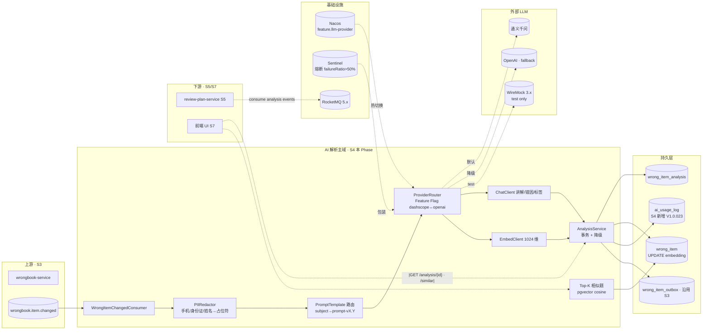
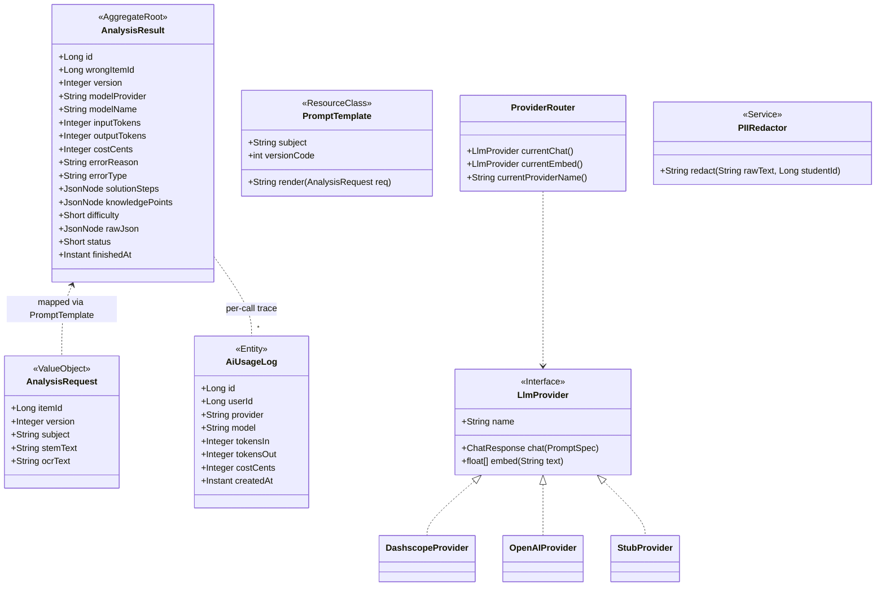
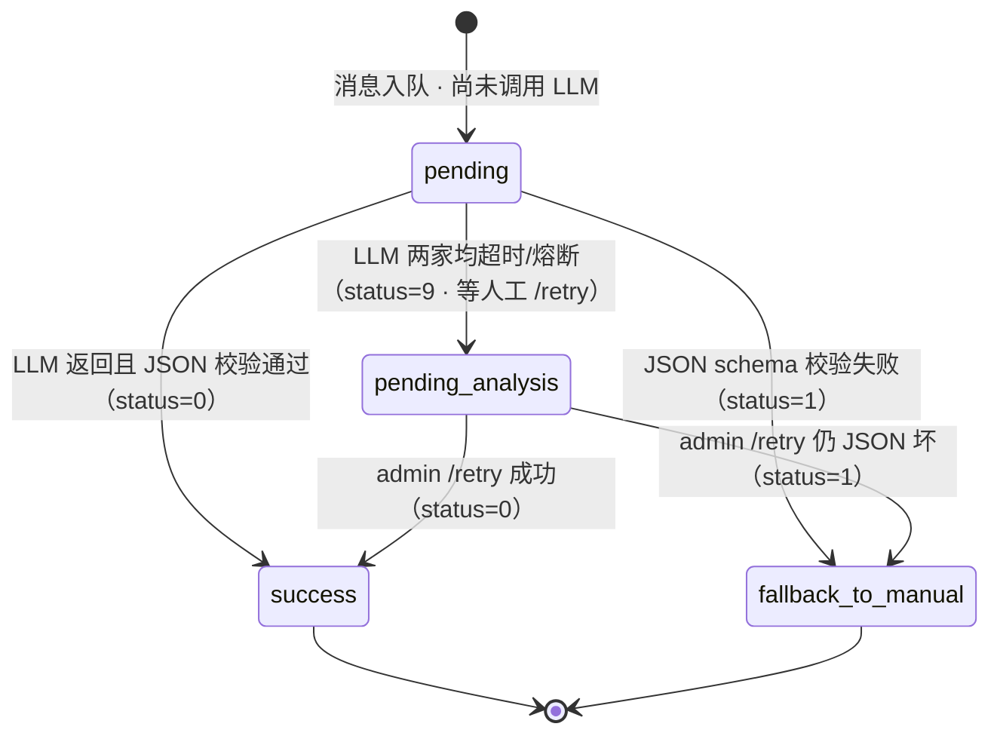
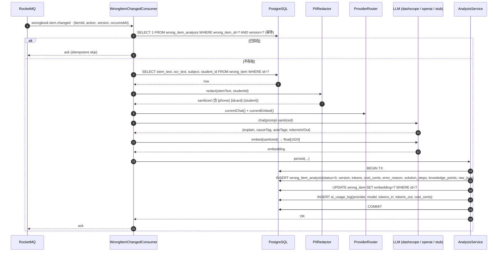
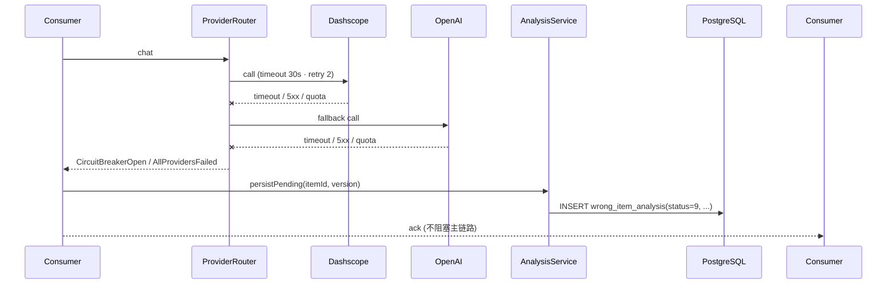
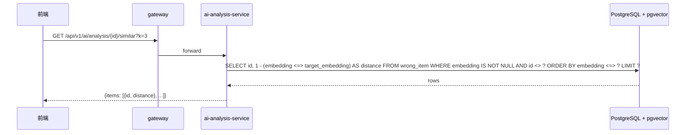

# S4 · AI 解析服务架构文档（ai-analysis-service）

**定位**：本文件是 S4 Phase 代码符号的唯一真源（§1.7 规则 B）。G-Biz 通过后 Builder 方可启动 §2-§6 架构设计；G-Arch 通过后方可进入落地计划 §8.7 AI 执行步骤。

## 0. 业务架构图（Business Architecture · 锚点 #0-业务架构图）



## 1. 业务理解（0.1 段 · G-Biz 绑定）

### 1.1 业务范围（≤ 300 字）

本 Phase 实现 ai-analysis-service：消费 `wrongbook.item.changed` 事件后调用 LLM 产出①讲解 / ②错因归类（5 类：概念/计算/审题/书写/其他）/ ③自动标签（≤5）/ ④嵌入向量（1024 维 · UPDATE `wrong_item.embedding`）/ ⑤Top-3 相似题（pgvector 余弦）。双 provider（dashscope + openai · Feature Flag `feature.llm-provider`）· PII 脱敏（手机 / 身份证 / 学生姓名 → 占位符）· Sentinel 熔断 + 流控 · 成本上报 `ai_usage_log`（V1.0.023 · V1.0.020 已被 S3 占用 · 本 Phase 重号）· LLM 失败降级 `status=pending_analysis` 不阻塞主链路。**不负责**：错题录入（S3）/ 复习排期（S5）/ 匿名（S11）/ UI（S7）。

### 1.2 假设清单（S1/S3-aligned vs 计划漂移标注）

| 编号 | 假设 | 依据 | 状态 |
|---|---|---|---|
| A1 | prompt 版本化走 Git · 文件 `src/main/resources/prompts/subject-<subj>-v<N>.md` · 内嵌 `PROMPT_VERSION` 常量 | 计划 §8.1 A1 · ADR 0012 候选 | 待 User 确认 |
| A2 | LLM 返回 JSON 解析失败 → `status='fallback_to_manual'`（DDL 数值码 9 · Q-R1 待确认）· ack MQ 不入死循环 | 计划 §8.1 A2 | Round-1 Q1 |
| A3 | PII 脱敏覆盖：**手机号 + 身份证 + 学生姓名**（不含学校名）· 正则 + `user_account.username` 反查 | 计划 §8.1 A3 | 待 User 确认 |
| A4 | Provider 路由：默认 dashscope · 超时/配额/熔断后 fallback openai · 两家皆败 → pending_analysis | 计划 §8.1 A4 | 待 User 确认 |
| A5 | `ai_usage_log` 按次数 + token 双维度 · 每次调用 1 行 · `tokens_in/out/cost_cents` · 单价走 `docs/ai-pricing.yaml` | 计划 §8.1 A5 | 待 User 确认 |
| A6 | 成本告警：日累计 cost_cents > 10000 触发 Sentinel 降级 · 保 embedding 舍讲解/错因 | 计划 §8.1 A6 | Round-2 备选 |
| A7 | WireMock 桩仅 test scope · `@Profile("test")` 隔离 | 计划 §8.1 A7 | 待 User 确认 |
| A8 | PII-redacted `sanitized` 是 LLM 唯一输入 · WireMock IT 断言 request body 有 `{phone}` 无 `13800138000` | 计划 §8.1 A8 | 待 User 确认 |
| A9 | 幂等键 = `(wrong_item_id, version)` · 沿用 S1 DDL `uq_analysis_version`（drift：计划 §8.1 A9 字符串 `prompt_version`，DDL 用 INT `version`） | **S1 DDL 权威** | **drift · Round-1 Q2** |
| A10 | LLM 超时 30s · 重试 2 次 · consumer 线程级总预算 90s | 计划 §8.1 A10 | 待 User 确认 |
| A11 | Embedding 固定 1024 维 · dashscope `text-embedding-v2` 或 openai `text-embedding-3-small` 截断 | 计划 §8.1 A11 | 待 User 确认 |
| A12 | 相似题 k=3 · cosine ∈ [0,2] · 超过 1.5 视为不够相似返回空 | 计划 §8.1 A12 | 待 User 确认 |
| A13 | 真实 LLM 调用需外部 API Key · **本 Phase IT 全走 WireMock 桩 · 生产部署另注入 External Secrets** | AI 的工程现实 | **Round-1 Q3** |

### 1.3 漂移登记（plan vs S1/S3）

| ID | 漂移项 | 计划文字 | 实际 | 决议 |
|---|---|---|---|---|
| **DA** | 迁移编号 | V1.0.020__ai_usage_log.sql | V1.0.020 已被 S3 用（wrong_item_version） | **重号为 V1.0.023** |
| **DB** | analysis version 类型 | `prompt_version` 字符串 | S1 DDL `version INT` | Round-1 Q2 |
| **DC** | analysis status 表示 | success/fallback_to_manual/pending_analysis 字符串 | S1 DDL SMALLINT CHECK IN (0,1,9) | Round-1 Q1 |
| **DD** | explainText 字段 | 计划命名 `explainText` | S1 DDL 有 `error_reason TEXT` + `solution_steps JSONB`；无独立讲解列 | Builder 方案：讲解存 `error_reason`（文本）· solutionSteps 存分步（若 LLM 给出）· 原始 `raw_json` 保真 |
| **DE** | autoTags | 计划 `autoTags[]` | S1 DDL `knowledge_points JSONB` | Builder 方案：autoTags 序列化入 `knowledge_points` |
| **DF** | Spring AI 1.0.0-M1 可用性 | 计划指定 | Milestone 版本 · 可能需要 Spring Boot 3.2+（已满足）· 可能下载慢 | Builder 方案：尽量用 Spring AI；不可用则退到薄 Feign 客户端 · 记 ADR 0014 |
| **DG** | Sentinel vs Resilience4j | 计划备注（§8.4）改用 Sentinel | S3 未引入 | **采 Sentinel**（sentinel-starter 已在 spring-cloud-alibaba 依赖中） |

### 1.4 歧义与缺口（必须 User 回答）

- **Round-1 Q1 · DC 漂移**：analysis status 数值映射
  - (a) 0=success · 1=fallback_to_manual · 9=pending_analysis（推荐 · 与 S1 DDL CHECK IN(0,1,9) 吻合）
  - (b) 0=pending · 1=success · 9=fallback_to_manual
  - (c) User 另定
- **Round-1 Q2 · DB 漂移**：version 列表示
  - (a) 用 `version INT` + 服务内常量 `PROMPT_VERSION_CODE = 1`（prompt-v1.0 = 1）· 每升级 prompt 集体 +1（推荐 · 与 S1 DDL 吻合）
  - (b) 新增 migration 把 `version` 改成 `VARCHAR` · 存 "prompt-v1.0" 字符串（破坏性 · 需 ADR）
  - (c) 新增 `prompt_version VARCHAR(16)` 列 并保留原 `version INT` 自增 · 两者并存
- **Round-1 Q3 · A13 现实约束**：是否要求真实 LLM 调用在本地可跑通？
  - (a) 不要求 · IT 全走 WireMock 桩 · 真实调用留 staging/生产（推荐 · 符合计划 A7 + 本地无 API Key 现实）
  - (b) 要求 · User 注入 `AI_API_KEY` 并打开一个 provider 跑 1-2 次冒烟 · 记成本
- **Round-1 Q4 · 重试策略（计划 §8.1 Q3）**：`pending_analysis` 后的重试
  - (a) 仅管理员 `POST /analysis/{itemId}/retry` 手动（推荐 · 最小实现）
  - (b) 自动 job · 每 4h 一次 · 24h 放弃
  - (c) 本 Phase 不做自动 · 留 S10
- **Round-2 Q5**（计划 §8.1 Q1）：provider 分配策略
  - (a) 默认 dashscope · fallback openai（不按学科）
  - (b) 按学科路由（数学/物理 dashscope · 英语 openai）
  - (c) 动态按成本（看剩余日预算）
- **Round-2 Q6**（计划 §8.1 Q4）：prompt 升级回溯
  - (a) 不回溯（推荐 · 节约成本 · 新增按新版 · 批量重跑独立 job）
  - (b) 自动回溯所有 `status=success` 的历史记录
- **Round-2 Q7**（计划 §8.1 Q5）：PII 漏网处置
  - (a) WireMock IT 抓到原始 PII → 立即 fail + block CI（推荐 · 安全红线）
  - (b) 记录 + 继续 · 不 block

### 1.5 业务规则（基于 S1/S3 DDL）

- `wrong_item_analysis` FK → `wrong_item` ON DELETE RESTRICT · 删除错题前必须清空其分析
- `uq_analysis_version` 保证 `(wrong_item_id, version)` 唯一 · 幂等键
- `status=0` 为成功 · `status=1` 为 fallback 人工 · `status=9` 为 pending 降级（本 Phase 的 Q1 决议落地）
- `ai_usage_log` 仅 INSERT · 无 UPDATE/DELETE · 滚动清理走 S10
- LLM 请求 body 永远不含原始 PII · IT 断言

### 1.6 G-Biz 签字记录

- [ ] `biz_gate: approved`
- [ ] `biz_approved_by: @____`
- [ ] `biz_approved_at: ____`
- [ ] Round-1/2 回答写入 `special_requirements`
- [ ] 漂移 DA-DG User 过目
- [ ] PR description 含 `/biz-ok`

---

## 2. 领域模型（Domain Model）

### 2.1 类图



### 2.2 状态机（stateDiagram-v2）



### 2.3 不变量

| ID | 不变量 | 位置 |
|---|---|---|
| INV-01 | `(wrong_item_id, version)` 唯一 | S1 DDL `uq_analysis_version` |
| INV-02 | `version >= 1` | S1 DDL `ck_analysis_version` |
| INV-03 | `status ∈ {0,1,9}` | S1 DDL `ck_analysis_status` |
| INV-04 | LLM 请求 body 永不含原 PII | `PIIRedactor.redact` + IT 断言 |
| INV-05 | embedding 写回维度 = 1024 | `EmbedClient.EMBED_DIM` |
| INV-06 | 每次 LLM 调用一行 `ai_usage_log` | `AnalysisService` 事务内 append |
| INV-07 | API Key 不出现在任何源码 / yml | grep 规则 + allowlist deny |

## 3. 数据流（Data Flow）

### 3.1 主路径（consumer 成功）



### 3.2 降级路径（双 provider 都失败）



### 3.3 相似题查询



## 4. 事件与契约（Events & Contracts）

### 4.1 HTTP API · 5 端点 OpenAPI 3.0 片段

> **修订记录** · 2026-04-27 · @allenthinking 决议（contract-gaps G-01 / G-02）：
> - G-01：新增 `GET /analysis/{itemId}/stream` SSE 端点 · 与 REST JSON 端点并存
> - G-02：`SimilarItem` schema 字段对齐前端 api-contracts（`{id:string, stem_text, subject, distance}`）

```yaml
paths:
  /analysis/{itemId}:
    get:
      summary: 取单个错题的最新分析（max version）· REST JSON
      parameters:
        - { in: path, name: itemId, required: true, schema: { type: integer } }
      responses:
        '200': { description: OK, content: { application/json: { schema: { $ref: '#/components/schemas/AnalysisVO' } } } }
        '404': { description: Not analyzed yet (无记录或仅 status=9 pending) }
  /analysis/{itemId}/stream:
    get:
      summary: 流式回放讲解文本（SSE · 仅读已存数据，不旁路 MQ 触发分析）
      description: |
        Server-Sent Events 端点 · Content-Type: text/event-stream
        · status=0 → 分块推送 wrong_item_analysis.error_reason · 末帧 done:true
        · status=1 → 单帧 chunk='当前题目暂未生成解析，请稍后重试' + done:true
        · status=9 → 单帧 chunk='正在分析中，请稍后查看' + done:true
        · 未存（无记录）→ 单帧 chunk='尚未分析' + done:true · HTTP 仍 200（SSE 不应中途 4xx）
      parameters:
        - { in: path, name: itemId, required: true, schema: { type: integer } }
      responses:
        '200':
          description: SSE 流 · 每帧 data 为 ExplainChunk JSON
          content:
            text/event-stream:
              schema: { $ref: '#/components/schemas/ExplainChunk' }
  /analysis/{itemId}/retry:
    post:
      summary: 管理员重放（绕过幂等 · version+1）
      responses:
        '202': { description: Accepted · 已入队 }
        '403': { description: 非管理员 }
        '404': { description: wrong_item 不存在 }
  /analysis/provider:
    get:
      summary: 当前 LLM provider 名称（反查 Feature Flag）
      responses:
        '200': { description: OK, content: { application/json: { schema: { type: object, properties: { provider: { type: string, enum: [dashscope, openai, stub] } } } } } }
  /analysis/{itemId}/similar:
    get:
      summary: Top-K 相似题
      parameters:
        - { in: path, name: itemId, required: true, schema: { type: integer } }
        - { in: query, name: k,     schema: { type: integer, default: 3, maximum: 10 } }
      responses:
        '200': { description: OK, content: { application/json: { schema: { type: object, properties: { items: { type: array, items: { $ref: '#/components/schemas/SimilarItem' } } } } } } }
        '404': { description: embedding 未生成 · 建议先 /retry }
components:
  schemas:
    AnalysisVO:
      type: object
      required: [id, wrong_item_id, version, model_provider, status]
      properties:
        id:             { type: string,  description: "Snowflake-Long → string" }
        wrong_item_id:  { type: string }
        version:        { type: integer, description: "PROMPT_VERSION_CODE" }
        model_provider: { type: string, enum: [dashscope, openai, stub] }
        model_name:     { type: string }
        status:         { type: string, enum: [success, fallback, pending], description: "由 SMALLINT 0/1/9 序列化映射" }
        explain:        { type: string, description: "讲解文本 · DB 字段 error_reason（漂移 DD 决议）" }
        cause_tag:      { type: string, enum: [CONCEPT, CALCULATION, COMPREHENSION, HANDWRITING, OTHER] }
        auto_tags:      { type: array, items: { type: string }, description: "DB 字段 knowledge_points（漂移 DE 决议）" }
        solution_steps: { type: object, description: "JSONB 透传" }
        finished_at:    { type: string, format: date-time }
    SimilarItem:
      type: object
      required: [id, stem_text, subject, distance]
      properties:
        id:        { type: string,  description: "Snowflake-Long → string · 与 S3 WrongItemVO.id 风格一致" }
        stem_text: { type: string,  description: "题干原文（用于前端列表项直渲，避免 N+1）" }
        subject:   { type: string,  description: "math/physics/chemistry/english/chinese" }
        distance:  { type: number,  description: "1 - cosine_similarity · 范围 [0, 2] · 仅返回 ≤ 1.5 项" }
    ExplainChunk:
      type: object
      required: [chunk]
      properties:
        chunk:     { type: string,  description: "一段 explain 文本" }
        done:      { type: boolean, description: "末帧 true · 触发前端 es.close()" }
```

### 4.2 RocketMQ Topic

- 订阅：`wrongbook.item.changed`（S3 发布 · consumer group `ai-analysis-cg`）
- 发布：**本 Phase 不再发独立事件**（原计划 `wrongbook.similar.requested` 暂不实现 · 相似题是同步查询 · 若后续 S8 洞察需要，再补 outbox · 记 ADR 0014 简化）

### 4.3 Prompt 契约

每份 prompt 模板文件（`src/main/resources/prompts/subject-<subject>-v<N>.md`）头部 YAML front matter 必须包含：

```yaml
---
prompt_version: v1.0          # 必须 · 与 PROMPT_VERSION_CODE 映射（v1.0=1）
prompt_version_code: 1        # 必须 · INT · 写入 wrong_item_analysis.version
subject: math                 # 必须 · math/physics/chemistry/english/chinese
output_schema:                # 必须 · JSON Schema 内嵌
  type: object
  required: [explain, causeTag, autoTags]
  properties:
    explain:   { type: string, maxLength: 600 }
    causeTag:  { type: string, enum: [CONCEPT, CALCULATION, COMPREHENSION, HANDWRITING, OTHER] }
    autoTags:  { type: array, items: { type: string }, maxItems: 5 }
---
<prompt body · 用 {{stemText}} / {{subject}} 占位符·调用前 PIIRedactor 脱敏>
```

LLM 返回 JSON 必须通过 `output_schema` 校验，否则落 `status=1 (fallback_to_manual)`。

### 4.4 PII 红线

- 手机号正则 `1[3-9]\d{9}` → `{phone}`
- 身份证正则 `\d{17}[\dX]` → `{idcard}`
- 学生姓名：从 `user_account.username` 反查 → `{student}`

IT 的 `PIIRedactorAssertion` 断言 LLM 请求 body 含占位符且不含原 PII 原始字符串。

### 4.5 新增 migration（S4 本 Phase）

| Version | File | 变更 |
|---|---|---|
| V1.0.023 | `ai_usage_log.sql` | CREATE TABLE · id BIGSERIAL · user_id · provider · model · tokens_in/out · cost_cents · created_at |

## 5. 非功能指标（Non-Functional Requirements）

### 5.1 SLO

| 维度 | 目标 |
|---|---|
| LLM 端到端 P95 | ≤ 10s |
| LLM 端到端 P99 | ≤ 25s |
| 可用性 | 99.5%（LLM 外部依赖 · 降级可用性兜底） |
| 消费延迟 P95 | ≤ 15s（MQ 入队 → analysis 写入） |
| PII 泄漏次数 | 0 · 任意 IT 抓到原始 PII 立即 fail + block CI |

### 5.2 容量

- QPS 峰值 5 / provider（Sentinel 限流 QPS=10 冗余）
- consumer 并发 `consumeThreadMax=16`
- LLM 总预算：日累计 cost_cents < 10000（$100 等值）· 超限 Sentinel 降级保 embedding · 舍 chat

### 5.3 超时 + 重试

- LLM 超时 30s · Spring 侧 `Duration.ofSeconds(30)` · 重试 2 次
- Sentinel 熔断 failureRatio > 50% · 滑窗 10s · 最小调用 5
- consumer 线程级总预算 90s（worst-case 3 × 30s）

### 5.4 隐私 / 合规

- LLM 请求 body PII-free（IT 双重断言：PIIRedactorUT + WireMock 回放断言）
- `ai_usage_log` 不记 stemText 原文
- `ai_usage_log` 90 天滚动清理（scheduler 留 S10）

## 6. 外部依赖（External Dependencies）

| 依赖 | 版本 | 降级 | 超时 | 重试 |
|---|---|---|---|---|
| Spring AI (openai / dashscope) | 1.0.0-M1 | 若 milestone 拉不下 → 退 Feign 客户端 · ADR 0014 | 30s | 2 |
| PostgreSQL + pgvector | 16 + 0.6 | HikariCP min=5 max=20 | 10s query | 0 |
| RocketMQ | 5.1.4 (plan) / 5.3.1 (local drift) | 降级 outbox（S3 通道） | 3s | 2 |
| Nacos | 2.3 | 本地 bootstrap.yml 兜底 | 3s | 0 |
| Sentinel | 2023.0.1.0 | 规则来源 file-ds · 失败可 fallback 本地 | - | - |
| WireMock | 3.x | test scope only | - | - |
| External Secrets | K8s / dev .env | AI_API_KEY · 明文禁现源码 | - | - |

## 7. ADR 候选

- **ADR 0011** · dashscope 默认 · openai fallback（本 Phase 新立 · 理由：国内稳定 + 中文语义 + 成本）
- **ADR 0012** · prompt 版本化走 Git（本 Phase 新立 · PR review · 回滚走 git revert）
- **ADR 0014** · Spring AI 1.0.0-M1 不可用时的退路：Feign 直连 + Sentinel 包装（条件性 · 构建失败时触发）
- **ADR 0015** · `wrongbook.similar.requested` 发布简化为同步查询 · 若后续 S8 洞察再补异步事件
- 引用 ADR 0002 · Outbox over Seata
- 引用 ADR 0006 · JPA + QueryDSL over MyBatis（硬绑定）
- 引用 ADR 0008 · Spring AI over LangChain4j（硬绑定）

## 8. 符号清单（Symbol Registry · G-Arch 硬门禁兜底）

本节穷举本 Phase 引入的所有代码符号 · `check-arch-consistency.sh` 严格模式会匹配代码改动中出现的 class/interface/API 路径名到本文件中（§1.7 规则 C）。

**聚合 / 实体**：`WrongItemAnalysis` · `AiUsageLog` · `ItemChangedEvent`

**Provider & LLM**：`LlmProvider` · `HttpLlmProvider` · `StubProvider` · `ProviderRouter` · `NoProviderException` · `AllProvidersFailedException` · `LlmCallException` · `LlmTransportException`

**Service**：`AnalysisService` · `PIIRedactor` · `PromptTemplates`

**MQ**：`WrongItemChangedConsumer`

**Controller**：`AnalysisController` · `HealthController`

**Repository**：`WrongItemAnalysisRepository` · `AiUsageLogRepository`

**Config**：`LlmConfig` · `OpenApiConfig`

**Support**：`SnowflakeIdGenerator`

**Application**：`Application`

**Test 支撑**：`AiAnalysisIntegrationTestBase` · `AnalysisE2EIT` · `MockMvcSmokeIT` · `PIIRedactorTest` · `TestStubs` · `StubHandle` · `Endpoint` · `ChatResponse` · `EmbedResponse` · `CapturedMessage` · `BodyBuilder` · `ChatParser` · `EmbedParser`

**REST paths** (5 domain + 2 probe · 2026-04-27 修订加入 /stream SSE)：
- `GET /analysis/{itemId}` · REST JSON
- `GET /analysis/{itemId}/stream` · SSE · text/event-stream
- `POST /analysis/{itemId}/retry`
- `GET /analysis/provider`
- `GET /analysis/{itemId}/similar`

**RocketMQ topics**：订阅 `wrongbook.item.changed`（S3 发布）

**SQL 表**：新增 `ai_usage_log`（V1.0.023）· 写 `wrong_item_analysis`（S1 V1.0.012）· UPDATE `wrong_item.embedding`
