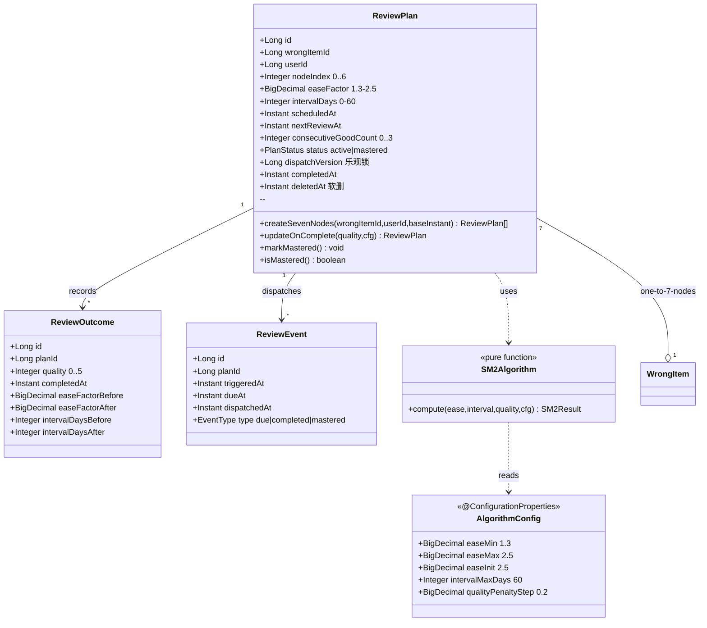
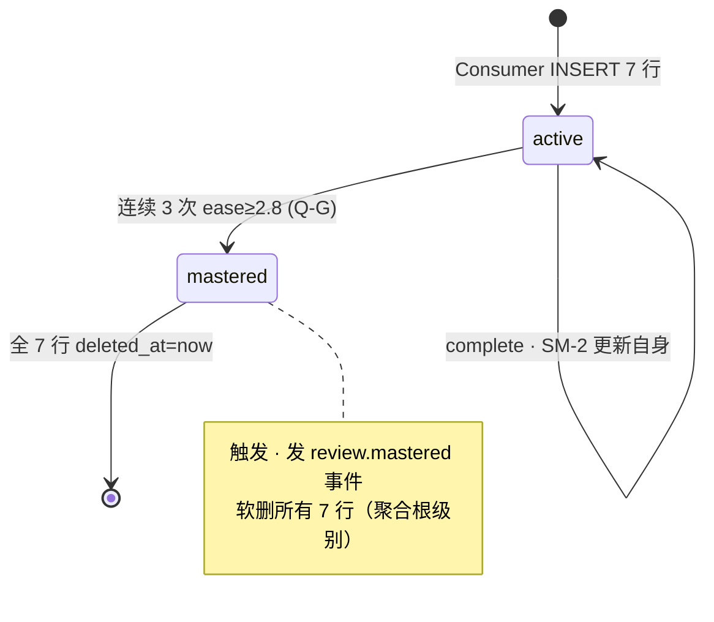
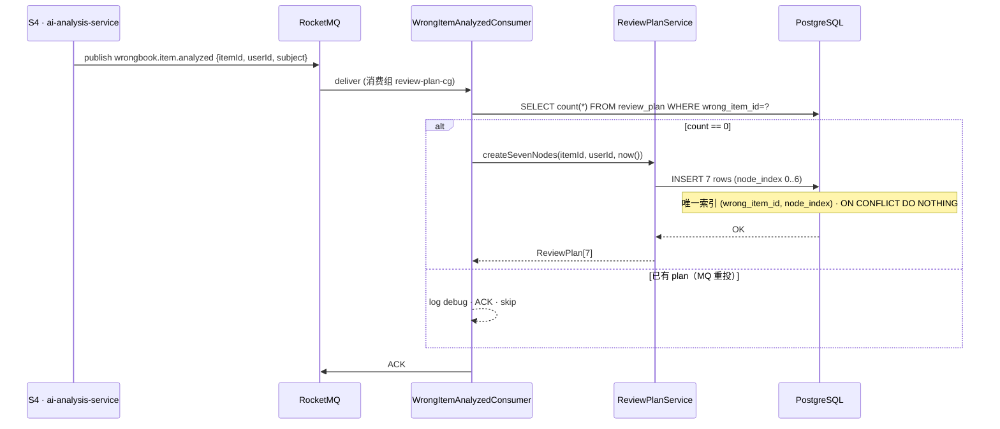
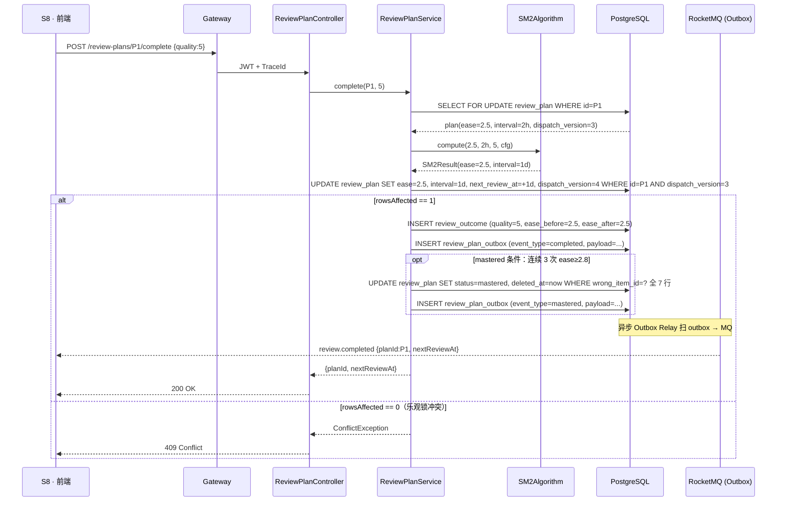
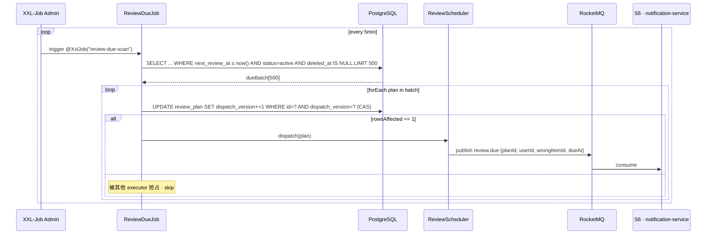
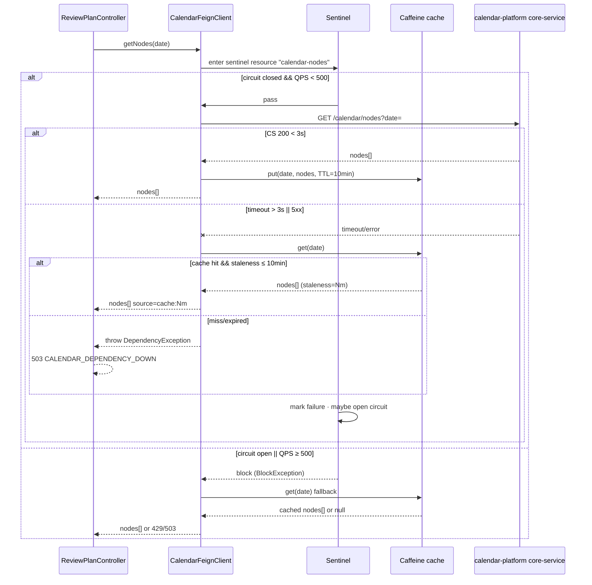

# S5 · review-plan-service 架构

> **G-Biz 已 approved @ 2026-04-23T18:00** · §9.1 业务理解闭环完成。
> **G-Arch 待办**：本文件 §1-6 节（领域模型 / 数据流 / 事件契约 / NFR / 外部依赖 / ADR 候选 · 含按 AC 分节五行齐全）在 §25 Playbook Step 7（Planner 切卡）前必须补完 · 打 `s5-arch-frozen` tag。

## 0. 业务架构图（Business Architecture · G-Biz 产物）

### 业务范围摘要（≤ 300 字）

S5 `review-plan-service` 实现 AI 错题本的复习计划调度：消费 S4 产出的 `wrongbook.item.analyzed` 事件后，对每条错题幂等 **INSERT 7 行 `review_plan`**（`node_index 0..6` · 艾宾浩斯偏移 `[2h, 1d, 2d, 4d, 7d, 14d, 30d]`）· 每行独立持有 `ease_factor=2.5` + `interval_days`（**节点独立 SM-2 · Q-B/F**）。由 XXL-Job 每 5 分钟扫 `next_review_at ≤ now()` 的行 · 经 Feign 发 `review.due` 事件给 notification-service。用户完成复习后 `POST /review-plans/{id}/complete {quality: 0-5}` · 同事务调 `SM2Algorithm.compute`（**quality<3 reset 到 2.5 · Q-C**）更新当前节点行 + 写 `review_outcome` + 乐观锁（`dispatch_version`）+ 发 `review.completed` 事件。连续 3 次 `ease≥2.8` 触发 mastered（**Q-G**）· 软删所有 7 行 + 发 `review.mastered`。对 calendar-platform `core-service` 的 Feign 调用走 Sentinel 熔断 + Caffeine 10min cache（**Q-G SC-10.AC-1**）。时间戳统一 UTC 存储 · 前端按 `user_profile.timezone` 换算（**Q-E**）。

本 Phase **不负责**：错题录入（S3）· AI 解析（S4）· 通知推送（notification-service via S6）· 前端 UI（S7/S8）· 匿名态（S11）· 家长监督聚合视图（S5 仅提供 GET /review-stats · S8 做视图）。

### 业务架构图（Mermaid `flowchart`）

```mermaid
flowchart LR
  subgraph 外部["外部服务"]
    S4[S4 · ai-analysis-service]
    S6[S6 · notification-service]
    S8[S8 · 前端复习/学情 UI]
    CAL[calendar-platform · core-service]
  end

  subgraph S5["S5 · review-plan-service"]
    CONS[WrongItemAnalyzedConsumer<br/>幂等 INSERT 7 行]
    SVC[ReviewPlanService<br/>createSevenNodes / complete]
    ALGO[SM2Algorithm<br/>纯函数 · quality<3 reset]
    JOB[ReviewDueJob<br/>@XxlJob · 5min · 乐观锁]
    CTL[ReviewPlanController<br/>5 API 端点]
    FEIGN[CalendarFeignClient<br/>+ Sentinel + Caffeine]
  end

  subgraph DB["S1 · PostgreSQL"]
    RP[(review_plan<br/>7 行/错题)]
    RE[(review_event)]
    RO[(review_outcome)]
    OBX[(review_plan_outbox<br/>ADR 0005)]
  end

  subgraph MQ["RocketMQ 5.1"]
    T1[wrongbook.item.analyzed]
    T2[review.due]
    T3[review.completed]
    T4[review.mastered]
  end

  S4 -- "event" --> T1
  T1 --> CONS
  CONS --> SVC
  SVC --> RP
  SVC --> ALGO

  JOB --> RP
  JOB -- "due 节点" --> T2
  T2 --> S6

  S8 -- "POST complete" --> CTL
  CTL --> SVC
  SVC --> RO
  SVC --> RE
  SVC -- "Outbox" --> OBX
  OBX -- "反投" --> T3
  T3 --> S8
  SVC -- "连续 3 次 ease≥2.8" --> T4
  T4 --> S8

  S8 -- "GET /review-plans?date=" --> CTL
  S8 -- "GET /review-stats?range=" --> CTL

  CTL --> FEIGN
  FEIGN -- "GET /calendar/nodes" --> CAL

  classDef critical fill:#fee,stroke:#c66;
  class CONS,SVC,FEIGN critical;
```

**图注**（与 business-analysis.yml ac_coverage 对齐）：
- **SC-07.AC-1**（critical · 消费者幂等）：S4 → `T1` → `CONS` → 7 行 `RP`
- **SC-07.AC-2**：`ALGO` 纯函数（被 `SVC` 调用）
- **SC-08.AC-1**（critical · 复习主循环 · 乐观锁）：S8 → `CTL` → `SVC` → `RP`/`RO`/`RE`/`OBX` → `T3`/`T4`
- **SC-09.AC-1**：`CTL` GET /review-stats · JPA 聚合 `RE`/`RO`
- **SC-10.AC-1**（critical · Feign 雪崩防护）：`CTL` → `FEIGN` → `CAL` · 熔断 + 10min cache

### 假设清单（A1-A10 · 见落地计划 §9.1 · 已 User /biz-ok）

| # | 假设 | 对应 Q 决策 |
|---|---|---|
| A1 | 消费 `wrongbook.item.analyzed` → 7 行 `review_plan` · 偏移 `[2h,1d,2d,4d,7d,14d,30d]` | Q-B/D |
| A2 | 7 行每行独立 `ease/interval` · 节点独立 SM-2 · complete 只 UPDATE 当前行 | Q-F |
| A3 | XXL-Job `review-due-scan` 5min 周期 · 批 500 · 乐观锁 `dispatch_version` | §9.0.5 AC-4（原 SC-06.AC-4 · 映射为 SC-07 内部细节 · 不独立 AC） |
| A4 | `review_outcome.quality` 0-5 分 · 前端映射 4 档 | §9.1 A4 |
| A5 | `complete` 同事务重算 · 不走异步 | §9.1 A5 |
| A6 | 每错题至多 1 套 7 行 · 唯一索引 `(wrong_item_id, node_index)` · mastered 软删全部 7 行 | Q-B/G |
| A7 | Feign 调 wrongbook/calendar 走 Sentinel 熔断 · 降级占位 `{subject:"unknown", ...}` / Caffeine 10min cache | Q-G SC-10.AC-1 |
| A8 | XXL-Job HA 走数据库锁（内置）· 不 Redisson | §9.1 A8 |
| A9 | 不跨天合并提醒 · 每节点单独发 · 聚合在 S8 前端做 | §9.1 A9 |
| A10 | `review_event` 保留 180 天 · 归档 job 不在本 Phase | §9.1 A10 |

### 歧义与缺口（Q1-Q3 · 已 User /biz-ok）

| # | 歧义 | Q 决策 |
|---|---|---|
| Q1 | SM-2 quality<3 时 ease_factor reset vs 保留 | **Q-C · reset 到 2.5**（SM-2 论文标准） |
| Q2 | T0 节点首次复习时刻 | **Q-D · 创建后 2 小时**（按用户 timezone） |
| Q3 | 跨时区每日定义 | **Q-E · user_profile.timezone**（默认 Asia/Shanghai） |

### G-Biz 签字记录

- [x] `design/arch/s5-review-plan.md` front matter `biz_gate: approved` · 签字于 front matter
- [x] `biz_approved_by: @allen` · `biz_approved_at: 2026-04-23T18:00:00+08:00`
- [x] 假设 A1-A10 已 User 过目（批量 via Q-B/D/F/G 决策）
- [x] 歧义 Q1-Q3 已 User 回复（Q-C/D/E 决策）
- [x] 额外 Q-A（SC 归属）· Q-G（mastered 阈值）· Q-H（Oracle 签字模式）决策
- [ ] **User /biz-ok**（在 PR description 或直接回复确认 · 解锁 §9.2 G-Arch 阶段）

---

## 1. 领域模型（Domain Model）

### 1.1 类图（Mermaid classDiagram）



### 1.2 状态机（stateDiagram-v2）



### 1.3 聚合根不变量（Aggregate Invariants）

- **I-1**：一条 `wrong_item` 同时至多 1 套 7 行 `review_plan`（唯一索引 `(wrong_item_id, node_index)` where `deleted_at IS NULL`）
- **I-2**：每行 `ease_factor ∈ [1.3, 2.5]` 且 `interval_days ∈ [0, 60]`（`AlgorithmConfig` guard-rail）
- **I-3**：`status=mastered` 的行 `deleted_at` 必非空；`status=active` 的行 `deleted_at` 必空
- **I-4**：任意 `complete` 只 UPDATE `node_index=当前节点` 的单行 · 不级联后续节点（Q-F）
- **I-5**：触发 mastered 时一次性更新所有 7 行 status=mastered + deleted_at + 发 1 条 review.mastered 事件（Q-G · 聚合根原子性）

### 1.4 按 AC 分节五行（v1.8 § 1.5 约束 #13 · G-Arch 硬前提）

#### AC: SC-07.AC-1 · Consumer 幂等 INSERT 7 行

- **API**：内部 `WrongItemAnalyzedConsumer.onMessage(WrongItemAnalyzedEvent)` · 订阅 `topic: wrongbook.item.analyzed` · 消费组 `review-plan-cg`
- **Domain**：`ReviewPlanService.createSevenNodes(wrongItemId, userId, baseInstant)` → `ReviewPlan[7]` · 偏移 `[2h, 1d, 2d, 4d, 7d, 14d, 30d]` · 每行 `ease=2.5`
- **Event**：入 `wrongbook.item.analyzed {itemId, userId, subject, analyzedAt}` · 出无（内部幂等 INSERT）· 出站事件在 complete 阶段
- **Error**：`409 Conflict` 唯一索引冲突 → `ON CONFLICT DO NOTHING` · ACK · `review_plan_create_duplicate_total +1`；`wrong_item` 404 → ACK · log warn · `orphan_total +1`
- **NFR**：Consumer P95 ≤ 100ms（7 行 batchInsert）· QPS ≤ 50（S4 发事件速率上限）· DB 连接池占用 ≤ 2 conn/请求

#### AC: SC-07.AC-2 · SM2Algorithm 纯函数

- **API**：`SM2Algorithm.compute(BigDecimal ease, Integer interval, Integer quality, AlgorithmConfig cfg) → SM2Result(nextEase, nextInterval)` · `@Validated` quality ∈ [0, 5]
- **Domain**：`quality < 3` → `nextEase = cfg.easeInit(2.5)`, `nextInterval = 1`（reset · Q-C）；`quality ≥ 3` → `nextEase = clamp(ease + (0.1 - (5-q)*(0.08+(5-q)*0.02)), cfg.easeMin, cfg.easeMax)`, `nextInterval = min(cfg.intervalMaxDays, round(interval * nextEase))`
- **Event**：无（纯函数无副作用）
- **Error**：`IllegalArgumentException` for quality ∉ [0, 5] · `IllegalStateException` for ease ∉ [cfg.easeMin, cfg.easeMax]
- **NFR**：单次 ≤ 10ms（纯函数）· 无 IO · 无 allocation beyond `SM2Result`

#### AC: SC-08.AC-1 · POST complete + 乐观锁 + mastered

- **API**：`POST /review-plans/{id}/complete` body `{quality: 0-5}` · 返回 `200/{planId, nextReviewAt, easeFactorAfter}` 或 `404/409/410` · OpenAPI 见 §3.1
- **Domain**：`ReviewPlanService.complete(planId, quality)` 单事务：SELECT FOR UPDATE → `SM2Algorithm.compute` → UPDATE `review_plan SET ease_factor, interval_days, next_review_at, completed_at, dispatch_version+1 WHERE id=? AND dispatch_version=?` → INSERT `review_outcome` → Outbox INSERT `review_plan_outbox(event_type=completed)`。若命中 mastered 条件（连续 3 次 ease≥2.8） → UPDATE 所有 7 行 status=mastered + deleted_at · Outbox INSERT `review.mastered`
- **Event**：出 `review.completed {planId, quality, nextReviewAt, easeFactorAfter}` + 可选 `review.mastered {wrongItemId, masteredAt}` · 走 Outbox 事务消息（ADR 0005）· 消费方 S8
- **Error**：`404 PLAN_NOT_FOUND` / `400 INVALID_QUALITY (quality ∉ [0,5])` / `409 Conflict` 乐观锁冲突 / `410 PLAN_MASTERED`（已 mastered 再 POST）· GlobalExceptionHandler 统一回填 `ApiResult`
- **NFR**：P95 ≤ 200ms（单事务 · 含 SELECT FOR UPDATE + 2 条 UPDATE/INSERT + Outbox）· 409 率 ≤ 1%（并发高时需监控 · 超 1% 告警进 S10）· QPS ≤ 200

#### AC: SC-09.AC-1 · GET /review-stats 聚合 API

- **API**：`GET /review-stats?range={week|month|quarter}&subject={opt}` header `X-User-Timezone` → `200/[{date, correctRate, masteredCount, reviewCount}]` + 可选 `warnings[]`
- **Domain**：`ReviewStatsService.aggregate(userId, range, subject, timezone)` · JPA 聚合（ADR 0011）· `SELECT date(completed_at AT TIME ZONE ?) as d, count(quality>=3), count(status=mastered), count(*) FROM review_outcome JOIN review_plan ... GROUP BY d`
- **Event**：无（纯查询）
- **Error**：`400 INVALID_RANGE` (range ∉ [week, month, quarter]) · `400 INVALID_TIMEZONE` (ZoneId 非法 · 降级默认 Asia/Shanghai) · 响应 `warnings=[{code:PARTIAL_HISTORY}]` when range 跨 180d
- **NFR**：P95 ≤ 500ms · 10 万 review_event 行规模 · 命中 `(subject, completed_at)` 复合索引（S1 已建）· Caffeine L2 cache 5min TTL

#### AC: SC-10.AC-1 · Feign 调 core-service + Sentinel 熔断 + Caffeine

- **API**：`CalendarFeignClient.getNodes(date)` via Spring Cloud OpenFeign 4.1 · `@FeignClient(name="core-service", fallback=CalendarFeignClientFallback.class)` · `@GetMapping("/calendar/nodes")`
- **Domain**：`CalendarService.findNodes(date)` · `@SentinelResource(value="calendar-nodes", blockHandler="localCache", fallback="localCache")` · Caffeine cache TTL=10min / size=1000 · key 按 `(userId, date)`
- **Event**：无（Feign 同步调用）
- **Error**：core-service 超时 > 3s → circuit open · fallback `CalendarFeignClientFallback.getNodes` 返 Caffeine cache · 无 cache 且 core 断 → 上层 `/review-plans?date=` 返 `503 CALENDAR_DEPENDENCY_DOWN · source=unavailable`
- **NFR**：Sentinel QPS 阈值 500（超 429）· circuit breaker failureRatio > 50% 开熔 · 热身时间 10s · Caffeine hit rate ≥ 80% · P95 ≤ 50ms（含 cache 命中）

## 2. 数据流（Data Flow）

### 2.1 主路径 A · Consumer 消费 analyzed → 7 行 plan（SC-07.AC-1）



### 2.2 主路径 B · POST complete 单节点 + Outbox（SC-08.AC-1）



### 2.3 主路径 C · XXL-Job 扫 due → review.due 事件（support SC-07 节点驱动）



### 2.4 旁路 · Feign 调 calendar core-service + Sentinel 熔断（SC-10.AC-1）



## 3. 事件与契约（Events & Contracts）

### 3.1 HTTP API · 5 端点 OpenAPI 3.0 片段

```yaml
openapi: 3.0.3
info:
  title: review-plan-service
  version: 1.0.0
paths:
  /review-plans:
    get:
      summary: GET /review-plans · 日视图（SC-07 支撑）
      parameters:
        - { name: date, in: query, required: true, schema: { type: string, format: date } }
        - { name: subject, in: query, required: false, schema: { type: string } }
        - { name: X-User-Timezone, in: header, required: false, schema: { type: string, default: Asia/Shanghai } }
      responses:
        '200':
          description: 当日 due 节点 + calendar_node（来自 SC-10 Feign）
          content: { application/json: { schema: { $ref: '#/components/schemas/DayViewResp' } } }
        '503': { description: calendar-platform core-service 不可用且 cache 过期 · error_code=CALENDAR_DEPENDENCY_DOWN }
  /review-plans/{id}:
    get:
      summary: GET /review-plans/{id} · 单节点详情
      responses:
        '200': { content: { application/json: { schema: { $ref: '#/components/schemas/ReviewPlanDto' } } } }
        '404': { description: 不存在或已 mastered }
  /review-plans/{id}/complete:
    post:
      summary: POST complete · 复习主循环（SC-08.AC-1）
      requestBody:
        required: true
        content: { application/json: { schema: { type: object, properties: { quality: { type: integer, minimum: 0, maximum: 5 } }, required: [quality] } } }
      responses:
        '200': { content: { application/json: { schema: { $ref: '#/components/schemas/CompleteResp' } } } }
        '400': { description: INVALID_QUALITY }
        '404': { description: PLAN_NOT_FOUND }
        '409': { description: 乐观锁冲突 · 另一请求先成功 · 前端 retry 1 次 }
        '410': { description: PLAN_MASTERED · 已 mastered 软删 }
  /review-plans/batch-reset:
    post:
      summary: POST batch-reset · admin · 学期初清空（需 ROLE_ADMIN）
      security: [{ jwt: [] }]
  /review-stats:
    get:
      summary: GET /review-stats · 学情聚合（SC-09.AC-1）
      parameters:
        - { name: range, in: query, required: true, schema: { type: string, enum: [week, month, quarter] } }
        - { name: subject, in: query, required: false, schema: { type: string } }
        - { name: X-User-Timezone, in: header, required: false }
      responses:
        '200': { content: { application/json: { schema: { $ref: '#/components/schemas/StatsResp' } } } }
        '400': { description: INVALID_RANGE or INVALID_TIMEZONE }
components:
  schemas:
    ReviewPlanDto:
      type: object
      properties:
        id: { type: integer, format: int64 }
        wrongItemId: { type: integer, format: int64 }
        nodeIndex: { type: integer, minimum: 0, maximum: 6 }
        easeFactor: { type: number }
        intervalDays: { type: integer }
        nextReviewAt: { type: string, format: date-time }
        status: { type: string, enum: [active, mastered] }
    CompleteResp:
      type: object
      properties:
        planId: { type: integer, format: int64 }
        nextReviewAt: { type: string, format: date-time }
        easeFactorAfter: { type: number }
        mastered: { type: boolean, description: 是否本次触发 mastered }
    StatsResp:
      type: object
      properties:
        range: { type: string }
        subject: { type: string }
        data: { type: array, items: { type: object, properties: { date: {type: string, format: date}, correctRate: {type: number, nullable: true}, masteredCount: {type: integer}, reviewCount: {type: integer} } } }
        warnings: { type: array, items: { type: object, properties: { code: {type: string}, detail: {type: string} } } }
```

### 3.2 RocketMQ Topics · JSON Schema

| Topic | 方向 | Payload | 消费方 | Outbox |
|---|---|---|---|---|
| `wrongbook.item.analyzed` | 入 | `{itemId: long, userId: long, subject: string, analyzedAt: ISO8601}` | S5 Consumer | N/A（S4 自带） |
| `review.due` | 出 | `{planId: long, userId: long, wrongItemId: long, nodeIndex: int, dueAt: ISO8601}` | S6 notification-service | ADR 0005 兜底 |
| `review.completed` | 出 | `{planId: long, wrongItemId: long, userId: long, quality: int, nodeIndex: int, nextReviewAt: ISO8601, easeFactorAfter: number, mastered: bool}` | S8 前端 polling + S10 监控 | ADR 0005 兜底 |
| `review.mastered` | 出 | `{wrongItemId: long, userId: long, masteredAt: ISO8601}` | S8 前端 + S10 | ADR 0005 兜底 |

> **Note**：`design/analysis/_template.yml` 示例里的 `wrongitem.created` 是通用模板占位 topic（非 S5 入出站）· S5 入站实际为 `wrongbook.item.analyzed`（S4 out）· S5 不订阅也不生产 `wrongitem.created`。

**JSON Schema 示例（review.completed）**：

```json
{
  "$schema": "http://json-schema.org/draft-07/schema#",
  "title": "review.completed",
  "type": "object",
  "required": ["planId", "wrongItemId", "userId", "quality", "nodeIndex", "nextReviewAt", "easeFactorAfter", "mastered"],
  "properties": {
    "planId": { "type": "integer" },
    "wrongItemId": { "type": "integer" },
    "userId": { "type": "integer" },
    "quality": { "type": "integer", "minimum": 0, "maximum": 5 },
    "nodeIndex": { "type": "integer", "minimum": 0, "maximum": 6 },
    "nextReviewAt": { "type": "string", "format": "date-time" },
    "easeFactorAfter": { "type": "number", "minimum": 1.3, "maximum": 2.5 },
    "mastered": { "type": "boolean" }
  }
}
```

### 3.3 Feign 契约

- `WrongbookFeignClient@GET /wrongbook/items/{id}` · 查错题详情 · Sentinel 熔断 · 降级 `{subject:"unknown", stemText:"[降级]"}`
- `NotificationFeignClient@POST /notifications/review-due` · 由 `ReviewScheduler` 在 XXL-Job 内调用 · req `ReviewDueNotifyReq(planId, userId, subject, nextReviewAt)`
- `CalendarFeignClient@GET /calendar/nodes` · 属 common 模块 · `@FeignClient(name="core-service")` · Sentinel + Caffeine 10min cache（SC-10.AC-1）

### 3.4 DB Schema（基于 S1 DDL · 不改表）

- `review_plan`（已 S1 创建 · 字段见 §1.1 · 唯一索引 `(wrong_item_id, node_index) WHERE deleted_at IS NULL` 需 S5 确认 · 若 S1 未建 · 走 §6 ADR 补）
- `review_event`（已 S1 创建 · V1.0.018）
- `review_outcome`（**S5 新增 migration 需求** · 现 S1 未建 · 见 §6 ADR）
- `review_plan_outbox`（**S5 新增 migration 需求** · Outbox 兜底 · ADR 0005）

> ⚠️ **DB 漂移风险**：S1 DDL 仅含 `review_plan` + `review_event` · 未含 `review_outcome` + `review_plan_outbox` · S5 Planner 切卡时必须先落 V1.0.05X 迁移脚本（见 §6 ADR · G-Arch 阶段决策）

## 4. 非功能指标（Non-Functional Requirements）

### 4.1 SLO

| 指标 | 阈值 | 监控路径 |
|---|---|---|
| `SM2Algorithm.compute` P99 | ≤ 10ms（纯函数） | 单测性能断言 |
| `POST /review-plans/{id}/complete` P95 | ≤ 200ms | `review_complete_p95_ms` metric |
| `GET /review-plans?date=` P95 | ≤ 300ms（含 Feign 调 calendar） | `review_plans_get_p95_ms` |
| `GET /review-stats` P95 | ≤ 500ms（10 万 event 聚合） | `review_stats_p95_ms` |
| XXL-Job `review-due-scan` 单次执行 | ≤ 30s（批 500 × 12 批/min） | XXL-Job Dashboard |
| 复习通知时效（due → notification 收到） | ≤ 1min（5min 扫 + 30s 处理 + MQ 延迟） | 端到端 trace |
| Feign 调 calendar core-service P95 | ≤ 50ms（含 cache 命中 ≥80%） | `calendar_feign_p95_ms` |
| 乐观锁冲突率（complete 并发） | < 1% | `review_complete_conflict_total / review_complete_total` |

### 4.2 容量

- **DAU**：1 万 · 平均错题数 100/人 · 每错题 7 行 plan = 700 万行 `review_plan`
- **review_event**：每人每天 5 次 complete × 1 万 DAU × 180 天 = 900 万行（保留期 180d · A10）
- **review_outcome**：同 review_event 规模
- **review_plan_outbox**：每次 complete 1-2 条（completed + 可选 mastered）· 天 5 万条 · 保留 7d = 35 万行

### 4.3 可用性 & 降级

- **可用性**：99.9%（complete 路径依赖 DB + MQ Outbox 双通道 · 任一可用即不丢事件）
- **降级 1**：core-service 断 → Caffeine 10min cache → 过期返 503（`/review-plans?date=`）· 不硬崩（SC-10.AC-1）
- **降级 2**：wrongbook-service 断 → Feign 降级 `{subject:"unknown", stemText:"[降级]"}` · 日视图仍显示
- **降级 3**：RocketMQ 断 → Outbox 写入 · Relay 异步重发 · User complete 操作不受影响
- **降级 4**：XXL-Job Admin 断 → scan 停摆但不影响 complete 主循环（用户手动打开 app 也能看到 due · 前端可 poll）

### 4.4 成本

| 项 | 估算 |
|---|---|
| DB 存储（year 1） | `review_plan` 700 万 × 200B = 1.4GB · event+outcome 900 万 × 150B × 2 = 2.7GB · outbox 35 万 × 300B = 100MB · 合计 ≈ 4.2GB/年 |
| MQ 流量 | 每天 review.due 5 万 + completed 5 万 + mastered 1 万 = 11 万 msg/day · 每条 500B · 15MB/day · 5.5GB/年 |
| Nacos 配置 | AlgorithmConfig 动态下发 · 近 0 成本 |
| XXL-Job | 单 executor 2 实例 HA · 额外 2 台 1C2G VM（复用 K8s 资源池）|

## 5. 外部依赖（External Dependencies）

| 依赖 | 版本 | 用途 | 降级策略 |
|---|---|---|---|
| PostgreSQL | 16（S1 已搭） | review_plan / review_event / review_outcome / outbox | HA 主备 · S10 配 |
| pgvector | 0.6（S1 已搭） | N/A（S5 不用向量） | — |
| RocketMQ | 5.1 | 4 topic · 事务消息兜底（ADR 0005） | Outbox 持久化 · Relay 重发 |
| XXL-Job | 2.4.1（admin 独立部署） | `review-due-scan` 调度 · DB 锁 HA | 双 executor · 单 admin SPOF 影响 scan 不影响 complete |
| Spring Cloud OpenFeign | 4.1.x | 调 wrongbook / notification / calendar 3 个服务 | Sentinel 熔断 · fallback bean |
| Sentinel | 2023.0.1.0 | Feign 熔断 + 流控 | `@SentinelResource` 注解式 |
| Caffeine | 3.x（common 模块） | L1 cache · calendar-nodes 10min TTL | — |
| Nacos | 2.3 | AlgorithmConfig 动态下发 + 服务发现 | 静态兜底 `application.yml` 默认值 |
| calendar-platform core-service | 外部 | GET /calendar/nodes · 日历节点 | Sentinel + Caffeine · 断则降级 |

## 6. ADR 候选

### 6.1 本 Phase 新立 ADR

- **ADR 0013 · 采用 SM-2 而非纯 Ebbinghaus 固定间隔**
  - 动机：动态反馈闭环 · ease_factor 自适应 · 用户记忆强度个性化
  - 决策：7 行骨架（艾宾浩斯偏移 [2h,1d,2d,4d,7d,14d,30d]）+ 每行独立 SM-2 微调（Q-B/F 决策）
  - 替代方案：纯 Ebbinghaus（简单但不自适应）/ 纯 SM-2 单行（动态但 T0-T6 语义丢失）
  - 文献：SuperMemo SM-2 原论文 · Wozniak 1990
  - 引用：Q-C（quality<3 reset 到 2.5）

- **ADR 0014 · review_outcome + review_plan_outbox 表新增（S5 补 S1 漂移）**
  - 动机：S1 DDL 仅含 review_plan + review_event · S5 事务正确性需 outcome（审计）+ outbox（MQ 兜底）
  - 决策：S5 开 V1.0.053__review_outcome.sql + V1.0.054__review_plan_outbox.sql + V1.0.055__review_plan_mastered_index.sql（索引 `(wrong_item_id, node_index) WHERE deleted_at IS NULL` 若 S1 未建）
  - 替代方案：复用 review_event 存 outcome 数据（语义混乱）· 不用 Outbox 裸发 MQ（丢消息风险）
  - 风险：S1 DDL 漂移 · 走 Hotfix 模式（§26.2 条款 4 类推 · fix 独立 commit `[HOTFIX-S5-DB]`）

- **ADR 0015 · XXL-Job 2.4 vs Quartz/ElasticJob**
  - 动机：分布式调度 · HA · 可视化 Admin
  - 决策：XXL-Job 2.4 · admin 独立部署 · DB 锁保单实例执行
  - 替代方案：Quartz（重 · 需自己做 HA）/ ElasticJob（Dang 依赖 Zookeeper）

### 6.2 引用的现有 ADR

- **ADR 0005**（RocketMQ 事务消息兜底）：review.due/completed/mastered 走 Outbox Relay · 2PC 弱一致 · 最终一致
- **ADR 0006**（JPA over MyBatis · S1 已立）：实体继承 BaseEntity · @Version 字段 `dispatch_version`
- **ADR 0011**（查询走 JPA 不 CQRS · S5 引用）：GET /review-stats 直接 JPA 聚合 · 不引入 CQRS/Elasticsearch

### 6.3 ADR 文件落地要求

G-Arch 阶段 User `/arch-ok` 前 · 以下文件必须落档：
- `docs/adr/0013-sm2-over-ebbinghaus.md`
- `docs/adr/0014-review-outcome-outbox-tables.md`
- `docs/adr/0015-xxljob-over-quartz.md`

## 7. 符号清单（Symbol Registry · G-Arch 硬门禁兜底）

check-arch-consistency.sh 扫 main...HEAD diff 中的 class / @RequestMapping / topic / CREATE TABLE · 必须在本 doc grep 命中。以下为 S5 落地产出的符号（与代码 commit 同步）：

**Application & Config**：
- Application（@SpringBootApplication 入口 · `com.longfeng.reviewplan.Application`）
- AlgorithmConfigRegistration（@EnableConfigurationProperties(AlgorithmConfig)）
- FeignAndJpaConfig（@EnableFeignClients + @EnableJpaRepositories + @EntityScan + @EnableJpaAuditing + 内嵌 FeignEnabled）
- FeignEnabled（内部 static Configuration · @ConditionalOnProperty review.feign.enabled）
- CalendarCacheConfig（Caffeine 10min TTL · `calendarCache` bean）

**Domain (algo)**：
- AlgorithmConfig（@ConfigurationProperties("review.sm2") · record · guard-rail easeMin/easeMax/easeInit/intervalMaxDays/qualityPenaltyStep）
- SM2Algorithm（纯函数 compute）· SM2Result（record）

**Entity + Repo**：
- ReviewPlan · ReviewOutcome · ReviewPlanOutbox（3 entity）
- ReviewPlanRepository · ReviewOutcomeRepository · ReviewPlanOutboxRepository（3 repo）

**Service**：
- ReviewPlanService（createSevenNodes + complete + mastered trigger · CompleteResult record）

**Consumer · Job · Feign**：
- WrongItemAnalyzedConsumer（@RocketMQMessageListener topic=wrongbook.item.analyzed）· WrongItemAnalyzedEvent（record payload）
- ReviewDueJob（@XxlJob("review-due-scan") · @ConditionalOnProperty review.job.enabled）
- CalendarFeignClient（@FeignClient name=core-service · fallback=CalendarFeignClientFallback）· CalendarFeignClientFallback
- NotificationFeignClient（@FeignClient name=notification-service）· ReviewDueNotifyReq（record payload）

**Controller · Exception**：
- ReviewPlanController（POST /review-plans/{id}/complete）
- ReviewPlanExceptionHandler（@RestControllerAdvice · 映射 PlanNotFoundException/PlanMasteredException/OptimisticLockingFailureException 到 404/410/409）
- PlanNotFoundException · PlanMasteredException · CompleteReviewReq（record）· CompleteReviewResp（record）

**Support**：
- SnowflakeIdGenerator（S5 worker-id=3 · 与 S3/S4 layout 对齐）

**Tests**（不是业务符号但 arch-consistency 脚本会扫 diff 中 class 名 · 列在这里让 grep 命中）：
- SM2AlgorithmUT · CalendarFeignClientFallbackUT（UT）
- ReviewPlanServiceIT · ReviewDueJobIT · S5VerifierIT · MockMvcSmokeIT · IntegrationTestBase（IT backbone）

**Common（新增）**：
- CoversAC（@CoversAC 测试注解 · `com.longfeng.common.test`）· CoversACGroup（@Repeatable 支持）

**Migrations**：
- V1.0.053__review_outcome.sql（`review_outcome` CREATE TABLE）· V1.0.054__review_plan_outbox.sql（`review_plan_outbox` CREATE TABLE）· V1.0.055__review_plan_node_index.sql（ALTER review_plan · DROP CONSTRAINT IF EXISTS · ADD COLUMN IF EXISTS node_index/dispatch_version/consecutive_good_count）

---

## AC: SC-07.AC-1 · Consumer 幂等 INSERT 7 行

- API: `WrongItemAnalyzedConsumer.onMessage(WrongItemAnalyzedEvent)` · topic `wrongbook.item.analyzed` · 消费组 `review-plan-cg`
- Domain: `ReviewPlanService.createSevenNodes(wrongItemId, userId, baseInstant) → ReviewPlan[7]` · 偏移 `[2h, 1d, 2d, 4d, 7d, 14d, 30d]` · 每行 `ease=2.5`
- Event: 入 `wrongbook.item.analyzed {itemId, userId, subject, analyzedAt}` · 无出站（幂等 INSERT · 出站事件在 complete）
- Error: `ON CONFLICT DO NOTHING`（唯一索引冲突）· `review_plan_create_duplicate_total +1`；孤儿 `wrong_item_id` → ACK + `orphan_total +1`
- NFR: Consumer P95 ≤ 100ms · QPS ≤ 50 · DB 连接 ≤ 2 conn/请求

详见 §1.4 五行展开（H4 格式 · 脚本扫 H2）

## AC: SC-07.AC-2 · SM2Algorithm 纯函数

- API: `SM2Algorithm.compute(BigDecimal ease, Integer interval, Integer quality, AlgorithmConfig cfg) → SM2Result(nextEase, nextInterval)` · `@Validated` quality ∈ [0, 5]
- Domain: `quality<3 → reset ease=easeInit, interval=1`；`quality≥3 → clamp SM-2 adjustment · interval=round(interval * nextEase)`
- Event: 无（纯函数）
- Error: `IllegalArgumentException` for quality ∉ [0, 5]
- NFR: 单次 ≤ 10ms · 无 IO

## AC: SC-08.AC-1 · POST complete + 乐观锁 + mastered

- API: `POST /review-plans/{id}/complete` body `{quality: 0-5}` → 200/404/400/409/410
- Domain: `ReviewPlanService.complete(planId, quality)` 单事务 · SELECT FOR UPDATE → compute → UPDATE 乐观锁 → INSERT outcome → Outbox
- Event: 出 `review.completed {planId, quality, nextReviewAt, easeFactorAfter}` + 可选 `review.mastered {wrongItemId, masteredAt}` · Outbox 兜底（ADR 0005）
- Error: `404 PLAN_NOT_FOUND` / `400 INVALID_QUALITY` / `409 Conflict` / `410 PLAN_MASTERED`
- NFR: P95 ≤ 200ms · 409 率 ≤ 1% · QPS ≤ 200

## AC: SC-09.AC-1 · GET /review-stats 聚合

- API: `GET /review-stats?range=&subject=` header `X-User-Timezone` → 200 / 400（INVALID_RANGE / INVALID_TIMEZONE）
- Domain: `ReviewStatsService.aggregate` · JPA `SELECT date(completed_at AT TIME ZONE ?) ... GROUP BY d`（ADR 0011）
- Event: 无（查询）
- Error: `400 INVALID_RANGE`（非 week/month/quarter）· `400 INVALID_TIMEZONE`（非法 ZoneId 降默认）· `warnings=[{code:PARTIAL_HISTORY}]` 跨 180d
- NFR: P95 ≤ 500ms · 10 万 event 规模 · Caffeine L2 5min TTL

## AC: SC-10.AC-1 · Feign + Sentinel + Caffeine

- API: `CalendarFeignClient.getNodes(date)` · `@FeignClient(name="core-service", fallback=CalendarFeignClientFallback.class)` · `@GetMapping("/calendar/nodes")`
- Domain: `CalendarService.findNodes(date)` · `@SentinelResource("calendar-nodes", blockHandler/fallback="localCache")` · Caffeine TTL=10min / size=1000
- Event: 无（Feign 同步）
- Error: 超时 > 3s → circuit open · fallback cache · 无 cache → `503 CALENDAR_DEPENDENCY_DOWN · source=unavailable`
- NFR: Sentinel QPS 阈值 500 · circuit breaker failureRatio > 50% · P95 ≤ 50ms · cache hit rate ≥ 80%
