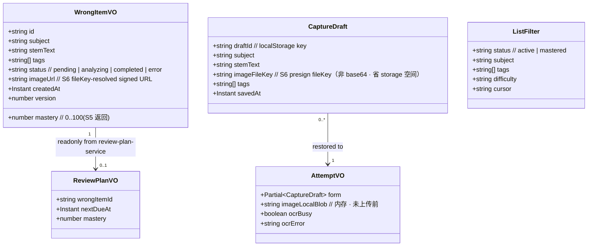
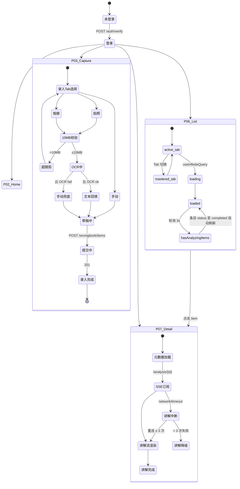
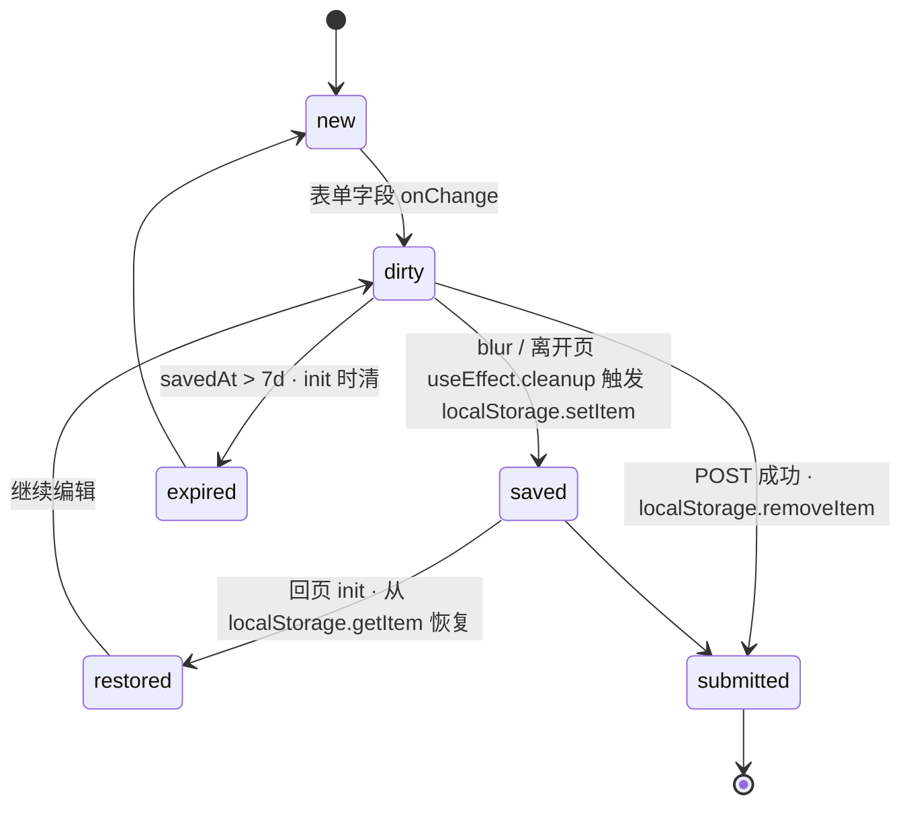
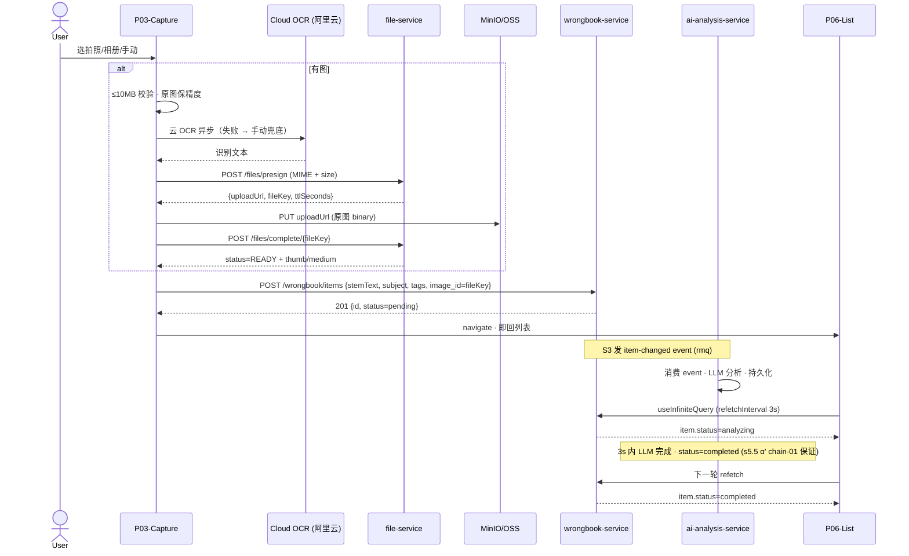
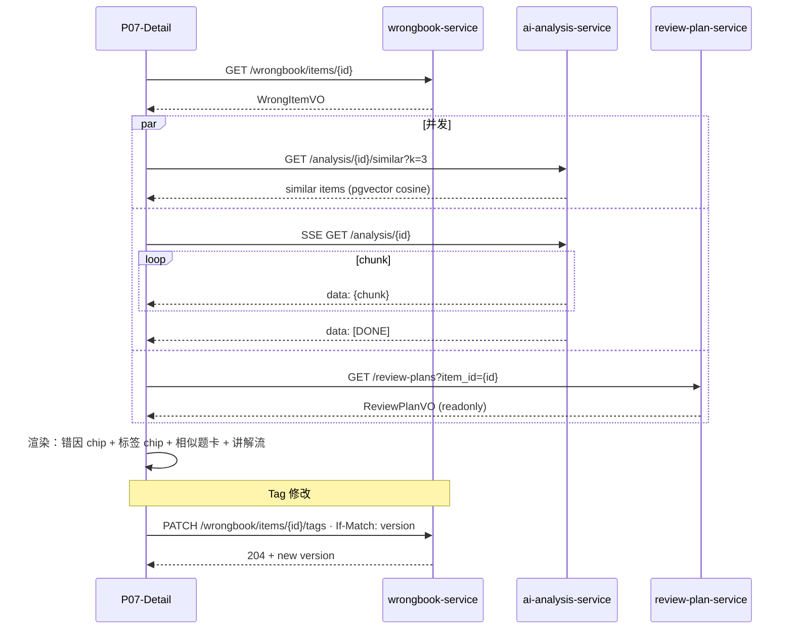
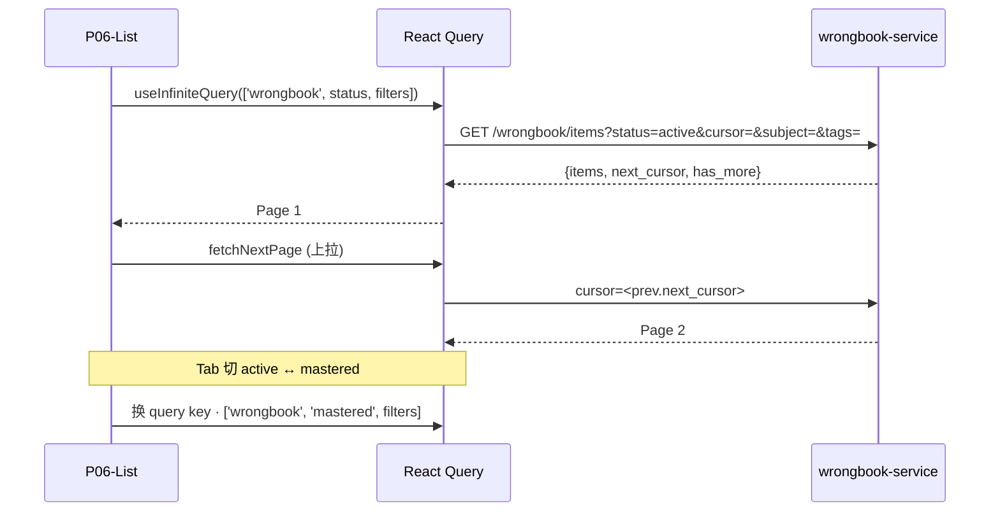

# S7 前端错题主循环（H5 + 小程序）· 架构设计

> 落地计划 §11.2 · v1.8 AC 分节 + 五行齐全（API/Domain/Event/Error/NFR）· Mermaid + OpenAPI 合集 + testid 枚举 · ADR 0014 双端对称 · 引用 ADR 0004.

---

## 0. 业务架构图

```mermaid
graph TB
  subgraph 前端
    H5[H5 React + Konsta]
    MP[miniapp Vant Weapp]
  end
  subgraph 共享
    UIKIT[@longfeng/ui-kit]
    CONTRACTS[@longfeng/api-contracts]
    TESTIDS[@longfeng/testids]
    I18N[@longfeng/i18n]
  end
  subgraph 后端
    GW[gateway]
    S3[wrongbook-service]
    S4[ai-analysis-service]
    S5[review-plan-service]
    S6[file-service]
  end
  OSS[(MinIO / OSS)]
  OCR[(阿里云 OCR)]

  H5 --> UIKIT
  MP --> UIKIT
  H5 --> CONTRACTS
  MP --> CONTRACTS
  H5 --> TESTIDS
  MP --> TESTIDS
  H5 --> I18N
  H5 --> OCR
  MP --> OCR
  H5 --> GW
  MP --> GW
  GW --> S3
  GW --> S4
  GW --> S5
  GW --> S6
  S6 --> OSS
  H5 -.PUT直传.-> OSS
  MP -.PUT直传.-> OSS
```

## 1. 领域模型 Domain Model

### 1.1 classDiagram · 前端领域对象



### 1.2 stateDiagram · 路由 / 录入 / 列表状态机



### 1.3 草稿状态机 · CaptureDraft（SC-07.AC-1 细化）



---

## 2. 数据流 Data Flow

### 2.1 录入链路（SC-01.AC-1 + SC-07.AC-1）



### 2.2 详情链路（SC-02.AC-1 + SC-03.AC-1）



### 2.3 列表链路（SC-08.AC-1）



---

## 3. 事件与契约 Events & Contracts

### 3.1 OpenAPI 合集（@longfeng/api-contracts 生成 TS types）

| Endpoint | Method | 消费 AC | 来源 Phase |
|---|---|---|---|
| `/wrongbook/items` | GET | SC-08.AC-1 | s3 |
| `/wrongbook/items` | POST | SC-01.AC-1, SC-07.AC-1 | s3 |
| `/wrongbook/items/{id}` | GET | SC-02.AC-1, SC-03.AC-1 | s3 |
| `/wrongbook/items/{id}/tags` | PATCH | SC-02.AC-1 | s3 |
| `/wrongbook/tags` | GET | SC-02.AC-1 | s3 |
| `/files/presign` | POST | SC-01.AC-1 | s6 |
| `/files/complete/{fileKey}` | POST | SC-01.AC-1 | s6 |
| `/analysis/{id}` | GET (SSE) | SC-03.AC-1 | s4 |
| `/analysis/{id}/similar` | GET | SC-03.AC-1 | s4 |
| `/review-plans?item_id=` | GET | readonly | s5 |

TS types: `openapi-typescript` 从各服务 `src/main/resources/openapi/*.yaml` 生成到 `@longfeng/api-contracts/src/generated/` · typed client 统一在 `@longfeng/api-contracts/src/clients/`。

### 3.2 testid 枚举（@longfeng/testids 常量包）

本 Phase 新产 `frontend/packages/testids` · 导出 `const TEST_IDS = { ... } as const` 便于 TS 推断。

```ts
// 命名：<screen>.<region>.<element>[-{variant}] · 三段 kebab-case · 见 design/system/testid-convention.md
export const TEST_IDS = {
  capture: {
    root: 'capture.root',
    form: {
      submit: 'capture.form.submit',
      subject: 'capture.form.subject',
      stem: 'capture.form.stem',
      'draft-hint': 'capture.form.draft-hint',
    },
    camera: { btn: 'capture.camera.btn' },
    gallery: { btn: 'capture.gallery.btn' },
    manual: { btn: 'capture.manual.btn' },
    'size-exceeded': 'capture.size-exceeded.toast',
  },
  wrongbook: {
    list: {
      root: 'wrongbook.list.root',
      'filter-bar': 'wrongbook.list.filter-bar',
      'item-card': 'wrongbook.list.item-card',
      'archive-tab': 'wrongbook.list.archive-tab',
      'active-tab': 'wrongbook.list.active-tab',
      'load-more': 'wrongbook.list.load-more',
      empty: 'wrongbook.list.empty',
    },
    detail: {
      root: 'wrongbook.detail.root',
      'tag-sheet': 'wrongbook.detail.tag-sheet',
      'tag-chip': 'wrongbook.detail.tag-chip',
      'tag-custom-input': 'wrongbook.detail.tag-custom-input',
      'explain-stream': 'wrongbook.detail.explain-stream',
      'cause-chip': 'wrongbook.detail.cause-chip',
      'similar-card': 'wrongbook.detail.similar-card',
    },
  },
} as const;
```

### 3.3 前端内部事件（无自定义全局 event bus）

- UI 瞬态：Zustand slice `wrongbookClient`（筛选栏开合 / Tag Sheet open / 上传进度）
- Server 状态：React Query 5 缓存（key 结构见 §4）
- 跨页面通信：HashRouter 路由参数 + useSearchParams · 无 pubsub

---

## 4. 非功能指标 NFR

### 4.1 性能

| 指标 | 阈值 | 测量 |
|---|---|---|
| H5 首屏 LCP | ≤ 2.5s (P95 · 4G) | Lighthouse CI + Playwright trace |
| 交互响应 INP | ≤ 100ms | Lighthouse |
| H5 主 bundle | ≤ 500KB gzip | vite build + vite-plugin-visualizer · CI 硬断言 |
| 小程序主包 | ≤ 2MB | 微信开发者工具 size check |
| 小程序分包 | ≤ 2MB × 3 | 同上 |

### 4.2 A11y

- jest-axe + Playwright axe 双闸 **0 violations** · WCAG 2 AA
- 焦点可见（focus ring · --tkn-shadow-focus）
- 对比度 ≥ 4.5:1（text < 18pt）· 延用 Sd-v2 既有 token
- 所有 interactive element `minHeight: 44` · 触达区

### 4.3 国际化

- i18next 23.x + react-i18next 14.x
- zh-CN（默认）/ en-US · namespace 按页面拆（capture / wrongbook-list / wrongbook-detail / common）
- 资源懒加载 · 语言切换无闪烁
- ESLint `eslint-plugin-i18next/no-literal-string` 兜底

### 4.4 兼容性

- H5: iOS Safari 14+ · Android Chrome 90+ · 微信 WebView (TBS X5)
- 小程序基础库 2.25+

### 4.5 Lighthouse CI

- Performance ≥ 85 · A11y = 100 · Best Practices ≥ 90 · SEO ≥ 80

---

## 5. 外部依赖 External Dependencies

### 5.1 前端框架 & 组件

- **Konsta UI 3.x**（H5 · iOS HIG 组件 · 与 Sd-v2 ui-kit 互补）
- **Vant Weapp**（小程序 · 主题变量绑 Sd tokens · 见 §5.3）
- **@longfeng/ui-kit**（Sd-v2 产 20 组件 · 本 Phase 消费）
- **React 18.3.x** + **React Router 6.23** (HashRouter · H5 静态部署)
- **@tanstack/react-query 5.x**（server state）· **Zustand 4.5**（UI 瞬态）· **react-hook-form 7.x** + **zod 3.x**（表单校验）
- **i18next 23.x** + **react-i18next 14.x**

### 5.2 契约 & 工具

- **@longfeng/api-contracts**（本 Phase 补齐 OpenAPI → TS 生成）
- **@longfeng/testids**（本 Phase 新产 · §3.2）
- **@longfeng/design-tokens**：合并于 @longfeng/ui-kit · `tokens.css/wxss/ts`
- **@longfeng/icons**：Sd.5 deferred · 本 Phase 占位 emoji/unicode + 留 adapter
- **openapi-typescript 7.x** · **msw 2.x** · **@seriousme/openapi-schema-validator 2.x**
- **Stryker 8.x** (mutation ≥ 60%) · **Vitest 1.x** + **jest-axe 8.x** · **Playwright 1.42** + **@axe-core/playwright 4.x**
- **miniprogram-automator 0.11.x**（微信开发者工具 CLI · /Applications/wechatwebdevtools.app/Contents/MacOS/cli）

### 5.3 主题联动

- tokens.wxss 由 @longfeng/ui-kit 既有 tokens.wxss 导出 · miniapp `styles/vant-theme.wxss` 覆盖 Vant 变量到 `--tkn-*`
- H5 Konsta `var(--k-color-primary)` 等统一映射 `--tkn-color-primary-default`

---

## 6. ADR 候选 Architecture Decision Records

### ADR 0014 · 双端组件对称性（本 Phase 新立）

**Context**：H5（Konsta + React）与小程序（Vant + 原生 wxml/ts）两端 UI 框架不同 · E2E / 埋点 / UX 设计需统一。

**Decision**：
1. **Route name 统一** · H5 `react-router` + 小程序 `app.json pages` 都用 `home/capture/wrongbook/detail/profile` 命名
2. **testid 跨端同名** · H5 `data-testid` + 小程序 `data-test-id`（automator 兼容）· 值相同
3. **组件 API 对齐** · `@longfeng/ui-kit` React 版 + `@longfeng/ui-kit/miniapp` custom component 版 · prop 名同步（本 Phase 补 miniapp 适配层）
4. **事件名对齐** · onClick ↔ bindtap · onChange ↔ bindchange · 测试时二者等价

**Consequences**：
- E2E 脚本可复用 80% （Playwright selector ≈ miniprogram-automator selector）
- 埋点口径统一（事件名 + screen name 相同）
- 成本：ui-kit 需多包一份 miniapp 适配器（~500 行）· 留 S7 内完成

**Status**：Proposed · 本 Phase G-Arch 通过后 Accepted

### 引用

- **ADR 0004** · Konsta + Vant 双端选型（§1.6 Hard Deny 已绑定 · 禁换框架）
- **Sd 备忘 §4** · Code-as-Design 约束（无 Figma · HTML 高保真为视觉 single source of truth）
- **Sd 备忘 §6** · 19 mockup 编号表（本 Phase ux_anchor 来源）

---

## 7. Symbol Registry（G-Arch check-arch-consistency.sh 消费）

### 7.1 文件路径

| 符号 | 文件 | 角色 |
|---|---|---|
| `frontend/apps/h5/src/pages/Capture/index.tsx` | H5 P03 录入 | SC-01.AC-1 + SC-07.AC-1 dev_anchor |
| `frontend/apps/h5/src/pages/List/index.tsx` | H5 P06 列表 | SC-08.AC-1 dev_anchor |
| `frontend/apps/h5/src/pages/Detail/index.tsx` | H5 P07 详情 | SC-02.AC-1 + SC-03.AC-1 dev_anchor |
| `frontend/apps/h5/src/components/ItemCard.tsx` | 列表卡片 | 消费 ui-kit |
| `frontend/apps/h5/src/api/wrongbook.ts` | 仅 re-export api-contracts | SDK 层 |
| `frontend/apps/h5/src/store/wrongbookClient.ts` | Zustand UI 瞬态 | 状态层 |
| `frontend/apps/h5/src/i18n/{zh-CN,en-US}/wrongbook.json` | i18n 资源 | 文案 |
| `frontend/apps/miniapp/pages/wrongbook/{capture,list,detail}/*.{wxml,ts,wxss,json}` | 小程序三页 | 双端对称 |
| `frontend/apps/miniapp/styles/{tokens,vant-theme}.wxss` | 主题注入 | Token-First |
| `frontend/packages/api-contracts/src/generated/` | OpenAPI → TS | 契约 |
| `frontend/packages/api-contracts/src/clients/` | typed client | 消费入口 |
| `frontend/packages/testids/src/index.ts` | testid 常量包 | 本 Phase 新产 |
| `frontend/tools/eslint-rules/testid-required.js` | ESLint 规则 | DoD-S7-03 |
| `e2e/specs/wrongbook-smoke.spec.ts` | Playwright smoke | V-S7-11 |
| `e2e/miniprogram/wrongbook-smoke.ts` | automator smoke | V-S7-12 |
| `frontend/packages/api-client/tests/adapter-contract.spec.ts` | adapter 契约测试 | V-S7-16 |

### 7.2 路由名（双端一致）

`home · calendar · wrongbook · capture · detail · review · profile`

### 7.3 事件名（埋点统一）

`capture.submit · capture.ocr-success · capture.ocr-fallback · wrongbook.item.open · wrongbook.list.filter-apply · wrongbook.detail.tag-edit · review.start`

---

## 8. AC 分节 · 五行齐全（v1.8 §1.5 #13）

### §8.1 SC-01.AC-1 · 录入三入口 + 原图 OCR

| 行 | 内容 |
|---|---|
| **API** | POST /files/presign → PUT OSS → POST /files/complete/{fileKey} → POST /wrongbook/items |
| **Domain** | CaptureForm, AttemptVO, WrongItemVO.imageUrl |
| **Event**（前端状态机） | 10MB校验 → OCR中 → 文本回填 ↔ 手动兜底 → 草稿中 → 提交中 → 录入完成 |
| **Error** | >10MB → capture.size-exceeded.toast · OCR fail → 手动兜底（降级 · 非阻塞）· presign 4xx → 重试 3 次后提示 |
| **NFR** | 录入页 LCP ≤ 2s · 图上传 P95 ≤ 5s（10MB WiFi）· a11y 每按钮 testid + aria-label |

### §8.2 SC-02.AC-1 · 标签管理

| 行 | 内容 |
|---|---|
| **API** | GET /wrongbook/tags · PATCH /wrongbook/items/{id}/tags (If-Match version) |
| **Domain** | WrongItemTag, TagTaxonomy |
| **Event** | Tag Sheet open → chip select → custom input → PATCH → 反馈 204 |
| **Error** | 412 version mismatch → refetch + merge · 用户自建 > 5 → 灰化 + tooltip |
| **NFR** | Sheet 打开动画 300ms · a11y role=dialog · 支持 Esc 关 |

### §8.3 SC-03.AC-1 · AI 讲解流式

| 行 | 内容 |
|---|---|
| **API** | SSE GET /analysis/{itemId} · GET /analysis/{itemId}/similar?k=3 |
| **Domain** | AIExplainStream, AnalysisView |
| **Event** | SSE 订阅 → chunk 流 → [DONE] · 中断 → 重连 ≤ 3 次 → 降级"静态讲解" |
| **Error** | network fail → 重连退避 1/3/7s · server error → 降级 fetch 静态版 |
| **NFR** | 首字 ≤ 500ms · 流完 ≤ 8s · reconnect ≤ 3 · a11y aria-live=polite |

### §8.4 SC-07.AC-1 · 手动录入 + 草稿

| 行 | 内容 |
|---|---|
| **API** | POST /wrongbook/items |
| **Domain** | CaptureDraft (localStorage / wx.storage) · WrongItem |
| **Event** | new → dirty → saved（cleanup 触发）→ restored → submitted / expired |
| **Error** | storage 配额超 → 提示 + 只存 form · 不存 image base64（只存 fileKey 引用）· 7d 过期自动清 |
| **NFR** | 草稿 save < 50ms · init restore < 100ms · a11y form 错误 aria-describedby |

### §8.5 SC-08.AC-1 · 列表分页 + 归档 Tab

| 行 | 内容 |
|---|---|
| **API** | GET /wrongbook/items?status=active|mastered&cursor=&subject=&tags= |
| **Domain** | WrongItem[], ListFilter |
| **Event** | tab 切 active ↔ mastered · filter 应用 · cursor fetchNextPage · 轮询 hasAnalyzingItems 3s |
| **Error** | 5xx → 顶部 Banner + 下拉重试 · cursor 过期 → 自动重置到首页 |
| **NFR** | 首屏 10 条 · cursor stale-time 60s · a11y tablist + aria-selected |

---

## 9. G-Arch 签字记录

- [x] 6 节齐（§1..§6 + §7 Symbol + §8 AC 分节）
- [x] `bash ops/scripts/check-arch-consistency.sh s7 --dry-run` 返回 0（2026-04-24 12:45）
- [x] front matter `gate_status: approved` + `approved_by: @allen` + `approved_at: 2026-04-24T13:00:00+08:00`
- [x] User in-person "哦OK" 确认（2026-04-24 13:00）· 等价 `/arch-ok`
- [ ] 打 tag `s7-arch-frozen`（本 commit 后立打）

---

## 10. 变更历史

| 日期 | 版本 | 变更 | 签字 |
|---|---|---|---|
| 2026-04-24 | v1.0 draft | 初稿 · 5 AC × 5 行 · 11 节主体 + Symbol Registry + ADR 0014 | AI · G-Arch pending |
| 2026-04-24 | v1.0 approved | G-Arch 通过（@allen in-person 2026-04-24 13:00）· gate_status: approved · 打 `s7-arch-frozen` tag · 冻结架构符号（§7 Symbol Registry）| @allen · AI 执行 |
