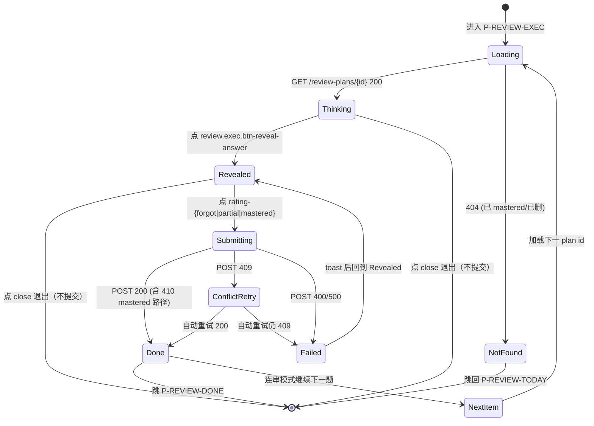
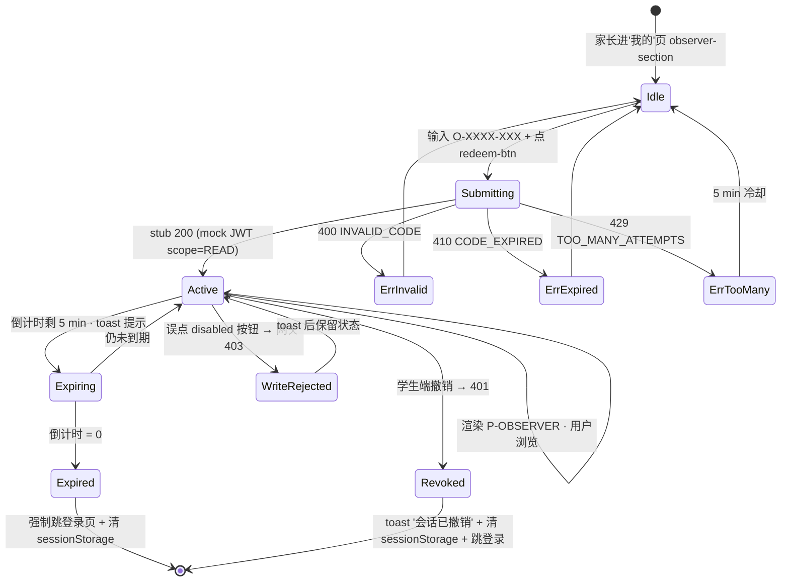
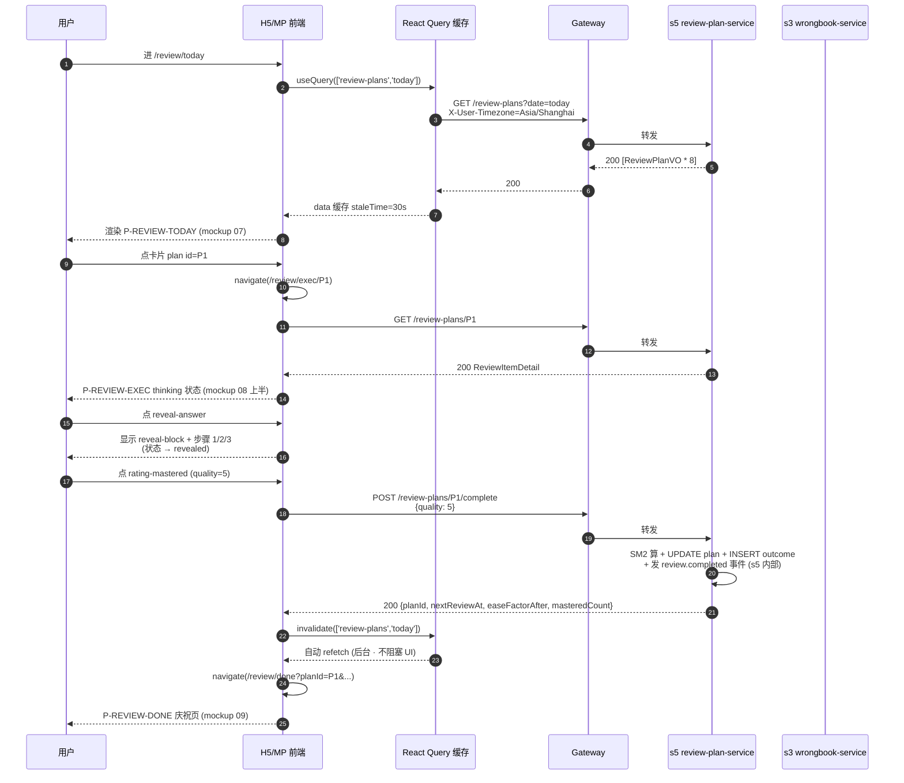
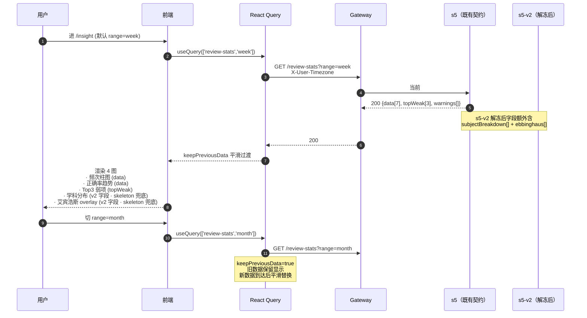
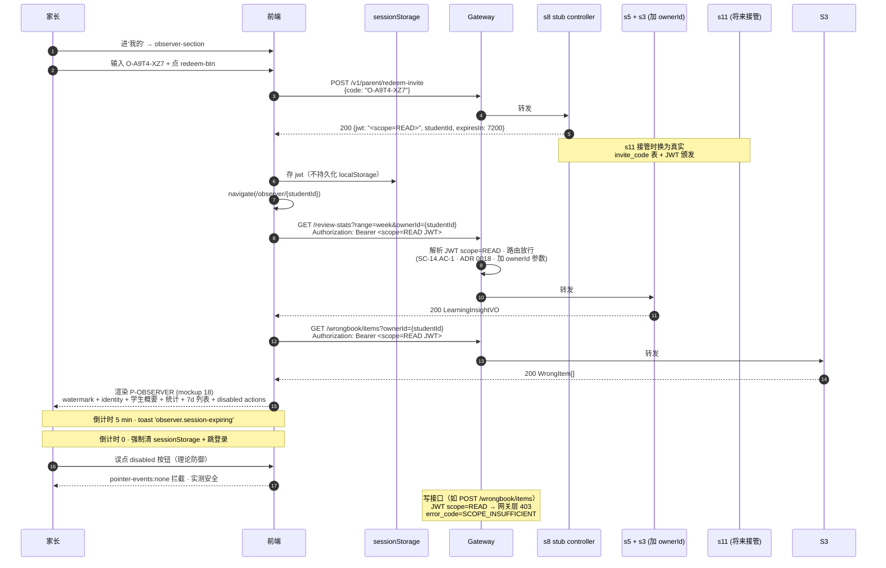

# S8 · 复习执行 + 学情分析（前端闭环）· 架构设计

> **G-Biz 已 approved @ 2026-04-27T13:45**（in-conversation-delegation · 用户授权一次性代签）
> **G-Arch 已 approved @ 2026-04-27T13:45**（同上签字方式 · ac_partition=true · v1.8 AC 分节 + 五行齐全）
> 落地计划 §12.2 · 镜像 design/analysis/s8-business-analysis.yml 决策口径 · 上游引用 s5-arch-frozen · ADR 0014/0015/0016/0017/0018 候选

---

## 0. 业务架构图（Business Architecture · 锚点 #0-业务架构图）

### 业务范围摘要（≤ 300 字）

S8 是 AI 错题本"用户留下来的理由" —— 艾宾浩斯复习闭环的前端用户侧，覆盖 **3 个 SC** · **5 个页面** · **双端实现**。

**SC-08 复习答题打分**：用户从复习 Tab 进入 P-REVIEW-TODAY（mockup 07 · 时间分组 + Hero 进度 + 复习卡列表）→ 点卡片进 P-REVIEW-EXEC（mockup 08 · 全屏作答 + 工作区 + 揭示答案 + 节点时间线）→ 底部 3 档自评（未掌握/部分/已掌握 · 映射 SM-2 quality 0/3/5 · 跳过 4 · 见 ADR 0016）→ POST /review-plans/{id}/complete 成功后跳 P-REVIEW-DONE（mockup 09 · 庆祝 + 节点推进 T2→T3 + 今日战绩 + 下次复习卡）。

**SC-09 学情卡片**：P-INSIGHT 顶部周/月/季 tab · 4 图并列：① 30 日复习频次柱图（s5 现有契约即可）② 一周正确率趋势线 + Top3 弱项卡（s5 现有 topWeak[]）③ 学科分布柱图（依赖 s5-stats-v2-frozen 扩展 subjectBreakdown[] · 阻塞）④ 艾宾浩斯曲线 overlay（依赖 s5-v2 扩展 ebbinghaus[] · 阻塞）。Lighthouse Perf ≥ 85 / A11y ≥ 95 硬门禁。

**SC-14 家长监督视图**：家长输入邀请码 O-XXXX-XXX → s8 阶段 stub /v1/parent/redeem-invite 返回 mock JWT scope=READ → 跳 P-OBSERVER（mockup 18 · 学生概要 + 错题统计 + 7 天记录 + 4 按钮 disabled + 网关层 403 守门 + 学生秒级撤销）。s11 阶段接管真实 invite_code 表 + JWT 颁发。

本 Phase **不负责**：SM-2 算法（s5）· 后端学情字段扩展（s5-v2 子 Phase）· 短链/邀请码生成/真实 JWT 颁发（s11）· P-WELCOMEBACK 设备指纹回归（s11 SC-12/13）· E2E 全量（s9）。

### 业务架构图（Mermaid `flowchart`）

```mermaid
flowchart TB
  subgraph 前端["前端双端（s8 范围）"]
    H5[H5 · React + Konsta + recharts]
    MP[miniapp · 微信原生 + Vant Weapp + echarts-for-weixin]
    H5 --> H5_REVIEW[P-REVIEW-TODAY/EXEC/DONE]
    H5 --> H5_INSIGHT[P-INSIGHT · 4 图]
    H5 --> H5_OBSERVER[P-OBSERVER]
    MP --> MP_REVIEW[review-today/exec/done 页]
    MP --> MP_INSIGHT[insight 页]
    MP --> MP_OBSERVER[observer 页]
  end

  subgraph 共享包["s7 已落地共享包（s8 直接消费）"]
    UIKIT[@longfeng/ui-kit]
    CONTRACTS[@longfeng/api-contracts typed client]
    TESTIDS[@longfeng/testids · s8 新增 review.* / insight.* / observer.* 命名空间]
    I18N[@longfeng/i18n]
    DT[@longfeng/design-tokens · --tkn-chart-{1..5} · --tkn-subject-* s8 新增]
  end

  subgraph 网关["Spring Cloud Gateway 4.1（基础设施 · 不在 s8 实现范围）"]
    GW[Gateway · JWT scope 解析 + 写接口 403 拦截]
  end

  subgraph 后端["后端服务（s5/s3 已 done · s11 待做）"]
    S5[s5 · review-plan-service<br/>GET /review-plans / POST complete / GET /review-stats]
    S5V2[s5-v2 · 待解冻<br/>GET /review-stats v2<br/>+ subjectBreakdown[] + ebbinghaus[]<br/>+ ownerId 参数]
    S3[s3 · wrongbook-service<br/>GET /wrongbook/items?ownerId=]
    S4[s4 · ai-analysis-service<br/>已透传 stemText + 标准答案 + 步骤]
    S11[s11 · anonymous-service<br/>真实邀请码 + JWT 颁发<br/>POST /v1/parent/redeem-invite]
    STUB[s8 stub controller<br/>mock JWT scope=READ]
  end

  subgraph 三方["外部依赖"]
    SENTRY[Sentry · @sentry/react + @sentry/minapp]
    WX[微信 JS-SDK · 添加日历 / 分享]
  end

  H5 --> UIKIT
  MP --> UIKIT
  H5 --> CONTRACTS
  MP --> CONTRACTS
  H5 --> TESTIDS
  MP --> TESTIDS
  H5 --> I18N
  H5 --> DT
  MP --> DT

  H5 -->|HTTP via Bearer JWT| GW
  MP -->|HTTP via Bearer JWT| GW
  GW -->|路由| S5
  GW -->|路由| S5V2
  GW -->|路由 + scope=READ 拦截写| S3
  GW -->|路由| STUB
  STUB -.s11 接管.-> S11

  S5 -.既有契约.- S4

  H5 --> SENTRY
  MP --> SENTRY
  H5 --> WX
  MP --> WX

  classDef blocked fill:#fef2cd,stroke:#d4a017;
  classDef stub fill:#e7f3ff,stroke:#5b8def,stroke-dasharray:5 3;
  class S5V2 blocked;
  class STUB stub;
  class S11 stub;
```

**图注**（与 yml ac_coverage 对齐）：
- **SC-08.AC-1 (P-REVIEW-TODAY)**：H5/MP → GW → S5 GET /review-plans?date=today
- **SC-08.AC-2 (P-REVIEW-EXEC)**：H5/MP → GW → S5 GET /review-plans/{id}（透传 S4 已生成的标准解答 + 步骤）
- **SC-08.AC-3 (3 档自评 · critical)**：H5/MP → GW → S5 POST /review-plans/{id}/complete · 同事务 200/410/409
- **SC-08.AC-4 (P-REVIEW-DONE)**：复用 A-3 响应数据 + 微信 JS-SDK 添加日历
- **SC-09.AC-1**：H5/MP → GW → S5 GET /review-stats?range=week|month|quarter（既有契约即可）
- **SC-09.AC-2 (学科分布 · blocked)**：H5/MP → GW → **S5-v2** subjectBreakdown[] · 待 s5-stats-v2-frozen
- **SC-09.AC-3 (艾宾浩斯 · blocked)**：H5/MP → GW → **S5-v2** ebbinghaus[] · 待 s5-stats-v2-frozen
- **SC-14.AC-1 (P-OBSERVER · critical)**：家长持 scope=READ JWT → GW → S5 + S3 加 ownerId 参数（ADR 0018）· 写接口在 GW 层 403 拒
- **SC-14.AC-2 (邀请码兑换 · critical)**：家长 → GW → s8 stub → 后续 s11 接管

### 假设清单（A1-A8 · 已 G-Biz 收口 · yml 镜像）

| # | 假设 | 来源 / 决策 |
|---|---|---|
| A1 | 3 档自评（未掌握/部分/已掌握）映射 SM-2 quality 0/3/5 | mockup 08 权威 · ADR 0016 · yml ambiguities A1 |
| A2 | mockup 17_welcomeback.html 归 s11 不归 s8 | yml ambiguities A2 · 设备指纹场景 = SC-12/13 匿名域 |
| A3 | review.due 不走前端 WebSocket · 改 React Query 轮询 | yml drift D5 + conflicts Q1 · 网关无 WS 路由 + s5 review.due 是 RocketMQ 内部事件 |
| A4 | 家长视图入口 = 邀请码兑换（非短链）· s8 阶段 stub | yml conflicts Q2 · mockup 18 identity-meta "O-A9T4-XZ7" |
| A5 | 学情数据 = 实时聚合（GET /review-stats）· 非凌晨批算 | yml drift D3 · s5 实际实现 · 无 learning_insight 表 |
| A6 | 学情 4 图完整 · 走路径 B 解冻 s5（v2 子 Phase） | yml conflicts Q3 · 阻塞 SC-09.AC-2/AC-3 fe-builder |
| A7 | 双端 H5 + 小程序同步 · 继承 ADR 0014 双端对称 | yml conflicts Q4 |
| A8 | 工作区（mockup 08 paper）s8 阶段不持久化 · UI 演示 | 落地计划 §12.6 · 持久化挪后续 Phase |

### 歧义与缺口（已 G-Biz 收口 · 无 pending）

| # | 歧义 | 决策 |
|---|---|---|
| Q1 | review.due 实时推送方式 | 轮询（A3） |
| Q2 | 家长视图入口 | 邀请码兑换 stub（A4） |
| Q3 | 4 图是否全做 | 全做 + 解冻 s5（A6） |
| Q4 | 双端? | 双端（A7） |
| A1 | 自评档数 | 3 档（A1） |
| A2 | mockup 17 归属 | s11（A2） |

> **drift_resolution D1-D5（5 条主文档过时修正）**：完整列在 yml `drift_resolution` 字段。本 arch 文档采纳"路径 A 按权威源" · sc_covered=[SC-08, SC-09, SC-14]（非主文档 §12.0.5 的 6 SC）· GET /review-stats（非 /insights）· 实时聚合（非凌晨批算）· echarts-for-weixin（非 canvas 自绘）· 轮询（非 WebSocket）。

---

## 1. 领域模型（Domain Model）

### 1.1 classDiagram · 前端领域对象

```mermaid
classDiagram
  class ReviewPlanVO {
    +long planId
    +long wrongItemId
    +int nodeIndex     %% 0..6 (T0..T6)
    +Instant nextReviewAt
    +int dispatchVersion
    +string subject    %% math/physics/chemistry/english/chinese
    +string stemTextSnippet
    +string[] tags
    +int difficulty    %% 0..5 stars
  }
  class ReviewItemDetail {
    +ReviewPlanVO plan
    +string stemTextFull
    +string answerStandard
    +string[] steps
    +double easeFactor
    +int intervalDays
  }
  class ReviewTodayPageState {
    +string tz
    +ReviewPlanVO[] plans
    +TimeBucket[] buckets   %% now/morning/afternoon/evening
    +number totalDuration   %% 预计 25 分钟 估算
    +number progress        %% 0..1 已完成比例
    +number masteryRate     %% 整体掌握度
  }
  class ReviewSessionVO {
    +long planId
    +string state           %% thinking | revealed | submitted
    +boolean revealed
    +int currentTurn        %% 第 N 题 / 共 M 题
  }
  class QualityVote {
    +int quality            %% 0 | 3 | 5（A1 决策跳过 4）
    +string label           %% 未掌握 | 部分 | 已掌握
    +string subLabel        %% 回到 T0 | 原计划不变 | 加速到下一节点
  }
  class ReviewDonePageState {
    +long planId
    +int prevNodeIndex
    +int nextNodeIndex
    +Instant nextReviewAt
    +number masteryAfter
    +number streakCount
    +number durationMs
    +ReviewTodayStatsSnapshot todayStats
    +KpProgressItem[] kpDelta
  }
  class LearningInsightVO {
    +string range           %% week | month | quarter
    +string tz
    +DailyMetric[] data
    +TopWeakItem[] topWeak
    +SubjectBreakdownItem[] subjectBreakdown   %% s5-v2 字段
    +EbbinghausPoint[] ebbinghaus              %% s5-v2 字段
    +string[] warnings      %% PARTIAL_HISTORY | TIMEZONE_FALLBACK
  }
  class DailyMetric {
    +Date date
    +number correctRate
    +int reviewCount
    +int masteredCount
  }
  class TopWeakItem {
    +string subject
    +int totalReview
    +int forgetCount
    +number forgetRate
  }
  class SubjectBreakdownItem {
    +string subject
    +int reviewCount
    +int correctCount
    +int masteredCount
  }
  class EbbinghausPoint {
    +int nodeIndex
    +number expectedRetention
    +number actualRetention   %% null if not yet completed
    +Instant completedAt      %% null if pending
  }
  class ChartSeriesVO {
    +string[] labels
    +number[] values
    +string unit
    +string colorToken      %% --tkn-chart-{1..5}
  }
  class ObserverSessionVO {
    +long studentId
    +string studentName
    +string studentGrade
    +string scope           %% READ
    +Instant expiresAt
    +string inviteCode
    +boolean revocableByStudent
  }
  class StudentSummaryVO {
    +long studentId
    +string name
    +string grade
    +int streakDays
    +int weeklyReviewCount
    +int wrongItemTotal
    +number masteryRate
    +int pendingCount
  }
  class InviteCodeRedemption {
    +string code            %% O-XXXX-XXX
    +string state           %% idle | submitting | success | error
    +string errorCode       %% INVALID_CODE | CODE_EXPIRED | TOO_MANY_ATTEMPTS
  }

  ReviewTodayPageState "1" --> "*" ReviewPlanVO
  ReviewItemDetail --> ReviewPlanVO
  ReviewSessionVO --> ReviewItemDetail
  ReviewSessionVO --> QualityVote
  ReviewDonePageState --> ReviewSessionVO
  LearningInsightVO --> "*" DailyMetric
  LearningInsightVO --> "*" TopWeakItem
  LearningInsightVO --> "*" SubjectBreakdownItem
  LearningInsightVO --> "*" EbbinghausPoint
  ObserverSessionVO --> StudentSummaryVO
```

### 1.2 stateDiagram-v2 · 复习会话状态机



### 1.3 stateDiagram-v2 · 观察者会话状态机（SC-14）



---

## 2. 数据流（Data Flow）

### 2.1 复习主路径（SC-08 · 4 AC 端到端）



### 2.2 学情看板路径（SC-09）



### 2.3 家长视图路径（SC-14）



---

## 3. 事件与契约（Events & Contracts）

### 3.1 上游 HTTP API（s8 消费 · 不产生新契约 · 仅引用）

```yaml
# 引自 design/arch/s5-review-plan.md §3.1 · s5-arch-frozen 范围内
openapi: 3.0.3
paths:
  /review-plans:
    get:
      summary: 当日 due 节点列表（SC-08.AC-1 消费）
      parameters:
        - { name: date, in: query, schema: { type: string, format: date }, example: "2026-04-27" }
        - { name: X-User-Timezone, in: header, schema: { type: string, default: "Asia/Shanghai" } }
      responses:
        "200": { description: "ReviewPlanVO[] · 含 nodeIndex / nextReviewAt / wrongItem snippet" }

  /review-plans/{id}:
    get:
      summary: 单节点详情（SC-08.AC-2 消费）
      responses:
        "200": { description: "ReviewItemDetail · 含 stemTextFull + answerStandard + steps[]" }
        "404": { description: "已 mastered 或已软删" }

  /review-plans/{id}/complete:
    post:
      summary: 提交自评（SC-08.AC-3 消费 · critical · 见 ADR 0016 quality 3 档映射）
      requestBody:
        content:
          application/json:
            schema: { type: object, properties: { quality: { type: integer, enum: [0, 3, 5] } } }
      responses:
        "200": { description: "{planId, nextReviewAt, easeFactorAfter, masteredCount}" }
        "400": { description: "INVALID_QUALITY（前端 bug）" }
        "404": { description: "plan 不存在或已删" }
        "409": { description: "乐观锁冲突 · 自动重试 1 次" }
        "410": { description: "PLAN_MASTERED · 走 Done 页 · 不显错误" }

  /review-stats:
    get:
      summary: 学情聚合（SC-09.AC-1 消费 · 现有契约即可）
      parameters:
        - { name: range, in: query, schema: { type: string, enum: [week, month, quarter] } }
        - { name: subject, in: query, schema: { type: string }, required: false }
        - { name: ownerId, in: query, schema: { type: integer }, required: false, description: "SC-14.AC-1 家长查孩子 · ADR 0018 新增" }
        - { name: X-User-Timezone, in: header }
      responses:
        "200": |
          {
            data: DailyMetric[],
            topWeak: TopWeakItem[],
            warnings: string[],
            # s5-stats-v2-frozen 后字段：
            subjectBreakdown?: SubjectBreakdownItem[],   # SC-09.AC-2 消费 · ADR 0017
            ebbinghaus?: EbbinghausPoint[]               # SC-09.AC-3 消费 · ADR 0017
          }
        "400": { description: "INVALID_RANGE" }

  /wrongbook/items:
    get:
      summary: 错题列表（SC-14.AC-1 家长视图消费）
      parameters:
        - { name: ownerId, in: query, schema: { type: integer }, required: false, description: "ADR 0018 新增 · scope=READ JWT 守门" }
      # 其他参数继承 s3 既有契约
```

### 3.2 stub mock 端点（s8 阶段独有 · s11 接管真实）

```yaml
paths:
  /v1/parent/redeem-invite:
    post:
      summary: 邀请码兑换 scope=READ JWT（SC-14.AC-2 · stub）
      x-implementation: "s8 stub · 返回 mock JWT · s11 接管换真实链路"
      x-feature-flag: "observer.real_jwt（dev/staging=false · prod 必须=true 否则拒服务）"
      requestBody:
        content:
          application/json:
            schema: { type: object, properties: { code: { type: string, pattern: "^O-[A-Z0-9]{4}-[A-Z0-9]{3}$" } } }
      responses:
        "200": { description: "{jwt, studentId, expiresIn=7200}" }
        "400": { description: "INVALID_CODE" }
        "410": { description: "CODE_EXPIRED" }
        "429": { description: "TOO_MANY_ATTEMPTS（5 次错后 5min 冷却）" }
```

### 3.3 testid 枚举表（@longfeng/testids 包扩展）

| 命名空间 | testid（节选 · 完整列表见 yml ux_anchor） | AC 锚点 |
|---|---|---|
| `review.today.*` | root / hero / hero-progress-bar / stats-{done,progress,pending} / slot-{now,morning,afternoon,evening} / item-card / item-countdown / empty / cta-start-all / tabbar-review-badge | SC-08.AC-1 |
| `review.exec.*` | root / nav-progress / btn-close / meta-{node,subject,difficulty} / question-stem / work-paper / tool-{handwrite,keyboard,formula} / btn-reveal-answer / reveal-block / reveal-step-{1,2,3} / node-timeline / node-dot-T1..T6 / rating-bar / rating-{forgot,partial,mastered} / rating-loading / error-toast-{409,410-mastered} | SC-08.AC-2 / AC-3 |
| `review.done.*` | root / hero-{confetti,title} / hero-chip-{mastery,streak,duration} / memory-curve-card / memory-mastery-pct / memory-node-{list,dot-T1..T6} / memory-advance-text / next-card / next-add-calendar / today-stats-{mastered,partial,forgot} / kp-{list,item} / cta-{next-question,back-today} | SC-08.AC-4 |
| `insight.*` | root / range-{week,month,quarter} / chart-frequency-30d / chart-accuracy-trend / weak-{top3,item} / chart-subject-bar / chart-subject-bar-item-{math,physics,chem,eng,chi} / chart-ebbinghaus-{line,overlay-point,inset-note} / warning-banner-{partial,tz-fallback} / skeleton-{frequency,accuracy,weak,subject-bar,ebbinghaus} | SC-09.AC-1 / AC-2 / AC-3 |
| `observer.*` | root / watermark-read / identity-{card,role,scope-badge,session-remain,invite-code,revocable} / exit-btn / student-{summary,name,grade} / stats-{total,mastery,pending} / review-{list,item,item-progress-bar} / disabled-{actions,btn-edit,btn-redo,btn-archive,btn-share} / lock-note / session-{expiring-toast,expired-modal} | SC-14.AC-1 |
| `review.me.observer-*` | section / input / redeem-btn / redeem-loading / error-{invalid,expired,too-many} | SC-14.AC-2 |

> **testid 命名规则**（继承 ADR 0014 三段式 `<screen>.<region>.<element>`）：上述全部需在 s8 实施期落地到 `frontend/packages/testids/src/index.ts` 并由 ESLint 规则强制。

---

## 4. 非功能指标（Non-Functional Requirements）

| 维度 | 指标 | 阈值 | 度量方式 |
|---|---|---|---|
| 性能 | P-REVIEW-TODAY 首屏 LCP | ≤ 2s（4G 中端机） | Lighthouse CI · web-vitals |
| 性能 | P-INSIGHT 首屏 LCP（4 图同屏） | ≤ 2.5s | Lighthouse CI |
| 性能 | 复习提交 round-trip P95 | ≤ 200ms（含网络）· ≤ 150ms（内网 staging） | Sentry tracesSampleRate 0.05 |
| 性能 | Lighthouse Performance（Insight 页） | ≥ 85 | Lighthouse CI 硬门禁（V-S8-11） |
| A11y | jest-axe + Playwright axe 双闸 | 0 violations | Vitest + Playwright 双 CI |
| A11y | WCAG 等级 | AA | jest-axe 默认规则集 |
| A11y | Lighthouse Accessibility | ≥ 95 | Lighthouse CI 硬门禁 |
| 资源 | H5 recharts 包大小 | tree-shake 后 ≤ 80KB（gzip） | rollup-plugin-visualizer |
| 资源 | 小程序 echarts-for-weixin 主包贡献 | ≤ 400KB | wx-cli build summary |
| 资源 | observer 页 watermark + 禁用按钮 | 零额外字体加载 | WebPageTest |
| 可观测 | Sentry release | 100% 含 sourcemap · git rev-parse HEAD 标识 | @sentry/vite-plugin |
| 可观测 | 错误上报 P95 时延 | ≤ 10s | Sentry self-monitoring |
| 可观测 | critical AC 异常 Sentry tag | `ac=SC-XX.AC-Y` + `critical=true` | 自定义 tag |
| 安全 | observer.* 页面 watermark z-index | 8（高于内容 · 低于 toast/modal） | CSS 静态扫描 |
| 安全 | observer 写接口拦截层级 | 网关 + 前端守门 + ARIA aria-disabled 三重 | Playwright e2e 验证 403 |

---

## 5. 外部依赖（External Dependencies）

| 类别 | 依赖 | 版本 | 用途 / 范围 |
|---|---|---|---|
| 图表（H5） | `recharts` | 2.x | LineChart / BarChart / PieChart · tree-shake 仅引入用到的 |
| 图表（小程序） | `echarts-for-weixin` | latest（社区） | bar / line / scatter series · 主包注入 ≤ 400KB |
| 图表（小程序 fallback） | `<canvas type="2d">` 自绘 | — | echarts-for-weixin 兼容性失效场景的 escape hatch（保留作为风险兜底 · 默认不用） |
| 监控（H5） | `@sentry/react` | 8.x | error + performance · ADR 0015 |
| 监控（小程序） | `@sentry/minapp` | 社区 latest | 同上 · ADR 0015 |
| 监控构建 | `@sentry/vite-plugin` | 2.x | sourcemap + release 上传 |
| Web Vitals | `web-vitals` | 4.x | CLS/INP/LCP 回写 Sentry |
| 性能审计 | `lighthouse-ci` | 0.13 | Insight 页硬门禁 |
| 二维码（H5） | `qrcode.react` | latest | SC-14 衔接 s11 短链分享卡（s8 阶段仅占位） |
| 微信集成（H5） | 微信 JS-SDK | latest | 添加日历 · 分享 · 网页跳小程序 |
| 微信集成（小程序） | `wx.addPhoneCalendar` / `wx.showShareMenu` | 原生 API | 同 H5 功能等价实现 |
| 共享（s7 落地） | `@longfeng/ui-kit` | s7 cut | s8 直接消费 · 不增组件（除非 fe-builder 阶段需要） |
| 共享（s7 落地） | `@longfeng/api-contracts` | s7 typed client | s8 新增 review/* + insight/* + observer/* client 方法 |
| 共享（s7 落地） | `@longfeng/testids` | s7 cut · s8 扩展 | s8 新增 review.* / insight.* / observer.* 命名空间 |
| 共享（s7 落地） | `@longfeng/i18n` | s7 cut · s8 扩展 | s8 新增 review/* / insight/* / observer/* zh-CN 文案 |
| 共享（s7 落地） | `@longfeng/design-tokens` | v0.2+ · s8 扩展 | `--tkn-chart-{1..5}` + `--tkn-subject-{math,physics,chem,eng,chi}`（s8 新增 subject token） |
| 后端 | `s5 review-plan-service` | s5-arch-frozen | 5 端点（既有契约 · 不破坏） |
| 后端（待解冻） | `s5-v2 review-plan-service` | 待 s5-stats-v2-frozen | GET /review-stats v2 · 阻塞 SC-09.AC-2/AC-3 fe-builder |
| 后端 | `s3 wrongbook-service` | s3-done | GET /wrongbook/items 加 ownerId 参数 · ADR 0018 |
| 后端 | `s4 ai-analysis-service` | s4-done | 既有契约透传（已生成 stemText / answerStandard / steps） |
| 后端（待落地） | `s11 anonymous-service` | s11 阶段 | 真实 invite_code 表 + JWT 颁发 · 接管 stub |
| 网关 | Spring Cloud Gateway | 4.1 | JWT scope 解析 + 写接口 403 拦截 · 不在 s8 实现 |

---

## 6. ADR 候选

### ADR 0015 · Sentry 双端独立 SDK（本 Phase 新立）

**Context**：S8 引入前端可观测能力（错误追踪 + Web Vitals）。@sentry/react 与 @sentry/minapp 运行时差异大（micro-task 调度 / fetch 包装 / sourcemap 路径解析全不同）。

**Decision**：双端独立 SDK · 共享 `release = git rev-parse HEAD` 口径 · 共享自定义 tag `ac` / `critical` / `phase=s8`。不尝试合并到一个抽象层。

**Consequences**：(+) SDK 升级互不影响 · 错误堆栈精度高。(−) 两套配置 · package.json 双 SDK · 但相比合并 SDK 的耦合代价更小。

**Alternatives**：① 合并到 `@longfeng/sentry-bridge` —— 拒：抽象成本远高于复用收益。② 仅 H5 接 Sentry —— 拒：小程序错误对家长 / 老师场景同等重要。

### ADR 0016 · 复习自评 3 档映射 SM-2 quality（本 Phase 新立）

**Context**：mockup 08_review_exec.html 底部 rating-bar 设计是 3 档（未掌握/部分/已掌握），但落地计划主文档 §12.0.5 假设 4 档（忘记/模糊/记得/掌握）。两者冲突。

**Decision**：3 档 · 映射 SM-2 quality 0 / 3 / 5 · 跳过 4。后端 s5 SC-08.AC-1 已实现 quality 0-5 全档兼容 · 不破坏后端契约。

**Rationale**：mockup 是 Sd 验收后产物（更晚 · 已通过设计 review）· 权威性高于落地计划文字。3 档对儿童/中学生用户认知更清晰 · 4 档"记得"与"掌握"边界模糊。映射规则明确：未掌握=0（reset 到 ease=2.5/interval=1d）· 部分=3（最低 quality≥3 阈值 · 维持当前节奏）· 已掌握=5（顶板加速）。

**Consequences**：(+) UX 认知简单。(−) 损失 quality=4 这一档 · "记得但不熟"被合并到"部分"。

### ADR 0017 · s5 GET /review-stats v2 字段扩展（s5-v2 子 Phase 落地 · s8 引出）

**Context**：SC-09 学情看板需 4 图（30 日频次 / 一周正确率 / 学科分布 / 艾宾浩斯曲线 overlay）。s5 现有 GET /review-stats 仅返回 data + topWeak + warnings · 不含 subject 维度分组 + ebbinghaus 节点 overlay 数据。用户决策路径 B · 解冻 s5 走 v2 修订（不走前端 mock）。

**Decision**：s5-v2 子 Phase（独立 G-Biz/G-Arch · 重打 s5-stats-v2-frozen tag）扩展 GET /review-stats 响应：
- `subjectBreakdown[]: { subject, reviewCount, correctCount, masteredCount }`
- `ebbinghaus[]: { nodeIndex, expectedRetention, actualRetention, completedAt }`

向后兼容：现有调用方（s8.SC-09.AC-1）字段缺省 ignore · 不破坏 s5-arch-frozen。

**Consequences**：(+) s8 能完整交付 4 图。(−) 需启动 s5-v2 子 Phase（约半周工作量）· 阻塞 SC-09.AC-2/AC-3 fe-builder 阶段。

### ADR 0018 · GET /review-stats + GET /wrongbook/items 加 ownerId 参数（s8 引出 · 跨账号读契约）

**Context**：SC-14.AC-1 P-OBSERVER 需家长查学生数据。当前 s5 GET /review-stats 仅按当前 JWT subject 切数据 · s3 GET /wrongbook/items 同理。家长持 scope=READ JWT 但 subject=parent · 没法直接拿学生数据。

**Decision**：两端点同步加 `ownerId` 可选 query 参数 · 服务端校验：
- 如果 `JWT.scope=READ` 且 `JWT.parentOf 含 ownerId` → 放行（跨账号读 · 数据按 ownerId 切）
- 如果 `JWT.scope ≠ READ` 但 ownerId ≠ JWT.subject → 403 SCOPE_INSUFFICIENT
- 如果 `JWT.scope=READ` 但 `JWT.parentOf 不含 ownerId` → 403 OWNER_MISMATCH

`JWT.parentOf` 数组在 s11 邀请码兑换时由真实链路写入 · s8 stub 阶段写死单一 studentId。

**Consequences**：(+) 跨账号读路径明确 · 不引入新端点。(−) 网关 + s3 + s5 三处需同步加 ownerId 解析 · 测试矩阵增加。

---

## AC: SC-08.AC-1 · P-REVIEW-TODAY 今日复习列表（mockup 07）

- **API**: `GET /review-plans?date=today` header `X-User-Timezone` → 200 `ReviewPlanVO[]`（既有 · s5-arch-frozen 范围内 · 见 §3.1）
- **Domain**: `ReviewTodayPageState{ tz, plans, buckets[now/morning/afternoon/evening], totalDuration, progress, masteryRate }` ← `TimeBucket.assign(plan, tz)` 按 tz 本地小时切桶
- **Event**: 无（前端只读 · 不发后端事件）· React Query key `['review-plans','today']` · staleTime=30s · refetchOnWindowFocus=true · 提交完成后 invalidate 触发 refetch
- **Error**: 500 → `review.today.error` 重试卡 · React Query retry=1 · Sentry 上报 tag `ac=SC-08.AC-1` · 网络断开 → 离线 banner 占位（沿用 s7 离线 UI 组件）
- **NFR**: P-REVIEW-TODAY 首屏 LCP ≤ 2s · Lighthouse Perf ≥ 85 · jest-axe 0 violations · 时段分桶按 X-User-Timezone（不硬编码 +08:00）

## AC: SC-08.AC-2 · P-REVIEW-EXEC 全屏答题 + 工作区 + 揭示答案（mockup 08 上半 + 中段）

- **API**: `GET /review-plans/{id}` → 200 `ReviewItemDetail{ plan, stemTextFull, answerStandard, steps[], easeFactor, intervalDays }`（既有 · s5）· s4 已透传 stemText + 标准答案 + 步骤 · s8 不直接调 s4
- **Domain**: `ReviewSessionVO{ planId, state: thinking|revealed|submitted, revealed, currentTurn }` · 状态机 Loading → Thinking → Revealed → Submitting → Done（见 §1.2）· 工作区 `paper.handwritten` s8 阶段不持久化（见 A8）
- **Event**: 前端埋点 `sessionStarted` (P-REVIEW-EXEC 首屏 · 含 planId+nodeIndex)·`answerRevealed` (用户点 reveal-answer · 含 planId+revealLatencyMs) · 通过 `@longfeng/analytics` + Sentry breadcrumb 双写
- **Error**: 404（已 mastered/已删）→ Toast '此题已完成或已删除' · 跳回 P-REVIEW-TODAY · React Query retry=0 · 网络断开 → review.exec.error + 重试按钮 · 不卡死状态机
- **NFR**: 揭示答案到 reveal-block 渲染 ≤ 100ms · 节点时间线 6 dot 双端兼容（H5 SVG · 小程序 view+border 而非 canvas · 见 risks）· KaTeX H5 + wxml fallback for 公式

## AC: SC-08.AC-3 · 3 档自评 + POST complete + 乐观锁 409 · ADR 0016（critical）

- **API**: `POST /review-plans/{id}/complete` body `{ quality: 0|3|5 }`（quality 来自前端常量 · ADR 0016 · 不允许 1/2/4）→ 200 `{ planId, nextReviewAt, easeFactorAfter, masteredCount }` 或 400/404/409/410（见 §3.1）
- **Domain**: `QualityVote{ quality, label, subLabel }` 三档常量映射 · `MutationState`（idle/submitting/success/error）守门防双击 · 成功后 invalidate `['review-plans','today']` query
- **Event**: 前端埋点 `outcomeSubmitted` (含 planId, quality, qualityLabel, retryCount) · Sentry tag `ac=SC-08.AC-3` `critical=true`
- **Error**: 400 INVALID_QUALITY → Sentry critical（前端 bug · 不应发生）· 通用 toast 不暴露内部码 · 404 → 跳回 today + toast · 409 → 自动重试 1 次 · 仍 409 → `review.exec.error-toast-409` + Sentry · 410 PLAN_MASTERED → 跳 P-REVIEW-DONE hero='已掌握' 不显错误（预期成功路径）· 401 → 全局拦截器（s7 已落地）+ sessionStorage 暂存 quality
- **NFR**: round-trip P95 ≤ 200ms · isPending 守门防双击（mutation 期间 rating 三按钮 disabled + spinner）· 100% 写操作含 ARIA aria-busy

## AC: SC-08.AC-4 · P-REVIEW-DONE 完成总结（mockup 09）

- **API**: 无新调用 · 复用 A-3 响应数据（nextReviewAt + easeFactorAfter + masteredCount）+ today query 缓存数据计算 today-stats · KP delta 来自 GET /review-stats?range=week 缓存（如无则 fallback mock 占位）
- **Domain**: `ReviewDonePageState{ planId, prevNodeIndex, nextNodeIndex, nextReviewAt, masteryAfter, streakCount, durationMs, todayStats, kpDelta }` · 节点时间线 6 dot 高亮当前推进位
- **Event**: 前端埋点 `reviewDoneViewed` (含 planId, masteryAfter, durationMs)·`addedToCalendar` (含 planId, calendarType=ics|wechat) · 微信 JS-SDK 添加日历 · H5 用 ICS 文件 download
- **Error**: today 缓存丢失 → today-stats 降级显 0/0/0 + warning chip 'today-stats-fallback' · 不阻塞主流程 · 添加日历失败（用户拒授权）→ Toast '已生成日历文件 · 请手动添加'
- **NFR**: 庆祝 confetti 动画 reduce-motion 偏好下降级为静态视觉 · 双端动画一致性 ≤ 5% 视觉偏差 · 添加日历 ICS 文件 ≤ 2KB · Lighthouse Perf ≥ 85

## AC: SC-09.AC-1 · P-INSIGHT 主体 · 范围切换 + 30d 频次 + 一周正确率 + Top3 弱项

- **API**: `GET /review-stats?range={week|month|quarter}` header `X-User-Timezone` → 200 `LearningInsightVO{ data[], topWeak[], warnings[] }`（既有 s5 契约 · subjectBreakdown[] / ebbinghaus[] 字段缺省 · 由 v2 解冻后填充）
- **Domain**: `LearningInsightVO` · `ChartSeriesVO{ labels, values, unit, colorToken }` × 4 · React Query key `['review-stats', range]` · keepPreviousData=true 平滑过渡
- **Event**: 前端埋点 `chartViewed` (含 chartId, range · IntersectionObserver 进视口触发) · `rangeSwitched` (含 from, to, latencyMs)
- **Error**: 400 INVALID_RANGE → Sentry critical（前端 bug · range 来自常量）· warnings.TIMEZONE_FALLBACK → 顶部 banner 'insight.warning-banner-tz-fallback' · warnings.PARTIAL_HISTORY → banner 'insight.warning-banner-partial' · 0 数据 → 空态卡 + 文案 '本周暂无弱项'
- **NFR**: P-INSIGHT 首屏 LCP ≤ 2.5s · Lighthouse Perf ≥ 85（4 图 IntersectionObserver 懒加载 + 骨架屏 ≥ 200ms · recharts tree-shake 仅 LineChart/BarChart）· keepPreviousData 平滑过渡防闪烁

## AC: SC-09.AC-2 · 学科分布柱图（blocked_by s5-stats-v2-frozen · ADR 0017）

- **API**: `GET /review-stats v2` 响应新增 `subjectBreakdown[]: { subject, reviewCount, correctCount, masteredCount }`（s5-v2 落地 · ADR 0017）· s8 阶段无该字段时 fe-builder skeleton + warning fallback
- **Domain**: `SubjectBreakdownItem[]` × 5 学科 · 颜色映射 `--tkn-subject-{math,physics,chem,eng,chi}`（s8 新增 design tokens · 与 s5-v2 同步落地）· H5 recharts BarChart stack=false · 小程序 echarts-for-weixin grid bar
- **Event**: 前端埋点 `subjectBarItemClicked` (含 subject) · 跳 `/list?subject=<name>` 错题列表过滤
- **Error**: v2 字段缺失（fe-builder 检测 `subjectBreakdown == null`）→ 渲染 skeleton + warning '学科分析数据待后端就绪' · 不抛错 · 不阻塞其他 3 图
- **NFR**: 5 条横向条形 + tap 区域 ≥ 44×44px（A11y）· 颜色对比度 WCAG AA · 视觉 pixel diff ≤ 5%（图表富交互区放宽）

## AC: SC-09.AC-3 · 艾宾浩斯曲线 overlay（blocked_by s5-stats-v2-frozen · ADR 0017）

- **API**: `GET /review-stats v2` 响应新增 `ebbinghaus[]: { nodeIndex, expectedRetention, actualRetention, completedAt }`（s5-v2 落地）· s8 阶段无字段时 skeleton fallback
- **Domain**: `EbbinghausPoint[]` × 7 节点（T0..T6 偏移 [0, 2h, 1d, 2d, 4d, 7d, 14d, 30d]）· 理想曲线 R = e^(-t/S)·100 · S=0.5 群体平均 · 用户实际散点叠加（绿/红/灰 三色按状态）· 引用 design/艾宾浩斯.md 公式
- **Event**: 前端埋点 `ebbinghausViewed` (含 nodeCount, completedRatio)
- **Error**: 同 AC-2 · v2 未上线 → skeleton + warning · 用户尚未完成任何节点 → 理想曲线照画 + 散点全灰 + 文案 '开始复习以查看你的记忆曲线'
- **NFR**: 时间轴非线性（小时 → 天 → 月）· X 轴 log scale · inset 文案明示"群体平均 · 个人差异" · A11y 提供 `<table>` semantic alternative for screen reader

## AC: SC-14.AC-1 · P-OBSERVER 家长只读视图（mockup 18 · critical · ADR 0018）

- **API**: `GET /review-stats?ownerId={studentId}` + `GET /wrongbook/items?ownerId={studentId}` · 均带 `Authorization: Bearer <scope=READ JWT>` · 网关层校验 ownerId ∈ JWT.parentOf · 写接口（POST/PATCH/DELETE）由网关层 403 SCOPE_INSUFFICIENT 拦截（ADR 0018）
- **Domain**: `ObserverSessionVO{ studentId, studentName, studentGrade, scope: READ, expiresAt, inviteCode, revocableByStudent }` + `StudentSummaryVO` + `WatermarkOverlay`（z-index=8 · 不可被 CSS 覆盖隐藏）· 倒计时基于 `expiresAt - now` 客户端独立计算 + setInterval 1s 更新
- **Event**: 前端埋点 `observerEntered` (含 studentId, sessionExpiresAt) · `observerWriteAttempted` (含 attemptedAction · 用户误点 disabled 按钮 · 用于 UX 改进)·`observerExpired` (含 reason=timeout|revoked|exit)
- **Error**: 401 (学生撤销) → `observer.session-expired-modal` + 清 sessionStorage + 跳登录 + toast '会话已被学生撤销' · 网关 403 SCOPE_INSUFFICIENT (理论防御 · 不应发生因 disabled 按钮 + pointer-events:none 拦截)→ Sentry critical · 非 READ JWT 进路由 → 前端守门 403 错误页
- **NFR**: watermark z-index 8 必须不可隐藏（CSS 静态扫描）· 4 disabled 按钮三重防御（disabled + pointer-events:none + ARIA aria-disabled=true）· 倒计时 5min toast + 0min modal 强制清 token · Lighthouse A11y ≥ 95 · Playwright e2e 验证 403 拦截链

## AC: SC-14.AC-2 · 邀请码兑换入口（critical · blocked_by s11 · stub）

- **API**: `POST /v1/parent/redeem-invite { code: "O-XXXX-XXX" }` → 200 `{ jwt, studentId, expiresIn=7200 }`（s8 stub controller · feature flag `observer.real_jwt=false` 在 dev/staging · prod 必须 true 否则拒服务 · 见 §3.2）· s11 接管换真实链路
- **Domain**: `InviteCodeRedemption{ code, state: idle|submitting|success|error, errorCode }` · 输入 onChange 校验格式 `^O-[A-Z0-9]{4}-[A-Z0-9]{3}$` · 不通过则 `redeem-btn` disabled · 成功 JWT 存 sessionStorage（不持久化）+ navigate /observer/{studentId}
- **Event**: 前端埋点 `inviteCodeSubmitted` (含 codeHash · 不上报明文) · `inviteCodeRedemptionResult` (含 outcome=success|invalid|expired|too-many)
- **Error**: 400 INVALID_CODE → toast `review.me.observer-error-invalid` · 410 CODE_EXPIRED → toast `review.me.observer-error-expired` · 429 TOO_MANY_ATTEMPTS（5 次错后）→ toast `review.me.observer-error-too-many` + 5min 冷却 · 200 但 JWT scope ≠ READ（s11 配置错）→ 拒跳 + Sentry critical + toast '权限异常 · 请联系学生重新生成'
- **NFR**: stub 仅在 dev/staging 起作用 · prod 必须接 s11 真实端点（feature flag 守门）· 邀请码格式校验前置防止无效请求 · 防爆破 5 错 → 429 + 5min 冷却 · sessionStorage 不持久化（避免共用设备问题）

---

## 附录 · DoR / DoD 对账（V-S8-19/20 闸口）

| 闸口 | 检查项 | 当前状态 | 备注 |
|---|---|---|---|
| V-S8-19 ownership | `bash ops/scripts/check-business-match.sh s8 --ownership` 返回 0 | ✅ 设计阶段 PASS | sc_covered=[SC-08,SC-09,SC-14] · 与 sc-phase-mapping.yml 严格对齐 |
| V-S8-19 slots | `bash ops/scripts/check-business-match.sh s8 --slots entry` 返回 0 | ✅ entry stage PASS | 9 AC ux_anchor 全填 · architect_anchor 全填 · dev_anchor/qa_anchor 待执行回填 |
| V-S8-20 arch | `bash ops/scripts/check-ac-coverage.sh s8 --arch` 返回 0 | ✅ PASS | 9 AC 子节齐 · 五行（API/Domain/Event/Error/NFR）齐全 |
| V-S8-20 commits | `--commits` | ⏸ 执行阶段 | 待 fe-builder commit 加 [SC-XX-ACY] 前缀 |
| V-S8-20 tests | `--tests` | ⏸ 执行阶段 | yml verification_matrix 42 行 · @CoversAC 注解待回填 |
| V-S8-20 visual | `--visual` | ⏸ 执行阶段 | Playwright baseline 4 张已锚定（07/08/09/18）· P-INSIGHT baseline 待 fe-preflight 阶段补 |
| V-S8-14 arch consistency | `bash ops/scripts/check-arch-consistency.sh s8 --dry-run` 返回 0 | ⏸ 待执行 | 代码符号未产出 · dry-run 仅校文档内部一致性 |
| s8-arch-frozen tag | git tag | ⏸ 待 User 命令 | AI 不擅自代为 git 操作 · 待 User 确认后手动打 |
| s5-stats-v2-frozen | 上游解冻 tag | ⏸ 阻塞 SC-09.AC-2/AC-3 fe-builder | 0.0.5/0.1/0.2 设计阶段不阻塞 · 已说明 |

---

## 附录 · 后续阶段路标（fe-preflight → fe-builder → fe-accept）

```
当前位置：0.0.5 + 0.1 + 0.2 完成 ✅
              ↓
[阶段 1] s5-v2 子 Phase 启动（独立工作流 · 与 s8 fe-preflight 并行）
        - 写 design/analysis/s5-v2-business-analysis.yml
        - 改 design/arch/s5-review-plan.md 加 v2 增量段（subjectBreakdown + ebbinghaus + ownerId 参数 · 见 ADR 0017/0018）
        - 后端实现 + IT
        - 重打 s5-stats-v2-frozen tag
              ↓
[阶段 2] s8 fe-preflight（5 mockup 轮跑 token 映射）
        - ReviewTodayPage / ReviewExecPage / ReviewDonePage / ObserverPage（4 既有 mockup）
        - InsightPage（Sd 当前缺 mockup · 需补 design/mockups/wrongbook/19_insight.html · 风险已登记）
              ↓
[阶段 3] s8 fe-builder（按区块写代码）
        - 双端实施 · SC-08 4 AC 不阻塞 · SC-09.AC-1 不阻塞 · SC-09.AC-2/AC-3 阻塞至阶段 1 完成
        - SC-14.AC-1 不阻塞（直接调 stub）· AC-2 stub 实现 · 真实链路待 s11
              ↓
[阶段 4] s8 fe-accept-mock（msw 拦截 + Playwright pixel diff）
        - 9 AC × 测试 matrix 42 行
        - 阶段 1 / 阶段 3 完成后才能跑全量
              ↓
[阶段 5] s8 fe-accept-e2e（真实后端 · 每 Sprint）
        - 阶段 1 完成后才能跑（依赖 s5-v2）
              ↓
[阶段 6] 打 s8-done tag · push 远端
```
