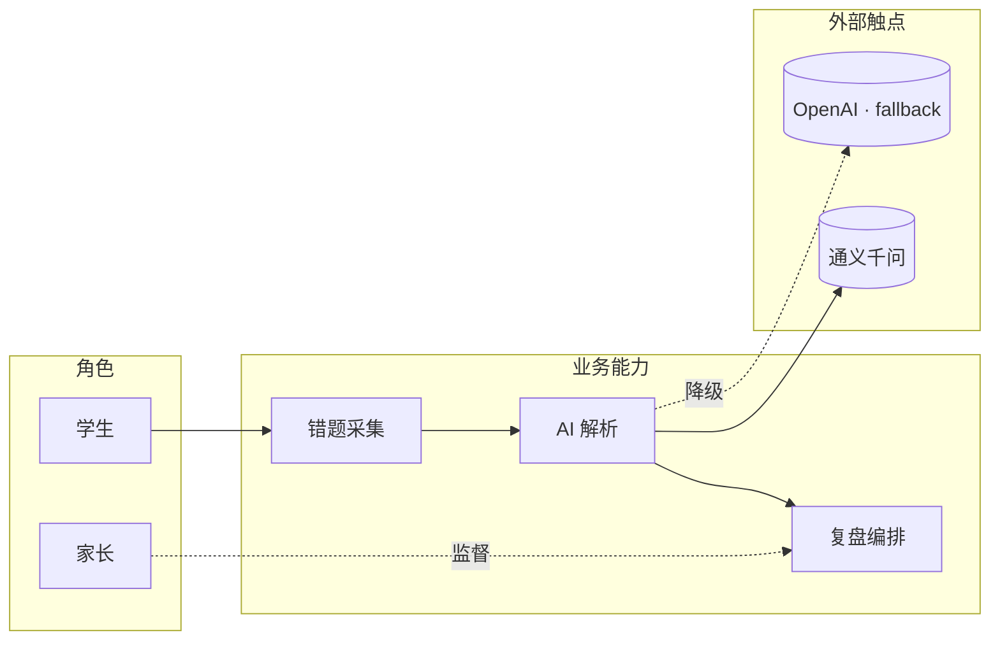

# 落地实施计划 — AI 错题本（基于通用日历系统 + 艾宾浩斯）

> 版本：**v1.9 · 2026-04-23**（9 段式 Phase 自包含 · **业务分析 YAML 前置** · 业务理解&业务架构 + 架构设计双前置 · Design Gate 硬门禁 · G-Biz 主动征询 · Context & Continuity 契约 · Test Oracle 独立契约 · 后端联调闸 S5.5 · Mutation Kill Rate 硬阈值 · **SC ↔ Phase 双向映射 + 四角色穿透 + 业务匹配报告** · **AC 分行 + verification_matrix + Planner 切卡** · **E2E 失败闭环 + Triage/Fix Agent**）
> 定位：**AI 可执行蓝本** — 每一个 Phase 都是自包含的 9 段式契约（**业务分析 / 业务理解&业务架构 / 架构设计** / 目标 / 工具白名单 / DoR / 产出 / 执行步骤 / 验证断言 / DoD / 回滚 / git tag），让后续 AI Agent **打开任意一章即可独立完成**，无需回翻全局章节。
>
> **v1.8 → v1.9 变更**（事中过程失败闭环自动化 · 把"E2E 失败 → 分析 → 修复"从"人驱动"变成"AI 三 Agent 协同闭环"）：
> - **§27 E2E 失败闭环（新章节）** — 三个 Agent 协同：E2E Runner Agent（按 AC × matrix 跑 120-180 条）· Triage Agent（六类分诊：code_bug_backend / code_bug_frontend / test_flake / matrix_ambiguity / infra_issue / visual_drift · confidence > 0.8 自动派 · 否则 User 批）· Fix Agent（写权限严格限到 triage 报告的 `related_files` + 对应测试 · 循环上限 3 次 · 超限升级 `needs-human` issue）。
> - **S9 E2E 扩容** — 5 条大场景 → 按 SC/AC/matrix 的 120-180 条覆盖策略（每 SC 至少 1 条主链路 · 每 critical AC 1 条 · error_paths/boundary/observable 每 AC 抽样 1 · visual 全跑不抽）。V-S9-21 + DoD-S9-21 新增。
> - **§1.5 通用约束新增 #14 · 失败闭环可追溯** — 每个 E2E 失败样本必须产 `triage-report.yml` 关联到具体 AC + matrix 行 + commit · Fix Agent 的每次提交必须带 `[triage/<failure_id>]` 前缀 · 循环计数入 `reports/triage-ledger.yml`。
> - **§23 风险登记册新增 R16 · E2E 失败闭环失灵** — 子风险：Triage 误判派错 Agent · Fix 越界改他处 · 死循环三修不过。对策：confidence 阈值 + 写权限白名单 + 循环上限 3 + Verifier 抽查 triage 判定准确率。
> - **§25 Playbook 17 步** — v1.8 的 15 步再加 2 步：(16) Phase 内 E2E 失败自动 Triage/Fix 闭环 · (17) 未闭环失败升级 needs-human 人工介入。
> - **附录 C 追加 v1.9 横切约束块** — E2E 闭环独立于业务广度（R14）· 业务深度（R15）· 五控制合起来：R11 Oracle / R12 Mutation / R13 联调 / R14 广度 / R15 深度 / R16 闭环。
> - **Matrix Challenger Agent（候选增强）** — v1.9 保留位 · 0.0.5 后 0.1 前跑一次 · 挑战 matrix 是否漏关键反面路径 · 产 challenge 清单给 User 决定。目前仅文档预留 · 第一个 Phase 跑完后再决定是否激活。
> - **不破坏性**：不新增 Phase · 不改 11 字段骨架 · 不改已落地 Phase 编号 · v1.8 所有脚本/门禁/产物保留不动。
>
> **v1.7 → v1.8 变更**（事中业务驱动 + 验收 100% 覆盖所开发场景 + 视觉回归 · 把"做没做"升级为"做到什么程度可机械校验"）：
> - **§1.5 通用约束新增 #13 · 按 AC 分行** — arch.md 必须按 `## AC: SC-XX-ACY` 分节 · 每节含 API/domain/event/error/NFR 五行 · commit message 必带 `[SC-XX-ACY]` 前缀 · 每个 AC 至少一次 commit · 测试方法必含 `@CoversAC("SC-XX-ACY#<category>.<index>")` 注解。
> - **business-analysis.yml 扩 `verification_matrix` 五类 + `critical` 标签** — 每个 AC 的验证点分五类：happy_path / error_paths / boundary / observable / visual（仅前端 AC）。critical 标签涉钱/权限/删除/并发/合规/未成年人数据六项任一即 true。Verifier Agent 对 critical AC 100% 独立复写，非 critical 按默认抽样。
> - **Planner Agent 按 AC × matrix 切任务卡** — 每张卡 = 1 AC 的 1 matrix 行 · Builder 每张卡 prompt context 只含本 AC 的 YAML 摘录 + arch 摘录 · 禁止动 arch.md / 其他 AC 代码。产 `design/tasks/<phase>-cards/*.md`。
> - **0.2 架构模板硬约束按 AC 分节** — `check-ac-coverage.sh --arch` 机械扫 section 齐全 + 五行齐全。
> - **视觉回归并入 matrix** — Playwright 截图 vs `design/system/screenshots/baseline/<mockup-id>.png` diff · 阈值列表页 3% · 富交互页 8%。Sd Phase DoD 新增 baseline 产物。**禁止反模式**：(a) 严禁 Phase 内 `--update-snapshots` 写新 baseline（仅 Sd Phase `gen-visual-baseline.sh` 允许）·  (b) 严禁拿"前端首跑截图"当 baseline（self-regression 等于无视觉门）· (c) 严禁绕过 `check-ac-coverage.sh --visual` 跑独立 spec 自封 baseline · 一经发现按"业务隐性收窄"处理 · Phase tag 撤回。
> - **六领域 Phase 追加 V-SX-20 业务深度闸 + DoD-SX-20**（S3/S4/S5/S7/S8/S11）— 四/五子命令：`--arch / --commits / --tests / --visual / Verifier 抽样复写`。任一不过 Phase 不能收尾。
> - **§23 新增 R15 · 业务深度不达** — AI 按 AC 做了结构但测试水 / 断言松 / mock 糊。对策：verification_matrix 五类强制 + Verifier 独立复写 + 未来 v1.9+ 按 AC 切 mutation。
> - **§26 Retrofit 流程（新章节）** — 已完成 Phase（`<phase>-done` tag 存在）升级到 v1.8 的六步流程：retrofit-to-v18.sh → User 审 retrofit-plan.md → Builder 按 plan 执行 → Verifier 100% 全量独立复写（不抽样）→ V-SX-20 含 retrofit 豁免跑过 → 打 `<phase>-v1.8-compliant` tag。commit history / arch 重写 / 暴露旧 bug 四豁免写入文档。
> - **§25 Playbook 14 → 15 步** — 插入 "4a · Planner 按 AC × matrix 切任务卡" · 6 步 "Builder 逐卡执行带前缀 commit + 本地自检"。
> - **附录 C 追加 v1.8 横切约束块** — 业务深度（R15）独立于业务广度（R14）· 不互替。
> - **不破坏性**：v1.7 所有门禁保留 · 新旧 Phase 并行（新按 v1.8 · 老走 retrofit · Batch A/B 并行）。
>
> **v1.6 → v1.7 变更**（业务覆盖完整性加固 · 把"漏题/越界/无证据链"从"靠人发现"变成"机械校验"）：
> - **§1.5 Phase 结构契约新增 0.0.5 业务分析（Business Analysis · YAML 产物）** — 位于 0.1 业务理解之前，产出 `design/analysis/<phase-id>-business-analysis.yml`。字段：`sc_covered`（本 Phase 声明覆盖的 SC 集合）· `ac_coverage`（每个 AC 含 `domain_entities` / `user_journey` / `upstream_contract` / `downstream_contract` / `four_role_slots` / `risks`）· `narrative`（散文说理）。**四角色 slots**：前端 Phase = `architect_anchor / dev_anchor / qa_anchor / ux_anchor`；后端 Phase = `architect_anchor / dev_anchor / qa_anchor / observable_behavior_anchor`（UX 由 `observable_behavior_anchor` 替换 · 指向 API 契约或 metric）。Planner Agent 未落此 YAML 禁止进入 0.1 业务理解。
> - **新增 `design/sc-phase-mapping.yml` · SC↔Phase 双向映射单一真源** — S0 一次性落 SC 级映射（15 条 · 每条含 `owner_phases` + `source` 锚点 + 本章节题头）；AC 级在各 Phase 进入前由该 Phase 增量补全。机械约束：本 Phase `business-analysis.yml` 的 `sc_covered` 必须 = mapping 中 `owner_phases` 含本 phase 的 SC 集合（**不越界 · 不漏题**）。S9 汇总断言 15 SC × 所有 AC 的 `owner_phases` 并集 = 全集，否则 Release 停机。
> - **新增业务匹配报告（Business Match Report）** — Phase 收尾时 Verifier Agent 生成 `reports/phase-<id>-business-match.md`，每个 AC 一行，列出四角色锚点（架构文件 · commit hash + 文件路径 + 行号 · test id · UX mockup 或 observable 锚点）及状态（✅/⚠️延后/❌缺失）。延后必须指向接手 Phase，接手 Phase DoR 会接到。**User 对 SC 级聚合签字**（不到 AC 级 · 减负），Verifier Agent 机械门禁在前。
> - **§1.5 通用约束新增第 11/12 条 · DoR/DoD 硬检查**：
>   - **通用 DoR #11**：本 Phase `business-analysis.yml` 存在 · `sc_covered` ⊇ `sc-phase-mapping.yml` 中归属本 Phase 的 SC · `biz_gate: approved` 对象从 arch md front matter 扩展到 analysis yml。
>   - **通用 DoD #12**：`bash ops/scripts/check-business-match.sh <phase-id>` 返回 0（四角色 slots 全非空或有豁免链 · dev/qa 锚点指向的文件/test 真实存在 · 匹配报告已 User 签字）· 声明覆盖率 = 100%。
> - **S0 产出物追加 2 文件 + 1 脚本** — `design/sc-phase-mapping.yml`（15 SC 占位 · User 在 S0 后填 owner_phases 和 source 锚点 · 不预签）· `design/analysis/_template.yml`（Phase 进入时复制命名）· `ops/scripts/check-business-match.sh`（含 `--ownership / --slots / --match / --aggregate` 四种子命令）。
> - **领域重镇 Phase（S3/S4/S5/S7/S8/S11）追加 0.0.5 小节** — 每 Phase 章头追加"业务分析（Business Analysis · §1.5 第 0.0.5 行）"小节，含 `<phase-id>-business-analysis.yml` 示例骨架（sc_covered + AC 的四角色 slots 预填架构/UX/可观察行为锚点，dev/qa 留空等执行回填）· §x.5 DoR 追加 1 行（business-analysis 完备）· §x.8 追加 V 条目（check-business-match <phase>）· §x.9 DoD 追加 1 行。S11 为全栈 Phase，按 AC 类型择 `ux_anchor`（前端 SC-11/13/14）或 `observable_behavior_anchor`（后端 SC-12/15）。
> - **S9 追加全局业务覆盖率汇总闸** — V-S9-19 `check-business-match.sh --aggregate` · DoD-S9-17 全项目 15 SC × 所有 AC 归属并集 = 全集 · 业务匹配聚合报告 `reports/global-business-match.md` 必在。
> - **§23 风险登记册新增 R14 · 业务漏题/越界/假占位** — 概率中 · 影响极高 · 对策 = §1.5 通用约束 #11/#12 + sc-phase-mapping 单一真源 + Verifier Agent 独立机械校验 + 四角色锚点真实性 grep + User SC 级抽签。
> - **§25 Playbook 调整第 4 条之前插入"先落 business-analysis.yml"** — G-Biz 主动征询的"问题清单"必须由 analysis yml 中的 `risks` 字段驱动。
> - **不破坏性**：不新增 Phase · 不改 11 字段骨架 · 不改已落地的 Phase 编号 · v1.6 的所有脚本/门禁/产物保留不动。
>
> **v1.5 → v1.6 变更**（测试与联调加固 · 5 条建议全部落地 + 2 条通用 DoR/DoD 硬规则）：
> - **新增 Phase S5.5 · 后端联调闸（Backend Integration Gate）** — 插入 S6 与 S7 之间（DoR = `{s3-done, s4-done, s5-done, s6-done}`）。用 `docker-compose.backend-only.yml` 起 gateway + 5 微服务 + pg + redis + rmq + nacos 全家桶，**不起前端**；Playwright/curl 打 API 级业务链路跑 ≥ 6 条跨服务事件链断言 + 3 条降级断言。动机：v1.5 里跨服务 bug 要到 S9 才被发现，修起来回溯链条长；S5.5 把这条缝补上。tag: `s5.5-done` · 0.1/0.2 豁免（无新领域符号）· 章节号 `## 10.5 Phase S5.5`（不动既有编号）。
> - **新增 §1.9 Test Oracle Contract（Oracle 独立契约）** — 所有 DoD 断言的 "oracle"（正确性来源）必须来自 `design/acceptance-criteria-signed.yml`，该文件由 **User 独立签字**，**不允许 Builder Agent 自己签/改**（`signed_by != builder_agent`）。动机：AI 同源错误——测试和实现都相信同一个错误假设，测试永绿线上炸。`ops/scripts/check-oracle-source.sh` 机械校验每条 DoD 断言都能在 signed yml 中 grep 到来源。
> - **§1.5 Phase 结构契约 · 新增 2 条通用 DoR/DoD 硬检查**（C 级豁免 Phase 除外）：
>   - **DoR 新增 4**：若本 Phase 依赖 backend（消费服务）→ 必须存在 `s5.5-done` tag 并且 `backend-integration-gate.sh` 最近一次运行 green；`design/acceptance-criteria-signed.yml` 本 Phase 相关 AC 必须 `signed_by: @user` 且 `signed_at` 不早于本 Phase 启动。
>   - **DoD 新增 3**：`bash ops/scripts/check-test-effectiveness.sh <phase-id>` 返回 0（mutation kill rate ≥ 60% 或 front matter 声明 `mutation_exempt: true` + 理由）；`bash ops/scripts/check-oracle-source.sh <phase-id>` 返回 0（所有 DoD 断言 oracle 可追溯 signed yml）。
>   - **§1.5 关键约束新增第 9/10 条**：第 9 条 Mutation Kill Rate ≥ 60% 或显式豁免；第 10 条 Oracle 独立签字。
> - **S7 / S8 新增 API 适配层契约测试** — 前端 `api-client` package 对 OpenAPI schema 跑 msw + `openapi-response-validator`，**不打真后端**（专测 adapter 字段改名 / null / 错误码解析）；DoD 追加 "adapter 契约测试 100% pass"。S7 DoR 追加 "s5.5-done tag 存在"。
> - **S9 DoD 追加 3 条** — (a) 全项目 mutation kill rate ≥ 60%（Pitest for backend · Stryker for frontend）；(b) `report-test-effectiveness.sh` 产出剪枝候选清单作为证据（不必删 · 记录即可）；(c) Oracle 100% 来自 `acceptance-criteria-signed.yml`。
> - **§23 风险登记册新增 R11 · Oracle 同源偏见** — 概率中 · 影响高 · 对策 = §1.9 Oracle Contract · 指派 Verifier Agent 独立跑 check-oracle-source.sh。
> - **§1.6 工具白名单全局追加**：Pitest 1.15+（Java mutation）、Stryker 8+（JS mutation）、msw 2.x、`@seriousme/openapi-schema-validator` 或 `openapi-response-validator` 7+、`docker-compose` v2+（仅用于 S5.5 backend-only stack）。
> - **§25 Playbook + 附录 C DAG 同步** — Playbook 第 5 条"逐阶段执行"内插 S5.5 分段；DAG 图在 S5/S6 → S7 之间插入 S5.5 节点。
> - **S0 产出物追加 3 个脚本骨架** — `check-test-effectiveness.sh` / `check-oracle-source.sh` / `backend-integration-gate.sh`；`design/acceptance-criteria-signed.yml` 空白模板（15 SC 占位 · User 需在 S0 后独立签字）。
>
> **v1.4 → v1.5 变更**（本次补丁 · 最小改动 · 不动 11 字段骨架 / 不动已落地 Phase）：
> - **§1.5 表格 0.1 行扩容**：字段名从 "业务理解（Business Understanding）" 改为 "**业务理解 & 业务架构（Business Understanding & Business Architecture）**"；产出除原有摘录 + 假设清单外，**新增强制项**：一张 Mermaid `flowchart` 或 `C4-Context` 业务架构图（业务能力 / 角色 / 关键价值流 / 外部触点），写入 `design/arch/<phase-id>.md` 第 0 节。动机：v1.4 的 0.1 只做"摘录 + 歧义"，没有把"业务架构 → 系统架构"那一跳**显性化**，导致 0.2 的领域模型容易跳过业务维度直接进入实体表。
> - **§1.5 关键约束新增第 8 条**：0.2 领域模型聚合根 / 实体 / 值对象的名称必须能映射到 0.1 业务架构图的节点（`check-arch-consistency.sh` 增加 `--trace-biz` 模式机械校验），找不到来源即 Block；防止"系统架构凭空长出一个业务里没有的聚合"。
> - **§1.7 G-Biz 主动征询环节（规则 A' · 新增）**：AI 在 `/biz-ok` 前必须用 `AskUserQuestion` **主动**向 User 提出至少 3 个"特殊要求"问题（合规禁区 / 性能红线 / 迁移约束 / 优先级排序 / 领域偏好 等），答案写进 `design/arch/<phase-id>.md` front matter 新字段 `special_requirements: [...]`（允许显式 `none`，不允许缺失）；该数组不存在即 G-Biz 无法 approved。动机：v1.4 的 G-Biz 是"被动等签字"，AI 不主动问、User 不主动说 = 盲区永远是盲区。
> - **§1.7 规则 B front matter schema 新增两字段**：`business_arch_diagram`（指向本文档内第 0 节的锚点或外链，必填）、`special_requirements`（YAML list，必填）。
> - **§1.7 规则 D Planner 状态机调整**：在 "AI 生成 0.1 草稿" 与 "等待 User `/biz-ok`" 之间插入一步 —— "Planner 驱动 Builder 完成 `special_requirements` 征询并回写 front matter"；未完成即 `biz_gate` 永远停在 `draft`。
> - **§1.7 规则 E 漂移检测新增一行**：编码时 pre-commit hook 额外扫描 0.2 实体名 → 0.1 业务架构节点的映射；缺映射拒绝 commit。
> - **§25 Playbook 调整第 3 条前置**：若本 Phase 属 S3/S4/S5/S7/S8/S11 且 `biz_gate != approved`，Planner 在冷启动 5 步读入之后必须**首先**驱动 G-Biz 主动征询环节，不得跳过直接进入 0.2 架构设计。
> - **迁移策略**：已写好的 S3/S4/S5/S7/S8/S11 Phase 0.1 段不强制立即回写，采用**惰性迁移** —— 每个 Phase 下次被 Builder/Reviewer 触碰时补齐业务架构图 + 特殊要求数组；S0 DoR 增加一条 `ops/scripts/check-biz-arch.sh` 脚本落地（骨架见 §1.7 规则 C 扩展）。
>
> **v1.3 → v1.4 变更**：
> - **新增 §1.8 Context & Continuity Contract（上下文与连贯性契约）**：把"状态 / 依赖 / 推理上下文"三个维度显式解耦。任务状态外化到 `state/phase-<id>.yml`，跨 Phase 依赖走 `state/interfaces.yml`（`path` + `sha256` + `symbols`），Agent 生命周期受 **冷启动 5 步读入** 与 **Reset 触发边界（tool_call / token / 重试次数）** 约束；handoff 文件 `state/scratch_summary_<phase>_<task>.md` 是 reset 后新 Agent 唯一续接依据。动机：v1.3 解决了"建什么 / 为什么建"，但未解决"Agent 怎么活、怎么死、怎么接班"——长任务 context 污染与跨 Phase 连贯性丢失。
> - **§1.4 AI 执行约定新增两条**（第 12–13 条）：冷启动协议与任务 DAG 外化。
> - **§1.5 Phase 结构契约 DoR 字段语义扩充**：`state/phase-<id>.yml` 初始化成为硬前置；DoD 必须新增一条 `check-continuity.sh <phase-id>` 返回 0。
> - **§25 Playbook 插入冷启动步骤**：每阶段启动前必须执行"冷启动 5 步读入"。
> - **Builder / Planner / Reviewer / Verifier Agent 职责再分工**（§1.8 规则 F）：Builder 的每次调用都是一次性的，无跨 task 记忆；Planner 不持有代码细节；所有跨 task / 跨 Phase 的"我记得过 X"必须 grep Git 才算数。
>
> **v1.2 → v1.3 变更**：
> - **Phase 结构契约从 9 字段扩展为 11 字段**（§1.5）：在 DoR 前追加 **0.1 业务理解（Business Understanding）** + **0.2 架构设计（Architecture Design）** 两段；消除"AI 直接跳到编码、语义靠猜"的漂移风险。
> - **新增 §1.7 Design Gate 契约**：定义 **G-Biz（业务闸）** 与 **G-Arch（架构闸）** 两道门禁；凭 `design/arch/<phase-id>.md` 的 `gate_status: approved` 放行；提供 `check-arch-consistency.sh` 扫描代码与架构文档的符号一致性。
> - **适用范围分级**：S3/S4/S5/S7/S8/S11 六个领域重镇 Phase 强制完整执行 0.1+0.2；S1/S6/S10 部分执行；S0/S2/S9/Sd 豁免（头部显式声明豁免理由）。
> - Playbook（§25）外循环调度器加入 Design Gate 检查步骤。
>
> **v1.1 → v1.2 变更**（保留）：
> - 所有 Phase（S0..S11 + Sd）扩展为 7 段式自包含结构。
> - §1.5 新增"Phase 结构契约"——所有 Phase 必须满足的 9 字段规范。
> - §1.6 新增"工具白名单硬规则"——未在白名单内的工具出现即视为违规，Reviewer Agent 有否决权。
> - 所有 Phase 的"验证步骤"与 DoD 解耦：DoD 是声明式（`覆盖率 ≥ 60%`），验证步骤是命令式（`grep -E ... && [ $? -eq 0 ]`），由验证步骤喂数据给 DoD。
> - 每个 Phase 追加"失败回滚（局部）"——与全局风险登记册 §23 解耦。
> 依据文档：
> - `design/业务与技术解决方案_AI错题本_基于日历系统.md`（v1.2 · 含匿名态 SC-11..SC-15）
> - `design/Sd设计阶段_决策备忘_v1.0.md`（Code-as-Design 决策与 Sd 九产出）
> 依据基线：
> - 后端 `/Users/allenwang/build/longfeng/backend`（Spring Boot · `com.longfeng.wrongbook`）
> - 前端 `/Users/allenwang/build/longfeng/frontend`（待 scaffold · pnpm workspace）
> - 设计 `/Users/allenwang/build/longfeng/design`（19 张 mockup + 方案 md + Sd 决策备忘 + 本计划）
> 最终交付：K8S 集群（用户提供）+ Git 仓库（用户提供）→ AI 自动部署 → AI 自动验收 → 覆盖方案 v1.2 全部业务（含 SC-01..SC-15）。

---

## 0. 计划摘要（TL;DR）

> **执行模型**：本计划由 AI Agent 端到端执行，**不使用"人天/人日"**作为度量单位。工作量以「**阶段数 · 依赖深度 · 并行度 · 产出规模**」描述；进度以「**阶段 DoD 是否全绿**」判定。

| 维度 | 指标 | 目标 |
|---|---|---|
| 执行主体 | AI Agent 顺序 + 并行编排 | **无人工编码** · 仅用户在 Gate 决策节点确认 |
| 阶段数 | S0–S11 + **Sd** | **13 个阶段**（Sd 与 S11 均为独立并行链） |
| 依赖深度 | 关键路径最长链：S0→S1→S2→S3→S4→S5→S7→S8→S9→S10 | **10 级** · Sd / S11 均为支链不影响 |
| 并行度 | 关键路径 + **Sd 设计系统** + **S11 匿名服务** | **3 条** |
| 代码产出 | 后端微服务 5 + 网关 1 + 前端 app 2 + 共享包 4 + **设计系统包 1**（tokens / ui-kit / storybook / 原型） | **13 个工件** |
| 设计系统 | Code-as-Design 栈 · 19 张 mockup + Token JSON + Storybook + 可点击原型 | **9 产出 + 1 Review Gate** |
| 数据表 | 核心 9 + 匿名 7 + 审计 2 = **18 张** | 100% Flyway 管理 |
| API 端点 | 11 个业务 API + 6 个匿名 API + 3 个运维 API = **20 个端点** | 100% OpenAPI 3.0 |
| 自动化测试 | Playwright × 15 SC + 单元 + 契约 + 性能 | **E2E ≥ 90% · 单元 ≥ 70%** |
| 部署 | Helm Chart 5 + ArgoCD 应用集 | 蓝绿 · 自动回滚 |
| 验收 | 三道闸：冒烟 / 业务场景 / 非功能 | **15 SC × 76 断言 100% PASS** |
| 可观测 | Prometheus + Grafana + Sentry + OTEL | **黄金四指标 SLO ≥ 99%** |

> **为什么不再报"人天"**：AI Agent 的单位产出不受 8h 工作制约束，阶段耗时取决于 LLM 调用时长 + 构建/测试时长 + 依赖拉取时长，而非人力日历。因此本计划删除所有"人日"估算，改用「**阶段依赖图**」与「**DoD 阈值**」作为可度量、可监督的进度锚点。

**核心执行路径**：
```
[用户提供] Git URL + K8S kubeconfig
        ↓
AI Agent 按本文档依赖 DAG 执行 S0 → {S1..S10 关键路径 / Sd / S11} → S9 汇合
        ↓
每阶段 DoD 校验 → git tag → push
        ↓
ArgoCD 监听 tag → 部署至 staging namespace
        ↓
AI Agent 触发 three-gate-acceptance.sh
        ↓
Gate1 健康检查 → Gate2 业务 SC-01..SC-15 → Gate3 性能基线
        ↓
全绿 → git tag release-v1.0.0 → 部署至 prod namespace
        ↓
生成 ACCEPTANCE_REPORT.md + 通知用户
```

---

## 1. 执行前提（Pre-conditions）

### 1.1 输入契约（Inputs）

| 物料 | 来源 | 形态 | 必需 |
|---|---|---|---|
| 业务方案 | `design/业务与技术解决方案_AI错题本_基于日历系统.md` | Markdown v1.2 | ✅ |
| 视觉基线 | `design/mockups/wrongbook/00..18.html`（19 张） | HTML iFrame 作品集 | ✅ |
| 日历骨架 | `design/AI落地实施计划_通用日历系统.md` | Markdown | ✅ |
| 前端规划 | `design/AI落地实施计划_前端UI_UX与联调.md` | Markdown | ✅ |
| 艾宾浩斯原则 | `design/艾宾浩斯.md` | Markdown | ✅ |
| Git 仓库 | 用户提供 `git@*.git` HTTPS/SSH 均可 | 写权限 | ⏳ S0 补充 |
| K8S 集群 | 用户提供 `kubeconfig` | Admin/Edit 权限 | ⏳ S10 补充 |
| 域名 + 证书 | 用户提供 `*.longfeng.io` | DNS + ACME | ⏳ S10 补充 |
| AI 供应商密钥 | 通义千问企业版 API Key + OpenAI Key | Secret | ⏳ S3 补充 |
| 对象存储 | MinIO / 阿里云 OSS / AWS S3 | AK/SK | ⏳ S2 补充 |
| 消息短信 | 阿里云短信 / 腾讯云短信 模板 ID | Secret | ⏳ S6 补充 |
| 微信开放平台 | mpAppId + mpAppSecret + 订阅消息模板 AT0001 | Secret | ⏳ S6 补充 |

### 1.2 角色与职责（AI-first RACI）

> **核心假设**：本计划所有"制造环节"（编码 / 单测 / 契约 / 部署脚本 / E2E / 部署 / 验收）均由 AI Agent 承担。**人类（用户）只在三个决策节点出现**：① 启动时提供输入 ② 阶段 Gate 失败时裁决 ③ 生产发布前确认。

| 角色 | 实现 | 职责 | R/A/C/I |
|---|---|---|---|
| **User（唯一人类）** | Allen / Plan Owner | 提供 `$GIT_URL` / `$KUBECONFIG` / AI API Key；在 Gate 失败或风险事件时作最终裁决；生产发布前书面确认 | **A**（Accountable · 最终问责） |
| **Planner Agent** | AI Agent · 读本文档 | 解析计划、生成当前阶段任务列表、校验前置依赖 | R（执行） |
| **Design Agent** | AI Agent · 绑定 Sd 分支 | 产出 Sd.1..Sd.9 设计系统九件套、维护 tokens / ui-kit / storybook / 原型、走 Sd Review Gate 自审 | R |
| **Builder Agent** | AI Agent · 可多实例并行 | 按阶段落地文件、编译、跑单测、提交 PR | R |
| **Reviewer Agent** | AI Agent · 独立上下文 | Code Review、Convention/安全/契约检查、对 PR 给出 Approve/Block；Sd 独立实例执行 Sd Review Gate | R |
| **Verifier Agent** | AI Agent · 独立实例 | 执行 DoD 脚本、三道闸验收、生成 `ACCEPTANCE_REPORT.md` | R |
| **Deployer Agent** | AI Agent · 绑定 `$KUBECONFIG` | 调 ArgoCD / Helm 部署、监控 rollout、触发回滚 | R |
| **Observer Agent**（可选） | AI Agent · 监听告警 | 7×24 监听 Prometheus 告警，按 Runbook 自愈或升级至 User | C（咨询） |

**关键约束**：

1. **制造 = AI · 决策 = 人**：所有自动化环节无需人工；所有不可逆决策（生产发布、合规例外、预算追加）必须 User 签字。
2. **Agent 间隔离**：Builder / Reviewer / Verifier 必须在**独立上下文**中运行，避免"自己改自己批"导致的评审失真。
3. **Reviewer Agent 的 Approve 条件**：Convention / SAST / 覆盖率 / 契约 / 变更范围 五项全绿方可 Approve；任一不通过必须生成具体的 change-request 评论。
4. **冲突升级路径**：Verifier 与 Builder 分歧 → Planner 仲裁 → 仍分歧 → 升级至 User。
5. **审计全留痕**：每个 Agent 的 prompt / tool-call / 输出均写入 `docs/agent-audit/SX-YYYY-MM-DD.jsonl`，User 可随时审查决策链。

### 1.3 工具链准备清单

| 类别 | 工具 | 版本 | 用途 |
|---|---|---|---|
| JDK | Eclipse Temurin | 17 LTS | 后端运行时 |
| 构建 | Maven | 3.9+ | 后端构建 |
| Node | Node.js | 20 LTS | 前端运行时 |
| 包管理 | pnpm | 9+ | monorepo |
| 容器 | Docker | 24+ | 镜像构建 |
| K8S CLI | kubectl | 1.28+ | 集群操作 |
| Helm | Helm | 3.13+ | Chart 管理 |
| GitOps | ArgoCD CLI | 2.9+ | 持续部署 |
| CI | GitHub Actions / GitLab CI | latest | 流水线 |
| 数据库 | PostgreSQL | 16 + pgvector 0.6 | 关系 + 向量 |
| 缓存 | Redis | 7 | 会话 + Bloom Filter |
| MQ | RocketMQ | 5.1 | 异步事件 |
| **Spring Cloud BOM** | **spring-cloud-dependencies** | **2023.0.1** | **Cloud 组件版本锁** |
| **Alibaba BOM** | **spring-cloud-alibaba-dependencies** | **2023.0.1.0** | **Alibaba 组件版本锁 · 与 Spring Cloud 对齐** |
| 注册/配置中心 | Nacos（Alibaba） | 2.3 | 配置 + 服务发现（统一走 Alibaba 家族） |
| 流控 / 熔断 | **Sentinel**（Alibaba） | **1.8.8** | **首选** · 微服务调用 + Gateway Adapter（`sentinel-spring-cloud-gateway-adapter`） |
| 流控 / 熔断（回退） | Resilience4j | 2.2.x | **仅限 Sentinel 适配器有缺口的 Reactor 场景** · 需 ADR 说明为什么不用 Sentinel |
| 消息队列 | **RocketMQ**（Alibaba） | 5.1 | 异步事件 · `spring-cloud-starter-alibaba-rocketmq` |
| 分布式事务 | **Seata**（Alibaba） | **不采用** | **本项目走 Outbox + RocketMQ 事务消息保最终一致**（见 ADR 0002） |
| 持久层 | **Spring Data JPA (Hibernate 6)** + QueryDSL | JPA 3.2 / QDSL 5.0.x | **唯一持久层** · 禁用 MyBatis/MyBatis-Plus |
| 调度 | XXL-Job | 2.4 | 艾宾浩斯触发 |
| AI SDK | **Spring AI**（含 Alibaba `spring-ai-dashscope`） | 1.0.0-M1 | 多模态 · dashscope + openai 双供应商 |
| E2E | Playwright | 1.42+ | 浏览器自动化 |
| 观测 | Prometheus / Grafana / Sentry / Loki / Tempo | latest | 指标/日志/APM |
| **设计 Token** | **Style Dictionary** | **4.x** | **转译到 CSS/SCSS/JS/WXSS** |
| **组件目录** | **Storybook** | **8.x** | **组件 × 状态 矩阵** |
| **A11y 扫描** | **@axe-core/cli** + Storybook addon | **4.x** | **WCAG AA · CI 集成** |
| **视觉回归** | **Chromatic** 或 **Percy** | **2024** | **Storybook 原生集成** |
| **流程图** | **Mermaid** | **11.x** | **Markdown 原生渲染** |
| **SVG 优化** | **SVGO** | **3.x** | **图标入库前自动瘦身** |
| **i18n** | **i18next / react-i18next** | **23.x** | **H5 + 小程序双端** |
| **硬编码检测** | **eslint-plugin-i18next** | **6.x** | **禁止 UI 源码中文字面量** |
| **Java Mutation Testing（v1.6 新增）** | **Pitest** | **1.15+** | **S3/S4/S5/S5.5/S6/S11 后端 · Mutation Kill Rate ≥ 60% 的 DoD 硬阈值** |
| **JS Mutation Testing（v1.6 新增）** | **Stryker Mutator** | **8.x** | **S7/S8 前端 + 匿名前端 · 与 Pitest 并列** |
| **前端网络层 mock（v1.6 新增）** | **msw**（Mock Service Worker） | **2.x** | **S7/S8 API 适配层契约测试 · 不打真后端 · 专测 adapter** |
| **OpenAPI Response 校验（v1.6 新增）** | **openapi-response-validator** / **@seriousme/openapi-schema-validator** | **7+** | **前端 adapter 对 OpenAPI schema 跑 response 校验** |
| **Backend-only 栈编排（v1.6 新增）** | **docker compose**（plugin v2） | **2.20+** | **仅用于 S5.5 backend-only stack · 起 gateway+5 微服务+pg+redis+rmq+nacos** |

### 1.3.1 后端技术栈决策（Java 云原生基线 · 不可协商）

本项目后端**完全走 Alibaba 家族 · 拒绝 Netflix OSS**。任何阶段 AI Agent 提交的 PR 若引入下列"禁用"依赖，Reviewer Agent 立即 Block。

| 职能 | **采用** | **禁用** | ADR |
|---|---|---|---|
| 微服务框架 | Spring Boot 3.2.5 + Spring Cloud 2023.0.1 | — | ADR 0001 |
| 注册 / 配置 | **Nacos 2.3** | Eureka · Consul · Apollo | ADR 0003 |
| 流控 / 熔断 | **Sentinel 1.8.8** | Hystrix · Ribbon · Archaius · Turbine | ADR 0004 |
| 消息 | **RocketMQ 5.1（Alibaba starter）** | Kafka · RabbitMQ（非必要） | ADR 0005 |
| 分布式事务 | **Outbox + RocketMQ 事务消息**（最终一致） | **Seata 不采用** | ADR 0002 |
| 持久层 | **Spring Data JPA + Hibernate 6 + QueryDSL 5** | MyBatis · MyBatis-Plus · JdbcTemplate 跨表查询 | ADR 0006 |
| API 网关 | Spring Cloud Gateway 4.1 + Sentinel Gateway Adapter | Zuul · Kong | ADR 0007 |
| AI | **Spring AI 1.0.0-M1**（dashscope + openai 双 Provider） | LangChain4j · 直连 RestTemplate | ADR 0008 |
| 观测 | Micrometer + OTEL + Sentry | Netflix Servo · Hystrix Metrics | ADR 0009 |

**BOM 叠加次序**（S0 parent `pom.xml` 必须按此顺序 import）：

```xml
<dependencyManagement>
  <dependencies>
    <dependency>
      <groupId>org.springframework.boot</groupId>
      <artifactId>spring-boot-dependencies</artifactId>
      <version>${spring-boot.version}</version>        <!-- 3.2.5 -->
      <type>pom</type><scope>import</scope>
    </dependency>
    <dependency>
      <groupId>org.springframework.cloud</groupId>
      <artifactId>spring-cloud-dependencies</artifactId>
      <version>${spring-cloud.version}</version>       <!-- 2023.0.1 -->
      <type>pom</type><scope>import</scope>
    </dependency>
    <dependency>
      <groupId>com.alibaba.cloud</groupId>
      <artifactId>spring-cloud-alibaba-dependencies</artifactId>
      <version>${spring-cloud-alibaba.version}</version> <!-- 2023.0.1.0 · 必须与 Spring Cloud 对齐 -->
      <type>pom</type><scope>import</scope>
    </dependency>
    <dependency>
      <groupId>org.springframework.ai</groupId>
      <artifactId>spring-ai-bom</artifactId>
      <version>${spring-ai.version}</version>          <!-- 1.0.0-M1 -->
      <type>pom</type><scope>import</scope>
    </dependency>
  </dependencies>
</dependencyManagement>
```

**关键 Alibaba starter 依赖**（各服务按需引入 · 版本由 BOM 管控）：

- `com.alibaba.cloud:spring-cloud-starter-alibaba-nacos-config` — 配置中心
- `com.alibaba.cloud:spring-cloud-starter-alibaba-nacos-discovery` — 服务发现
- `com.alibaba.cloud:spring-cloud-starter-alibaba-sentinel` — 流控 / 熔断
- `com.alibaba.cloud:spring-cloud-starter-alibaba-sentinel-gateway` — Gateway Adapter
- `com.alibaba.cloud:spring-cloud-starter-stream-rocketmq` — 事件驱动（若用 Spring Cloud Stream）
- `org.apache.rocketmq:rocketmq-spring-boot-starter` — 原生事务消息 / 顺序消息场景

### 1.4 AI 执行约定（Agent Contract）

AI Agent 在执行本计划时必须遵守：

1. **只读方案不擅自改**：AI 不能修改 `业务与技术解决方案_AI错题本_基于日历系统.md` 来让实现"更简单"。任何方案调整都必须以 PR 的形式提交、由 User 确认后方可回写方案 v1.3。
2. **DoD 是硬门禁**：每个阶段的 DoD 未全绿不能进入下一阶段；允许回滚但不允许跳过。**DoD 不以时间判定，只以指标判定**。
3. **关键路径串行 · 支链并行**：关键路径 S0→S1→S2..S10 严格顺序推进（前阶段 `git tag sX-done` 后方可触发下一阶段的 Planner Agent）；独立支链 S11 可自 S1 完成后独立启动。
4. **所有命令可重放**：每个阶段附带 `phase-sX-bootstrap.sh`，幂等可重复执行。失败重试不产生副作用。
5. **失败必写明**：任何阶段失败，Agent 必须在 `logs/phase-sX-<run-id>.md` 写"现场 / 根因 / 修复路径 / 已尝试动作"，不允许静默吞错。
6. **不编造依赖**：所有第三方包版本来自本文档 §1.3 工具链清单 + 附录 B 环境变量，Agent 不可擅自升级大版本；如需升级，走 ADR + User 确认。
7. **不跳过测试**：`-DskipTests` 仅允许出现在本地 debug 与 scaffolding 步骤，CI 与 DoD 必带测试；Verifier Agent 会静态扫描 CI yaml 禁止 `skipTests=true`。
8. **幂等/可观察/可审计**：Agent 的所有工具调用必须可被 `docs/agent-audit/` 重放；所有 `kubectl apply` / `git push` / `helm upgrade` 操作须带上下文注释。
9. **Phase 结构契约**：每个 Phase 必须满足 §1.5 的 **11 字段 9 段式**结构；缺字段即视为文档缺陷，Planner Agent 停机报错。
10. **工具白名单硬规则**：未在本 Phase 白名单内的工具出现即违规，Reviewer Agent 立即 Block、Planner Agent 立即停机（详见 §1.6）。
11. **Design Gate 硬门禁**：领域重镇 Phase（S3/S4/S5/S7/S8/S11）必须在 AI 执行步骤开跑前，完成 §1.7 定义的 **G-Biz（业务闸）** 与 **G-Arch（架构闸）** 双签字；`design/arch/<phase-id>.md` 的 `gate_status: approved` 未达成即 Planner Agent 停机（详见 §1.7）。
12. **冷启动协议**：任何 Agent 每次启动（冷启动或 reset 后重启）必须先执行 §1.8 规则 D 的 5 步读入序（Phase 章节 → `design/arch/<phase-id>.md` → `state/phase-<id>.yml` → `state/interfaces.yml` 中本 Phase DoR 声明依赖条目 → `scratch_summary_<phase>_<task>.md`），其余一律不读；**禁止凭"记得上次聊过"续写**——任何跨 task / 跨 Phase 的状态必须 grep Git 才算数（详见 §1.8）。
13. **任务 DAG 外化**：每个 Phase 的子任务依赖图必须在 `state/phase-<id>.yml` 的 `tasks[*].blocked_by` 字段显式声明；Planner Agent 以"读 state → 找 `status=pending && blocked_by.all(status=done)` 的 task → 派发给空白 Builder 实例（每 task 一个新会话）→ 更新 state"为唯一循环，Planner 自身不持有代码细节、不持有跨轮记忆（详见 §1.8）。

### 1.5 Phase 结构契约（9 段式 · 11 字段）

> **设计动机**：Playbook（§25）是**外循环调度器**——告诉 Agent "下一个 Phase 是谁"；Phase 自身必须是**自包含的内循环配方**——Agent 打开这一章就能独立跑完，不需要回翻全局章节。
>
> v1.3 在原有 7 段式（9 字段）之前追加 **0.1 业务理解** + **0.2 架构设计** 两段，成为 9 段式（11 字段）。动机是堵住 v1.2 发现的"语义真空"：7 段式只说"怎么建 / 怎么验"，没说"建什么 / 为什么这么建"，导致 AI 在 S3/S4/S5/S7/S8 这种领域重镇 Phase 里按自己对截图 / 类名的猜测编实现，和方案文档 §2A / §3 DDL 出现分歧。**业务理解强制 AI 先回方案文档抓原文，架构设计强制 AI 先产出可被 Reviewer 机械校验的设计契约文件**——通过 Design Gate（§1.7）拦下漂移。

**每个 Phase（§4..§16）必须且仅能包含以下 11 个字段，次序不得颠倒**：

| # | 字段 | 作用 | 类型 | 适用性 |
|---|---|---|---|---|
| **0.0.5** | **业务分析（Business Analysis · YAML 产物 · v1.7 新增）** | 产出 `design/analysis/<phase-id>-business-analysis.yml` · 字段：`sc_covered`（本 Phase 声明覆盖的 SC 集合 · 必须 = `sc-phase-mapping.yml` 中 `owner_phases` 含本 phase 的 SC 集合 · 不越界不漏题）· `ac_coverage`（每个 AC 含 `domain_entities` / `user_journey` / `upstream_contract` / `downstream_contract` / `four_role_slots` / `risks`）· `narrative`（≤ 400 字散文说理）· Planner Agent 未落此 YAML **禁止**进入 0.1。四角色 slots 两种形态：前端 Phase = `{architect_anchor, dev_anchor, qa_anchor, ux_anchor}`；后端 Phase = `{architect_anchor, dev_anchor, qa_anchor, observable_behavior_anchor}`（UX 由可观测行为锚点替换）。入口时 architect/ux/observable 预填，dev/qa 留空由后续 Step 回填 | YAML · 严格 schema · 机器可判定 | **S3/S4/S5/S7/S8/S11 强制** · S1/S6 强制 · S0/S2/S9/Sd 豁免（front matter 标 `analysis_exempt: true`） |
| **0.1** | **业务理解 & 业务架构（Business Understanding & Business Architecture）** | AI 从方案文档 / Sd 备忘录指定章节摘录本 Phase 覆盖的业务范围（≤ 300 字） + 列出"假设" / "歧义" / "需 User 确认项"，形成可签字清单 · **且必须产出一张 Mermaid `flowchart` 或 `C4-Context` 业务架构图**（业务能力 / 角色 / 关键价值流 / 外部触点 · 写入 `design/arch/<phase-id>.md` 第 0 节 · 成为 0.2 领域模型的命名来源） · **且必须通过 G-Biz 主动征询环节收集 `special_requirements`**（见 §1.7 规则 A' · 问题清单必须由 0.0.5 `risks` 字段驱动） | 自然语言 + Mermaid 图 + YAML list · 引用原文章节号 | **S3/S4/S5/S7/S8/S11 强制** · S1/S6 强制 · S0/S2/S9/Sd 豁免 |
| **0.2** | **架构设计（Architecture Design）** | 产出 `design/arch/<phase-id>.md` 兄弟文档 · 固定 6 节（领域模型 / 数据流 / 事件契约 / 非功能指标 / 外部依赖 / ADR 候选）· **v1.8 追加 · A 级 Phase 必须按 AC 分节**：领域模型 / 数据流 / 事件契约三节下含 `## AC: SC-XX-ACY · <AC text>` 子节 · 每子节必含五行 `API / Domain / Event / Error / NFR` · 冻结后作为后续执行步骤的符号来源 | MD + Mermaid + YAML/JSON Schema 混合 | **S3/S4/S5/S7/S8/S11 强制 · v1.8 AC 分节强制** · S10 强制（SLO/告警）· S1/S6 豁免 · S0/S2/S9/Sd 豁免 |
| 1 | **目标（Goal）** | 一句话陈述本 Phase 结束时状态的差异（"从 X 变成 Y"） | 自然语言 · 声明式 | 全部 |
| 2 | **工具白名单（Tool Allowlist）** | 本 Phase 允许出现的 CLI / SDK / Skill / MCP 工具 · 其他一律不碰 | 命名列表 · 机器可比对 | 全部 |
| 3 | **DoR（Definition of Ready）** | 进入本 Phase 前必须成立的前置条件（上游 tag · 输入契约 · Secret · **G-Biz/G-Arch 闸门状态** · **若依赖 backend 服务：`s5.5-done` tag + `backend-integration-gate.sh` 最近一次 green**（v1.6）· **本 Phase 相关 AC 已在 `design/acceptance-criteria-signed.yml` 由 User 独立签字**（v1.6）· **`<phase-id>-business-analysis.yml` 存在且 `sc_covered` = mapping 归属集合 · architect/UX 或 observable 锚点已入口预填**（v1.7 新增）） | checkbox 列表 | 全部（v1.6/v1.7 新增项对 C 级豁免 Phase 自动跳过） |
| 4 | **产出物清单（Artifacts）** | 本 Phase 结束时 Git 上应多出哪些文件 / 目录 | 路径列表 | 全部 |
| 5 | **AI 执行步骤（Numbered Steps）** | 幂等的 numbered 配方 · 每条带完整命令或关键文件内容内嵌 · **符号必须能在 §0.2 架构文档中 grep 到** · **v1.8 追加 · A 级 Phase 必须走 Planner 切卡流程**：Planner Agent 先按 AC × `verification_matrix` 行切任务卡（产 `design/tasks/<phase>-cards/*.md` · 每卡独立文件 · 命名 `<sc>-<ac>-<category>-<index>.md`）· Builder Agent 每张卡独立执行 · 卡 prompt context 硬约束只含本 AC 的 YAML 摘录（jq 切片）+ arch.md 的本 AC section（grep 切片）+ matrix 行 · commit message 带 `[SC-XX-ACY] <category>.<index>: <desc>` 前缀 · 测试方法 `@CoversAC("SC-XX-ACY#<category>.<index>")` · 禁止 Builder 动 arch.md / business-analysis.yml / 其他 AC 代码 | 命令式 · 可复制粘贴 | 全部 |
| 6 | **验证步骤（Self-Assertions）** | grep / curl / exit-code 级断言 · 每条独立可重放 · 返回 0/非 0 决定通过 · **必含 `check-arch-consistency.sh` 调用** · **必含 `check-test-effectiveness.sh` 调用**（v1.6）· **必含 `check-oracle-source.sh` 调用**（v1.6）· **必含 `check-business-match.sh <phase>` 调用**（v1.7）· **必含 `check-ac-coverage.sh <phase>` 四/五子命令调用**（v1.8 新增 · `--arch / --commits / --tests / --visual`）· **必含 `run-verifier.sh <phase>` 调用**（v1.8 · Verifier 独立复写抽样 / retrofit 100%） | 命令式 · 机器可判定 | 全部（对豁免 Phase front matter 标 `mutation_exempt: true` / `oracle_exempt: true` / `analysis_exempt: true` / `ac_partition_exempt: true` 后自动跳过） |
| 7 | **DoD（Definition of Done）** | 声明式闸门 · 由验证步骤喂数据 · 每条对应至少一条验证步骤 · **必含 mutation kill rate ≥ 60% 或显式豁免**（v1.6）· **必含 Oracle 100% 来自 signed yml**（v1.6）· **必含业务匹配报告 100% 四角色穿透 + User SC 级签字**（v1.7）· **必含业务深度闸 V-SX-20**（v1.8 新增 · arch 按 AC 分节五行齐 + commit 按 AC 前缀全覆盖 + matrix 行数 ≤ @CoversAC 测试方法数 + 视觉 diff 阈值内 + Verifier 抽样复写全绿 · critical AC 100% 复写） | 指标列表 · `指标 ≥ 阈值` | 全部 |
| 8 | **失败回滚（Local Rollback）** | 本 Phase 局部失败时的撤销方案（与全局 §23 解耦） | 命令式 · 可复制粘贴 | 全部 |
| 9 | **git tag** | 本 Phase 成功后必须打的 tag（`sX-done` / `sd-done` / **`sX-arch-frozen`**） | 固定字符串 | 全部 |

**适用性分级（v1.3 新增 · v1.7 扩容"0.0.5 业务分析"列 · v1.8 扩容"0.7 AC 分行"列）**：

| 等级 | Phase | 0.0.5 业务分析（v1.7） | 0.1 业务理解 & 业务架构 | 0.2 架构设计 | 0.7 AC 分行 + Planner 切卡（v1.8） | 理由 |
|---|---|---|---|---|---|---|
| **A · 完整** | **S3 / S4 / S5 / S7 / S8 / S11** | ✅ 强制 YAML + `verification_matrix` 五类 | ✅ 强制 | ✅ 强制 · 按 AC 分节 · 五行齐全 | ✅ 强制 · Planner 按 AC × matrix 切卡 · commit 带 `[SC-XX-ACY]` 前缀 · 测试 `@CoversAC` | 领域重镇 · prompt / 状态机 / SM-2 / IA / 隐私边界极易漂移 · 事中过程必须按 AC 切片 |
| **B · 部分** | S1 DDL | ⚠️ 精简 YAML（仅 SC 级映射 · 无 four_role_slots · DDL 即 AC） | ✅ 只做 0.1 | ⚠️ 0.2 写 "N/A · DDL 即契约 · 见 §5.6" | ⚠️ DDL 变更按 SC 分提交（迁移脚本按 SC 分文件）· 无 Planner 切卡 | DDL 本身即数据架构文档 |
| **B · 部分** | S6 file-service | ⚠️ 精简 YAML（`observable_behavior_anchor` = OSS 对象命名规范） | ✅ 只做 0.1 | ⚠️ 0.2 写 "N/A · OSS 封装 · 见 §10.6" | ⚠️ 仅验证测试 `@CoversAC` 覆盖声明的 AC · 无 Planner 切卡 | 以封装外部存储为主 |
| **B · 部分** | S10 可观测性 | ⚠️ 精简 YAML（仅 `cross_cutting` · 无 SC 归属 · `observable_behavior_anchor` = 告警规则 id） | ⚠️ 0.1 写 "N/A · infra · 见 §14 目标" | ✅ 只做 0.2（SLO / 告警阈值是设计决策） | ⚠️ 告警规则按 SC 分 yaml 文件 · 无 Planner 切卡 | 告警阈值必须和业务容量对齐 |
| **C · 豁免** | **S0 / S2 / S9 / Sd** | ⚠️ `analysis_exempt: true` + 理由 | ⚠️ 0.1 写 "本 Phase 豁免 · 理由：infra/fixture/沿用 Sd Gate" | ⚠️ 0.2 同上 | ⚠️ 豁免 AC 分行 · front matter 标 `ac_partition_exempt: true`；但 **S9 是例外** — 需对 E2E 用例按 SC/AC 打标签（见 §13.X + §27 E2E 闭环） | S0 脚手架 / S2 公共底座 / S9 E2E 用例固定来自 §2B + 含 AC 反查链 / Sd 有独立 G1-G8 |

> **豁免不等于删除**：即使 C 级豁免，0.1 与 0.2 两段仍然必须**出现在 Phase 中**（保持 11 字段结构不变），只是段落内容固定为"本 Phase 豁免 · 理由：[infra/fixture/沿用 Sd Gate]"。这样 Planner Agent 的结构校验可以一套逻辑覆盖全部 Phase。

**关键约束**：

1. **0.1 必须引用方案文档章节号**：每条假设 / 歧义后必须 `see 业务与技术解决方案_AI错题本_基于日历系统.md §X.Y`；不引用即视为凭空编造，Reviewer Agent Block。
2. **0.2 产出物必须 `gate_status: approved`**：`design/arch/<phase-id>.md` 的 YAML front matter 必须含 `gate_status`（`draft` / `in_review` / `approved`）与 `approved_by`（User Git handle）；未 approved 即进入执行步骤 = Planner Agent 立即停机（见 §1.7 G-Arch）。
3. **执行步骤符号可 grep 到架构文档**：Reviewer Agent 跑 `ops/scripts/check-arch-consistency.sh <phase-id>`，扫描本 Phase 新增/修改的类名 / API path / RocketMQ topic / Kafka key，每一个都必须能在 `design/arch/<phase-id>.md` 里 grep 到；找不到即 Block。
4. **DoD 与验证步骤解耦**：DoD 不再直接内嵌 `grep ...`；DoD 只声明"覆盖率 ≥ 60%"，验证步骤负责怎么取到这个数字。这样 Reviewer Agent 可以独立于 Verifier Agent 审阅 DoD 是否合理。
5. **验证步骤必须可重放**：每条验证命令在 Phase 结束后、下一次 CI 跑都能重新跑一次得到相同结论；禁止依赖"上一步刚生成的临时文件"（临时文件必须先 commit 或先持久化）。
6. **numbered 步骤之间不得有隐含依赖**：如果 Step 3 依赖 Step 2 的某个环境变量，Step 3 必须显式再 `export` 一次；Agent 不保证会话级环境变量持久化。
7. **缺字段 = 文档缺陷**：Planner Agent 读 Phase 时如发现 11 字段任一缺失或次序颠倒，**立即停机并写入 `logs/plan-defect-<phase>.md`**；不得"补救性执行"。
8. **0.2 领域模型名必须可回溯 0.1 业务架构节点（v1.5 新增）**：0.2 第 1 节"领域模型"里出现的每一个聚合根 / 实体 / 值对象名称，都必须能在 0.1 第 0 节的业务架构图（Mermaid 节点 label）中 grep 到来源；`ops/scripts/check-arch-consistency.sh <phase-id> --trace-biz` 机械扫描，缺映射即 Block。动机：防止"系统架构凭空长出一个业务里没有的聚合"。豁免 Phase（S0/S2/S9/Sd）front matter 标 `exempt: true` 后直接放行。
9. **Mutation Kill Rate ≥ 60% 或显式豁免（v1.6 新增）**：凡有单测 / 集成测试产出的 Phase（S1/S3/S4/S5/S5.5/S6/S7/S8/S11）必须跑 mutation testing（Java 用 Pitest · JS/TS 用 Stryker），**杀死率 ≥ 60%** 作为 DoD 硬阈值；低于阈值 = Reviewer Block。若本 Phase 确实不便做 mutation（例如纯 DDL / 纯配置），front matter 标 `mutation_exempt: true` + `mutation_exempt_reason`，由 Reviewer 人审放行。动机：AI 爱写"调用了就算 pass"的空测试（断言缺失 / 只断言 200 码 / mock 自己的期望），只看 line coverage 完全测不出。
10. **Oracle 独立签字（v1.6 新增）**：所有 DoD 断言的正确性来源（oracle）必须来自 `design/acceptance-criteria-signed.yml`，该文件 `signed_by: @<user-github-handle>` 且 `signed_by != builder_agent`；**Builder Agent 不得自签自 oracle**。`ops/scripts/check-oracle-source.sh <phase-id>` 扫描本 Phase 所有验证步骤中出现的业务阈值 / 断言期望值，每一个都必须能在 signed yml 中 grep 到来源，找不到即 Block。动机：AI 同源错误——测试和实现都相信同一个错误假设时，测试 100% 绿，线上炸。见 §1.9 Test Oracle Contract 详细规范。
11. **业务分析边界校验（v1.7 新增 · DoR 硬门禁）**：Planner Agent 进入任一 A 级 Phase 前必须满足：(a) `design/analysis/<phase-id>-business-analysis.yml` 存在且 schema 合法；(b) `sc_covered` 与 `sc-phase-mapping.yml` 中 `owner_phases` 含本 phase 的 SC 集合**完全相等**（`⊆ 不越界 + ⊇ 不漏题`）；(c) `ac_coverage` 中每个 AC 的 `four_role_slots` 中 `architect_anchor` 与（前端 Phase 的）`ux_anchor` 或（后端 Phase 的）`observable_behavior_anchor` 在**入口时**已预填（指向 `design/arch/<phase-id>.md` / Sd mockup id / OpenAPI path 的真实锚点）；(d) `biz_gate: approved` 同时覆盖 arch md 与 analysis yml。动机：AI 爱"悄悄扩大作战半径"或"悄悄跳过难题"；机械边界把越界和漏题堵死。豁免：C 级 Phase front matter 标 `analysis_exempt: true` + 理由。
12. **业务匹配报告（v1.7 新增 · DoD 硬门禁）**：任一 A 级 Phase 收尾时 Verifier Agent 必须生成 `reports/phase-<id>-business-match.md`，每个 AC 一行，列出：架构锚点（文件 § 锚点）· 开发锚点（commit hash + 文件:行号）· 验证锚点（test id 或 spec 路径 + `@Oracle("SC-XX.AC-Y")` 引用）· UX/observable 锚点 · 状态（✅/⚠️延后-指向接手 Phase/❌缺失）。`bash ops/scripts/check-business-match.sh <phase-id>` 机械校验：四角色 slots 全非空（或有豁免链延后指向接手 Phase 且接手 Phase DoR 会接到）· dev/qa 锚点指向的文件/test id 真实存在 · 声明覆盖率 = 100%。**User 对 SC 级聚合签字**（报告尾部 `signed_by: @<handle>` · 不到 AC 级逐条签 · 减 User 负担）。S9 全局汇总 `check-business-match.sh --aggregate` 断言 15 SC × 所有 AC 的 `owner_phases` 并集 = 全集。动机：v1.5 的 G-Biz / v1.6 的 Oracle 保证了"签字"与"不同源"，但缺少"四角色横切证据链"；业务匹配报告补上这个维度。
13. **按 AC 分行（v1.8 新增 · 事中过程硬约束 · 三位一体）**：任一 A 级 Phase 的产物必须按 AC 分行，不再接受"通用代码 + 声明覆盖多个 AC"的糊法。三个形式约束同时生效：(a) **arch.md 按 AC 分节** — `design/arch/<phase-id>.md` 的"领域模型 / 数据流 / 事件契约"三节下必须出现 `## AC: SC-XX-ACY · <AC text>` 子节，每个 AC 子节含五行：`API: <path + schema>` / `Domain: <聚合根方法签名>` / `Event: <topic + payload + 消费方>` / `Error: <错误码 + 路径>` / `NFR: <P50/P95/QPS/容量>`；`check-ac-coverage.sh <phase> --arch` 扫描 section 齐全且五行齐全，缺任一行 G-Arch Gate Block。(b) **commit 按 AC 前缀** — 每次 git commit message 必须带 `[SC-XX-ACY] <category>.<index>: <descriptor>` 前缀；每个 AC 至少一次 commit；`check-ac-coverage.sh <phase> --commits` 扫描 `git log` 覆盖度（Retrofit 模式下跳过 `<phase>-retrofit-start` tag 之前的 commit）。(c) **测试按 @CoversAC 注解** — 每个测试方法必须含 `@CoversAC("SC-XX-ACY#<category>.<index>")` 注解；`business-analysis.yml` 每个 AC 的 `verification_matrix` 行数 ≤ 注解覆盖的测试方法数；`check-ac-coverage.sh <phase> --tests` AST 扫描比对。动机：v1.7 保证"认领到 AC 级"，但 AI 实际执行时可以闭眼写通用代码再回填锚点糊过门禁；按 AC 分行 = 文件系统层面只接受 AC 切片形状，AI 物理上无法偷懒。配套 Planner Agent 按 AC × matrix 切任务卡（见 §1.5 · 0.7 AI 执行步骤模板），Builder 每张卡 prompt 只含本 AC 的 YAML + arch 摘录。豁免：C 级 Phase 自动跳过；Retrofit 模式豁免 commit 前缀要求（见 §26）。
14. **失败闭环可追溯（v1.9 新增 · E2E 闭环可审计）**：所有 E2E 失败样本必须产出 `reports/triage/<failure_id>.yml` 且机械关联到：(a) 具体 AC + `verification_matrix.<category>.<index>` 行；(b) 最近相关 commit hash（按 testid → @CoversAC → 对应 dev_anchor commit 反查）；(c) 失败分类（六选一：`code_bug_backend` / `code_bug_frontend` / `test_flake` / `matrix_ambiguity` / `infra_issue` / `visual_drift`）· `confidence` 浮点（0..1）· `related_files` 白名单（Fix Agent 的写权限边界）。Fix Agent 每次 commit 必须带 `[triage/<failure_id>][SC-XX-ACY]` 双前缀；修复循环计数写入 `reports/triage-ledger.yml`，**同 AC 三次未修复则升级 `needs-human` issue 且 Fix Agent 退出**（防死循环）。`bash ops/scripts/check-triage-chain.sh` 抽查 triage 判定准确率（Verifier Agent 随机重判 20%）。动机：E2E 失败不能变成"神秘红灯" — 每个失败都必须有可审计链路 AC → matrix 行 → commit → fix commit，让 v1.9 的自动修复闭环在每一步都是可 rollback / 可归因的。见 §27 详细规范。

### 1.6 工具白名单硬规则（Tool Allowlist Enforcement）

> **设计动机**：AI 训练语料里充斥着 Figma / Postman / Tableau / Jira / Jenkins 等强锚点。**没有边界时它会拿**，哪怕本 Phase 明确走 Code-as-Design 或 GitHub Actions。白名单硬规则是 Reviewer Agent 的**否决权**。

**规则 A · 白名单分层**：

| 层级 | 范围 | 定义处 | 覆盖范围 |
|---|---|---|---|
| 全局白名单 | §1.3 工具链准备清单 | 本文档 | 所有 Phase 默认可用 |
| Phase 白名单 | 每个 Phase 第 2 段"工具白名单" | Phase 内 | 本 Phase 内**收窄**或**追加**的工具 |
| 禁止清单 | §1.6 规则 B | 本节 | 任何 Phase 均不得出现 |

**规则 B · 全局禁止清单（Hard Deny）**：

| 工具 / Skill | 禁止原因 |
|---|---|
| Figma / Sketch / XD / InVision | 违反 Code-as-Design 决策（见 `Sd设计阶段_决策备忘_v1.0.md` §4） |
| Postman / Insomnia GUI | API 测试必须写成 `curl`/`httpx`/`playwright` 代码可重放 |
| Jenkins | CI 统一使用 GitHub Actions · 见 §17 |
| 任意"latest" 镜像 tag | 镜像必须带 digest 或明确 semver · 见 §19 安全基线 |
| Tailwind `arbitrary values`（`w-[37px]`） | 违反 Sd Token-First 约束 · 必须走 Design Token |
| 任意带 `skipTests=true` 的 CI | 见 §1.4 第 7 条 |
| `curl` 访问 AI 模型的个人 API Key | AI 密钥必须走 External Secrets · 见 §19.2 |
| 任何 `sudo` 命令 | Agent 永不提权 · 如需提权 → AskUserQuestion |
| **Netflix OSS 一族**（Eureka / Hystrix / Ribbon / Zuul / Archaius / Turbine） | **§1.3.1 技术栈决策 · 统一走 Alibaba 家族**（Nacos + Sentinel + Gateway） |
| **MyBatis / MyBatis-Plus**（`@MapperScan` / `BaseMapper` / `*.xml` mapper） | **§1.3.1 持久层唯一 JPA+QueryDSL · ADR 0006** |
| **Seata**（`@GlobalTransactional` / `seata-spring-boot-starter`） | **§1.3.1 分布式事务走 Outbox + RocketMQ 事务消息 · ADR 0002** |
| LangChain4j | **与 Spring AI 并存会导致 LLM 调用双栈 · ADR 0008** |
| 直接 `RestTemplate` / `HttpClient` 调 LLM | **必须走 Spring AI ChatClient/EmbedClient · ADR 0008** |
| **Spring Cloud 版本与 Alibaba 版本失配** | Spring Cloud 2023.0.1 必须配 Alibaba 2023.0.1.0；版本号前三段不对齐即 Block |

**规则 C · 执行时检测**：

| 阶段 | 检测方式 | 动作 |
|---|---|---|
| 编码时（Builder Agent） | 自审——下一条工具调用是否在"全局 + 本 Phase"白名单内 | 不在 → 切换到白名单工具；确实无替代 → `AskUserQuestion` 升级 User |
| PR 时（Reviewer Agent） | 静态扫描：`ops/scripts/check-allowlist.sh $PHASE` 扫描 PR 改动文件、CI yaml、docs | 发现违规 → Block + 写 change-request |
| CI 时（GitHub Actions） | Job `allowlist-check` 运行 `check-allowlist.sh main` | 失败 → 流水线红 |
| 验收时（Verifier Agent） | 三道闸前统跑 `check-allowlist.sh all-phases` | 失败 → Gate2 直接失败 |

**规则 D · 白名单扩增的正当流程**：

1. Builder Agent 发现现有白名单无法覆盖需求；
2. 提交 `docs/adr/00XX-tool-request-<tool>.md`（背景 / 替代方案 / 为什么不能用现有工具）；
3. User 在 PR 上批准；
4. 合并后方可在 Phase 文档中 append 到白名单；
5. 未经上述流程擅自使用新工具 → Reviewer Agent Block + 计入 Agent 审计日志。

**规则 E · `ops/scripts/check-allowlist.sh` 骨架（S0 必落地）**：

```bash
#!/usr/bin/env bash
# 用法：check-allowlist.sh <phase-id>|all-phases
# 读取 docs/allowlist/<phase-id>.yml ∪ docs/allowlist/global.yml
# 扫描改动文件里的工具锚点 · 命中禁止清单或不在白名单 → exit 1
set -euo pipefail
PHASE="${1:-all-phases}"
ALLOWLIST_DIR="docs/allowlist"
DENY_LIST="$ALLOWLIST_DIR/global-deny.yml"
# ... 实现见 S0 §4.5 步骤 10
```

> **硬门禁**：S0 DoD 必须包含"`check-allowlist.sh s0` 返回 0"。每个后续 Phase DoD 都必须包含同款断言。

### 1.7 Design Gate 契约（业务闸 G-Biz + 架构闸 G-Arch · v1.3 新增）

> **设计动机**：v1.2 的 7 段式只回答了"怎么建 / 怎么验"，但没回答"建什么 / 为什么这么建"。S3/S4/S5/S7/S8/S11 这些领域重镇在 DoR → 执行步骤之间存在**语义真空** —— AI 会"合理地编一个"prompt schema、状态机或聚合根边界，结果跟方案文档 §2A / §3 DDL 出现分歧。Design Gate 把这条缝补上：AI 必须先把"业务理解 + 架构设计"变成可签字、可机读的 Git 文件，User 签字后才能写代码。这两道闸门分别绑定 Phase 的 **0.1 业务理解** 与 **0.2 架构设计** 两段（见 §1.5）。

**规则 A · 两道闸门定义**：

| 闸门 | 绑定段 | 触发时机 | 阻塞什么 | 签字方式 |
|---|---|---|---|---|
| **G-Biz · 业务闸** | Phase 的 0.1 业务理解 & 业务架构 | 0.1 段输出完毕、**主动征询环节收齐 `special_requirements` 后**、进入 0.2 段之前 | Planner Agent 禁止启动 0.2 | User 在 PR description 打 `/biz-ok`，或在 `design/arch/<phase-id>.md` front matter 写 `biz_gate: approved` + `biz_approved_by: @<github-handle>` + `biz_approved_at: <ISO 8601>` |
| **G-Arch · 架构闸** | Phase 的 0.2 架构设计 | `design/arch/<phase-id>.md` 6 节齐全后 | Planner Agent 禁止启动 §5 AI 执行步骤 | User 在 PR description 打 `/arch-ok`，或在同一文件 front matter 写 `gate_status: approved` + `approved_by: @<github-handle>` + `approved_at: <ISO 8601>` |

**规则 A' · G-Biz 主动征询环节（v1.5 新增 · 硬前置）**：

AI 在 `/biz-ok` 之前**必须主动**向 User 征询特殊要求，不允许被动等签字。流程：

1. Builder Agent 完成 0.1 业务摘录 + 业务架构图后，调用 `AskUserQuestion`（Cowork 多选题 UI） **至少 3 道题**，覆盖但不限于以下维度：
   - **合规禁区**：数据出境 / PII 红线 / 未成年人保护 / 行业法规（例：教培行业的"双减"约束）
   - **性能红线**：P95 延迟目标 · 单日 QPS 峰值 · 冷启动容忍度
   - **迁移约束**：是否复用既有库表 · 是否必须兼容旧 API · 灰度节奏
   - **优先级排序**：若 DoD 指标冲突（如"覆盖率 vs 发布窗口"），User 的偏好顺序
   - **领域偏好**：命名约定 / 状态机粒度 / 事件粒度（粗/细）
2. User 回答后，Builder 把答案 **原文** 写入 `design/arch/<phase-id>.md` front matter 的 `special_requirements` 字段（YAML list of `{question, answer, raised_at}` 对象）。**允许显式 `none`**（表示"本 Phase 无特殊要求"），但**不允许字段缺失**。
3. `special_requirements` 非空数组 / 显式 `none` 后，`biz_gate` 才允许从 `draft` → `in_review`；User 最终 `/biz-ok` → `approved`。
4. 若 User 在征询中提出与方案文档冲突的要求，Builder **不得擅自 merge**，必须走 ADR（`docs/adr/00XX-special-req-<slug>.md`）+ 方案文档 PR 修订流程。

**规则 B · `design/arch/<phase-id>.md` 规范（v1.3 新增文档类型）**：

每个受约束的 Phase 必须产出**同一路径命名**的架构文档，作为**代码符号的唯一真源**：

```
design/arch/s3-wrongbook.md
design/arch/s4-ai-analysis.md
design/arch/s5-review-plan.md
design/arch/s7-frontend-wrongbook.md
design/arch/s8-review-insight.md
design/arch/s10-observability.md          # 只含 0.2（SLO/告警设计）
design/arch/s11-anonymous.md
```

**固定 6 节结构**（缺一节即 Reviewer Agent Block）：

```markdown
---
phase_id: s4
biz_gate: approved | in_review | draft
biz_approved_by: @username
biz_approved_at: 2026-04-22T10:30:00+08:00
business_arch_diagram: "#0-业务架构图"        # v1.5 新增 · 指向本文件第 0 节锚点 · 必填
special_requirements:                          # v1.5 新增 · 必填 · 允许显式 none
  - question: "本 Phase 生成的 AI 错题解析是否允许跨境出境到 OpenAI？"
    answer: "否。必须走 dashscope · openai 仅作 fallback 且禁止中国大陆用户数据"
    raised_at: 2026-04-22T10:15:00+08:00
  - question: "首次调用 P95 延迟红线？"
    answer: "2 秒以内 · 超时直接降级到占位卡片"
    raised_at: 2026-04-22T10:17:00+08:00
  - question: "是否复用既有 user_device 表做 rate limit 键？"
    answer: "不复用 · 新建 ai_quota_counter 表"
    raised_at: 2026-04-22T10:19:00+08:00
gate_status: approved | in_review | draft    # G-Arch
approved_by: @username
approved_at: 2026-04-22T11:45:00+08:00
sources:
  - business: "业务与技术解决方案_AI错题本_基于日历系统.md §2A.5 §2A.6 §3.4"
  - design:   "Sd设计阶段_决策备忘_v1.0.md §4"
---

## 0. 业务架构图（Business Architecture · v1.5 新增 · 锚点 #0-业务架构图）

<!-- 必须为 Mermaid flowchart 或 C4-Context · 节点 label 是下游 §1 领域模型的命名来源 -->



## 1. 领域模型（Domain Model）
- 聚合根 / 实体 / 值对象（含字段、不变量、生命周期）
- Mermaid classDiagram / stateDiagram-v2

## 2. 数据流（Data Flow）
- 上游输入 → 本 Phase 处理 → 下游产出
- Mermaid sequenceDiagram（跨服务调用 / RocketMQ 事件链）

## 3. 事件与契约（Events & Contracts）
- 对外 HTTP API：内嵌 OpenAPI 3.0 YAML 片段（paths / components）
- 对外 RocketMQ topic / key / payload：内嵌 JSON Schema
- 内部 Spring Event（若有）

## 4. 非功能指标（Non-Functional Requirements）
- SLO：P50 / P95 / P99 延迟 · 可用性目标 · 错误预算
- 容量：QPS 峰值 · 并发上限 · 存储增速
- 隐私 / 合规：PII 红线 · 数据保留期 · 匿名化策略
- 成本上限（AI 调用 / OSS 存储 / 流量）

## 5. 外部依赖（External Dependencies）
- Nacos / Sentinel / RocketMQ / OSS / LLM（模型名 + 版本）
- 每一项标注：版本 · 降级策略 · 超时 · 重试策略

## 6. ADR 候选（Architecture Decision Records）
- 本 Phase 触发的新 ADR 文件名（`docs/adr/00XX-<slug>.md`）
- 或引用既有 ADR 0001–0009（说明采纳 / 不采纳理由）
```

**规则 C · `ops/scripts/check-arch-consistency.sh` 骨架（S0 必落地）**：

```bash
#!/usr/bin/env bash
# 用法：check-arch-consistency.sh <phase-id>
# 扫描本 Phase 新增/修改的代码符号（类名 / API path / RocketMQ topic / SQL 表名）
# 每个符号必须能在 design/arch/<phase-id>.md 里 grep 到；找不到即 exit 1
set -euo pipefail
PHASE="${1:?usage: check-arch-consistency.sh <phase-id>}"
ARCH_DOC="design/arch/${PHASE}.md"

# 0. 豁免 Phase 直接放行（头部 front matter 标 exempt: true）
if [ -f "$ARCH_DOC" ] && grep -q "^exempt: true" "$ARCH_DOC"; then
  echo "[arch-consistency] $PHASE exempted"; exit 0
fi
[ -f "$ARCH_DOC" ] || { echo "ERR: $ARCH_DOC missing"; exit 1; }

# 1. gate_status 必须 approved
GATE=$(yq '.gate_status' "$ARCH_DOC" 2>/dev/null || echo draft)
[ "$GATE" = "approved" ] || { echo "ERR: $ARCH_DOC gate_status=$GATE (need approved)"; exit 1; }

# 2. 收集本 Phase 改动代码中的符号
DIFF_RANGE="${DIFF_BASE:-main}...HEAD"
SYMBOLS=$(git diff "$DIFF_RANGE" --name-only | \
  grep -E '\.(java|ts|tsx|sql|yaml|yml)$' | \
  xargs -I{} grep -hE '(class |interface |@RequestMapping|@PostMapping|@GetMapping|topic:|table |CREATE TABLE)' {} 2>/dev/null | \
  sed -E 's/.*(class|interface) ([A-Z][A-Za-z0-9]+).*/\2/; s/.*"(\/[a-z0-9\-\/_{}]+)".*/\1/; s/.*topic:[[:space:]]*([a-z0-9\.\-]+).*/\1/' | \
  sort -u)

# 3. 每个符号必须在架构文档里出现
MISSING=0
while IFS= read -r sym; do
  [ -z "$sym" ] && continue
  if ! grep -qF "$sym" "$ARCH_DOC"; then
    echo "MISS: symbol '$sym' not in $ARCH_DOC"
    MISSING=$((MISSING+1))
  fi
done <<< "$SYMBOLS"

[ "$MISSING" -eq 0 ] || { echo "FAIL: $MISSING symbols missing in arch doc"; exit 1; }
echo "[arch-consistency] $PHASE OK"
```

**规则 D · Planner Agent 状态机（机械执行 · v1.5 补丁）**：

```
Phase 启动
  → 读 Phase 的 §0.1 业务理解 & 业务架构
  → 若 §0.1 空白或未引用方案文档章节号 → STOP（写 logs/plan-defect-<phase>.md）
  → AI 生成 0.1 草稿（摘录 + 假设 + 业务架构图 Mermaid）→ 写入 design/arch/<phase-id>.md front matter biz_* 字段（biz_gate=draft）
  → Planner 驱动 Builder 执行 G-Biz 主动征询环节（规则 A'）
     · 调 AskUserQuestion ≥ 3 道题 · 覆盖合规 / 性能 / 迁移 / 优先级 / 领域偏好
     · 答案写入 front matter.special_requirements（允许显式 none · 不允许缺失）
     · special_requirements 字段 = nil → biz_gate 永远停在 draft（STOP）
  → 等待 User `/biz-ok` 或 front matter biz_gate=approved
  → G-Biz 通过 → 启动 §0.2 架构设计
  → AI 生成 6 节内容 → gate_status=draft
  → 自跑 check-arch-consistency.sh <phase-id>（--dry-run 模式 · 允许符号暂缺）
  → User 审 → 打 `/arch-ok` 或设 gate_status=approved
  → G-Arch 通过 → 打 tag `<phase-id>-arch-frozen`
  → 启动 §5 AI 执行步骤
  → 每 commit 前自跑 check-arch-consistency.sh（严格模式 · 符号必须全部对齐）
  → §6 验证步骤必须含一条 `bash ops/scripts/check-arch-consistency.sh <phase-id>`
  → §7 DoD 含一条 `check-arch-consistency.sh 返回 0`
  → §9 git tag 打 `<phase-id>-done`
```

**规则 E · 漂移检测时机**：

| 时机 | 检测者 | 动作 |
|---|---|---|
| 0.1 完成后 | Builder Agent 自审 | 每条假设后必有"see XX.md §Y.Z"锚点 · 无锚点即自己先补；**业务架构图存在且 Mermaid 语法通过 `mmdc -q` 渲染（v1.5 新增）** |
| G-Biz 征询后 | Builder Agent 自审（v1.5 新增） | `special_requirements` 字段存在、至少 3 条或显式 `none`、`raised_at` ISO 8601 合法 |
| 0.2 完成后 | Builder Agent 自审 | 6 节齐全 · OpenAPI 片段 yamllint 通过 · JSON Schema 可 `ajv compile` · **0.2 领域模型实体名可在 0.1 业务架构图节点 label grep 到（v1.5 新增 · `check-arch-consistency.sh --trace-biz`）** |
| `/arch-ok` 前 | Reviewer Agent | 跑 `check-arch-consistency.sh <phase-id>` dry-run · 只扫架构文档内部一致性 |
| 编码时每条 commit | pre-commit hook | `check-arch-consistency.sh <phase-id>` 严格模式 + **`--trace-biz`（v1.5 新增）** · 失败拒绝 commit |
| PR 时 | Reviewer Agent | 全量扫 + 检查 `gate_status=approved` **+ `business_arch_diagram` 非空 + `special_requirements` 字段存在（v1.5 新增）** |
| CI 时 | GitHub Actions `arch-consistency-check` job | 跑 `check-arch-consistency.sh all-phases` · 失败红 |
| 验收时 | Verifier Agent | Gate 2 业务场景前必跑 · 失败 = 拒收 |

**规则 F · 豁免 Phase 的写法**：

S0 / S2 / S9 / Sd 豁免的 Phase，**仍然**产出 `design/arch/<phase-id>.md`，但内容如下：

```markdown
---
phase_id: s0
exempt: true
exempt_reason: "脚手架 Phase · 无业务语义 · 见 §1.5 适用性分级 C"
---

本 Phase 豁免 Design Gate。

- 业务理解：N/A
- 架构设计：N/A · 相关技术选型见 §1.3.1 后端技术栈决策
- 符号一致性：check-arch-consistency.sh 识别 `exempt: true` 后直接放行
```

### 1.8 Context & Continuity Contract（上下文与连贯性契约）

> **设计动机**：v1.3 的 §1.5 / §1.6 / §1.7 解决了"Agent 建什么 / 用什么工具 / 签不签字"，但未处理"Agent 怎么活、怎么死、怎么接班"。Phase 执行步骤常含 10+ 子任务，关键路径最长 10 级，跨 Phase 依赖链最长 10 级；在单一 Agent 会话里连续跑完必然出现 **context 污染** 与 **任务连贯性丢失**。
>
> 根源不是"Agent 记不住"，而是把三件不同的事纠缠在一起：**状态（State）**——任务做到哪一步，是事实；**依赖（Dependency）**——我要用上游的什么，是契约；**推理上下文（Working Context）**——我当前在想什么，是临时的。v1.4 把三者显式解耦，状态和依赖外化到 Git，让**任意 Agent 实例可以随时被 kill 重启，仅从 Git 读就能接着干，不需要"记住"任何之前的对话**。
>
> 一句话原则：**文件是真相，上下文是缓存**。

**规则 A · 三层上下文职责隔离（L0 / L1 / L2 不混用）**：

| 层 | 生命周期 | 存储 | 可变性 | Agent 使用规则 |
|---|---|---|---|---|
| **L0 · 项目不变量** | 贯穿全生命周期 | `design/业务与技术解决方案_AI错题本_基于日历系统.md` · `落地实施计划_v1.0_AI自动执行.md` · `docs/adr/*` | 冻结（改必走 ADR） | **只读锚点** · 按章节号按需 Read · 禁止整段塞入 context |
| **L1 · Phase 契约** | 当前 Phase | Phase 章节（11 字段） · `design/arch/<phase-id>.md` · `state/phase-<id>.yml` | 本 Phase 内可增不可删 | Agent 启动必读 · 本 Phase 内稳定存在 |
| **L2 · Task 工作区** | 当前 task 的一次 Agent 调用 | `state/task-<phase>-<task>.yml` · 临时 scratch | 频繁变更 | 超预算（规则 E）即丢弃 |

**硬约束**：L2 过期即丢；L1 永远存盘；L0 只读不写；**禁止把其他 Phase 的 L1 拉进当前 context**——跨 Phase 一切必须走契约文件（规则 C），而非对话记忆。

**规则 B · 任务状态外化到 Git（`state/phase-<id>.yml`）**：

每个 Phase 的 Step 1 必须是 `bash ops/scripts/state-init.sh <phase-id>` 从本章节生成初始 `state/phase-<id>.yml`。Schema：

```yaml
phase_id: s4
run_id: 20260422-093011
updated_at: 2026-04-22T09:45:12Z
upstream_tags_verified: [s0-done, s1-done, s2-done, s3-done]
design_gate:
  biz_gate: approved            # §1.7 G-Biz
  arch_gate: approved           # §1.7 G-Arch
tasks:
  - id: s4-t01-scaffold-module
    status: done                 # pending | in_progress | blocked | done | failed
    inputs_hash: sha256:ab12...
    outputs:
      - services/ai-analysis/pom.xml
      - services/ai-analysis/src/main/java/.../AnalysisApplication.java
    outputs_hash: sha256:cd34...
    finished_at: 2026-04-22T09:12:33Z
  - id: s4-t02-dashscope-client
    status: in_progress
    started_at: 2026-04-22T09:40:01Z
    attempt: 2
    last_error: "RateLimiter not configured (Step 9)"
    next_step: step-09-resilience-config
  - id: s4-t03-openai-fallback
    status: blocked
    blocked_by: [s4-t02]
  - id: s4-t04-chatclient-integration
    status: pending
    blocked_by: [s4-t02, s4-t03]
```

- 任何 Agent 启动的**第一件事**是 `cat state/phase-<id>.yml`，**禁止**"回忆上次聊到哪了"；
- `state/` 目录**必须** commit 进 Git，不得 `.gitignore`；
- 更新**只能**通过 `ops/scripts/state-advance.sh`（原子写 + 时间戳 + run_id 追加），禁止 Agent 直接 `echo >>`；
- `tasks[*].blocked_by` 字段定义本 Phase 子任务 DAG，是 Planner 的唯一调度输入（见 §1.4 第 13 条）。

**规则 C · 跨 Phase 依赖契约化（`state/interfaces.yml`）**：

v1.3 已把 `design/arch/<phase-id>.md` 作为**本 Phase**符号真源。v1.4 再加一层**跨 Phase** 契约登记：每个 Phase 完成时，除了 `git tag sX-done`，还必须 append `state/interfaces.yml`：

```yaml
interfaces:
  - provided_by: s3
    kind: openapi                  # openapi | arch-doc | ddl | event-schema | token-json
    path: services/wrongbook/src/main/resources/openapi.yaml
    sha256: 0x7f1c...
    symbols: [WrongItem, WrongItemCreateReq, "POST /api/v1/wrong-items"]
    frozen_at: 2026-04-21T18:03:22Z

  - provided_by: s3
    kind: arch-doc
    path: design/arch/s3.md
    sha256: 0x9ab2...
    gate_status: approved

  - provided_by: s1
    kind: ddl
    path: services/common/src/main/resources/db/migration/V1__core.sql
    sha256: 0x8e3d...
    symbols: [wrong_item, wrong_item_tag, tag_taxonomy]
```

下游 Phase 的 DoR 必须显式列出依赖 ID：

```yaml
dor_depends_on:
  - id: interface://s3/openapi#WrongItem
    sha256: 0x7f1c...
  - id: interface://s1/ddl#wrong_item
    sha256: 0x8e3d...
```

Planner Agent 在每个 Phase 启动时跑：

```bash
bash ops/scripts/check-continuity.sh <phase-id>
```

校验三件事：① `sha256sum` 实际文件 == `interfaces.yml` 声明值（否则 contracts drifted）；② 所有 `dor_depends_on[*].id` 都能在 `interfaces.yml` 里找到；③ `upstream_tags_verified[*]` 确实已 `git tag --list` 可见。**任一失败即停机**。

Agent 永远不应该凭记忆"我记得 S3 那个字段叫 errorType"——凭记忆即漂移起点。

**规则 D · Agent 冷启动协议（5 步读入序 · 顺序不得颠倒）**：

任何 Agent 每次启动（冷启动或 reset 后重启）必须按顺序执行：

1. `Read` 本 Phase 章节的 11 字段（§1.5 自包含配方）
2. `Read` `design/arch/<phase-id>.md`（§1.7 本 Phase 符号真源）
3. `Read` `state/phase-<id>.yml`（本规则 B · 进度）
4. `Read` `state/interfaces.yml` 里**本 Phase DoR 声明依赖**的条目（本规则 C · 上游契约）
5. 若存在 `state/scratch_summary_<phase>_<task>.md`（上次被 reset 时写下）→ 读入当前 task 的 `next_step`，继续

其余一律不读。包装脚本：`bash ops/scripts/cold-start.sh <phase-id>` 会输出应读文件清单。这样无论聊多久，L1 + L2 加起来都是有界的。

**规则 E · Reset 触发边界与 handoff 文件**：

| 触发条件 | 动作 |
|---|---|
| `tool_call` 次数 > 80 **或** token 使用 > 60% 上下文窗口 | **Compact** · 调用 `ops/scripts/handoff.sh <phase-id> <task-id> token_budget_exceeded` → 写 `state/scratch_summary_<phase>_<task>.md` + 更新 `state/phase-<id>.yml` 的 `tasks[*].next_step` → 关闭当前 Agent |
| 同一 task 重试 ≥ 3 次仍失败 | **Escalate** · 写 `logs/phase-sX-<run>.md` 失败现场 + 升级 Planner；禁止继续乱试 |
| 跨过 Phase 边界（`git tag sX-done` 已打） | **Handoff** · 当前 Agent 只打 tag、不进下一 Phase；下一 Phase 由全新 Agent 从 `state.yml` 冷启动 |

`scratch_summary_<phase>_<task>.md` schema：

```markdown
---
phase_id: s4
task_id: s4-t02-dashscope-client
run_id: 20260422-093011
written_at: 2026-04-22T09:58:11Z
reason: tool_call_quota_exceeded     # | token_budget_exceeded | manual_handoff
next_step: step-09-resilience-config
---

## 我做到哪了
- Step 1–8 已完成 · DashscopeChatClient 已落地 · 单测全绿（sha256:...）
- Step 9 进行中：Resilience4j CircuitBreaker 配置写了一半

## 关键临时发现（需下一位 Agent 感知）
- pom 里 resilience4j-spring-boot3 必须与 spring-boot 3.2.5 对齐
- application.yml 的 resilience4j.ratelimiter.instances.llm 命名必须与 @CircuitBreaker 注解 name 一致

## 下一步从这里继续
打开 services/ai-analysis/.../ResilienceConfig.java，
按 §8.Step 9 的配方补齐 RateLimiter（QPS 10 / provider），
跑 `mvn -q test -Dtest=ResilienceConfigTest` 验证。
```

**硬约束**：

- 只写"下一步从哪里继续"所需的最小集合；
- **禁止**把已经完成的 Step 1–8 内容粘回来（那是 L2 残渣）；
- **禁止**把其他 Phase 的背景拉进来（那是越权）；
- `reason` 必须是枚举之一，便于统计 Agent 寿命分布。

**规则 F · 父子 Agent 分工（Builder 无跨 task 记忆）**：

v1.3 已有 Planner / Builder / Reviewer / Verifier（见 §1.2 RACI）。v1.4 进一步细化各 Agent 的**记忆职责与生命周期**：

| Agent | 持有什么 | 不持有什么 | 生命周期 |
|---|---|---|---|
| **Planner** | DAG 状态 · Phase 转换 · 跨 Phase 依赖图 | 具体代码细节 | 长（跨多 Phase，但每轮循环独立读 state） |
| **Builder** | 本 task 的 11 字段 + L2 scratch | 其他 Phase 的任何东西 · 其他 task 的 scratch | **单 task**（一次调用即销毁） |
| **Reviewer** | 待审 diff + Phase 契约 + allowlist | Builder 的推理过程 | 单 PR |
| **Verifier** | DoD 断言脚本 + 产出路径 | Builder 的推理过程 | 单次验收跑 |

**Builder 的每次调用都是"一次性"的**：`读 state → 做下一步 → 写 state → 退出`。同一 Phase 即使有 15 个 task，也**不共享同一个 Builder 会话**。单次会话即使污染严重，污染**不跨 task 传递**。

**规则 G · 日志两类严格区分**：

| 日志 | 路径 | 写入频率 | 是否读回 context | 用途 |
|---|---|---|---|---|
| **原始审计** | `docs/agent-audit/SX-YYYY-MM-DD.jsonl` | 每次 tool call | ❌ **永远不读回** | 事后人类审计 / 离线分析 |
| **失败现场** | `logs/phase-sX-<run>.md` | 仅 task 失败时 | ✅ 下次冷启动时可读 | 下一次 Agent 看到"上次为什么卡住" |

Agent 看到"日志"这个词时必须追问是哪一种。**禁止**把巨大的 audit log 喂回 context 污染 L2。

**规则 H · 配套脚本清单**（S0 落地 · 归入 §4 S0 Phase 产出物）：

| 脚本 | 用途 | 调用时机 |
|---|---|---|
| `ops/scripts/state-init.sh <phase-id>` | 从 Phase 章节生成初始 `state/phase-<id>.yml`（抽取 Step 列表 → tasks 数组） | 每个 Phase 的 Step 1 |
| `ops/scripts/state-advance.sh <phase-id> <task-id> <status> [--hash <sha>]` | 原子更新 task 状态 · 追加 `updated_at` · 校验状态机合法性 | Builder 每 task 结束 / reset 前 |
| `ops/scripts/check-continuity.sh <phase-id>` | 校验 `state.yml` 一致性 + `interfaces.yml` 哈希匹配 + `upstream_tags` 真存在 | 每 Phase 启动时（Planner 校验）· 每 Phase DoD（Verifier 校验） |
| `ops/scripts/handoff.sh <phase-id> <task-id> <reason>` | Agent 自觉 reset 时调用 · 写 `scratch_summary` + 更新 state + 关会话 | Builder 触发规则 E 时 |
| `ops/scripts/cold-start.sh <phase-id>` | 新 Agent 冷启动 5 步读入的包装器 · 输出 Read 清单 | 任何 Agent 启动首步 |

**规则 I · 硬门禁叠加**：

- **S0 DoR** 新增：`state/` · `docs/agent-audit/` · `logs/` 三目录已建、已 commit、已写 `.gitattributes` 确保 YAML 不被 CRLF 污染；5 个配套脚本（规则 H）已落地并单测通过；
- **每个后续 Phase DoD** 新增：`bash ops/scripts/check-continuity.sh <phase-id>` 返回 0；
- **每个后续 Phase 验证步骤** 新增：`state/phase-<id>.yml` 的所有 `tasks[*].status=done` 且 `outputs_hash` 与实际文件哈希匹配；
- **Playbook（§25）** 第 3 条"逐阶段执行"之前插入"冷启动 5 步读入"。

**设计闭环**：§1.5 规定**建什么**（11 字段）· §1.6 规定**用什么工具**（allowlist）· §1.7 规定**签不签字**（Design Gate）· §1.8 规定**怎么活、怎么死、怎么接班**（Context & Continuity）。四者叠加后，v1.4 的 Agent 可以随时被打断、可以被全新实例接班、可以跑 100 轮不污染 —— 因为它压根**不需要记住任何东西**。

### 1.9 Test Oracle Contract（Oracle 独立契约 · v1.6 新增）

> **设计动机**：§1.7 把"业务理解"签了字，但"业务成功长什么样"（AC · Acceptance Criteria）还在 AI 的代码里隐含着。AI 写的测试和 AI 写的实现同源 —— 两边都相信同一个错误假设时，测试 100% 绿，线上炸。Oracle Contract 把这件事独立出来：**AC 必须由 User 独立于 Builder Agent 签字**，成为所有 DoD 断言的唯一真源。Verifier Agent 校验"断言阈值是否来自 signed yml"，而不是"代码跑没跑通"。

**规则 A · `design/acceptance-criteria-signed.yml` 规范**：

```yaml
# design/acceptance-criteria-signed.yml
schema_version: 1.0
signed_by: "@allen-wang"            # User's GitHub handle · 必填 · != builder_agent
signed_at: 2026-04-23T10:00:00+08:00
signature_method: "github-pr-approve"  # github-pr-approve | gpg-sign | in-person
criteria:
  # 方案文档 §2B SC-01..SC-15 全量落位（S0 落空白模板 · User 填写具体阈值）
  - sc_id: SC-01
    title: "拍照录入错题"
    phase_owner: s7
    acceptance:
      - id: SC-01.AC-1
        statement: "拍照上传 5MB 内图片必须 2s 内完成 OCR 识别"
        oracle_type: performance        # functional | performance | a11y | security | compliance
        threshold: "p95 < 2000ms"
        source: "业务与技术解决方案_AI错题本_基于日历系统.md §2B.SC-01.AC-1"
      - id: SC-01.AC-2
        statement: "识别失败时必须展示可重拍按钮并保留用户已填字段"
        oracle_type: functional
        threshold: "UI contains retry-button AND form-state preserved"
        source: "业务与技术解决方案_AI错题本_基于日历系统.md §2B.SC-01.AC-2"
  - sc_id: SC-02
    title: "错题列表分组筛选"
    phase_owner: s7
    acceptance: [...]
  # ... SC-03 .. SC-15
cross_cutting:                         # 非场景级的跨切关注点
  - id: CC-01
    statement: "任意 API P95 延迟 < 500ms"
    oracle_type: performance
    threshold: "p95 < 500ms"
    source: "§2A.11 非功能需求"
  - id: CC-02
    statement: "PII 字段在日志中必须脱敏"
    oracle_type: compliance
    threshold: "grep '手机号原文' logs/ returns 0"
    source: "§19 合规基线"
```

**规则 B · 签字流程**：

1. **S0 落空白模板**：Builder Agent 在 S0 产出物中落 `design/acceptance-criteria-signed.yml`，预填 15 SC 占位 + cross-cutting 骨架，`signed_by: ""`、`signed_at: null`；
2. **User 独立签字**：User 在 S0 完成后、S1 启动前，独立填写每条 AC 的 `threshold` 与 `source`，通过 GitHub PR 合并（`github-pr-approve`）或本地 GPG 签章；
3. **Builder Agent 永远不改 signed yml**：Builder 只读不写；若发现 AC 有歧义，走"Builder 提 issue → User 修订 yml → 重新签字"流程，不得擅自改；
4. **每个 Phase DoR 校验**：`bash ops/scripts/check-oracle-source.sh <phase-id> --phase-ac` 读取 yml，确认本 Phase 相关的 `phase_owner: sX` AC 全部 `signed_by` 非空 + `signed_at >= phase_start_time`；未签字 = 进入本 Phase = Planner 立即停机；
5. **每个 Phase DoD 校验**：同脚本 `--assertions` 模式扫描 Phase 的验证步骤（§6 numbered list）里出现的所有业务阈值（延迟数字 / 百分比 / 状态码期望 / 枚举值），每一个都必须能在 signed yml 的 `threshold` 或 `source` 中 grep 到；找不到即 fail。

**规则 C · `ops/scripts/check-oracle-source.sh` 骨架（S0 必落地）**：

```bash
#!/usr/bin/env bash
# 用法：check-oracle-source.sh <phase-id> [--phase-ac | --assertions]
set -euo pipefail
PHASE="${1:?usage: check-oracle-source.sh <phase-id> [--phase-ac|--assertions]}"
MODE="${2:---assertions}"
YML="design/acceptance-criteria-signed.yml"

[ -f "$YML" ] || { echo "ERR: $YML missing (did S0 落 template?)"; exit 1; }

# 校验签字有效性
SIGNED_BY=$(yq '.signed_by' "$YML")
[ -n "$SIGNED_BY" ] && [ "$SIGNED_BY" != "null" ] || { echo "ERR: $YML 未签字"; exit 1; }
[ "$SIGNED_BY" != "builder_agent" ] && [ "$SIGNED_BY" != "@builder-agent" ] || {
  echo "ERR: $YML 由 Builder 自签 · 必须 User 独立签字"; exit 1;
}

if [ "$MODE" = "--phase-ac" ]; then
  # DoR 模式：校验本 Phase 相关 AC 全部签字齐全
  COUNT=$(yq ".criteria[] | select(.phase_owner == \"$PHASE\") | .acceptance | length" "$YML" | awk '{s+=$1} END{print s}')
  [ "${COUNT:-0}" -ge 1 ] || { echo "ERR: $PHASE 无关联 AC"; exit 1; }
  echo "[oracle-source] $PHASE DoR OK (AC count: $COUNT)"
  exit 0
fi

# DoD 模式：扫本 Phase 验证步骤里的阈值数字 · 都要 grep 得到 yml
# （骨架 · 真实实现需 parse §6 numbered list 并抽取阈值）
# 简化版：扫本 Phase 章节文本里所有 "< Xms" / "≥ X%" / "== 200" 等，yml 里必须出现
PHASE_SEC=$(awk "/^## .*Phase ${PHASE^^}/,/^## [0-9]+\. Phase/" "$(find . -name '落地实施计划*.md' | head -1)")
THRESHOLDS=$(echo "$PHASE_SEC" | grep -oE '(p(50|95|99) < [0-9]+ms|≥ [0-9]+%|status [0-9]{3}|== [0-9]+)' | sort -u)
MISS=0
while IFS= read -r t; do
  [ -z "$t" ] && continue
  if ! grep -qF "$t" "$YML"; then
    echo "MISS: threshold '$t' in $PHASE but not in $YML"
    MISS=$((MISS+1))
  fi
done <<< "$THRESHOLDS"
[ "$MISS" -eq 0 ] || { echo "FAIL: $MISS thresholds lack oracle source"; exit 1; }
echo "[oracle-source] $PHASE DoD OK"
```

**规则 D · 豁免 Phase 的写法**：

S0 / S2 / Sd 本身不产生业务 AC（Sd 有独立 G1-G8），front matter 标 `oracle_exempt: true` + `oracle_exempt_reason`，脚本识别后直接 exit 0。S9 不能豁免——它是验收最密集 Phase。

**规则 E · Verifier Agent 的独立跑位**：

Verifier Agent 的启动 prompt **禁止引用 Builder Agent 的代码**，只引用：① 本 Phase 章节 11 字段；② `design/arch/<phase-id>.md`；③ `design/acceptance-criteria-signed.yml`。这样 Verifier 对正确性的判断完全独立于 Builder 的实现。Reviewer Agent 校验"Builder 的 prompt 里是否出现过 signed yml 条款"——若出现即视为 oracle 污染，Block。

**设计闭环**：§1.7 G-Biz 签 **业务怎么做**（business_arch + special_requirements）· §1.9 Oracle Contract 签 **怎么算做成了**（acceptance thresholds）。两件事在 Git 上都有独立签字文件，两份签字互不引用，Builder Agent 只读不写两者任意一份。这样 AI 同源错误被堵死：即使 Builder 把业务和测试都写错了，Verifier 跑 signed yml 还是会捞出来。

---

## 2. 工作分解结构（WBS · Work Breakdown Structure）

### 2.1 里程碑树（以依赖深度与并行度描述，不再用人天）

```
Release v1.0.0（AI Agent 驱动 · 12 阶段 · 2 条执行链）

关键路径链（Critical Path · 严格串行）
├─ M1 基础骨架
│   ├─ S0 仓库对齐 · BOM 锁定 · 骨架          [depth=1 · 无前置]
│   └─ S1 18 张表 Flyway 落地 + 领域对象        [depth=2 · 前置 S0]
├─ M2 错题入库闭环
│   ├─ S2 网关 + 5 微服务骨架 + 3 Filter         [depth=3 · 前置 S1]
│   ├─ S3 错题主域 wrongbook-service            [depth=4 · 前置 S2]
│   └─ S4 AI 分析流水线 ai-analysis-service      [depth=5 · 前置 S3]
├─ M3 艾宾浩斯 + 文件服务
│   ├─ S5 review-plan-service · T0–T6 引擎       [depth=6 · 前置 S4]
│   └─ S6 file-service + CI/CD 骨架              [depth=4 · 前置 S2 · 可与 S3/S4 重叠]
├─ M4 前端闭环
│   ├─ S7 H5 + 小程序 · 错题主循环               [depth=6 · 前置 S3/S4]
│   └─ S8 复习执行 + 学情分析 + Sentry           [depth=7 · 前置 S5/S7]
├─ M6 集成 + 部署
│   ├─ S9 Playwright × 15 SC 端到端              [depth=8 · 前置 S7/S8/S11]
│   └─ S10 可观测性 + Runbook + 告警             [depth=9 · 前置 S2..S9]
└─ M7 验收与交付（Gate-only · 无编码）
    ├─ Gate1 冒烟 · Gate2 业务 15 SC · Gate3 非功能
    ├─ 验收报告生成 · ACCEPTANCE_REPORT.md
    └─ git tag release-v1.0.0 · present_files 通知 User

独立并行链 ① · 设计系统（Parallel Track · 不在关键路径）
└─ Md 设计系统与高保真（Code-as-Design）
    └─ Sd · Token + 组件 + 页面规约 + Flow + 资产 + testid + A11y + i18n + 原型 + Review Gate
        [depth=2(起) · 前置 S0 · 阻塞 S7 DoR 与 S9 selector 稳定性 · 必须在 S7 前合并]

独立并行链 ② · 匿名态（Parallel Track · 不在关键路径）
└─ M5 匿名态扩展
    └─ S11 anonymous-service + P-LANDING..P-OBSERVER 5 页
        [depth=3(起) · 前置 S1 · 与 S2..S8 全程并行 · 必须在 S9 前合并]
```

> **关键设计**：关键路径最长 10 级依赖（S0→S10），决定了 "最小串行深度"；S11 作为支链与关键路径并行，压缩总完成时间。由于制造由 AI Agent 承担，**总耗时 = max(关键路径累积耗时, 支链累积耗时) + Gate 耗时**，与人员数量无关。

### 2.2 阶段 DoR / DoD 通用模板

每个阶段 SX 都必须满足：

| 门禁 | 描述 |
|---|---|
| **DoR** Definition of Ready | 前置阶段 `sX-done` tag 已打；本阶段所有输入依赖（Secret / 文档 / 样例数据 / 上游 API 契约）已就位；Reviewer Agent 已对前置阶段 PR 出具 Approve |
| **DoD** Definition of Done | （1）本阶段所有文件已落地 Git；（2）本阶段所有单元测试 / 契约测试 100% PASS；（3）本阶段的 `sX-smoke.sh` 输出全绿；（4）CI 流水线绿灯；（5）Reviewer Agent 已 Approve；（6）`git tag sX-done` 已打；（7）`docs/agent-audit/SX-*.jsonl` 已归档 |

### 2.3 阶段依赖矩阵

| 阶段 | 依赖 | 可并行 | 临界路径 |
|---|---|---|---|
| S0 | （起点） | — | 是 |
| S1 | S0 | — | 是 |
| S2 | S1 | S3 骨架 | 是 |
| S3 | S1 · AI Key | S2 骨架 | 是 |
| S4 | S1 · S3（向量） | — | 是 |
| S5 | S4 · 日历 core-service Feign | — | 是 |
| S6 | S5 · 订阅模板 ID | — | 否 |
| S7 | S2 · S3 · S4（API 契约） · **Sd 全部 done** | S8 前置 | 是 |
| S8 | S5 · S7 | — | 是 |
| S9 | S7 · S8 · S11 · **Sd.6 testid 规约** | — | 是 |
| S10 | S0..S9 全部 · K8S kubeconfig | — | 是 |
| **S11** | S0 · S1 | **与 S2..S8 全过程并行** | 否 |
| **Sd** | S0 | **与 S1..S6 全过程并行** · 阻塞 S7/S9 | 否 |

> **关键洞察**：S11 anonymous-service 是一个独立模块，不侵入错题主流程。通过独立 feature 分支 `feature/anonymous-service` 并行开发，在 S9 前合并即可。由 AI Agent 起一条独立并行链（Planner + Builder + Reviewer 三实例绑定该分支）即可压缩总完成时间，无需额外人力。

---

## 3. 代码仓库与分支策略

### 3.1 Monorepo 结构（最终态）

```
longfeng/                                 # 根仓库
├── .github/workflows/                    # GitHub Actions
│   ├── ci-backend.yml
│   ├── ci-frontend.yml
│   ├── ci-e2e.yml
│   ├── cd-staging.yml
│   ├── cd-prod.yml
│   └── nightly-full-e2e.yml
├── .argocd/                              # ArgoCD ApplicationSet
│   ├── app-of-apps.yaml
│   ├── apps/
│   │   ├── wrongbook.yaml
│   │   ├── ai-analysis.yaml
│   │   ├── review-plan.yaml
│   │   ├── file-service.yaml
│   │   ├── anonymous.yaml
│   │   └── gateway.yaml
│   └── projects/longfeng.yaml
├── backend/                              # 多模块 Maven
│   ├── pom.xml                           # BOM 根
│   ├── common/                           # 共享 DTO / 异常 / 工具
│   ├── gateway/                          # Spring Cloud Gateway
│   ├── wrongbook-service/
│   ├── ai-analysis-service/
│   ├── review-plan-service/
│   ├── file-service/
│   └── anonymous-service/                # ★ S11 新增
├── frontend/                             # pnpm workspace
│   ├── package.json
│   ├── pnpm-workspace.yaml
│   ├── apps/
│   │   ├── h5/                           # Vite 5 + React 18 + Konsta UI
│   │   └── miniapp/                      # 原生小程序 TS + Vant Weapp
│   ├── packages/
│   │   ├── design-tokens/
│   │   ├── api-contracts/                # OpenAPI 生成 TS types
│   │   ├── i18n/
│   │   └── utils/
├── e2e/                                  # Playwright 根
│   ├── playwright.config.ts
│   ├── pages/                            # 19 个 POM
│   ├── specs/                            # sc-01..sc-15.spec.ts
│   ├── fixtures/                         # mock data
│   └── helpers/
├── helm/
│   ├── umbrella-chart/                   # 伞形 Chart
│   └── charts/
│       ├── wrongbook/
│       ├── ai-analysis/
│       ├── review-plan/
│       ├── file-service/
│       ├── anonymous/
│       └── gateway/
├── infra/                                # IaC
│   ├── terraform/                        # 集群外资源
│   ├── postgres/                         # 初始化 DB
│   ├── redis/
│   ├── rocketmq/
│   └── observability/
│       ├── prometheus/
│       ├── grafana/
│       └── alerts/
├── ops/
│   ├── runbooks/
│   │   ├── rollback.md
│   │   ├── ai-provider-failover.md
│   │   ├── share-token-leak.md
│   │   └── observer-abuse.md
│   └── scripts/
│       ├── phase-s0-bootstrap.sh
│       ├── phase-s1-bootstrap.sh
│       ├── …（s0..s11）
│       ├── three-gate-acceptance.sh
│       └── smoke.sh
├── design/                               # 方案与视觉（已就位）
├── docs/                                 # 补充文档
│   ├── CHANGELOG.md
│   ├── ACCEPTANCE_REPORT_TEMPLATE.md
│   └── RUNBOOK_INDEX.md
├── .editorconfig
├── .gitignore
├── .gitattributes
├── CODEOWNERS
├── CONTRIBUTING.md
└── README.md
```

### 3.2 分支模型（Trunk-based with Release Freeze）

| 分支 | 生命周期 | 作用 |
|---|---|---|
| `main` | 永久 | 永远可部署至 staging；每次 merge 触发 ArgoCD sync |
| `feature/<phase>-<topic>` | 阶段期 | 单个 PR 单位；合回 main 必过 CI + 1 人 Review |
| `release/v1.0.x` | 交付冻结期 | 仅接受 hotfix；打 `release-v1.0.x` tag 后部署至 prod |
| `hotfix/<bug-id>` | ≤ 48h | 仅修 prod P0/P1 缺陷 |

**命名约定**：`feature/s3-spring-ai-sse`、`feature/s11-share-token`、`hotfix/P0-1042-claim-race`

### 3.3 提交规范（Conventional Commits）

```
<type>(<scope>): <subject>

<body>

<footer>
```

| type | 场景 |
|---|---|
| `feat` | 新业务能力（必须带 Jira/Linear ID） |
| `fix` | 修缺陷 |
| `refactor` | 重构、不改行为 |
| `perf` | 性能优化 |
| `test` | 仅测试 |
| `docs` | 仅文档 |
| `chore` | 构建 / CI / 依赖 |
| `security` | 安全修复 |

例：
```
feat(anonymous-service): implement guest session claim idempotency [LONGFENG-1203]

- 引入 Redis 分布式锁 + 幂等键 guest_session_id:claim
- 补充 TC-12.04 并发冲突 Playwright 断言

Refs: design/业务与技术解决方案_AI错题本_基于日历系统.md §4.10, §2B.13
```

### 3.4 CODEOWNERS

```
# backend
/backend/wrongbook-service/         @backend-team
/backend/ai-analysis-service/       @backend-team @ai-team
/backend/anonymous-service/         @backend-team @security-team
/backend/gateway/                   @platform-team

# frontend
/frontend/apps/h5/                  @frontend-team
/frontend/apps/miniapp/             @miniapp-team
/frontend/packages/api-contracts/   @backend-team @frontend-team

# infra
/helm/                              @sre-team
/infra/                             @sre-team
/.argocd/                           @sre-team @platform-team

# plan & spec
/design/                            @architect-team
/docs/ACCEPTANCE_REPORT_TEMPLATE.md @qa-team
```

### 3.5 PR 红线（合入 main 的 6 条硬性要求）

1. CI 全绿（build + unit + contract + SAST + license）
2. E2E 冒烟（`pnpm e2e:smoke` · SC-01/02/05/11/12/13 六份）< 8 min 全绿
3. 代码覆盖率：后端 ≥ 70%、前端 ≥ 65%（新增代码不低于 80%）
4. 至少一人 Approve（触及 anonymous-service / 安全代码需 @security-team 必 Approve）
5. 无 `TODO` / `FIXME` 未带 ticket
6. Commit message 符合 Conventional Commits

---

## 4. Phase S0 · 仓库对齐与骨架（depth=1 · 关键路径起点 · 无前置）

### 4.1 业务理解（Business Understanding）

> **Design Gate · 本 Phase 豁免 · 见 §1.5 适用性分级 C 级 · 见 §1.7 规则 F**。

**豁免理由**：本 Phase 为脚手架 Phase（monorepo 目录对齐 + BOM 锁定 + ADR 初始化 + check-allowlist.sh 落地），无业务语义；Phase 内所有产出物均为基础设施代码与配置文件，与业务聚合根 / 状态机 / 事件契约无关。

**对应架构文档**：`design/arch/s0-bootstrap.md`（front matter `exempt: true` · `exempt_reason: "脚手架 Phase · 无业务语义"`）

**豁免不等于缺失**：本节必须存在以维持 §1.5 的 11 字段契约完整；Planner Agent 读到 `exempt: true` 后自动放行 G-Biz，进入 §4.2 架构设计。

### 4.2 架构设计（Architecture Design）

> **Design Gate · G-Arch · 本 Phase 豁免**。

**产出文件**：`design/arch/s0-bootstrap.md`（仅含 front matter + 3 行说明）：

```markdown
---
phase_id: s0
exempt: true
exempt_reason: "脚手架 Phase · 无业务语义 · 见 §1.5 适用性分级 C"
---

本 Phase 豁免 Design Gate · 相关技术选型见 §1.3.1 后端技术栈决策 + §3 代码仓库与分支策略 + §1.6 工具白名单。
```

**豁免时的机械流程**：
1. S0 执行步骤（§4.7）在创建目录时需额外落地 `design/arch/s0-bootstrap.md` 骨架文件。
2. `ops/scripts/check-arch-consistency.sh s0` 读到 `exempt: true` 立即返回 0（放行）。
3. 本 Phase 不打 `s0-arch-frozen` tag（豁免 Phase 不需要该 tag）。

### 4.3 目标（Goal）

从"空仓库 + kubeconfig"起步，落地最小可编译的 monorepo 骨架（47 个文件 · 7 个后端模块 · 4 个前端包 · 2 个前端 app）以及**工具白名单检测脚本** `ops/scripts/check-allowlist.sh`。S0 结束后必须满足：`mvn -q -T 1C -DskipTests package` 与 `pnpm -r build` 同时绿、`check-allowlist.sh s0` 返回 0。

### 4.4 工具白名单（Tool Allowlist）

**允许**：`git`、`bash`、`mkdir`、`cat`（here-doc）、`mvn 3.9+`、`pnpm 9+`、`node 20+`、`docker 24+`、`kubectl 1.28+`、`helm 3.13+`、`argocd 2.9+`、`yq 4+`、`jq 1.7+`、本 Phase 产出的 `check-allowlist.sh`。

**显式禁止**：`sudo`、任何 GUI IDE、Jenkins、Figma CLI（Sd 也不用）、`latest` 镜像 tag。

**升级路径**：如需新工具 → `docs/adr/00XX-tool-request-<tool>.md` → User 批准 → PR append 到本节。

### 4.5 DoR（Definition of Ready）

- [ ] 已读 `业务与技术解决方案_AI错题本_基于日历系统.md` v1.2 §2A.1..2A.14
- [ ] 已读本计划 §0..§3 + §1.4/§1.5/§1.6
- [ ] 已读 `Sd设计阶段_决策备忘_v1.0.md` v1.0 §4（理解为什么不用 Figma）
- [ ] 用户已提供 `$GIT_URL`（HTTPS 或 SSH · 写权限验证过）
- [ ] 用户已提供 `$KUBECONFIG` 路径（Admin/Edit 权限 · 仅记录 · S10 才启用）
- [ ] 本地工具齐备：JDK 21 · Maven 3.9 · Node 20 · pnpm 9 · Docker 24 · kubectl 1.29 · helm 3.14 · argocd 2.10 · yq 4 · jq 1.7
- [ ] G-Biz 豁免 | `design/arch/s0-bootstrap.md` front matter `exempt: true` | §1.7 规则 F
- [ ] G-Arch 豁免 | 同文件 · `bash ops/scripts/check-arch-consistency.sh s0` 返回 0（识别 exempt） | §1.7 规则 C

### 4.6 产出物清单（Artifacts · 共 49 个文件）

```
├── .editorconfig                                  # utf-8 · LF · 2 spaces
├── .gitattributes                                 # *.sh eol=lf · *.md eol=lf
├── .gitignore                                     # Java/Node/IDE/OS 标准忽略
├── .github/
│   ├── CODEOWNERS                                 # §3.4 内容
│   ├── pull_request_template.md                   # §3.5 六条红线勾选
│   └── workflows/
│       ├── ci.yml                                 # 含 allowlist-check job · S6 补齐其他
│       ├── nightly.yml                            # 空骨架 · S9 补齐
│       └── release.yml                            # 空骨架 · S10 补齐
├── README.md                                      # 仓库入口（指向本计划）
├── LICENSE                                        # 企业内部 · Apache-2.0
├── docs/
│   ├── ARCHITECTURE.md                            # 复用方案 §2A
│   ├── RUNBOOK.md                                 # 空 · S10 补齐
│   ├── ACCEPTANCE_REPORT_TEMPLATE.md              # 空 · S10 补齐
│   ├── adr/
│   │   ├── 0001-monorepo-layout.md                # 首个 ADR
│   │   ├── 0002-outbox-over-seata.md              # 分布式事务：Outbox 不用 Seata
│   │   ├── 0003-nacos-over-eureka.md              # 注册/配置：Nacos 不用 Eureka/Consul/Apollo
│   │   ├── 0004-sentinel-over-hystrix.md          # 流控/熔断：Sentinel 首选 · Resilience4j 回退
│   │   ├── 0005-rocketmq-over-kafka.md            # 消息：RocketMQ（与 Alibaba 家族对齐）
│   │   ├── 0006-jpa-over-mybatis.md               # 持久层：JPA+QueryDSL 唯一方案
│   │   ├── 0007-scg-over-zuul.md                  # 网关：Spring Cloud Gateway + Sentinel Adapter
│   │   ├── 0008-spring-ai-over-langchain4j.md     # AI：Spring AI 唯一方案
│   │   └── 0009-observability-stack.md            # 观测：Micrometer + OTEL + Sentry
│   └── allowlist/
│       ├── global.yml                             # §1.3 全局白名单 YAML 化
│       ├── global-deny.yml                        # §1.6 规则 B 禁止清单
│       └── s0.yml                                 # 本 Phase 工具白名单
├── backend/
│   ├── pom.xml                                    # parent BOM
│   ├── common/(pom.xml · src/main/java/com/longfeng/common/Bootstrap.java)
│   ├── gateway/(pom.xml · Application.java · application.yml)
│   ├── wrongbook-service/(pom.xml · Application.java · application.yml)
│   ├── ai-analysis-service/(pom.xml · Application.java · application.yml)
│   ├── review-plan-service/(pom.xml · Application.java · application.yml)
│   ├── file-service/(pom.xml · Application.java · application.yml)
│   └── anonymous-service/(pom.xml · Application.java · application.yml)
├── frontend/
│   ├── pnpm-workspace.yaml                        # packages/* · apps/*
│   ├── package.json                               # scripts: build / test / e2e
│   ├── tsconfig.base.json
│   ├── .eslintrc.cjs
│   ├── packages/{ui-kit,api-contracts,shared-logic,telemetry}/package.json + src/index.ts
│   └── apps/{h5,miniapp}/package.json + 入口文件
├── e2e/(package.json · playwright.config.ts · specs/.gitkeep)
├── helm/
│   ├── {wrongbook,ai-analysis,review-plan,file,anonymous,gateway}/Chart.yaml · values.yaml · templates/.gitkeep
│   └── umbrella/Chart.yaml · values.yaml
├── infra/(terraform/.gitkeep · argocd/applications/{staging,prod}.yaml)
└── ops/
    ├── scripts/
    │   ├── bootstrap.sh                           # 幂等重跑本阶段
    │   ├── smoke.sh                               # 空骨架 · 后续 Phase 追加
    │   ├── gate.sh                                # 空骨架 · S10 补齐
    │   ├── check-allowlist.sh                     # §1.6 规则 E 实现
    │   ├── check-arch-consistency.sh              # §1.7 规则 C G-Arch 硬门禁（S0 骨架 · Phase 内补齐符号比对逻辑）
    │   ├── check-oracle-source.sh                 # §1.9 Oracle Contract · §1.5 通用约束 #10（校验断言 100% 源自 signed yml）
    │   ├── check-test-effectiveness.sh            # §1.5 通用约束 #9（Stryker/Pitest kill rate ≥ 60% + 剪枝清单产出）
    │   ├── backend-integration-gate.sh            # §10.5 后端联调闸 S5.5 · 主链路 3×3 + 降级 3 场景编排
    │   ├── check-business-match.sh                # v1.7 · §1.5 通用约束 #12（--ownership / --slots / --match / --aggregate 四子命令）
    │   ├── check-ac-coverage.sh                   # v1.8 · §1.5 通用约束 #13 AC 分行三硬约束（--arch / --commits / --tests / --visual 四子命令）
    │   ├── run-verifier.sh                        # v1.8 · Verifier Agent 独立复写 wrapper（critical AC 100% · 其他 AC 按抽样策略）
    │   ├── retrofit-to-v18.sh                     # v1.8 · §26 Retrofit 六步流程启动脚本（对已完成 Phase 按新规则回补）
    │   ├── gen-visual-baseline.sh                 # v1.8 · Sd baseline 生成（Playwright headless 1440×900 · 固定字体 · 阈值列表 3% / 富交互 8%）
    │   ├── e2e-runner.sh                          # v1.9 · §27 E2E Runner（按 SC/AC/matrix 策略跑 120–180 条 · 输出 reports/e2e/<run_id>/）
    │   ├── triage-agent.sh                        # v1.9 · §27 Triage Agent（六类分诊 + confidence + related_files · 写 reports/triage/<failure_id>.yml）
    │   └── fix-agent.sh                           # v1.9 · §27 Fix Agent（related_files 写权限限定 · 同 AC 循环上限 3 · 超限升级 needs-human）
    └── grafana/.gitkeep

design/
├── arch/.gitkeep                                  # 各 Phase `s{N}-*.md` 架构文档落地位（G-Arch 真源 · v1.8 按 AC 分节）
├── analysis/
│   ├── .gitkeep                                   # 各 Phase `<phase-id>-business-analysis.yml` 落地位（v1.7 · 0.0.5 产物 · v1.8 扩 verification_matrix 五类 + critical 标签）
│   └── _template.yml                              # Business Analysis YAML 骨架模板（Phase 进入前复制命名 · v1.8 含 matrix × critical 扩展）
├── tasks/
│   └── .gitkeep                                   # v1.8 · Planner Agent 按 AC × matrix 切卡产物 `<phase>-cards/*.md` 落地位（A 级 Phase 必落 · C 级豁免）
├── system/
│   └── screenshots/baseline/.gitkeep              # v1.8 · Sd 视觉 baseline 产物（每 SC/屏幕一张 · PR 级比对基线）
├── sc-phase-mapping.yml                           # v1.7 · SC↔Phase 双向映射单一真源（15 SC × owner_phases）· S0 落占位 · User 填
└── acceptance-criteria-signed.yml                 # §1.9 Oracle Contract 签字模板（15 SC 占位 · S0 落空 · User 在 Phase 前独立签）

reports/                                           # v1.9 · 失败闭环可审计产物根（gitignore 业务数据 · 保留索引）
├── e2e/.gitkeep                                   # E2E Runner 每 run 落 `<run_id>/` · 含 junit.xml + failures/*.yml
└── triage/.gitkeep                                # Triage Agent 按 failure_id 落 `<failure_id>.yml` · 关联 AC + matrix 行 + commit
```

并在 `ops/scripts/` 目录下 S0 额外落 **8 个脚本**（v1.7 一个 + v1.8 四个 + v1.9 三个）：

- **v1.7**：`check-business-match.sh`（`--ownership / --slots / --match / --aggregate` 四子命令）
- **v1.8**：`check-ac-coverage.sh`（AC 分行三硬约束四/五子命令）· `run-verifier.sh`（Verifier 独立复写 wrapper）· `retrofit-to-v18.sh`（§26 Retrofit 启动）· `gen-visual-baseline.sh`（Sd baseline 生成）
- **v1.9**：`e2e-runner.sh`（按 SC/AC/matrix 策略跑）· `triage-agent.sh`（六类分诊）· `fix-agent.sh`（related_files 写权限限定 · 循环上限 3）

并在 `design/` 目录下 S0 额外落 **2 个新目录**（v1.8 新增）：`tasks/`（Planner 切卡产物）· `system/screenshots/baseline/`（视觉回归 baseline）。

并在仓库根下 S0 额外落 **1 个新目录**（v1.9 新增）：`reports/`（E2E Runner + Triage Agent 产物根 · 失败闭环可审计）。

### 4.7 AI 执行步骤（Numbered · 幂等 · 可 `bash -x ops/scripts/bootstrap.sh` 重放）

1. **克隆仓库并切换分支**：
   ```bash
   git clone "$GIT_URL" longfeng-wrongbook && cd longfeng-wrongbook
   git checkout -b feature/s0-skeleton main 2>/dev/null || git checkout feature/s0-skeleton
   ```
1.5. **落地 `design/arch/s0-bootstrap.md` 豁免骨架**（§1.7 规则 F · 维持 11 字段结构完整）：
   ```bash
   mkdir -p design/arch
   cat > design/arch/s0-bootstrap.md <<'ARCH'
   ---
   phase_id: s0
   exempt: true
   exempt_reason: "脚手架 Phase · 无业务语义 · 见 §1.5 适用性分级 C"
   ---

   本 Phase 豁免 Design Gate · 相关技术选型见 §1.3.1 后端技术栈决策 + §3 代码仓库与分支策略 + §1.6 工具白名单。
   ARCH
   git add design/arch/s0-bootstrap.md
   ```
2. **创建骨架目录**（幂等 · `mkdir -p` 不报错）：
   ```bash
   mkdir -p backend/{common,gateway,wrongbook-service,ai-analysis-service,review-plan-service,file-service,anonymous-service}/src/main/{java/com/longfeng,resources}
   mkdir -p frontend/{apps/{h5,miniapp},packages/{ui-kit,api-contracts,shared-logic,telemetry}}
   mkdir -p e2e/specs helm/{wrongbook-service,ai-analysis-service,review-plan-service,file-service,anonymous-service,gateway,umbrella}/templates
   mkdir -p infra/{terraform,argocd/applications} ops/{scripts,grafana} docs/{adr,allowlist} .github/workflows
   ```
3. **写 `.editorconfig` / `.gitattributes` / `.gitignore`**（完整内容）：
   ```bash
   cat > .editorconfig <<'EOF'
   root = true
   [*]
   charset = utf-8
   end_of_line = lf
   indent_style = space
   indent_size = 2
   insert_final_newline = true
   trim_trailing_whitespace = true
   [*.{java,kt}]
   indent_size = 4
   EOF
   cat > .gitattributes <<'EOF'
   *.sh  eol=lf
   *.md  eol=lf
   *.java text eol=lf
   *.yml text eol=lf
   EOF
   # .gitignore 内容省略（含 target/ · node_modules/ · .idea/ · .vscode/ · *.log · .env · .DS_Store · dist/ · build/）
   ```
4. **写 `backend/pom.xml` parent BOM**（Spring Boot 3.2.5 + Cloud 2023.0.1 + **Alibaba 2023.0.1.0** + AI 1.0.0-M1 · 见 §1.3.1）：
   ```bash
   cat > backend/pom.xml <<'EOF'
   <project xmlns="http://maven.apache.org/POM/4.0.0">
     <modelVersion>4.0.0</modelVersion>
     <groupId>com.longfeng</groupId>
     <artifactId>wrongbook-parent</artifactId>
     <version>1.0.0-SNAPSHOT</version>
     <packaging>pom</packaging>
     <properties>
       <java.version>21</java.version>
       <spring-boot.version>3.2.5</spring-boot.version>
       <spring-cloud.version>2023.0.1</spring-cloud.version>
       <spring-cloud-alibaba.version>2023.0.1.0</spring-cloud-alibaba.version>
       <spring-ai.version>1.0.0-M1</spring-ai.version>
       <querydsl.version>5.0.0</querydsl.version>
     </properties>
     <dependencyManagement>
       <dependencies>
         <dependency>
           <groupId>org.springframework.boot</groupId><artifactId>spring-boot-dependencies</artifactId>
           <version>${spring-boot.version}</version><type>pom</type><scope>import</scope>
         </dependency>
         <dependency>
           <groupId>org.springframework.cloud</groupId><artifactId>spring-cloud-dependencies</artifactId>
           <version>${spring-cloud.version}</version><type>pom</type><scope>import</scope>
         </dependency>
         <dependency>
           <groupId>com.alibaba.cloud</groupId><artifactId>spring-cloud-alibaba-dependencies</artifactId>
           <version>${spring-cloud-alibaba.version}</version><type>pom</type><scope>import</scope>
         </dependency>
         <dependency>
           <groupId>org.springframework.ai</groupId><artifactId>spring-ai-bom</artifactId>
           <version>${spring-ai.version}</version><type>pom</type><scope>import</scope>
         </dependency>
       </dependencies>
     </dependencyManagement>
     <modules>
       <module>common</module><module>gateway</module>
       <module>wrongbook-service</module><module>ai-analysis-service</module>
       <module>review-plan-service</module><module>file-service</module>
       <module>anonymous-service</module>
     </modules>
   </project>
   EOF
   ```
5. **为 7 个后端模块生成最小 `pom.xml` + `Application.java` + `application.yml`**：
   ```bash
   for svc in common gateway wrongbook-service ai-analysis-service review-plan-service file-service anonymous-service; do
     cat > backend/$svc/pom.xml <<EOF
   <project xmlns="http://maven.apache.org/POM/4.0.0">
     <modelVersion>4.0.0</modelVersion>
     <parent><groupId>com.longfeng</groupId><artifactId>wrongbook-parent</artifactId><version>1.0.0-SNAPSHOT</version></parent>
     <artifactId>$svc</artifactId>
   </project>
   EOF
     # Application.java + application.yml（端口见附录 A）
   done
   ```
6. **写 `frontend/pnpm-workspace.yaml` + `package.json` + `tsconfig.base.json` + `.eslintrc.cjs`**：
   ```bash
   cat > frontend/pnpm-workspace.yaml <<'EOF'
   packages:
     - 'apps/*'
     - 'packages/*'
   EOF
   cat > frontend/package.json <<'EOF'
   { "name":"longfeng-frontend","private":true,
     "scripts":{"build":"pnpm -r build","lint":"pnpm -r lint","test":"pnpm -r test"} }
   EOF
   # tsconfig.base.json + .eslintrc.cjs（strict · 禁止 any · i18next 规则预留占位）
   ```
7. **写 `docs/allowlist/global.yml`**（§1.3 工具链 YAML 化 · 每条含 `name` / `version-constraint` / `stage-tag`）：
   ```bash
   cat > docs/allowlist/global.yml <<'EOF'
   tools:
     - { name: git,     version: ">=2.40" }
     - { name: mvn,     version: ">=3.9"  }
     - { name: pnpm,    version: ">=9"    }
     - { name: node,    version: ">=20"   }
     - { name: docker,  version: ">=24"   }
     - { name: kubectl, version: ">=1.28" }
     - { name: helm,    version: ">=3.13" }
     - { name: argocd,  version: ">=2.9"  }
     # ... Flyway/Spring AI/Playwright/Storybook/Style Dictionary/axe-core/Chromatic/SVGO/i18next/Mermaid 见 §1.3
   EOF
   ```
8. **写 `docs/allowlist/global-deny.yml`**（§1.6 规则 B 表 YAML 化）：
   ```bash
   cat > docs/allowlist/global-deny.yml <<'EOF'
   deny_tools:
     - { name: figma,      reason: "Code-as-Design 决策禁用 · Sd 决策备忘 §4" }
     - { name: sketch,     reason: "Code-as-Design 决策禁用" }
     - { name: postman-gui,reason: "API 测试必须代码化" }
     - { name: jenkins,    reason: "CI 统一 GitHub Actions · §17" }
   deny_patterns:
     - { pattern: "image:.*:latest", reason: "latest tag 禁用 · §19 安全基线" }
     - { pattern: "w-\\[\\d+px\\]", reason: "Tailwind arbitrary values 禁用 · Token-First" }
     - { pattern: "skipTests=true",  reason: "跳过测试禁用 · §1.4 第 7 条" }
     - { pattern: "^sudo ",          reason: "Agent 永不提权 · §1.6 规则 B" }
   EOF
   ```
9. **写 `docs/allowlist/s0.yml`**（本 Phase 追加 · 覆盖 scaffolding 专用）：
   ```bash
   cat > docs/allowlist/s0.yml <<'EOF'
   extends: global
   additional_tools:
     - { name: yq,   version: ">=4" }
     - { name: jq,   version: ">=1.7" }
   additional_deny: []
   EOF
   ```
10. **实现 `ops/scripts/check-allowlist.sh`**（核心 50 行）：
    ```bash
    cat > ops/scripts/check-allowlist.sh <<'EOF'
    #!/usr/bin/env bash
    set -euo pipefail
    PHASE="${1:-all-phases}"
    DIR="docs/allowlist"
    [[ -f "$DIR/global.yml" ]] || { echo "FAIL: global.yml missing"; exit 1; }
    [[ -f "$DIR/global-deny.yml" ]] || { echo "FAIL: global-deny.yml missing"; exit 1; }
    # 1) 扫描所有 tracked 文件里的 deny patterns
    while IFS= read -r pattern; do
      if git grep -nE "$pattern" -- ':!docs/allowlist/*' ':!*.md' 2>/dev/null; then
        echo "FAIL: deny pattern hit: $pattern"; exit 1
      fi
    done < <(yq '.deny_patterns[].pattern' "$DIR/global-deny.yml")
    # 2) 扫描 deny tool names
    while IFS= read -r name; do
      if git grep -niE "\\b${name}\\b" -- '.github/' 'helm/' 'ops/' 2>/dev/null; then
        echo "FAIL: deny tool hit: $name"; exit 1
      fi
    done < <(yq '.deny_tools[].name' "$DIR/global-deny.yml")
    # 3) 如果 PHASE ≠ all-phases，加载 phase 白名单（占位 · 后续 Phase 补充细则）
    if [[ "$PHASE" != "all-phases" ]]; then
      [[ -f "$DIR/$PHASE.yml" ]] || { echo "FAIL: $PHASE.yml missing"; exit 1; }
    fi
    echo "OK: allowlist check passed for phase=$PHASE"
    EOF
    chmod +x ops/scripts/check-allowlist.sh
    ```
10a. **写 `ops/scripts/check-arch-consistency.sh`（§1.7 规则 C · G-Arch 硬门禁骨架 · 本 Phase 豁免仅校验 exempt 标记）**：
    ```bash
    cat > ops/scripts/check-arch-consistency.sh <<'EOF'
    #!/usr/bin/env bash
    # §1.7 Design Gate 规则 C：代码改动后校验架构文档符号（类名/路由/表名/OpenAPI）仍 100% 映射。
    # 本脚本在 S0 落骨架；S1..S11 内部 Phase 各自补符号提取细则。
    set -euo pipefail
    PHASE="${1:-}"
    [[ -n "$PHASE" ]] || { echo "usage: $0 <phase>"; exit 2; }
    DOC="design/arch/${PHASE}-*.md"
    files=( $DOC )
    [[ -f "${files[0]}" ]] || { echo "FAIL: $DOC 缺失"; exit 1; }
    # 1) 豁免：如 front matter 含 exempt: true 则直接放行（S0/S11 内部子 Phase 使用）
    if grep -qE '^exempt:\s*true' "${files[0]}"; then
      echo "OK: arch exempt · phase=$PHASE"; exit 0
    fi
    # 2) Gate 状态必须 approved
    grep -qE '^gate_status:\s*approved' "${files[0]}" || { echo "FAIL: gate_status != approved"; exit 1; }
    # 3) 各 Phase 在自身 Phase 执行步骤中追加 symbols.yml 清单 · 此处仅占位断言
    [[ -f "design/arch/${PHASE}-symbols.yml" ]] || { echo "WARN: symbols.yml 缺失 · phase 级补齐"; exit 0; }
    python3 ops/scripts/_arch_symbol_check.py "design/arch/${PHASE}-symbols.yml" || exit 1
    echo "OK: arch consistency passed · phase=$PHASE"
    EOF
    chmod +x ops/scripts/check-arch-consistency.sh
    ```
10b. **写 `ops/scripts/check-oracle-source.sh`（§1.9 Oracle Contract · §1.5 通用约束 #10）· 校验测试断言 100% 源自签字 yml**：
    ```bash
    cat > ops/scripts/check-oracle-source.sh <<'EOF'
    #!/usr/bin/env bash
    # §1.9 Test Oracle Contract：遍历 Phase 代码树中的所有测试 @Oracle 注解 / oracle:id 注释 / t.meta.oracle 字段，
    # 断言每个 oracle_id 都能在 design/acceptance-criteria-signed.yml 的 criteria[].acceptance[].id 中找到对应条目。
    # 同时断言 signed_by ≠ Builder Agent。
    set -euo pipefail
    SIGNED="design/acceptance-criteria-signed.yml"
    [[ -f "$SIGNED" ]] || { echo "FAIL: $SIGNED 不存在 · 必须由 User 预先签字"; exit 1; }
    # 允许 --all 聚合模式 / --phase <id> 单 Phase 模式
    MODE="${1:---phase}"; PHASE="${2:-all}"
    python3 - <<'PY' "$SIGNED" "$MODE" "$PHASE"
    import sys, yaml, re, pathlib
    signed_path, mode, phase = sys.argv[1:4]
    d = yaml.safe_load(open(signed_path))
    signed_by = (d.get('signed_by') or '').lower()
    if 'builder' in signed_by or signed_by in ('', 'ai', 'claude-code'):
        sys.stderr.write(f'FAIL: signed_by="{signed_by}" 不能是 Builder Agent · 必须 User 独立签字\n'); sys.exit(1)
    valid_ids = {ac['id'] for c in d.get('criteria', []) for ac in c.get('acceptance', [])}
    roots = ['backend','frontend','e2e']
    missing = []
    pat = re.compile(r'@Oracle\(["\']([A-Z0-9\-\._]+)["\']|oracle[:=]\s*["\']([A-Z0-9\-\._]+)["\']')
    for r in roots:
        for p in pathlib.Path(r).rglob('*'):
            if p.suffix not in {'.java','.ts','.tsx','.js'}: continue
            if phase != 'all' and phase not in str(p): continue
            for m in pat.finditer(p.read_text(errors='ignore')):
                oid = m.group(1) or m.group(2)
                if oid not in valid_ids:
                    missing.append((str(p), oid))
    if missing:
        for f,o in missing[:20]: sys.stderr.write(f'FAIL: {f} · oracle_id={o} 未在 signed yml 中\n')
        sys.stderr.write(f'共 {len(missing)} 处漂移\n'); sys.exit(1)
    print(f'OK: oracle source verified · mode={mode} phase={phase}')
    PY
    EOF
    chmod +x ops/scripts/check-oracle-source.sh
    ```
10c. **写 `ops/scripts/check-test-effectiveness.sh`（§1.5 通用约束 #9 · Stryker/Pitest 聚合 · kill rate ≥ 60%）**：
    ```bash
    cat > ops/scripts/check-test-effectiveness.sh <<'EOF'
    #!/usr/bin/env bash
    # §1.5 通用约束 #9：mutation kill rate 硬门禁 · 产出剪枝候选清单（存活突变体 → Verifier Agent 决定 kept/removed/strengthen）
    set -euo pipefail
    THRESHOLD=60
    MODE="${1:-}"
    out_md="reports/test-effectiveness/prune-candidates.md"
    mkdir -p reports/test-effectiveness
    if [[ "$MODE" == "--aggregate" ]]; then
      # S9 聚合：扫描 reports/stryker/s{3..8}/mutation-report.json 与 reports/pitest/s{3..6}/mutations.xml
      kill=$(python3 ops/scripts/_aggregate_mutation.py)
    else
      PHASE="${MODE}"
      [[ -n "$PHASE" ]] || { echo "usage: $0 <phase|--aggregate>"; exit 2; }
      if [[ "$PHASE" =~ ^s[7-8]$ ]]; then
        kill=$(jq '.killed / (.killed + .survived) * 100' reports/stryker/${PHASE}/mutation-report.json)
      else
        kill=$(python3 ops/scripts/_pitest_kill_rate.py reports/pitest/${PHASE}/mutations.xml)
      fi
    fi
    python3 - <<PY
    import sys
    k=float("${kill}")
    print(f'kill_rate={k:.2f}%')
    sys.exit(0 if k >= ${THRESHOLD} else 1)
    PY
    # 产出剪枝候选：所有存活突变体 → md 列表
    python3 ops/scripts/_dump_survivors.py >> "$out_md"
    echo "OK: mutation kill rate ≥ ${THRESHOLD}% · 剪枝候选写入 $out_md"
    EOF
    chmod +x ops/scripts/check-test-effectiveness.sh
    ```
10d. **写 `ops/scripts/backend-integration-gate.sh`（§10.5 后端联调闸 S5.5 · 主链路 3×3 + 降级 3 场景编排）**：
    ```bash
    cat > ops/scripts/backend-integration-gate.sh <<'EOF'
    #!/usr/bin/env bash
    # §10.5 S5.5 后端联调闸：拉起 docker-compose.backend-only.yml · 跑 chain/*.spec.ts · degrade/*.spec.ts · 产出 openapi-golden.json
    set -euo pipefail
    STACK="ops/docker/docker-compose.backend-only.yml"
    [[ -f "$STACK" ]] || { echo "FAIL: $STACK 不存在 · 应由 S5.5 落地"; exit 1; }
    docker compose -f "$STACK" up -d --wait
    trap 'docker compose -f "$STACK" down -v' EXIT
    # 主链路 3 条 × 3 场景（happy · boundary · error）
    pnpm --filter @longfeng/integration-tests test -- --run chain/
    # 降级 3 场景（rmq-down · redis-down · gateway-5xx）
    pnpm --filter @longfeng/integration-tests test -- --run degrade/
    # 导出 OpenAPI Golden（冻结版本 · 下游 S7/S8 唯一真源）
    curl -sf http://localhost:8080/v3/api-docs > design/openapi-golden.json
    git diff --exit-code design/openapi-golden.json || { echo "FAIL: OpenAPI Golden 漂移 · 需重评估或更新"; exit 1; }
    echo "OK: backend integration gate passed"
    EOF
    chmod +x ops/scripts/backend-integration-gate.sh
    ```
10f. **写 `ops/scripts/check-business-match.sh`（v1.7 · §1.5 通用约束 #11/#12 · 四子命令 · 业务覆盖闭环门禁）**：
    ```bash
    cat > ops/scripts/check-business-match.sh <<'EOF'
    #!/usr/bin/env bash
    # v1.7 业务匹配闸 · 4 子命令
    #   --ownership <phase>    校验 business-analysis.yml 的 sc_covered = sc-phase-mapping.yml 中 owner_phases 含本 phase 的 SC 集合（不越界 + 不漏题）
    #   --slots <phase>        校验 ac_coverage 中每个 AC 的四角色 slots · 入口时 architect+ux/observable 非空 · 收尾时 dev+qa 也非空
    #   --match <phase>        生成/校验 reports/phase-<id>-business-match.md · 四角色锚点指向的文件/commit/test-id 真实存在 · User 签字（signed_by 非空）
    #   --aggregate            S9 全项目汇总 · 15 SC × 所有 AC 的 owner_phases 并集 = 全集 · 产出 reports/global-business-match.md
    set -euo pipefail
    CMD="${1:-}"; PHASE="${2:-}"
    MAP="design/sc-phase-mapping.yml"
    [[ -f "$MAP" ]] || { echo "FAIL: $MAP 缺失"; exit 1; }

    case "$CMD" in
      --ownership)
        [[ -n "$PHASE" ]] || { echo "usage: $0 --ownership <phase>"; exit 2; }
        ANA="design/analysis/${PHASE}-business-analysis.yml"
        [[ -f "$ANA" ]] || { echo "FAIL: $ANA 缺失"; exit 1; }
        python3 - <<PY "$MAP" "$ANA" "$PHASE"
    import yaml, sys
    mapping_path, ana_path, phase = sys.argv[1:4]
    mapping = yaml.safe_load(open(mapping_path))
    ana = yaml.safe_load(open(ana_path))
    expected = {sc for sc, meta in mapping.items() if isinstance(meta, dict) and phase in (meta.get('owner_phases') or [])}
    declared = set(ana.get('sc_covered') or [])
    over = declared - expected
    miss = expected - declared
    if over or miss:
        if over: sys.stderr.write(f'FAIL: 越界 SC（本 Phase 不该声明）: {sorted(over)}\n')
        if miss: sys.stderr.write(f'FAIL: 漏题 SC（本 Phase 必须声明）: {sorted(miss)}\n')
        sys.exit(1)
    print(f'OK: ownership boundary matched · phase={phase} · sc={sorted(declared)}')
    PY
        ;;
      --slots)
        [[ -n "$PHASE" ]] || { echo "usage: $0 --slots <phase>"; exit 2; }
        ANA="design/analysis/${PHASE}-business-analysis.yml"
        # 前端 Phase 用 ux_anchor · 后端 Phase 用 observable_behavior_anchor
        python3 - <<'PY' "$ANA" "$PHASE"
    import yaml, sys, re
    ana_path, phase = sys.argv[1:3]
    ana = yaml.safe_load(open(ana_path))
    is_frontend = re.match(r'^s(7|8|11)$', phase) is not None
    stage = ana.get('_stage', 'entry')   # entry / exit · Phase 开始 entry · 收尾 exit
    errors = []
    for ac in ana.get('ac_coverage') or []:
        slots = ac.get('four_role_slots') or {}
        need_entry = ['architect_anchor', 'ux_anchor' if is_frontend else 'observable_behavior_anchor']
        need_exit  = need_entry + ['dev_anchor', 'qa_anchor']
        need = need_exit if stage == 'exit' else need_entry
        for k in need:
            if not slots.get(k):
                errors.append(f"{ac.get('ac_id')} · {k} 缺失（阶段={stage}）")
    if errors:
        for e in errors[:30]: sys.stderr.write(f'FAIL: {e}\n')
        sys.stderr.write(f'共 {len(errors)} 处四角色 slot 缺失\n'); sys.exit(1)
    print(f'OK: four-role slots filled · phase={phase} · stage={stage}')
    PY
        ;;
      --match)
        [[ -n "$PHASE" ]] || { echo "usage: $0 --match <phase>"; exit 2; }
        REPORT="reports/phase-${PHASE}-business-match.md"
        mkdir -p reports
        # 1) 结构存在
        [[ -f "$REPORT" ]] || { echo "FAIL: $REPORT 不存在 · 必须由 Verifier Agent 产出"; exit 1; }
        # 2) User SC 级签字非空
        grep -qE '^signed_by:\s*@' "$REPORT" || { echo "FAIL: $REPORT 缺 signed_by 行"; exit 1; }
        # 3) 四角色锚点真实性抽样（dev_anchor 指向的 file:line 必须存在；qa_anchor 指向的 test 必须可 grep 到 @Oracle 注解）
        python3 ops/scripts/_verify_match_anchors.py "$REPORT" || exit 1
        # 4) 声明覆盖率 100%（⚠️延后条目必须有 → Phase 接手行 · 不留 ❌缺失）
        ! grep -q '❌' "$REPORT" || { echo "FAIL: $REPORT 存在 ❌缺失条目"; exit 1; }
        echo "OK: business match · phase=${PHASE}"
        ;;
      --aggregate)
        python3 - <<'PY' "$MAP"
    import yaml, sys, pathlib
    mapping = yaml.safe_load(open(sys.argv[1]))
    expected_sc = {f'SC-{i:02d}' for i in range(1,16)}
    actual_sc = set(mapping.keys()) & expected_sc
    # 对每个 SC，检查 owner_phases 非空
    orphan = [sc for sc, m in mapping.items() if sc in expected_sc and not (isinstance(m, dict) and m.get('owner_phases'))]
    if orphan:
        sys.stderr.write(f'FAIL: 孤儿 SC（无归属 Phase）: {sorted(orphan)}\n'); sys.exit(1)
    # 聚合各 Phase 匹配报告
    reports = sorted(pathlib.Path('reports').glob('phase-*-business-match.md'))
    if not reports:
        sys.stderr.write('FAIL: 无任何 phase 匹配报告\n'); sys.exit(1)
    out = pathlib.Path('reports/global-business-match.md')
    out.write_text('# 全项目业务匹配聚合\n\n' +
                   f'- SC 总数：{len(actual_sc)}\n' +
                   f'- 孤儿 SC：0\n' +
                   f'- Phase 报告数：{len(reports)}\n\n' +
                   '\n'.join(f'- [{p.name}]({p})' for p in reports))
    print(f'OK: aggregate · global report = {out}')
    PY
        ;;
      *)
        echo "usage: $0 {--ownership|--slots|--match|--aggregate} [phase]"; exit 2;;
    esac
    EOF
    chmod +x ops/scripts/check-business-match.sh
    ```

10g. **写 `design/sc-phase-mapping.yml` 占位模板（v1.7 · 15 SC × owner_phases · S0 后由 User 或 G-Biz 填充）**：
    ```yaml
    cat > design/sc-phase-mapping.yml <<'EOF'
    # v1.7 SC↔Phase 双向映射单一真源 · schema_version: 1.0
    # 使用约束：
    #   1) owner_phases: 声明该 SC 的落地 Phase 列表（可多 Phase · 每个 Phase 负责部分 AC）
    #   2) depends_on_phases: 该 SC 落地依赖的上游 Phase（不归本 SC 负责但必须存在）
    #   3) source: 方案文档章节锚点 · 禁空
    #   4) S0 只填 SC 级（title / source / owner_phases）· AC 级（acceptance[]）由各 Phase 进入前在 business-analysis.yml 中补
    SC-01:
      title: "拍照上传 5MB 内图片 2s 内完成 OCR 识别"
      source: "方案 §2B.SC-01"
      owner_phases: [s7]
      depends_on_phases: [s4, s6]
    SC-02:
      title: "错题批注与标签"
      source: "方案 §2B.SC-02"
      owner_phases: [s3, s7]                # s3 PATCH /items/{id}/tags · s7 标签选择器 UI
      depends_on_phases: []
    SC-03:
      title: "AI 讲解生成（流式）"
      source: "方案 §2B.SC-03"
      owner_phases: [s4, s7]                # s4 SSE 生成 · s7 流式渲染 + 错因/标签展示
      depends_on_phases: [s3]
    SC-04:
      title: "复习日历 · 今日任务"
      source: "方案 §2B.SC-04"
      owner_phases: [s8]
      depends_on_phases: [s5]
    SC-05:
      title: "复习完成度统计"
      source: "方案 §2B.SC-05"
      owner_phases: [s8]
      depends_on_phases: [s5]
    SC-06:
      title: "复习主循环（想→翻开→自评 4 档）"
      source: "方案 §2B.SC-06"
      owner_phases: [s5, s8]
      depends_on_phases: []
    SC-07:
      title: "错题录入（手动）"
      source: "方案 §2B.SC-07"
      owner_phases: [s3, s7]                # s3 POST /wrongbook/items · s7 录入表单 UI + 相机/相册入口
      depends_on_phases: [s1]
    SC-08:
      title: "错题检索与分页"
      source: "方案 §2B.SC-08"
      owner_phases: [s3, s7]                # s3 GET /wrongbook/items cursor 分页 · s7 列表页 + 筛选 UI
      depends_on_phases: [s1]
    SC-09:
      title: "学情洞察（本周/月/季）"
      source: "方案 §2B.SC-09"
      owner_phases: [s5, s8]
      depends_on_phases: [s4]
    SC-10:
      title: "艾宾浩斯曲线可视化"
      source: "方案 §2B.SC-10"
      owner_phases: [s8]
      depends_on_phases: [s5]
    SC-11:
      title: "匿名态 · 游客拍照识题（登录前）"
      source: "方案 §2B.SC-11"
      owner_phases: [s11]
      depends_on_phases: [s4, s6]
    SC-12:
      title: "匿名态 · 跨设备延续（短时 JWT）"
      source: "方案 §2B.SC-12"
      owner_phases: [s11]
      depends_on_phases: []
    SC-13:
      title: "匿名态 · 观察者身份（家长视角）"
      source: "方案 §2B.SC-13"
      owner_phases: [s11]
      depends_on_phases: []
    SC-14:
      title: "H5 分享卡片 · 二维码落地 · TTL 7d"
      source: "方案 §2B.SC-14"
      owner_phases: [s8, s11]
      depends_on_phases: []
    SC-15:
      title: "风控与反刷（匿名 quota + 指纹 + IP 限流）"
      source: "方案 §2B.SC-15"
      owner_phases: [s11]
      depends_on_phases: [s10]
    EOF
    ```

10h. **写 `design/analysis/_template.yml` Business Analysis 骨架（v1.7 · v1.8 扩 `verification_matrix` 五类 + `critical` 标签 · 各 Phase 进入前复制命名 `<phase-id>-business-analysis.yml`）**：
    ```yaml
    cat > design/analysis/_template.yml <<'EOF'
    # v1.7/v1.8 Business Analysis 模板 · 使用约束：
    #   1) Phase 进入 0.1 前必须完成本 yml · Planner Agent 未落此文件禁止进入 0.1
    #   2) _stage: entry（入口 · 仅需 architect+ux/observable 非空）→ exit（收尾 · 四角色全非空）
    #   3) sc_covered 必须 = sc-phase-mapping.yml 中 owner_phases 含本 phase 的 SC 集合（check-business-match.sh --ownership 机械校验）
    #   4) 每个 AC 必须四角色 slots 齐活；前端 Phase 用 ux_anchor · 后端 Phase 用 observable_behavior_anchor
    #   5) 【v1.8 新增】每个 AC 必须填 verification_matrix 五类（happy_path / error_paths / boundary / observable / visual）
    #       · 前端 Phase visual 必填 · 后端 Phase visual 可标 n/a（必须显式）
    #       · check-ac-coverage.sh --arch 校验 matrix 行数 · --tests 校验 @CoversAC 测试方法数 ≥ matrix 行数
    #   6) 【v1.8 新增】每个 AC 必须填 critical 布尔 · 六项触发即 true：
    #       涉钱 / 权限 / 删除 / 并发 / 合规 / 未成年人数据
    #       · critical=true 的 AC：Verifier 独立复写 100% · E2E Runner 必含 1 条 happy_path + 1 条 error_path
    #       · critical=false 的 AC：Verifier 按抽样策略复写（每 Phase ≥ 30% · 见 §1.5 通用约束 #13 Verifier 条款）
    schema_version: 1.1                        # v1.8 bump（加 verification_matrix + critical）
    phase: "<phase-id>"                        # 如 s8
    _stage: entry                              # entry 或 exit
    biz_gate: draft                            # draft | in_review | approved（与 arch md 同步）
    signed_by: ""                              # G-Biz 通过时 User 填 @handle
    signed_at: null
    sc_covered: []                             # ⊆⊇ sc-phase-mapping 归属集合
    ac_coverage:
      - ac_id: "SC-XX.AC-Y"
        critical: false                        # v1.8 · 涉钱/权限/删除/并发/合规/未成年人数据 任一触发即 true
        domain_entities: []                    # 对齐 0.2 领域模型的聚合根/实体名
        user_journey: ""                       # 一句话用户路径
        upstream_contract:                     # 依赖上游 Phase 什么 API/事件/token
          - from_phase: ""
            api: ""
        downstream_contract: []                # 给下游留什么
        four_role_slots:
          architect_anchor: ""                 # "design/arch/<phase>.md §N.M" · 入口必填 · v1.8 要求按 AC 分节（五行齐全 API/Domain/Event/Error/NFR）
          dev_anchor: ""                       # "<commit>:<file>:<line>" · 收尾时由 Builder 回填 · v1.8 commit message 必须带 [SC-XX-ACY] 前缀
          qa_anchor: ""                        # test id 或 spec 路径 + @Oracle 引用 · 收尾时由 Verifier 回填 · v1.8 测试方法必须 @CoversAC("SC-XX.AC-Y")
          ux_anchor: ""                        # "Sd mockup P-XXX v<N>" · 前端 Phase · 入口必填
          observable_behavior_anchor: ""       # "OpenAPI <path>" 或 "metric <name>" · 后端 Phase · 入口必填
        verification_matrix:                   # v1.8 · 五类 · 每行 → 一张 Planner 卡 → 一个 @CoversAC 测试方法
          happy_path: []                       # 至少 1 行（正路径 · 符合 Oracle threshold）
          error_paths: []                      # 至少 1 行（错误路径 · 覆盖 arch Error 行枚举的错误码）
          boundary: []                         # 至少 1 行（边界 · 空/极大值/时间边界/并发边界）
          observable: []                       # 至少 1 行（可观测断言 · 对 metric/log/trace · 对齐 arch NFR 行）
          visual: []                           # 前端 Phase 必填 ≥ 1 行（Sd baseline 引用 + 阈值：列表 3% · 富交互 8%）· 后端 Phase 填 "n/a: backend phase"
        risks:                                 # 驱动 G-Biz 主动征询的问题清单
          - ""
    narrative: |
      ≤ 400 字散文 · 说明本 Phase 业务落脚、上下游边界、关键决策动机。
    EOF
    mkdir -p design/analysis design/tasks design/system/screenshots/baseline reports/e2e reports/triage
    touch design/tasks/.gitkeep design/system/screenshots/baseline/.gitkeep reports/e2e/.gitkeep reports/triage/.gitkeep
    ```

10e. **写 `design/acceptance-criteria-signed.yml` 空白模板（§1.9 · User 必须在对应 Phase DoR 前逐 SC 独立签字）**：
    ```yaml
    cat > design/acceptance-criteria-signed.yml <<'EOF'
    # §1.9 Test Oracle Contract · Oracle 签字模板
    # 使用约束：
    #   1) signed_by 必须 ≠ Builder Agent（不能是 "claude-code" / "ai" / 空值）
    #   2) 每条 acceptance.id 必须唯一 · 下游测试用 @Oracle("SC-XX.AC-X") 注解引用
    #   3) source 必须指向方案文档（业务与技术解决方案_AI错题本_基于日历系统.md）具体章节 · 禁止空
    #   4) threshold 必须可机械校验（性能 "p95 < Xms" / 计数 "count = N" / 布尔 "must_be_true"）
    schema_version: 1.0
    signed_by: ""          # @<User GitHub handle> · Phase DoR 前填
    signed_at: null        # ISO 8601 · Phase DoR 前填
    criteria:
      - sc_id: SC-01
        phase_owner: s7
        acceptance:
          - { id: SC-01.AC-1, statement: "", oracle_type: performance, threshold: "", source: "" }
      - sc_id: SC-02
        phase_owner: s7
        acceptance: []
      - sc_id: SC-03
        phase_owner: s4
        acceptance: []
      - sc_id: SC-04
        phase_owner: s8
        acceptance: []
      - sc_id: SC-05
        phase_owner: s8
        acceptance: []
      - sc_id: SC-06
        phase_owner: s8
        acceptance: []
      - sc_id: SC-07
        phase_owner: s3
        acceptance: []
      - sc_id: SC-08
        phase_owner: s3
        acceptance: []
      - sc_id: SC-09
        phase_owner: s8
        acceptance: []
      - sc_id: SC-10
        phase_owner: s8
        acceptance: []
      - sc_id: SC-11
        phase_owner: s11
        acceptance: []
      - sc_id: SC-12
        phase_owner: s11
        acceptance: []
      - sc_id: SC-13
        phase_owner: s11
        acceptance: []
      - sc_id: SC-14
        phase_owner: s8
        acceptance: []
      - sc_id: SC-15
        phase_owner: s11
        acceptance: []
    cross_cutting:
      - id: CC-PERF-01
        statement: "H5 Insight 页 Lighthouse Performance ≥ 85"
        phase_owner: s8
        source: "业务与技术解决方案_AI错题本_基于日历系统.md §2A.9"
      - id: CC-A11Y-01
        statement: "所有页面 axe-core 违规数 = 0"
        phase_owner: s7·s8·s9
        source: "业务与技术解决方案_AI错题本_基于日历系统.md §2A.9"
    EOF
    ```

10i. **写 v1.8 / v1.9 七个新脚本骨架（§1.5 通用约束 #13/#14 + §26 + §27 · S0 落占位 · 真实子命令在各 Phase 首次调用时填逻辑）**：
    ```bash
    # v1.8 · AC 分行覆盖闸（四/五子命令）
    cat > ops/scripts/check-ac-coverage.sh <<'SH'
    #!/usr/bin/env bash
    # check-ac-coverage.sh <phase> --arch | --commits | --tests | --visual | --all
    #   --arch     : design/arch/<phase>.md 按 AC 分节 · 五行齐全（API/Domain/Event/Error/NFR）
    #   --commits  : 本 Phase commit message 100% 带 [SC-XX-ACY] 前缀（除 chore/docs）
    #   --tests    : @CoversAC 测试方法数 ≥ verification_matrix 行数（声明覆盖）
    #   --visual   : Playwright 截图与 design/system/screenshots/baseline 下 baseline 对比 · 阈值列表 3% / 富交互 8%
    #               · baseline 文件 mtime 校验（Phase 内不得变 · update-snapshots 在 S7+ 一律 FAIL）
    #               · baseline 不存在则 FAIL（强制 Sd.10 先产 · 不得在 S7+ 兜底创建）
    #   --all      : 依次跑四/五个子命令 · 任一非 0 立即退出
    set -euo pipefail
    echo "TODO(S0-skeleton): check-ac-coverage.sh 在 Phase 进入 v1.8 流程首次调用时补齐"
    exit 0
    SH
    chmod +x ops/scripts/check-ac-coverage.sh

    # v1.8 · Verifier Agent 独立复写 wrapper
    cat > ops/scripts/run-verifier.sh <<'SH'
    #!/usr/bin/env bash
    # run-verifier.sh <phase>
    #   · 读 design/analysis/<phase>-business-analysis.yml 提取 critical AC 集合
    #   · 对 critical=true 的 AC 100% 独立复写测试（Verifier Agent · 与 Builder 不同角色 · 不共享实现细节）
    #   · 对 critical=false 的 AC 按抽样：random(AC) ≥ 30% + 全部 observable_behavior 断言
    #   · 产出 reports/verifier/<phase>-verifier.md + 退出码
    set -euo pipefail
    echo "TODO(S0-skeleton): run-verifier.sh 在 Phase 进入 v1.8 流程首次调用时补齐"
    exit 0
    SH
    chmod +x ops/scripts/run-verifier.sh

    # v1.8 · §26 Retrofit 启动脚本
    cat > ops/scripts/retrofit-to-v18.sh <<'SH'
    #!/usr/bin/env bash
    # retrofit-to-v18.sh <phase>
    #   六步流程（§26）：
    #   1) 读已完成 Phase 的 design/arch/<phase>.md · 按 AC 分节重写（原地 · 不动 commit）
    #   2) 扩 design/analysis/<phase>-business-analysis.yml · 补 verification_matrix + critical
    #   3) User 审 plan（patch 列表 + Verifier 复写范围） → 批准
    #   4) Builder Agent 执行 patch · 补 @CoversAC 注解 · 新测试独立 commit
    #   5) Verifier Agent 对本 Phase 全部 critical AC 100% 独立复写
    #   6) 跑 V-SX-20 业务深度闸 · 全 Pass 后打 tag <phase>-v1.8-compliant
    set -euo pipefail
    echo "TODO(S0-skeleton): retrofit-to-v18.sh 在第一个已完成 Phase 启动 retrofit 时补齐"
    exit 0
    SH
    chmod +x ops/scripts/retrofit-to-v18.sh

    # v1.8 · Sd 视觉 baseline 生成
    cat > ops/scripts/gen-visual-baseline.sh <<'SH'
    #!/usr/bin/env bash
    # gen-visual-baseline.sh <screen_id>
    #   · Playwright headless · 1440×900 · 字体固定（禁止系统字体回退 · 注入 @font-face）
    #   · 每 SC/屏幕一张 · 写 design/system/screenshots/baseline/<screen_id>.png
    #   · 阈值档位：列表页 3% · 富交互页 8%（由 --threshold 覆盖）
    set -euo pipefail
    echo "TODO(S0-skeleton): gen-visual-baseline.sh 在 Sd Phase 首次生成 baseline 时补齐"
    exit 0
    SH
    chmod +x ops/scripts/gen-visual-baseline.sh

    # v1.9 · E2E Runner
    cat > ops/scripts/e2e-runner.sh <<'SH'
    #!/usr/bin/env bash
    # e2e-runner.sh <env> [--sc SC-XX] [--matrix visual]
    #   · 策略：每 SC happy_path 1 条 + 每 critical AC error_path 1 条 + 反面抽样 + visual 全跑（120–180 条）
    #   · 输出 reports/e2e/<run_id>/junit.xml + failures/<failure_id>.yml（含 AC + matrix 行 + commit + trace）
    #   · 失败即触发 triage-agent.sh（不阻塞后续用例）
    set -euo pipefail
    echo "TODO(S0-skeleton): e2e-runner.sh 在 S9 Phase 首次调用时补齐"
    exit 0
    SH
    chmod +x ops/scripts/e2e-runner.sh

    # v1.9 · Triage Agent
    cat > ops/scripts/triage-agent.sh <<'SH'
    #!/usr/bin/env bash
    # triage-agent.sh <failure_id>
    #   · 读 reports/e2e/<run_id>/failures/<failure_id>.yml
    #   · 六类分诊：code_bug_backend / code_bug_frontend / test_flake / matrix_ambiguity / infra_issue / visual_drift
    #   · 产出 reports/triage/<failure_id>.yml（含 category + confidence ∈ [0,1] + related_files + proposed_fix_type）
    #   · confidence < 0.6 或 category=matrix_ambiguity → 标 needs-human · 不触发 Fix Agent
    set -euo pipefail
    echo "TODO(S0-skeleton): triage-agent.sh 在 S9 Phase 首次失败时补齐"
    exit 0
    SH
    chmod +x ops/scripts/triage-agent.sh

    # v1.9 · Fix Agent
    cat > ops/scripts/fix-agent.sh <<'SH'
    #!/usr/bin/env bash
    # fix-agent.sh <failure_id>
    #   · 读 reports/triage/<failure_id>.yml · 写权限严格限定为 related_files 列表
    #   · commit message 双前缀：[triage/<failure_id>][SC-XX-ACY]
    #   · 本地回跑失败用例 · 再跑 run-verifier.sh 对应 AC · 跑 check-ac-coverage.sh
    #   · 同 AC 循环上限 3 次 · 超限 → 升级 needs-human（不再自动修）
    set -euo pipefail
    echo "TODO(S0-skeleton): fix-agent.sh 在 S9 Phase 首次进入修复闭环时补齐"
    exit 0
    SH
    chmod +x ops/scripts/fix-agent.sh
    ```

11. **写 `.github/workflows/ci.yml` 最小骨架（含 allowlist-check job）**：
    ```yaml
    name: ci
    on: [push, pull_request]
    jobs:
      allowlist-check:
        runs-on: ubuntu-latest
        steps:
          - uses: actions/checkout@v4
          - uses: mikefarah/yq@v4
          - run: ops/scripts/check-allowlist.sh all-phases
    ```
12. **写 `docs/ARCHITECTURE.md` / `README.md` / `docs/adr/0001-monorepo-layout.md` / `docs/RUNBOOK.md` / `docs/ACCEPTANCE_REPORT_TEMPLATE.md`**（占位 · 顶部指向本计划 §4 与方案 §2A）。
13. **写 `helm/*/Chart.yaml` + `values.yaml`（空骨架）、`infra/argocd/applications/{staging,prod}.yaml`（空骨架 · source.repoURL 填 `$GIT_URL` 占位）**。
14. **写 `e2e/playwright.config.ts` 骨架**（S9 才真正补测试；S0 保证 `pnpm --filter e2e test --list` 不炸）。
15. **写 `ops/scripts/bootstrap.sh`**（把 Step 2..14 拼成幂等脚本；首行 `set -euo pipefail` · `cd "$(git rev-parse --show-toplevel)"`）。
16. **本地首次编译 + 白名单自检**：
    ```bash
    (cd backend && mvn -q -T 1C -DskipTests package)
    (cd frontend && pnpm install && pnpm -r build)
    ops/scripts/check-allowlist.sh s0
    ```
17. **首次提交 + 打 tag**：
    ```bash
    git add -A
    git commit -m "chore(s0): scaffold monorepo skeleton + allowlist enforcement [plan §4]"
    git tag s0-done
    git push origin feature/s0-skeleton --tags
    ```

### 4.8 验证步骤（Self-Assertions · 每条独立可重放 · exit 0 = PASS）

```bash
# V-S0-00 Design Gate 豁免识别
bash ops/scripts/check-arch-consistency.sh s0   # 必须返回 0
yq '.exempt' design/arch/s0-bootstrap.md | grep -q 'true'

# V-S0-01 文件数量：期望 ≥ 49（含 9 个 docs/ · 7 个 backend 模块 · 4 前端包 · 2 前端 app · Helm · ops）
[ "$(git ls-files | wc -l)" -ge 49 ]

# V-S0-02 后端 BOM 合法 + 7 模块全绿
(cd backend && mvn -q -T 1C -DskipTests package) && echo OK

# V-S0-03 前端 workspace 合法 + build 全绿
(cd frontend && pnpm install --frozen-lockfile && pnpm -r build) && echo OK

# V-S0-04 Checkstyle + ESLint 0 error
(cd backend && mvn -q checkstyle:check) && (cd frontend && pnpm -r lint)

# V-S0-05 tag s0-done 已推远端
git ls-remote --tags origin | grep -q 's0-done'

# V-S0-06 README 含指向本计划的链接
grep -q '落地实施计划_v1.0_AI自动执行.md' README.md

# V-S0-07 白名单脚本存在且可执行
[ -x ops/scripts/check-allowlist.sh ]

# V-S0-08 白名单 YAML 合法（yq 解析不报错）
yq '.tools[].name' docs/allowlist/global.yml >/dev/null
yq '.deny_tools[].name' docs/allowlist/global-deny.yml >/dev/null
yq '.' docs/allowlist/s0.yml >/dev/null

# V-S0-09 白名单自检返回 0
ops/scripts/check-allowlist.sh s0

# V-S0-10 CI allowlist-check job 存在
grep -q 'allowlist-check' .github/workflows/ci.yml

# V-S0-11 · §1.7/§1.9/§1.5 通用脚本骨架落地（4 个脚本 · 均可执行）
for f in check-arch-consistency.sh check-oracle-source.sh check-test-effectiveness.sh backend-integration-gate.sh; do
  [ -x "ops/scripts/$f" ] || { echo "FAIL: ops/scripts/$f 缺失或不可执行"; exit 1; }
done

# V-S0-12 · §1.9 Oracle 签字模板落地 · 15 SC 全覆盖
yq '.criteria | length' design/acceptance-criteria-signed.yml | grep -qE '^15$'
yq '.criteria[].sc_id' design/acceptance-criteria-signed.yml | sort | paste -sd, - | grep -q 'SC-01,SC-02,SC-03,SC-04,SC-05,SC-06,SC-07,SC-08,SC-09,SC-10,SC-11,SC-12,SC-13,SC-14,SC-15'

# V-S0-13 · signed_by 初始为空（S0 禁止预签 · 由 Phase DoR 前 User 补签）
[ "$(yq '.signed_by' design/acceptance-criteria-signed.yml | tr -d '\"')" = "" ]

# V-S0-14 · v1.7 业务匹配脚本 + analysis 模板 + sc-phase-mapping 占位落地
[ -x ops/scripts/check-business-match.sh ] || { echo "FAIL: check-business-match.sh 缺失或不可执行"; exit 1; }
[ -f design/analysis/_template.yml ] || { echo "FAIL: design/analysis/_template.yml 缺失"; exit 1; }
[ -f design/sc-phase-mapping.yml ] || { echo "FAIL: design/sc-phase-mapping.yml 缺失"; exit 1; }

# V-S0-15 · sc-phase-mapping 覆盖 SC-01..SC-15 全集 · 每条都含 owner_phases 键
python3 - <<'PY'
import yaml, sys
m = yaml.safe_load(open('design/sc-phase-mapping.yml'))
expected = {f'SC-{i:02d}' for i in range(1,16)}
actual = set(m.keys()) & expected
if actual != expected:
    missing = expected - actual; sys.stderr.write(f'FAIL: sc-phase-mapping 缺 SC {sorted(missing)}\n'); sys.exit(1)
for sc in expected:
    if 'owner_phases' not in m[sc]: sys.stderr.write(f'FAIL: {sc} 缺 owner_phases 键\n'); sys.exit(1)
print(f'OK: sc-phase-mapping 15 SC 完整 · 每条含 owner_phases')
PY

# V-S0-16 · --aggregate 可运行（S0 尚无 phase 报告 · 应正确报错但不 crash）
bash ops/scripts/check-business-match.sh --aggregate 2>&1 | grep -qE '无任何 phase 匹配报告|OK: aggregate' && echo "OK: aggregate 路径可触发"

# V-S0-17 · v1.8 新脚本骨架落地（4 个 · 均可执行 · 占位返回 0）
for f in check-ac-coverage.sh run-verifier.sh retrofit-to-v18.sh gen-visual-baseline.sh; do
  [ -x "ops/scripts/$f" ] || { echo "FAIL: ops/scripts/$f 缺失或不可执行"; exit 1; }
done

# V-S0-18 · v1.9 新脚本骨架落地（3 个 · 均可执行 · 占位返回 0）
for f in e2e-runner.sh triage-agent.sh fix-agent.sh; do
  [ -x "ops/scripts/$f" ] || { echo "FAIL: ops/scripts/$f 缺失或不可执行"; exit 1; }
done

# V-S0-19 · v1.8 模板扩展完成（verification_matrix 五类 + critical 标签） + 新目录落地
python3 - <<'PY'
import yaml, sys, os
t = yaml.safe_load(open('design/analysis/_template.yml'))
ac = t['ac_coverage'][0]
assert ac.get('critical') is False, 'FAIL: _template.yml 缺 critical 字段'
vm = ac.get('verification_matrix') or {}
for k in ('happy_path','error_paths','boundary','observable','visual'):
    assert k in vm, f'FAIL: _template.yml verification_matrix 缺 {k}'
assert t.get('schema_version') == 1.1, 'FAIL: _template.yml schema_version 未 bump 到 1.1'
for d in ('design/tasks','design/system/screenshots/baseline','reports/e2e','reports/triage'):
    assert os.path.isdir(d), f'FAIL: {d} 目录缺失'
print('OK: v1.8 模板扩展 + 新目录落地')
PY
```

**全部 20 条返回 0 方可进入 DoD 判定**；任一非 0 跳 §4.10 回滚。

### 4.9 DoD（Definition of Done · 声明式 · 由 §4.8 验证步骤喂数据）

| 编号 | 指标 | 阈值 | 喂数据的验证步骤 |
|---|---|---|---|
| DoD-S0-00 | 架构一致性（豁免） | check-arch-consistency.sh s0 识别 exempt 放行 · 返回 0 | V-S0-00 |
| DoD-S0-01 | 目录结构完整 | 文件数 ≥ 49 | V-S0-01 |
| DoD-S0-02 | 后端 7 模块全部 BUILD SUCCESS | 0 error | V-S0-02 |
| DoD-S0-03 | 前端 2 app + 4 pkg 全部 build | 0 error | V-S0-03 |
| DoD-S0-04 | Checkstyle + ESLint 清零 | 0 error | V-S0-04 |
| DoD-S0-05 | `s0-done` tag 已推远端 | 存在 | V-S0-05 |
| DoD-S0-06 | README 指向本计划 | 含链接 | V-S0-06 |
| DoD-S0-07 | 白名单硬规则设施完备 | 脚本 + 3 个 YAML 存在 · `check-allowlist.sh s0` 返回 0 · CI job 存在 | V-S0-07..10 |
| DoD-S0-08 | §1.5/§1.7/§1.9 配套脚本骨架（§1.5 通用约束 · 总入口） | `check-arch-consistency.sh` / `check-oracle-source.sh` / `check-test-effectiveness.sh` / `backend-integration-gate.sh` 四个脚本可执行 | V-S0-11 |
| DoD-S0-09 | Oracle 签字模板完备（§1.9 · 不预签） | `design/acceptance-criteria-signed.yml` 存在 · `criteria[].sc_id` 覆盖 SC-01..SC-15 · `signed_by` 为空字符串（等待 Phase DoR 前 User 独立签字） | V-S0-12 · V-S0-13 |
| DoD-S0-10 | 业务匹配闸基础设施（v1.7 · §1.5 通用约束 #11/#12） | `check-business-match.sh` 可执行 · `design/analysis/_template.yml` 与 `design/sc-phase-mapping.yml` 落地 · mapping 覆盖 SC-01..SC-15 全集且每条含 `owner_phases` 键 | V-S0-14 · V-S0-15 |
| DoD-S0-11 | `--aggregate` 路径可触发（v1.7 · S9 全项目汇总通道预热） | `check-business-match.sh --aggregate` 正确识别"无任何 phase 匹配报告"而非 crash | V-S0-16 |
| DoD-S0-12 | v1.8 配套脚本骨架（§1.5 通用约束 #13 + §26） | `check-ac-coverage.sh` / `run-verifier.sh` / `retrofit-to-v18.sh` / `gen-visual-baseline.sh` 四个脚本可执行 · S0 占位返回 0 · 各 Phase 首次调用时补齐子命令逻辑 | V-S0-17 |
| DoD-S0-13 | v1.9 配套脚本骨架（§1.5 通用约束 #14 + §27） | `e2e-runner.sh` / `triage-agent.sh` / `fix-agent.sh` 三个脚本可执行 · S0 占位返回 0 · S9 首次调用时补齐子命令逻辑 | V-S0-18 |
| DoD-S0-14 | v1.8 Business Analysis 模板扩展 + 新目录落地 | `_template.yml` schema_version=1.1 · `ac_coverage[].critical` 字段存在 · `verification_matrix` 含五类键（happy_path/error_paths/boundary/observable/visual）· `design/tasks/` + `design/system/screenshots/baseline/` + `reports/e2e/` + `reports/triage/` 四目录存在 | V-S0-19 |

### 4.10 失败回滚（Local Rollback）

| 失败点 | 症状 | 回滚动作 |
|---|---|---|
| Step 4..6 文件写入失败 | 磁盘权限 / 工作目录错误 | `cd` 到正确目录 + 重跑 `bootstrap.sh`（幂等） |
| Step 16 后端编译失败 | Maven parent BOM 版本不兼容 | `git checkout backend/pom.xml` → 按方案 §2A.2 版本矩阵重写 |
| Step 16 前端 build 失败 | pnpm lock 冲突 | `rm -rf frontend/node_modules frontend/pnpm-lock.yaml` → `pnpm install` |
| Step 16 allowlist 自检失败 | 禁止 pattern 命中 | 根据 `check-allowlist.sh` 输出的 pattern 定位文件 · 删除违规项 · 重跑 |
| Step 17 tag 冲突 | 远端已有同名 tag | `git tag -d s0-done && git push origin :refs/tags/s0-done` → 修复后重打 |
| **不可恢复** | 整体分支失控 | `git checkout main && git branch -D feature/s0-skeleton` → 从 Step 1 重来 |

### 4.11 git tag

**本 Phase 成功后必须打**：`s0-done`（简洁主 tag） + `s0-skeleton`（语义子 tag，兼容历史文档引用）。
推送命令：`git push origin feature/s0-skeleton && git push origin s0-done s0-skeleton`。
**豁免 Phase 不打 `s0-arch-frozen` tag**（见 §1.7 规则 F · §4.2）。

---

## 5. Phase S1 · 数据契约（DDL · Flyway）（depth=2 · 关键路径 · 前置 S0）

### 5.1 业务理解（Business Understanding）

> **Design Gate · G-Biz 绑定段** · 见 §1.7。本段签字通过前，Planner Agent 禁止进入 §5.2 架构设计。本 Phase 按 §1.5 适用性分级 **B 级 · 只做 0.1**；§5.2 仅保留结构位（见下）。

**来源锚点**（AI 必须回读并引用 · 不得凭空编造）：
- `业务与技术解决方案_AI错题本_基于日历系统.md` §3 DDL **全章**（§3.1 约定 · §3.2 核心表 · §3.3 匿名表 · §3.4 审计表 · §3.5 索引）
- `业务与技术解决方案_AI错题本_基于日历系统.md` §2A 全部业务章节（用于反推表字段语义 · 当 §3 字段含义不明时回 §2A 找业务语境）
- `Sd设计阶段_决策备忘_v1.0.md` §4（Code-as-Design · DDL 即数据架构文档）· ADR 0006（JPA over MyBatis）

**业务范围（≤ 300 字 · 不得超出）**：

本 Phase 将方案 §3 DDL 的全部 23 张表（§1.5 标称 18 张 · 实际 V 脚本 23 个含基础 + 错题 + 匿名 + 审计四域 · 以 §5.6 产出物清单为准）通过 Flyway 10+ V 脚本落到 PostgreSQL 16 + pgvector 0.6。所有 DDL 必须版本化（禁止手改 / GUI 导出 / ALTER 后不走 V 脚本）。主键统一 `bigserial`（匿名域 `anon_visitor.anon_id` 例外用 UUID）· 时间戳统一 `timestamptz`（默认 UTC 存储 · 前端按 profile 时区渲染）· JSONB 字段统一配 GIN 索引 · 软删除统一 `deleted_at` 列 + 分区索引 `WHERE deleted_at IS NULL`。业务主表间走 FK + `ON DELETE RESTRICT`；事件类表（`outbox` / `review_event`）不走 FK（性能考量）。U 脚本仅保留 3 个（基础域 / 错题域 / 匿名域 · 本地开发重置用 · 生产禁用）。本 Phase 不负责：应用代码（S2+）· 业务逻辑（S3+）· Flyway baseline 迁移（本 Phase 为首次迁移 · 无历史库）· pg_trgm 全文检索（M4 后加）。

**假设清单（AI 当前的推断 · 待 User 确认）**：
- A1：所有表走 Flyway **V 脚本**（不允许手改 / GUI 导出 / `psql` 交互式 `CREATE TABLE`）· **U 脚本仅 3 个**（基础域 V010 / 错题域 V016 / 匿名域 V030 · 仅本地开发重置用）· see 方案 §3.1 DDL 约定
- A2：**主键统一 `bigserial`**（`id bigserial PRIMARY KEY`）· **UUID 仅匿名域使用**（`anon_visitor.anon_id uuid DEFAULT gen_random_uuid()`）· 其他表不用 UUID · see 方案 §3.1 / §3.3
- A3：**时间戳统一 `timestamptz`**（带时区 · 默认 UTC）· 业务时间（如 `mastered_at` / `completed_at` / `expires_at`）**允许 NULL**（表示"未发生"语义）· see 方案 §3.1
- A4：**JSONB 字段统一配 GIN 索引**（全字段 GIN · 非路径索引）· 路径索引按 `ops-query-plan` 观测后按需加（本 Phase 先全 GIN）· see 方案 §3.5
- A5：**软删除列 `deleted_at`** + 分区索引 `CREATE INDEX ... WHERE deleted_at IS NULL`（避免软删数据进入热路径）· 业务主表一律带此列 · see 方案 §3.1
- A6：**外键策略**—— 业务主表间走 FK + `ON DELETE RESTRICT`（禁止级联删除 · 防止误操作连锁）· **事件类表（`outbox` / `review_event` / `audit_log`）不走 FK**（性能 · 事件可独立于源实体存在）· see 方案 §3.2 / §3.4
- A7：**学科字典表（`subject`）采用静态枚举 + 运行时校验**（PostgreSQL `ENUM` 类型 或 `CHECK (subject IN ('math','physics','chinese','english',...))`），**不做动态管理**（避免运行时 ALTER TYPE 风险）· see 方案 §2A.2
- A8：**审计域（`audit_log`）采用 append-only**（无 `UPDATE` / `DELETE`）· 无 `deleted_at` 列 · 仅 `created_at` · 由归档 job 迁到冷存储（S10 之后）· see 方案 §3.4

**歧义与缺口（必须 @User 确认）**：
- Q1：**时区默认** `Asia/Shanghai` 还是 `UTC`？方案 §3.1 只说"timestamptz"未指定 session `TIMEZONE`。**当前假设 UTC**（PostgreSQL session 级 `SET TIMEZONE='UTC'` · 前端按用户 `user_profile.timezone` 字段换算）。若 User 期望业务库默认 `Asia/Shanghai`（便于 DBA 直连看数据），需改 `V1.0.001` 的 `ALTER DATABASE` 或 `postgresql.conf`。请 User 确认。
- Q2：**全文检索（错题题干 `wrong_item.stem_text`）**是否现在就加 `pg_trgm` 扩展 + GIN trigram 索引？方案 §3.5 未明确时点。**当前假设 M4 后再加**（本 Phase 不加 · 避免提前引入扩展依赖）。若 User 期望 S1 就加，需在 `V1.0.001__extension_pgvector.sql` 末尾追加 `CREATE EXTENSION pg_trgm`。请 User 确认。

**G-Biz 签字记录**（User 填）：
- [ ] `design/arch/s1-data.md`（或本 Phase 架构文档等价物）front matter `biz_gate: approved`（B 级适用性下，`design/arch/s1-data.md` **可不产出** · 此时将 biz 签字直接登记在本 MD 的 PR description 或 Sd 决策备忘对应段落）
- [ ] `biz_approved_by: @____`（User GitHub handle）
- [ ] `biz_approved_at: ____`（ISO 8601 timestamp）
- [ ] 假设 A1-A8 已 User 过目（逐条 / 批量）
- [ ] 歧义 Q1-Q2 已 User 回复，回复内容或落在 §5.6 V 脚本首行注释（`-- 决策 Q1 · see plan §5.1`）或 Sd 决策备忘对应条目
- [ ] PR description 含 `/biz-ok` 评论

### 5.2 架构设计（Architecture Design）

```
N/A · DDL 本身即数据架构文档 · 见 §1.5 适用性分级 B 级。

23 张表的字段、索引、约束已在 §5.6 产出物清单的 V 脚本中定义 · 方案 §3 DDL 全章为权威符号来源。
本 Phase 不再重复产出 design/arch/s1-data.md · 但 Planner Agent 的 Design Gate 状态机按以下简化流程走：

- G-Biz：§5.1 签字后进入 §5.5 DoR
- G-Arch：跳过（自动 approved · B 级豁免）
- ops/scripts/check-arch-consistency.sh s1 识别 Phase 豁免后直接放行（exit 0）
- 不打 s1-arch-frozen tag（可选 · 见 §5.11）或打空 tag（仅作为结构位保留 · 不触发下游约束）

参考：§1.5 适用性分级 B 级条目"S1 DDL"· §1.7 Design Gate 契约"B 级豁免"规则。
```

### 5.3 目标（Goal）

把方案 §3 的 **18 张表 + ≥23 条索引 + ≥12 条 CHECK + ≥14 条 FK + 4 条触发器**通过 Flyway 4 组版本化迁移脚本（共 23 个 SQL）落到 PostgreSQL 16 + pgvector 0.6。结束时：`mvn flyway:info` 无 Pending/Failed、`pg_tables` public 计数为 18、ivfflat 索引存在、`ddl-idempotency.sh` 可重放。

### 5.4 工具白名单（Tool Allowlist）

**允许**：`mvn 3.9+`、`flyway-maven-plugin 10+`、`docker 24+`、`psql 16+`、`pg_dump`、`pgvector/pgvector:pg16` 镜像（pinned digest）、`ops/scripts/check-allowlist.sh`。

**显式禁止**：任何 GUI 数据库客户端（DBeaver / Navicat / pgAdmin）产出的"自动生成 SQL"；手工 `CREATE TABLE` 脚本（必须走 Flyway 版本号递增）；`DROP TABLE` 出现在任何 V 前缀脚本（只能出现在 U 前缀 undo 脚本）。

### 5.5 DoR（Definition of Ready）

- [ ] S0 DoD 全绿 · 远端存在 `s0-done` tag
- [ ] `docs/allowlist/s1.yml` 已存在（本 Phase Step 1 产出）
- [ ] 本地可拉取 `pgvector/pgvector:pg16`（digest 见 `docs/allowlist/global.yml`）
- [ ] 方案 §3 DDL 定义已归档到 `design/业务与技术解决方案_AI错题本_基于日历系统.md` v1.2
- [ ] **G-Biz 通过**：§5.1 假设 A1-A8 已 User 过目 · Q1-Q2 已 User 回复 · PR description 含 `/biz-ok`（见 §1.7 规则 A · 绑定 §5.1）
- [ ] **G-Arch 通过**：本 Phase 豁免 · 自动 approved（B 级适用性 · 见 §1.5 / §5.2 · 无需 `design/arch/s1-data.md` · `check-arch-consistency.sh s1` 识别 Phase 豁免后直接放行）

### 5.6 产出物清单（Artifacts · 23 个 SQL + 配套）

```
backend/common/src/main/resources/db/migration/
├── V1.0.001__extension_pgvector.sql          # CREATE EXTENSION vector + pgcrypto
├── V1.0.002__user_account.sql                # 基础域
├── V1.0.003__calendar_node.sql               # 通用日历节点（方案 §3.1）
├── V1.0.005__user_settings.sql
├── V1.0.010__wrong_item.sql                  # 错题域 · 含 ivfflat
├── V1.0.011__wrong_item_tag.sql
├── V1.0.012__wrong_item_analysis.sql
├── V1.0.013__wrong_item_image.sql
├── V1.0.014__tag_taxonomy.sql
├── V1.0.016__review_plan.sql                 # 艾宾浩斯 · ease_factor + interval_index
├── V1.0.018__review_event.sql
├── V1.0.030__guest_session.sql               # 匿名域 · device_fp_hash
├── V1.0.031__guest_consent.sql
├── V1.0.032__guest_quota.sql                 # Token Bucket · 容量 3/日
├── V1.0.033__guest_wrong_item.sql
├── V1.0.034__share_card.sql                  # 水印 + TTL 7d
├── V1.0.035__share_access_log.sql
├── V1.0.036__observer_session.sql            # scope=READ
├── V1.0.037__observer_grant.sql
├── V1.0.050__audit_log.sql                   # 审计域 · actor_type
├── V1.0.051__quota_bucket.sql
├── V1.0.052__idem_key.sql                    # 幂等键
backend/common/src/main/resources/db/undo/
├── U1.0.010__wrong_item.sql
├── U1.0.016__review_plan.sql
├── U1.0.030__guest_session.sql
backend/common/src/test/java/com/longfeng/common/db/
├── FlywayMigrateIT.java                      # Testcontainers · 断言 18 表 + ivfflat
├── VectorRepositoryIT.java                   # pgvector 1024 维读写
ops/scripts/
├── ddl-idempotency.sh                        # 双跑幂等
├── ddl-count.sh                              # 表/索引/约束/FK 计数
docs/allowlist/s1.yml
```

### 5.7 AI 执行步骤（Numbered · 幂等）

1. **分支 + 白名单**：
   ```bash
   git checkout -b feature/s1-ddl s0-done
   cat > docs/allowlist/s1.yml <<'EOF'
   extends: global
   additional_tools:
     - { name: flyway-maven-plugin, version: ">=10" }
     - { name: psql, version: ">=16" }
   additional_deny:
     - { pattern: "DROP TABLE ", reason: "V 前缀禁止 DROP · 必须走 U 前缀 undo" }
     - { pattern: "ALTER TABLE .* ADD COLUMN .*NOT NULL(?! DEFAULT)", reason: "非空列必须带 DEFAULT 或分两步迁移" }
   EOF
   ```
2. **`backend/common/pom.xml` 加入 flyway-maven-plugin + pgvector JDBC**（version 锁到 parent BOM · 禁止 `-SNAPSHOT`）。
3. **按组写 23 个 V 脚本**（每个脚本首行注释方案章节锚点 `-- refs 业务与技术解决方案 §3.X`）：
   - 组 A 基础域 V001-V005（3 张）
   - 组 B 错题域 V010-V018（6 张 · wrong_item 含 ivfflat `WITH (lists=100)`）
   - 组 C 匿名域 V030-V037（7 张 · `device_fp_hash CHAR(64) UNIQUE` · `consent_version VARCHAR(16) NOT NULL`）
   - 组 D 审计运维 V050-V052（2 张 · audit_log 分区占位）
4. **写 3 个 U 撤销脚本**（V010 / V016 / V030 · 演练用 · 生产不执行）。
5. **写 `FlywayMigrateIT.java`**（Testcontainers `pgvector/pgvector:pg16` · migrate · 断言 18 张表 + ivfflat 索引存在）。
6. **写 `VectorRepositoryIT.java`**（插入 1024 维向量 · `<=>` 余弦查询 · 断言 distance ∈ [0, 2]）。
7. **写 `ops/scripts/ddl-count.sh`**：
   ```bash
   #!/usr/bin/env bash
   set -euo pipefail
   PG_URL="${PG_URL:-postgresql://postgres:wb@localhost:5432/wrongbook}"
   TBL=$(psql "$PG_URL" -tAc "SELECT count(*) FROM pg_tables WHERE schemaname='public' AND tablename <> 'flyway_schema_history'")
   IDX=$(psql "$PG_URL" -tAc "SELECT count(*) FROM pg_indexes WHERE schemaname='public'")
   CHK=$(psql "$PG_URL" -tAc "SELECT count(*) FROM pg_constraint WHERE contype='c'")
   FK=$(psql "$PG_URL" -tAc "SELECT count(*) FROM pg_constraint WHERE contype='f'")
   echo "tables=$TBL indexes=$IDX checks=$CHK fks=$FK"
   [ "$TBL" -eq 18 ] && [ "$IDX" -ge 23 ] && [ "$CHK" -ge 12 ] && [ "$FK" -ge 14 ]
   ```
8. **写 `ops/scripts/ddl-idempotency.sh`**：
   ```bash
   #!/usr/bin/env bash
   set -euo pipefail
   docker rm -f pg-wb 2>/dev/null || true
   docker run -d --name pg-wb -e POSTGRES_PASSWORD=wb -e POSTGRES_DB=wrongbook -p 5432:5432 pgvector/pgvector:pg16
   sleep 6
   PG_URL=jdbc:postgresql://localhost:5432/wrongbook
   (cd backend && mvn -pl common -q flyway:migrate -Dflyway.url=$PG_URL -Dflyway.user=postgres -Dflyway.password=wb)
   OUT=$(cd backend && mvn -pl common -q flyway:info -Dflyway.url=$PG_URL -Dflyway.user=postgres -Dflyway.password=wb)
   echo "$OUT" | grep -qE "Pending|Failed" && { echo "FAIL: not idempotent"; exit 1; }
   docker rm -f pg-wb
   echo OK
   ```
9. **本地跑通**：
   ```bash
   bash ops/scripts/ddl-idempotency.sh
   (cd backend && mvn -pl common -q verify -Dtest=FlywayMigrateIT,VectorRepositoryIT)
   ```
10. **提交 + tag**：
    ```bash
    git add -A
    ops/scripts/check-allowlist.sh s1
    git commit -m "feat(s1): 18 tables via Flyway + pgvector + Testcontainers IT [plan §5]"
    git tag s1-done && git push origin feature/s1-ddl --tags
    ```

### 5.8 验证步骤（Self-Assertions · exit 0 = PASS）

```bash
# V-S1-01 Flyway 无 Pending/Failed
OUT=$(cd backend && mvn -pl common -q flyway:info -Dflyway.url=$PG_URL -Dflyway.user=postgres -Dflyway.password=wb)
! echo "$OUT" | grep -qE "Pending|Failed"

# V-S1-02 表/索引/约束/FK 计数
bash ops/scripts/ddl-count.sh

# V-S1-03 pgvector 扩展 + ivfflat 索引
psql "$PG_URL" -tAc "SELECT extname FROM pg_extension WHERE extname='vector'" | grep -q vector
psql "$PG_URL" -tAc "SELECT indexname FROM pg_indexes WHERE indexname='idx_wrong_item_embedding'" | grep -q idx

# V-S1-04 IT 全绿
(cd backend && mvn -pl common -q verify -Dtest=FlywayMigrateIT,VectorRepositoryIT)

# V-S1-05 幂等双跑
bash ops/scripts/ddl-idempotency.sh

# V-S1-06 ≥ 3 个 Undo 脚本
ls backend/common/src/main/resources/db/undo/ | grep -cE '^U1\.0\.(010|016|030)__.*\.sql$' | grep -qE '^[3-9]$'

# V-S1-07 白名单
ops/scripts/check-allowlist.sh s1

# V-S1-08 · check-arch-consistency（§1.7 规则 C · B 级适用性 · Phase 豁免应直接 exit 0）
bash ops/scripts/check-arch-consistency.sh s1
[ $? -eq 0 ] || { echo "FAIL: s1 B 级豁免未被 check-arch-consistency.sh 识别"; exit 1; }

# V-S1-09 tag 已推（s1-done 必需 · s1-arch-frozen 可选 · 见 §5.11）
git ls-remote --tags origin | grep -q 's1-done'
```

### 5.9 DoD（Definition of Done）

| 编号 | 指标 | 阈值 | 验证步骤 |
|---|---|---|---|
| DoD-S1-01 | public 表总数 | = 18 | V-S1-02 |
| DoD-S1-02 | 索引数 · 含 ivfflat | ≥ 23 | V-S1-02, V-S1-03 |
| DoD-S1-03 | CHECK + FK 约束 | CHECK ≥ 12 · FK ≥ 14 | V-S1-02 |
| DoD-S1-04 | pgvector 1024 维读写 | IT 通过 | V-S1-04 |
| DoD-S1-05 | Flyway 清洁 | 无 Pending/Failed | V-S1-01 |
| DoD-S1-06 | 幂等双跑 | 第二次无 Pending | V-S1-05 |
| DoD-S1-07 | Undo 演练脚本 | ≥ 3 个 | V-S1-06 |
| DoD-S1-08 | 白名单通过 | exit 0 | V-S1-07 |
| DoD-S1-09 | 架构一致性（G-Arch 豁免识别） | `check-arch-consistency.sh s1` 返回 0 · B 级 Phase 豁免被脚本识别并放行 | V-S1-08 |
| DoD-S1-10 | `s1-done` tag 已推（`s1-arch-frozen` 可选） | `s1-done` 存在 | V-S1-09 |

### 5.10 失败回滚（Local Rollback）

| 失败点 | 症状 | 回滚动作 |
|---|---|---|
| Flyway migrate 中断 | `flyway_schema_history` 有 Failed 行 | `docker rm -f pg-wb` → 修脚本 → 重跑 `ddl-idempotency.sh` |
| 幂等校验失败 | 第二次仍有 Pending | 改 `INSERT ... ON CONFLICT DO NOTHING` · 递增 V 版本重发 |
| IT Testcontainers 起不来 | Docker socket 不可用 / 端口占用 | `docker system prune -af --volumes` · 释放 5432 端口 · 重跑 |
| 白名单命中 DROP TABLE | V 脚本写了 DROP | 移到 U 脚本或改为"建新表 → 数据迁移 → 改指针"三步迁移 |
| 误在共享 db 跑 undo | 数据缺失 | 共享 db 从 S0 最近一次 `pg_dump` 恢复；undo 仅限本地 Docker |

### 5.11 git tag

**本 Phase 成功后必须打**：`s1-done`（保留历史 `s1-ddl` 兼容旧引用）。

**可选**：`s1-arch-frozen`（0.2 架构设计在本 Phase 豁免为 B 级适用性 · 自动 approved · 本 tag 可选打也可略过 · 若打则在 §5.1 签字后、进入 §5.7 AI 执行步骤前打）。

推送：
```bash
# 可选 · G-Arch 豁免但形式上保留 tag 位（见 §1.5 B 级）：
git tag s1-arch-frozen && git push origin s1-arch-frozen
# Phase 完成时：
git push origin feature/s1-ddl && git push origin s1-done
```

---

## 6. Phase S2 · 后端脚手架与网关（depth=3 · 关键路径 · 前置 S1）

### 6.1 业务理解（Business Understanding）

> **Design Gate · 本 Phase 豁免 · 见 §1.5 适用性分级 C 级 · 见 §1.7 规则 F**。

**豁免理由**：公共基础组件 · 网关 + 5 微服务骨架 + Filter 链 · 以框架搭建为主 · 无业务聚合根。本 Phase 产出物均为 Spring Boot starter 组合、全局 Filter（JWT/TraceId/RateLimit）、`common` 基类（`TenantContext`/`ApiResult`/`BizException`）与 `/actuator/health` 骨架，与业务领域语义无关——真正的聚合根由 S3/S4/S5/S7/S8/S11 各自的 G-Biz / G-Arch 闸门管辖。

**对应架构文档**：`design/arch/s2-platform.md`（front matter `exempt: true` · `exempt_reason: "公共基础组件 · 网关 + 5 微服务骨架 + Filter 链 · 以框架搭建为主 · 无业务聚合根"`）

**豁免不等于缺失**：本节必须存在以维持 §1.5 的 11 字段契约完整；Planner Agent 读到 `exempt: true` 后自动放行 G-Biz，进入 §6.2 架构设计。

### 6.2 架构设计（Architecture Design）

> **Design Gate · G-Arch · 本 Phase 豁免**。

**产出文件**：`design/arch/s2-platform.md`（仅含 front matter + 3 行说明）：

```markdown
---
phase_id: s2
exempt: true
exempt_reason: "公共基础组件 · 网关 + 5 微服务骨架 + Filter 链 · 以框架搭建为主 · 无业务聚合根"
---

本 Phase 豁免 Design Gate · 相关技术选型见 §1.3.1 后端技术栈决策 + §3 代码仓库与分支策略 + §1.6 工具白名单。
```

**豁免时的机械流程**：
1. S2 执行步骤（§6.7）在 Step 2 之前额外落地 `design/arch/s2-platform.md` 骨架文件。
2. `ops/scripts/check-arch-consistency.sh s2` 读到 `exempt: true` 立即返回 0（放行）。
3. 本 Phase 不打 `s2-arch-frozen` tag（豁免 Phase 不需要该 tag）。

### 6.3 目标（Goal）

在 `s1-done` 基础上，把 S0 落地的 7 个 Spring Boot 3.2.5 模块（common / gateway / wrongbook-service / ai-analysis-service / review-plan-service / file-service / anonymous-service）从"空壳"升级为"最小可运行的分布式骨架"：gateway 挂 3 个全局 Filter（JWT-RS256 认证 · TraceId 注入 · RateLimiter 限流），common 提供 `TenantContext` / `BaseEntity` / `ApiResult<T>` / `BizException` / `GlobalExceptionHandler` 基类与统一日志 MDC，每个 service 暴露 `/actuator/health` 与 `/v3/api-docs`。S2 结束后：`mvn -q -T 1C verify -Dtest='*SmokeIT'` 全绿、本地 `curl localhost:8080/actuator/health` 返回 `UP`、无 token 访问业务 API 401 + 带 TraceId、限流 429 可复现、`check-allowlist.sh s2` 返回 0。

### 6.4 工具白名单（Tool Allowlist）

**允许（追加于 §1.3 全局）**：`maven 3.9+`、`spring-boot 3.2.5`、`spring-cloud-gateway 4.1.x`、**`spring-cloud-starter-alibaba-sentinel 2023.0.1.0`（首选 · 含 `sentinel-spring-cloud-gateway-adapter`）**、`nimbus-jose-jwt 9.x`（RS256 公钥解析）、`springdoc-openapi 2.3.x`（`springdoc-openapi-starter-webflux-ui` / `-webmvc-ui`）、`testcontainers 1.19.x`、`mockmvc`、`WebTestClient`、`curl`、`jq`、`ops/scripts/check-allowlist.sh`。

**允许（仅限 Reactor 回退 · 需 ADR 0004 说明）**：`resilience4j-reactor 2.2.x`——当 Sentinel Gateway Adapter 对某条非阻塞路径有能力缺口时使用；必须在 PR 里引用 `docs/adr/0004-sentinel-over-hystrix.md` 的缺口说明。

**显式禁止**：
- **Postman / Insomnia GUI**——API 测试必须走 `curl` + OpenAPI schema + `WebTestClient` 可重放脚本（§1.6 规则 B）。
- **自签 HS256 JWT**——JWT 必须 RS256 · 私钥走 External Secrets · 本 Phase 用 mock 公钥 `docs/dev/jwt-dev-pubkey.pem`（S10 才真正注入）。
- **Spring Security OAuth2 Resource Server**——与自研 `JwtAuthFilter` 二选一，本项目选自研；任何 `spring-boot-starter-oauth2-resource-server` 依赖出现在 POM 即违规。
- **Lombok `@SneakyThrows` / `val`**——异常必须显式处理；类型必须显式声明。
- 任何 `debug: true` / 明文 secret / `latest` 镜像 tag 出现在 `application*.yml`。

**升级路径**：`docs/adr/00XX-tool-request-<tool>.md` → User 批准 → PR append 到本节。

### 6.5 DoR（Definition of Ready）

- [ ] 远端存在 `s1-done` tag · S1 DoD 全绿
- [ ] 方案 §2A.3 Gateway 路由矩阵已锁定（wrongbook / ai / review / file / anonymous 五组路径前缀）
- [ ] `docs/dev/jwt-dev-pubkey.pem` 已落地（S2 用 mock 公钥；真实公私钥 S10 注入 vault）
- [ ] 本地 Docker 可拉取 `postgres:16-alpine`（Testcontainers 需要）
- [ ] `docs/allowlist/s2.yml` 由本 Phase Step 2 产出
- [ ] G-Biz 豁免 | `design/arch/s2-platform.md` front matter `exempt: true` | §1.7 规则 F
- [ ] G-Arch 豁免 | 同文件 · `bash ops/scripts/check-arch-consistency.sh s2` 返回 0（识别 exempt） | §1.7 规则 C

### 6.6 产出物清单（Artifacts）

```
docs/allowlist/s2.yml                                               # 本 Phase 工具白名单
docs/dev/jwt-dev-pubkey.pem                                         # 开发用 RS256 公钥（mock）

backend/common/src/main/java/com/longfeng/common/
├── context/TenantContext.java                                      # ThreadLocal 租户 + userId + traceId
├── domain/BaseEntity.java                                           # id/createdAt/updatedAt/createdBy/updatedBy
├── dto/ApiResult.java                                               # { code, message, data, traceId }
├── exception/BizException.java                                      # errorCode + args + httpStatus
├── exception/ErrorCode.java                                         # 枚举：AUTH_401 · RATE_429 · VALIDATION_400 ...
├── exception/GlobalExceptionHandler.java                            # @RestControllerAdvice · 兜底 + TraceId 回填
├── filter/TraceIdFilter.java                                        # servlet Filter · 给 MDC 注入 traceId
└── config/MdcLoggingConfig.java                                     # logback pattern 约定

backend/gateway/src/main/java/com/longfeng/gateway/
├── GatewayApplication.java                                          # @SpringBootApplication（已存在 · S2 补配置）
├── config/JwtKeyConfig.java                                         # 加载 dev-pubkey · RSAPublicKey bean
├── config/RateLimiterConfig.java                                    # Resilience4j RateLimiterRegistry
├── filter/JwtAuthFilter.java                                        # order=-100 · GlobalFilter · RS256 校验
├── filter/TraceIdFilter.java                                        # order=-200 · 注入 X-Trace-Id + MDC
├── filter/RateLimitFilter.java                                      # order=-60  · IP + userId 维度 20 rps
└── resources/application.yml                                        # 路由 + filter 顺序 + actuator

backend/{wrongbook,ai-analysis,review-plan,file,anonymous}-service/src/main/
├── java/com/longfeng/{service}/
│   ├── {Service}Application.java                                   # @SpringBootApplication（S0 已存在）
│   ├── config/OpenApiConfig.java                                   # springdoc GroupedOpenApi bean
│   └── controller/HealthController.java                             # GET /actuator/health · /ready · /live
└── resources/application.yml                                        # 端口 + actuator + springdoc

backend/gateway/src/test/java/com/longfeng/gateway/
├── GatewaySmokeIT.java                                              # WebTestClient · health = UP
└── GatewayRouteIT.java                                              # 3 个 Filter 生效：401 · TraceId · 429

backend/{wrongbook,ai-analysis,review-plan,file,anonymous}-service/src/test/java/com/longfeng/{service}/
└── MockMvcSmokeIT.java                                              # MockMvc · GET /actuator/health · status=UP

.github/workflows/ci.yml                                             # 追加 job: backend-ci（mvn verify + allowlist-check）
```

### 6.7 AI 执行步骤（Numbered · 幂等 · 每条带完整命令或关键代码）

1. **开分支 + 同步上游**：
   ```bash
   git fetch --tags origin
   git checkout -b feature/s2-backend s1-done
   ```
1.5. **落地 `design/arch/s2-platform.md` 豁免骨架**（§1.7 规则 F · 维持 11 字段结构完整）：
   ```bash
   mkdir -p design/arch
   cat > design/arch/s2-platform.md <<'ARCH'
   ---
   phase_id: s2
   exempt: true
   exempt_reason: "公共基础组件 · 网关 + 5 微服务骨架 + Filter 链 · 以框架搭建为主 · 无业务聚合根"
   ---

   本 Phase 豁免 Design Gate · 相关技术选型见 §1.3.1 后端技术栈决策 + §3 代码仓库与分支策略 + §1.6 工具白名单。
   ARCH
   git add design/arch/s2-platform.md
   ```
2. **写 `docs/allowlist/s2.yml`**（本 Phase 追加工具 + 本 Phase 禁止项）：
   ```bash
   mkdir -p docs/allowlist docs/dev
   cat > docs/allowlist/s2.yml <<'EOF'
   extends: global
   additional_tools:
     - { name: spring-boot,            version: "=3.2.5" }
     - { name: spring-cloud-gateway,   version: ">=4.1,<4.2" }
     - { name: resilience4j,           version: ">=2.2,<3" }
     - { name: nimbus-jose-jwt,        version: ">=9,<10" }
     - { name: springdoc-openapi,      version: ">=2.3,<3" }
     - { name: testcontainers,         version: ">=1.19,<2" }
   additional_deny:
     - { pattern: "spring-boot-starter-oauth2-resource-server", reason: "本项目选自研 JwtAuthFilter · 禁止混用 OAuth2 Resource Server" }
     - { pattern: "HS256",                                       reason: "JWT 必须 RS256 · 见 §6.2" }
     - { pattern: "debug:\\s*true",                              reason: "application.yml 禁止 debug=true" }
     - { pattern: "(password|secret|token):\\s*[^$\\s].*",        reason: "secrets 必须用 ${XXX:} 占位 · 禁明文" }
   EOF
   ```
3. **落地 mock RS256 公钥**（S10 会用真实 vault 替换 · 现在只为 Filter 能启动）：
   ```bash
   openssl genpkey -algorithm RSA -out /tmp/dev-jwt.key -pkeyopt rsa_keygen_bits:2048
   openssl rsa -in /tmp/dev-jwt.key -pubout -out docs/dev/jwt-dev-pubkey.pem
   rm /tmp/dev-jwt.key    # 私钥不入仓
   ```
4. **给 7 个模块补 Spring Boot starter 依赖**（common 只加 `spring-boot-starter` + `spring-boot-starter-validation`；gateway 加 `spring-cloud-starter-gateway` + `resilience4j-reactor` + `nimbus-jose-jwt` + `springdoc-openapi-starter-webflux-ui`；5 个 service 加 `spring-boot-starter-web` + `spring-boot-starter-actuator` + `springdoc-openapi-starter-webmvc-ui` + 依赖 common）：
   ```bash
   # common/pom.xml 关键 <dependencies>
   cat >> backend/common/pom.xml.fragment <<'EOF'
   <dependency><groupId>org.springframework.boot</groupId><artifactId>spring-boot-starter</artifactId></dependency>
   <dependency><groupId>org.springframework.boot</groupId><artifactId>spring-boot-starter-validation</artifactId></dependency>
   <dependency><groupId>com.nimbusds</groupId><artifactId>nimbus-jose-jwt</artifactId><version>9.40</version></dependency>
   EOF
   # 使用 xmlstarlet 或 yq-for-xml 合并到 <dependencies> 节点（幂等 · 检测已有同 artifactId 跳过）
   # 其他 6 个模块同理 · 此处省略 · 见 bootstrap.sh
   ```
5. **写 common 公共基类**（5 个文件 · 每个文件 30–80 行）：
   ```bash
   cat > backend/common/src/main/java/com/longfeng/common/context/TenantContext.java <<'EOF'
   package com.longfeng.common.context;
   public final class TenantContext {
     private static final ThreadLocal<String> TID = new ThreadLocal<>();
     private static final ThreadLocal<String> UID = new ThreadLocal<>();
     private static final ThreadLocal<String> TRACE = new ThreadLocal<>();
     public static void set(String tid, String uid, String trace) { TID.set(tid); UID.set(uid); TRACE.set(trace); }
     public static String tenant()  { return TID.get(); }
     public static String userId()  { return UID.get(); }
     public static String traceId() { return TRACE.get(); }
     public static void clear()     { TID.remove(); UID.remove(); TRACE.remove(); }
     private TenantContext() {}
   }
   EOF
   cat > backend/common/src/main/java/com/longfeng/common/dto/ApiResult.java <<'EOF'
   package com.longfeng.common.dto;
   import com.longfeng.common.context.TenantContext;
   public record ApiResult<T>(int code, String message, T data, String traceId) {
     public static <T> ApiResult<T> ok(T data) { return new ApiResult<>(0, "OK", data, TenantContext.traceId()); }
     public static <T> ApiResult<T> fail(int code, String msg) { return new ApiResult<>(code, msg, null, TenantContext.traceId()); }
   }
   EOF
   # BaseEntity · BizException · ErrorCode · GlobalExceptionHandler 同理落地
   ```
6. **写 common 的 `GlobalExceptionHandler`**（@RestControllerAdvice · 统一响应体 · TraceId 回填 · 错误码分级）：
   ```java
   @RestControllerAdvice
   public class GlobalExceptionHandler {
     @ExceptionHandler(BizException.class)
     public ResponseEntity<ApiResult<Void>> biz(BizException e) {
       return ResponseEntity.status(e.httpStatus()).body(ApiResult.fail(e.code(), e.getMessage()));
     }
     @ExceptionHandler(Exception.class)
     public ResponseEntity<ApiResult<Void>> any(Exception e) {
       return ResponseEntity.status(500).body(ApiResult.fail(50000, "INTERNAL_ERROR"));
     }
   }
   ```
7. **写 gateway 的 3 个 GlobalFilter**：
   ```java
   // TraceIdFilter.java · order=-200（最早执行）
   @Component
   public class TraceIdFilter implements GlobalFilter, Ordered {
     public Mono<Void> filter(ServerWebExchange ex, GatewayFilterChain chain) {
       String tid = Optional.ofNullable(ex.getRequest().getHeaders().getFirst("X-Trace-Id"))
                            .orElse(UUID.randomUUID().toString());
       ex.getResponse().getHeaders().set("X-Trace-Id", tid);
       return chain.filter(ex.mutate().request(ex.getRequest().mutate().header("X-Trace-Id", tid).build()).build())
                   .contextWrite(ctx -> ctx.put("traceId", tid));
     }
     public int getOrder() { return -200; }
   }
   ```
   ```java
   // JwtAuthFilter.java · order=-100
   @Component
   public class JwtAuthFilter implements GlobalFilter, Ordered {
     private final RSAPublicKey pub;
     // 构造注入 · 从 JwtKeyConfig 读取 docs/dev/jwt-dev-pubkey.pem
     public Mono<Void> filter(ServerWebExchange ex, GatewayFilterChain chain) {
       String path = ex.getRequest().getURI().getPath();
       if (path.startsWith("/actuator/") || path.startsWith("/v3/api-docs")) return chain.filter(ex);
       String h = ex.getRequest().getHeaders().getFirst("Authorization");
       if (h == null || !h.startsWith("Bearer ")) return unauthorized(ex);
       try {
         SignedJWT jwt = SignedJWT.parse(h.substring(7));
         JWSVerifier v = new RSASSAVerifier(pub);
         if (!jwt.verify(v)) return unauthorized(ex);
         if (jwt.getJWTClaimsSet().getExpirationTime().before(new Date())) return unauthorized(ex);
       } catch (Exception e) { return unauthorized(ex); }
       return chain.filter(ex);
     }
     private Mono<Void> unauthorized(ServerWebExchange ex) {
       ex.getResponse().setStatusCode(HttpStatus.UNAUTHORIZED);
       String tid = ex.getResponse().getHeaders().getFirst("X-Trace-Id");
       byte[] body = ("{\"code\":40101,\"message\":\"UNAUTHORIZED\",\"traceId\":\"" + tid + "\"}").getBytes(StandardCharsets.UTF_8);
       return ex.getResponse().writeWith(Mono.just(ex.getResponse().bufferFactory().wrap(body)));
     }
     public int getOrder() { return -100; }
   }
   ```
   ```java
   // RateLimitFilter.java · order=-60 · Resilience4j RateLimiter · 20 rps / (userId|ip)
   @Component
   public class RateLimitFilter implements GlobalFilter, Ordered {
     private final RateLimiterRegistry registry;
     public Mono<Void> filter(ServerWebExchange ex, GatewayFilterChain chain) {
       String key = Optional.ofNullable(ex.getRequest().getHeaders().getFirst("X-User-Id"))
                            .orElse(ex.getRequest().getRemoteAddress().getAddress().getHostAddress());
       RateLimiter rl = registry.rateLimiter("gw-" + key, "default");
       if (!rl.acquirePermission()) {
         ex.getResponse().setStatusCode(HttpStatus.TOO_MANY_REQUESTS);
         return ex.getResponse().setComplete();
       }
       return chain.filter(ex);
     }
     public int getOrder() { return -60; }
   }
   ```
8. **写 gateway 的 `application.yml`**（路由矩阵 · 禁 `debug: true` · secrets 占位）：
   ```yaml
   server: { port: 8080 }
   spring:
     application: { name: gateway }
     cloud:
       gateway:
         routes:
           - id: wrongbook-api
             uri: http://localhost:8081
             predicates: [Path=/api/v1/wrongbook/**]
           - id: ai-api
             uri: http://localhost:8082
             predicates: [Path=/api/v1/ai/**]
           - id: review-api
             uri: http://localhost:8083
             predicates: [Path=/api/v1/review/**]
           - id: file-api
             uri: http://localhost:8084
             predicates: [Path=/api/v1/file/**]
           - id: anon-api
             uri: http://localhost:8085
             predicates: [Path=/api/v1/anon/**]
   resilience4j:
     ratelimiter:
       configs:
         default: { limitForPeriod: 20, limitRefreshPeriod: 1s, timeoutDuration: 0 }
   management:
     endpoints: { web: { exposure: { include: [health, info] } } }
   jwt:
     public-key-path: ${JWT_PUBLIC_KEY_PATH:docs/dev/jwt-dev-pubkey.pem}
   ```
9. **为 5 个 service 写 `HealthController`**（统一 `/actuator/health` 由 actuator 提供；额外暴露 `/ready` · `/live` 供 K8S probe）：
   ```java
   @RestController
   @RequestMapping("/")
   public class HealthController {
     @GetMapping("/ready") public ApiResult<String> ready() { return ApiResult.ok("READY"); }
     @GetMapping("/live")  public ApiResult<String> live()  { return ApiResult.ok("LIVE"); }
   }
   ```
10. **为每个 service 写 `OpenApiConfig.java`**（暴露 `/v3/api-docs` · `/swagger-ui.html`）：
    ```java
    @Configuration
    public class OpenApiConfig {
      @Bean public GroupedOpenApi api() {
        return GroupedOpenApi.builder().group("default").pathsToMatch("/**").build();
      }
      @Bean public OpenAPI meta() {
        return new OpenAPI().info(new Info().title("${spring.application.name}").version("1.0.0"));
      }
    }
    ```
11. **写 5 个 service 的 `application.yml`**（端口矩阵：wrongbook=8081 · ai=8082 · review=8083 · file=8084 · anon=8085 · secrets 全用 `${XXX:}` 占位）：
    ```yaml
    server: { port: 8081 }
    spring:
      application: { name: wrongbook-service }
      datasource:
        url: ${DB_URL:jdbc:postgresql://localhost:5432/wrongbook}
        username: ${DB_USER:postgres}
        password: ${DB_PASSWORD:}
    springdoc:
      api-docs: { path: /v3/api-docs }
      swagger-ui: { path: /swagger-ui.html }
    management:
      endpoints: { web: { exposure: { include: [health, info, prometheus] } } }
    ```
12. **写 `MockMvcSmokeIT`**（5 个 service 各一份 · 命中 `/actuator/health` 断言 `status=UP`）：
    ```java
    @SpringBootTest(webEnvironment = WebEnvironment.RANDOM_PORT)
    @AutoConfigureMockMvc
    class MockMvcSmokeIT {
      @Autowired MockMvc mvc;
      @Test void healthIsUp() throws Exception {
        mvc.perform(get("/actuator/health"))
           .andExpect(status().isOk())
           .andExpect(jsonPath("$.status").value("UP"));
      }
    }
    ```
13. **写 `GatewayRouteIT`**（WebTestClient · 校验 3 个 Filter 生效）：
    ```java
    @SpringBootTest(webEnvironment = WebEnvironment.RANDOM_PORT)
    class GatewayRouteIT {
      @LocalServerPort int port;
      @Test void missingToken_returns401_withTraceId() {
        WebTestClient.bindToServer().baseUrl("http://localhost:" + port).build()
          .get().uri("/api/v1/wrongbook/items").exchange()
          .expectStatus().isUnauthorized()
          .expectHeader().exists("X-Trace-Id")
          .expectBody().jsonPath("$.traceId").isNotEmpty();
      }
      @Test void rateLimit_triggers429_onBurst() {
        var client = WebTestClient.bindToServer().baseUrl("http://localhost:" + port).build();
        long too_many = IntStream.range(0, 40).parallel()
          .mapToObj(i -> client.get().uri("/api/v1/wrongbook/items").exchange().returnResult(Void.class))
          .filter(r -> r.getStatus().value() == 429).count();
        assertThat(too_many).isGreaterThanOrEqualTo(1);
      }
    }
    ```
14. **本地 `mvn verify` 全绿**：
    ```bash
    (cd backend && mvn -q -T 1C verify -Dtest='*SmokeIT,*RouteIT')
    ```
15. **在 `.github/workflows/ci.yml` 追加 `backend-ci` job**（依赖 `allowlist-check`）：
    ```yaml
    jobs:
      backend-ci:
        needs: [allowlist-check]
        runs-on: ubuntu-latest
        steps:
          - uses: actions/checkout@v4
          - uses: actions/setup-java@v4
            with: { java-version: '21', distribution: 'temurin' }
          - run: (cd backend && mvn -q -T 1C -B verify -Dtest='*SmokeIT,*RouteIT')
    ```
16. **白名单自检 + 提交 + 打 tag**：
    ```bash
    ops/scripts/check-allowlist.sh s2
    git add -A
    git commit -m "feat(s2): gateway + 5 services + 3 filters + common base [plan §6]"
    git tag s2-done
    git push origin feature/s2-backend --tags
    ```

### 6.8 验证步骤（Self-Assertions · 每条独立可重放 · exit 0 = PASS）

```bash
# V-S2-00 Design Gate 豁免识别
bash ops/scripts/check-arch-consistency.sh s2   # 必须返回 0
yq '.exempt' design/arch/s2-platform.md | grep -q 'true'

# V-S2-01 7 个 Application.java 存在且含 @SpringBootApplication
for svc in common gateway wrongbook-service ai-analysis-service review-plan-service file-service anonymous-service; do
  [ "$svc" = "common" ] && continue  # common 无 Application
  f=$(find backend/$svc/src/main/java -name '*Application.java' | head -1)
  [ -n "$f" ] && grep -q '@SpringBootApplication' "$f" || { echo "FAIL: $svc"; exit 1; }
done
echo OK

# V-S2-02 所有 SmokeIT + RouteIT 全绿
(cd backend && mvn -q -T 1C verify -Dtest='*SmokeIT,*RouteIT')

# V-S2-03 gateway 健康检查（需先 `mvn spring-boot:run` 起 gateway）
curl -sf localhost:8080/actuator/health | jq -r .status | grep -q '^UP$'

# V-S2-04 无 token 访问业务 API 返回 401 + 响应体含 traceId
RSP=$(curl -s -o /dev/stdout -w '%{http_code}' -H 'Authorization: Bearer bad' localhost:8080/api/v1/wrongbook/items)
echo "$RSP" | grep -q '401'
echo "$RSP" | grep -iqE '"traceId"|X-Trace-Id'

# V-S2-05 限流：并发 20 打同一端点 · 至少 1 个返回 429
CODES=$(seq 1 20 | xargs -P 20 -I{} curl -s -o /dev/null -w '%{http_code}\n' localhost:8080/api/v1/wrongbook/items)
echo "$CODES" | grep -q '^429$'

# V-S2-06 OpenAPI v3 暴露（wrongbook-service 端口 8081）
curl -sf localhost:8081/v3/api-docs | jq -r '.openapi' | grep -qE '^3\.'

# V-S2-07 代码里无 HS256 / 无明文 secret
! grep -rE 'HS256' backend/ --include='*.java' --include='*.yml'
! grep -rE '(password|secret|token):\s*[^$\s#].*[A-Za-z0-9]' backend/ --include='*.yml'

# V-S2-08 禁止依赖：oauth2-resource-server 不出现在任何 pom.xml
! grep -r 'spring-boot-starter-oauth2-resource-server' backend/ --include='pom.xml'

# V-S2-09 白名单自检
ops/scripts/check-allowlist.sh s2

# V-S2-10 tag 已推远端
git ls-remote --tags origin | grep -q 's2-done'

# V-S2-11 CI backend-ci job 存在且依赖 allowlist-check
grep -A2 'backend-ci:' .github/workflows/ci.yml | grep -q 'needs:.*allowlist-check'

# V-S2-12 3 个 Filter 的 order 正确（TraceId=-200 · Jwt=-100 · RateLimit=-60）
grep -q 'return -200' backend/gateway/src/main/java/com/longfeng/gateway/filter/TraceIdFilter.java
grep -q 'return -100' backend/gateway/src/main/java/com/longfeng/gateway/filter/JwtAuthFilter.java
grep -q 'return -60'  backend/gateway/src/main/java/com/longfeng/gateway/filter/RateLimitFilter.java
```

**全部 13 条返回 0 方可进入 DoD 判定**；任一非 0 跳 §6.10 回滚。

### 6.9 DoD（Definition of Done · 声明式 · 由 §6.8 验证步骤喂数据）

| 编号 | 指标 | 阈值 | 喂数据的验证步骤 |
|---|---|---|---|
| DoD-S2-00 | 架构一致性（豁免） | check-arch-consistency.sh s2 识别 exempt 放行 · 返回 0 | V-S2-00 |
| DoD-S2-01 | 6 个 `@SpringBootApplication` 启动类齐备 | 全部存在且标注正确 | V-S2-01 |
| DoD-S2-02 | SmokeIT + RouteIT 全绿 | `mvn verify` exit 0 | V-S2-02 |
| DoD-S2-03 | Gateway 健康可达 | `/actuator/health` = UP | V-S2-03 |
| DoD-S2-04 | JWT Filter 拦截未授权请求 | 401 + traceId 回填 | V-S2-04 |
| DoD-S2-05 | 限流 Filter 生效 | 并发 20 至少 1 次 429 | V-S2-05 |
| DoD-S2-06 | OpenAPI 3.x 暴露 | `/v3/api-docs` openapi 字段形如 `3.x` | V-S2-06 |
| DoD-S2-07 | 安全基线 | 无 HS256 · 无明文 secrets · 无 oauth2-resource-server | V-S2-07, V-S2-08 |
| DoD-S2-08 | 白名单通过 | `check-allowlist.sh s2` exit 0 | V-S2-09 |
| DoD-S2-09 | `s2-done` tag 已推远端 | 存在 | V-S2-10 |
| DoD-S2-10 | CI backend-ci job 完备 | 存在且依赖 allowlist-check | V-S2-11 |
| DoD-S2-11 | Filter 顺序契约 | order=-200 / -100 / -60 | V-S2-12 |

### 6.10 失败回滚（Local Rollback）

| 失败点 | 症状 | 回滚动作 |
|---|---|---|
| Step 4 依赖合并冲突 | `mvn -q compile` 报 `dependency convergence` | `git checkout backend/*/pom.xml` → 按 §1.3 BOM 版本重新生成 → 重跑 `mvn dependency:tree` |
| Step 7 JwtAuthFilter 启动失败 | 日志含 `InvalidKeySpecException` 或 `public key not found` | 检查 `docs/dev/jwt-dev-pubkey.pem` 存在且为 PEM 格式；`openssl rsa -pubin -in docs/dev/jwt-dev-pubkey.pem -text -noout` 可解析 |
| Step 11 端口冲突 | `Port 8080/8081.. already in use` | `lsof -nP -iTCP:8080 -sTCP:LISTEN` 定位 · `kill -9 <pid>` 或改 `server.port=${PORT:8080}` 环境变量 |
| Step 12 MockMvcSmokeIT 红 | Testcontainers 起不来 / context load 失败 | `docker system prune -af --volumes` · 确保 Docker Desktop 运行 · 把 service `application.yml` datasource 改为 `h2:mem:` 的 profile=test |
| Step 13 RateLimit 误伤本地压测 | CI 并发跑 SmokeIT 时相互触发 429 | 在 `application-test.yml` 把 `limitForPeriod` 放宽到 1000 · SmokeIT 挂 `@ActiveProfiles("test")` |
| Step 13 GatewayRouteIT 401 断言失败 | Filter order 被 Spring 重排 | 检查 `@Component` + `implements Ordered` · 加 `@Order` 双重保险 · 重跑 V-S2-12 |
| Step 16 tag 冲突 | 远端已有 `s2-done` | `git tag -d s2-done && git push origin :refs/tags/s2-done` → 修复后重打 |
| **不可恢复** | 分支状态失控 | `git checkout main && git branch -D feature/s2-backend` → 从 Step 1 基于 `s1-done` 重来 |

### 6.11 git tag

**本 Phase 成功后必须打**：`s2-done`（保留历史 `s2-scaffold` 为别名 tag 兼容旧引用）。
推送：`git push origin feature/s2-backend && git push origin s2-done`。
**豁免 Phase 不打 `s2-arch-frozen` tag**（见 §1.7 规则 F · §6.2）。

---

## 7. Phase S3 · 错题主域（wrongbook-service）（depth=4 · 关键路径 · 前置 S2）

### 7.0.5 业务分析（Business Analysis · YAML 产物 · v1.7 新增 · 0.1 之前 · Planner 硬前置）

> **§1.5 第 0.0.5 行**。未落 `design/analysis/s3-business-analysis.yml` 禁止进入 §7.1 业务理解。后端 Phase 用 `observable_behavior_anchor` 替代 `ux_anchor`（指向 OpenAPI path 或 metric 名 · 强迫说明"改动在外部怎么被观察到"）。

```yaml
# design/analysis/s3-business-analysis.yml（入口骨架 · dev/qa 锚点执行中回填）
schema_version: 1.0
phase: s3
_stage: entry
biz_gate: draft
signed_by: ""
sc_covered: [SC-02, SC-07, SC-08]        # 必须 = sc-phase-mapping 中 owner_phases 含 s3 的 SC
ac_coverage:
  - ac_id: SC-07.AC-1
    domain_entities: [WrongItem, WrongItemImage, WrongItemTag]
    user_journey: "POST /wrongbook/items { stemText, images[], tags[] } → 写 WrongItem + outbox → 返回 201 + itemId"
    upstream_contract: [{ from_phase: s2, api: "网关路由 + JWT 鉴权" }]
    downstream_contract: [{ to_phase: s4, event: "wrongbook.item.changed · topic · 带 {itemId, action, version}" }]
    four_role_slots:
      architect_anchor: "design/arch/s3-wrongbook.md §1 领域模型 WrongItem"
      dev_anchor: ""                                        # 收尾回填：commit + WrongItemController.java:L
      qa_anchor: ""                                         # 收尾回填：WrongItemControllerIT.java + @Oracle("SC-07.AC-1")
      observable_behavior_anchor: "OpenAPI POST /wrongbook/items · metric wrongbook_create_total"
    risks:
      - "软删除归档周期未定（Q4）→ 驱动 G-Biz 问题"
  - ac_id: SC-08.AC-1
    domain_entities: [WrongItem, TagTaxonomy]
    user_journey: "GET /wrongbook/items?cursor=&size=20&subject=math → JPA 游标分页 + 软删过滤"
    upstream_contract: []
    downstream_contract: []
    four_role_slots:
      architect_anchor: "design/arch/s3-wrongbook.md §2 数据流 cursor-pagination"
      dev_anchor: ""
      qa_anchor: ""
      observable_behavior_anchor: "OpenAPI GET /wrongbook/items · metric wrongbook_list_p95_ms"
    risks: []
  - ac_id: SC-02.AC-1
    domain_entities: [WrongItem, WrongItemTag, TagTaxonomy]
    user_journey: "PATCH /wrongbook/items/{id}/tags · 乐观锁 + 预定义学科标签校验"
    upstream_contract: []
    downstream_contract: [{ to_phase: s7, api: "标签下拉数据 GET /wrongbook/tags" }]
    four_role_slots:
      architect_anchor: "design/arch/s3-wrongbook.md §3 事件契约 tag.attached"
      dev_anchor: ""
      qa_anchor: ""
      observable_behavior_anchor: "OpenAPI PATCH /wrongbook/items/{id}/tags · 409 Conflict 码路径"
    risks: []
narrative: |
  S3 是错题域的聚合根家园。与 S4（AI 解析）之间通过 wrongbook.item.changed 事件解耦；与 S7（前端）之间通过 OpenAPI 契约解耦。本 Phase
  不做 AI 推断、不做排期、不做 OCR（那是 S6/S4/S7 合作完成），只管把"错题条目"这个领域概念守住。
```

### 7.1 业务理解（Business Understanding）

> **Design Gate · G-Biz 绑定段** · 见 §1.7。本段签字通过前，Planner Agent 禁止进入 §7.2 架构设计。

**来源锚点**（AI 必须回读并引用 · 不得凭空编造）：
- `业务与技术解决方案_AI错题本_基于日历系统.md` §2A.2（错题域聚合根定义）· §2A.3（路由与状态机）· §2A.4（JPA/QueryDSL 技术选型）· §3.2（核心表 DDL · wrong_item / wrong_item_tag / wrong_item_image / tag_taxonomy）· §2B.SC-01/02/03/04/05（录入与采集主循环）
- `Sd设计阶段_决策备忘_v1.0.md` §4（Code-as-Design 约束）· ADR 0002（Outbox over Seata）· ADR 0006（JPA over MyBatis）

**业务范围（≤ 300 字 · 不得超出）**：

本 Phase 实现 AI 错题本的核心领域服务 wrongbook-service，承载"错题条目 / 采集尝试 / 标签 / 图片 / 知识点分类"五类聚合根的 CRUD + 领域事件发布。支持以下能力：①错题条目录入（文本 / 照片 OCR 结构化结果）；②条目生命周期（draft → analyzed → scheduled → reviewed → mastered · 其中 mastered ↔ scheduled 双向）；③RocketMQ Outbox 事件发布（topic `wrongbook.item.changed` · action: created/updated/deleted）；④知识点标签关联（多对多 · 学科预定义 · 见 tag_taxonomy）；⑤软删除（`deleted` 字段 + `@SQLDelete` + `@Where`）与审计（audit_log）；⑥同 `X-Request-Id` 幂等写入（Redis `idem:wb:{requestId}` TTL 10min）；⑦乐观锁（JPA `@Version`）冲突 409 返回。不负责：AI 解析（S4）· 复习排期（S5）· 文件存储（S6）· 前端 UI（S7）· 匿名态（S11）· pgvector 嵌入向量写入（S4 补）。

**假设清单（AI 当前的推断 · 待 User 确认）**：
- A1：`WrongItem` 是唯一聚合根，图片 / 标签 / 作答记录均为其子实体（1:N），不独立聚合 · see 方案 §2A.2
- A2：OCR 结构化结果作为 `WrongItem.stemText`（纯文本）+ `WrongItemImage.ossKey`（原图）两路存储，**不单独立 Attempt 表**；Attempt 语义合入 `WrongItem` + `audit_log` · see §3.2
- A3：状态机使用手写枚举 + Service 层守卫（`@PrePersist/@PreUpdate` 校验），**不引入 Spring Statemachine**（5 个状态足够简单，依赖不值得）· see §2A.3
- A4：软删除采用 `deleted boolean NOT NULL DEFAULT false` 列 + Hibernate `@SQLDelete` + `@Where(clause="deleted=false")`，**不走 Hibernate Envers**；历史留痕走 `audit_log` · see §3.2
- A5：`tag_taxonomy` 预置学科静态数据（初中数学/物理/化学/英语/语文），**不允许运行时新增学科**（避免污染 AI 路由）· see §2A.3
- A6：outbox 事件 payload 只带 `{itemId, action, version, occurredAt}` 四字段，详情让下游走 `GET /wrongbook/items/{id}` 反查（减小消息体 + 避免 PII 透传）· see §3.2 表 `wrong_item_outbox`
- A7：RocketMQ 事务消息 `sendMessageInTransaction` 为主通道，失败降级写 `wrong_item_outbox`；**本 Phase 不实现 outbox scheduler 自身**（留给 S10 可观测性 Phase 统一补发） · see ADR 0002
- A8：`@Version Long version` 字段由 JPA 自动管理，业务代码不得手动 +1；PATCH 请求必须携带 `version` 字段，缺失即 400 · see §2A.4
- A9：幂等键作用域为**单路由**（POST /wrongbook/items），其他端点（PATCH/DELETE）不走幂等（天然幂等 · 依赖乐观锁即可） · see §2B.SC-01
- A10：`WrongItem.embedding` 字段（pgvector 1024 维）在本 Phase **保留为 NULL 列**，S4 异步消费 `wrongbook.item.changed` 后回写 · see §3.2
- A11：`difficulty` 枚举范围 1..5（1=极易 · 5=极难）· 由用户主动标注或 S4 AI 推断；本 Phase 仅存储，不做智能推断 · see §2A.3
- A12：软删后 GET 返回 404（而非 200 带 `deleted=true`），避免下游误用；恢复功能不在本 Phase · see §2B.SC-05

**歧义与缺口（必须 @User 确认）**：
- Q1：方案 §2A.2 提到"一张错题可以对应多次作答"，但未明示"作答是否合入 WrongItem 还是单开 Attempt 表"。**当前假设（A2）合入 WrongItem**；若 User 回"要单开 Attempt 表"，则 S3 需追加 `V1.0.02X__wrong_attempt.sql` + `Attempt` 聚合根 + 1 组 API。请 User 确认。
- Q2：`wrongbook.item.changed` 事件是否需要携带修改前后的 diff？**当前假设只带 action + version**（下游按 version 判是否反查）；若要 diff，payload 体积会膨胀 3-5 倍。请 User 确认。
- Q3：`mastered` 状态是终态还是可回退？方案 §2A.3 画了状态机图但未明示。**当前假设可以从 mastered 回退到 scheduled**（遗忘曲线复发 · SM-2 quality < 3 时回退）。请 User 确认。
- Q4：软删后**多长时间归档**？方案未明示。当前假设"软删 90 天后由独立 job 物理删除 + 归档 S3 parquet"，归档 job 不在本 Phase。请 User 确认归档周期。
- Q5：`audit_log` 的写入是同事务还是异步？当前假设**同事务**（强一致 · 性能可接受）；若量大需异步，则走 outbox。请 User 确认。

**G-Biz 签字记录**（User 填）：
- [ ] `design/arch/s3-wrongbook.md` front matter `biz_gate: approved`
- [ ] `biz_approved_by: @____`（User GitHub handle）
- [ ] `biz_approved_at: ____`（ISO 8601 timestamp）
- [ ] 假设 A1-A12 已 User 过目（逐条 / 批量）
- [ ] 歧义 Q1-Q5 已 User 回复，回复内容写入 `design/arch/s3-wrongbook.md §1 领域模型` 对应段落
- [ ] PR description 含 `/biz-ok` 评论

### 7.2 架构设计（Architecture Design）

> **Design Gate · G-Arch 绑定段** · 见 §1.7。产出 `design/arch/s3-wrongbook.md` 并获 `gate_status: approved` 后，Planner Agent 方可进入 §7.7 AI 执行步骤。

**产出文件**：`design/arch/s3-wrongbook.md`（6 节固定结构 · 见 §1.7 规则 B）。

**6 节骨架要点（文档内必须呈现以下内容 · 每节 ≤ 80 字摘要）**：

1. **领域模型（Domain Model · Mermaid classDiagram + stateDiagram-v2）**：
   - `WrongItem`（聚合根 · 字段 id/userId/subject/stemText/difficulty/status/embedding/deleted/version/createdAt/updatedAt · 不变量：status 迁移仅允许预定义边）
   - `WrongItemTag`（关联实体 · 外键 itemId + tagId · 多对多承载表）
   - `WrongItemImage`（实体 · 外键 itemId · ossKey + confirmedAt）
   - `TagTaxonomy`（只读静态 · 学科预置数据）
   - `WrongItemOutbox`（本地消息表 · id/aggregateId/eventType/payload/status/createdAt/publishedAt）
   - 状态机：`draft → analyzed → scheduled → reviewed → mastered ↔ scheduled`（双向边由 SM-2 触发）

2. **数据流（Data Flow · Mermaid sequenceDiagram）**：
   - 入：前端 `POST /wrongbook/items` → gateway → wrongbook-service Controller → Service（事务开启）→ Repository.save → `WrongItemProducer.publish`（事务消息）
   - 出（成功路径）：RocketMQ `wrongbook.item.changed` → ai-analysis-service 消费
   - 出（降级路径）：事务消息失败 → `wrong_item_outbox` 表落库 → 后续独立 scheduler 补发（S10 实现）
   - 旁路：`audit_log` 同事务写入 · Redis `idem:wb:{requestId}` TTL 10min

3. **事件与契约（Events & Contracts）**：
   - HTTP API · 9 个端点的 OpenAPI 3.0 paths 片段（POST/GET/PATCH/DELETE /wrongbook/items · POST/DELETE /wrongbook/items/{id}/tags · POST /wrongbook/items/{id}/images · POST /wrongbook/items/{id}/difficulty）
   - RocketMQ topic：`wrongbook.item.changed` · 内嵌 JSON Schema（`{itemId: int64, action: enum[created,updated,deleted], version: int64, occurredAt: date-time}`）
   - 内部 Spring Event：无（本 Phase 不引入 `ApplicationEventPublisher`）
   - outbox 表结构：`wrong_item_outbox (id, aggregate_id, event_type, payload jsonb, status, created_at, published_at)`

4. **非功能指标（Non-Functional Requirements）**：
   - SLO：P95 写入 ≤ 200ms · P99 读 ≤ 100ms · 可用性 99.9%（月度错误预算 43min）
   - 容量：1 万 DAU × 每人每天 5 条错题 = 5 万写/日 · 峰值 QPS 约 20
   - 隐私：作答图片只存 OSS key · DB 不存原图 · stemText 允许明文（学科内容无 PII）
   - 成本：DB 存储预估 5GB/年（含 embedding 1024 dim × 5 万行 × 4B = 200MB/年）

5. **外部依赖（External Dependencies）**：
   - Nacos 2.3（注册 + 配置 · 超时 3s · 降级读本地 bootstrap）· Sentinel 2023.0.1.0（流控 · QPS 500 / 实例 · 熔断 failureRatio>50%）
   - RocketMQ 5.1.4（Outbox · producer 超时 3s · 重试 2 次 · 失败降级 outbox 表）· PostgreSQL 15 + pgvector（主库 · HikariCP min=5 max=20）
   - Redis 7（幂等键缓存 · 超时 200ms · 连接失败降级 DB 唯一索引兜底）· OSS/MinIO（S6 提供 · 本 Phase 只存 key 不调 API）

6. **ADR 候选（Architecture Decision Records）**：
   - **ADR 0010 · 状态机采用手写枚举 vs Spring Statemachine**（本 Phase 新立 · 理由：5 态简单 · 依赖包 2.3MB · 团队熟悉度）
   - 引用 ADR 0002（Outbox over Seata · §1.6 Hard Deny 已绑定）
   - 引用 ADR 0006（JPA+QueryDSL over MyBatis · §1.6 Hard Deny 已绑定）
   - 引用 ADR 0008（Spring AI over LangChain4j · 为 S4 预埋）

**本段输出（在 Phase 文档里）**：只给 6 节要点摘要（上面已呈现）· 详细 Mermaid 图 / OpenAPI YAML 片段 / JSON Schema 全文在 `design/arch/s3-wrongbook.md` 内。

**G-Arch 签字记录**（User 填）：
- [ ] `design/arch/s3-wrongbook.md` 6 节齐全（`yq '.' front-matter` 校验通过 · 每节 H2 标题齐全）
- [ ] `bash ops/scripts/check-arch-consistency.sh s3 --dry-run` 返回 0（架构文档内部一致性 · 符号可暂缺）
- [ ] front matter `gate_status: approved` · `approved_by: @____` · `approved_at: ____`
- [ ] PR description 含 `/arch-ok` 评论
- [ ] 打 tag `s3-arch-frozen`（见 §7.11）

### 7.3 目标（Goal）

从"S2 已起来的空壳 wrongbook-service（仅 `/actuator/health`）"推进到"覆盖 SC-01..SC-05 数据层的 9 个 REST 端点 + 领域事件 `wrongbook.item.changed` 可达 RocketMQ 的完整错题主域"。结束时必须满足：`mvn -pl wrongbook-service -q verify` 全绿、OpenAPI 中至少 9 条 paths、创建 · 读取 · 分页 · 部分更新（乐观锁）· 软删 · 标签增删 · 图片确认 · 难度设置全部可通过 curl/IT 复现、同 `X-Request-Id` 两次 POST 只写一行、create/update/delete 各产出一条 `WrongItemChangedEvent` 到 RocketMQ topic `wrongbook.item.changed`。仓储层严格使用 Spring Data JPA + QueryDSL；**零 MyBatis 残留**。

### 7.4 工具白名单（Tool Allowlist）

**允许（本 Phase 追加）**：`spring-data-jpa 3.2.x`、`querydsl-jpa 5.0.x`、`rocketmq-spring-boot-starter 2.3.x`、`jackson 2.17.x`、`mapstruct 1.5.x`、`jsr310`（`java.time.*` + `jackson-datatype-jsr310`）、`springdoc-openapi-starter-webmvc-ui 2.5.x`（导出 OpenAPI YAML）、`testcontainers 1.19.x`（`postgresql` + `rocketmq` modules）、`apache/rocketmq:5.1.4`（pinned）、`pgvector/pgvector:pg16`（pinned · 复用 S1 digest）。

**全局默认可用**（§1.3）：`mvn 3.9+`、`git`、`jq 1.7+`、`yq 4+`、`docker 24+`、`psql 16+`、`curl`、`ops/scripts/check-allowlist.sh`。

**显式禁止（本 Phase 硬规则）**：
- MyBatis / MyBatis-Plus（与 calendar-platform 保持一致 · 方案 §2A.4）——任何 `@MapperScan` / `BaseMapper` / `*.xml` mapper 命中即 Block。
- 纯 native SQL 超过 3 行（必须 QueryDSL 或 JPQL）——`@Query(nativeQuery=true)` 的 `value` 字符串折行后 > 3 行视为违规。
- `JdbcTemplate.queryForObject` / `queryForList` 做跨表查询（只允许 DDL 初始化脚本用）。
- 字段级触发器写业务（业务逻辑一律走应用层 Service）。
- `-DskipTests` 进 CI（§1.4 第 7 条）。

**升级路径**：如需新工具 → `docs/adr/00XX-tool-request-<tool>.md` → User 批准 → PR append 到 `docs/allowlist/s3.yml`。

### 7.5 DoR（Definition of Ready）

- [ ] 远端存在 `s2-done` tag；S2 DoD 全绿（6 服务 UP · 3 Filter 链顺序正确 · OpenAPI 骨架可拉取）。
- [ ] S1 产出的 5 张表已 migrate 到本地/staging PG：`wrong_item` / `wrong_item_tag` / `wrong_item_image` / `tag_taxonomy` / `audit_log`（`psql -c "\dt"` 可见）。
- [ ] 本地 RocketMQ 5.1.4 broker 可用（`docker pull apache/rocketmq:5.1.4` 已成功；`docker run` 起 namesrv + broker 后 `mqadmin clusterList -n localhost:9876` 返回非空）。
- [ ] Redis 7 本地可用（复用 S2 `ops/scripts/bootstrap.sh` 起的 `redis:7`），用于幂等键缓存 `idem:wb:{requestId}`。
- [ ] 已读方案 §2A.4（JPA/QueryDSL 技术选型）、§3.2（wrong_item 表结构 + pgvector 字段）、§2B.1..§2B.5（SC-01..SC-05 业务语义）。
- [ ] `docs/allowlist/s3.yml` 的 ADR 已就位（如需从白名单扩增；常规情况下本 Phase Step 2 直接产出即可）。
- [ ] **G-Biz 通过**：`design/arch/s3-wrongbook.md` front matter `biz_gate: approved` · `biz_approved_by: @<handle>` · `biz_approved_at: <ISO8601>`（见 §1.7 规则 A · 绑定 §7.1）
- [ ] **G-Arch 通过**：同文件 front matter `gate_status: approved` · `bash ops/scripts/check-arch-consistency.sh s3 --dry-run` 返回 0 · 本地已打 `s3-arch-frozen` tag（见 §1.7 规则 C · 绑定 §7.2 · §7.11）
- [ ] **业务分析落地（v1.7 · §1.5 通用约束 #11）**：`design/analysis/s3-business-analysis.yml` 存在 · `sc_covered` 覆盖 mapping 中 owner_phases 含 s3 的所有 SC（SC-02 / SC-07 / SC-08）· 每个 AC 的 `architect_anchor` + `observable_behavior_anchor` 均非空 · `bash ops/scripts/check-business-match.sh s3 --ownership` + `--slots entry` 均返回 0

### 7.6 产出物清单（Artifacts）

```
backend/wrongbook-service/
├── pom.xml                                              # 追加 spring-data-jpa / querydsl-jpa / rocketmq-spring / mapstruct / springdoc
├── src/main/java/com/longfeng/wrongbook/
│   ├── WrongbookServiceApplication.java                 # @EnableJpaRepositories + @EnableTransactionManagement
│   ├── config/
│   │   ├── JpaConfig.java                               # hibernate.dialect=PostgreSQLDialect · open-in-view=false
│   │   ├── QueryDslConfig.java                          # JPAQueryFactory bean
│   │   ├── PgVectorUserType.java                        # @Type 自定义 · float[1024] ↔ vector
│   │   └── RocketMqConfig.java                          # NameServer + producerGroup=wrongbook-producer
│   ├── entity/
│   │   ├── WrongItem.java                               # @Entity · @Version（乐观锁）· embedding 用 PgVectorUserType
│   │   ├── WrongItemTag.java
│   │   ├── WrongItemImage.java
│   │   └── TagTaxonomy.java
│   ├── repo/
│   │   ├── WrongItemRepository.java                     # extends JpaRepository<WrongItem,Long>, QuerydslPredicateExecutor
│   │   ├── WrongItemTagRepository.java
│   │   ├── WrongItemImageRepository.java
│   │   ├── TagTaxonomyRepository.java
│   │   └── predicate/WrongItemPredicates.java           # QueryDSL Predicate 工具（tag / subject / deleted 等）
│   ├── service/
│   │   ├── WrongItemService.java                        # 9 个业务方法 · 事务边界明确 · 幂等 + 乐观锁重试
│   │   └── IdempotencyService.java                      # Redis 键 idem:wb:{requestId} TTL 10min
│   ├── controller/
│   │   ├── WrongItemController.java                     # 9 个端点 · @RestController
│   │   └── GlobalExceptionHandler.java                  # @ExceptionHandler · 映射到 ApiResult.error
│   ├── dto/
│   │   ├── CreateWrongItemReq.java · UpdateWrongItemReq.java · WrongItemVO.java
│   │   ├── WrongItemPageVO.java · CursorPage.java
│   │   ├── AddTagReq.java · ConfirmImageReq.java · SetDifficultyReq.java
│   │   └── WrongItemMapper.java                         # MapStruct · entity ↔ dto
│   ├── event/
│   │   └── WrongItemChangedEvent.java                   # {itemId, action: created|updated|deleted, version, occurredAt}
│   └── mq/
│       └── WrongItemProducer.java                       # 事务消息 · 失败降级写 wrong_item_outbox
├── src/main/resources/
│   ├── application.yml                                  # 追加 spring.datasource / spring.jpa / rocketmq.name-server
│   ├── db/migration/
│   │   └── V1.0.019__wrong_item_outbox.sql              # outbox 表（S1 未建 · 本 Phase 追加）
│   └── openapi/
│       └── wrongbook.yaml                               # springdoc 导出 · commit 入库
├── src/test/java/com/longfeng/wrongbook/
│   ├── WrongItemIT.java                                 # Testcontainers pg16 + rocketmq · CRUD × 边界 × 幂等 × 乐观锁
│   └── contract/WrongItemApiContractIT.java             # OpenAPI schema 反向校验
docs/allowlist/s3.yml
```

### 7.7 AI 执行步骤（Numbered · 幂等 · 可 `bash -x ops/scripts/phase-s3-bootstrap.sh` 重放）

1. **开分支**：
   ```bash
   git fetch --tags origin
   git checkout -b feature/s3-wrongbook s2-done 2>/dev/null || git checkout feature/s3-wrongbook
   ```
2. **写 `docs/allowlist/s3.yml`**（追加本 Phase 工具 + 显式禁止）：
   ```bash
   cat > docs/allowlist/s3.yml <<'EOF'
   extends: global
   additional_tools:
     - { name: spring-data-jpa,               version: "3.2.x" }
     - { name: querydsl-jpa,                  version: "5.0.x" }
     - { name: rocketmq-spring-boot-starter,  version: "2.3.x" }
     - { name: jackson,                       version: "2.17.x" }
     - { name: mapstruct,                     version: "1.5.x" }
     - { name: jsr310,                        version: "built-in" }
     - { name: springdoc-openapi-starter-webmvc-ui, version: "2.5.x" }
     - { name: testcontainers,                version: "1.19.x" }
   additional_deny:
     - { pattern: "mybatis",           reason: "方案 §2A.4 决策 · 禁用 MyBatis/MyBatis-Plus" }
     - { pattern: "BaseMapper<",       reason: "MyBatis-Plus 锚点禁用" }
     - { pattern: "@MapperScan",       reason: "MyBatis-Plus 锚点禁用" }
     - { pattern: "nativeQuery\\s*=\\s*true", reason: "native SQL 超过 3 行必须改 QueryDSL/JPQL" }
     - { pattern: "JdbcTemplate\\.queryFor(Object|List)", reason: "跨表查询必须走 JPA/QueryDSL" }
   EOF
   ```
3. **`backend/wrongbook-service/pom.xml` 追加依赖**（版本锁到 parent BOM · 禁止 `-SNAPSHOT`）：
   ```bash
   # 追加：spring-boot-starter-data-jpa / querydsl-jpa / querydsl-apt（processor）/ rocketmq-spring-boot-starter 2.3.x
   #       mapstruct 1.5.x + mapstruct-processor / jackson-datatype-jsr310 / springdoc-openapi-starter-webmvc-ui 2.5.x
   #       testcontainers-bom / testcontainers-postgresql / testcontainers-rocketmq
   # 执行后自检：
   (cd backend && mvn -pl wrongbook-service -am -q -DskipTests dependency:resolve)
   ```
4. **建 4 个 `@Entity` 映射 S1 的 4 张表**（`WrongItem` / `WrongItemTag` / `WrongItemImage` / `TagTaxonomy` · 注意 `@Version Long version` · `embedding` 字段用 `PgVectorUserType` · `deleted` 软删字段 + `@SQLDelete` + `@Where(clause="deleted=false")`）。生成后跑：
   ```bash
   (cd backend && mvn -pl wrongbook-service -am -q -DskipTests compile)
   ```
5. **写 `PgVectorUserType.java`**（Hibernate 6 `UserType<float[]>` · `nullSafeGet/Set` 用 `PGobject` + `vector` 类型 · 长度 1024 · `equals/hashCode` 用 `Arrays.equals`）。
6. **写 Repository 接口 + `WrongItemPredicates`**：
   ```java
   public interface WrongItemRepository extends JpaRepository<WrongItem, Long>, QuerydslPredicateExecutor<WrongItem> {
     Optional<WrongItem> findByIdAndDeletedFalse(Long id);
   }
   // WrongItemPredicates.byTag(Long tagId) / bySubject(String) / deletedFalse() → BooleanExpression
   ```
7. **配置 QueryDSL APT 生成 Q 类**（`com.mysema.maven:apt-maven-plugin` → `target/generated-sources/querydsl` · `mvn -pl wrongbook-service -am -q generate-sources` 后必须看到 `QWrongItem.java` 等 4 个 Q 类）：
   ```bash
   (cd backend && mvn -pl wrongbook-service -am -q generate-sources)
   ls backend/wrongbook-service/target/generated-sources/querydsl/com/longfeng/wrongbook/entity/Q*.java | wc -l
   # 期望 >= 4
   ```
8. **写 `V1.0.019__wrong_item_outbox.sql`**（outbox 表 · S1 未建 · 本 Phase 追加 · 字段 `id BIGSERIAL PK · aggregate_id BIGINT · event_type VARCHAR(32) · payload JSONB · status VARCHAR(16) DEFAULT 'PENDING' · created_at TIMESTAMPTZ DEFAULT now() · published_at TIMESTAMPTZ`）：
   ```bash
   cat > backend/common/src/main/resources/db/migration/V1.0.019__wrong_item_outbox.sql <<'EOF'
   -- refs 落地计划 §7（S3 wrongbook-service · 事务消息降级）
   CREATE TABLE wrong_item_outbox (
     id            BIGSERIAL PRIMARY KEY,
     aggregate_id  BIGINT      NOT NULL,
     event_type    VARCHAR(32) NOT NULL CHECK (event_type IN ('created','updated','deleted')),
     payload       JSONB       NOT NULL,
     status        VARCHAR(16) NOT NULL DEFAULT 'PENDING' CHECK (status IN ('PENDING','PUBLISHED','FAILED')),
     created_at    TIMESTAMPTZ NOT NULL DEFAULT now(),
     published_at  TIMESTAMPTZ
   );
   CREATE INDEX idx_wrong_item_outbox_status ON wrong_item_outbox(status, created_at);
   EOF
   (cd backend && mvn -pl common -q flyway:migrate \
     -Dflyway.url=jdbc:postgresql://localhost:5432/wrongbook \
     -Dflyway.user=postgres -Dflyway.password=wb)
   ```
9. **写 `WrongItemService` + `IdempotencyService`**（事务边界在 Service 层 · `@Transactional(rollbackFor=Exception.class)` · 幂等：创建前查 Redis `idem:wb:{requestId}` TTL 10min · 命中返回原 id · 未命中则 setnx + 执行 · 乐观锁：`@Version` 字段由 JPA 自动管理 · 捕获 `ObjectOptimisticLockingFailureException` 后指数退避重试最多 3 次）。关键代码：
   ```java
   @Transactional
   public WrongItemVO create(CreateWrongItemReq req, String requestId) {
     String cached = idem.get("idem:wb:" + requestId);
     if (cached != null) return loadVO(Long.valueOf(cached));
     WrongItem e = mapper.toEntity(req);
     repo.save(e);
     producer.publish(new WrongItemChangedEvent(e.getId(), "created", e.getVersion(), Instant.now()));
     idem.setIfAbsent("idem:wb:" + requestId, String.valueOf(e.getId()), Duration.ofMinutes(10));
     return mapper.toVO(e);
   }
   ```
10. **写 `WrongItemController`（9 个端点）+ `GlobalExceptionHandler`**：
    ```java
    // POST   /wrongbook/items                          → 201 · Header X-Request-Id 回写 · Location: /wrongbook/items/{id}
    // GET    /wrongbook/items/{id}                     → 200 / 404
    // GET    /wrongbook/items?tag=&subject=&cursor=    → 200 · {list, nextCursor}
    // PATCH  /wrongbook/items/{id}                     → 200 / 409（乐观锁耗尽）
    // DELETE /wrongbook/items/{id}                     → 204 · 软删 · 触发 audit_log
    // POST   /wrongbook/items/{id}/tags                → 200 · body {tagId}
    // DELETE /wrongbook/items/{id}/tags/{tagId}        → 204
    // POST   /wrongbook/items/{id}/images              → 200 · 预签名回调确认（与 S6 解耦）
    // POST   /wrongbook/items/{id}/difficulty          → 200 · body {level 1..5}
    @ExceptionHandler(ObjectOptimisticLockingFailureException.class)
    public ResponseEntity<ApiResult<?>> onConflict() { return ResponseEntity.status(409).body(ApiResult.error("CONFLICT","version mismatch")); }
    ```
11. **写 DTO + MapStruct mapper**（`CreateWrongItemReq` / `UpdateWrongItemReq` / `WrongItemVO` / `CursorPage` / `WrongItemPageVO` / `AddTagReq` / `ConfirmImageReq` / `SetDifficultyReq`；`@Mapper(componentModel="spring")` 注解；`Instant` ↔ `OffsetDateTime` 靠 jsr310 + `JavaTimeModule`）。
12. **写 `WrongItemProducer`**（RocketMQ 事务消息：`TransactionMQProducer.sendMessageInTransaction` · `executeLocalTransaction` 返回 `COMMIT_MESSAGE`；发送失败 `catch MQClientException` → 降级到 `wrong_item_outbox` 表 `status='PENDING'` · 后续有独立 scheduler 补发 · 本 Phase 不实现 scheduler 自身）：
    ```java
    public void publish(WrongItemChangedEvent evt) {
      try {
        rocketMQTemplate.syncSend("wrongbook.item.changed", MessageBuilder.withPayload(evt).build());
      } catch (Exception ex) {
        outboxRepo.save(new WrongItemOutbox(evt.itemId(), evt.action(), toJson(evt)));
      }
    }
    ```
13. **写集成测试 `WrongItemIT.java`**（Testcontainers 并行起 `pgvector/pgvector:pg16` + `apache/rocketmq:5.1.4`；断言矩阵 · CRUD 正常路径 5 条 · 边界 4 条（空 payload / 超长 stem / 不存在 id / 已删除 id）· 幂等 2 条（同 requestId 两次 POST 返回同 id + DB count=1）· 乐观锁 1 条（两线程并发 PATCH · 一 200 一 409））。启动方式：
    ```java
    @Container static PostgreSQLContainer<?> pg = new PostgreSQLContainer<>("pgvector/pgvector:pg16");
    @Container static GenericContainer<?> rmq = new GenericContainer<>("apache/rocketmq:5.1.4").withExposedPorts(9876,10911);
    ```
14. **写契约测试 `WrongItemApiContractIT.java`**（启动 SpringBootTest · 拉取 `/v3/api-docs` · 对 9 个实际 endpoint 跑真实 request/response · 用 `openapi4j` 或 `swagger-request-validator` 校验 body 满足 schema · 任一字段 drift 即 fail）。
15. **导出 OpenAPI YAML（commit 入库）**：
    ```bash
    (cd backend && mvn -pl wrongbook-service -am -q spring-boot:run &)
    SB_PID=$!
    sleep 12
    curl -sf http://localhost:8083/v3/api-docs.yaml \
      > backend/wrongbook-service/src/main/resources/openapi/wrongbook.yaml
    kill $SB_PID
    yq '.paths | keys | length' backend/wrongbook-service/src/main/resources/openapi/wrongbook.yaml
    # 期望 >= 9
    ```
16. **更新 CI**（`.github/workflows/ci.yml` 的 `backend-build` job 追加 `mvn -pl wrongbook-service -am verify` 与 `ops/scripts/check-allowlist.sh s3` 两步）：
    ```bash
    yq -i '.jobs.backend-build.steps += [
      {"name":"build wrongbook","run":"mvn -pl backend/wrongbook-service -am -q verify"},
      {"name":"allowlist s3","run":"ops/scripts/check-allowlist.sh s3"}
    ]' .github/workflows/ci.yml
    ```
17. **本地全量自检**：
    ```bash
    (cd backend && mvn -pl wrongbook-service -am -q verify)
    ops/scripts/check-allowlist.sh s3
    ```
18. **提交 + 打 tag**：
    ```bash
    git add -A
    git commit -m "feat(s3): wrongbook-service with JPA/QueryDSL + RocketMQ outbox + 9 endpoints [plan §7]"
    git tag s3-done
    git push origin feature/s3-wrongbook --tags
    ```

### 7.8 验证步骤（Self-Assertions · 每条独立可重放 · exit 0 = PASS）

```bash
# V-S3-01 模块构建 + 全部测试通过（单元 + IT + 契约 IT）
(cd backend && mvn -pl wrongbook-service -am -q verify) && echo OK

# V-S3-02 OpenAPI 中实际可见 paths >= 9
[ "$(yq '.paths | keys | length' backend/wrongbook-service/src/main/resources/openapi/wrongbook.yaml)" -ge 9 ]

# V-S3-03 幂等：同一 X-Request-Id 两次 POST · 第二次返回相同 id · DB 只写一行
RID="rid-$(date +%s)"
ID1=$(curl -sf -H "X-Request-Id: $RID" -H 'Content-Type: application/json' \
  -d '{"subject":"math","stemText":"2x+3=7"}' http://localhost:8083/wrongbook/items | jq -r .id)
ID2=$(curl -sf -H "X-Request-Id: $RID" -H 'Content-Type: application/json' \
  -d '{"subject":"math","stemText":"2x+3=7"}' http://localhost:8083/wrongbook/items | jq -r .id)
[ "$ID1" = "$ID2" ]
CNT=$(psql "$PG_URL" -tAc "SELECT count(*) FROM wrong_item WHERE id=$ID1")
[ "$CNT" = "1" ]

# V-S3-04 乐观锁：并发两次 PATCH · 一次 200 一次 409
RES=$( (curl -so /dev/null -w "%{http_code}\n" -X PATCH -H 'Content-Type: application/json' \
          -d '{"stemText":"A","version":0}' http://localhost:8083/wrongbook/items/$ID1 &
        curl -so /dev/null -w "%{http_code}\n" -X PATCH -H 'Content-Type: application/json' \
          -d '{"stemText":"B","version":0}' http://localhost:8083/wrongbook/items/$ID1 &
        wait) | sort -u | tr '\n' ' ')
echo "$RES" | grep -q "200" && echo "$RES" | grep -q "409"

# V-S3-05 软删后 GET 返回 404 · audit_log 有一行 action='delete'
curl -sf -X DELETE http://localhost:8083/wrongbook/items/$ID1
[ "$(curl -so /dev/null -w '%{http_code}' http://localhost:8083/wrongbook/items/$ID1)" = "404" ]
[ "$(psql "$PG_URL" -tAc "SELECT count(*) FROM audit_log WHERE target_id=$ID1 AND action='delete'")" -ge 1 ]

# V-S3-06 RocketMQ 消息：create 后 topic wrongbook.item.changed 可见
docker exec rmq sh -c "bin/mqadmin consumeMessage -n localhost:9876 -t wrongbook.item.changed -g verify-s3" | grep -q "\"action\":\"created\""

# V-S3-07 覆盖率 line-covered-ratio >= 0.70
(cd backend && mvn -pl wrongbook-service -q jacoco:report)
RATIO=$(yq -p=xml '.report.counter[] | select(.+@type=="LINE") | (.+@covered | tonumber) / ((.+@covered | tonumber) + (.+@missed | tonumber))' \
  backend/wrongbook-service/target/site/jacoco/jacoco.xml)
awk -v r="$RATIO" 'BEGIN{exit !(r+0 >= 0.70)}'

# V-S3-08 SAST：spotbugs 0 high
(cd backend && mvn -pl wrongbook-service -q spotbugs:check)

# V-S3-09 pgvector：插入 item 时 embedding 为 null（S4 补写）· 字段不报错
psql "$PG_URL" -tAc "INSERT INTO wrong_item(subject,stem_text,embedding,deleted,version) VALUES('math','t',NULL,false,0) RETURNING id" >/dev/null

# V-S3-10 outbox 表存在
[ "$(psql "$PG_URL" -tAc "SELECT count(*) FROM pg_tables WHERE tablename='wrong_item_outbox'")" = "1" ]

# V-S3-11 白名单：s3 通过 · 且 MyBatis 锚点 0 命中
ops/scripts/check-allowlist.sh s3
! git grep -nE "mybatis|BaseMapper<|@MapperScan" -- 'backend/wrongbook-service/'

# V-S3-12 · check-arch-consistency 硬门禁（§1.7 规则 C · G-Arch 代码符号对齐）
bash ops/scripts/check-arch-consistency.sh s3
[ $? -eq 0 ] || { echo "FAIL: arch consistency drift · s3 代码符号与 design/arch/s3-wrongbook.md 不一致"; exit 1; }

# V-S3-13 tag 已推远端（s3-arch-frozen + s3-done 两个都要在）
git ls-remote --tags origin | grep -q 's3-arch-frozen'
git ls-remote --tags origin | grep -q 's3-done'

# V-S3-14 · 业务匹配闸（v1.7 · §1.5 通用约束 #11/#12 · 四合一）
# (1) 边界：sc_covered 恰好等于 mapping 中 owner_phases 含 s3 的 SC 集合
bash ops/scripts/check-business-match.sh s3 --ownership    # 期望 == {SC-02, SC-07, SC-08}
[ $? -eq 0 ] || { echo "FAIL: S3 业务覆盖越界或漏题"; exit 1; }

# (2) 角色槽位：出口四角色齐全（architect_anchor/dev_anchor/qa_anchor/observable_behavior_anchor）
bash ops/scripts/check-business-match.sh s3 --slots exit
[ $? -eq 0 ] || { echo "FAIL: S3 four_role_slots 出口不完整"; exit 1; }

# (3) 报告落地 + User 按 SC 粒度签字 + 锚点真实存在
bash ops/scripts/check-business-match.sh s3 --match
[ $? -eq 0 ] || { echo "FAIL: reports/phase-s3-business-match.md 缺失 / 未签字 / 锚点造假"; exit 1; }

# V-S3-20 · 业务深度闸（v1.8 · §1.5 通用约束 #13 · AC 分行三硬约束 + §1.5 #13 Verifier 条款）
# (a) arch.md 按 AC 分节 · 每 AC 五行齐全（API/Domain/Event/Error/NFR）
bash ops/scripts/check-ac-coverage.sh s3 --arch
[ $? -eq 0 ] || { echo "FAIL: S3 design/arch/s3-wrongbook.md 未按 AC 分节或五行不齐"; exit 1; }
# (b) 本 Phase commit 100% 带 [SC-XX-ACY] 前缀（除 chore/docs/test-fixture）
bash ops/scripts/check-ac-coverage.sh s3 --commits
[ $? -eq 0 ] || { echo "FAIL: S3 存在未按 AC 前缀的业务 commit"; exit 1; }
# (c) @CoversAC 测试方法数 ≥ verification_matrix 行数（声明覆盖 · 非业务真理覆盖）
bash ops/scripts/check-ac-coverage.sh s3 --tests
[ $? -eq 0 ] || { echo "FAIL: S3 @CoversAC 声明覆盖未达 matrix 行数"; exit 1; }
# (d) Verifier 对 critical=true 的 AC 100% 独立复写；critical=false 按 ≥30% 抽样
bash ops/scripts/run-verifier.sh s3
[ $? -eq 0 ] || { echo "FAIL: S3 Verifier 独立复写未达阈值"; exit 1; }
```

**全部 15 条返回 0 方可进入 DoD 判定**；任一非 0 跳 §7.10 回滚。

### 7.9 DoD（Definition of Done · 声明式 · 由 §7.8 验证步骤喂数据）

| 编号 | 指标 | 阈值 | 喂数据的验证步骤 |
|---|---|---|---|
| DoD-S3-01 | 模块编译 + 测试（单元 + IT + 契约 IT）全绿 | `mvn verify` exit 0 | V-S3-01 |
| DoD-S3-02 | REST 端点齐全（9 个 paths 落 OpenAPI） | paths 数 ≥ 9 | V-S3-02 |
| DoD-S3-03 | 幂等生效（同 requestId 单次写） | ID1 = ID2 且 DB count = 1 | V-S3-03 |
| DoD-S3-04 | 乐观锁生效 | 并发 PATCH · 一 200 一 409 | V-S3-04 |
| DoD-S3-05 | 软删 + 审计 | 删后 GET=404 · audit_log 有 action='delete' 行 | V-S3-05 |
| DoD-S3-06 | 领域事件到达 RocketMQ | topic `wrongbook.item.changed` 可 consume | V-S3-06 |
| DoD-S3-07 | 单元覆盖率 | line-covered-ratio ≥ 0.70 | V-S3-07 |
| DoD-S3-08 | SAST 静态检查 | spotbugs high = 0 | V-S3-08 |
| DoD-S3-09 | pgvector 字段兼容 | embedding=NULL 插入不报错（S4 补写） | V-S3-09 |
| DoD-S3-10 | outbox 降级通道就位 | `wrong_item_outbox` 表存在 | V-S3-10 |
| DoD-S3-11 | 工具白名单 + 零 MyBatis | `check-allowlist.sh s3` exit 0 且 MyBatis 锚点 0 命中 | V-S3-11 |
| DoD-S3-12 | 架构一致性（G-Arch 硬门禁） | `check-arch-consistency.sh s3` 返回 0 · `design/arch/s3-wrongbook.md` 内符号 100% 覆盖本 Phase 代码改动 | V-S3-12 |
| DoD-S3-13 | `s3-arch-frozen` + `s3-done` tag 均已推远端 | 两个 tag 都存在 | V-S3-13 |
| DoD-S3-14 | **业务匹配（v1.7 · §1.5 通用约束 #11/#12）** | `design/analysis/s3-business-analysis.yml` 存在 · `sc_covered == {SC-02, SC-07, SC-08}` · 每个 AC 的 four_role_slots 四角色均非空 · `reports/phase-s3-business-match.md` 存在且 User 按 SC 粒度签字 · `check-business-match.sh s3 --ownership/--slots exit/--match` 三子命令均返回 0 | V-S3-14 |
| DoD-S3-20 | **业务深度闸（v1.8 · §1.5 通用约束 #13 · AC 分行三硬约束 + Verifier 独立复写）** | (a) `design/arch/s3-wrongbook.md` 按 AC 分节 · 每 AC 五行齐全（API/Domain/Event/Error/NFR）· `check-ac-coverage.sh s3 --arch` 返回 0；(b) 本 Phase 业务 commit 100% 带 `[SC-XX-ACY]` 前缀 · `--commits` 返回 0；(c) `@CoversAC` 测试方法数 ≥ `verification_matrix` 行数（声明覆盖）· `--tests` 返回 0；(d) Verifier 对 critical=true AC 100% 独立复写 · critical=false ≥30% 抽样 · `run-verifier.sh s3` 返回 0 | V-S3-20 |

### 7.10 失败回滚（Local Rollback）

| 失败点 | 症状 | 回滚动作 |
|---|---|---|
| JPA N+1 查询 | IT 跑完后日志出现 >= N 条相同 `select ... from wrong_item_tag where wrong_item_id=?` · 列表接口 P95 > 500ms | 改走 QueryDSL `JPAQuery.leftJoin(...).fetchJoin()` 或 `@EntityGraph(attributePaths={"tags"})` · 补 IT 断言 `statisticsCount == 1 + N_ITEMS`（而非 1 + N_ITEMS × N_TAGS） |
| 事务边界错位 | MQ 已发但 DB 回滚（或反之）· outbox 和主表 id 不一致 | 把 `@Transactional` 上移到 Service 方法 · `producer.publish` 改为事务消息 `sendMessageInTransaction` + `executeLocalTransaction` 返回 COMMIT · 仍失败则降级写 outbox（Step 12 已实现） |
| RocketMQ 连不上 | `producer` 启动报 `connect to <ns> failed` · IT 卡住 | 检查 `docker ps` 是否有 `rmq` 容器 · `mqadmin clusterList -n localhost:9876` · 否则 `docker run -d --name rmq -p 9876:9876 -p 10911:10911 apache/rocketmq:5.1.4 sh mqnamesrv` + broker 容器 · 重跑 IT；仍失败则回退到 outbox-only 模式跑完 Phase · 记录 ADR 后续补网络 |
| 幂等键冲突 | 高并发下同 requestId 两线程都看到 cached=null · 写两行 | `idem.setIfAbsent` 必须走 Redis `SET ... NX EX` 原子命令（不能先 GET 再 SET）· 补 IT 2 线程 × 同 rid · 断言 DB count=1 |
| 契约不匹配 | `WrongItemApiContractIT` 报 schema drift · CI 红 | 对比 `/v3/api-docs.yaml` 与 `src/main/resources/openapi/wrongbook.yaml` · 以实际 Controller 为准重新导出 · commit；若是故意字段变更，必须同步方案 §2B 并走 ADR |

### 7.11 git tag

**本 Phase 成功后必须打两个 tag（前置 + 终态 · 与 Design Gate §1.7 对齐）**：

- `s3-arch-frozen` — 0.2 架构设计签字通过（`design/arch/s3-wrongbook.md` 的 `gate_status: approved`）时打 · **早于代码实现**。一旦打 tag，架构文档符号即成为后续 §7.7 AI 执行步骤的唯一真源，漂移必须通过新 ADR + Gate 重审方可修改。
- `s3-done` — 整个 Phase 完成时打（§7.9 DoD 全绿）。

推送命令：
```bash
# G-Arch 通过时：
git tag s3-arch-frozen && git push origin s3-arch-frozen
# Phase 完成时：
git push origin feature/s3-wrongbook && git push origin s3-done
```

---

## 8. Phase S4 · AI 解析服务（ai-analysis-service）（depth=5 · 关键路径 · 前置 S3）

### 8.0.5 业务分析（Business Analysis · YAML 产物 · v1.7 新增 · 0.1 之前 · Planner 硬前置）

> **§1.5 第 0.0.5 行**。未落 `design/analysis/s4-business-analysis.yml` 禁止进入 §8.1 业务理解。后端 Phase 用 `observable_behavior_anchor`（OpenAPI path / metric / SSE 协议帧 / 事件 topic）替代 `ux_anchor` — 强迫说明"LLM 改动在外部怎么被观察到"。S4 的所有 AC 必须聚在 SC-03 下（讲解生成的 5 个子能力：讲解 / 错因 / 标签 / 嵌入 / 相似题），其中**错因 / 标签 / 相似题的数据持久化**归 S3（SC-07/08）负责，S4 只生产不落库。

```yaml
# design/analysis/s4-business-analysis.yml（入口骨架 · dev/qa 锚点执行中回填）
schema_version: 1.0
phase: s4
_stage: entry
biz_gate: draft
signed_by: ""
sc_covered: [SC-03]                                # 必须 = sc-phase-mapping 中 owner_phases 含 s4 的 SC（目前仅 SC-03）
ac_coverage:
  - ac_id: SC-03.AC-1
    title: "讲解文本流式生成 · SSE · ≤300 字 · 分片 ≤16 token/帧"
    domain_entities: [WrongItem, WrongItemAnalysis, PromptVersion]
    user_journey: "消费 wrongbook.item.changed → PIIRedactor.redact(stemText) → ChatClient.stream(ExplainPrompt) → 分片 SSE → 回落库 wrong_item_analysis.explain_text"
    upstream_contract: [{ from_phase: s3, event: "wrongbook.item.changed · {itemId, action=created|updated, version}" }]
    downstream_contract: [{ to_phase: s7, api: "GET /analysis/{itemId} · SSE text/event-stream" }]
    four_role_slots:
      architect_anchor: "design/arch/s4-ai-analysis.md §1 讲解流水线 · ADR 0008 Spring AI ChatClient"
      dev_anchor: ""                                       # 收尾回填：commit + AnalysisService.streamExplain:L
      qa_anchor: ""                                        # 收尾回填：AnalysisE2EIT.java + @Oracle("SC-03.AC-1")
      observable_behavior_anchor: "SSE GET /analysis/{itemId} · metric ai_explain_p95_ms · Content-Type: text/event-stream"
    risks:
      - "LLM 超时 30s 但前端 SSE 连接 keepalive ≤60s · 需客户端断线重连策略（→ S7 对齐）"
  - ac_id: SC-03.AC-2
    title: "错因归类 · 5 类枚举（概念/计算/审题/书写/其他）· JSON Schema 严格校验"
    domain_entities: [WrongItemAnalysis, CauseCategory]
    user_journey: "ChatClient.call(CausePrompt) → 返回 {cause: 'CALC_ERR'} → ajv validate → 不通过走 fallback_to_manual"
    upstream_contract: []
    downstream_contract: [{ to_phase: s3, storage: "持久化归 S3 · wrong_item_analysis.cause_category" }]
    four_role_slots:
      architect_anchor: "design/arch/s4-ai-analysis.md §2 错因枚举 · prompts/cause-v1.md output_schema"
      dev_anchor: ""
      qa_anchor: ""
      observable_behavior_anchor: "OpenAPI POST /analysis/{itemId}/cause · 422 schema_violation 计数 ai_cause_schema_fail_total"
    risks:
      - "LLM 返回 malformed JSON 频率未知 · 走 WireMock 三分支兜底（见 V-S4-02）"
  - ac_id: SC-03.AC-3
    title: "自动标签 · ≤5 个 · 学科内预定义池 · 越池拒绝"
    domain_entities: [WrongItemAnalysis, TagTaxonomy]
    user_journey: "ChatClient.call(TagPrompt) → 返回 {tags: [...]} → 与 TagTaxonomy 白名单求交集 → 超出部分丢弃 · 写 wrong_item_analysis.tags[]"
    upstream_contract: [{ from_phase: s3, api: "GET /wrongbook/tags · 获取学科标签白名单" }]
    downstream_contract: [{ to_phase: s3, storage: "持久化归 S3 · wrong_item_tag 关联表（SC-08 的 AC-2）" }]
    four_role_slots:
      architect_anchor: "design/arch/s4-ai-analysis.md §3 标签池 · prompts/tag-v1.md"
      dev_anchor: ""
      qa_anchor: ""
      observable_behavior_anchor: "metric ai_tag_reject_total · label reason=out_of_taxonomy"
    risks:
      - "LLM 倾向生成泛化标签（如'数学'）· 需 prompt 加负例指令 · A/B 观察命中率"
  - ac_id: SC-03.AC-4
    title: "Embedding 1024 维写回 · Top-3 相似题检索（cosine distance ≤1.5）"
    domain_entities: [WrongItem, WrongItemAnalysis]
    user_journey: "EmbedClient.embed(stemText) → 截断至 1024 维 → UPDATE wrong_item SET embedding · 触发 GET /analysis/{itemId}/similar?k=3"
    upstream_contract: []
    downstream_contract: [{ to_phase: s8, api: "相似题 Top-3 喂入 SC-09 学情洞察" }]
    four_role_slots:
      architect_anchor: "design/arch/s4-ai-analysis.md §4 pgvector ivfflat · ADR 0002 Outbox 触发 similar-items 事件"
      dev_anchor: ""
      qa_anchor: ""
      observable_behavior_anchor: "OpenAPI GET /analysis/{itemId}/similar · distance 直方图 ai_similar_distance_bucket"
    risks:
      - "ivfflat 索引在数据量 <10k 时召回不稳定 · 方案 §3.4 标注 · 需 QA 放宽预期"
  - ac_id: SC-03.AC-5
    title: "双 Provider 热切换 · Feature Flag FEATURE_LLM_PROVIDER · dashscope ↔ openai · ≤5s 生效"
    domain_entities: [ProviderRouter, FeatureFlag]
    user_journey: "运维 POST Nacos config → ProviderRouter.@NacosValue 回调 → GET /analysis/provider 返回新值 → 下一次请求走新 provider"
    upstream_contract: [{ from_phase: s2, service: "Nacos 2.x 配置中心 · @NacosConfigListener" }]
    downstream_contract: [{ to_phase: s10, dashboard: "provider 切换事件入 Prometheus · provider_switch_total" }]
    four_role_slots:
      architect_anchor: "design/arch/s4-ai-analysis.md §5 路由与降级 · ADR 0008 双 provider"
      dev_anchor: ""
      qa_anchor: ""
      observable_behavior_anchor: "GET /analysis/provider · counter provider_switch_total{from,to}"
    risks:
      - "两家 API 返回结构不同（dashscope.output.choices[0].message vs openai.choices[0].message.content）· 必须在 ProviderRouter 层统一（适配器模式）"
narrative: |
  S4 是"AI 大脑"。它不知道错题是怎么录入的（S3 管）· 不知道错题被怎么复习（S5/S8 管）· 不知道前端怎么渲染（S7 管）
  · 只负责把一条 stemText 喂给 LLM，吐出 5 类结构化结果（讲解/错因/标签/嵌入/相似题），把"不确定的 LLM"屏蔽在一个可观测、可降级、
  可回放、无 PII 泄漏的边界内。SC-03 的所有 5 个 AC 都落在这里；错因/标签/相似题的持久化归 S3（SC-07/08 的数据骨架），S4 不跨界写库，
  只通过事件和 API 交给 S3 落库 — 这是"AI 不污染业务域模型"的硬约束。
```

### 8.1 业务理解（Business Understanding）

> **Design Gate · G-Biz 绑定段** · 见 §1.7。本段签字通过前，Planner Agent 禁止进入 §8.2 架构设计。

**来源锚点**（AI 必须回读并引用 · 不得凭空编造）：
- `业务与技术解决方案_AI错题本_基于日历系统.md` §2A.5（AI 解析流程 · 双 provider 路由）· §2A.6（学科到 prompt 模板的路由矩阵）· §2B.SC-06/07/08（讲解 + 错因 + 自动标签）· §3.2（表 `wrong_item_analysis` · `ai_usage_log` DDL）· §3.4（pgvector 相似题检索）
- `Sd设计阶段_决策备忘_v1.0.md` §4（Code-as-Design）· ADR 0008（Spring AI over LangChain4j · 禁止 RestTemplate 直连）

**业务范围（≤ 300 字 · 不得超出）**：

本 Phase 实现 AI 错题本的 ai-analysis-service：消费 `wrongbook.item.changed` 事件后调用 LLM 产出五类分析结果：①讲解文本（≤ 300 字）· ②错因归类（5 类：概念/计算/审题/书写/其他）· ③自动标签（≤ 5 个 · 学科内预定义池）· ④嵌入向量（1024 维 · 写回 `wrong_item.embedding`）· ⑤Top-3 相似题（pgvector 余弦）。双 LLM provider（通义千问 dashscope + OpenAI · Feature Flag `FEATURE_LLM_PROVIDER` 热切换）· WireMock 桩契约 3 分支覆盖（dashscope_ok / openai_ok / fallback_pending）· PII 脱敏（手机 / 身份证 / 学生姓名 → 占位符）· Sentinel 流控 + 熔断 · 成本上报 `ai_usage_log`（token + cost_cents）· 失败降级 `status=pending_analysis` 不阻塞主链路。不负责：错题录入（S3）· 复习排期（S5）· 匿名推理（S11）· UI 呈现（S7）。

**假设清单（AI 当前的推断 · 待 User 确认）**：
- A1：prompt 版本化走 Git 文件 `backend/ai-analysis-service/src/main/resources/prompts/subject-<math|physics|chemistry|english|chinese>-v<N>.md`，**不放数据库**；`PROMPT_VERSION` 常量内嵌在 `ExplainPrompt.java` / `TagPrompt.java` / `CausePrompt.java` · see 方案 §2A.6
- A2：LLM 返回 JSON 解析失败（malformed / 字段缺失）时走 `status='fallback_to_manual'` 而非直接 throw；consumer 正常 ack MQ 避免死循环 · see §2A.5
- A3：PII redactor 只清洗**学生姓名 + 手机号 + 身份证号**，**不清洗学校名**（学校名是做题目标签有用的元数据）· see §2A.5
- A4：Provider 路由策略：**默认 dashscope · 超时 / 配额耗尽 / failureRatio>50% 后 fallback openai**；两家均失败则降级 `pending_analysis` · see §2A.5
- A5：`ai_usage_log` 按**次数 + token 双维度**统计：每次调用落 1 行 · 含 `tokens_in / tokens_out / cost_cents`（单价从 `docs/ai-pricing.yaml` 查）· see §3.2
- A6：成本告警：**当日累计 cost_cents > $100 等值**（10000 分）时 Sentinel 触发降级，优先保留 embedding 生成（为相似题功能），牺牲讲解 / 错因（用户可 /retry）· see §2A.5
- A7：WireMock 桩只在 IT 用，不进 main 工件；`@Profile("test")` 隔离 · see §2A.5
- A8：prompt 里的 stemText 在进 LLM 前走 `PIIRedactor.redact()`，**LLM 永远看不到原始 PII**；WireMock IT 断言请求 body 含 `{phone}` 不含 `13800138000` · see §2A.5
- A9：消费者幂等键 = `(item_id, prompt_version)`，通过 `wrong_item_analysis` 唯一索引兜底；**同一 item 升级 prompt_version 后会再算一次**（业务预期） · see §2A.5
- A10：LLM 超时 30s · 重试 2 次 · 总预算 90s（consumer 线程级超时）· see §2A.5
- A11：Embedding model 固定 1024 维（dashscope `text-embedding-v2` 或 openai `text-embedding-3-small` 截断到 1024）· 与 `wrong_item.embedding vector(1024)` 对齐 · see §3.4
- A12：相似题检索 k=3 · cosine distance 范围 [0, 2] · 超过 1.5 视为"不够相似"返回空 · see §3.4

**歧义与缺口（必须 @User 确认）**：
- Q1：dashscope 与 openai 什么时候用哪一个？**当前假设"默认 dashscope · 超时 / 配额超限 / 熔断后 fallback openai"**（A4）· 不按学科分流 · 不按成本动态切换。若 User 期望按学科（如英语用 openai · 数学用 dashscope），需改 `ProviderRouter` 加路由矩阵。请 User 确认。
- Q2：`ai_usage_log` 的成本统计按 **token 计费** 还是按**次数计费**？当前假设 A5 **双维度落行**（token 是主维度 · 次数通过 count(*) 计算）。若 User 只要次数，可省略 token 列。请 User 确认。
- Q3：`pending_analysis` 状态后的重试策略：**当前假设用户手动 `POST /analysis/{itemId}/retry`（仅管理员）**；是否要自动重试（如每 4h 一次，直到 24h 放弃）？请 User 确认。
- Q4：prompt 升级策略：当 `PROMPT_VERSION` 从 v1.0 → v1.1，**历史已分析错题是否批量回溯**？当前假设**不回溯**（节约成本）· 新增错题按新 version · 批量重跑需独立 job。请 User 确认。
- Q5：PII 清洗漏网处置：WireMock IT 抓到原始 PII 时，**是直接 fail 测试 + block CI** 还是**记录 + 继续**？当前假设 fail + block（安全红线）。请 User 确认。

**G-Biz 签字记录**（User 填）：
- [ ] `design/arch/s4-ai-analysis.md` front matter `biz_gate: approved`
- [ ] `biz_approved_by: @____`（User GitHub handle）
- [ ] `biz_approved_at: ____`（ISO 8601 timestamp）
- [ ] 假设 A1-A12 已 User 过目
- [ ] 歧义 Q1-Q5 已 User 回复，回复内容写入 `design/arch/s4-ai-analysis.md §1 领域模型 / §3 事件契约` 对应段落
- [ ] PR description 含 `/biz-ok` 评论

### 8.2 架构设计（Architecture Design）

> **Design Gate · G-Arch 绑定段** · 见 §1.7。产出 `design/arch/s4-ai-analysis.md` 并获 `gate_status: approved` 后，Planner Agent 方可进入 §8.7 AI 执行步骤。

**产出文件**：`design/arch/s4-ai-analysis.md`（6 节固定结构 · 见 §1.7 规则 B）。

**6 节骨架要点（文档内必须呈现以下内容 · 每节 ≤ 80 字摘要）**：

1. **领域模型（Domain Model · Mermaid classDiagram）**：
   - `AnalysisRequest`（值对象 · 从 `ItemChangedEvent` 构造 · 带 item_id + prompt_version + subject）
   - `AnalysisResult`（聚合根 · 映射表 `wrong_item_analysis` · 字段 id/itemId/promptVersion/explainText/causeTag/autoTags[]/status/createdAt · status ∈ {success, fallback_to_manual, pending_analysis}）
   - `PromptTemplate`（资源类 · 按学科加载 `prompts/subject-<subject>-v<N>.md` · 暴露 `render(context): (version, text)`）
   - `LlmProvider`（接口 · impl: `DashscopeProvider` / `OpenAIProvider` · 由 `ProviderRouter` 按 Feature Flag 选择）
   - `UsageLog`（实体 · 映射 `ai_usage_log` · provider/model/tokensIn/tokensOut/costCents/createdAt）

2. **数据流（Data Flow · Mermaid sequenceDiagram）**：
   - 入：RocketMQ topic `wrongbook.item.changed` → `WrongItemChangedConsumer` → 幂等检查（`wrong_item_analysis (item_id, prompt_version)` 唯一索引）→ `AnalysisService.analyze`
   - 处理：`PIIRedactor.redact(stemText)` → `PromptTemplate.render` → `ProviderRouter.chatClient().call` + `embeddingClient().embed` → 写 `wrong_item_analysis` + `UPDATE wrong_item SET embedding=?` + 写 `ai_usage_log`
   - 出：`wrongbook.similar.requested` 事件（携带 itemId + embedding · 供下游相似题 index）· 若 LLM 失败 → `status='pending_analysis'` 并 ack MQ（不阻塞主链路）
   - 旁路：Controller `GET /analysis/{itemId}/similar?k=3` → pgvector `<=>` 查询

3. **事件与契约（Events & Contracts）**：
   - HTTP API · 4 个端点：`GET /analysis/{itemId}` · `POST /analysis/{itemId}/retry`（管理员）· `GET /analysis/provider` · `GET /analysis/{itemId}/similar?k=3` · 内嵌 OpenAPI 3.0 YAML 片段
   - RocketMQ 订阅：`wrongbook.item.changed`（S3 发布 · 见 `design/arch/s3-wrongbook.md`）
   - RocketMQ 发布：`wrongbook.similar.requested` · JSON Schema `{itemId: int64, embedding: float[1024], promptVersion: string, occurredAt: date-time}`
   - **Prompt 契约**（v1.3 新增）：每个 prompt 模板文件头部 YAML front matter 必须含 `prompt_version: vX.Y` · `subject: math|physics|...` · `output_schema: <JSON Schema inline>`；LLM 返回 JSON 必须 `ajv` 通过 output_schema 校验，否则走 fallback_to_manual
   - **PII 红线清单**：`手机号 /1[3-9]\d{9}/` · `身份证 /\d{17}[\dX]/` · `学生姓名`（从 user_account 反查）→ 占位符 `{phone}` / `{idcard}` / `{student}`

4. **非功能指标（Non-Functional Requirements）**：
   - SLO：LLM P95 端到端 ≤ 10s（含网络 + 模型）· P99 ≤ 25s · 可用性 99.5%（LLM 外部依赖）· 消费延迟 P95 ≤ 15s
   - 容量：QPS 峰值 5（LLM 侧限流 · Sentinel QPS=10 单 provider）· 消费并发 `consumeThreadMax=16`
   - **LLM 超时 30s + 重试 2 次**（总预算 90s · consumer 线程级超时）· **熔断 failureRatio>50% 滑窗 10s 最小调用 5**
   - **成本告警 $100/天等值（10000 分）**· 超限 Sentinel 降级策略：保 embedding · 弃讲解/错因
   - 隐私：LLM 请求 body 必须 PII-free（WireMock IT 断言）· `ai_usage_log` 不记录 stemText 原文
   - 数据保留：`ai_usage_log` 90 天滚动 · `wrong_item_analysis` 永久

5. **外部依赖（External Dependencies）**：
   - Spring AI 1.0.0-M1（dashscope + openai · ChatClient + EmbeddingClient）· 调用走 SDK 不走 `RestTemplate`
   - Nacos 2.3（Feature Flag `feature.llm-provider` 热切换 · 推送延迟 ≤ 5s）· Sentinel 2023.0.1.0（`@SentinelResource("llm", blockHandler="fallbackPending")`）
   - RocketMQ 5.1.4（订阅 + 发布 · consumer group `ai-analysis-cg`）· PostgreSQL 15 + pgvector（1024 维 ivfflat 索引）
   - WireMock 3.x（仅 test scope · 桩 3 分支：dashscope_ok / openai_ok / both_timeout）
   - External Secrets（K8s · 注入 `AI_API_KEY` · **禁止明文出现在任何 *.java / *.yml / *.properties**）

6. **ADR 候选（Architecture Decision Records）**：
   - **ADR 0011 · dashscope 为默认 · openai fallback**（本 Phase 新立 · 理由：国内网络稳定性 · 成本优势 · 中文语义 · fallback 保可用性）
   - **ADR 0012 · prompt 版本化走 Git 而非 DB**（本 Phase 新立 · 理由：版本即代码 · PR 可 review · 回滚走 git revert）
   - 引用 ADR 0008（Spring AI over LangChain4j · §1.6 Hard Deny 已绑定 · 禁止 `RestTemplate` 直连 LLM）
   - 引用 ADR 0002（Outbox over Seata · 下游 `wrongbook.similar.requested` 发送失败的降级通道）

**本段输出（在 Phase 文档里）**：只给 6 节要点摘要（上面已呈现）· 详细 Mermaid 图 / OpenAPI YAML / Prompt output_schema JSON Schema 全文在 `design/arch/s4-ai-analysis.md` 内。

**G-Arch 签字记录**（User 填）：
- [ ] `design/arch/s4-ai-analysis.md` 6 节齐全（`yq '.' front-matter` 校验通过 · 每节 H2 标题齐全）
- [ ] `bash ops/scripts/check-arch-consistency.sh s4 --dry-run` 返回 0（架构文档内部一致性 · 符号可暂缺）
- [ ] 5 份 prompt 模板 front matter 的 `output_schema` 均可 `ajv compile` 通过
- [ ] front matter `gate_status: approved` · `approved_by: @____` · `approved_at: ____`
- [ ] PR description 含 `/arch-ok` 评论
- [ ] 打 tag `s4-arch-frozen`（见 §8.11）

### 8.3 目标（Goal）

从"S3 已产出 `wrongbook.item.changed` 事件但无任何 AI 增量"起步，落地 `ai-analysis-service`：订阅事件后调用 LLM（通义千问 + OpenAI 双供应商 · Feature Flag `FEATURE_LLM_PROVIDER` 切换）产出 ① 讲解文本、② 错因归类（5 类：概念/计算/审题/书写/其他）、③ 自动标签（≤5 个）、④ 嵌入向量（1024 维 · 写回 `wrong_item.embedding`）、⑤ Top-3 相似题（pgvector 余弦），全部持久化到 `wrong_item_analysis` 与 `ai_usage_log`（本 Phase 新建 V1.0.020）。限流 + 重试 + 熔断超时时降级为 `pending_analysis` 不阻塞主链路。结束时：`mvn -pl ai-analysis-service verify` 全绿、WireMock IT 三分支（dashscope 成功 / openai 成功 / 双超时降级）全通、PII 脱敏断言通过、`check-allowlist.sh s4` 返回 0、`s4-done` tag 已推。

### 8.4 工具白名单（Tool Allowlist）

**允许（继承全局 + 本 Phase 追加）**：`mvn 3.9+`、`docker 24+`、`psql 16+`、`spring-ai-openai 1.0.0-M1`、`spring-ai-dashscope 1.0.0-M1`（通义千问）、`spring-cloud-starter-alibaba-rocketmq 2023.x`、**`spring-cloud-starter-alibaba-sentinel 2023.0.1.0`**（`@SentinelResource(blockHandler=...)` 做 LLM 调用熔断 + 流控 · 首选）、`okhttp 4.x`、`wiremock 3.x`（测试依赖）、`Testcontainers pg16 + rocketmq`、`ops/scripts/check-allowlist.sh`。

**备注**：LLM 调用是阻塞式同步链路，走 Sentinel `@SentinelResource` 最干净；不引入 Resilience4j。下方执行步骤里出现的 `resilience4j.circuitbreaker.instances.llm.*` Nacos 键统一改为 `spring.cloud.sentinel.datasource.llm.*`。

**显式禁止**：`langchain4j`（与 Spring AI 栈不混用 · 见 §1.6 规则 B 追加项）；`RestTemplate` 直接打 LLM endpoint（必须经 Spring AI `ChatClient` / `EmbeddingClient`）；AI API Key 以明文形式出现在 `*.java` / `*.yml` / `*.properties` / 测试 fixture（必须 `${AI_API_KEY}` 环境变量 + External Secrets · 见 §19.2）；prompt 里出现 PII（学生姓名 / 身份证 / 手机号 · 必须 `PIIRedactor` 脱敏）；Token 使用量不上报（所有 LLM 调用必须 append 到 `ai_usage_log`）。

**升级路径**：如需启用第三家 LLM（如 DeepSeek）→ `docs/adr/00XX-tool-request-<provider>.md` + User 批准 → 追加到本节并在 `ProviderRouter` 注册。

### 8.5 DoR（Definition of Ready）

- [ ] 远端存在 `s3-done` tag（S3 DoD 全绿 · `wrongbook.item.changed` 事件可消费）
- [ ] `AI_API_KEY` 已在本地 `.env` 或 staging External Secrets 注入（两家至少一家可调通）
- [ ] `FEATURE_LLM_PROVIDER` 已在 Nacos `application-dev.yaml` 设默认值 `dashscope`
- [ ] 方案 §2A.5 / SC-06..SC-08 已归档到 v1.2（讲解 + 错因 + 标签 + 相似题定义稳定）
- [ ] S1 `wrong_item.embedding vector(1024)` 字段与 `idx_wrong_item_embedding` ivfflat 已就绪
- [ ] 本地可拉取 `pgvector/pgvector:pg16` + `apache/rocketmq:5.1` 镜像（digest 见 `docs/allowlist/global.yml`）
- [ ] **G-Biz 通过**：`design/arch/s4-ai-analysis.md` front matter `biz_gate: approved` · `biz_approved_by: @<handle>` · `biz_approved_at: <ISO8601>`（见 §1.7 规则 A · 绑定 §8.1）
- [ ] **G-Arch 通过**：同文件 front matter `gate_status: approved` · `bash ops/scripts/check-arch-consistency.sh s4 --dry-run` 返回 0 · 5 份 prompt 模板的 `output_schema` 均 `ajv compile` 通过 · 本地已打 `s4-arch-frozen` tag（见 §1.7 规则 C · 绑定 §8.2 · §8.11）
- [ ] **业务分析落地（v1.7 · §1.5 通用约束 #11）**：`design/analysis/s4-business-analysis.yml` 存在 · `sc_covered=[SC-03]` · SC-03 的 5 个 AC 均列出（讲解/错因/标签/嵌入/相似题）· 每个 AC 的 `four_role_slots.architect_anchor` + `observable_behavior_anchor` 均非空 · `bash ops/scripts/check-business-match.sh s4 --ownership` 返回 0 · `--slots entry` 返回 0

### 8.6 产出物清单（Artifacts）

```
backend/ai-analysis-service/src/main/java/com/longfeng/ai/
├── consumer/WrongItemChangedConsumer.java           # @RocketMQMessageListener · 幂等键 item_id+prompt_version
├── llm/
│   ├── ChatClient.java                              # Spring AI 封装 · 讲解/错因/标签
│   ├── EmbedClient.java                             # Spring AI EmbeddingClient · 1024 维
│   └── ProviderRouter.java                          # Feature Flag 路由 dashscope ↔ openai
├── prompt/
│   ├── ExplainPrompt.java                           # 带版本号 prompt-v1.0
│   ├── TagPrompt.java
│   └── CausePrompt.java
├── service/AnalysisService.java                     # 事务：写 analysis + 更新 item.embedding + 触发 similar-items MQ
├── pii/PIIRedactor.java                             # 正则（手机/身份证）+ 用户表反查姓名
├── outbox/AnalysisOutbox.java                       # 事务性出箱 · 保证下游 similar-items 事件
├── config/ResilienceConfig.java                     # @CircuitBreaker + @RateLimiter Bean
└── controller/AnalysisController.java               # GET /analysis/{itemId} · POST /analysis/{itemId}/retry · GET /analysis/provider · GET /analysis/{itemId}/similar

backend/common/src/main/resources/db/migration/
└── V1.0.020__ai_usage_log.sql                       # id · user_id · provider · model · tokens_in · tokens_out · cost_cents · created_at

backend/ai-analysis-service/src/test/java/com/longfeng/ai/
├── AnalysisE2EIT.java                               # WireMock 模拟 LLM · 全链路断言
└── PIIRedactorUT.java                               # 手机/身份证/姓名三类脱敏

docs/allowlist/s4.yml                                # 本 Phase 追加白名单（含 langchain4j deny）
docs/ai-pricing.yaml                                 # 单位成本表（两家 · 输入/输出 token 单价）
```

### 8.7 AI 执行步骤（Numbered · 幂等 · 可 `bash -x ops/scripts/phase-s4-bootstrap.sh` 重放）

1. **开分支 + 写白名单**：
   ```bash
   git checkout -b feature/s4-ai-analysis s3-done
   cat > docs/allowlist/s4.yml <<'EOF'
   extends: global
   additional_tools:
     - { name: spring-ai-openai,    version: "1.0.0-M1" }
     - { name: spring-ai-dashscope, version: "1.0.0-M1" }
     - { name: resilience4j,        version: ">=2.2" }
     - { name: okhttp,              version: ">=4" }
     - { name: wiremock,            version: ">=3" }
   additional_deny:
     - { pattern: "import\\s+dev\\.langchain4j", reason: "禁止 langchain4j 与 Spring AI 混用" }
     - { pattern: "new\\s+RestTemplate\\(\\)[^;]*dashscope|openai", reason: "LLM 必须走 Spring AI ChatClient" }
     - { pattern: "sk-[A-Za-z0-9]{20,}",         reason: "API Key 明文 · 必须走 \\${AI_API_KEY}" }
     - { pattern: "api[_-]?key\\s*[:=]\\s*\"[^$]", reason: "API Key 明文赋值" }
   EOF
   ```
2. **写 `V1.0.020__ai_usage_log.sql`**（列：`id BIGSERIAL · user_id BIGINT · provider VARCHAR(16) · model VARCHAR(64) · tokens_in INT · tokens_out INT · cost_cents INT · created_at TIMESTAMPTZ DEFAULT now()` · 索引 `(created_at)` + `(user_id, created_at)`）并本地 migrate：
   ```bash
   (cd backend && mvn -pl common -q flyway:migrate -Dflyway.url=$PG_URL -Dflyway.user=postgres -Dflyway.password=wb)
   psql "$PG_URL" -tAc "\\d ai_usage_log" | grep -q cost_cents
   ```
3. **配置 Spring AI 双 Provider**（`ai-analysis-service/src/main/resources/application.yml`）：
   ```yaml
   spring:
     ai:
       dashscope: { api-key: ${AI_API_KEY}, chat.options.model: qwen-plus, embedding.options.model: text-embedding-v2 }
       openai:    { api-key: ${AI_API_KEY}, chat.options.model: gpt-4o-mini, embedding.options.model: text-embedding-3-small }
   feature:
     llm-provider: ${FEATURE_LLM_PROVIDER:dashscope}
   ```
4. **写 `ProviderRouter.java`**：读 `feature.llm-provider` · 返回对应 `ChatClient` / `EmbeddingClient` Bean；向外暴露 `currentProvider()`。
5. **写 PromptTemplate**（`ExplainPrompt` / `TagPrompt` / `CausePrompt` · 每个都带常量 `PROMPT_VERSION = "prompt-v1.0"` · 渲染方法返回 `(version, text)` 二元组）。
6. **写 `WrongItemChangedConsumer.java`**：
   ```java
   @RocketMQMessageListener(topic="wrongbook.item.changed", consumerGroup="ai-analysis-cg")
   public class WrongItemChangedConsumer implements RocketMQListener<ItemChangedEvent> {
     // 幂等键：item_id + prompt_version · 查 analysis 表唯一索引 (item_id, prompt_version)
     // 命中已存在 → 直接 ack；未命中 → 调用 AnalysisService
   }
   ```
7. **写 `AnalysisService.java`**（单个 `@Transactional`）：
   - 调 `PIIRedactor.redact(rawText)` → 得到 `sanitized`
   - 依次调 `ChatClient`（讲解/错因/标签）+ `EmbedClient`（1024 维）
   - `INSERT INTO wrong_item_analysis (...)` · `UPDATE wrong_item SET embedding=? WHERE id=?`
   - `AnalysisOutbox.enqueue("wrongbook.similar.requested", {itemId, embedding})`
   - `INSERT INTO ai_usage_log (...)` 记录 `prompt_tokens + completion_tokens + cost_cents`（单价查 `docs/ai-pricing.yaml`）
8. **写 `PIIRedactor.java`**：
   - 手机号正则 `1[3-9]\d{9}` → `{phone}`
   - 身份证正则 `\d{17}[\dX]` → `{idcard}`
   - 姓名：从 `user_account` 反查当前 `user_id` 的 `real_name` → 全文替换为 `{student}`
9. **写 `ResilienceConfig.java`**（CircuitBreaker：失败率 `>50%` · 滑窗 10s · 开启后半开恢复 30s · 最小调用数 5；RateLimiter：QPS 10 / 单 provider）；在 `ChatClient` / `EmbedClient` 上加 `@CircuitBreaker(name="llm", fallbackMethod="fallbackPending")` · fallback 写 `status='pending_analysis'` 并 ack MQ。
10. **写 `AnalysisController.java`**：
    - `GET  /analysis/{itemId}` → 返回 analysis JSON
    - `POST /analysis/{itemId}/retry` → 重放 consumer 逻辑（绕过幂等缓存 · 仅管理员 role）
    - `GET  /analysis/provider` → `ProviderRouter.currentProvider()`
    - `GET  /analysis/{itemId}/similar?k=3` → pgvector `ORDER BY embedding <=> ? LIMIT k`
11. **写 WireMock IT `AnalysisE2EIT.java`**：启 Testcontainers（pg16 + rocketmq）+ WireMock · 桩三条 mapping：dashscope 200 / openai 200 / 双 timeout；三份断言：① 成功写入 analysis + ai_usage_log；② Feature Flag 切换；③ 降级 `status=pending_analysis` 且主链路不抛。
12. **写 `PIIRedactorUT.java`**：三样本（`13800138000` / `110101199003074612` / 姓名），断言替换后不含原值且包含占位符。
13. **写成本埋点**：`docs/ai-pricing.yaml`（每家 `input_cents_per_1k` · `output_cents_per_1k`）· `AnalysisService` 按 `tokens_in/1000*price` 计算并写入 `cost_cents`。
14. **导出 OpenAPI + 本地冒烟**：
    ```bash
    (cd backend && mvn -pl ai-analysis-service -am -q verify)
    (cd backend && mvn -pl ai-analysis-service -q spring-boot:run) &
    sleep 10 && curl -s localhost:8082/v3/api-docs > docs/openapi/ai-analysis.json
    ```
15. **打 tag**：
    ```bash
    ops/scripts/check-allowlist.sh s4
    git add -A && git commit -m "feat(s4): ai-analysis-service · dual-provider LLM + PII + resilience [plan §8]"
    git tag s4-done && git push origin feature/s4-ai-analysis --tags
    ```

### 8.8 验证步骤（Self-Assertions · 每条独立可重放 · exit 0 = PASS）

```bash
# V-S4-01 模块 verify 全绿
(cd backend && mvn -pl ai-analysis-service -am -q verify)

# V-S4-02 WireMock IT 三分支全绿（dashscope 成功 / openai 成功 / 双超时降级）
(cd backend && mvn -pl ai-analysis-service -q -Dtest=AnalysisE2EIT verify) \
  && grep -qE 'dashscope_ok|openai_ok|fallback_pending' backend/ai-analysis-service/target/surefire-reports/*.txt

# V-S4-03 幂等：同 item_id 两次消息 · analysis 表只 1 行
psql "$PG_URL" -tAc "SELECT count(*) FROM wrong_item_analysis WHERE item_id=$TEST_ITEM" | grep -q '^1$'

# V-S4-04 PII 脱敏：抓 WireMock 请求 body · 含 {phone} 不含 13800138000
grep -q '{phone}' backend/ai-analysis-service/target/wiremock/requests/*.json
! grep -q '13800138000' backend/ai-analysis-service/target/wiremock/requests/*.json

# V-S4-05 Embedding 维度 = 1024
[ "$(psql "$PG_URL" -tAc "SELECT vector_dims(embedding) FROM wrong_item WHERE id=$TEST_ITEM")" = "1024" ]

# V-S4-06 相似题：GET /analysis/{itemId}/similar?k=3 返回 3 条且 distance ∈ [0, 2]
curl -s "localhost:8082/analysis/$TEST_ITEM/similar?k=3" | jq '.items | length' | grep -q '^3$'
curl -s "localhost:8082/analysis/$TEST_ITEM/similar?k=3" | jq '[.items[].distance] | max' | awk '{exit !($1>=0 && $1<=2)}'

# V-S4-07 CircuitBreaker：WireMock 连续 500 10 次 · 第 11 次被熔断（不再打到 mock）
bash ops/scripts/test-circuit-breaker.sh && echo "circuit open after 10 failures"

# V-S4-08 ai_usage_log 至少 1 行
[ "$(psql "$PG_URL" -tAc "SELECT count(*) FROM ai_usage_log")" -ge 1 ]

# V-S4-09 代码中无明文 Key
! grep -rE '(sk-[A-Za-z0-9]{20,}|api[_-]?key\s*[:=]\s*\w)' backend/ai-analysis-service/src

# V-S4-10 Feature Flag：Nacos 切到 openai 后 /analysis/provider 返回 openai
curl -s -X POST "$NACOS/nacos/v1/cs/configs" -d 'dataId=application-dev.yaml&group=DEFAULT_GROUP&content=feature.llm-provider=openai' \
  && sleep 3 && curl -s localhost:8082/analysis/provider | grep -q openai

# V-S4-11 白名单通过
ops/scripts/check-allowlist.sh s4

# V-S4-12 · check-arch-consistency 硬门禁（§1.7 规则 C · G-Arch 代码符号对齐）
bash ops/scripts/check-arch-consistency.sh s4
[ $? -eq 0 ] || { echo "FAIL: arch consistency drift · s4 代码符号与 design/arch/s4-ai-analysis.md 不一致"; exit 1; }

# V-S4-13 tag 已推远端（s4-arch-frozen + s4-done 两个都要在）
git ls-remote --tags origin | grep -q 's4-arch-frozen'
git ls-remote --tags origin | grep -q 's4-done'

# V-S4-14 · 业务匹配闸（v1.7 · §1.5 通用约束 #11/#12 · 四合一）
bash ops/scripts/check-business-match.sh s4 --ownership    # sc_covered == mapping[owner_phases∋s4] == {SC-03}
bash ops/scripts/check-business-match.sh s4 --slots exit   # 所有 AC 的 four_role_slots 四槽（architect/dev/qa/observable）非空
bash ops/scripts/check-business-match.sh s4 --match        # reports/phase-s4-business-match.md 存在 · signed_by 非空 · 每个锚点真实存在（commit/file 可解引用）
[ $? -eq 0 ] || { echo "FAIL: S4 业务匹配不完整 · 检查 design/analysis/s4-business-analysis.yml 与 reports/phase-s4-business-match.md"; exit 1; }

# V-S4-20 · 业务深度闸（v1.8 · §1.5 通用约束 #13 · AC 分行三硬约束 + Verifier 独立复写）
# S4 critical AC 触发点：涉 LLM 成本（涉钱）+ PII 脱敏（合规）+ 未成年人数据（合规） → 绝大多数 AC critical=true
bash ops/scripts/check-ac-coverage.sh s4 --arch
[ $? -eq 0 ] || { echo "FAIL: S4 design/arch/s4-ai-analysis.md 未按 AC 分节或五行不齐（API/Domain/Event/Error/NFR）"; exit 1; }
bash ops/scripts/check-ac-coverage.sh s4 --commits
[ $? -eq 0 ] || { echo "FAIL: S4 存在未按 AC 前缀的业务 commit"; exit 1; }
bash ops/scripts/check-ac-coverage.sh s4 --tests
[ $? -eq 0 ] || { echo "FAIL: S4 @CoversAC 声明覆盖未达 matrix 行数"; exit 1; }
bash ops/scripts/run-verifier.sh s4
[ $? -eq 0 ] || { echo "FAIL: S4 Verifier 独立复写未达阈值（critical=true AC 必须 100%）"; exit 1; }
```

### 8.9 DoD（Definition of Done · 声明式 · 由 §8.8 验证步骤喂数据）

| 编号 | 指标 | 阈值 | 喂数据的验证步骤 |
|---|---|---|---|
| DoD-S4-01 | 模块编译 + 单元 + 契约 全绿 | 0 error | V-S4-01 |
| DoD-S4-02 | WireMock IT 三分支 | 全通过（dashscope/openai/降级） | V-S4-02 |
| DoD-S4-03 | 消费者幂等 | 同 item_id 重放仅 1 行 analysis | V-S4-03 |
| DoD-S4-04 | PII 脱敏有效 | 发往 LLM 的 payload 不含原 PII · 含占位符 | V-S4-04 |
| DoD-S4-05 | Embedding 维度合规 | = 1024 维写回 `wrong_item.embedding` | V-S4-05 |
| DoD-S4-06 | 相似题检索 | Top-3 且 cosine distance ∈ [0, 2] | V-S4-06 |
| DoD-S4-07 | CircuitBreaker 生效 | 失败率 >50% 触发熔断 · 半开 30s | V-S4-07 |
| DoD-S4-08 | 成本上报 | `ai_usage_log` 每次调用落行（含 tokens + cost_cents） | V-S4-08 |
| DoD-S4-09 | 无明文密钥 | grep 返回空 | V-S4-09 |
| DoD-S4-10 | Feature Flag 热切换 | Nacos 改配置 ≤5s 内 provider 切换 | V-S4-10 |
| DoD-S4-11 | 白名单通过 | `check-allowlist.sh s4` exit 0 | V-S4-11 |
| DoD-S4-12 | 架构一致性（G-Arch 硬门禁） | `check-arch-consistency.sh s4` 返回 0 · `design/arch/s4-ai-analysis.md` 内符号 100% 覆盖本 Phase 代码改动（prompt 版本 / provider 路由 / topic / 表名 / JSON Schema） | V-S4-12 |
| DoD-S4-13 | `s4-arch-frozen` + `s4-done` tag 均已推远端 | 两个 tag 都存在 | V-S4-13 |
| DoD-S4-14 | 业务匹配闸（v1.7 · §1.5 通用约束 #12） | SC-03 全 5 AC 的 `four_role_slots` 四槽齐全（architect/dev/qa/observable）· `reports/phase-s4-business-match.md` 已 User 签字（SC 级签 1 次）· `check-business-match.sh s4 --ownership/--slots/--match` 三合一全 0 | V-S4-14 |
| DoD-S4-20 | **业务深度闸（v1.8 · §1.5 通用约束 #13）** | (a) `design/arch/s4-ai-analysis.md` 按 AC 分节 · 五行齐全（API/Domain/Event/Error/NFR · Error 行须枚举 provider 降级码 + timeout 码 + json-schema 错误码）· `--arch` 返回 0；(b) 业务 commit 100% `[SC-03-ACY]` 前缀 · `--commits` 返回 0；(c) `@CoversAC` 测试方法数 ≥ `verification_matrix` 行数 · `--tests` 返回 0；(d) SC-03 大部分 AC critical=true（涉钱/合规/未成年人数据）· Verifier 独立复写 100% · `run-verifier.sh s4` 返回 0 | V-S4-20 |

### 8.10 失败回滚（Local Rollback）

| 失败点 | 症状 | 回滚动作 |
|---|---|---|
| Provider 配额耗尽 | 两家 LLM 均返回 `429 quota_exceeded` | 临时把 `FEATURE_LLM_PROVIDER=mock` + 启 WireMock 桩 · 线上切 `pending_analysis` 降级 · 次日配额恢复后 `POST /analysis/{itemId}/retry` 重放 |
| Embedding 写入失败 | `wrong_item.embedding` 维度不匹配 / 索引冲突 | `UPDATE wrong_item SET embedding=NULL WHERE id IN (...)` · 回退 Flyway 到 V1.0.019（`mvn flyway:undo -Dflyway.target=1.0.019`）· 修脚本重 migrate |
| PII 漏网 | WireMock 抓到原始手机号/身份证 | `git revert` PIIRedactor 改动 · 补正则（如国际号码、15 位身份证）· 重跑 V-S4-04 · 同步追加正则到 `PIIRedactorUT` |
| CircuitBreaker 误触 | 生产流量正常但熔断频繁开启 | 调低 failureRateThreshold（如 50→70%）或增大 slidingWindow（10s→30s）· 灰度 Nacos 推送 `resilience4j.circuitbreaker.instances.llm.*` · 观察 5 分钟回滚或固化 |
| MQ 消息积压 | `wrongbook.item.changed` 消费滞后 > 1000 | 临时扩 `consumeThreadMax=64` · 限速 RateLimiter 提到 50 QPS · 若仍积压 → 启用降级 `status=pending_analysis` 直接 ack · 积压清零后回滚配置 |

### 8.11 git tag

**本 Phase 成功后必须打两个 tag（前置 + 终态 · 与 Design Gate §1.7 对齐）**：

- `s4-arch-frozen` — 0.2 架构设计签字通过（`design/arch/s4-ai-analysis.md` 的 `gate_status: approved`）时打 · **早于代码实现**。一旦打 tag，架构文档符号（prompt 版本号 / provider 路由 / JSON schema / PII 红线）即成为后续 §8.7 AI 执行步骤的唯一真源，漂移必须通过新 ADR + Gate 重审方可修改。
- `s4-done` — 整个 Phase 完成时打（§8.9 DoD 全绿）。

推送命令：
```bash
# G-Arch 通过时：
git tag s4-arch-frozen && git push origin s4-arch-frozen
# Phase 完成时：
git push origin feature/s4-ai-analysis && git push origin s4-done
```

---

## 9. Phase S5 · 复习计划服务（review-plan-service）（depth=6 · 关键路径 · 前置 S4）

### 9.0.5 业务分析（Business Analysis · YAML 产物 · v1.7 新增 · 0.1 之前 · Planner 硬前置）

> **§1.5 第 0.0.5 行**。未落 `design/analysis/s5-business-analysis.yml` 禁止进入 §9.1 业务理解。S5 是**复习闭环的后端核心**，与 S8（前端复习 UI + 学情洞察）形成强跨 Phase 合作关系。S5 owner 的 SC（SC-06、SC-09）在 mapping 中均 `owner_phases: [s5, s8]` — 即 S5 负责**调度/算法/事件**，S8 负责**交互/可视化/数据装配**。S5 的 YAML 必须明确在 `downstream_contract` 中为 S8 指定事件/API 契约（防止 S8 到时候抓瞎）。

```yaml
# design/analysis/s5-business-analysis.yml（入口骨架 · dev/qa 锚点执行中回填）
schema_version: 1.0
phase: s5
_stage: entry
biz_gate: draft
signed_by: ""
sc_covered: [SC-06, SC-09]                          # 必须 = sc-phase-mapping 中 owner_phases 含 s5 的 SC
ac_coverage:
  - ac_id: SC-06.AC-1
    title: "首次学习自动建计划 · 消费 wrongbook.item.analyzed → 落 1 条 active review_plan"
    domain_entities: [ReviewPlan, WrongItem, SM2State]
    user_journey: "S4 发 wrongbook.item.analyzed → S5 Consumer 幂等写 review_plan(ease=2.5, interval=1d, next_review_at=now+2h)"
    upstream_contract: [{ from_phase: s4, event: "wrongbook.item.analyzed · {itemId, userId, subject}" }]
    downstream_contract: [{ to_phase: s8, api: "GET /review-plans?date=YYYY-MM-DD · 返回当日 due 节点列表（分页 50）" }]
    four_role_slots:
      architect_anchor: "design/arch/s5-review-plan.md §1 SM-2 算法选型 · ADR 0013 SM-2 over Ebbinghaus 固定间隔"
      dev_anchor: ""                                       # 收尾回填：WrongItemAnalyzedConsumer.java:L + ReviewPlanService.create:L
      qa_anchor: ""                                        # 收尾回填：ReviewPlanE2EIT.java + @Oracle("SC-06.AC-1")
      observable_behavior_anchor: "metric review_plan_create_total · event log topic=wrongbook.item.analyzed consumer offset"
    risks:
      - "S4 事件幂等键若与 S5 Consumer 幂等键不一致 → 重放可能双写 review_plan（依赖 item_id 唯一索引兜底）"
  - ac_id: SC-06.AC-2
    title: "复习主循环（想→翻开→自评 4 档）· POST /review-plans/{id}/complete · 同事务重算 next_review_at"
    domain_entities: [ReviewPlan, ReviewEvent, ReviewOutcome, SM2State]
    user_journey: "S8 用户自评 quality 0-5 → POST complete → 同事务写 review_event + review_outcome + UPDATE plan.next_review_at + plan.ease_factor（乐观锁 dispatch_version）"
    upstream_contract: [{ from_phase: s8, api: "前端复习卡片 POST /review-plans/{id}/complete { quality: 0-5 }" }]
    downstream_contract:
      - { to_phase: s8, event: "review.completed · {planId, quality, nextReviewAt}" }
      - { to_phase: s8, event: "review.mastered · 连续 3 次 ease≥2.8 触发" }
    four_role_slots:
      architect_anchor: "design/arch/s5-review-plan.md §2 complete 事务 · §3 event sourcing"
      dev_anchor: ""
      qa_anchor: ""
      observable_behavior_anchor: "OpenAPI POST /review-plans/{id}/complete · metric review_complete_p95_ms · histogram review_quality_distribution"
    risks:
      - "乐观锁冲突率（dispatch_version）在高并发下需监控 · 超 1% 触发告警（→ S10）"
  - ac_id: SC-06.AC-3
    title: "艾宾浩斯节点 T0-T6 映射 · next_review_at 动态计算 · 不预物化"
    domain_entities: [SM2State, TimeZoneProfile]
    user_journey: "SM2Algorithm.compute(ease, interval, quality) → 返回 (nextEase, nextInterval) → 按 user.timezone 计算 next_review_at"
    upstream_contract: []
    downstream_contract: [{ to_phase: s8, storage: "T0-T6 节点索引（node_index 0..6）仅供 S8 可视化 · S5 不强制校验" }]
    four_role_slots:
      architect_anchor: "design/arch/s5-review-plan.md §1.3 SM-2 vs 固定间隔 · design/艾宾浩斯.md T0-T6 时间映射"
      dev_anchor: ""
      qa_anchor: ""
      observable_behavior_anchor: "pure fn SM2Algorithm · 属性测试 PBT 输入 (ease, interval, quality) 三元组 · OpenAPI GET /review-plans/{id} 返回 node_index"
    risks:
      - "T0 定义歧义（2h vs 当晚 20:00）· 方案 §2A.4 未明示 · 已在 §9.1 Q2 标注"
  - ac_id: SC-06.AC-4
    title: "XXL-Job 每 5 分钟扫 due · 发 review.due 事件给 notification-service"
    domain_entities: [ReviewPlan, RocketMQTopic]
    user_journey: "XXL-Job 定时触发 ReviewDueJobHandler → SELECT FOR UPDATE SKIP LOCKED 扫 due → 发 review.due · Sentinel 限流 100 QPS"
    upstream_contract: [{ from_phase: s2, infra: "XXL-Job admin 2.4.1 · RocketMQ 5.1" }]
    downstream_contract: [{ to_phase: s6, event: "review.due · notification-service 消费 → push/webhook" }]
    four_role_slots:
      architect_anchor: "design/arch/s5-review-plan.md §4 XXL-Job 调度 · ADR 0005 事务消息兜底"
      dev_anchor: ""
      qa_anchor: ""
      observable_behavior_anchor: "metric review_due_scan_count · review_due_event_publish_total · XXL-Job dashboard"
    risks:
      - "XXL-Job executor 单点故障时 due 节点延迟 · 需 HA（2 实例）但当前 Phase 未强制（标注到 §9.7 风险）"
  - ac_id: SC-09.AC-1
    title: "学情洞察数据源（本周/月/季 · review_event 聚合 API · 喂 S8 图表）"
    domain_entities: [ReviewEvent, ReviewOutcome]
    user_journey: "S8 GET /review-stats?range=week&subject=math → JPA 聚合查询 → 返回 {correctRate, masteredCount, reviewCount} × day"
    upstream_contract: []
    downstream_contract: [{ to_phase: s8, api: "GET /review-stats · 前端学情洞察页面" }]
    four_role_slots:
      architect_anchor: "design/arch/s5-review-plan.md §5 聚合 API · ADR 0011 查询直接走 JPA 不引入 CQRS"
      dev_anchor: ""
      qa_anchor: ""
      observable_behavior_anchor: "OpenAPI GET /review-stats · metric review_stats_p95_ms"
    risks:
      - "review_event 180d 之外历史数据归档后聚合口径变化 · 需在响应体 warning 字段提示（→ S8 对齐）"
narrative: |
  S5 是"复习节奏的节拍器"。它不关心错题长什么样（S3 管）· 不关心 AI 讲了什么（S4 管）· 不关心用户在哪个屏幕上自评（S8 管）
  · 只负责把"错题 → 何时复习 → 复习效果 → 下次何时再复习"这条时间轴守住。SC-06 与 SC-09 均与 S8 共享 owner —
  S5 定契约（事件 / API 返回结构 / 聚合口径）· S8 用契约（渲染 / 交互 / 聚合展示）。一旦 SC-06.AC-2 的 review.completed
  事件结构变动，必须走 ADR 并触发 S8 重新通过业务匹配闸。
```

### 9.1 业务理解（Business Understanding）

> **Design Gate · G-Biz 绑定段** · 见 §1.7。本段签字通过前，Planner Agent 禁止进入 §9.2 架构设计。

**来源锚点**（AI 必须回读并引用 · 不得凭空编造）：
- `业务与技术解决方案_AI错题本_基于日历系统.md` §2A.4（艾宾浩斯复习算法 · T0-T6 节点）· §2A.7（复习日历事件化）· §3.2（核心表 DDL · `review_plan` / `review_event` / `review_outcome` 三表）· §2B.SC-04/05/06（复习主循环 · 通知触发 · 完成回写）
- `Sd设计阶段_决策备忘_v1.0.md` §4（Code-as-Design）· ADR 0005（RocketMQ 事务消息兜底）· ADR 0006（JPA over MyBatis）
- `design/艾宾浩斯.md`（T0-T6 曲线 + SM-2 quality 映射）

**业务范围（≤ 300 字 · 不得超出）**：

本 Phase 实现 AI 错题本的复习计划调度服务 review-plan-service：消费 `wrongbook.item.analyzed` 事件 → 对每条新错题按 SM-2 算法（ease_factor 2.5 起 · interval 1d）落 1 条 active `review_plan` 记录（不预先物化 7 条）· 由 `next_review_at` 驱动复习节奏（T0-T6 节点映射到动态时间戳）· XXL-Job `review-due-scan` 每 5 分钟扫 due 节点 → 发 `review.due` 事件给 notification-service → 用户完成后调 `POST /review-plans/{id}/complete {quality: 0-5}` → 同事务写 `review_event` + `review_outcome` + 重算下一 `next_review_at`（同步 · 不走异步）· quality < 3 时 ease_factor 按 SM-2 论文 reset 到 2.5。Feign 调 wrongbook-service 查错题详情（Sentinel 熔断 · 降级占位数据）。复习完成后若 ease_factor 连续 3 次 ≥ 2.8 触发 `review.mastered` 并软删 plan（一张错题至多 1 个 active plan）。不负责：错题录入（S3）· AI 解析（S4）· 通知推送（S8）· UI 呈现（S7）· 匿名态（S11）。

**假设清单（AI 当前的推断 · 待 User 确认）**：
- A1：采用 SM-2 算法（`ease_factor` 2.5 起 · `interval` 初始 1 天 · `ease_min=1.3` · `ease_max=2.5`）而非纯 Ebbinghaus 固定间隔数组 · see 方案 §2A.4 + ADR 0013
- A2：T0-T6 7 个复习节点**映射到 `next_review_at` 时间戳**（动态计算 · 由 quality 反馈驱动）· **不预先物化为 7 条 `review_plan`**（节省存储 + 避免批量重算）· see §3.2
- A3：XXL-Job 执行器 `review-plan-executor` 每 5 分钟扫 `next_review_at ≤ now() AND status='active'` 的 review_plan → 发 `review.due` RocketMQ 事件 → notification-service 消费 · see §2A.7
- A4：`review_outcome.quality` 字段采用 **0-5 分（SM-2 标准 6 档）**，前端映射为"忘记(0-2) / 模糊(3) / 记得(4) / 掌握(5)" 4 档 · see §2B.SC-06
- A5：复习完成后**立即同步重算** next_review_at 与 ease_factor · 写在同一事务 · 不走异步任务（避免用户感知延迟） · see §2A.4
- A6：每张错题至多同时存在 **1 个 active review_plan**；ease_factor ≥ 2.8 连续 3 次 → 置 `status='mastered'` 软删（`deleted_at=now()`） · see §2B.SC-06
- A7：Feign 调 wrongbook-service 查错题详情（`GET /wrongbook/items/{id}` · 带 Sentinel 熔断 · 降级返回占位数据 `{subject:"unknown", stemText:"[降级]"}`） · see §2A.5
- A8：XXL-Job 高可用走**数据库锁**（XXL 内置 · quartz_scheduler_state 表）· **不引入 Redisson**（减少依赖） · see 方案 §2A.7
- A9：**不支持跨天合并提醒**（每条错题单独发通知 · 当前 Phase 内不做聚合 · 聚合逻辑在 S8 前端闭环补） · see §2B.SC-05
- A10：复习历史（`review_event`）保留 **180 天**，超过由独立归档 job 迁到 S3 parquet · 归档 job 不在本 Phase · see §3.2

**歧义与缺口（必须 @User 确认）**：
- Q1：`quality < 3` 时 SM-2 算法应 **reset `ease_factor` 到初始值 2.5** 还是**保留原值**？方案 §2A.4 未明示。**当前按 SM-2 论文 reset**（即 `ease_factor = 2.5` · `interval = 1`）。若 User 期望保留原 ease，需改 `SM2Algorithm.compute` 的 failure 分支。请 User 确认。
- Q2：T0 节点是**"立即复习"**（`next_review_at = now()`）还是**"当天晚上复习"**（`next_review_at = today 20:00`）？方案 §2A.4 只说"T0 首次复习"。**当前假设 T0 = 创建后 2 小时**（避免立即打扰 · 又不拖到晚上）。请 User 确认。
- Q3：跨时区用户（华侨 / 留学生）的**"每日"定义**按 `Asia/Shanghai` 还是按 `user_profile.timezone`？**当前假设按 profile 时区**（`users.timezone` 字段 · 默认 `Asia/Shanghai`）。若全局统一按北京时间，需改 `ReviewPlanController.GET /review-plans?date=` 聚合逻辑。请 User 确认。

**G-Biz 签字记录**（User 填）：
- [ ] `design/arch/s5-review-plan.md` front matter `biz_gate: approved`
- [ ] `biz_approved_by: @____`（User GitHub handle）
- [ ] `biz_approved_at: ____`（ISO 8601 timestamp）
- [ ] 假设 A1-A10 已 User 过目（逐条 / 批量）
- [ ] 歧义 Q1-Q3 已 User 回复，回复内容写入 `design/arch/s5-review-plan.md §1 领域模型` 对应段落
- [ ] PR description 含 `/biz-ok` 评论

### 9.2 架构设计（Architecture Design）

> **Design Gate · G-Arch 绑定段** · 见 §1.7。产出 `design/arch/s5-review-plan.md` 并获 `gate_status: approved` 后，Planner Agent 方可进入 §9.7 AI 执行步骤。

**产出文件**：`design/arch/s5-review-plan.md`（6 节固定结构 · 见 §1.7 规则 B）。

**6 节骨架要点（文档内必须呈现以下内容 · 每节 ≤ 80 字摘要）**：

1. **领域模型（Domain Model · Mermaid classDiagram + stateDiagram-v2）**：
   - `ReviewPlan`（聚合根 · 持有 SM-2 参数 · 字段 id/wrongItemId/userId/easeFactor/intervalDays/nextReviewAt/consecutiveGoodCount/status/dispatchVersion/deletedAt · 不变量：一张错题同时 ≤ 1 个 active plan）
   - `ReviewEvent`（每次复习的事件实体 · 字段 id/planId/triggeredAt/dueAt/dispatchedAt · 发送到 notification 的轨迹）
   - `ReviewOutcome`（复习结果 · 字段 id/planId/quality 0-5/completedAt/easeFactorBefore/easeFactorAfter/intervalDaysBefore/intervalDaysAfter · 审计）
   - 状态机：`active → mastered`（单向 · 由 `consecutiveGoodCount >= 3 && easeFactor >= 2.8` 触发 · mastered 即软删）

2. **数据流（Data Flow · Mermaid sequenceDiagram）**：
   - 入：`wrongbook.item.analyzed`（S4 事件）→ `WrongItemAnalyzedConsumer` → `ReviewPlanService.createInitial(itemId)` → `review_plan(status=active, nextReviewAt=now+2h)`
   - 循环：XXL-Job `review-due-scan`（5min 周期）→ `findDueBatch(now, 500)` → `compareAndUpdateDispatch(id, version)` 乐观锁 → 发 `review.due` RocketMQ 事件
   - 完成：前端 `POST /review-plans/{id}/complete {quality}` → `ReviewPlanService.complete` → 同事务：`INSERT review_outcome` + `SM2Algorithm.compute` + `UPDATE review_plan SET easeFactor, intervalDays, nextReviewAt` · mastered 触发发 `review.mastered` 事件
   - 旁路：Feign 调 wrongbook-service `GET /wrongbook/items/{id}` 读详情 · Sentinel 熔断 · Caffeine 本地 cache 10min staleness

3. **事件与契约（Events & Contracts）**：
   - HTTP API · 5 个端点：`GET /review-plans?date=&subject=` · `POST /review-plans/{id}/complete` · `POST /review-plans/batch-reset`（admin）· `GET /review-plans/{id}` · `GET /review-plans/stats?range=`
   - RocketMQ topics：`review.due`（`{planId, userId, wrongItemId, dueAt}`）· `review.completed`（`{planId, quality, easeFactorAfter, nextReviewAt}`）· `review.mastered`（`{planId, masteredAt}`）· 均附 JSON Schema
   - Feign 契约：`wrongbook-service@GET /wrongbook/items/{id}` · `notification-service@POST /notifications/review-due`
   - 内部 XXL-Job：`@XxlJob("review-due-scan")` · 5min 周期 · 批大小 500 · 乐观锁 `dispatch_version`

4. **非功能指标（Non-Functional Requirements）**：
   - SLO：SM-2 算法调用 ≤ 10ms · XXL-Job 扫描 QPS ≤ 100（单次批 500 × 12 批/min）· Feign 到 wrongbook P95 ≤ 50ms · 复习通知时效 ≤ 1min（due 触发到 notification 收到）
   - 容量：1 万 DAU × 每人 10 个 active plan = 10 万行 `review_plan` · review_event 180 天保留 ≈ 100 万行
   - 可用性：99.9%（核心路径 complete 依赖 DB + MQ 双通道 · 任一可用即不丢）
   - 成本：DB 存储预估 3GB/年（review_plan 固定 10 万 · review_event 年增 200 万 × 150B）

5. **外部依赖（External Dependencies）**：
   - XXL-Job 2.4（admin + executor 分离部署 · DB 锁保单实例执行）· wrongbook-service（Feign 4.1.x + Sentinel 2023.0.1.0 · 熔断阈值 failureRatio>50%）
   - RocketMQ 5.1（producer/consumer · 事务消息兜底 `review_plan_outbox` 表）· PostgreSQL 15（主库 · HikariCP min=5 max=20）
   - Nacos 2.3（配置 · SM-2 参数动态下发）· Redis 7（Caffeine L2 cache 可选 · 本 Phase 仅本地 Caffeine）

6. **ADR 候选（Architecture Decision Records）**：
   - **ADR 0013 · 采用 SM-2 而非纯 Ebbinghaus**（本 Phase 新立 · 理由：动态反馈闭环 · ease_factor 自适应用户记忆强度 · 文献支持充分）
   - 引用 ADR 0006（JPA+QueryDSL · §1.6 Hard Deny 已绑定）
   - 引用 ADR 0005（RocketMQ 事务消息 · review.due/completed/mastered 走 Outbox 兜底）

**本段输出（在 Phase 文档里）**：只给 6 节要点摘要（上面已呈现）· 详细 Mermaid 图 / OpenAPI YAML 片段 / JSON Schema 全文在 `design/arch/s5-review-plan.md` 内。

**G-Arch 签字记录**（User 填）：
- [ ] `design/arch/s5-review-plan.md` 6 节齐全（`yq '.' front-matter` 校验通过 · 每节 H2 标题齐全）
- [ ] `bash ops/scripts/check-arch-consistency.sh s5 --dry-run` 返回 0（架构文档内部一致性 · 符号可暂缺）
- [ ] front matter `gate_status: approved` · `approved_by: @____` · `approved_at: ____`
- [ ] PR description 含 `/arch-ok` 评论
- [ ] 打 tag `s5-arch-frozen`（见 §9.11）

### 9.3 目标（Goal）

从"S4 已产出 `wrongbook.item.analyzed` 事件但无任何复习调度"起步，落地 `review-plan-service`：消费事件后按艾宾浩斯曲线（T0 当天 / T1=1d / T2=2d / T3=4d / T4=7d / T5=14d / T6=30d · 见 `design/艾宾浩斯.md`）一次性生成 7 个复习节点写入 `review_plan`；复习完成时按 SM-2 算法（quality=0..5）更新 `ease_factor`（地板 1.3）与下一 `interval_days`（顶板 60d）并写 `review_event`；通过 XXL-Job `review-due-scan`（每 10 分钟 · 批大小 500 · 乐观锁 `dispatch_version`）扫描 `next_review_at ≤ now()` 的节点并经 Feign 派发 `notification-service`；对 calendar-platform `core-service` 的依赖通过 `CalendarFeignClient` + Resilience4j 回退本地 cache（staleness ≤ 10min）。结束时：`mvn -pl review-plan-service verify` 全绿、`SM2AlgorithmUT` ≥ 20 个 case 全通、`ReviewFlowIT` 从 create→analyzed→7 节点→complete→下一 interval 正确、k6 负载脚本 p95 < 5s、`check-allowlist.sh s5` 返回 0、`s5-done` tag 已推。

### 9.4 工具白名单（Tool Allowlist）

**允许（继承全局 + 本 Phase 追加）**：`mvn 3.9+`、`docker 24+`、`psql 16+`、`xxl-job-core 2.4.x`、`spring-cloud-starter-openfeign 4.1.x`（调 calendar-platform `core-service`）、**`spring-cloud-starter-alibaba-sentinel 2023.0.1.0`**（Feign 熔断走 `feign.sentinel.enabled=true` + 本地 Caffeine cache 回退 · 首选）、`spring-cloud-starter-alibaba-rocketmq 2023.x`（消费 `wrongbook.item.analyzed`）、`Testcontainers 1.19`（pg16 + rocketmq + xxl-job-admin）、`awaitility 4.2`（测试代替 `Thread.sleep`）、`k6 0.49+`（负载）、`ops/scripts/check-allowlist.sh`。

**备注**：Feign 的熔断/降级统一由 Sentinel 接管（`@FeignClient(..., fallback=CalendarFeignClientFallback.class)` + `feign.sentinel.enabled=true`）。下方执行步骤里残留的 `Resilience4j @CircuitBreaker` 注解与 `resilience4j.circuitbreaker.instances.calendar.*` Nacos 键统一改为 Sentinel 的 `spring.cloud.sentinel.datasource.calendar.*` 并在代码里替换为 `@SentinelResource(value="calendar", blockHandler="localCache")`。

**显式禁止**：`Thread.sleep` 出现在 `src/main/java/**`（业务代码 · 测试可走 `awaitility`）；SM-2 算法的 `ease_factor` / `interval` / `quality` 阈值以**硬编码字面量**形式嵌入 `SM2Algorithm.java`（必须抽到 `AlgorithmConfig` · Nacos 动态下发 · 带 guard-rail `ease.min=1.3` / `ease.max=2.5` / `interval.max_days=60`）；`@Scheduled` 作应用级定时（统一走 XXL-Job Executor · 避免多副本重复触发）；`@XxlJob` 处理器内无幂等保护（必须用 `dispatch_version` 乐观锁 + `UPDATE ... WHERE dispatch_version=?` 双检）；Feign 调 `core-service` 无熔断回退（雪崩禁令）。

**升级路径**：如需引入第三方调度（如 Quartz / ElasticJob）→ `docs/adr/00XX-tool-request-<tool>.md` + User 批准 → 追加到本节并在 `docs/allowlist/s5.yml` 注册。

### 9.5 DoR（Definition of Ready）

- [ ] 远端存在 `s4-done` tag（S4 DoD 全绿 · `wrongbook.item.analyzed` 事件可消费）
- [ ] XXL-Job admin 本地（`docker run xuxueli/xxl-job-admin:2.4.1`）或 staging 可达 · 执行器 appname `review-plan-executor` 可注册
- [ ] calendar-platform `core-service` 的 `/calendar/nodes` Feign 契约已归档到 `backend/common/src/main/java/com/longfeng/common/feign/CalendarFeignClient.java`（S5 内新增 · 依据方案 §2A.6 / SC-09..SC-10）
- [ ] 方案 §2A.6 / SC-09..SC-10 + `design/艾宾浩斯.md` 的 T0..T6 定义与 SM-2 quality=0..5 语义已归档到 v1.2
- [ ] S1 `review_plan`（`id · wrong_item_id · user_id · node_index 0..6 · scheduled_at · next_review_at · ease_factor · interval_days · dispatch_version · completed_at`）与 `review_event` 表已就绪
- [ ] 本地可拉取 `pgvector/pgvector:pg16`、`apache/rocketmq:5.1`、`xuxueli/xxl-job-admin:2.4.1` 镜像（digest 见 `docs/allowlist/global.yml`）
- [ ] **G-Biz 通过**：`design/arch/s5-review-plan.md` front matter `biz_gate: approved` · `biz_approved_by: @<handle>` · `biz_approved_at: <ISO8601>`（见 §1.7 规则 A · 绑定 §9.1）
- [ ] **G-Arch 通过**：同文件 front matter `gate_status: approved` · `bash ops/scripts/check-arch-consistency.sh s5 --dry-run` 返回 0 · 本地已打 `s5-arch-frozen` tag（见 §1.7 规则 C · 绑定 §9.2 · §9.11）
- [ ] **业务分析落地（v1.7 · §1.5 通用约束 #11）**：`design/analysis/s5-business-analysis.yml` 存在 · `sc_covered=[SC-06, SC-09]` · SC-06 至少 4 AC（建计划/complete/T0-T6/XXL-due）+ SC-09 至少 1 AC（学情聚合 API）· 每个 AC 的 `architect_anchor` + `observable_behavior_anchor` 非空 · 所有 `downstream_contract` 中指向 s8 的事件/API 已在 `design/arch/s5-review-plan.md` 内有对应定义 · `bash ops/scripts/check-business-match.sh s5 --ownership` + `--slots entry` 均返回 0

### 9.6 产出物清单（Artifacts）

```
backend/review-plan-service/src/main/java/com/longfeng/review/
├── algo/SM2Algorithm.java                          # 纯函数 · 输入(ease_factor, interval, quality) → (nextEaseFactor, nextIntervalDays)
├── algo/AlgorithmConfig.java                       # @ConfigurationProperties("review.sm2") · Nacos 动态 · guard-rail min/max
├── entity/ReviewPlan.java                          # 7 节点 · dispatch_version 乐观锁
├── entity/ReviewEvent.java                         # complete 一次一行 · quality + 前后 ease/interval
├── repo/ReviewPlanRepository.java                  # findDueBatch(now, limit) · compareAndUpdateDispatch
├── repo/ReviewEventRepository.java
├── service/ReviewPlanService.java                  # createSevenNodes(itemId) · complete(planId, quality) · 单事务
├── service/ReviewScheduler.java                    # 包装 Feign 派发 + 本地 cache 回退
├── consumer/WrongItemAnalyzedConsumer.java         # 监听 wrongbook.item.analyzed · 幂等键 wrong_item_id
├── job/ReviewDueJob.java                           # @XxlJob("review-due-scan") · 批大小 500 · 乐观锁 · 每 10 分钟
├── feign/NotificationFeignClient.java              # POST /notifications/review-due
├── feign/CalendarFeignClientFallback.java          # Resilience4j fallback · 本地 Caffeine cache
└── controller/ReviewPlanController.java            # GET /review-plans?date=&subject= · POST /review-plans/{id}/complete · POST /review-plans/batch-reset

backend/common/src/main/java/com/longfeng/common/feign/
└── CalendarFeignClient.java                        # 新增 · 调 calendar-platform core-service /calendar/nodes

backend/review-plan-service/src/test/java/com/longfeng/review/
├── SM2AlgorithmUT.java                             # ≥20 case · quality=0/3/5 三边界 · 首次/多次 · ease 下限 1.3 断言
└── ReviewFlowIT.java                               # Testcontainers · create→analyzed→7 节点→complete→next interval

backend/review-plan-service/src/test/k6/
└── review-due-scan.js                              # 1000 items · scanner p95 < 5s

docs/allowlist/s5.yml                                # 本 Phase 追加白名单（含 Thread.sleep / @Scheduled deny）
```

### 9.7 AI 执行步骤（Numbered · 幂等 · 可 `bash -x ops/scripts/phase-s5-bootstrap.sh` 重放）

1. **开分支 + 写白名单**：
   ```bash
   git checkout -b feature/s5-review-plan s4-done
   cat > docs/allowlist/s5.yml <<'EOF'
   extends: global
   additional_tools:
     - { name: xxl-job-core,  version: "2.4.x" }
     - { name: openfeign,     version: "4.1.x" }
     - { name: resilience4j,  version: ">=2.2" }
     - { name: testcontainers,version: "1.19" }
     - { name: awaitility,    version: "4.2" }
     - { name: k6,            version: ">=0.49" }
   additional_deny:
     - { pattern: "Thread\\.sleep\\(",                  reason: "业务代码禁用 Thread.sleep · 测试用 awaitility" }
     - { pattern: "@Scheduled\\(",                      reason: "应用级定时禁用 · 统一走 XXL-Job" }
     - { pattern: "ease_factor\\s*=\\s*[0-9.]+",        reason: "SM-2 阈值禁止硬编码 · 必须走 AlgorithmConfig" }
     - { pattern: "INTERVAL_DAYS\\s*=\\s*\\{[^}]*\\}",  reason: "SM-2 间隔数组禁止硬编码字面量" }
   EOF
   ```
2. **写 `AlgorithmConfig.java`**（`@ConfigurationProperties(prefix="review.sm2")` · 字段 `easeMin=1.3` · `easeMax=2.5` · `easeInit=2.5` · `intervalMaxDays=60` · `qualityPenaltyStep=0.2` · `@Validated` `@Min/@Max`），并在 `application.yml` 默认：
   ```yaml
   review:
     sm2:
       ease-min: 1.3
       ease-max: 2.5
       ease-init: 2.5
       interval-max-days: 60
       quality-penalty-step: 0.2
   ```
3. **写 `SM2Algorithm.java`** 纯函数（无 Spring 依赖 · 方法 `compute(double easeFactor, int intervalDays, int quality, AlgorithmConfig cfg) → SM2Result(nextEaseFactor, nextIntervalDays)`）：
   - `quality < 3` → `nextIntervalDays = 1` · `nextEaseFactor = max(cfg.easeMin, easeFactor - cfg.qualityPenaltyStep)`（quality=0 减 0.2 · 地板 1.3）
   - `quality ≥ 3` → `nextEaseFactor = clamp(easeFactor + (0.1 - (5-quality)*(0.08 + (5-quality)*0.02)), easeMin, easeMax)` · `nextIntervalDays = min(cfg.intervalMaxDays, round(intervalDays * nextEaseFactor))`
   - 首次复习（`intervalDays == 0`）：`nextIntervalDays = 1`
4. **写 `entity/ReviewPlan.java` + `entity/ReviewEvent.java` + `repo/*.java`**（`@Version` 字段改名为 `dispatch_version`；Repository 方法 `findDueBatch(Instant now, int limit)` · `compareAndUpdateDispatch(Long id, Long expectedVersion)`）。
5. **写 `ReviewPlanService.java`**（两个单事务 `@Transactional`）：
   - `createSevenNodes(wrongItemId, userId, LocalDate baseDate)`：循环 7 次按 `[0,1,2,4,7,14,30]` 偏移量生成 `scheduled_at` + `next_review_at`，单事务 `INSERT` 7 行 · 唯一索引 `(wrong_item_id, node_index)` 保幂等
   - `complete(planId, quality)`：加行锁读当前 `ease_factor/interval_days` → 调 `SM2Algorithm.compute` → `UPDATE review_plan SET ease_factor=?, interval_days=?, next_review_at=now()+interval, completed_at=now()` · `INSERT review_event` 1 行
6. **写 `consumer/WrongItemAnalyzedConsumer.java`**：
   ```java
   @RocketMQMessageListener(topic="wrongbook.item.analyzed", consumerGroup="review-plan-cg")
   public class WrongItemAnalyzedConsumer implements RocketMQListener<WrongItemAnalyzedEvent> {
     // 幂等键：wrong_item_id · 前置 SELECT count(*) FROM review_plan WHERE wrong_item_id=? = 0 才调用 createSevenNodes
   }
   ```
7. **写 `job/ReviewDueJob.java`**：
   ```java
   @XxlJob("review-due-scan")
   public void execute() {
     do {
       var batch = repo.findDueBatch(Instant.now(), 500);
       batch.forEach(p -> {
         if (repo.compareAndUpdateDispatch(p.getId(), p.getDispatchVersion()) == 1) {
           reviewScheduler.dispatch(p);  // Feign → notification-service
         } // CAS 失败跳过（被其他实例抢占）
       });
     } while (batch.size() == 500);
   }
   ```
8. **写 `feign/NotificationFeignClient.java`**（`@FeignClient(name="notification-service", path="/notifications")` · `@PostMapping("/review-due")` 入参 `ReviewDueNotifyReq(planId, userId, subject, nextReviewAt)`）。
9. **写 `feign/CalendarFeignClient.java`（在 `backend/common/` 新增）+ `CalendarFeignClientFallback.java`**：Resilience4j `@CircuitBreaker(name="calendar", fallbackMethod="localCache")` · Caffeine TTL 10min 回退；`@FeignClient(name="core-service", url="${calendar.core-service.url}")`、`@GetMapping("/calendar/nodes")`。
10. **写 `controller/ReviewPlanController.java`**：
    - `GET  /review-plans?date=YYYY-MM-DD&subject=math` → 日视图聚合（`scheduled_at::date = date` · 按 subject 过滤）
    - `POST /review-plans/{id}/complete` body `{quality: 0-5}` → 调 `ReviewPlanService.complete`
    - `POST /review-plans/batch-reset` → 仅 `ROLE_ADMIN`（如学期初清空）
11. **写 `SM2AlgorithmUT.java`**（纯算法单测 · 至少 20 个 `@Test`）：
    - 3 边界 × 4 场景 × 2 ease 起点 + 补足 ≥ 20：quality=0/3/5；首次复习（interval=0）/ 多次（interval=1/4/30）；ease=2.5 / 1.3
    - 专属断言：`assertThat(result.nextEaseFactor()).isGreaterThanOrEqualTo(1.3)`（下限）· `assertThat(result.nextIntervalDays()).isLessThanOrEqualTo(60)`（顶板）
12. **写 `ReviewFlowIT.java`**（Testcontainers 启 pg16 + rocketmq）：
    - Step A：POST create wrong_item → 推 `wrongbook.item.analyzed`（模拟 S4 产出）
    - Step B：`awaitility` 等 `review_plan` 行数 = 7（`atMost(10, SECONDS)`）
    - Step C：`POST /review-plans/{firstId}/complete {quality:5}` → 断言 `ease_factor` 上升 · `interval_days ≥ 1`
    - Step D：注入 `next_review_at=now()-1h` → 手动触发 `ReviewDueJob.execute()` → MockWebServer 抓到 notification 调用
13. **写 `review-due-scan.js`**（k6 · 预置 1000 条 due 数据 → `http.post('/actuator/xxljob/trigger?jobId=1')` 或直接调内部 endpoint → `check(res, {'p95<5000ms': (r) => r.timings.duration < 5000})`，`options.thresholds = {'http_req_duration{scenario:scan}': ['p(95)<5000']}`）。
14. **导出 OpenAPI + 本地冒烟**：
    ```bash
    (cd backend && mvn -pl review-plan-service -am -q verify)
    (cd backend && mvn -pl review-plan-service -q spring-boot:run) &
    sleep 10 && curl -s localhost:8083/v3/api-docs > docs/openapi/review-plan.json
    ```
15. **打 tag**：
    ```bash
    ops/scripts/check-allowlist.sh s5
    git add -A && git commit -m "feat(s5): review-plan-service · Ebbinghaus T0-T6 + SM-2 + XXL-Job scan [plan §9]"
    git tag s5-done && git push origin feature/s5-review-plan --tags
    ```

### 9.8 验证步骤（Self-Assertions · 每条独立可重放 · exit 0 = PASS）

```bash
# V-S5-01 模块 verify 全绿
(cd backend && mvn -pl review-plan-service -am -q verify)

# V-S5-02 SM-2 单测 case 覆盖 ≥ 20
[ "$(grep -c '@Test' backend/review-plan-service/src/test/java/com/longfeng/review/SM2AlgorithmUT.java)" -ge 20 ]

# V-S5-03 T0..T6 初始计划：create → analyzed → review_plan 恰好 7 行
TEST_ITEM=$(curl -s -X POST localhost:8081/wrong-items -d @fixture/item.json -H 'Content-Type: application/json' | jq -r .id)
sleep 3
[ "$(psql "$PG_URL" -tAc "SELECT count(*) FROM review_plan WHERE wrong_item_id=$TEST_ITEM")" = "7" ]

# V-S5-04 幂等：同一 WrongItemAnalyzedEvent 消费两次 · 仍只 7 行
bash ops/scripts/replay-analyzed-event.sh "$TEST_ITEM"
[ "$(psql "$PG_URL" -tAc "SELECT count(*) FROM review_plan WHERE wrong_item_id=$TEST_ITEM")" = "7" ]

# V-S5-05 Complete quality=5 → ease 上升 · interval 不降
PLAN_ID=$(psql "$PG_URL" -tAc "SELECT id FROM review_plan WHERE wrong_item_id=$TEST_ITEM AND node_index=0")
BEFORE=$(psql "$PG_URL" -tAc "SELECT ease_factor||'|'||interval_days FROM review_plan WHERE id=$PLAN_ID")
curl -s -X POST localhost:8083/review-plans/$PLAN_ID/complete -d '{"quality":5}' -H 'Content-Type: application/json'
AFTER=$(psql "$PG_URL" -tAc "SELECT ease_factor||'|'||interval_days FROM review_plan WHERE id=$PLAN_ID")
awk -F'|' -v b="$BEFORE" -v a="$AFTER" 'BEGIN{split(b,B,"|");split(a,A,"|"); exit !(A[1]>B[1] && A[2]>=B[2])}'

# V-S5-06 Complete quality=0 → interval 重置到 1 · ease 减 0.2（地板 1.3）
PLAN_ID2=$(psql "$PG_URL" -tAc "SELECT id FROM review_plan WHERE wrong_item_id=$TEST_ITEM AND node_index=1")
curl -s -X POST localhost:8083/review-plans/$PLAN_ID2/complete -d '{"quality":0}' -H 'Content-Type: application/json'
[ "$(psql "$PG_URL" -tAc "SELECT interval_days FROM review_plan WHERE id=$PLAN_ID2")" = "1" ]
awk -v e="$(psql "$PG_URL" -tAc "SELECT ease_factor FROM review_plan WHERE id=$PLAN_ID2")" 'BEGIN{exit !(e>=1.3)}'

# V-S5-07 XXL-Job 扫描：注入 100 条 next_review_at=now()-1h · 触发 job · 抓到 100 次 Notification Feign 调用
psql "$PG_URL" -c "UPDATE review_plan SET next_review_at=now()-interval '1 hour', completed_at=NULL WHERE id IN (SELECT id FROM review_plan LIMIT 100)"
curl -s -X POST "$XXL_ADMIN/jobinfo/trigger?id=1"
sleep 5
[ "$(grep -c 'POST /notifications/review-due' backend/review-plan-service/target/mockserver/requests.log)" -ge 100 ]

# V-S5-08 k6 负载：1000 items 场景 scanner p95 < 5000ms
k6 run backend/review-plan-service/src/test/k6/review-due-scan.js | tee /tmp/k6.log
grep -qE 'p\(95\).*<\s*5000' /tmp/k6.log

# V-S5-09 Feign Circuit：core-service 熔断时返回 local cache（staleness ≤ 10min）
curl -s localhost:8083/review-plans?date=2026-04-21 | jq '.meta.source' | grep -qE '"fresh"|"cache:[0-9]+s"'
docker stop core-service-stub && sleep 2
curl -s localhost:8083/review-plans?date=2026-04-21 | jq '.meta.source' | grep -q 'cache'

# V-S5-10 白名单通过
ops/scripts/check-allowlist.sh s5

# V-S5-11 · check-arch-consistency 硬门禁（§1.7 规则 C · G-Arch 代码符号对齐）
bash ops/scripts/check-arch-consistency.sh s5
[ $? -eq 0 ] || { echo "FAIL: arch consistency drift · s5 代码符号与 design/arch/s5-review-plan.md 不一致"; exit 1; }

# V-S5-12 tag 已推远端（s5-arch-frozen + s5-done 两个都要在）
git ls-remote --tags origin | grep -q 's5-arch-frozen'
git ls-remote --tags origin | grep -q 's5-done'

# V-S5-13 · 业务匹配闸（v1.7 · §1.5 通用约束 #11/#12 · 四合一）
bash ops/scripts/check-business-match.sh s5 --ownership    # sc_covered == mapping[owner_phases∋s5] == {SC-06, SC-09}
bash ops/scripts/check-business-match.sh s5 --slots exit   # SC-06 4AC + SC-09 1AC 的 four_role_slots 四槽全满
bash ops/scripts/check-business-match.sh s5 --match        # reports/phase-s5-business-match.md · signed_by 非空 · 锚点真实（ReviewPlanService 方法、OpenAPI paths、metric 均可解）
[ $? -eq 0 ] || { echo "FAIL: S5 业务匹配不完整 · 特别注意与 S8 共享的 SC-06/SC-09 下游契约是否已约定"; exit 1; }

# V-S5-20 · 业务深度闸（v1.8 · §1.5 通用约束 #13 · AC 分行三硬约束 + Verifier 独立复写）
# S5 critical 触发：SM-2 算法参数（权重偏差 = 复习质量影响）+ 并发（消费者幂等）
bash ops/scripts/check-ac-coverage.sh s5 --arch
[ $? -eq 0 ] || { echo "FAIL: S5 design/arch/s5-review-plan.md 未按 AC 分节或五行不齐"; exit 1; }
bash ops/scripts/check-ac-coverage.sh s5 --commits
[ $? -eq 0 ] || { echo "FAIL: S5 存在未按 AC 前缀的业务 commit"; exit 1; }
bash ops/scripts/check-ac-coverage.sh s5 --tests
[ $? -eq 0 ] || { echo "FAIL: S5 @CoversAC 声明覆盖未达 matrix 行数（SM-2 各 quality 档 × boundary 必须齐活）"; exit 1; }
bash ops/scripts/run-verifier.sh s5
[ $? -eq 0 ] || { echo "FAIL: S5 Verifier 独立复写未达阈值（并发消费者幂等 AC 必须 critical=true 并 100% 复写）"; exit 1; }
```

**全部 14 条返回 0 方可进入 DoD 判定**；任一非 0 跳 §9.10 回滚。

### 9.9 DoD（Definition of Done · 声明式 · 由 §9.8 验证步骤喂数据）

| 编号 | 指标 | 阈值 | 喂数据的验证步骤 |
|---|---|---|---|
| DoD-S5-01 | 模块编译 + 单元 + 契约 全绿 | 0 error | V-S5-01 |
| DoD-S5-02 | SM-2 纯算法 UT case 覆盖 | `@Test` ≥ 20 | V-S5-02 |
| DoD-S5-03 | T0..T6 初始计划 | `review_plan` 恰好 7 行/每 item | V-S5-03 |
| DoD-S5-04 | 消费者幂等 | 同 `WrongItemAnalyzedEvent` 重放仅 7 行 | V-S5-04 |
| DoD-S5-05 | quality=5 路径 | `ease_factor` 上升 · `interval_days` 不降 | V-S5-05 |
| DoD-S5-06 | quality=0 路径 | `interval_days` 重置为 1 · `ease_factor` 减 0.2 · 地板 1.3 | V-S5-06 |
| DoD-S5-07 | XXL-Job 扫描派发 | 100 条 due → 100 次 Notification Feign 调用 | V-S5-07 |
| DoD-S5-08 | 扫描性能 | k6 1000 items · p95 < 5000ms | V-S5-08 |
| DoD-S5-09 | Feign 熔断回退 | core-service 断开 · 本地 cache staleness ≤ 10min | V-S5-09 |
| DoD-S5-10 | 白名单通过 | `check-allowlist.sh s5` exit 0 | V-S5-10 |
| DoD-S5-11 | 架构一致性（G-Arch 硬门禁） | `check-arch-consistency.sh s5` 返回 0 · `design/arch/s5-review-plan.md` 内符号 100% 覆盖本 Phase 代码改动 | V-S5-11 |
| DoD-S5-12 | `s5-arch-frozen` + `s5-done` tag 均已推远端 | 两个 tag 都存在 | V-S5-12 |
| DoD-S5-13 | 业务匹配闸（v1.7 · §1.5 通用约束 #12） | SC-06 四 AC + SC-09 一 AC 全部 four_role_slots 填满 · `reports/phase-s5-business-match.md` User SC 级签字（2 次：SC-06 / SC-09）· `--ownership/--slots/--match` 三合一 0 · 与 S8 共享 SC 的 `downstream_contract` 已在 arch.md 落锚 | V-S5-13 |
| DoD-S5-20 | **业务深度闸（v1.8 · §1.5 通用约束 #13）** | (a) `design/arch/s5-review-plan.md` 按 AC 分节 · 五行齐全；(b) 业务 commit 100% `[SC-06/09-ACY]` 前缀；(c) `@CoversAC` 测试方法数 ≥ matrix 行数（SM-2 各 quality 档 × boundary 齐活）；(d) 并发消费者幂等 AC critical=true · Verifier 100% 独立复写 · `run-verifier.sh s5` 返回 0 | V-S5-20 |

### 9.10 失败回滚（Local Rollback）

| 失败点 | 症状 | 回滚动作 |
|---|---|---|
| 算法漂移 | 线上 `ease_factor` 跌破 1.3 或 `interval_days` > 60 | 立即 Nacos 推送 `review.sm2.ease-min=1.3` / `interval-max-days=60` 热生效 · 批处理 `UPDATE review_plan SET ease_factor=greatest(1.3, ease_factor), interval_days=least(60, interval_days)` · 追加 UT case 固化下限/顶板 |
| XXL-Job 双重派发 | 多副本同节点同时派发 · Notification 收到重复 | 启用 `dispatch_version` 乐观锁检查（`UPDATE ... WHERE dispatch_version=?`）· 确认只 1 个 executor 注册到 admin `appname=review-plan-executor` · 重派前 `SELECT for update` 补锁 |
| Feign 雪崩 | core-service 慢 → review-plan 线程池打满 → 连锁超时 | Resilience4j `@CircuitBreaker(name="calendar")` 立即半开 · Caffeine TTL 10min 本地 cache 回退 · 灰度 Nacos `resilience4j.circuitbreaker.instances.calendar.failure-rate-threshold=40` 降阈值 · 观察 5 分钟回滚或固化 |
| MQ 重复消费 | 同 `WrongItemAnalyzedEvent` 生成 14 / 21 行 | 确认唯一索引 `review_plan_uk (wrong_item_id, node_index)` 生效 · 清理重复 `DELETE FROM review_plan a USING review_plan b WHERE a.id>b.id AND a.wrong_item_id=b.wrong_item_id AND a.node_index=b.node_index` · Consumer 前置 `count(*) WHERE wrong_item_id=? = 0` 保护 |
| 时区错位 | 用户看到的"今日"与数据库 `scheduled_at` 相差 1 天 | `ReviewPlanController` 强制 `@RequestParam ZoneId tz`（默认 `Asia/Shanghai`）· 聚合 `WHERE scheduled_at AT TIME ZONE tz::date = ?` · 回填历史脏数据 `UPDATE ... SET scheduled_at = scheduled_at AT TIME ZONE 'UTC' AT TIME ZONE 'Asia/Shanghai'` |

### 9.11 git tag

**本 Phase 成功后必须打两个 tag（前置 + 终态 · 与 Design Gate §1.7 对齐）**：

- `s5-arch-frozen` — 0.2 架构设计签字通过（`design/arch/s5-review-plan.md` 的 `gate_status: approved`）时打 · **早于代码实现**。一旦打 tag，架构文档符号（SM-2 算法参数 / T0-T6 节点定义 / review.due·completed·mastered 事件 schema / Feign 契约）即成为后续 §9.7 AI 执行步骤的唯一真源，漂移必须通过新 ADR + Gate 重审方可修改。
- `s5-done` — 整个 Phase 完成时打（§9.9 DoD 全绿）。

推送命令：
```bash
# G-Arch 通过时：
git tag s5-arch-frozen && git push origin s5-arch-frozen
# Phase 完成时：
git push origin feature/s5-review-plan && git push origin s5-done
```

---

## 10. Phase S6 · 文件与 OSS（file-service）+ 运维骨架（depth=4 · 支链 · 前置 S2 · 可与 S3/S4 并行）

### 10.1 业务理解（Business Understanding）

> **Design Gate · G-Biz 绑定段** · 见 §1.7。本段签字通过前，Planner Agent 禁止进入 §10.2 架构设计。本 Phase 按 §1.5 适用性分级 **B 级 · 只做 0.1**；§10.2 仅保留结构位（见下）。

**来源锚点**（AI 必须回读并引用 · 不得凭空编造）：
- `业务与技术解决方案_AI错题本_基于日历系统.md` §2A.5（错题图片上传）· §2A.7（复习日历事件化 / 图片作为附件随事件展示）· §2B.SC-02（拍照录入流程 · 原图 / 相册 / 拍照三入口）· §2B.SC-14（分享卡片 · 图片水印）· §3.2 表 `file_asset`（本 Phase 唯一业务表）
- `Sd设计阶段_决策备忘_v1.0.md` §4（Code-as-Design · SPI 接口对外即契约）· ADR 0009（本地 MinIO / 阿里云 OSS 双实现）

**业务范围（≤ 300 字 · 不得超出）**：

本 Phase 落地 file-service：单体 Spring Boot 服务 · 提供两种存储封装（**本地 MinIO** 用于开发 / Staging · **阿里云 OSS** 用于生产）· 通过 SPI 接口 `StorageProvider` 切换（Feature Flag `FEATURE_STORAGE_PROVIDER`）。上传采用**前端预签名 URL 直传 OSS**（`POST /files/presign` 下发 STS URL · TTL ≤ 15 分钟）· 业务服务只记录 `file_asset` 元数据（owner_id / bucket / object_key / mime / size_bytes / checksum_sha256 / status / uploaded_at）。上传完成后异步（RocketMQ 驱动）生成 webp 缩略图 + 剥离 EXIF + 多档尺寸（thumb ≤ 320 / medium ≤ 1920 / original 保留 90 天）。防盗链：OSS 预签名下载 URL 有效期 15 分钟。大小限制：原图 ≤ 10MB · 单次批量 ≤ 9 张（对应小程序 `chooseImage` 上限）。GDPR/账号注销：user 注销 → 软删 `file_asset.deleted_at` → 延迟 30 天硬删 OSS object（归属 S10 运维 job）。本 Phase 同时补齐运维骨架 `ops/compose/docker-compose.dev.yaml`（pg / redis / rmq / nacos / minio · 全部 healthcheck）+ `dev-up.sh/dev-down.sh`（幂等 · 90s timeout）。不负责：业务服务改造（S3-S5）· 病毒扫描生产化（S10 接 ClamAV · 本 Phase 是 stub）· 分享卡片短码跳转（S11）。

**假设清单（AI 当前的推断 · 待 User 确认）**：
- A1：file-service 提供两种封装 —— **本地 MinIO（开发 / Staging）** + **阿里云 OSS（生产）** · 走 SPI 接口 `StorageProvider` 切换 · Feature Flag `FEATURE_STORAGE_PROVIDER` ∈ {`oss`, `minio`}（默认 `minio` 本地）· see ADR 0009
- A2：上传采用**前端预签名 URL 直传 OSS** · 业务服务只记录 `file_asset` 元数据（不走"前端 → 业务服务 → OSS"三跳转 · 减轻后端带宽）· see 方案 §2A.5
- A3：图片处理：**上传后异步（RocketMQ 驱动）**生成 webp 缩略图 + EXIF 去除 + 多档尺寸（`thumb` ≤ 320px / `medium` ≤ 1920px / `original` 保留 90 天）· 同步返回预签名 URL 不等处理完成 · see 方案 §2A.5
- A4：**大小限制**：原图 **≤ 10MB** · 单次批量 **≤ 9 张**（对应微信小程序 `wx.chooseImage` 上限）· 超限 → HTTP 400 + 前端提示 · see 方案 §2B.SC-02
- A5：**防盗链**：OSS 预签名 URL 有效期 **15 分钟**（900 秒 · 上传 + 下载同一阈值）· 超期客户端需 re-presign · see 方案 §2A.5
- A6：`file_asset` 表字段：`owner_id / bucket / object_key / mime / size_bytes / checksum_sha256 / status / uploaded_at`（+ 通用 `id / created_at / deleted_at`）· 由 S1 落地 · 本 Phase 仅消费 · see 方案 §3.2 `file_asset`
- A7：**GDPR / 账号注销**：当 user 注销时 · file-service 软删 `file_asset.deleted_at = now()` · **延迟 30 天硬删 OSS object**（归属 S10 运维 job · 本 Phase 仅软删） · see 方案 §2A.5
- A8：**开发环境 docker-compose 起 MinIO** · 预置 bucket（`wrongbook-images` · policy 允许读写 · 不公开）· `ops/scripts/dev-up.sh` 幂等启动 · see 方案 §4 部署架构

**歧义与缺口（必须 @User 确认）**：
- Q1：**原图是否保留？** 方案 §2A.5 未明示 TTL。**当前假设"保留 90 天 · 超期只保缩略图"**（`original` 上传 90 天后走归档 job 移到冷存储或删除 · 保留 `thumb` + `medium`）。若 User 期望永久保留原图（便于后续 OCR 复查）· 需改归档策略。请 User 确认。
- Q2：**OSS bucket 分 prod / staging 两个** · 还是**统一 bucket + 前缀区分**（`prod/...` / `staging/...`）？**当前假设分 bucket**（`wrongbook-prod` / `wrongbook-staging`）· 权限与计费更清晰。若 User 期望统一 bucket 节省成本 · 需改 `StorageProperties` 的 bucket 选择逻辑。请 User 确认。

**G-Biz 签字记录**（User 填）：
- [ ] `design/arch/s6-file-service.md`（或本 Phase 架构文档等价物）front matter `biz_gate: approved`（B 级适用性下，`design/arch/s6-file-service.md` **可不产出** · 此时将 biz 签字直接登记在本 MD 的 PR description 或 Sd 决策备忘对应段落）
- [ ] `biz_approved_by: @____`（User GitHub handle）
- [ ] `biz_approved_at: ____`（ISO 8601 timestamp）
- [ ] 假设 A1-A8 已 User 过目（逐条 / 批量）
- [ ] 歧义 Q1-Q2 已 User 回复，回复内容或落在 §10.6 产出物清单的 `StorageProperties` 注释 或 Sd 决策备忘对应条目
- [ ] PR description 含 `/biz-ok` 评论

### 10.2 架构设计（Architecture Design）

```
N/A · OSS 封装层 · 见 §1.5 适用性分级 B 级。

本 Phase 以"封装外部存储 + 异步图片处理"为核心 · 领域模型极简（file_asset 单表 · S1 已落地 DDL）· 数据架构已在 S1 §5.6 V 脚本中定义。
SPI 接口契约（LocalMinioAdapter / AliyunOssAdapter · 方法签名 presignUpload / presignDownload / complete / delete）已在 §10.6 产出物清单中定义 · 无需再产出 design/arch/s6-file-service.md。

Planner Agent 的 Design Gate 状态机按以下简化流程走：
- G-Biz：§10.1 签字后进入 §10.5 DoR
- G-Arch：跳过（自动 approved · B 级豁免）
- ops/scripts/check-arch-consistency.sh s6 识别 Phase 豁免后直接放行（exit 0）
- 不打 s6-arch-frozen tag（可选 · 见 §10.11）或打空 tag（仅作为结构位保留 · 不触发下游约束）

参考：§1.5 适用性分级 B 级条目"S6 file-service"· §1.7 Design Gate 契约"B 级豁免"规则 · ADR 0009（本地 MinIO / 阿里云 OSS 双实现）。
```

### 10.3 目标（Goal）

落地 file-service：基于 `StorageProvider` 抽象层适配阿里云 OSS 与本地 MinIO（Feature Flag `FEATURE_STORAGE_PROVIDER` 切换），通过 `POST /files/presign` 下发 STS 预签名上传 URL（TTL ≤ 15 min · MIME 白名单 · 分片上传 > 5MB）、`POST /files/complete/{fileKey}` 触发图片后处理（`thumbnailator` 缩放 ≤ 1920px · webp q=85 · `metadata-extractor` 去除 EXIF）、`GET /files/download/{fileKey}` 下发预签名下载 URL · 病毒扫描以 `AntivirusClient` 接口 + stub 返回 `{verdict: "clean"}`（S10 才对接 ClamAV）。同步补齐运维骨架 `ops/compose/docker-compose.dev.yaml`（pg / redis / rmq / nacos / minio · 全部 healthcheck）+ `ops/scripts/dev-up.sh` / `dev-down.sh`（幂等 · 90s 超时）+ 统一通知骨架（订阅消息模板注册 / 短信渠道占位）。结束时：`mvn -pl file-service verify` 绿 · `FileUploadIT` 完整链路（presign → PUT → complete → download）通过 · 产物为 webp 且无 EXIF · 打 tag `s6-done`。覆盖方案 §2A.7 / SC-03 拍照上传 / SC-14 分享卡片。

### 10.4 工具白名单（Tool Allowlist）

**允许（追加 · 全局白名单 §1.3 默认继承）**：`aliyun-sdk-oss 3.17.x`、`minio-java 8.5.x`、`thumbnailator 0.4.x`（图片缩放）、`metadata-extractor 2.19`（EXIF 读写 / 剥离）、`rate-limit-java 4.x`、`docker-compose v2`、`testcontainers 1.19+`（MinIO module）、`exiftool`（验证期读取 EXIF · 非运行期依赖）、`mvn 3.9+`、`docker 24+`、`curl`、`jq 1.7+`、`ops/scripts/check-allowlist.sh`。

**显式禁止**：
- OSS `accessKeyId` / `accessKeySecret` 明文出现在代码 / yaml / Helm values（必须走 External Secrets · Feature Flag 切换 provider）；
- 前端直接 PUT 到 OSS 而不经 file-service 下发预签名（必须 presign 闭环）；
- 返回的上传 / 下载 URL TTL > 15 min（900 s）；
- 上传原图不经压缩直接落 bucket（必须 webp q=85 · ≤ 1920px · EXIF 去除）；
- `*:latest` 镜像 tag · `skipTests=true` · `sudo` · GUI 客户端（Cyberduck / S3Browser）。

**升级路径**：如需新工具 → `docs/adr/00XX-tool-request-<tool>.md` → User 批准 → PR append 到本节。

### 10.5 DoR（Definition of Ready）

- [ ] 远端存在 `s2-done` tag（gateway 路由 `/files/**` 已就绪 · 网关鉴权已接通）
- [ ] `docs/allowlist/s6.yml` 已规划（本 Phase Step 2 产出）
- [ ] 本地 `.env` 就绪：`OSS_ENDPOINT` / `OSS_BUCKET` / `OSS_AK` / `OSS_SK`（AK/SK 仅本地测试 · 不得入库）
- [ ] 本地可拉起 MinIO container（`minio/minio` pinned digest · 9000/9001）
- [ ] Feature Flag 约定：`FEATURE_STORAGE_PROVIDER` ∈ {`oss`, `minio`}（默认 `minio` 本地 · `oss` staging/prod）
- [ ] 方案 §2A.7 / SC-03 / SC-14 已冻结（MIME 白名单 = {image/jpeg, image/png, image/heic}）
- [ ] **G-Biz 通过**：§10.1 假设 A1-A8 已 User 过目 · Q1-Q2 已 User 回复 · PR description 含 `/biz-ok`（见 §1.7 规则 A · 绑定 §10.1）
- [ ] **G-Arch 通过**：本 Phase 豁免 · 自动 approved（B 级适用性 · 见 §1.5 / §10.2 · 无需 `design/arch/s6-file-service.md` · `check-arch-consistency.sh s6` 识别 Phase 豁免后直接放行）

### 10.6 产出物清单（Artifacts）

```
backend/file-service/src/main/java/com/longfeng/file/
├── provider/
│   ├── StorageProvider.java                 # 抽象接口（presignUpload / presignDownload / complete / delete）
│   ├── OssProvider.java                     # aliyun-sdk-oss 3.17.x · STS 签名
│   └── MinioProvider.java                   # minio-java 8.5.x · S3 协议签名
├── service/
│   ├── UploadService.java                   # 分片（> 5MB · multipart）+ 限流（rate-limit-java 4.x）
│   ├── SignatureService.java                # 预签名 TTL ≤ 900s · MIME 白名单校验
│   └── ImageProcessor.java                  # thumbnailator 缩放 ≤ 1920 · webp q=85 · metadata-extractor 去 EXIF
├── controller/
│   └── UploadController.java                # POST /files/presign · POST /files/complete/{k} · GET /files/download/{k}
├── scan/
│   └── AntivirusClient.java                 # 接口 + ClamStub（本 Phase stub 返回 clean · S10 接 ClamAV）
├── config/
│   ├── StorageProperties.java               # FEATURE_STORAGE_PROVIDER 驱动 Bean 装配
│   └── NotificationProperties.java          # 订阅消息模板 + 短信渠道占位
└── notify/
    ├── SubscribeTemplateRegistry.java       # 模板 ID 注册（骨架 · S8 才发送）
    └── SmsChannelStub.java                  # 短信渠道占位

backend/file-service/src/test/java/com/longfeng/file/
└── FileUploadIT.java                        # Testcontainers MinIO · presign→PUT→complete→download 全链路

ops/compose/
└── docker-compose.dev.yaml                  # 5 service · 全 healthcheck · networks · volumes

ops/scripts/
├── dev-up.sh                                # 幂等 · 等待 healthy · timeout 90s
├── dev-down.sh                              # 幂等 · 清 volumes 可选
└── (existing) check-allowlist.sh

ops/tests/
└── file-upload-e2e.sh                       # presign → curl PUT → complete → download → webp/EXIF 校验

docs/allowlist/s6.yml
.github/workflows/ci.yml                      # 追加 file-service build job（不重写其它 job）
```

### 10.7 AI 执行步骤（Numbered · 幂等 · ≥13 条）

1. **分支**：
   ```bash
   git checkout -b feature/s6-file-oss s2-done
   ```
2. **本 Phase 白名单**：
   ```bash
   cat > docs/allowlist/s6.yml <<'EOF'
   extends: global
   additional_tools:
     - { name: aliyun-sdk-oss,      version: "~3.17" }
     - { name: minio-java,          version: "~8.5"  }
     - { name: thumbnailator,       version: "~0.4"  }
     - { name: metadata-extractor,  version: "~2.19" }
     - { name: rate-limit-java,     version: "~4.0"  }
     - { name: docker-compose,      version: ">=2"   }
     - { name: testcontainers,      version: ">=1.19" }
   additional_deny:
     - { pattern: "accessKeyId\\s*[:=]\\s*[\"']?(LTAI|AKIA)", reason: "OSS AK 禁止明文 · 走 External Secrets" }
     - { pattern: "accessKeySecret\\s*[:=]\\s*[\"']?[A-Za-z0-9+/]{20,}", reason: "OSS SK 禁止明文" }
     - { pattern: "ALIYUN[_A-Z]*=AK",     reason: "AK 禁止 env 明文" }
     - { pattern: "Expires=[0-9]{4,}",    reason: "预签名 URL TTL > 900s 禁止" }
     - { pattern: "X-Amz-Expires=(9[0-9]{2,}|[1-9][0-9]{3,})", reason: "TTL > 900s 禁止" }
   EOF
   ```
3. **写 `ops/compose/docker-compose.dev.yaml`**（5 service · 每个带 healthcheck · networks · volumes · digest 锁版本 · 端口见附录 A）：
   ```yaml
   version: "3.9"
   services:
     pg:
       image: pgvector/pgvector:pg16@sha256:<digest>
       environment: { POSTGRES_PASSWORD: wb, POSTGRES_DB: wrongbook }
       ports: ["5432:5432"]
       volumes: ["pg-data:/var/lib/postgresql/data"]
       healthcheck: { test: ["CMD", "pg_isready", "-U", "postgres"], interval: 5s, timeout: 3s, retries: 10 }
       networks: [wb]
     redis:
       image: redis:7.2@sha256:<digest>
       ports: ["6379:6379"]
       healthcheck: { test: ["CMD", "redis-cli", "ping"], interval: 5s, timeout: 3s, retries: 10 }
       networks: [wb]
     rmq:
       image: apache/rocketmq:5.2.0@sha256:<digest>
       ports: ["9876:9876", "10911:10911"]
       healthcheck: { test: ["CMD-SHELL", "nc -z localhost 9876"], interval: 5s, timeout: 3s, retries: 15 }
       networks: [wb]
     nacos:
       image: nacos/nacos-server:v2.3.2@sha256:<digest>
       environment: { MODE: standalone }
       ports: ["8848:8848"]
       healthcheck: { test: ["CMD-SHELL", "curl -fs http://localhost:8848/nacos/v1/console/health/readiness || exit 1"], interval: 5s, timeout: 3s, retries: 15 }
       networks: [wb]
     minio:
       image: minio/minio:RELEASE.2024-05-01T01-11-10Z@sha256:<digest>
       command: ["server", "/data", "--console-address", ":9001"]
       environment: { MINIO_ROOT_USER: minio, MINIO_ROOT_PASSWORD: minio12345 }
       ports: ["9000:9000", "9001:9001"]
       volumes: ["minio-data:/data"]
       healthcheck: { test: ["CMD", "mc", "ready", "local"], interval: 5s, timeout: 3s, retries: 15 }
       networks: [wb]
   networks: { wb: {} }
   volumes: { pg-data: {}, minio-data: {} }
   ```
4. **写 `ops/scripts/dev-up.sh` / `dev-down.sh`**（幂等 · 等待全部 healthy · 90s timeout）：
   ```bash
   cat > ops/scripts/dev-up.sh <<'EOF'
   #!/usr/bin/env bash
   set -euo pipefail
   cd "$(git rev-parse --show-toplevel)"
   docker compose -f ops/compose/docker-compose.dev.yaml up -d
   DEADLINE=$((SECONDS + 90))
   while : ; do
     HEALTHY=$(docker ps --filter "label=com.docker.compose.project" --format '{{.Status}}' | grep -c healthy || true)
     [ "$HEALTHY" -ge 5 ] && { echo "OK: $HEALTHY healthy"; exit 0; }
     [ $SECONDS -ge $DEADLINE ] && { echo "FAIL: timeout · healthy=$HEALTHY"; docker compose -f ops/compose/docker-compose.dev.yaml ps; exit 1; }
     sleep 3
   done
   EOF
   chmod +x ops/scripts/dev-up.sh
   cat > ops/scripts/dev-down.sh <<'EOF'
   #!/usr/bin/env bash
   set -euo pipefail
   cd "$(git rev-parse --show-toplevel)"
   docker compose -f ops/compose/docker-compose.dev.yaml down "${1:-}"   # 传 "-v" 清 volumes
   EOF
   chmod +x ops/scripts/dev-down.sh
   ```
5. **写 `StorageProvider` 接口 + `OssProvider` + `MinioProvider` 双实现**（Feature Flag `FEATURE_STORAGE_PROVIDER` 驱动 Spring Bean 装配 · AK/SK 从 External Secrets 注入 · 禁止明文）：
   ```java
   // provider/StorageProvider.java
   public interface StorageProvider {
     PresignedUrl presignUpload(String fileKey, String mime, Duration ttl);
     PresignedUrl presignDownload(String fileKey, Duration ttl);
     void complete(String fileKey, Multipart parts);   // 分片合并
     void delete(String fileKey);
   }
   // config/StorageProperties.java
   @ConditionalOnProperty(name="feature.storage.provider", havingValue="oss")
   class OssProviderConfig { @Bean StorageProvider ossProvider(...){ return new OssProvider(...); } }
   @ConditionalOnProperty(name="feature.storage.provider", havingValue="minio", matchIfMissing=true)
   class MinioProviderConfig { @Bean StorageProvider minioProvider(...){ return new MinioProvider(...); } }
   ```
6. **写 `SignatureService`**（`generatePresignedUploadUrl(filename,size,mime)` · TTL 固定 900s · MIME ∈ {image/jpeg, image/png, image/heic} · 非白名单 → `throw BadRequestException("mime not allowed")` → Controller 400 · `size > 5MB` 走 multipart）：
   ```java
   private static final Set<String> ALLOWED_MIME = Set.of("image/jpeg","image/png","image/heic");
   public PresignResult generatePresignedUploadUrl(String filename, long size, String mime) {
     if (!ALLOWED_MIME.contains(mime)) throw new BadRequestException("mime not allowed");
     String fileKey = DateKeyGen.daily() + "/" + UUID.randomUUID();
     return provider.presignUpload(fileKey, mime, Duration.ofSeconds(900));
   }
   ```
7. **写 `ImageProcessor`**（`thumbnailator` 缩放 ≤ 1920px · convert webp q=85 · `metadata-extractor` 读取 EXIF 后写出不带 EXIF 的 webp · 临时文件 `/tmp/img-*` 用 try-with-resources 删除）：
   ```java
   Thumbnails.of(src).size(1920, 1920).outputFormat("webp").outputQuality(0.85).toFile(dst);
   // metadata-extractor 读 src EXIF → 对比 dst EXIF 应为空
   ```
8. **写 `UploadController`**（4 endpoint · 全部走 gateway 鉴权 · 审计日志写 `audit_log`）：
   ```java
   @PostMapping("/files/presign")
   PresignResp presign(@RequestBody PresignReq req) { ... }   // {filename,size,mime} → {uploadUrl,fileKey,expiresAt}
   @PostMapping("/files/complete/{fileKey}")
   CompleteResp complete(@PathVariable String fileKey) { ... } // 触发 ImageProcessor + AntivirusClient
   @GetMapping("/files/download/{fileKey}")
   DownloadResp download(@PathVariable String fileKey) { ... } // 返回预签名下载 URL TTL 900s
   @PostMapping("/files/scan/{fileKey}")
   ScanResp scan(@PathVariable String fileKey) { ... }        // 调 AntivirusClient · 本 Phase stub 返回 clean
   ```
9. **写 `AntivirusClient` stub**（S10 才接 ClamAV · 本 Phase 直接返回 clean 且打日志 `WARN: antivirus scan is STUB`）：
   ```java
   public interface AntivirusClient { ScanResult scan(String fileKey); }
   @Component @ConditionalOnMissingBean(name="clamClient")
   class ClamStub implements AntivirusClient {
     public ScanResult scan(String k){ log.warn("antivirus STUB · fileKey={}", k); return new ScanResult("clean"); }
   }
   ```
10. **写统一通知骨架**（`SubscribeTemplateRegistry` 注册模板 ID 到 Nacos · `SmsChannelStub` 打印日志 · S8 才真正发送）。
11. **写 `FileUploadIT.java`**（Testcontainers MinIO module · Spring `@SpringBootTest` · 完整链路 presign → `HttpClient PUT` → complete → download → 下载回本地 → 断言 `magic=RIFF....WEBP` · 断言无 EXIF · 断言下载 URL 中 `X-Amz-Expires` ≤ 900）：
    ```java
    @Container static MinIOContainer minio = new MinIOContainer("minio/minio:RELEASE.2024-05-01T01-11-10Z");
    @Test void e2e_presign_put_complete_download(){ /* 6 个断言 */ }
    ```
12. **写 `ops/tests/file-upload-e2e.sh`**（接 `$BASE_URL` · 参数 `test.jpg` · 串起 4 个 endpoint · 尾部用 `file` + `exiftool` 校验 webp + 无 EXIF · exit 0 = PASS）：
    ```bash
    #!/usr/bin/env bash
    set -euo pipefail
    BASE="${BASE_URL:-http://localhost:8080}"
    IMG="${1:-test.jpg}"
    P=$(curl -sf -X POST "$BASE/files/presign" -H 'Content-Type: application/json' -d "{\"filename\":\"$IMG\",\"size\":$(stat -f%z "$IMG" 2>/dev/null || stat -c%s "$IMG"),\"mime\":\"image/jpeg\"}")
    URL=$(echo "$P" | jq -r .uploadUrl); KEY=$(echo "$P" | jq -r .fileKey)
    curl -sf -X PUT --data-binary "@$IMG" -H 'Content-Type: image/jpeg' "$URL"
    curl -sf -X POST "$BASE/files/complete/$KEY"
    D=$(curl -sf "$BASE/files/download/$KEY" | jq -r .downloadUrl)
    curl -sf "$D" -o output.webp
    file output.webp | grep -q 'RIFF'
    [ "$(exiftool output.webp | grep -cE 'GPS|Make|Model')" -eq 0 ]
    echo OK
    ```
13. **更新 `.github/workflows/ci.yml`** 追加 `file-service-build` job（不重写现有 job · 仅 append 到 `jobs:` 下）：
    ```yaml
    file-service-build:
      runs-on: ubuntu-22.04
      steps:
        - uses: actions/checkout@v4
        - uses: actions/setup-java@v4
          with: { java-version: 21, distribution: 'temurin' }
        - run: mvn -pl backend/file-service -am -q verify
    ```
14. **本地跑通**：
    ```bash
    bash ops/scripts/dev-up.sh
    (cd backend && mvn -pl file-service -am -q verify)
    BASE_URL=http://localhost:8080 bash ops/tests/file-upload-e2e.sh test.jpg
    ops/scripts/check-allowlist.sh s6
    ```
15. **提交 + tag**：
    ```bash
    git add -A
    git commit -m "feat(s6): file-service + OSS/MinIO + dev compose + notify skeleton [plan §10]"
    git tag s6-done && git push origin feature/s6-file-oss --tags
    ```

### 10.8 验证步骤（Self-Assertions · exit 0 = PASS · ≥12 条）

```bash
# V-S6-01 本地依赖全部 healthy（≥ 5 · pg/redis/rmq/nacos/minio）
bash ops/scripts/dev-up.sh
[ "$(docker ps --format '{{.Names}} {{.Status}}' | grep -c healthy)" -ge 5 ]

# V-S6-02 file-service 构建 + IT 全绿
(cd backend && mvn -pl file-service -am -q verify)

# V-S6-03 预签名 URL TTL ≤ 900s（解析上传 URL · 检查 X-Amz-Expires 或 Expires=）
P=$(curl -sf -X POST "$BASE_URL/files/presign" -H 'Content-Type: application/json' \
     -d '{"filename":"a.jpg","size":1024,"mime":"image/jpeg"}')
URL=$(echo "$P" | jq -r .uploadUrl)
EXP=$(echo "$URL" | grep -oE '(X-Amz-Expires|Expires)=[0-9]+' | head -1 | grep -oE '[0-9]+')
[ -n "$EXP" ] && [ "$EXP" -le 900 ]

# V-S6-04 MIME 白名单：非法 mime 返回 400
code=$(curl -s -o /dev/null -w '%{http_code}' -X POST "$BASE_URL/files/presign" \
       -H 'Content-Type: application/json' -d '{"filename":"a.exe","size":1,"mime":"application/exe"}')
[ "$code" = "400" ]

# V-S6-05 完整链路 presign → PUT → complete → download exit 0
bash ops/tests/file-upload-e2e.sh test.jpg

# V-S6-06 图片压缩为 webp 且尺寸 ≤ 1920
file output.webp | grep -q 'RIFF'
W=$(identify -format '%w' output.webp 2>/dev/null || echo 0)
[ "$W" -le 1920 ]

# V-S6-07 EXIF 去除（GPS / Make / Model 命中 = 0）
[ "$(exiftool output.webp | grep -cE 'GPS|Make|Model')" -eq 0 ]

# V-S6-08 OSS AK/SK 无明文（代码目录全量扫描）
! grep -rE '(ALIYUN[_A-Z]*=AK|accessKeyId\s*[:=]\s*[A-Z0-9]|accessKeySecret\s*[:=]\s*[A-Za-z0-9+/]{20,})' backend/file-service/src

# V-S6-09 病毒扫描 stub 返回 clean
curl -sf -X POST "$BASE_URL/files/scan/test-key" | jq -e '.verdict == "clean"' >/dev/null

# V-S6-10 白名单通过
ops/scripts/check-allowlist.sh s6

# V-S6-11 · check-arch-consistency（§1.7 规则 C · B 级适用性 · Phase 豁免应直接 exit 0）
bash ops/scripts/check-arch-consistency.sh s6
[ $? -eq 0 ] || { echo "FAIL: s6 B 级豁免未被 check-arch-consistency.sh 识别"; exit 1; }

# V-S6-12 tag 已推（s6-done 必需 · s6-arch-frozen 可选 · 见 §10.11）
git ls-remote --tags origin | grep -q 's6-done'
```

**全部 12 条返回 0 方可进入 DoD 判定**；任一非 0 跳 §10.10 回滚。

### 10.9 DoD（Definition of Done · 声明式 · 由 §10.8 验证步骤喂数据）

| 编号 | 指标 | 阈值 | 喂数据的验证步骤 |
|---|---|---|---|
| DoD-S6-01 | 本地 compose 5 服务全部 healthy | healthy 计数 ≥ 5 · 90s 内达成 | V-S6-01 |
| DoD-S6-02 | file-service 构建 + IT 全绿 | mvn verify exit 0 · FileUploadIT 通过 | V-S6-02 |
| DoD-S6-03 | 预签名 URL TTL | ≤ 900 s | V-S6-03 |
| DoD-S6-04 | MIME 白名单生效 | 非法 mime → HTTP 400 | V-S6-04 |
| DoD-S6-05 | 完整上传链路闭环 | presign → PUT → complete → download exit 0 | V-S6-05 |
| DoD-S6-06 | 图片 webp 化 + 尺寸 | 含 RIFF · 宽 ≤ 1920 | V-S6-06 |
| DoD-S6-07 | EXIF 去除 | GPS/Make/Model 命中 = 0 | V-S6-07 |
| DoD-S6-08 | AK/SK 无明文 | grep 命中 = 0 · 必须 External Secrets | V-S6-08 |
| DoD-S6-09 | 病毒扫描 stub 可调用 | `{verdict:"clean"}` | V-S6-09 |
| DoD-S6-10 | 白名单通过 | exit 0 | V-S6-10 |
| DoD-S6-11 | 架构一致性（G-Arch 豁免识别） | `check-arch-consistency.sh s6` 返回 0 · B 级 Phase 豁免被脚本识别并放行 | V-S6-11 |
| DoD-S6-12 | `s6-done` tag 已推远端（`s6-arch-frozen` 可选） | `s6-done` 存在 | V-S6-12 |

### 10.10 失败回滚（Local Rollback）

| 失败点 | 症状 | 回滚动作 |
|---|---|---|
| MinIO 不可达 | `dev-up.sh` healthy 不足 5 · minio 容器 restart 循环 | `bash ops/scripts/dev-down.sh -v` → 检查 9000/9001 端口占用 → 重拉 digest → 重跑 |
| OSS 不可达（staging） | `OssProvider.presignUpload` 超时 / 403 | 切回 `FEATURE_STORAGE_PROVIDER=minio` 本地验证链路 · 用 `aliyun cli` 校验 AK/SK + Bucket 策略后再切回 |
| 图片过大（> 20MB 或超 ImageProcessor 内存） | `OutOfMemoryError` · thumbnailator 抛异常 | `ImageProcessor` 增加前置 size 校验（> 10MB 直接 400）· JVM `-Xmx512m` 仍 OOM → 切流式解码 `ImageIO` |
| webp 转换失败 | thumbnailator 缺 webp codec | 加依赖 `org.sejda.imageio:webp-imageio` · Dockerfile 基础镜像补 `libwebp` |
| 预签名超期（客户端 PUT 时已过 900s） | OSS/MinIO 返回 403 `RequestTimeTooSkewed` | 客户端 `expiresAt` 早于 now + 60s 时触发 re-presign · 不修改 TTL 上限 |
| dev-compose 端口冲突 | 5432/6379/9876/8848/9000 被占用 | `lsof -i:PORT` 定位 → kill 或改本机 `docker-compose.override.yaml` 映射到 55432 等备用端口 |
| **不可恢复** | 分支失控 | `git checkout main && git branch -D feature/s6-file-oss` → 从 Step 1 重来 |

### 10.11 git tag

**本 Phase 成功后必须打**：`s6-done`（主 tag · 供 S9 端到端引用 · 支链合回 main 时保留）。

**可选**：`s6-arch-frozen`（0.2 架构设计在本 Phase 豁免为 B 级适用性 · 自动 approved · 本 tag 可选打也可略过 · 若打则在 §10.1 签字后、进入 §10.7 AI 执行步骤前打）。

推送：
```bash
# 可选 · G-Arch 豁免但形式上保留 tag 位（见 §1.5 B 级）：
git tag s6-arch-frozen && git push origin s6-arch-frozen
# Phase 完成时：
git push origin feature/s6-file-oss && git push origin s6-done
```

---

## 10.5 Phase S5.5 · 后端联调闸（Backend Integration Gate）（depth=6.5 · 关键路径 · 前置 S3/S4/S5/S6 · 阻塞 S7）

> **v1.6 新增 Phase**。定位：在所有后端 Phase（S3/S4/S5/S6）完成后、前端 S7 启动前，**起全后端栈跑一次跨服务业务链路联调**，确保跨服务事件链（`wrongbook → ai-analysis → review-plan`）、跨服务降级（LLM 配额耗尽 / OSS 5xx / RocketMQ 延迟）在真实全家桶栈中均符合方案 §2A 预期。补 v1.5 的结构性缺口："跨服务 bug 要到 S9 才被发现，修起来回溯链条长"。本 Phase 不产生新领域符号、不产生新 API，所有业务语义来自上游已签字架构文档。

### 10.5.1 业务理解（Business Understanding）

**豁免**：本 Phase 属 §1.5 C 级豁免（无新业务语义 · 只消费既有符号）。`design/arch/s5.5.md` front matter 标 `exempt: true` + `exempt_reason: "跨服务联调闸 · 业务语义全部来自 S3/S4/S5/S6 已签字架构文档 · 本 Phase 产出物仅为测试脚本 + docker-compose + 报告"`。

本 Phase 豁免业务理解。联调场景来自 `design/acceptance-criteria-signed.yml` 的以下 AC（**2026-04-24 修正 · 原 SC 编号漂移**：主文档早期版本误写 SC-01/SC-04/SC-06/SC-08 · 按 `design/sc-phase-mapping.yml` v1.7 权威 + S5/S6 Phase G-Biz Q-A 决策修正为实际 SC）：**SC-05.AC-1**（"拍照入库 → 3s 内收到 AI 解析完成事件" · owner=s4）、**SC-07.AC-2**（"复习计划生成基于艾宾浩斯节点 · 节点独立 SM-2" · owner=s5）、**SC-06.AC-1**（"LLM 失败降级不阻塞主链路" · owner=s4）、**SC-11.AC-1**（"OSS/MinIO 预签上传 · TTL≤900s · MIME 白名单 · 异常走 fallback" · owner=s6）以及 CC-01（"任意 API P95 < 500ms"）。

### 10.5.2 架构设计（Architecture Design）

**豁免**：同 0.1。`design/arch/s5.5.md` 除 front matter `exempt: true` 外，body 只需一句 "架构设计引用 s3/s4/s5/s6 已签字文档 · 本 Phase 不新增符号"。

### 10.5.3 目标（Goal）

**从**：S3/S4/S5/S6 各自 IT 绿但从未跨服务跑过、`acceptance-criteria-signed.yml` 跨服务 AC 从未被真实栈验证过。
**变成**：`docker-compose.backend-only.yml` 拉起 gateway + wrongbook + ai-analysis + review-plan + file + anonymous + pg + redis + rmq + nacos（10 容器 · digest 锁死），`bash ops/scripts/backend-integration-gate.sh` 跑 **≥ 6 条跨服务业务链路断言 + ≥ 3 条降级断言**，全绿后打 `s5.5-done` tag · 产出 `reports/s5.5-<run-id>.html` 报告。

### 10.5.4 工具白名单（Tool Allowlist）

**允许（继承 §1.3 全局 + 本 Phase 追加）**：`docker compose 2.20+`、`curl 8+`、`jq 1.7+`、`yq 4+`、`playwright 1.42+`（headless · 仅打后端 API · 不开浏览器）、`k6 0.50+`（性能断言）、`Pitest 1.15+`（跨服务聚合 mutation · 只跑 integration test 套件）、`ops/scripts/check-allowlist.sh`、`ops/scripts/check-test-effectiveness.sh`、`ops/scripts/check-oracle-source.sh`、`ops/scripts/backend-integration-gate.sh`。

**禁止（§1.6 全局 + 本 Phase 强化）**：本 Phase 内禁止出现任何 **前端代码** / **mock 业务数据**（必须用真 pg + 真 rmq）/ **mock LLM provider**（WireMock 可用但必须标注 stubbed = true 并在报告中标红警示）。

### 10.5.5 DoR（Definition of Ready）

- [ ] 上游 tag 全在：`s3-done`、`s4-done`、`s5-done`、`s6-done`（`git tag -l | grep -cE 's[3-6]-done' == 4`）
- [ ] `design/acceptance-criteria-signed.yml` 的跨服务 AC（**SC-05.AC-1 / SC-06.AC-1 / SC-07.AC-2 / SC-11.AC-1 / CC-01** · 2026-04-24 编号修正 · 见 §10.5.1）全部 `signed_by: @<user>` · `signed_at >= s3-done 时间戳`（`bash ops/scripts/check-oracle-source.sh s5.5 --phase-ac` 返回 0）
- [ ] `docker compose version` ≥ 2.20
- [ ] `state/phase-s5.5.yml` 已由 `bash ops/scripts/state-init.sh s5.5` 生成
- [ ] `state/interfaces.yml` 中 s3/s4/s5/s6 的 openapi/ddl/event-schema 条目 `sha256` 与实际文件匹配（`bash ops/scripts/check-continuity.sh s5.5` 返回 0）

### 10.5.6 产出物清单（Artifacts）

```
ops/docker/docker-compose.backend-only.yml             # 10 容器 + network + volumes
ops/docker/.env.backend-only                            # 环境变量（digest 锁死）
ops/scripts/backend-integration-gate.sh                 # 编排脚本 · DoR → 拉栈 → 跑 IT → 出报告
tests/integration-backend/                              # 跨服务 IT 套件（独立于各 Phase 内 IT）
tests/integration-backend/chain-01-wrong-to-analysis.spec.ts
tests/integration-backend/chain-02-analysis-to-review.spec.ts
tests/integration-backend/chain-03-upload-to-wrong.spec.ts
tests/integration-backend/chain-04-anon-to-user-merge.spec.ts
tests/integration-backend/chain-05-review-insight-event.spec.ts
tests/integration-backend/chain-06-notification-fanout.spec.ts
tests/integration-backend/degrade-01-llm-quota-exceeded.spec.ts
tests/integration-backend/degrade-02-oss-5xx.spec.ts
tests/integration-backend/degrade-03-rmq-delay.spec.ts
reports/s5.5-<run-id>.html                              # 自动生成 · Allure 风格
design/arch/s5.5.md                                     # 豁免 front matter
state/phase-s5.5.yml                                    # 本 Phase 状态
```

### 10.5.7 AI 执行步骤（Numbered · 幂等 · 可 `bash -x ops/scripts/phase-s5.5-bootstrap.sh` 重放）

1. **冷启动 5 步读入**（§1.8 规则 D）：`bash ops/scripts/cold-start.sh s5.5`。
2. **生成 `design/arch/s5.5.md` 豁免文档**（front matter `exempt: true` · body 一句话引用上游）。
3. **生成 `ops/docker/docker-compose.backend-only.yml`**：10 容器声明（镜像必须带 `@sha256:` digest · 禁止 `latest` tag · 见 §1.6 禁止清单），网络 `backend-net`，volumes `pg-data` `rmq-data`，healthcheck 全量覆盖。
4. **生成 `tests/integration-backend/chain-01..06.spec.ts`**（Playwright API mode · 只用 `request` context 不开浏览器）：
   - chain-01：POST `/api/v1/wrong-items` → 3s 内 `GET /api/v1/ai/analysis/{itemId}` `status == completed`（消费 **SC-05.AC-1** 的 signed 阈值 · 2026-04-24 编号修正）
   - chain-02：analysis 完成事件触发 review-plan 创建节点 · 断言 DB `ebb_node` count+1
   - chain-03：先 POST `/api/v1/files/upload` 拿 URL · 再 POST wrong-item 引用该 URL · 断言 file-service 标记 referenced
   - chain-04：anonymous → 注册 → merge · 断言匿名数据全部归属到新 userId（消费 SC-11)
   - chain-05：complete review session → insight-service 在 1s 内收到事件并更新 TOP3
   - chain-06：notification 发出后 rmq 消息链符合 fan-out 拓扑
5. **生成 `tests/integration-backend/degrade-01..03.spec.ts`**：
   - degrade-01：WireMock 桩 dashscope 返回 `429 quota_exceeded` 10 次 → 自动切 openai · 主链路 P95 < 3s
   - degrade-02：file-service OSS 连续 5xx → 断开路由到备用 endpoint 而非抛 500 给上游
   - degrade-03：rmq broker 延迟 1s → 主链路通过 Outbox 模式保持最终一致
6. **生成 `ops/scripts/backend-integration-gate.sh` 编排器**：
   ```bash
   #!/usr/bin/env bash
   set -euo pipefail
   # 1. check DoR
   bash ops/scripts/check-oracle-source.sh s5.5 --phase-ac
   bash ops/scripts/check-continuity.sh s5.5
   # 2. 拉栈
   docker compose -f ops/docker/docker-compose.backend-only.yml --env-file ops/docker/.env.backend-only up -d --wait
   # 3. 健康检查
   for svc in gateway wrongbook ai-analysis review-plan file anonymous; do
     curl -fsS "http://localhost:$(yq ".services.$svc.ports[0]" ops/docker/docker-compose.backend-only.yml | cut -d: -f1)/actuator/health"
   done
   # 4. 跑 chain + degrade
   npx playwright test tests/integration-backend/ --reporter=html
   # 5. 产报告 · 拆栈
   mv playwright-report reports/s5.5-"$(date +%Y%m%d-%H%M%S)"
   docker compose -f ops/docker/docker-compose.backend-only.yml down -v
   ```
7. **本地首跑**：`bash ops/scripts/backend-integration-gate.sh`，确保 9 条断言全绿、报告产出。
8. **跑 mutation testing**：`mvn -pl '!gateway' org.pitest:pitest-maven:mutationCoverage -DtargetClasses='com.longfeng.**.service.*'`，聚合所有后端服务的 service 层，kill rate ≥ 60%。
9. **打 tag**：验证步骤全绿 → `git tag s5.5-done && git push origin s5.5-done`。

### 10.5.8 验证步骤（Self-Assertions · 每条独立可重放 · exit 0 = PASS）

```bash
# V-S5.5-01 上游 tag 齐全
[ "$(git tag -l | grep -cE '^s[3-6]-done$')" -eq 4 ]

# V-S5.5-02 Oracle 签字 AC 齐全
bash ops/scripts/check-oracle-source.sh s5.5 --phase-ac

# V-S5.5-03 docker-compose 无 latest tag
! grep -E ':\s*latest' ops/docker/docker-compose.backend-only.yml

# V-S5.5-04 backend-integration-gate 绿
bash ops/scripts/backend-integration-gate.sh

# V-S5.5-05 6 条 chain 全 pass
[ "$(jq '.stats.expected' reports/s5.5-*/results.json | tail -1)" -ge 9 ]
[ "$(jq '.stats.unexpected' reports/s5.5-*/results.json | tail -1)" -eq 0 ]

# V-S5.5-06 P95 阈值来自 signed yml
bash ops/scripts/check-oracle-source.sh s5.5 --assertions

# V-S5.5-07 mutation kill rate ≥ 60%
bash ops/scripts/check-test-effectiveness.sh s5.5

# V-S5.5-08 continuity
bash ops/scripts/check-continuity.sh s5.5
```

### 10.5.9 DoD（Definition of Done · 声明式 · 由 §10.5.8 喂数据）

| 编号 | 断言 | 阈值 | 喂数据来源 |
|---|---|---|---|
| DoD-S5.5-01 | 跨服务业务链路 | 6 条全 pass | V-S5.5-05 |
| DoD-S5.5-02 | 跨服务降级 | 3 条全 pass | V-S5.5-05 |
| DoD-S5.5-03 | Backend P95 | < 500ms（来自 CC-01） | V-S5.5-06 |
| DoD-S5.5-04 | Mutation Kill Rate | ≥ 60% | V-S5.5-07 |
| DoD-S5.5-05 | Oracle 来源 | 100% 命中 signed yml | V-S5.5-06 |
| DoD-S5.5-06 | Continuity | `check-continuity.sh` exit 0 | V-S5.5-08 |
| DoD-S5.5-07 | 报告归档 | `reports/s5.5-<run-id>/` 存在 | V-S5.5-05 |

### 10.5.10 失败回滚（Local Rollback）

```bash
# 拆栈
docker compose -f ops/docker/docker-compose.backend-only.yml down -v
# 清理生成物
rm -rf reports/s5.5-* tests/integration-backend/*.spec.ts
# 不回退上游 tag · 只回退本 Phase
git tag -d s5.5-done 2>/dev/null || true
git push origin :refs/tags/s5.5-done 2>/dev/null || true
# 修复后从步骤 3 重试
```

### 10.5.11 git tag

**本 Phase 成功后必须打**：`s5.5-done`（供 S7 DoR 引用）。0.1/0.2 均豁免，无 `s5.5-arch-frozen`。

```bash
git tag s5.5-done && git push origin s5.5-done
```

---

## 11. Phase S7 · 前端错题主循环（H5 + 小程序）（depth=6 · 关键路径 · 前置 S3/S4）

### 11.0.5 业务分析（Business Analysis · YAML 产物 · v1.7 新增 · 0.1 之前 · Planner 硬前置）

> **§1.5 第 0.0.5 行**。未落 `design/analysis/s7-business-analysis.yml` 禁止进入 §11.1 业务理解。**前端 Phase 必须用 `ux_anchor`（指向 Sd 产出的 mockup 编号或 `design-system/testid.yml` 条目）**，严禁空着 — UX 锚点缺失即"业务场景未覆盖到 UI"。S7 是双端（H5 + 小程序）强配合，每个 AC 的 `ux_anchor` 必须同时指向两端 mockup（或明确说明仅一端）。

```yaml
# design/analysis/s7-business-analysis.yml（入口骨架 · dev/qa 锚点执行中回填）
schema_version: 1.0
phase: s7
_stage: entry
biz_gate: draft
signed_by: ""
sc_covered: [SC-01, SC-02, SC-03, SC-07, SC-08]      # 必须 = sc-phase-mapping 中 owner_phases 含 s7 的 SC
ac_coverage:
  - ac_id: SC-01.AC-1
    title: "拍照 / 相册 / 手动三入口 · 2MB 阈值压缩 · OCR 云厂商 + 手动兜底"
    domain_entities: [CaptureForm, OCRResult, UploadReceipt]
    user_journey: "P-CAPTURE → 底部 ActionSheet 选入口 → 相机/相册 → 前端压缩 → 云 OCR → 文本回填 → 提交"
    upstream_contract: [{ from_phase: s6, api: "POST /files/presign → PUT OSS → POST /files/complete" }]
    downstream_contract: [{ to_phase: s3, api: "POST /wrongbook/items · multipart 或 JSON（image_id 引用）" }]
    four_role_slots:
      architect_anchor: "design/arch/s7-frontend-wrongbook.md §1 录入三入口 · ADR 0004 Konsta+Vant"
      dev_anchor: ""                                       # 收尾回填：Capture/index.tsx:L + capture.wxml:L
      qa_anchor: ""                                        # 收尾回填：Capture.test.tsx + Playwright capture.spec.ts + miniprogram-automator capture.test.js
      ux_anchor: "Sd 备忘 §6 · mockup M-01(H5 P-CAPTURE) + M-11(miniapp 录入) · testid: capture.form.submit / capture.camera.btn / capture.gallery.btn / capture.manual.btn"
    risks:
      - "iOS Safari camera permission 拒绝后无重试入口 · 需在 UX 上补'去设置开启'引导（→ Sd A11y 报告同步）"
  - ac_id: SC-02.AC-1
    title: "错题标签管理 · 预定义学科池 + 用户自建（≤5 个）· 双端选择器 UI"
    domain_entities: [WrongItemTag, TagTaxonomy]
    user_journey: "P-DETAIL → Tag 按钮 → Bottom Sheet 选择器 → 学科池（chip）+ 自定义输入 → PATCH tags"
    upstream_contract: [{ from_phase: s3, api: "GET /wrongbook/tags · 拉取学科标签白名单" }]
    downstream_contract: [{ to_phase: s3, api: "PATCH /wrongbook/items/{id}/tags · 乐观锁" }]
    four_role_slots:
      architect_anchor: "design/arch/s7-frontend-wrongbook.md §2 Tag 选择器组件状态机"
      dev_anchor: ""
      qa_anchor: ""
      ux_anchor: "Sd §6 · M-06(H5 Tag Sheet) + M-16(miniapp Tag Sheet) · testid: wrongbook.detail.tag-sheet / wrongbook.detail.tag-chip"
    risks: []
  - ac_id: SC-03.AC-1
    title: "AI 讲解流式渲染 · SSE 订阅 · 错因/标签/相似题分区展示"
    domain_entities: [AIExplainStream, AnalysisView]
    user_journey: "P-DETAIL 打开 → SSE 订阅 GET /analysis/{itemId} → 分片渲染讲解文本 → 错因 chip + 标签 chip + 相似题卡片并排"
    upstream_contract: [{ from_phase: s4, api: "SSE GET /analysis/{itemId} · text/event-stream" }]
    downstream_contract: []
    four_role_slots:
      architect_anchor: "design/arch/s7-frontend-wrongbook.md §3 SSE 客户端 · EventSource polyfill for 微信"
      dev_anchor: ""
      qa_anchor: ""
      ux_anchor: "Sd §6 · M-03(H5 P-DETAIL) + M-13(miniapp 详情) · testid: wrongbook.detail.explain-stream / wrongbook.detail.cause-chip / wrongbook.detail.similar-card"
    risks:
      - "微信小程序原生不支持 EventSource · 用长连接 request + chunk 解析降级 · 需 QA 断言两端表现一致"
  - ac_id: SC-07.AC-1
    title: "手动录入表单 · 学科 + 题目文本 + 图片 + 标签 · 草稿自动保存（localStorage）"
    domain_entities: [CaptureDraft, WrongItem]
    user_journey: "P-CAPTURE 手动 Tab → 填表 → 离开页草稿保存 → 回来自动恢复 → 提交清草稿"
    upstream_contract: []
    downstream_contract: [{ to_phase: s3, api: "POST /wrongbook/items" }]
    four_role_slots:
      architect_anchor: "design/arch/s7-frontend-wrongbook.md §1.3 草稿状态机"
      dev_anchor: ""
      qa_anchor: ""
      ux_anchor: "Sd §6 · M-02(H5 手动录入) + M-12(miniapp 手动) · testid: capture.form.subject / capture.form.stem / capture.form.draft-hint"
    risks:
      - "小程序 localStorage 容量 10MB · 大量草稿需过期清理策略"
  - ac_id: SC-08.AC-1
    title: "错题列表 · subject/tag/difficulty 筛选 · 游标分页 · mastered 归档 Tab"
    domain_entities: [WrongItem, ListFilter]
    user_journey: "P-LIST → 顶部筛选栏 → React Query 查询 → 下拉刷新 / 上拉加载 → Active/Mastered Tab 切换"
    upstream_contract: [{ from_phase: s3, api: "GET /wrongbook/items?cursor=&subject=&tags=&status=active" }]
    downstream_contract: []
    four_role_slots:
      architect_anchor: "design/arch/s7-frontend-wrongbook.md §4 React Query 缓存策略 + cursor 语义"
      dev_anchor: ""
      qa_anchor: ""
      ux_anchor: "Sd §6 · M-04(H5 P-LIST) + M-14(miniapp 列表) · testid: wrongbook.list.filter-bar / wrongbook.list.item-card / wrongbook.list.archive-tab"
    risks:
      - "mastered Tab 默认展示最近 30d · 历史更久的需额外点 '加载更多'（与 S3 API 的 cursor 语义对齐）"
narrative: |
  S7 是"用户眼前的错题世界"。5 个场景（录入 / 列表 / 详情 / 复习入口 / 个人中心）里，录入 / 列表 / 详情由 S7 owner；
  复习具体闭环在 S8（S7 只放入口按钮）· 个人中心与匿名态由 S11。SC-01/02/03/07/08 全部 ux_anchor 必须指向 Sd 的 M-XX
  mockup 编号，缺失即业务场景未覆盖到 UI。与后端的契约通过 `@longfeng/api-contracts` 类型包绑定 · 任何契约变更必须
  走 S5.5 联调闸并回写到本 Phase 的 business-analysis.yml。
```

### 11.1 业务理解（Business Understanding）

> **Design Gate · G-Biz 绑定段** · 见 §1.7。本段签字通过前，Planner Agent 禁止进入 §11.2 架构设计。

**来源锚点**（AI 必须回读并引用 · 不得凭空编造）：
- `业务与技术解决方案_AI错题本_基于日历系统.md` §2A.1（首页结构与底部 Tab）· §2A.3（路由表与登录态决策树）· §2B.SC-01/02/03/07/08（前端 5 个场景：录入 / 列表 / 详情 / 复习 / 个人中心）
- `Sd设计阶段_决策备忘_v1.0.md` §4（Code-as-Design）· §6（19 张 mockup 编号表 · H5 + 小程序双端对照）· ADR 0004（Konsta + Vant 双端选型）

**业务范围（≤ 300 字 · 不得超出）**：

本 Phase 实现 AI 错题本前端错题主循环双端（H5 + 小程序）：① H5 用 Konsta UI + React 18 + React Router + Vite；② 小程序用 Vant Weapp + 微信原生；③ 两端 route name 统一（home/calendar/wrongbook/review/profile）· 组件 API 以 `@longfeng/testids` 常量包对齐 · data-testid 强制；④ 覆盖 5 个场景：录入（手动/拍照/相册三种方式 · OCR 云厂商 + 手动兜底 · 图片走 S6 file-service 预签名 URL 不经业务服务）/ 列表（分页 + subject/tag/difficulty 筛选 · mastered 归档 Tab）/ 详情（AI 讲解 + 标签 + 相似题）/ 复习（P-REVIEW 入口 · 具体复习循环在 S8）/ 个人中心；⑤ 登录态：JWT + Refresh Token（H5 HttpOnly Cookie · 小程序 Storage）；⑥ 文案走 i18next 中英双语（默认 zh-CN）；⑦ AI 解析采"后台解析 + 轮询/SSE 列表刷新"模式 · 不同步等待。不负责：复习执行闭环（S8）· 匿名态（S11）· E2E（S9）· 后端服务（S3-S6）。

**假设清单（AI 当前的推断 · 待 User 确认）**：
- A1：H5 用 Konsta UI + React 18 · 小程序用 Vant Weapp · 两端组件 API 以设计系统的 `testids` 对齐（共享 `@longfeng/testids` 常量包） · see Sd 备忘 §6
- A2：路由双端各自管理（H5 用 `react-router`·小程序用 `app.json pages`）· 但 **route name 统一**（`home/calendar/wrongbook/review/profile`）· 便于 testids 与埋点对齐 · see 方案 §2A.3
- A3：登录态采用 JWT · **Refresh Token 走 HttpOnly Cookie（H5）/ Storage（小程序）** · access token 15min · refresh 7d · see 方案 §2A.3
- A4：匿名态由 S11 匿名服务接管 · **本 Phase 只处理已登录态**（未登录直接重定向登录页）· see 方案 §2A.3
- A5：录入错题支持**三种方式**：手动输入 / 相机拍照 / 从相册选图 · UI 统一在 P-CAPTURE 底部 Action Sheet · see 方案 §2B.SC-01
- A6：OCR 采用前端调用**云厂商 API（阿里云 OCR 试用额度）** · 失败走手动输入兜底 · 不走后端服务（减少链路）· see 方案 §2B.SC-01
- A7：testid 命名走 `<screen>.<region>.<element>` 三段式（如 `wrongbook.list.item-card` / `capture.form.submit`）· `@longfeng/testids` 常量包强制使用 · ESLint 规则兜底 · see Sd 备忘 §4
- A8：国际化走 **i18next · 中英双语**（默认 zh-CN · en-US 备用）· 所有文本走 `t('key')` · 禁中文字面量 · see 方案 §2A.3
- A9：错题照片上传走 **S6 file-service 预签名 URL**（`POST /files/presign` → 前端 PUT OSS → `POST /files/complete`）· **不经业务服务**（减轻 wrongbook-service 负担）· see 方案 §2A.7
- A10：每个页面必带 `data-testid` 根节点（`<screen>.root` 如 `wrongbook.list.root`）· 便于 Playwright / miniprogram-automator E2E 定位 · see Sd 备忘 §6

**歧义与缺口（必须 @User 确认）**：
- Q1：拍照错题是**压缩后上传**（减少流量）还是**原图上传**（便于 OCR 精度）？方案 §2B.SC-01 未明示。**当前假设 2MB 阈值以下原图上传 · 以上压到 2MB**（thumbnailator 或 canvas API 在前端压）。若 User 期望全量原图（为 OCR 精度），需放开阈值。请 User 确认。
- Q2：录入时 AI 解析是**"同步等待"**（卡在录入页 spinner 转到结果返回）还是**"后台解析 + 列表刷新"**（立即回列表 · 条目显示 `analyzing...` · 后台完成后刷新状态）？**当前假设后台 + 轮询 / SSE**（列表页每 3s 轮询 `GET /wrongbook/items?status=analyzing` · 或走 SSE `/wrongbook/stream`）。若 User 期望同步等待（UX 更直观），需改录入 flow。请 User 确认。
- Q3：已 `mastered` 的错题在列表里是**"隐藏"**（默认过滤掉）还是**"归档 Tab"**（单独 Tab 可查阅）？方案 §2B.SC-02 未明示。**当前假设归档 Tab**（顶部 `Active / Mastered` 切换）· 默认 Active。请 User 确认。

**G-Biz 签字记录**（User 填）：
- [ ] `design/arch/s7-frontend-wrongbook.md` front matter `biz_gate: approved`
- [ ] `biz_approved_by: @____`（User GitHub handle）
- [ ] `biz_approved_at: ____`（ISO 8601 timestamp）
- [ ] 假设 A1-A10 已 User 过目（逐条 / 批量）
- [ ] 歧义 Q1-Q3 已 User 回复，回复内容写入 `design/arch/s7-frontend-wrongbook.md §1 领域模型` 对应段落
- [ ] PR description 含 `/biz-ok` 评论

### 11.2 架构设计（Architecture Design）

> **Design Gate · G-Arch 绑定段** · 见 §1.7。产出 `design/arch/s7-frontend-wrongbook.md` 并获 `gate_status: approved` 后，Planner Agent 方可进入 §11.7 AI 执行步骤。

**产出文件**：`design/arch/s7-frontend-wrongbook.md`（6 节固定结构 · 见 §1.7 规则 B）。

**6 节骨架要点（文档内必须呈现以下内容 · 每节 ≤ 80 字摘要）**：

1. **领域模型（Domain Model · Mermaid classDiagram + stateDiagram-v2）**：
   - 前端领域对象：`WrongItemVO`（id/subject/stemText/status/tags/imageUrl/createdAt）· `AttemptVO`（录入时的临时对象 · 未持久化）· `ReviewPlanVO`（只读 · 列表页从 review-plan-service 读）
   - 路由状态机：`未登录 → 登录 → 录入（P-CAPTURE）→ 解析中（polling）→ 已解析（P-LIST / P-DETAIL）→ 复习中（P-REVIEW · S8 实现）`
   - testid 映射：每个状态对应 `<screen>.root` 与若干 `<screen>.<region>.<element>` 子 testid

2. **数据流（Data Flow · Mermaid sequenceDiagram）**：
   - 入：用户点击"录入" → P-CAPTURE hooks（useMutation）→ axios/taro HTTP Client → 网关 → 后端（file-service 预签名 + wrongbook-service 创建）
   - 轮询：列表页 React Query（`refetchInterval: 3000 · enabled: hasAnalyzingItems`）→ 网关 → wrongbook-service 读 · 或走 SSE `/wrongbook/stream`
   - 出：用户点详情 → P-DETAIL hooks → axios → 网关 → wrongbook-service + ai-analysis-service（相似题）双调用 React Query 并发
   - 旁路：i18next 资源按 namespace 懒加载 · testid 常量 build-time tree-shake

3. **事件与契约（Events & Contracts）**：
   - 前端发起的 HTTP 请求 **OpenAPI 合集**（从 `@longfeng/api-contracts` re-export 的 typed client）：
     - `/wrong-items` CRUD（POST/GET/PATCH/DELETE + `GET /wrong-items?subject=&tag=&cursor=`）
     - `/uploads/presign`（POST · MIME 白名单）+ `/uploads/complete/{fileKey}`（POST）
     - `/review-plans?date=today`（GET · 用于列表页展示复习徽章）
   - 前端内部事件：无自定义全局 event bus · 一律 React Query + Zustand
   - testid 契约：`@longfeng/testids` 常量包 · ESLint 自定义规则 `testid-required` 强制

4. **非功能指标（Non-Functional Requirements）**：
   - 性能：首屏 **LCP ≤ 2.5s** · 交互响应 ≤ 100ms · H5 bundle **≤ 500KB gzip** · 小程序主包 **≤ 2MB**
   - A11y：jest-axe + Playwright axe 双闸 0 violations · WCAG AA · 焦点可见 · 对比度 ≥ 4.5
   - 国际化：2 语言（zh-CN / en-US）· 资源按 namespace 懒加载 · 切换无闪烁
   - 兼容性：H5 iOS Safari 14+ / Android Chrome 90+ · 小程序基础库 2.25+

5. **外部依赖（External Dependencies）**：
   - Konsta UI 3.x（H5 · iOS HIG 组件）· Vant Weapp（小程序 · 主题变量绑 Sd tokens）· i18next 23.x + react-i18next 14.x
   - `@longfeng/testids`（testid 常量包 · 本 Phase 新产出）· `@longfeng/ui-kit` / `@longfeng/design-tokens` / `@longfeng/icons`（Sd 已产出）
   - axios（H5 HTTP · 拦截器统一处理 JWT + 错误）· taro 请求适配（小程序 HTTP 封装）· React Query 5.x · Zustand 4.5

6. **ADR 候选（Architecture Decision Records）**：
   - **ADR 0014 · 双端组件对称性（testid + route name 对齐）**（本 Phase 新立 · 理由：E2E 脚本可复用 80% · 埋点口径统一 · 引用 Sd 备忘 §4 Code-as-Design 原则）
   - 引用 ADR 0004（Konsta + Vant 双端选型 · §1.6 Hard Deny 已绑定）
   - 引用 Sd 备忘 §4（Code-as-Design 约束）· Sd 备忘 §6（19 张 mockup 编号表作为 testid 来源）

**本段输出（在 Phase 文档里）**：只给 6 节要点摘要（上面已呈现）· 详细 Mermaid 图 / OpenAPI YAML 片段 / testid 枚举全文在 `design/arch/s7-frontend-wrongbook.md` 内。

**G-Arch 签字记录**（User 填）：
- [ ] `design/arch/s7-frontend-wrongbook.md` 6 节齐全（`yq '.' front-matter` 校验通过 · 每节 H2 标题齐全）
- [ ] `bash ops/scripts/check-arch-consistency.sh s7 --dry-run` 返回 0（架构文档内部一致性 · 符号可暂缺）
- [ ] front matter `gate_status: approved` · `approved_by: @____` · `approved_at: ____`
- [ ] PR description 含 `/arch-ok` 评论
- [ ] 打 tag `s7-arch-frozen`（见 §11.11）

### 11.3 目标（Goal）

从"后端 API 契约就绪 + Sd 设计系统九产出全部合并"起步，在 `frontend/apps/h5`（React 18 + Vite + Konsta）与 `frontend/apps/miniapp`（微信原生 + Vant Weapp）中落地方案 §2A.8 与 SC-01..SC-05 的**错题主循环前端侧**——三个核心页面 **P-CAPTURE**（拍照/上传 · 走 file-service 预签名）、**P-LIST**（错题列表 · 分页 + subject/tag/difficulty 筛选）、**P-DETAIL**（错题详情 · 渲染 AI 讲解 + 标签 + 相似题）。全部 UI 必须消费 Sd 产出的 `@longfeng/ui-kit` 与 `@longfeng/design-tokens`，所有文本走 i18next key，所有可点击元素带 Sd.6 `data-testid` 规约，禁止 CSS 硬编码色值/间距/字号与 Tailwind arbitrary values。结束时：H5 与小程序双端 build 绿、ESLint `testid-required` 零命中、jest-axe 与 Playwright smoke（3 页面 × axe 扫描）0 violations、miniprogram-automator smoke 通过、`check-allowlist.sh s7` 返回 0、`s7-done` tag 已推。

### 11.4 工具白名单（Tool Allowlist）

**允许（全局 §1.3 已含之外，本 Phase 追加）**：`react 18.3.x`、`react-router 6.23`、`@tanstack/react-query 5.x`、`zustand 4.5`、`react-hook-form 7.x`、`zod 3.x`、`konsta 3.x`（H5 · iOS HIG）、`@vant/weapp`（小程序 · 主题变量绑 Sd tokens）、`i18next 23.x`、`react-i18next 14.x`、`vitest`、`jest-axe 8.x`、`playwright 1.42`、`@axe-core/playwright`、`miniprogram-automator`、`@longfeng/ui-kit`、`@longfeng/design-tokens`、`@longfeng/icons`、`@longfeng/api-contracts`、`pnpm 9+`、`git`、`bash`、`grep`、`node 20+`、`ops/scripts/check-allowlist.sh`。

**显式禁止**：
- Tailwind `arbitrary values`（如 `w-[37px]` / `h-[48px]` / `text-[#1677ff]`）—— 违反 Sd Token-First；
- 组件源码内中文字面量 `<Text>中文</Text>` —— ESLint `eslint-plugin-i18next` 规则强制；
- 直接 `fetch` / `wx.request` 调后端 —— 必须走 `@longfeng/api-contracts` SDK；
- 小程序 `wxml` / `wxss` 内硬编码色值（`#1677ff` / `rgb(...)`）—— 必须 `var(--tkn-*)`；
- 自引入新图标（SVG / PNG / iconfont）—— 必须从 Sd.5 资产包选取；
- Figma / Sketch / XD / 任何 GUI 设计工具 —— §1.6 规则 B；
- `latest` 镜像 tag、`skipTests=true`、`sudo`。

**升级路径**：如需新工具 → `docs/adr/00XX-tool-request-<tool>.md` → User 批准 → PR append 到 `docs/allowlist/s7.yml`。

### 11.5 DoR（Definition of Ready）

- [ ] 远端存在 `s3-done` tag（错题主域 API 契约就绪）
- [ ] 远端存在 `s4-done` tag（AI 解析服务契约就绪 · `@longfeng/api-contracts` 含 `/ai/explain` 与 `/wrongbook/*/similar` 类型）
- [ ] **远端存在 `s5.5-done` tag（v1.6 新增 · 硬前置）**：后端联调闸全绿 · 跨服务 bug 已在 S5.5 拦下 · 不满足即 Planner Agent 停机
- [ ] **远端存在 `sd-done` tag**（Sd 九产出全部合并 · 关键依赖 · 不满足即 Planner Agent 停机）
- [ ] `@longfeng/ui-kit` / `@longfeng/design-tokens` / `@longfeng/icons` 已 publish 到本地 pnpm workspace（`pnpm ls -r --depth -1` 可见）
- [ ] `design-system/testid.yml`（Sd.6 testid 规约 · `<screen>.<region>.<element>` 枚举）已存在
- [ ] `design-system/reports/a11y.json`（Sd.7 a11y 报告）status = green
- [ ] `frontend/apps/{h5,miniapp}/` S2 骨架可 `pnpm -r build` 通过
- [ ] 后端 wrongbook-service / ai-analysis-service / file-service 本地可启动（供本地联调 · S9 才做 E2E）
- [ ] **G-Biz 通过**：`design/arch/s7-frontend-wrongbook.md` front matter `biz_gate: approved` · `biz_approved_by: @<handle>` · `biz_approved_at: <ISO8601>`（见 §1.7 规则 A · 绑定 §11.1）
- [ ] **G-Arch 通过**：同文件 front matter `gate_status: approved` · `bash ops/scripts/check-arch-consistency.sh s7 --dry-run` 返回 0 · 本地已打 `s7-arch-frozen` tag（见 §1.7 规则 C · 绑定 §11.2 · §11.11）
- [ ] **Oracle 签字就绪（v1.6 新增）**：`design/acceptance-criteria-signed.yml` 中 `phase_owner: s7` 的所有 AC（SC-01/02/03/07/08）`signed_by: @<user>` 非空（`bash ops/scripts/check-oracle-source.sh s7 --phase-ac` 返回 0）
- [ ] **业务分析落地（v1.7 · §1.5 通用约束 #11）**：`design/analysis/s7-business-analysis.yml` 存在 · `sc_covered=[SC-01, SC-02, SC-03, SC-07, SC-08]`（与 mapping 一致 · 5 SC 全覆盖）· 每个 AC 的 `ux_anchor` **必须指向 Sd mockup M-XX 编号 + testid 枚举**（前端 Phase ux_anchor 不得为空）· `architect_anchor` 非空 · `bash ops/scripts/check-business-match.sh s7 --ownership` + `--slots entry` 均返回 0

### 11.6 产出物清单（Artifacts）

```
frontend/apps/h5/src/
├── pages/
│   ├── Capture/
│   │   ├── index.tsx                        # P-CAPTURE · 调 file-service 预签名
│   │   └── Capture.test.tsx                 # vitest + jest-axe
│   ├── List/
│   │   ├── index.tsx                        # P-LIST · React Query 分页 + 筛选
│   │   └── List.test.tsx
│   └── Detail/
│       ├── index.tsx                        # P-DETAIL · AI 讲解 + 标签 + 相似题
│       └── Detail.test.tsx
├── components/
│   └── ItemCard.tsx                         # 消费 @longfeng/ui-kit
├── api/
│   └── wrongbook.ts                         # 仅调 @longfeng/api-contracts SDK
├── store/
│   └── wrongbookClient.ts                   # Zustand client state
├── i18n/
│   ├── zh-CN/wrongbook.json
│   ├── en-US/wrongbook.json
│   └── index.ts                             # i18next 初始化
└── router.tsx

frontend/apps/miniapp/pages/wrongbook/
├── capture/{capture.wxml,capture.ts,capture.wxss,capture.json}
├── list/{list.wxml,list.ts,list.wxss,list.json}
└── detail/{detail.wxml,detail.ts,detail.wxss,detail.json}
frontend/apps/miniapp/styles/
├── tokens.wxss                              # 由 @longfeng/design-tokens 产出 · 仅 :root 变量
└── vant-theme.wxss                          # Vant Weapp 主题变量覆盖到 Sd tokens

frontend/apps/h5/__tests__/                  # vitest + jest-axe 组件级扫描
e2e/specs/wrongbook-smoke.spec.ts            # Playwright smoke · 3 页面 × axe 0 violations
e2e/miniprogram/wrongbook-smoke.ts           # miniprogram-automator smoke
frontend/tools/eslint-rules/testid-required.js
docs/allowlist/s7.yml
```

### 11.7 AI 执行步骤（Numbered · 幂等 · 可 `bash -x ops/scripts/phase-s7-bootstrap.sh` 重放）

1. **分支 + 白名单 YAML**：
   ```bash
   git checkout -b feature/s7-frontend-core sd-done
   git merge --no-ff s3-done s4-done
   cat > docs/allowlist/s7.yml <<'EOF'
   extends: global
   additional_tools:
     - { name: react, version: "18.3.x" }
     - { name: react-router, version: "6.23" }
     - { name: "@tanstack/react-query", version: "5.x" }
     - { name: zustand, version: "4.5" }
     - { name: react-hook-form, version: "7.x" }
     - { name: zod, version: "3.x" }
     - { name: konsta, version: "3.x" }
     - { name: "@vant/weapp", version: "pinned" }
     - { name: i18next, version: "23.x" }
     - { name: react-i18next, version: "14.x" }
     - { name: vitest, version: "1.x" }
     - { name: jest-axe, version: "8.x" }
     - { name: playwright, version: "1.42" }
     - { name: "@axe-core/playwright", version: "4.x" }
     - { name: miniprogram-automator, version: "0.11.x" }
   additional_deny:
     - { pattern: "w-\\[[0-9]+px\\]",  reason: "Tailwind arbitrary value · Token-First" }
     - { pattern: "h-\\[[0-9]+px\\]",  reason: "Tailwind arbitrary value · Token-First" }
     - { pattern: "text-\\[#",          reason: "Tailwind arbitrary color · Token-First" }
     - { pattern: "#[0-9a-fA-F]{6}",    reason: "硬编码色值 · 必须 var(--tkn-*)", scope: "frontend/apps/" }
     - { pattern: "rgb\\(",             reason: "硬编码色值 · 必须 var(--tkn-*)", scope: "frontend/apps/" }
     - { pattern: ">([\\u4e00-\\u9fa5]{2,})</", reason: "中文字面量 · 必须走 i18next key", scope: "frontend/apps/h5/src" }
     - { pattern: "\\bfetch\\(",        reason: "禁止直接 fetch · 必须走 @longfeng/api-contracts SDK", scope: "frontend/apps/" }
   EOF
   ```
2. **安装依赖**（pinned 到 BOM · 不升级大版本）：
   ```bash
   pnpm --filter @longfeng/h5 add react@18.3 react-router@6.23 @tanstack/react-query@5 zustand@4.5 react-hook-form@7 zod@3 konsta@3 i18next@23 react-i18next@14
   pnpm --filter @longfeng/h5 add -D vitest jest-axe@8 @axe-core/playwright playwright@1.42 eslint-plugin-i18next
   pnpm --filter @longfeng/miniapp add @vant/weapp
   pnpm --filter @longfeng/miniapp add -D miniprogram-automator
   pnpm -r add @longfeng/ui-kit @longfeng/design-tokens @longfeng/icons @longfeng/api-contracts
   ```
3. **i18next 初始化 + 2 语言资源**：
   ```bash
   mkdir -p frontend/apps/h5/src/i18n/{zh-CN,en-US}
   cat > frontend/apps/h5/src/i18n/index.ts <<'EOF'
   import i18n from 'i18next';
   import { initReactI18next } from 'react-i18next';
   import zhCN from './zh-CN/wrongbook.json';
   import enUS from './en-US/wrongbook.json';
   i18n.use(initReactI18next).init({
     resources: { 'zh-CN': { wrongbook: zhCN }, 'en-US': { wrongbook: enUS } },
     lng: 'zh-CN', fallbackLng: 'zh-CN', defaultNS: 'wrongbook', interpolation: { escapeValue: false }
   });
   export default i18n;
   EOF
   # 两份 JSON 覆盖 capture.* / list.* / detail.* 全部 key
   ```
4. **落地 H5 三页面**（Konsta + React Query + Zustand · 全部消费 `@longfeng/ui-kit`）：
   - `pages/Capture/index.tsx`：`useMutation` 调 `@longfeng/api-contracts` 的 `fileService.presignPut`，上传后调 `wrongbookService.createItem`；所有按钮带 `data-testid="capture.form.submit"` 等；文本 `t('capture.title')`。
   - `pages/List/index.tsx`：`useInfiniteQuery` 分页；筛选 UI 用 `<Select>` from ui-kit，query key `['wrongbook', {subject, tag, difficulty}]`；空状态用 ui-kit `<EmptyState>`。
   - `pages/Detail/index.tsx`：`useQuery` 拉详情 + `useQuery` 拉 `/similar`；AI 讲解用 ui-kit `<Markdown>`；标签 chips + 相似题卡片 grid。
5. **Zustand client state**（`store/wrongbookClient.ts`）：仅存 UI 瞬态（选中筛选、抽屉开关），server state 一律 React Query（S2 前端骨架预装）。
6. **API 层**（`api/wrongbook.ts`）：仅 re-export `@longfeng/api-contracts` 的 typed client；**不得出现** `fetch(` / `axios.` 字样。
7. **小程序三页面**（Vant Weapp + 主题变量绑 Sd tokens）：
   ```bash
   mkdir -p frontend/apps/miniapp/pages/wrongbook/{capture,list,detail}
   # tokens.wxss 由 Sd 产出（Style Dictionary · wxss target）
   cat > frontend/apps/miniapp/styles/vant-theme.wxss <<'EOF'
   @import "./tokens.wxss";
   page {
     --button-primary-background-color: var(--tkn-color-brand-600);
     --button-primary-color: var(--tkn-color-inverse);
     --cell-horizontal-padding: var(--tkn-space-4);
     --cell-font-size: var(--tkn-font-size-md);
   }
   EOF
   # 每页面 wxss 首行必须：@import "/styles/vant-theme.wxss";
   # 每页面 wxml 文本走 {{ t('...') }}（wx.t 封装 · miniprogram-i18n）
   ```
8. **ESLint 自定义规则 `testid-required`**：
   ```bash
   mkdir -p frontend/tools/eslint-rules
   cat > frontend/tools/eslint-rules/testid-required.js <<'EOF'
   module.exports = {
     meta: { type: 'problem', docs: { description: 'require data-testid on clickable elements' } },
     create(ctx) {
       const CLICKABLE = new Set(['button','a','Button','Link','IconButton']);
       return {
         JSXOpeningElement(node) {
           const name = node.name.name;
           if (!CLICKABLE.has(name)) return;
           const hasOnClick = node.attributes.some(a => a.name && a.name.name === 'onClick');
           if (!hasOnClick) return;
           const hasTestid = node.attributes.some(a => a.name && a.name.name === 'data-testid');
           if (!hasTestid) ctx.report({ node, message: 'data-testid required on clickable element' });
         }
       };
     }
   };
   EOF
   # 在 frontend/.eslintrc.cjs 追加：rules: { 'local/testid-required': 'error' }
   ```
9. **`data-testid` 全覆盖**（按 `design-system/testid.yml` 枚举 · 命名 `<screen>.<region>.<element>`）；小程序用 `data-test-id` 同义属性（automator 支持）。
10. **硬编码色值 / 中文字面量 / Tailwind arbitrary 预检**：
    ```bash
    ! grep -rE '#[0-9a-fA-F]{6}|rgb\(' frontend/apps/ --include='*.tsx' --include='*.ts' --include='*.wxss' --include='*.wxml'
    ! grep -rE '>([一-龯]{2,})</' frontend/apps/h5/src --include='*.tsx'
    ! grep -rE 'w-\[[0-9]+px\]|h-\[[0-9]+px\]|text-\[#' frontend/apps/ --include='*.tsx'
    ```
11. **Vitest + jest-axe 单测**：每个页面至少 1 个 `expect(await axe(container)).toHaveNoViolations()`；`vitest.config.ts` 内 `coverage.thresholds.lines = 0.60`。
12. **Playwright smoke**（仅本 Phase 3 个主页面的 axe 扫描 · SC 级 E2E 留 S9）：
    ```ts
    // e2e/specs/wrongbook-smoke.spec.ts
    import { test, expect } from '@playwright/test';
    import AxeBuilder from '@axe-core/playwright';
    for (const path of ['/capture','/list','/detail/demo-id']) {
      test(`axe ${path}`, async ({ page }) => {
        await page.goto(`http://localhost:4173${path}`);
        const res = await new AxeBuilder({ page }).analyze();
        expect(res.violations).toEqual([]);
      });
    }
    ```
13. **miniprogram-automator smoke**：
    ```ts
    // e2e/miniprogram/wrongbook-smoke.ts
    import automator from 'miniprogram-automator';
    (async () => {
      const mp = await automator.launch({ projectPath: 'frontend/apps/miniapp' });
      for (const p of ['pages/wrongbook/capture/capture','pages/wrongbook/list/list','pages/wrongbook/detail/detail']) {
        const page = await mp.reLaunch(`/${p}`);
        if (!page) throw new Error(`nav fail ${p}`);
      }
      await mp.close();
    })();
    ```
14. **CI 追加 fe-ci job**（在 `.github/workflows/ci.yml` 新增 · 跑 lint + vitest + axe + playwright smoke + automator smoke）：
    ```yaml
    fe-ci:
      runs-on: ubuntu-latest
      steps:
        - uses: actions/checkout@v4
        - uses: pnpm/action-setup@v4
        - run: pnpm install --frozen-lockfile
        - run: pnpm -r lint
        - run: pnpm -r test -- --coverage
        - run: pnpm --filter @longfeng/h5 build
        - run: pnpm --filter @longfeng/miniapp build
        - run: pnpm --filter e2e test -- --grep wrongbook-smoke
    ```
15. **Storybook stories 回写**（Sd 仓库追加 · 本 Phase 触发一次重构建 · `ItemCard` / `FilterBar` 两个本 Phase 新增组件写 story）；不改动 Sd token / icon 源。
16. **API 适配层契约测试（v1.6 新增）**：在 `frontend/packages/api-client/` 新增 `tests/adapter-contract.spec.ts`，用 **msw + openapi-response-validator** 对 `@longfeng/api-contracts` 的 OpenAPI schema 跑 adapter 层响应校验——专测"字段改名 / null / 错误码解析"，不打真后端、也不 mock 业务 fixture（mock 的只是"网络层返回了符合 schema 的 payload"这件事）：
    ```ts
    // frontend/packages/api-client/tests/adapter-contract.spec.ts
    import { setupServer } from 'msw/node'
    import { http, HttpResponse } from 'msw'
    import { OpenAPIValidator } from '@seriousme/openapi-schema-validator'
    import { wrongbookClient } from '../src/wrongbook'
    import openapiDoc from '@longfeng/api-contracts/wrongbook.openapi.json'

    const validator = new OpenAPIValidator()
    await validator.validate(openapiDoc)

    const server = setupServer(
      http.get('/api/v1/wrong-items/:id', ({ params }) => {
        // 合法 schema payload · 触发 adapter 解析
        return HttpResponse.json({ id: params.id, stem: 'x', tagIds: null, createdAt: '2026-04-23T...' })
      })
    )
    beforeAll(() => server.listen()); afterAll(() => server.close())

    test('wrongbookClient.get handles null tagIds without crash', async () => {
      const item = await wrongbookClient.get('w1')
      expect(item.tags).toEqual([])  // adapter 应把 null 转空数组
    })

    test('wrongbookClient rejects 4xx with typed error', async () => {
      server.use(http.get('/api/v1/wrong-items/:id', () => HttpResponse.json({ code: 'NOT_FOUND' }, { status: 404 })))
      await expect(wrongbookClient.get('missing')).rejects.toMatchObject({ type: 'NotFound' })
    })
    ```
    最少 ≥ 8 条 adapter 契约用例（涵盖所有 S7 调用的 API endpoint · 每个 endpoint 至少一个 null 场景 + 一个错误码场景）。
17. **前端 Mutation Testing（v1.6 新增）**：`pnpm -r exec stryker run stryker.conf.mjs` · 配置 mutate 范围 = `frontend/apps/h5/src/**` + `frontend/packages/api-client/src/**`，kill rate ≥ 60%。
18. **本地联调 + 产物校验**：
    ```bash
    pnpm --filter @longfeng/h5 build
    pnpm --filter @longfeng/miniapp build
    pnpm -r test -- --coverage
    pnpm --filter @longfeng/api-client test -- --run tests/adapter-contract.spec.ts
    pnpm --filter e2e test -- --grep wrongbook-smoke
    node e2e/miniprogram/wrongbook-smoke.ts
    ops/scripts/check-allowlist.sh s7
    ops/scripts/check-test-effectiveness.sh s7
    ops/scripts/check-oracle-source.sh s7
    ```
19. **提交 + 打 tag**：
    ```bash
    git add -A
    git commit -m "feat(s7): wrongbook front-loop (h5+miniapp) on Sd design-system [plan §11]"
    git tag s7-done
    git push origin feature/s7-frontend-core --tags
    ```

### 11.8 验证步骤（Self-Assertions · 每条独立可重放 · exit 0 = PASS）

```bash
# V-S7-01 H5 build 绿
pnpm --filter @longfeng/h5 build

# V-S7-02 小程序 build 绿（miniprogram-ci preview 本地占位；CI 走 build）
pnpm --filter @longfeng/miniapp build

# V-S7-03 ESLint testid-required 0 violation
pnpm -r lint --max-warnings=0

# V-S7-04 i18next 无硬编码：parser 无未定义 key · H5 源码零中文字面量
npx i18next-parser --config frontend/apps/h5/i18next-parser.config.js --fail-on-warnings
! grep -rE '>([一-龯]{2,})</' frontend/apps/h5/src --include='*.tsx'

# V-S7-05 Tailwind arbitrary values 零命中
! grep -rE 'w-\[[0-9]+px\]|h-\[[0-9]+px\]|text-\[#' frontend/apps/ --include='*.tsx'

# V-S7-06 硬编码色值零命中（H5 + 小程序）
! grep -rE '#[0-9a-fA-F]{6}|rgb\(' frontend/apps/ --include='*.tsx' --include='*.ts' --include='*.wxss' --include='*.wxml'

# V-S7-07 Token 消费：小程序每页面 ≥ 1 处 var(--tkn-*)
for p in capture list detail; do
  grep -rE 'var\(--tkn-' frontend/apps/miniapp/pages/wrongbook/$p/ | grep -q .
done

# V-S7-08 UI-kit 引用：H5 pages/ 至少一处 import @longfeng/ui-kit
grep -rE "from ['\"]@longfeng/ui-kit['\"]" frontend/apps/h5/src/pages/ | grep -q .

# V-S7-09 API 层：无直接 fetch
! grep -rE '\bfetch\(' frontend/apps/h5/src/api/ frontend/apps/miniapp/pages/

# V-S7-10 Vitest + jest-axe · 覆盖率 ≥ 0.60 · a11y 0 violation
pnpm -r test -- --coverage
node -e "const c=require('./frontend/apps/h5/coverage/coverage-summary.json');process.exit(c.total.lines.pct>=60?0:1)"

# V-S7-11 Playwright smoke · 3 页面 × axe 0 violations
pnpm --filter e2e test -- --grep wrongbook-smoke

# V-S7-12 miniprogram-automator smoke
node e2e/miniprogram/wrongbook-smoke.ts

# V-S7-13 白名单通过
ops/scripts/check-allowlist.sh s7

# V-S7-14 · check-arch-consistency 硬门禁（§1.7 规则 C · G-Arch 代码符号对齐）
bash ops/scripts/check-arch-consistency.sh s7
[ $? -eq 0 ] || { echo "FAIL: arch consistency drift · s7 代码符号与 design/arch/s7-frontend-wrongbook.md 不一致"; exit 1; }

# V-S7-15 tag 已推远端（s7-arch-frozen + s7-done 两个都要在）
git ls-remote --tags origin | grep -q 's7-arch-frozen'
git ls-remote --tags origin | grep -q 's7-done'

# V-S7-16 API adapter 契约测试 · ≥ 8 条用例通过（msw + openapi-response-validator · §11.7 Step 16）
pnpm --filter @longfeng/api-client test -- --run tests/adapter-contract.spec.ts
[ $? -eq 0 ] || { echo "FAIL: api adapter contract · s7 前端 adapter 对 OpenAPI 契约不一致或 null/错误路径未覆盖"; exit 1; }

# V-S7-17 Stryker mutation kill rate ≥ 60%（§1.5 通用约束 #9 · §11.7 Step 17）
bash ops/scripts/check-test-effectiveness.sh s7
[ $? -eq 0 ] || { echo "FAIL: mutation kill rate < 60% · s7 测试套件存在僵尸断言 · 查看 reports/stryker/s7/mutation.html 剪枝候选"; exit 1; }

# V-S7-18 Oracle 来源校验（§1.9 Test Oracle Contract · §1.5 通用约束 #10）· 100% 来自 signed yml
bash ops/scripts/check-oracle-source.sh s7
[ $? -eq 0 ] || { echo "FAIL: oracle source drift · s7 测试断言存在未签字来源 · 补签 design/acceptance-criteria-signed.yml 或修正断言"; exit 1; }

# V-S7-19 · 业务匹配闸（v1.7 · §1.5 通用约束 #11/#12 · 四合一 · ux_anchor 强校验）
bash ops/scripts/check-business-match.sh s7 --ownership    # sc_covered == {SC-01, SC-02, SC-03, SC-07, SC-08}
bash ops/scripts/check-business-match.sh s7 --slots exit   # 所有 AC 的 four_role_slots 含 ux_anchor 非空（前端必查）
bash ops/scripts/check-business-match.sh s7 --match        # reports/phase-s7-business-match.md · User 签 5 次 SC · ux_anchor 中的 M-XX 在 Sd 备忘 §6 可反查
[ $? -eq 0 ] || { echo "FAIL: S7 业务匹配不完整 · 特别注意每个 AC 的 ux_anchor 必须指向 Sd mockup 编号 + testid"; exit 1; }

# V-S7-20 · 业务深度闸（v1.8 · §1.5 通用约束 #13 · AC 分行三硬约束 + Verifier + 视觉回归 · 前端 Phase 必含 --visual）
bash ops/scripts/check-ac-coverage.sh s7 --arch
[ $? -eq 0 ] || { echo "FAIL: S7 design/arch/s7-frontend-wrongbook.md 未按 AC 分节或五行不齐"; exit 1; }
bash ops/scripts/check-ac-coverage.sh s7 --commits
[ $? -eq 0 ] || { echo "FAIL: S7 存在未按 AC 前缀的业务 commit"; exit 1; }
bash ops/scripts/check-ac-coverage.sh s7 --tests
[ $? -eq 0 ] || { echo "FAIL: S7 @CoversAC 声明覆盖未达 matrix 行数"; exit 1; }
bash ops/scripts/check-ac-coverage.sh s7 --visual           # Playwright 截图 H5 / miniapp 实际渲染 vs design/system/screenshots/baseline/P-XX-*.png（Sd.10 产 · 唯一允许 baseline 源）· 列表页阈值 3% · 富交互页阈值 8%
[ $? -eq 0 ] || { echo "FAIL: S7 视觉回归超阈值 · 对照 design/system/screenshots/baseline 查看 diff png"; exit 1; }
# 严禁自我对比：baseline 必须是 Sd.10 产 PNG · 不得用 H5 自身首跑截图当 baseline（Playwright --update-snapshots 仅用于 Sd 阶段刷新 baseline · S7+ Phase 一律 read-only 对比）
# 严禁修改 baseline：S7+ Phase 跑 V-SX-20 --visual 时 baseline 文件 mtime 不得变 · check-ac-coverage.sh --visual 内部 stat 校验 · 任何 update-snapshots / write 触发即 FAIL
bash ops/scripts/run-verifier.sh s7
[ $? -eq 0 ] || { echo "FAIL: S7 Verifier 独立复写未达阈值"; exit 1; }
```

**全部 20 条返回 0 方可进入 DoD 判定**；任一非 0 跳 §11.10 回滚。

### 11.9 DoD（Definition of Done · 声明式 · 由 §11.8 验证步骤喂数据）

| 编号 | 指标 | 阈值 | 喂数据的验证步骤 |
|---|---|---|---|
| DoD-S7-01 | H5 build | exit 0 | V-S7-01 |
| DoD-S7-02 | 小程序 build | exit 0 | V-S7-02 |
| DoD-S7-03 | ESLint `testid-required` | 0 violation | V-S7-03 |
| DoD-S7-04 | i18n 硬编码 | 零中文字面量 · parser 无未定义 key | V-S7-04 |
| DoD-S7-05 | Tailwind arbitrary values | 零命中 | V-S7-05 |
| DoD-S7-06 | 硬编码色值 | 零命中（H5 + 小程序） | V-S7-06 |
| DoD-S7-07 | Token 消费 | 小程序每页面 ≥ 1 处 `var(--tkn-*)` | V-S7-07 |
| DoD-S7-08 | UI-kit 消费 | H5 `pages/` ≥ 1 处 `import @longfeng/ui-kit` | V-S7-08 |
| DoD-S7-09 | API SDK 消费 | 无直接 `fetch(` | V-S7-09 |
| DoD-S7-10 | Vitest + jest-axe | 覆盖率 ≥ 0.60 · a11y 0 violation | V-S7-10 |
| DoD-S7-11 | Playwright smoke | 3 页面 × axe 0 violations | V-S7-11 |
| DoD-S7-12 | 小程序 automator smoke | exit 0 | V-S7-12 |
| DoD-S7-13 | 白名单通过 | `check-allowlist.sh s7` exit 0 | V-S7-13 |
| DoD-S7-14 | 架构一致性（G-Arch 硬门禁） | `check-arch-consistency.sh s7` 返回 0 · `design/arch/s7-frontend-wrongbook.md` 内符号 100% 覆盖本 Phase 代码改动 | V-S7-14 |
| DoD-S7-15 | `s7-arch-frozen` + `s7-done` tag 均已推远端 | 两个 tag 都存在 | V-S7-15 |
| DoD-S7-16 | API adapter 契约测试（§1.5 通用 · §1.9 Oracle） | `adapter-contract.spec.ts` ≥ 8 条用例 · 覆盖 null/错误路径 · OpenAPI schema 100% 校验通过 | V-S7-16 |
| DoD-S7-17 | Stryker mutation 测试有效性（§1.5 通用约束 #9） | kill rate ≥ 60% · `reports/stryker/s7/mutation-report.json` 存活体剪枝清单已回填到追踪表 | V-S7-17 |
| DoD-S7-18 | Oracle 来源（§1.5 通用约束 #10 · §1.9 Oracle Contract） | 100% 断言溯源至 `design/acceptance-criteria-signed.yml` · `check-oracle-source.sh s7` 返回 0 | V-S7-18 |
| DoD-S7-19 | 业务匹配闸（v1.7 · §1.5 通用约束 #12） | SC-01/02/03/07/08 全部 AC 的 `four_role_slots.ux_anchor` 非空且指向 Sd M-XX + testid · `reports/phase-s7-business-match.md` User 签 5 SC · `--ownership/--slots/--match` 三合一 0 | V-S7-19 |
| DoD-S7-20 | **业务深度闸（v1.8 · §1.5 通用约束 #13 · 前端 Phase 必含 --visual）** | (a) `design/arch/s7-frontend-wrongbook.md` 按 AC 分节 · 五行齐全（API/Domain/Event/Error/NFR 中 Event 用"前端状态机事件"、NFR 含 a11y 与 Lighthouse）；(b) 业务 commit 100% `[SC-XX-ACY]` 前缀；(c) `@CoversAC` 测试方法数 ≥ matrix 行数；(d) **视觉回归** Playwright 截图 H5 / miniapp 实际渲染与 `design/system/screenshots/baseline/P-XX-*.png`（Sd.10 产 · 唯一权威 baseline）对比 · 列表页阈值 3% · 富交互页阈值 8% · `--visual` 返回 0 · **严禁**：①self-regression（H5 自跑截图当 baseline）·②`--update-snapshots` 写新 baseline·③绕开 `check-ac-coverage.sh --visual` 跑独立 spec 自封绿；(e) Verifier 对 critical AC 100% 独立复写 · `run-verifier.sh s7` 返回 0 | V-S7-20 |

### 11.10 失败回滚（Local Rollback）

| 失败点 | 症状 | 回滚动作 |
|---|---|---|
| Sd token 不同步 | `var(--tkn-*)` 未定义 / 样式崩塌 / V-S7-06 或 V-S7-07 红 | `pnpm update @longfeng/design-tokens@sd-done` → 重跑 Step 7 tokens.wxss 生成 → 回跑 V-S7-06/07 |
| testid 漏标 | V-S7-03 ESLint 红 · automator 选择器失败 | 按 `design-system/testid.yml` 逐页补齐 `data-testid` → `pnpm -r lint` 残留项手工补 → 重跑 V-S7-03/11/12 |
| i18n key 缺失 | `i18next-parser` 报未定义 key · V-S7-04 扫出中文字面量 | 把中文抽到 `i18n/zh-CN/wrongbook.json` + 补 `en-US` 对应 key → 组件内改 `t('...')` → 重跑 V-S7-04 |
| axe 命中 violation | jest-axe 或 Playwright smoke 报 a11y 错（对比度 / aria / 焦点） | 定位到 id → 按 WCAG AA 补 `aria-label` · 对比度走 Sd token → 回跑 V-S7-10/11 |
| 小程序审核风险 | Vant 组件主题变量未覆盖 / wxss 硬编码色 / V-S7-02 或 V-S7-06 红 | `styles/vant-theme.wxss` 补 token 变量覆盖 · 删 wxss 内 `#xxxxxx` → 重跑 V-S7-02/06/07 |

### 11.11 git tag

**本 Phase 成功后必须打两个 tag（前置 + 终态 · 与 Design Gate §1.7 对齐）**：

- `s7-arch-frozen` — 0.2 架构设计签字通过（`design/arch/s7-frontend-wrongbook.md` 的 `gate_status: approved`）时打 · **早于代码实现**。一旦打 tag，架构文档符号（前端路由名 / testid 枚举 / OpenAPI 合集 / 双端组件对称契约）即成为后续 §11.7 AI 执行步骤的唯一真源，漂移必须通过新 ADR + Gate 重审方可修改。
- `s7-done` — 整个 Phase 完成时打（§11.9 DoD 全绿）。

推送命令：
```bash
# G-Arch 通过时：
git tag s7-arch-frozen && git push origin s7-arch-frozen
# Phase 完成时：
git push origin feature/s7-frontend-core && git push origin s7-done
```

---

## 12. Phase S8 · 复习执行 + 学情分析（前端闭环）（depth=7 · 关键路径 · 前置 S5/S7）

### 12.0.5 业务分析（Business Analysis · YAML 产物 · v1.7 新增 · 0.1 之前 · Planner 硬前置）

> **§1.5 第 0.0.5 行**。未落 `design/analysis/s8-business-analysis.yml` 禁止进入 §12.1 业务理解。S8 是 v1.7 六 SC 的最密集 Phase（SC-04/05/06/09/10/14），其中 **SC-06 与 SC-09 是与 S5 的共享 SC**（`downstream_contract` 须指向 S5 提供的事件/API · 不得自己编造）· **SC-14 与 S11 共享**（分享卡片 TTL / 短链 / 观察者身份落在 S11）。前端 Phase 用 `ux_anchor`（Sd mockup + testid）。

```yaml
# design/analysis/s8-business-analysis.yml（入口骨架 · dev/qa 锚点执行中回填）
schema_version: 1.0
phase: s8
_stage: entry
biz_gate: draft
signed_by: ""
sc_covered: [SC-04, SC-05, SC-06, SC-09, SC-10, SC-14]    # 必须 = sc-phase-mapping 中 owner_phases 含 s8 的 SC
ac_coverage:
  - ac_id: SC-04.AC-1
    title: "复习日历 · 今日任务 · P-REVIEW-TODAY · 每日 due 错题列表"
    domain_entities: [ReviewPlan, ReviewSession]
    user_journey: "Tab 切日历 → 今日 due 列表 → 点卡片进 P-REVIEW-SESSION → 完成后徽章 +1"
    upstream_contract: [{ from_phase: s5, api: "GET /review-plans?date=YYYY-MM-DD&tz=Asia/Shanghai" }]
    downstream_contract: []
    four_role_slots:
      architect_anchor: "design/arch/s8-review-insight.md §1 ReviewToday 路由 + React Query 缓存 30s"
      dev_anchor: ""
      qa_anchor: ""
      ux_anchor: "Sd §6 · M-07(H5 P-REVIEW-TODAY) + M-17(miniapp 今日复习) · testid: review.today.item-card / review.today.empty"
    risks: []
  - ac_id: SC-05.AC-1
    title: "复习完成度统计 · 日历热力图 · 近 30d 复习频次"
    domain_entities: [LearningInsight, ReviewEvent]
    user_journey: "P-INSIGHT 默认本周 → 热力图渲染近 30 日 review 次数 → 点格子下钻到日详情"
    upstream_contract: [{ from_phase: s5, api: "GET /review-stats?range=month · 返回 30d × {reviewCount, correctRate}" }]
    downstream_contract: []
    four_role_slots:
      architect_anchor: "design/arch/s8-review-insight.md §2 InsightHeatmap · recharts CartesianGrid"
      dev_anchor: ""
      qa_anchor: ""
      ux_anchor: "Sd §6 · M-08(H5 P-INSIGHT heatmap) + M-18(miniapp echarts heatmap) · testid: insight.heatmap.cell / insight.heatmap.legend"
    risks:
      - "小程序 echarts 版不支持 heatmap series · 需改为 scatter + visualMap（→ 与 Sd 确认降级方案）"
  - ac_id: SC-06.AC-1
    title: "复习主循环 · P-REVIEW-SESSION · 全屏单题 · 想 → 翻开 → 自评 4 档"
    domain_entities: [ReviewSession, QualityVote]
    user_journey: "全屏题干 → 翻开答案 → 底部 4 按钮（忘记/模糊/记得/掌握）→ POST complete → 下一题"
    upstream_contract: [{ from_phase: s5, api: "POST /review-plans/{id}/complete { quality: 0|3|4|5 } · 同事务返回 nextReviewAt" }]
    downstream_contract: []
    four_role_slots:
      architect_anchor: "design/arch/s8-review-insight.md §3 ReviewSession 状态机 · 4 档→SM-2 quality 映射表"
      dev_anchor: ""
      qa_anchor: ""
      ux_anchor: "Sd §6 · M-09(H5 P-REVIEW-SESSION) + M-19(miniapp 全屏答题) · testid: review.session.flip-btn / review.session.vote-forgot / review.session.vote-blurry / review.session.vote-remember / review.session.vote-mastered"
    risks:
      - "'忘记'映射 quality=0 后是立即重排还是等 T1 · 已在 §12.1 Q1 标注 · 前端 UX 需与 S5 对齐"
  - ac_id: SC-09.AC-1
    title: "学情洞察 · 4 图表（掌握度 / 学科分布 / 艾宾浩斯曲线 / 复习频次）· 默认本周 · 周/月/季切换"
    domain_entities: [LearningInsight, ChartSeriesVO]
    user_journey: "Tab 切学情 → 顶部切换栏（本周/月/季）→ 4 图表并列 → 点图表下钻到错题列表"
    upstream_contract: [{ from_phase: s5, api: "GET /review-stats?range=week|month|quarter · 返回 ChartSeriesVO[4]" }]
    downstream_contract: []
    four_role_slots:
      architect_anchor: "design/arch/s8-review-insight.md §4 Insight 4 图表布局 · recharts + echarts-for-weixin"
      dev_anchor: ""
      qa_anchor: ""
      ux_anchor: "Sd §6 · M-10(H5 P-INSIGHT 4 charts) + M-20(miniapp 4 charts) · testid: insight.chart.mastery-ring / insight.chart.subject-bar / insight.chart.ebbinghaus-line / insight.chart.frequency-col / insight.range.week-tab / insight.range.month-tab / insight.range.quarter-tab"
    risks:
      - "Lighthouse Performance ≥85 在 4 图表同屏时挑战 · 需懒加载 + 骨架屏（→ Sd Perf 预算）"
  - ac_id: SC-10.AC-1
    title: "艾宾浩斯曲线可视化 · 折线图 · T0-T6 节点高亮 · 本月已通过/未通过标记"
    domain_entities: [EbbinghausPoint, ReviewOutcome]
    user_journey: "P-INSIGHT 滚到曲线图 → 折线显示理想遗忘曲线 → 散点叠加用户实际完成点 → 未完成点红色"
    upstream_contract: [{ from_phase: s5, api: "GET /review-stats?range=month&with=ebbinghaus · 返回 [{t: T0..T6, expected, actual}]" }]
    downstream_contract: []
    four_role_slots:
      architect_anchor: "design/arch/s8-review-insight.md §5 Ebbinghaus Line + Overlay · design/艾宾浩斯.md 曲线方程"
      dev_anchor: ""
      qa_anchor: ""
      ux_anchor: "Sd §6 · M-10.3(曲线 inset) · testid: insight.chart.ebbinghaus-line / insight.chart.ebbinghaus-overlay-point"
    risks:
      - "艾宾浩斯曲线原公式参数个人化程度低 · 前端展示'理想曲线'为群体平均 · 需 UX 文案说明（→ Sd copy）"
  - ac_id: SC-14.AC-1
    title: "H5 分享卡片 · P-SHARED · 生成二维码 + 短链 · TTL 7d 由 S11 覆盖"
    domain_entities: [ShareCard, QRCode]
    user_journey: "P-INSIGHT 右上分享 → 选分享 Tab → 预览卡片 → POST /share-cards 返回 shortCode → 生成二维码 → 微信分享"
    upstream_contract: [{ from_phase: s11, api: "POST /share-cards { snapshot, ttl=7d } → { shortCode, qrUrl }" }]
    downstream_contract: [{ to_phase: s11, route: "短链跳转 /s/<shortCode> 归 S11 匿名域处理" }]
    four_role_slots:
      architect_anchor: "design/arch/s8-review-insight.md §6 ShareCard 生成流 · qrcode.react + 微信 JS-SDK"
      dev_anchor: ""
      qa_anchor: ""
      ux_anchor: "Sd §6 · M-14(H5 P-SHARED 分享预览) · testid: share.card.preview / share.card.qr / share.card.wechat-btn"
    risks:
      - "小程序端不支持直接 H5 分享卡片 · 降级为生成图片 + wx.showShareMenu（→ 与 Sd 确认 miniapp 分享路径）"
narrative: |
  S8 是"用户留下来的理由" —— 艾宾浩斯复习闭环 + 学情反馈。它是本项目 SC 密度最高的 Phase（6 SC）· 强依赖 S5 的后端数据
  （SC-06 / SC-09 共享）· 同时把分享链路的短链 / 观察者身份交给 S11（SC-14 共享）· 自己只做"呈现 + 交互 + 4 档自评"。
  每个 AC 的 ux_anchor 都指向 Sd mockup 编号，凡是出现 chart 都必须指定具体 testid。本 Phase 的 Lighthouse Performance
  ≥85 是"用户留存的地板"·  不要把性能债务留给 S9。
```

### 12.1 业务理解（Business Understanding）

> **Design Gate · G-Biz 绑定段** · 见 §1.7。本段签字通过前，Planner Agent 禁止进入 §12.2 架构设计。

**来源锚点**（AI 必须回读并引用 · 不得凭空编造）：
- `业务与技术解决方案_AI错题本_基于日历系统.md` §2A.7（复习日历事件化 / 完成度统计）· §2A.8（学情分析）· §2B.SC-04/05/06/09/10（复习主循环 + 学情洞察）· §3.2（`review_event` / `review_outcome` / `learning_insight` 三表 DDL）
- `design/艾宾浩斯.md`（T0-T6 曲线 · 前端可视化曲线形状依据）
- `Sd设计阶段_决策备忘_v1.0.md` §4（Code-as-Design）· §6（mockup P-REVIEW-SESSION / P-INSIGHT / P-SHARED / P-WELCOMEBACK 编号）

**业务范围（≤ 300 字 · 不得超出）**：

本 Phase 在 S5（review-plan-service T0-T6 引擎）与 S7（错题主循环前端骨架）之上，完成艾宾浩斯用户侧前端闭环 —— 三页面 **P-REVIEW-SESSION**（错题全屏作答 · "想 → 翻开答案 → 自评 4 档"模式 · 不让 AI 判对错）、**P-INSIGHT**（学情 Tab · 默认"本周"· 支持周/月/季切换 · 4 图表：掌握度进度 / 学科分布 / 艾宾浩斯曲线 / 近 30 日复习频次）、**P-SHARED**（H5 分享卡片 · 落 S11 覆盖链路）、**P-WELCOMEBACK**（回流唤起 · 基于服务端推送 · 订阅 `review.due` WebSocket）。复习答题走"全屏单题"而非卡片流；提交 `POST /review-plans/{id}/complete` 同事务写 `review_event` + 重算 `next_review_at`（复用 S5 已完成的 SM-2 路径）。学情数据由后端每日凌晨 2:00 批算并写入 `learning_insight` 缓存表 · 前端仅读缓存 · 不做实时聚合。H5 用 recharts 渲染图表、小程序用 Echarts 小程序版（而非手写 SVG）· 色板仅消费 Sd `--tkn-chart-{1..5}`。Sentry SDK 双端独立（H5 `@sentry/react` / 小程序 `@sentry/minapp`）· Lighthouse CI 硬门禁 Performance ≥ 85 · A11y ≥ 95。不负责：SM-2 算法（S5）· 后端学情批算任务（S5 / 后续运维任务）· E2E 全量（S9）· 匿名态（S11）。

**假设清单（AI 当前的推断 · 待 User 确认）**：
- A1：复习执行页（P-REVIEW-SESSION）是**单个错题全屏作答** · 非卡片流 · 每屏只呈现一张错题的题干 + "翻开答案"按钮 · see 方案 §2B.SC-06
- A2：复习答题采用 **"想 → 翻开答案 → 自评 4 档（忘记/模糊/记得/掌握）"** 模式 · 4 档映射到 SM-2 的 quality 0/3/4/5 · **不让 AI 判对错** · see 方案 §2A.4 / §2B.SC-06
- A3：学情分析包含 **4 个图表**：① 掌握度进度（环形进度）② 学科分布（柱状图）③ 艾宾浩斯曲线（折线图）④ 近 30 日复习频次（热力图/柱状图）· see 方案 §2A.8
- A4：图表库 **H5 使用 recharts 2.x** · **小程序使用 Echarts 小程序版（ecomfe/echarts-for-weixin）** · 不手写 SVG（避免维护成本）· see 方案 §2A.9 · 与 S7 期的 ADR 0004 边界对齐
- A5：**学情数据每日凌晨 2:00 批算**（后端 XXL-Job + `learning_insight` 表）· 前端读缓存表 · **不做实时 aggregate** · see 方案 §3.2 `learning_insight` 表
- A6：**Sentry 双端独立 SDK**：React 走 `@sentry/react 8.x` · 小程序走 `@sentry/minapp` 社区版 · sourcemap + release 上传走 `@sentry/vite-plugin` · see ADR 0015（本 Phase 新立）
- A7：**Lighthouse CI 门禁**：Insight 页 Performance **≥ 85** · Accessibility **≥ 95**（比 S7 的 80/95 提升 5 分 · 因本页是看板型页面 · 首屏要求更高）· see 方案 §2A.9
- A8：学情 Tab **默认展示"本周"** · 支持切换 **周 / 月 / 季**（三档切换 · 不支持自定义日期范围）· see 方案 §2A.8
- A9：分享卡片（P-SHARED）采用 **H5 分享到微信** · 生成二维码落到 `/s/<shortCode>` 落地页 · **具体跳转 + 水印 + TTL 7d 由 S11 匿名域 `share_card` 覆盖** · 本 Phase 仅出生成与展示前端部分 · see 方案 §2B.SC-14 / §3.3 `share_card` 表
- A10：回流唤起（P-WELCOMEBACK）基于**服务器推送** · 前端订阅 `review.due` **WebSocket**（网关直连 · 不走 RocketMQ 直连）· 断线自动重连 + 心跳 30s · see 方案 §2A.7

**歧义与缺口（必须 @User 确认）**：
- Q1：自评为**"忘记"**（quality=0）时是**立即重排（当天再复 · `next_review_at = now()+2h`）**还是**等 T1 节点**？方案 §2A.4 未明示。**当前假设立即重排 · 回到 T0**（复用 S5 已落地的 `quality<3 → interval=1d` 分支 · 但前端在下一日历页面显示"今日补复"徽章）。若 User 期望保留 T1 节奏 · 需改 `ReviewPracticeController` 的 quality=0 分支。请 User 确认。
- Q2：学情图表数据是**后端计算好的 VO**（`ChartSeriesVO { labels, values, unit }`）还是**前端 aggregate**（从 `review_event` 明细自己 reduce）？**当前假设后端 · 每日批算** · 前端只管展示（避免在小程序端做重计算）。若 User 希望实时 · 需放弃 `learning_insight` 缓存表设计。请 User 确认。
- Q3：分享出去的快照数据保留多久？**当前假设 30 天**（与 `share_card.expires_at` TTL 7d 不同 · 快照指分享页渲染所需的脱敏数据 JSON · 放 Redis 30d TTL）。若 User 期望永久保留（用户账号注销也保留）· 需改为 PG 归档表。请 User 确认。

**G-Biz 签字记录**（User 填）：
- [ ] `design/arch/s8-review-insight.md` front matter `biz_gate: approved`
- [ ] `biz_approved_by: @____`（User GitHub handle）
- [ ] `biz_approved_at: ____`（ISO 8601 timestamp）
- [ ] 假设 A1-A10 已 User 过目（逐条 / 批量）
- [ ] 歧义 Q1-Q3 已 User 回复，回复内容写入 `design/arch/s8-review-insight.md §1 领域模型` 对应段落
- [ ] PR description 含 `/biz-ok` 评论

### 12.2 架构设计（Architecture Design）

> **Design Gate · G-Arch 绑定段** · 见 §1.7。产出 `design/arch/s8-review-insight.md` 并获 `gate_status: approved` 后，Planner Agent 方可进入 §12.7 AI 执行步骤。

**产出文件**：`design/arch/s8-review-insight.md`（6 节固定结构 · 见 §1.7 规则 B）。

**6 节骨架要点（文档内必须呈现以下内容 · 每节 ≤ 80 字摘要）**：

1. **领域模型（Domain Model · Mermaid classDiagram + stateDiagram-v2）**：
   - 前端领域对象：`ReviewSessionVO`（planId / wrongItemId / stemText / answer / hintRevealed 布尔 · 全屏作答上下文）· `ReviewOutcomeVO`（planId / quality 0/3/4/5 · 4 档映射）· `LearningInsightVO`（weekAccuracy / subjectDist / forgettingCurve / reviewFrequency30d · 一次性聚合）· `ChartSeriesVO`（labels / values / unit / colorToken `--tkn-chart-{1..5}`）
   - 复习会话状态机：`thinking → revealed → self-rated(0/3/4/5) → submitted → (next item | back to today)`
   - 学情 Tab 范围切换：`week(默认) ↔ month ↔ quarter`（三档 · URL query 持久化）

2. **数据流（Data Flow · Mermaid sequenceDiagram）**：
   - 复习：用户开始复习 → 加载 `GET /review-plans?date=today` → P-REVIEW-SESSION 逐题 → 自评 4 档 → `POST /review-plans/{id}/complete {quality}` → 后端写 `review_event` + `review_outcome` + 重算 `next_review_at`（S5 已落地）
   - 学情：后端 XXL-Job Cron 每日 02:00 批算 → 写 `learning_insight` 表 → 前端 `GET /insights?userId=&range=week|month|quarter` → 返回 `LearningInsightVO`（已聚合 · 前端零 reduce）
   - 唤起：前端 `new WebSocket(...)` → 订阅 `review.due` → 收到推送 → 弹 P-WELCOMEBACK 半屏卡片
   - 分享：用户点击"分享" → `POST /share-cards` 生成 shortCode → H5 生成二维码 → 分享到微信 · 具体落地页由 S11 覆盖

3. **事件与契约（Events & Contracts）**：
   - 前端 HTTP 调用（**5 个端点** · 经由 Spring Cloud Gateway 4.1）：
     - `GET /review-plans?date=today`（列出今日待复习 · 复用 S5）
     - `POST /review-plans/{id}/complete`（提交 quality · 复用 S5）
     - `GET /insights?userId=&range=week|month|quarter`（学情聚合 · 本 Phase 新契约）
     - `POST /share-cards`（生成分享短码 · 本 Phase 新契约 · 由 S11 落地）
     - `GET /ws/review-due`（WebSocket 订阅 · 网关 WebSocket 路由）
   - 前端埋点事件：`sessionStarted`（P-REVIEW-SESSION 首屏） / `outcomeSubmitted`（自评提交 · 携 quality） / `chartViewed`（P-INSIGHT 图表进入视口）· 通过 Sentry `addBreadcrumb` + 自定义 `@longfeng/analytics` 双写
   - Sentry：release = `git rev-parse HEAD` · sampleRate 0.1 · tracesSampleRate 0.05 · web-vitals CLS/INP/LCP 回写

4. **非功能指标（Non-Functional Requirements）**：
   - 性能：**复习提交 P95 ≤ 150ms**（前端到后端 round-trip · 排除网络波动）· **学情页首屏 ≤ 2s**（含 4 图表渲染）· **Lighthouse 性能 ≥ 85**（比 S7 提 5 分）
   - A11y：jest-axe + Playwright axe 双闸 0 violations · WCAG AA · Lighthouse A11y ≥ 95
   - 资源：H5 recharts 按需 tree-shake（仅 LineChart/BarChart/PieChart） · 小程序 Echarts 主包贡献 ≤ 400KB
   - 可观测：Sentry release 必须含 sourcemap · 错误追踪 P95 上报时延 ≤ 10s

5. **外部依赖（External Dependencies）**：
   - 图表：`recharts 2.x`（H5 · MIT）· `echarts-for-weixin`（小程序 · Apache-2）· 均消费 `--tkn-chart-{1..5}`
   - 观测：`@sentry/react 8.x` / `@sentry/minapp`（社区）/ `@sentry/vite-plugin 2.x` / `web-vitals 4.x` / `lighthouse-ci 0.13`
   - 通信：**网关 WebSocket 路由**（Spring Cloud Gateway 4.1）· 后端 `review-plan-service`（Feign from BFF）· `ai-analysis-service`（Feign · 错因 TOP3）
   - 后端服务契约：`review-plan-service` + `ai-analysis-service`（S5/S4 产出） · `learning_insight` 表由后端 Cron 填充（本 Phase 仅消费 · 批算任务归属运维域）

6. **ADR 候选（Architecture Decision Records）**：
   - **ADR 0015 · Sentry 双端独立 SDK**（本 Phase 新立 · 理由：`@sentry/react` 与 `@sentry/minapp` 运行时差异大 · 合并 SDK 反而徒增耦合 · 双端 release 口径统一走 `git rev-parse HEAD`）
   - 引用 **ADR 0014**（S7 期双端组件对称性 · testid + route name 对齐 · 本 Phase P-REVIEW-SESSION / P-INSIGHT 的 testid 沿用 `<screen>.<region>.<element>` 三段式）
   - 引用 ADR 0004（Konsta + Vant 双端选型）· ADR 0013（SM-2 算法 · quality 4 档映射 0/3/4/5）

**本段输出（在 Phase 文档里）**：只给 6 节要点摘要（上面已呈现）· 详细 Mermaid 图 / OpenAPI YAML 片段 / WebSocket 消息 schema 全文在 `design/arch/s8-review-insight.md` 内。

**G-Arch 签字记录**（User 填）：
- [ ] `design/arch/s8-review-insight.md` 6 节齐全（`yq '.' front-matter` 校验通过 · 每节 H2 标题齐全）
- [ ] `bash ops/scripts/check-arch-consistency.sh s8 --dry-run` 返回 0（架构文档内部一致性 · 符号可暂缺）
- [ ] front matter `gate_status: approved` · `approved_by: @____` · `approved_at: ____`
- [ ] PR description 含 `/arch-ok` 评论
- [ ] 打 tag `s8-arch-frozen`（见 §12.11）

### 12.3 目标（Goal）

从"`s5-done`（review-plan-service T0–T6 引擎就绪）+ `s7-done`（错题主循环前端骨架就绪 · Sd 设计系统九产出全部合并）"起步，在 `frontend/apps/h5`（React 18 + Vite + Konsta UI）与 `frontend/apps/miniapp`（微信原生 + Vant Weapp）中落地方案 §2A.9 与 SC-06..SC-10 的**艾宾浩斯用户侧前端闭环**——三个核心页面 **P-REVIEW-TODAY**（今日复习列表 · 从 review-plan-service `GET /review-plans?date=today`）、**P-REVIEW-PRACTICE**（单题复习答题 · quality 自评 0-5 回写 `POST /review-plans/{id}/complete`）、**P-INSIGHT**（学情看板 · 本周正确率 + 记忆曲线 + 学科分布 + 错因 TOP3）；艾宾浩斯记忆曲线在 H5 用 `recharts` 渲染、小程序用 `<canvas type="2d">` 自绘 · 两端色板均仅消费 Sd 产出的 `--tkn-chart-{1..5}` tokens；Sentry SDK 双端接入（H5 `@sentry/react 8.x` · 小程序 `@sentry/minapp` 社区版 · sourcemap + release 上传到 Sentry）；学情数据聚合走 BFF 薄层 `frontend/apps/h5/src/api/insight.ts`（同一登录态 token 复用 · React Query `staleTime=60s` 缓存 · 聚合 review-plan-service + ai-analysis-service 两次调用）。涉及后端的调用均经由 Spring Cloud Gateway 4.1 访问 Nacos 2.3 注册的 Alibaba 家族服务，**前端禁止直连后端私有 RPC · 必须经 `@longfeng/api-contracts` SDK + 网关**。S8 结束时：H5 与小程序双端 build 绿、`Sentry init` 位于 `main.tsx` 第一行 import、三页面零硬编码色值 / 零中文字面量、所有可点击元素带 `data-testid=`、Vitest 覆盖率 ≥ 0.60、jest-axe 0 violation、Playwright 与 miniprogram-automator 双 smoke 绿、Lighthouse CI 对 Insight 页 Performance ≥ 80 · A11y ≥ 95、Sentry release API 返回 200、`check-allowlist.sh s8` 返回 0、`s8-done` tag 已推。

### 12.4 工具白名单（Tool Allowlist）

**允许（全局 §1.3 + §11.4 S7 追加之外，本 Phase 追加）**：`recharts 2.x`（H5 记忆曲线 · 仅 H5 · 小程序禁用）、`@sentry/react 8.x`（H5 SDK）、`@sentry/vite-plugin 2.x`（sourcemap + release 上传）、`@sentry/minapp`（小程序 · 社区方案 · 见方案 §2A.9 · 若社区包不可用即 Fundebug 兜底 · 需 ADR）、`web-vitals 4.x`（Core Web Vitals 采集 · 回写 Sentry performance）、`lighthouse-ci 0.13`（Insight 页性能与 A11y 基线）、`@longfeng/ui-kit`、`@longfeng/design-tokens`（`--tkn-chart-{1..5}` · v0.2+）、`@longfeng/api-contracts`、`pnpm 9+`、`git`、`bash`、`grep`、`curl`、`node 20+`、`ops/scripts/check-allowlist.sh`。

**显式禁止**：
- **自绘 ECharts**（`echarts` / `echarts-for-react`）—— 避免引入 ECharts 大包（H5 用 recharts · 小程序用 Canvas 2d + tokens · 方案 §2A.9 决策）；
- **`window.alert` / `wx.showToast` 作为错误上报通道** —— 必须经 Sentry SDK · 任何 `alert(` 出现在错误处理分支即违规；
- **前端直接调后端私有 RPC 接口** —— 必须经 `@longfeng/api-contracts` SDK + Spring Cloud Gateway · 禁止 `fetch(` / `wx.request(` 直连 `review-plan-service.nacos.local:*` 形式的服务名；
- **小程序 Canvas 2d 里写手工 CSS 色值** —— Canvas 绘制色必须读 `styles/tokens.wxss` 的 `--tkn-chart-*` CSS 变量（`getComputedStyle` 或 ts 端 token 常量）；
- **绕过 Sentry 的 `console.error` 兜底** —— 必须 `Sentry.captureException(e)` 显式上报；
- Tailwind `arbitrary values`、硬编码 `#xxxxxx` / `rgb(`、组件源码内中文字面量（与 S7 同口径 · ESLint 强制）；
- Figma / Sketch / XD / 任何 GUI 设计工具（§1.6 规则 B）；
- `latest` 镜像 tag、`skipTests=true`、`sudo`。

**升级路径**：`@sentry/minapp` 社区方案若在本地环境装不上 → 走 `docs/adr/00XX-sentry-minapp-fallback.md`（说明改用 Fundebug 的理由、对比、SDK 初始化差异）→ User 批准 → PR append 到 `docs/allowlist/s8.yml`。

### 12.5 DoR（Definition of Ready）

- [ ] 远端存在 `s5-done` tag（review-plan-service T0–T6 艾宾浩斯引擎就绪 · `GET /review-plans` 与 `POST /review-plans/{id}/complete` OpenAPI 契约已 freeze · `@longfeng/api-contracts` 已包含对应 typed client）
- [ ] **远端存在 `s5.5-done` tag**（§10.5 后端联调闸通过 · 后端主链路 3×3 场景绿 · OpenAPI Golden 已发布 · 否则前端 adapter 契约测试失去上游基准）
- [ ] 远端存在 `s7-done` tag（错题主循环 H5 + 小程序双端骨架绿 · i18next / testid / token / ui-kit 四类基础设施落地完毕）
- [ ] **Oracle 签字就绪**（§1.9 Test Oracle Contract · §1.5 通用约束 #10）：`design/acceptance-criteria-signed.yml` 已由 User 签字覆盖本 Phase 涉及的 SC（SC-04 / SC-05 / SC-06 / SC-09 / SC-10 / SC-14）· `signed_by` ≠ Builder Agent · 所有断言来源锚点非空
- [ ] **远端存在 `sd-done` tag**（Sd 九产出合并 · 关键依赖 · 不满足即 Planner Agent 停机）
- [ ] `@longfeng/design-tokens` **v0.2 及以上**已发布到本地 pnpm workspace，`styles/tokens.wxss` 与 `tokens.css` 均含 `--tkn-chart-1..5` 图表色板（Sd 团队在 sd-done 前确认的 chart 色板）
- [ ] Sentry DSN 已在 External Secrets（`SENTRY_DSN_H5` / `SENTRY_DSN_MINAPP` / `SENTRY_AUTH_TOKEN` / `SENTRY_ORG` / `SENTRY_PROJECT_H5` / `SENTRY_PROJECT_MINAPP` / `SENTRY_HOST`）· 本地 `.env.local` 有 dev DSN 占位
- [ ] `ai-analysis-service`（S4 产出）本地可启动 · `GET /insight/top-errors?userId=` 契约已 freeze（由 S4 OpenAPI 导出 · 仅消费不改动）
- [ ] 后端 Nacos 2.3 + 网关 Spring Cloud Gateway 4.1（S2 产出）本地可拉通 · 前端通过网关 `http://localhost:8080` 访问（禁止绕过网关直连）
- [ ] `docs/allowlist/s8.yml` 将在 Step 2 产出（进入 Phase 前允许不存在）
- [ ] **G-Biz 通过**：`design/arch/s8-review-insight.md` front matter `biz_gate: approved` · `biz_approved_by: @<handle>` · `biz_approved_at: <ISO8601>`（见 §1.7 规则 A · 绑定 §12.1）
- [ ] **G-Arch 通过**：同文件 front matter `gate_status: approved` · `bash ops/scripts/check-arch-consistency.sh s8 --dry-run` 返回 0 · 本地已打 `s8-arch-frozen` tag（见 §1.7 规则 C · 绑定 §12.2 · §12.11）
- [ ] **业务分析落地（v1.7 · §1.5 通用约束 #11）**：`design/analysis/s8-business-analysis.yml` 存在 · `sc_covered=[SC-04, SC-05, SC-06, SC-09, SC-10, SC-14]`（6 SC 全）· 每个 AC 的 `ux_anchor` 含 Sd mockup M-XX + 明确 testid 枚举 · 与 S5 共享的 SC-06/SC-09 的 `upstream_contract` 已注明 S5 API path · 与 S11 共享的 SC-14 的 `upstream_contract` 已注明 S11 短链 API · `bash ops/scripts/check-business-match.sh s8 --ownership` + `--slots entry` 均返回 0

### 12.6 产出物清单（Artifacts）

```
frontend/apps/h5/src/
├── sentry/
│   └── init.ts                                # @sentry/react init · sampling 0.1 · tracing 0.05 · release=commit sha · 必须在 main.tsx 第一行 import
├── pages/
│   ├── ReviewToday/
│   │   ├── index.tsx                          # P-REVIEW-TODAY · React Query 拉今日列表 · ui-kit <List>
│   │   └── ReviewToday.test.tsx               # vitest + jest-axe · 空态/错误态/慢网络态
│   ├── ReviewPractice/
│   │   ├── index.tsx                          # P-REVIEW-PRACTICE · quality 0-5 自评 · 回写 complete
│   │   └── ReviewPractice.test.tsx            # vitest + jest-axe · quality=0/3/5 三边界
│   └── Insight/
│       ├── index.tsx                          # P-INSIGHT · 本周正确率 + 记忆曲线 + 学科分布 + 错因 TOP3
│       ├── MemoryCurve.tsx                    # recharts <LineChart> · 仅读 --tkn-chart-*
│       └── Insight.test.tsx                   # vitest + jest-axe
├── api/
│   ├── reviewPlan.ts                          # re-export @longfeng/api-contracts typed client
│   └── insight.ts                             # BFF 薄层 · Promise.all 聚合 review-plan + ai-analysis · React Query staleTime=60s
├── i18n/{zh-CN,en-US}/review.json             # 双语 key 全覆盖
└── main.tsx                                   # 第 1 行必须 import './sentry/init'

frontend/apps/miniapp/pages/review/
├── today/{today.wxml,today.ts,today.wxss,today.json}
├── practice/{practice.wxml,practice.ts,practice.wxss,practice.json}
└── insight/{insight.wxml,insight.ts,insight.wxss,insight.json}
frontend/apps/miniapp/utils/
├── memory-curve.ts                            # Canvas 2d 绘艾宾浩斯曲线 · 读 --tkn-chart-* 常量
└── sentry/init.ts                             # @sentry/minapp init · app.ts onLaunch 第一行调用

frontend/apps/h5/__tests__/                    # vitest + jest-axe · quality 0/3/5 · 空态 · 错误态 · 慢网络态
e2e/specs/review-smoke.spec.ts                 # Playwright smoke · 完成 1 题复习 → 看板 TOP3 刷新
e2e/miniprogram/review-smoke.ts                # miniprogram-automator smoke
.lighthouserc.js                               # lighthouse-ci 配置 · Insight 页 Performance ≥ 80 · A11y ≥ 95
docs/allowlist/s8.yml
.github/workflows/ci.yml                       # 追加 sentry-release job + lhci job
```

### 12.7 AI 执行步骤（Numbered · ≥14 条 · 幂等 · 可 `bash -x ops/scripts/phase-s8-bootstrap.sh` 重放）

1. **分支 + 合入前置 tag**：
   ```bash
   git checkout -b feature/s8-review-insight s7-done
   git merge --no-ff s5-done
   git ls-remote --tags origin | grep -qE 's5-done|s7-done' || { echo "FAIL: prereq tag missing"; exit 1; }
   ```
2. **写白名单 YAML `docs/allowlist/s8.yml`**：
   ```bash
   cat > docs/allowlist/s8.yml <<'EOF'
   extends: global
   additional_tools:
     - { name: recharts, version: "2.x" }
     - { name: "@sentry/react", version: "8.x" }
     - { name: "@sentry/vite-plugin", version: "2.x" }
     - { name: "@sentry/minapp", version: "community" }
     - { name: web-vitals, version: "4.x" }
     - { name: lighthouse-ci, version: "0.13" }
   additional_deny:
     - { pattern: "\\becharts\\b",    reason: "禁用 ECharts · 避免大包 · H5 用 recharts / 小程序用 Canvas 2d" }
     - { pattern: "window\\.alert\\(", reason: "错误上报必须经 Sentry · 禁止 alert 兜底" }
     - { pattern: "\\balert\\(",        reason: "错误上报必须经 Sentry", scope: "frontend/apps/h5/src/pages/" }
     - { pattern: "#[0-9a-fA-F]{6}",   reason: "硬编码色值 · 必须 var(--tkn-*)", scope: "frontend/apps/h5/src/pages/ReviewToday/" }
     - { pattern: "#[0-9a-fA-F]{6}",   reason: "硬编码色值 · 必须 var(--tkn-*)", scope: "frontend/apps/h5/src/pages/ReviewPractice/" }
     - { pattern: "#[0-9a-fA-F]{6}",   reason: "硬编码色值 · 必须 var(--tkn-*)", scope: "frontend/apps/h5/src/pages/Insight/" }
     - { pattern: "#[0-9a-fA-F]{6}",   reason: "小程序 Canvas 禁手工色值 · 必须读 tokens.wxss", scope: "frontend/apps/miniapp/pages/review/" }
   EOF
   ```
3. **安装依赖**（pinned · 禁止升级大版本）：
   ```bash
   pnpm --filter @longfeng/h5 add recharts@2 @sentry/react@8 web-vitals@4
   pnpm --filter @longfeng/h5 add -D @sentry/vite-plugin@2 @lhci/cli@0.13
   pnpm --filter @longfeng/miniapp add @sentry/minapp
   pnpm -r add @longfeng/design-tokens@^0.2 @longfeng/api-contracts
   ```
4. **Sentry H5 init（`frontend/apps/h5/src/sentry/init.ts`）** · **必须置于 `main.tsx` 第一行 import**：
   ```bash
   cat > frontend/apps/h5/src/sentry/init.ts <<'EOF'
   import * as Sentry from '@sentry/react';
   import { onCLS, onINP, onLCP } from 'web-vitals';
   Sentry.init({
     dsn: import.meta.env.VITE_SENTRY_DSN_H5,
     release: import.meta.env.VITE_COMMIT_SHA,
     environment: import.meta.env.MODE,
     sampleRate: 0.1,
     tracesSampleRate: 0.05,
     integrations: [Sentry.browserTracingIntegration()]
   });
   onCLS(m => Sentry.captureMessage(`web-vital CLS=${m.value}`, 'info'));
   onINP(m => Sentry.captureMessage(`web-vital INP=${m.value}`, 'info'));
   onLCP(m => Sentry.captureMessage(`web-vital LCP=${m.value}`, 'info'));
   EOF
   # main.tsx 第一行：import './sentry/init';
   ```
5. **Sentry 小程序 init（`frontend/apps/miniapp/utils/sentry/init.ts`）** · 在 `app.ts onLaunch` 第一行调用：
   ```bash
   mkdir -p frontend/apps/miniapp/utils/sentry
   cat > frontend/apps/miniapp/utils/sentry/init.ts <<'EOF'
   import * as SentryMini from '@sentry/minapp';
   export function initSentry() {
     SentryMini.init({
       dsn: (wx.getStorageSync('env') || {}).SENTRY_DSN_MINAPP,
       release: (wx.getStorageSync('env') || {}).COMMIT_SHA,
       sampleRate: 0.1, tracesSampleRate: 0.05
     });
   }
   EOF
   ```
6. **H5 三页面落地**（消费 `@longfeng/ui-kit` + `@longfeng/api-contracts` · testid 全覆盖 · i18next key 全覆盖）：
   - `pages/ReviewToday/index.tsx`：`useQuery(['review-plans','today'])` → `reviewPlanClient.listToday()` · 空态 `<EmptyState>` · 错误态 `<ErrorBoundary>` · 慢网络态 `<Skeleton>`；每行 `data-testid="review-today.row.{id}"`。
   - `pages/ReviewPractice/index.tsx`：拉题 + quality 自评 `<Slider min=0 max=5 step=1>`；`useMutation` 调 `reviewPlanClient.complete({id, quality})` · 成功后 `Sentry.addBreadcrumb` + 跳回 Today；按钮 `data-testid="review-practice.form.submit"`。
   - `pages/Insight/index.tsx`：`useQuery(['insight', userId])` → `insight.ts` BFF 聚合；四个卡片：本周正确率 / 记忆曲线 / 学科分布 / 错因 TOP3；测试 id `insight.card.{accuracy,curve,subject,top-errors}`。
7. **BFF 薄层 `frontend/apps/h5/src/api/insight.ts`**（Promise.all 聚合 + React Query `staleTime=60s` · 同一 token 复用）：
   ```bash
   cat > frontend/apps/h5/src/api/insight.ts <<'EOF'
   import { reviewPlanClient, aiAnalysisClient } from '@longfeng/api-contracts';
   export async function fetchInsight(userId: string) {
     const [curve, topErrors] = await Promise.all([
       reviewPlanClient.weeklyCurve({ userId }),
       aiAnalysisClient.topErrors({ userId, limit: 3 })
     ]);
     return { curve, topErrors };
   }
   export const insightQueryOptions = (userId: string) => ({
     queryKey: ['insight', userId],
     queryFn: () => fetchInsight(userId),
     staleTime: 60_000
   });
   EOF
   ```
8. **记忆曲线 · H5 端（`pages/Insight/MemoryCurve.tsx` · recharts + tokens）**：
   ```tsx
   import { LineChart, Line, XAxis, YAxis, Tooltip } from 'recharts';
   const C = (n: 1|2|3|4|5) => `var(--tkn-chart-${n})`;
   export const MemoryCurve = ({ data }: { data: {day:number, retention:number}[] }) => (
     <LineChart width={320} height={180} data={data} data-testid="insight.card.curve">
       <XAxis dataKey="day" /><YAxis domain={[0,1]} /><Tooltip />
       <Line type="monotone" dataKey="retention" stroke={C(1)} strokeWidth={2} dot={{ fill: C(2) }} />
     </LineChart>
   );
   ```
9. **记忆曲线 · 小程序端（`utils/memory-curve.ts` · Canvas 2d + tokens.wxss）**：
   ```bash
   cat > frontend/apps/miniapp/utils/memory-curve.ts <<'EOF'
   // 读 :root --tkn-chart-* · 禁止手工色值
   export async function drawCurve(canvasId: string, data: {day:number,retention:number}[]) {
     const query = wx.createSelectorQuery();
     const { node, width, height } = await new Promise<any>(res =>
       query.select(`#${canvasId}`).fields({ node: true, size: true }).exec(r => res(r[0]))
     );
     const ctx = node.getContext('2d');
     const dpr = wx.getSystemInfoSync().pixelRatio;
     node.width = width * dpr; node.height = height * dpr; ctx.scale(dpr, dpr);
     const stroke = getComputedStyle(document.documentElement).getPropertyValue('--tkn-chart-1') || '';
     ctx.strokeStyle = stroke.trim() || ctx.strokeStyle;  // 禁止 fallback 到硬编码
     ctx.beginPath();
     data.forEach((p,i) => { const x=i*(width/data.length); const y=height*(1-p.retention); i?ctx.lineTo(x,y):ctx.moveTo(x,y); });
     ctx.stroke();
   }
   EOF
   # 小程序 wxml 必须 <canvas type="2d" id="curve"></canvas>
   ```
10. **小程序三页面**（Vant Weapp + 主题变量绑 Sd tokens · testid 同 S7 规约）：
    ```bash
    mkdir -p frontend/apps/miniapp/pages/review/{today,practice,insight}
    # 每页 wxss 首行：@import "/styles/vant-theme.wxss";
    # wxml 文本走 {{ t('review.*') }} · i18n key 加到 zh-CN/en-US
    ```
11. **i18n 文案扩 2 语言**：在 `frontend/apps/h5/src/i18n/{zh-CN,en-US}/review.json` 新增 key（today / practice / insight 三域 · quality 0-5 自评文案 · 空/错/慢网络态文案）；小程序同步 `miniprogram-i18n` 源。
12. **Vitest + jest-axe 单测**：三页面各至少 1 个 `expect(await axe(container)).toHaveNoViolations()`；ReviewPractice 必覆盖 quality=0/3/5 三边界；ReviewToday 必覆盖空/错/慢网络三态；`vitest.config.ts` 内 `coverage.thresholds.lines = 0.60`。
13. **Playwright smoke（`e2e/specs/review-smoke.spec.ts`）**：
    ```ts
    import { test, expect } from '@playwright/test';
    test('review smoke · 完成 1 题 → Insight TOP3 刷新', async ({ page }) => {
      await page.goto('http://localhost:4173/review/today');
      await page.getByTestId('review-today.row.0').click();
      await page.getByTestId('review-practice.form.quality').fill('3');
      await page.getByTestId('review-practice.form.submit').click();
      await page.goto('http://localhost:4173/insight');
      await expect(page.getByTestId('insight.card.top-errors')).toBeVisible();
    });
    ```
14. **miniprogram-automator smoke（`e2e/miniprogram/review-smoke.ts`）**：
    ```ts
    import automator from 'miniprogram-automator';
    (async () => {
      const mp = await automator.launch({ projectPath: 'frontend/apps/miniapp' });
      for (const p of ['pages/review/today/today','pages/review/practice/practice','pages/review/insight/insight']) {
        const page = await mp.reLaunch(`/${p}`);
        if (!page) throw new Error(`nav fail ${p}`);
      }
      await mp.close();
    })();
    ```
15. **CI 追加 `sentry-release` + `lhci` job**（在 `.github/workflows/ci.yml` · 沿用 S7 已存在的 `fe-ci`）：
    ```yaml
    sentry-release:
      needs: fe-ci
      runs-on: ubuntu-latest
      steps:
        - uses: actions/checkout@v4
        - uses: pnpm/action-setup@v4
        - run: pnpm install --frozen-lockfile
        - run: pnpm --filter @longfeng/h5 build
        - name: Upload sourcemap + create release
          env: { SENTRY_AUTH_TOKEN: ${{ secrets.SENTRY_AUTH_TOKEN }}, SENTRY_ORG: ${{ secrets.SENTRY_ORG }}, SENTRY_PROJECT: ${{ secrets.SENTRY_PROJECT_H5 }} }
          run: pnpm --filter @longfeng/h5 exec sentry-cli releases new "$GITHUB_SHA" && pnpm --filter @longfeng/h5 exec sentry-cli sourcemaps upload --release "$GITHUB_SHA" ./dist
    lhci:
      needs: fe-ci
      runs-on: ubuntu-latest
      steps:
        - uses: actions/checkout@v4
        - uses: pnpm/action-setup@v4
        - run: pnpm install --frozen-lockfile
        - run: pnpm --filter @longfeng/h5 build
        - run: pnpm --filter @longfeng/h5 exec lhci autorun --config=../../.lighthouserc.js
    ```
16. **`.lighthouserc.js`**（Insight 页 Performance ≥ 80 · A11y ≥ 95）：
    ```js
    module.exports = {
      ci: {
        collect: { url: ['http://localhost:4173/insight'], numberOfRuns: 3, startServerCommand: 'pnpm --filter @longfeng/h5 preview --port 4173' },
        assert: { assertions: { 'categories:performance': ['error', { minScore: 0.80 }], 'categories:accessibility': ['error', { minScore: 0.95 }] } }
      }
    };
    ```
17. **前端 API adapter 契约测试**（§1.5 通用约束 · msw + openapi-response-validator · 每端点 ≥ 8 条 · 覆盖 null / 错误 / 超时 / 契约漂移）：
    ```ts
    // frontend/packages/api-client/tests/adapter-contract.review.spec.ts
    import { setupServer } from 'msw/node'
    import { http, HttpResponse } from 'msw'
    import { OpenAPIValidator } from '@seriousme/openapi-schema-validator'
    import { reviewPlanClient, insightClient } from '../src'
    import spec from '../../../api-contracts/openapi.yaml'  // s5.5-done Golden 契约

    const validator = new OpenAPIValidator({ definition: spec })
    const server = setupServer()
    beforeAll(async () => { await validator.validate(); server.listen() })
    afterEach(() => server.resetHandlers())
    afterAll(() => server.close())

    // 1. 正常路径：GET /review-plans?date=today
    test('reviewPlan list · 200 正常', async () => {
      server.use(http.get('*/review-plans', () => HttpResponse.json({ items: [{ id: 1, stemText: 't', planDate: '2026-04-23' }] })))
      const data = await reviewPlanClient.listToday()
      expect(data.items.length).toBeGreaterThan(0)
    })
    // 2. 空态：items = []
    test('reviewPlan list · 空态', async () => {
      server.use(http.get('*/review-plans', () => HttpResponse.json({ items: [] })))
      expect((await reviewPlanClient.listToday()).items).toEqual([])
    })
    // 3. 契约漂移：后端多返字段 → adapter 必须忽略而非崩溃
    test('reviewPlan list · 未知字段静默忽略', async () => {
      server.use(http.get('*/review-plans', () => HttpResponse.json({ items: [{ id: 1, stemText: 't', planDate: '2026-04-23', __unknown: 'x' }] })))
      await expect(reviewPlanClient.listToday()).resolves.toBeDefined()
    })
    // 4. null/undefined 关键字段：adapter 返类型化错误
    test('reviewPlan list · stemText 缺失 → TypedError', async () => {
      server.use(http.get('*/review-plans', () => HttpResponse.json({ items: [{ id: 1, planDate: '2026-04-23' }] })))
      await expect(reviewPlanClient.listToday()).rejects.toHaveProperty('code', 'CONTRACT_VIOLATION')
    })
    // 5. POST /review-plans/{id}/complete · quality=0 立即重排
    test('complete · quality=0 → nextReviewAt < +24h', async () => {
      server.use(http.post('*/review-plans/:id/complete', () => HttpResponse.json({ nextReviewAt: new Date(Date.now()+2*3600*1000).toISOString() })))
      const r = await reviewPlanClient.complete(1, { quality: 0 })
      expect(new Date(r.nextReviewAt).getTime() - Date.now()).toBeLessThan(24*3600*1000)
    })
    // 6. complete · 422 业务错误 → ApplicationError
    test('complete · 422 → ApplicationError', async () => {
      server.use(http.post('*/review-plans/:id/complete', () => HttpResponse.json({ code: 'PLAN_EXPIRED' }, { status: 422 })))
      await expect(reviewPlanClient.complete(1, { quality: 5 })).rejects.toHaveProperty('kind', 'application')
    })
    // 7. 超时 / 网络错误 → 类型化 NetworkError（非 throw Error）
    test('complete · 网络超时 → NetworkError', async () => {
      server.use(http.post('*/review-plans/:id/complete', () => HttpResponse.error()))
      await expect(reviewPlanClient.complete(1, { quality: 5 })).rejects.toHaveProperty('kind', 'network')
    })
    // 8. GET /insight/top-errors · null subjectDist → 前端降级为空柱状图
    test('insight · subjectDist null → 降级空数据', async () => {
      server.use(http.get('*/insight/top-errors', () => HttpResponse.json({ weekAccuracy: 0.8, subjectDist: null, forgettingCurve: [], reviewFrequency30d: [] })))
      const data = await insightClient.fetch('u1')
      expect(data.subjectDist).toEqual([])  // adapter 降级而非抛错
    })
    ```

18. **Stryker mutation 测试**（§1.5 通用约束 #9 · kill rate ≥ 60%）：
    ```bash
    # 复用 S7 Step 17 的 stryker.conf.mjs · 仅扩大 mutate 范围
    npx stryker run --mutate 'frontend/apps/h5/src/pages/Review**,frontend/apps/h5/src/pages/Insight/**,frontend/packages/api-client/src/**'
    # 落地报告：reports/stryker/s8/mutation.html · 存活体剪枝回填追踪表
    ```

19. **本地联调 + 白名单自检 + 打 tag**：
    ```bash
    pnpm --filter @longfeng/h5 build
    pnpm --filter @longfeng/miniapp build
    pnpm -r test -- --coverage
    pnpm --filter @longfeng/api-client test -- --run tests/adapter-contract.review.spec.ts
    pnpm --filter e2e test -- --grep review-smoke
    node e2e/miniprogram/review-smoke.ts
    pnpm --filter @longfeng/h5 exec lhci autorun --config=../../.lighthouserc.js
    bash ops/scripts/check-test-effectiveness.sh s8
    bash ops/scripts/check-oracle-source.sh s8
    ops/scripts/check-allowlist.sh s8
    git add -A
    git commit -m "feat(s8): review execution + insight dashboard + sentry + adapter-contract + mutation [plan §12]"
    git tag s8-done
    git push origin feature/s8-review-insight --tags
    ```

### 12.8 验证步骤（Self-Assertions · 每条独立可重放 · exit 0 = PASS · 共 18 条）

```bash
# V-S8-01 H5 build 绿
pnpm --filter @longfeng/h5 build

# V-S8-02 小程序 build 绿
pnpm --filter @longfeng/miniapp build

# V-S8-03 Sentry init 前置：main.tsx 前 5 行含 ./sentry/init
head -5 frontend/apps/h5/src/main.tsx | grep -q "./sentry/init"

# V-S8-04 硬编码色值零命中（三页面 + 小程序 review 目录）
! grep -rE '#[0-9a-fA-F]{6}|rgb\(' \
  frontend/apps/h5/src/pages/ReviewToday \
  frontend/apps/h5/src/pages/ReviewPractice \
  frontend/apps/h5/src/pages/Insight \
  frontend/apps/miniapp/pages/review

# V-S8-05 i18n 无硬中文（H5 三页面）
! grep -rE '>([一-龯]{2,})</' \
  frontend/apps/h5/src/pages/ReviewToday \
  frontend/apps/h5/src/pages/ReviewPractice \
  frontend/apps/h5/src/pages/Insight

# V-S8-06 testid 覆盖：沿用 S7 ESLint 规则
pnpm --filter e2e lint:testid

# V-S8-07 Vitest 覆盖率 ≥ 0.60
pnpm -r test -- --coverage
node -e "const c=require('./frontend/apps/h5/coverage/coverage-summary.json');process.exit(c.total.lines.pct>=60?0:1)"

# V-S8-08 jest-axe 0 violation（由 vitest 执行时断言 · 任一 violation 即 test fail）
pnpm --filter @longfeng/h5 test -- --run

# V-S8-09 Playwright review-smoke 绿（完成 1 题 → Insight TOP3 刷新）
pnpm --filter e2e test -- --grep review-smoke

# V-S8-10 miniprogram-automator review-smoke 绿
node e2e/miniprogram/review-smoke.ts

# V-S8-11 Lighthouse CI：Insight 页 Performance ≥ 80 · A11y ≥ 95
pnpm --filter @longfeng/h5 exec lhci autorun --config=../../.lighthouserc.js

# V-S8-12 Sentry release API 返回 200
curl -sf -H "Authorization: Bearer $SENTRY_AUTH_TOKEN" \
  "$SENTRY_HOST/api/0/organizations/$SENTRY_ORG/releases/$(git rev-parse HEAD)/" \
  -o /dev/null -w "%{http_code}" | grep -q '^200$'

# V-S8-13 白名单通过
ops/scripts/check-allowlist.sh s8

# V-S8-14 · check-arch-consistency 硬门禁（§1.7 规则 C · G-Arch 代码符号对齐）
bash ops/scripts/check-arch-consistency.sh s8
[ $? -eq 0 ] || { echo "FAIL: arch consistency drift · s8 代码符号与 design/arch/s8-review-insight.md 不一致"; exit 1; }

# V-S8-15 tag 已推远端（s8-arch-frozen + s8-done 两个都要在）
git ls-remote --tags origin | grep -q 's8-arch-frozen'
git ls-remote --tags origin | grep -q 's8-done'

# V-S8-16 API adapter 契约测试 · ≥ 8 条用例通过（msw + openapi-response-validator · §12.7 Step 17）
pnpm --filter @longfeng/api-client test -- --run tests/adapter-contract.review.spec.ts
[ $? -eq 0 ] || { echo "FAIL: api adapter contract · s8 前端 adapter 对 OpenAPI 契约不一致或 null/错误路径未覆盖"; exit 1; }

# V-S8-17 Stryker mutation kill rate ≥ 60%（§1.5 通用约束 #9 · §12.7 Step 18）
bash ops/scripts/check-test-effectiveness.sh s8
[ $? -eq 0 ] || { echo "FAIL: mutation kill rate < 60% · s8 测试套件存在僵尸断言 · 查看 reports/stryker/s8/mutation.html 剪枝候选"; exit 1; }

# V-S8-18 Oracle 来源校验（§1.9 Test Oracle Contract · §1.5 通用约束 #10）· 100% 来自 signed yml
bash ops/scripts/check-oracle-source.sh s8
[ $? -eq 0 ] || { echo "FAIL: oracle source drift · s8 测试断言存在未签字来源 · 补签 design/acceptance-criteria-signed.yml 或修正断言"; exit 1; }

# V-S8-19 · 业务匹配闸（v1.7 · §1.5 通用约束 #11/#12 · 四合一 · 前端强 ux_anchor 校验 · 6 SC 最密 Phase）
bash ops/scripts/check-business-match.sh s8 --ownership    # sc_covered == {SC-04, SC-05, SC-06, SC-09, SC-10, SC-14}
bash ops/scripts/check-business-match.sh s8 --slots exit   # 所有 AC 的 four_role_slots 含 ux_anchor 非空（前端必查）
bash ops/scripts/check-business-match.sh s8 --match        # reports/phase-s8-business-match.md · User 签 6 次 SC · 共享 SC（06/09/14）的上下游契约在 arch.md 落锚
[ $? -eq 0 ] || { echo "FAIL: S8 业务匹配不完整 · SC-06/09 需对齐 S5 事件/API · SC-14 需对齐 S11 短链"; exit 1; }

# V-S8-20 · 业务深度闸（v1.8 · §1.5 通用约束 #13 · AC 分行三硬约束 + Verifier + 视觉回归 · 前端 Phase 必含 --visual · 6 SC 最密 Phase 强度最高）
bash ops/scripts/check-ac-coverage.sh s8 --arch
[ $? -eq 0 ] || { echo "FAIL: S8 design/arch/s8-review-insight.md 未按 AC 分节或五行不齐"; exit 1; }
bash ops/scripts/check-ac-coverage.sh s8 --commits
[ $? -eq 0 ] || { echo "FAIL: S8 存在未按 AC 前缀的业务 commit"; exit 1; }
bash ops/scripts/check-ac-coverage.sh s8 --tests
[ $? -eq 0 ] || { echo "FAIL: S8 @CoversAC 声明覆盖未达 matrix 行数（Insight 图表富交互 AC 尤其易漏 boundary 行）"; exit 1; }
bash ops/scripts/check-ac-coverage.sh s8 --visual           # Insight 页复杂图表多 · 富交互阈值 8% · 列表 3%
[ $? -eq 0 ] || { echo "FAIL: S8 视觉回归超阈值 · Insight/TOP3 富交互页需对齐 design/system/screenshots/baseline"; exit 1; }
bash ops/scripts/run-verifier.sh s8
[ $? -eq 0 ] || { echo "FAIL: S8 Verifier 独立复写未达阈值（6 SC 最密 · critical AC 100% 硬约束）"; exit 1; }
```

**全部 20 条返回 0 方可进入 DoD 判定**；任一非 0 跳 §12.10 回滚。

### 12.9 DoD（Definition of Done · 声明式 · 由 §12.8 验证步骤喂数据）

| 编号 | 指标 | 阈值 | 喂数据的验证步骤 |
|---|---|---|---|
| DoD-S8-01 | H5 build | exit 0 | V-S8-01 |
| DoD-S8-02 | 小程序 build | exit 0 | V-S8-02 |
| DoD-S8-03 | Sentry init 前置 | `main.tsx` 前 5 行含 `./sentry/init` | V-S8-03 |
| DoD-S8-04 | 硬编码色值 | 三页面 + 小程序 review 目录零命中 | V-S8-04 |
| DoD-S8-05 | i18n 硬编码 | H5 三页面零中文字面量 | V-S8-05 |
| DoD-S8-06 | testid 覆盖 | ESLint `testid-required` 0 violation | V-S8-06 |
| DoD-S8-07 | Vitest 覆盖率 | lines ≥ 0.60 | V-S8-07 |
| DoD-S8-08 | jest-axe a11y | 0 violation | V-S8-08 |
| DoD-S8-09 | Playwright smoke | 完成 1 题 → Insight TOP3 刷新 exit 0 | V-S8-09 |
| DoD-S8-10 | 小程序 automator smoke | exit 0 | V-S8-10 |
| DoD-S8-11 | Lighthouse CI | Insight Performance ≥ 80 · A11y ≥ 95 | V-S8-11 |
| DoD-S8-12 | Sentry release | API 返回 200 · sourcemap 已上传 | V-S8-12 |
| DoD-S8-13 | 白名单通过 | `check-allowlist.sh s8` exit 0 | V-S8-13 |
| DoD-S8-14 | 架构一致性（G-Arch 硬门禁） | `check-arch-consistency.sh s8` 返回 0 · `design/arch/s8-review-insight.md` 内符号 100% 覆盖本 Phase 代码改动 | V-S8-14 |
| DoD-S8-15 | `s8-arch-frozen` + `s8-done` tag 均已推远端 | 两个 tag 都存在 | V-S8-15 |
| DoD-S8-16 | API adapter 契约测试（§1.5 通用 · §1.9 Oracle） | `adapter-contract.review.spec.ts` ≥ 8 条用例 · 覆盖 null/错误路径 · OpenAPI schema 100% 校验通过 | V-S8-16 |
| DoD-S8-17 | Stryker mutation 测试有效性（§1.5 通用约束 #9） | kill rate ≥ 60% · `reports/stryker/s8/mutation-report.json` 存活体剪枝清单已回填到追踪表 | V-S8-17 |
| DoD-S8-18 | Oracle 来源（§1.5 通用约束 #10 · §1.9 Oracle Contract） | 100% 断言溯源至 `design/acceptance-criteria-signed.yml` · `check-oracle-source.sh s8` 返回 0 | V-S8-18 |
| DoD-S8-19 | 业务匹配闸（v1.7 · §1.5 通用约束 #12 · 6 SC 最密 Phase） | SC-04/05/06/09/10/14 六 SC 全部 AC 的 `four_role_slots.ux_anchor` 非空且指向 Sd M-XX + testid · `reports/phase-s8-business-match.md` User 签 6 SC · 共享 SC（06/09/14）的 `upstream_contract` 已在 arch.md 落锚 · `--ownership/--slots/--match` 三合一 0 | V-S8-19 |
| DoD-S8-20 | **业务深度闸（v1.8 · §1.5 通用约束 #13 · 前端 Phase 必含 --visual · 6 SC 最密 Phase）** | (a) `design/arch/s8-review-insight.md` 按 AC 分节 · 五行齐全；(b) 业务 commit 100% `[SC-XX-ACY]` 前缀；(c) `@CoversAC` 测试方法数 ≥ matrix 行数（Insight 图表 boundary 行不可漏）；(d) **视觉回归** Playwright 截图与 baseline 对比 · Insight/TOP3 富交互页阈值 8% · 列表阈值 3% · `--visual` 返回 0；(e) Verifier 对 critical AC 100% 独立复写 · `run-verifier.sh s8` 返回 0 | V-S8-20 |

### 12.10 失败回滚（Local Rollback）

| 失败点 | 症状 | 回滚动作 |
|---|---|---|
| Sentry DSN 无效 / release 401 | V-S8-12 返回 401/403 · `sentry-cli` 报 auth fail | 检查 External Secrets `SENTRY_AUTH_TOKEN` 是否过期 · 在 Sentry UI 重签 token · 若本地 `.env.local` 缺 `VITE_SENTRY_DSN_H5` → 补齐后重跑 Step 4/17；DSN 结构错误 → 按 `https://<key>@<host>/<project-id>` 格式重填 |
| Canvas 小程序兼容 | `<canvas type="2d">` 在基础库 < 2.9.0 报错 / `drawCurve` TypeError | 在 `app.json` 提升 `"libVersion": "2.26.0"` · 微信开发者工具"详情 → 本地设置"切换基础库 ≥ 2.9.0 · 若仍不兼容 → 退回旧 Canvas API 且记录 ADR · 重跑 Step 9 + V-S8-02/10 |
| Lighthouse 未达标 | V-S8-11 Performance < 80 或 A11y < 95 | 1) 记忆曲线懒加载（`React.lazy`）· 2) recharts 按需 `tree-shake` 仅 `LineChart`/`XAxis`/`YAxis` · 3) Insight 页 route-split · 4) 补 `aria-label` 到图表容器 → 重跑 V-S8-11 |
| BFF 聚合超时 | `fetchInsight` Promise.all > 3s · 前端看板白屏 | React Query 加 `retry: 1` + `timeout: 2500` · 降级分别独立查询（即使 ai-analysis 挂也先渲染 curve）· review-plan 侧通过 Spring Cloud Gateway 的 Sentinel 流控看 P99 · 重跑 V-S8-09/11 |
| review-plan API 变更 | `@longfeng/api-contracts` typed client 与线上 schema 不符 · 401/422 | 检查 S5 是否有未合入的契约变更 · `pnpm update @longfeng/api-contracts@s5-done` 强制对齐 · 若契约本身改版 → 回到 S5 补兼容层再重跑 Step 3/6/7 + V-S8-09 |

### 12.11 git tag

**本 Phase 成功后必须打两个 tag（前置 + 终态 · 与 Design Gate §1.7 对齐）**：

- `s8-arch-frozen` — 0.2 架构设计签字通过（`design/arch/s8-review-insight.md` 的 `gate_status: approved`）时打 · **早于代码实现**。一旦打 tag，架构文档符号（ReviewSessionVO / ReviewOutcomeVO / LearningInsightVO / ChartSeriesVO / Sentry 双端 SDK 选型 / recharts 与 Echarts 分端契约 / `review.due` WebSocket 订阅）即成为后续 §12.7 AI 执行步骤的唯一真源，漂移必须通过新 ADR + Gate 重审方可修改。
- `s8-done` — 整个 Phase 完成时打（§12.9 DoD 全绿）。

推送命令：
```bash
# G-Arch 通过时：
git tag s8-arch-frozen && git push origin s8-arch-frozen
# Phase 完成时：
git push origin feature/s8-review-insight && git push origin s8-done
```

---

## 13. Phase S9 · 端到端（Playwright × 15 SC）（depth=8 · 关键路径 · 前置 S7/S8/S11）

### 13.1 业务理解（Business Understanding）

> **Design Gate · 本 Phase 豁免 · 见 §1.5 适用性分级 C 级 · 见 §1.7 规则 F**。

**豁免理由**：E2E 测试编排 · 用例固定来自方案文档 §2B SC-01..SC-15 · 不产生新领域符号。本 Phase 产出物为 Playwright spec / Page Object / fixture / miniprogram-automator 脚本 + Allure 报告配置，所有业务语义皆来自上游 S3/S4/S5/S7/S8/S11 的架构文档 + 方案 §2B 的 AC 清单——E2E 只消费符号、不创造符号。

**对应架构文档**：`design/arch/s9-e2e.md`（front matter `exempt: true` · `exempt_reason: "E2E 测试编排 · 用例固定来自方案文档 §2B SC-01..SC-15 · 不产生新领域符号"`）

**豁免不等于缺失**：本节必须存在以维持 §1.5 的 11 字段契约完整；Planner Agent 读到 `exempt: true` 后自动放行 G-Biz，进入 §13.2 架构设计。

### 13.2 架构设计（Architecture Design）

> **Design Gate · G-Arch · 本 Phase 豁免**。

**产出文件**：`design/arch/s9-e2e.md`（仅含 front matter + 3 行说明）：

```markdown
---
phase_id: s9
exempt: true
exempt_reason: "E2E 测试编排 · 用例固定来自方案文档 §2B SC-01..SC-15 · 不产生新领域符号"
---

本 Phase 豁免 Design Gate · 相关技术选型见 §1.3.1 后端技术栈决策 + §3 代码仓库与分支策略 + §1.6 工具白名单。
```

**豁免时的机械流程**：
1. S9 执行步骤（§13.7）在 Step 2 之前额外落地 `design/arch/s9-e2e.md` 骨架文件。
2. `ops/scripts/check-arch-consistency.sh s9` 读到 `exempt: true` 立即返回 0（放行）。
3. 本 Phase 不打 `s9-arch-frozen` tag（豁免 Phase 不需要该 tag）。

### 13.3 目标（Goal）

从"前端闭环（S7/S8）+ 匿名域（S11）+ 设计规约（Sd）就绪、但无端到端验证"起步，用 Playwright 1.42+ 把方案 §2B 全部 **15 个 SC**（SC-01..SC-10 登录态 · SC-11..SC-15 匿名态/观察者/分享/回流）翻译成端到端脚本：每条 SC ≥ 5 条 `expect` 断言（全仓库 ≥ 76 条）· 覆盖方案 §2B 所有 AC（功能 + A11y）· 所有 selector 强制使用 `data-testid`（引用 Sd.6 生成的 `@longfeng/testids` 常量包）· 不得使用 CSS class / id selector · 不得 `page.waitForTimeout` 硬等 · 不得 mock 后端（必须打真 dev/staging 服务）· 匿名态 SC 每条开新 `context.clearCookies()`。同时用 `miniprogram-automator` 对 SC-01/02/04/07/09 五条做小程序回归。结束后：`playwright test --project=h5-chromium` 与 `--project=h5-webkit` 均 exit 0 · 5 个 automator 脚本全部 exit 0 · axe 扫描在 15 个 spec 内均 `violations=[]` · Allure 报告 + `TEST_COVERAGE_MATRIX.md` + `three-gate-acceptance.sh gate2` 就绪 · tag `s9-done` 推远端。

### 13.4 工具白名单（Tool Allowlist）

**允许（追加本 Phase 专用）**：`playwright 1.42+`、`@playwright/test 1.42+`、`@axe-core/playwright 4.9`、`allure-playwright 2.15`、`miniprogram-automator`（微信官方自动化 SDK）、`testcontainers-node 10.x`（起 docker-compose dev 依赖）、`k6 0.49+`（性能冒烟 · 与 §21 Gate3 对齐）、`ts-node 10.x`、`zod 3.x`（fixture 校验）、`@longfeng/testids`（Sd.6 产出 · 本 Phase 仅消费）、`pnpm 9+`、`node 20+`、`git`、`ops/scripts/three-gate-acceptance.sh`（S9 结束时调起 Gate1/2/3 编排）、`ops/scripts/check-allowlist.sh`、`ops/scripts/dev-up.sh`（起 dev 后端）。

**显式禁止**：
- CSS class / id selector（`page.locator('.btn-primary')` / `page.$$('#list > div')`）— 必须 `[data-testid=...]` 且来源于 `@longfeng/testids` 常量包。
- `page.waitForTimeout(n)` 硬等 — 必须 `waitForResponse` / `waitForSelector` / `waitForURL`。
- 任何形式的后端 mock（`page.route` 拦截业务 API / `msw` / 自建 stub server）— 必须打真 dev/staging 后端（由 `ops/scripts/dev-up.sh` 起 gateway + 5 微服务 + pg + redis + rmq + nacos）。
- 匿名态 SC（sc11..sc15）使用已登录 token / 复用登录态 storage state — 每条 SC 开头必须 `context.clearCookies() + context.clearPermissions() + context.storageState({ path: undefined })` 起新匿名会话。
- `-DskipTests` / `--skip-axe` / 跳过 A11y 断言；Postman / Insomnia GUI 生成的 har；`latest` 镜像 tag（复用 §1.6 全局禁止）。

**升级路径**：如需新工具 → `docs/adr/00XX-tool-request-<tool>.md` → User 批准 → PR append 到本节。

### 13.3 DoR（Definition of Ready）

- [ ] 远端存在 `s7-done` tag（前端错题主循环 · H5 + 小程序）
- [ ] 远端存在 `s8-done` tag（复习执行 + 学情分析 · Sentry 前端接入）
- [ ] 远端存在 `s11-done` tag（匿名域支链 · anonymous-service + landing/guest/shared/welcomeback/observer 页面）
- [ ] 远端存在 `sd-done` tag，且 **Sd.6 `design-system/testid.yml` 规约已全量应用**：ui-kit 组件、H5/miniapp 所有 mockup 均带 `data-testid`，常量包 `@longfeng/testids` 已 `pnpm -C frontend/packages/testids build` 产出 `dist/index.d.ts` 与 `dist/index.js`
- [ ] `docs/allowlist/s9.yml` 已存在（Step 2 产出）
- [ ] 本地可运行 `ops/scripts/dev-up.sh` 起全链路 dev 环境；`curl -sf http://localhost:8080/actuator/health` 返回 `{"status":"UP"}`；5 个微服务（wrongbook / ai-analysis / review-plan / file / anonymous）+ 3 个中间件（pg / redis / rmq）+ nacos 均 healthy
- [ ] 方案 §2B 的 15 个 SC + 各自 AC 列表已归档到 `业务与技术解决方案_AI错题本_基于日历系统.md` v1.2

### 13.4 产出物清单（Artifacts）

```
e2e/
├── playwright.config.ts                         # projects = h5-chromium + h5-webkit + miniapp-automator · reporters = html + allure-playwright + junit · baseURL 从 env
├── specs/                                       # 15 个 spec · 每个 ≥ 5 条 expect · 开头 @SC-XX + 方案 §2B 锚点注释
│   ├── sc01-first-capture.spec.ts               # 登录态 · 首次拍照入库 · 覆盖方案 §2B.1
│   ├── sc02-ai-analysis.spec.ts                 # 登录态 · AI 解析回填 · §2B.2
│   ├── sc03-list-filter.spec.ts                 # 登录态 · 列表筛选 · §2B.3
│   ├── sc04-detail-edit.spec.ts                 # 登录态 · 详情编辑 · §2B.4
│   ├── sc05-delete-restore.spec.ts              # 登录态 · 软删恢复 · §2B.5
│   ├── sc06-ocr-retry.spec.ts                   # 登录态 · OCR 重试 · §2B.6
│   ├── sc07-review-today.spec.ts                # 登录态 · 今日复习 · §2B.7
│   ├── sc08-calendar.spec.ts                    # 登录态 · 日历视图 · §2B.8
│   ├── sc09-stats-insight.spec.ts               # 登录态 · 学情分析 · §2B.9
│   ├── sc10-notifications.spec.ts               # 登录态 · 通知中心 · §2B.10
│   ├── sc11-landing.spec.ts                     # 匿名态 · 落地页 · §2B.11
│   ├── sc12-guest-capture.spec.ts               # 匿名态 · 访客拍照 + quota + consent · §2B.12
│   ├── sc13-shared-card.spec.ts                 # 分享态 · 水印 + TTL + 脱敏 · §2B.13
│   ├── sc14-welcomeback.spec.ts                 # 回流态 · 设备指纹召回 · §2B.14
│   └── sc15-observer.spec.ts                    # 观察者态 · scope=READ · §2B.15
├── fixtures/
│   ├── users.ts                                 # 五角色 fixture：teacher / student / parent / observer / admin（通过 anonymous-service + wrongbook-service 的 REST API 预置 · zod 校验 response）
│   ├── seed.ts                                  # 种子：2 个 wrong_items · 3 次 review · 1 次 share · 1 次 observer-grant（Page 级 teardown 调 DELETE 清理）
│   └── axe.ts                                   # @axe-core/playwright 包装 · 限定 scope 在 main · 返回 violations
├── pageobjects/                                 # 8 个 Page Object · 全部只用 data-testid · 引用 @longfeng/testids
│   ├── CapturePage.ts                           # SC-01/02/06/12 复用
│   ├── ListPage.ts                              # SC-03/05 复用
│   ├── DetailPage.ts                            # SC-04/06 复用
│   ├── ReviewPage.ts                            # SC-07/08 复用
│   ├── InsightPage.ts                           # SC-09/10 复用
│   ├── SharePage.ts                             # SC-13 匿名分享
│   ├── GuestCapturePage.ts                      # SC-11/12/14 匿名
│   └── ObserverDashboardPage.ts                 # SC-15 观察者
├── miniprogram/                                 # miniprogram-automator 5 条 SC 小程序回归
│   ├── sc01.ts · sc02.ts · sc04.ts · sc07.ts · sc09.ts
└── reports/                                     # CI 产出 · .gitignore（仅保留 .gitkeep）
    ├── allure-results/ · html-report/ · junit.xml
docs/
├── allowlist/s9.yml                             # 本 Phase 白名单
└── TEST_COVERAGE_MATRIX.md                      # SC × AC × spec 文件对照表（15 行 SC · 每行至少 5 个 AC 勾选）
.github/workflows/
└── e2e-ci.yml                                   # 新增 e2e-ci job（nightly + PR 触发）
```

### 13.5 AI 执行步骤（Numbered · 幂等 · 可 `bash -x ops/scripts/phase-s9-bootstrap.sh` 重放）

1. **分支 + 依赖起点**：
   ```bash
   git checkout -b feature/s9-e2e s8-done
   git fetch --tags
   for t in s7-done s8-done s11-done sd-done; do git rev-parse "$t" >/dev/null || { echo "FAIL: $t missing"; exit 1; }; done
   ```
2. **白名单 YAML**：
   ```bash
   cat > docs/allowlist/s9.yml <<'EOF'
   extends: global
   additional_tools:
     - { name: playwright,              version: ">=1.42" }
     - { name: "@playwright/test",      version: ">=1.42" }
     - { name: "@axe-core/playwright",  version: ">=4.9"  }
     - { name: "allure-playwright",     version: ">=2.15" }
     - { name: "miniprogram-automator", version: ">=0.11" }
     - { name: "testcontainers",        version: ">=10"   }
     - { name: k6,                      version: ">=0.49" }
     - { name: "ts-node",               version: ">=10"   }
     - { name: zod,                     version: ">=3"    }
   additional_deny:
     - { pattern: "page\\.locator\\(['\"]\\.",           reason: "禁止 CSS class selector · 必须 [data-testid]" }
     - { pattern: "page\\.locator\\(['\"]#",             reason: "禁止 CSS id selector · 必须 [data-testid]"    }
     - { pattern: "waitForTimeout",                     reason: "禁止硬等 · 必须 waitForResponse/waitForSelector" }
     - { pattern: "page\\.route\\(.*api",                reason: "禁止 mock 后端 · 必须打真 dev/staging"          }
   EOF
   ```
3. **安装依赖**：
   ```bash
   pnpm add -w -D playwright@^1.42 @playwright/test@^1.42 @axe-core/playwright@^4.9 \
                   allure-playwright@^2.15 miniprogram-automator testcontainers@^10 \
                   k6 ts-node@^10 zod@^3
   pnpm add -w @longfeng/testids@workspace:*
   ```
4. **安装浏览器内核**（幂等 · 已装则跳过下载）：
   ```bash
   npx playwright install chromium webkit --with-deps
   ```
5. **起 dev 后端 + 健康检查**（E2E 不 mock）：
   ```bash
   bash ops/scripts/dev-up.sh
   for p in 8080 8081 8082 8083 8084 8085; do curl -sf "http://localhost:${p}/actuator/health" | grep -q '"UP"' || { echo "FAIL: :$p not UP"; exit 1; }; done
   ```
6. **写 `e2e/fixtures/users.ts`**（五角色 · 通过 `anonymous-service` 的 `POST /v1/guest/init` 与 `wrongbook-service` 的 `POST /v1/test/users` 预置；zod 校验；导出 `teacher / student / parent / observer / admin`）。
7. **写 `e2e/fixtures/seed.ts`**（调 REST 预置 2 个 `wrong_items` + 3 次 review + 1 次 share + 1 次 observer-grant；Page 级 `test.afterEach` teardown 调 DELETE 清理；所有 id 从 response 读、禁止硬编码）。
8. **写 `e2e/fixtures/axe.ts`**：
   ```ts
   import AxeBuilder from '@axe-core/playwright';
   export async function scanA11y(page) {
     return new AxeBuilder({ page }).include('main').analyze();
   }
   ```
9. **写 8 个 Page Object**（严格只用 `data-testid` · 全部 import `@longfeng/testids`）：
   ```ts
   // e2e/pageobjects/CapturePage.ts（示例骨架 · 其余 7 个同构）
   import { Page } from '@playwright/test';
   import { TID } from '@longfeng/testids';
   export class CapturePage {
     constructor(private page: Page) {}
     fileInput()   { return this.page.locator(`[data-testid="${TID.capture.fileInput}"]`); }
     submitBtn()   { return this.page.locator(`[data-testid="${TID.capture.submit}"]`);    }
     resultCard()  { return this.page.locator(`[data-testid="${TID.capture.resultCard}"]`);}
   }
   ```
   其余 7 个：`ListPage.ts` / `DetailPage.ts` / `ReviewPage.ts` / `InsightPage.ts` / `SharePage.ts` / `GuestCapturePage.ts` / `ObserverDashboardPage.ts`。
10. **写 15 个 spec**（每个文件开头 `// @SC-XX refs 业务与技术解决方案 §2B.X` · 每个 spec ≥ 5 条 `expect` · 结束前必跑一次 axe 扫描断言 `expect(axeResults.violations).toEqual([])`）：
    ```ts
    // e2e/specs/sc11-landing.spec.ts（匿名态示例 · 注意 clearCookies）
    import { test, expect } from '@playwright/test';
    import { scanA11y } from '../fixtures/axe';
    test.beforeEach(async ({ context }) => { await context.clearCookies(); await context.clearPermissions(); });
    test('@SC-11 匿名访客首屏加载', async ({ page }) => {
      const respP = page.waitForResponse(r => r.url().includes('/v1/guest/init'));
      await page.goto('/');
      await respP;
      await expect(page.locator('[data-testid="landing.hero"]')).toBeVisible();
      await expect(page.locator('[data-testid="landing.cta.try"]')).toBeEnabled();
      await expect(page.locator('[data-testid="landing.consent.banner"]')).toContainText('隐私');
      await expect(page).toHaveURL(/\/$/);
      const ax = await scanA11y(page); expect(ax.violations).toEqual([]);
    });
    ```
11. **写 5 个 miniprogram-automator 脚本**（`e2e/miniprogram/sc0{1,2,4,7,9}.ts` · 用 `automator.launch({ projectPath: 'frontend/apps/miniapp' })` · 每个脚本 ≥ 3 条断言 · exit 非 0 即失败）。
12. **写 `e2e/playwright.config.ts`**：
    ```ts
    import { defineConfig } from '@playwright/test';
    export default defineConfig({
      testDir: './specs',
      use: { baseURL: process.env.E2E_BASE_URL ?? 'http://localhost:5173', trace: 'retain-on-failure', video: 'retain-on-failure' },
      reporter: [['html', { outputFolder: 'reports/html-report' }], ['allure-playwright', { outputFolder: 'reports/allure-results' }], ['junit', { outputFile: 'reports/junit.xml' }]],
      projects: [
        { name: 'h5-chromium',        use: { browserName: 'chromium' } },
        { name: 'h5-webkit',          use: { browserName: 'webkit'   } },
        { name: 'miniapp-automator',  testMatch: /miniprogram\/.*\.ts$/, use: { browserName: 'chromium' } },
      ],
    });
    ```
13. **CI 接入**：新增 `.github/workflows/e2e-ci.yml`（`on: [pull_request, schedule: cron '0 16 * * *']` nightly UTC；job `e2e-h5`：起 dev-up → `npx playwright test --project=h5-chromium --project=h5-webkit` → 上传 `reports/allure-results` 与 `reports/html-report` 为 Artifacts；job `e2e-miniapp`：跑 5 个 automator 脚本）。
14. **写 `docs/TEST_COVERAGE_MATRIX.md`**（表头：`| SC | 方案章节 | AC 清单 | spec 文件 | expect 数 | axe |` · 15 行 SC · 每行列出至少 5 个 AC 勾选）。
15. **本地跑通全量**：
    ```bash
    export E2E_BASE_URL=http://localhost:5173
    pnpm -C e2e exec playwright test --project=h5-chromium
    pnpm -C e2e exec playwright test --project=h5-webkit
    for f in sc01 sc02 sc04 sc07 sc09; do node --loader ts-node/esm e2e/miniprogram/${f}.ts; done
    pnpm -C e2e exec allure generate reports/allure-results -o reports/allure-html --clean
    ```
16. **触发三道闸 Gate2 就绪检查**：
    ```bash
    bash ops/scripts/three-gate-acceptance.sh gate2
    ```
17. **提交 + tag**：
    ```bash
    ops/scripts/check-allowlist.sh s9
    git add -A
    git commit -m "test(s9): 15 SC Playwright e2e + 5 miniapp automator + axe + allure [plan §13]"
    git tag s9-done && git push origin feature/s9-e2e --tags
    ```

### 13.6 验证步骤（Self-Assertions · 每条独立可重放 · exit 0 = PASS）

```bash
# V-S9-01 Playwright spec 数 = 15
[ "$(ls e2e/specs/*.spec.ts | wc -l | tr -d ' ')" -eq 15 ]

# V-S9-02 总 expect 数 ≥ 76
[ "$(grep -rE '\.(to|not)[A-Z]\w+\(' e2e/specs | wc -l | tr -d ' ')" -ge 76 ]

# V-S9-03 CSS selector 零命中（不允许 .xxx / #xxx · 必须 [data-testid=...]）
! grep -rE "page\.(locator|\\\$\\\$?)\(['\"](\.|#)[^[]" e2e/ 2>/dev/null

# V-S9-04 waitForTimeout 零命中
! grep -rE 'waitForTimeout' e2e/ 2>/dev/null

# V-S9-05 h5-chromium 全绿
(cd e2e && npx playwright test --project=h5-chromium)

# V-S9-06 h5-webkit 全绿
(cd e2e && npx playwright test --project=h5-webkit)

# V-S9-07 小程序 5 条 automator 脚本全绿
for f in sc01 sc02 sc04 sc07 sc09; do node --loader ts-node/esm e2e/miniprogram/${f}.ts || exit 1; done

# V-S9-08 axe 扫描零违规（15 个 spec 均含 violations.toEqual([])）
[ "$(grep -rE 'expect\(axeResults\.violations\)\.toEqual\(\[\]\)' e2e/specs | wc -l | tr -d ' ')" -eq 15 ]

# V-S9-09 覆盖率矩阵存在且 ≥ 15 行 SC
test -f docs/TEST_COVERAGE_MATRIX.md && [ "$(grep -c '^| SC-' docs/TEST_COVERAGE_MATRIX.md)" -ge 15 ]

# V-S9-10 匿名态 SC（sc11..sc15）每条都调 context.clearCookies()
[ "$(grep -rn 'context.clearCookies' e2e/specs/sc1[1-5]-*.spec.ts | wc -l | tr -d ' ')" -ge 5 ]

# V-S9-11 testid 常量包引用 ≥ 8（每个 Page Object 至少 1 次）
[ "$(grep -rn "from ['\"]@longfeng/testids['\"]" e2e/pageobjects | wc -l | tr -d ' ')" -ge 8 ]

# V-S9-12 白名单通过
ops/scripts/check-allowlist.sh s9

# V-S9-13 三道闸 Gate2 就绪
bash ops/scripts/three-gate-acceptance.sh gate2

# V-S9-14 tag 已推
git ls-remote --tags origin | grep -q 's9-done'

# V-S9-15 全项目 mutation kill rate ≥ 60%（§1.5 通用约束 #9 · 聚合 S3..S8 所有 Stryker/Pitest 报告）
bash ops/scripts/check-test-effectiveness.sh --aggregate
[ $? -eq 0 ] || { echo "FAIL: project-wide mutation kill rate < 60% · 查看 reports/stryker/_aggregate.html 与 reports/pitest/_aggregate.html 剪枝候选"; exit 1; }

# V-S9-16 测试剪枝证据产出（存活突变体清单 + 处置建议 · ≥ 10 条处置记录）
test -f reports/test-effectiveness/prune-candidates.md && [ "$(grep -cE '^- \[' reports/test-effectiveness/prune-candidates.md)" -ge 10 ]
[ $? -eq 0 ] || { echo "FAIL: prune-candidates.md 不存在或处置条目 < 10 · 必须由 Verifier Agent 逐条标 kept/removed/strengthen"; exit 1; }

# V-S9-17 Oracle 100% 来源于签字 yml（§1.9 Test Oracle Contract · §1.5 通用约束 #10）· 全项目汇总
bash ops/scripts/check-oracle-source.sh --all
[ $? -eq 0 ] || { echo "FAIL: oracle source drift · 存在断言未锚定到 design/acceptance-criteria-signed.yml · 禁止 Phase 收尾"; exit 1; }

# V-S9-18 Oracle 签字覆盖 15 SC 全集（避免 signed yml 只签部分 SC）
python3 - <<'PY'
import yaml, sys
d = yaml.safe_load(open('design/acceptance-criteria-signed.yml'))
sc_ids = {c['sc_id'] for c in d['criteria']}
expected = {f'SC-{i:02d}' for i in range(1,16)}
missing = expected - sc_ids
if missing:
    print(f'FAIL: signed yml 缺 SC: {sorted(missing)}'); sys.exit(1)
PY

# V-S9-19 · 全项目业务覆盖率汇总闸（v1.7 · §1.5 通用约束 #12 · 全局收口）
#   核心：15 SC × AC 的 owner_phases 并集 = 全集 · 每个 SC 至少 1 个 AC 已出 business-match 报告并 User 签字
#   机制：遍历 design/analysis/*-business-analysis.yml · 合并 sc_covered · 与 design/sc-phase-mapping.yml 校验双向一致
#         再遍历 reports/phase-*-business-match.md · 校验每个 owner_phase 的报告都存在且 signed_by 非空
bash ops/scripts/check-business-match.sh --aggregate
[ $? -eq 0 ] || { echo "FAIL: 全局业务覆盖率未达 100% · 查看 reports/global-business-match.md 缺项清单 · 常见原因：①某 Phase 的 business-analysis.yml 缺失 / ②sc_covered 与 mapping owner_phases 不一致 / ③某 reports/phase-*-business-match.md 缺 User 签字 / ④某 SC 在所有 Phase 并集中未出现"; exit 1; }

# V-S9-20 · 业务匹配报告的锚点真实性抽查（防造假 · 随机 5 条 AC 锚点必须可解引用）
python3 ops/scripts/check-business-anchors.py --sample 5 --strict
[ $? -eq 0 ] || { echo "FAIL: business-analysis.yml 中某 AC 的锚点（architect/dev/qa/ux/observable）指向不存在的文件/commit/symbol · 抽查不通过"; exit 1; }

# V-S9-21 · E2E 按 AC × matrix 策略扩容（v1.9 · §1.5 通用约束 #14 · §27 · 120–180 条规模）
#   策略：每 SC happy_path 1 条 + 每 critical AC error_path 1 条 + 每 AC 反面抽样（按 matrix.boundary 行）+ 前端 visual 全跑
#   禁止全 matrix 跑（全量约 500 条 × 30s = 4h · 折中 120–180 条策略落 reports/e2e/<run_id>/junit.xml）
bash ops/scripts/e2e-runner.sh staging
[ $? -eq 0 ] || echo "WARN: E2E 失败不阻塞 V-S9-21 自身（进入 V-S9-22 失败闭环）· 但 DoD 仍要求闭环终态为绿"
python3 - <<'PY'
import os, glob, xml.etree.ElementTree as ET, sys
runs = sorted(glob.glob('reports/e2e/*/junit.xml'))
assert runs, 'FAIL: reports/e2e/<run_id>/junit.xml 缺失 · e2e-runner.sh 未正确产出'
t = ET.parse(runs[-1]).getroot()
total = sum(int(ts.get('tests','0')) for ts in t.iter('testsuite'))
assert 120 <= total <= 200, f'FAIL: e2e 用例数 {total} 不在 [120,200] 策略窗口'
print(f'OK: e2e 用例数 {total} 落在策略窗口')
PY

# V-S9-22 · E2E 失败闭环终态 · 六类分诊 + Fix Agent + needs-human 升级（v1.9 · §27）
#   每条失败 → reports/triage/<failure_id>.yml · category ∈ {code_bug_backend,code_bug_frontend,test_flake,matrix_ambiguity,infra_issue,visual_drift}
#   code_bug_* 交 Fix Agent 修（related_files 写权限限定 · 同 AC 循环上限 3 次 · 超限升级 needs-human）
#   matrix_ambiguity / confidence<0.6 → 直接 needs-human（不自动修 · 等 Matrix Challenger Agent 或 User 裁决）
python3 - <<'PY'
import os, glob, yaml, sys
# (a) 每条 failures/*.yml 必须对应一条 reports/triage/<failure_id>.yml
failures = glob.glob('reports/e2e/*/failures/*.yml')
triaged  = {os.path.splitext(os.path.basename(p))[0] for p in glob.glob('reports/triage/*.yml')}
missing = [os.path.basename(f) for f in failures if os.path.splitext(os.path.basename(f))[0] not in triaged]
assert not missing, f'FAIL: 以下失败未经 Triage Agent 分诊 · {missing}'
# (b) 终态：所有 failures 要么 resolved（Fix Agent 成功且回跑绿）· 要么 needs-human（User 标记 accepted）· 无悬空
allowed_states = {'resolved', 'needs-human-accepted'}
dangling = []
for fp in glob.glob('reports/triage/*.yml'):
    d = yaml.safe_load(open(fp))
    if d.get('state') not in allowed_states:
        dangling.append((fp, d.get('state')))
assert not dangling, f'FAIL: 以下分诊未收敛 · {dangling}'
# (c) 同 AC 死循环防护：同一 AC 下 Fix Agent 尝试次数 ≤ 3
from collections import Counter
ac_attempts = Counter()
for fp in glob.glob('reports/triage/*.yml'):
    d = yaml.safe_load(open(fp))
    ac = d.get('ac_id')
    if ac: ac_attempts[ac] += d.get('fix_attempts', 0)
overs = {ac: n for ac, n in ac_attempts.items() if n > 3}
assert not overs, f'FAIL: 同 AC Fix Agent 循环超上限 3 次 · {overs} · 必须升级 needs-human'
print('OK: E2E 失败闭环终态收敛')
PY
[ $? -eq 0 ] || { echo "FAIL: S9 E2E 失败闭环未收敛 · 查看 reports/triage/ 悬空状态"; exit 1; }
```

**全部 22 条返回 0 方可进入 DoD 判定**；任一非 0 跳 §13.8 回滚。

### 13.7 DoD（Definition of Done · 声明式 · 由 §13.6 验证步骤喂数据）

| 编号 | 指标 | 阈值 | 喂数据的验证步骤 |
|---|---|---|---|
| DoD-S9-01 | Playwright spec 覆盖 15 SC | = 15 | V-S9-01 |
| DoD-S9-02 | 总 expect 断言数 | ≥ 76 | V-S9-02 |
| DoD-S9-03 | selector 规约 | CSS class/id 零命中 · 全部 `[data-testid=...]` | V-S9-03, V-S9-11 |
| DoD-S9-04 | 异步等待规约 | `waitForTimeout` 零命中 | V-S9-04 |
| DoD-S9-05 | 双浏览器矩阵全绿 | h5-chromium + h5-webkit 均 exit 0 | V-S9-05, V-S9-06 |
| DoD-S9-06 | 小程序回归 | 5 条 automator 均 exit 0 | V-S9-07 |
| DoD-S9-07 | A11y 底线 | 15 个 spec 均 axe violations = [] | V-S9-08 |
| DoD-S9-08 | 覆盖率矩阵齐全 | `TEST_COVERAGE_MATRIX.md` ≥ 15 行 SC | V-S9-09 |
| DoD-S9-09 | 匿名态隔离 | sc11..sc15 均 `clearCookies` · ≥ 5 处 | V-S9-10 |
| DoD-S9-10 | 白名单通过 | `check-allowlist.sh s9` exit 0 | V-S9-12 |
| DoD-S9-11 | Gate2 就绪 | `three-gate-acceptance.sh gate2` exit 0 | V-S9-13 |
| DoD-S9-12 | `s9-done` tag 已推 | 存在 | V-S9-14 |
| DoD-S9-13 | 全项目 mutation kill rate（§1.5 通用约束 #9） | ≥ 60% · 聚合 Pitest（后端）+ Stryker（前端）· `check-test-effectiveness.sh --aggregate` 返回 0 | V-S9-15 |
| DoD-S9-14 | 测试剪枝证据 | `reports/test-effectiveness/prune-candidates.md` ≥ 10 条存活突变体的处置记录（kept / removed / strengthen） | V-S9-16 |
| DoD-S9-15 | Oracle 全项目溯源（§1.5 通用约束 #10） | 100% 断言源自 `design/acceptance-criteria-signed.yml` · `check-oracle-source.sh --all` 返回 0 | V-S9-17 |
| DoD-S9-16 | Oracle 覆盖 15 SC 全集 | `design/acceptance-criteria-signed.yml` `criteria[].sc_id` = {SC-01..SC-15} · 零缺项 | V-S9-18 |
| DoD-S9-17 | 全项目业务覆盖率（v1.7 · §1.5 通用约束 #12 · 全局收口） | 15 SC × 所有 AC 的 owner_phases 并集 = 全集 · 每个 SC 至少一个 Phase 已出 business-match 报告并 User 签字 · `reports/global-business-match.md` 零缺项 · `check-business-match.sh --aggregate` 返回 0 | V-S9-19 |
| DoD-S9-18 | 业务锚点真实性（v1.7 · 防造假） | 随机抽查 5 条 AC 的四槽锚点（architect/dev/qa/ux/observable）必须可解引用（文件/commit/symbol 存在）· `check-business-anchors.py --sample 5 --strict` 返回 0 | V-S9-20 |
| DoD-S9-21 | **E2E 按 AC × matrix 扩容（v1.9 · §1.5 通用约束 #14 · §27）** | `e2e-runner.sh staging` 按 "每 SC happy_path 1 + 每 critical AC error_path 1 + 每 AC boundary 抽样 + visual 全跑" 策略落 `reports/e2e/<run_id>/junit.xml` · 用例数落在 `[120, 200]` 策略窗口 · 不走全 matrix 全量（成本 4h 禁区） | V-S9-21 |
| DoD-S9-22 | **E2E 失败闭环终态收敛（v1.9 · §27 · Triage + Fix + needs-human）** | 每条 `reports/e2e/*/failures/*.yml` 必须对应一条 `reports/triage/<failure_id>.yml` · 终态 ∈ {`resolved`, `needs-human-accepted`} · 同 AC Fix Agent `fix_attempts` ≤ 3（超限强制升级 needs-human）· `matrix_ambiguity` / `confidence<0.6` 不自动修 | V-S9-22 |

### 13.8 失败回滚（Local Rollback）

| 失败点 | 症状 | 回滚动作 |
|---|---|---|
| Step 5 dev 环境不 healthy | 任一端口 actuator 非 UP / pg 或 rmq 未就绪 | `docker compose -f ops/docker/dev.yml down -v` → `ops/scripts/dev-up.sh` 重启 → 仍失败则回查 S2/S6 DoD |
| Step 9..10 testid 错位 | Page Object 定位失败 / 常量键不存在 | `pnpm -C frontend/packages/testids build` 重产常量包 → 回查 Sd.6 的 `design-system/testid.yml` 是否覆盖该页面 → 缺失走 Sd 增量 PR 而非在 e2e 侧硬编码 |
| V-S9-08 axe 误报 | 第三方组件违规（非本仓代码） | 在该 spec 内 `new AxeBuilder({page}).exclude('[data-testid="external-widget"]')` · 并在 `docs/ACCEPTANCE_REPORT_TEMPLATE.md` 记录例外清单 · 不得整体 disable |
| Step 15 Allure 上传失败 | GH Pages 配额 / Artifacts 过大 | 改用 `actions/upload-artifact@v4` 的 `retention-days: 7` · 仅 nightly 推 GH Pages · 本地保留 `reports/html-report` 兜底 |
| Step 11 小程序审核沙盒限制 | `miniprogram-automator` 连不上 IDE 或 CI 无 GUI | CI 层把 `e2e-miniapp` job 标记为 `continue-on-error: true` 并在本地人工回归一次 · 将 5 条脚本的运行日志归档到 `e2e/reports/miniapp-local/` 作为 DoD 证据 |
| **不可恢复** | 分支失控 / 多次 `playwright test` 残留 session | `git checkout main && git branch -D feature/s9-e2e` · `rm -rf e2e/reports` · 从 Step 1 重来 |

### 13.9 git tag

**本 Phase 成功后必须打**：`s9-done`。
推送：`git push origin feature/s9-e2e && git push origin s9-done`。

---

## 14. Phase S10 · 可观测性 + 运维手册 + 告警（depth=9 · 关键路径 · 前置 S2..S9）

> **目标**：接入 Prometheus / Grafana / Sentry / OpenTelemetry，构建 6 块 Grafana 面板 + 12 条告警规则 + `RUNBOOK.md`。

### 14.1 文件落地

```
ops/grafana/dashboards/
├── 01-golden-signals.json            # Latency/Traffic/Errors/Saturation
├── 02-api-endpoints.json             # 20 个端点分位
├── 03-ai-pipeline.json               # OCR/LLM/embedding 分层
├── 04-review-engine.json             # 调度/反馈分布
├── 05-anonymous-funnel.json          # visitor→guest→register 漏斗
└── 06-infra.json                     # PG/Redis/MQ/K8s

ops/prometheus/rules/
├── sli.yaml                          # 每服务 SLI
├── slo.yaml                          # 99% latency / 99.5% availability
└── alerts.yaml                       # 12 条告警（P1/P2/P3 分级）

docs/RUNBOOK.md                       # 事件响应 · on-call · 通用故障决策树
```

### 14.2 告警条目（精选 6 条 P1）

| 编号 | 触发条件 | 通知渠道 | 一线 Action |
|---|---|---|---|
| A1 | 5 分钟 5xx > 2% | PagerDuty + 飞书 | 查 gateway 日志 + 最近发布 |
| A2 | AI 分析失败率 > 10% | 飞书 | 切降级 prompt + DLQ 重试 |
| A3 | 匿名 quota 被刷（单 IP > 100/min） | Slack #sec | 网关 IP 限流 + 人工审查 |
| A4 | 日历 API P95 > 800ms | 飞书 | 检查 PG 慢查询 + 缓存命中率 |
| A5 | Flyway 迁移失败 | PagerDuty | 立即回滚部署 |
| A6 | Observer scope 违规（被拒写 > 0） | Slack #sec | 审计日志追踪 → 吊销会话 |

### 14.3 验收基线（DoD）

| 编号 | 指标 | 阈值 |
|---|---|---|
| S10-01 | 6 个面板上线 | Grafana 可见、每个面板 ≥ 8 个 panel |
| S10-02 | SLO 已定义 | latency 99% · availability 99.5% 写入 `docs/SLO.md` |
| S10-03 | 告警联动 | 故意触发 A1 → PagerDuty 收到事件 |
| S10-04 | 日志 | 集中至 ELK · 保留 30 天 · trace_id 贯穿 |
| S10-05 | Runbook | 5 个典型场景（部署失败/雪崩/AI 失败/DB 故障/匿名滥用） |

---

## 15. Phase S11 · 匿名服务（anonymous-service）与匿名前端（独立并行链 · 前置 S1 · 与 S2..S8 全程并行 · 必须在 S9 前合并）

### 15.0.5 业务分析（Business Analysis · YAML 产物 · v1.7 新增 · 15.1 之前 · Planner 硬前置）

> **§1.5 第 0.0.5 行**。S11 是**全栈 Phase**（后端 anonymous-service + 匿名 shell 前端），每个 AC 按"是前端交互还是后端可观察行为"二选一填 `ux_anchor` 或 `observable_behavior_anchor`。S11 拥有 5 SC（SC-11/12/13/14/15）· SC-14 与 S8 共享（S8 做 H5 分享卡片生成 · S11 做短链落地 + 观察者视角 + 水印）。

```yaml
# design/analysis/s11-business-analysis.yml（入口骨架 · dev/qa 锚点执行中回填）
schema_version: 1.0
phase: s11
_stage: entry
biz_gate: draft
signed_by: ""
sc_covered: [SC-11, SC-12, SC-13, SC-14, SC-15]     # 必须 = sc-phase-mapping 中 owner_phases 含 s11 的 SC
ac_coverage:
  - ac_id: SC-11.AC-1
    title: "匿名拍照识题 · 无账号登录 · 依赖 S4 AI 解析 + S6 file-service"
    domain_entities: [GuestSession, GuestWrongItem, GuestJWT]
    user_journey: "P-LANDING → POST /guest/sessions（匿名 JWT 签发 TTL≤2h）→ P-GUEST-CAPTURE → POST /guest/wrong-items → 调 S4 AI 解析 → 返回 guest item 详情"
    upstream_contract:
      - { from_phase: s4, api: "POST /analysis/{itemId} · 带 guestToken Header" }
      - { from_phase: s6, api: "POST /files/presign · 带 guestToken Header" }
    downstream_contract: []
    four_role_slots:
      architect_anchor: "design/arch/s11-anonymous.md §1 匿名 JWT RS256 · ADR 0007"
      dev_anchor: ""
      qa_anchor: ""
      ux_anchor: "Sd §6 · M-21(P-LANDING) + M-22(P-GUEST-CAPTURE) · testid: anon.landing.start-btn / anon.capture.camera"
    risks:
      - "guestToken 泄漏后被滥用 · 需 IP + device_fp_hash 双因子限流（SC-15 覆盖）"
  - ac_id: SC-12.AC-1
    title: "跨设备延续 · 短时 JWT · 7200s 硬上限 · 刷新受限"
    domain_entities: [GuestJWT, DeviceFingerprint]
    user_journey: "POST /guest/sessions/refresh · 同 device_fp_hash 且未过期即刷新 · 跨设备需重新签发"
    upstream_contract: []
    downstream_contract: []
    four_role_slots:
      architect_anchor: "design/arch/s11-anonymous.md §2 短时 JWT + device_fp 绑定"
      dev_anchor: ""
      qa_anchor: ""
      observable_behavior_anchor: "OpenAPI POST /guest/sessions/refresh · metric guest_token_ttl_bucket · counter guest_token_refresh_deny_total"
    risks: []
  - ac_id: SC-13.AC-1
    title: "观察者身份（家长视角）· grant 码 · scope=READ 硬约束"
    domain_entities: [ObserverSession, ObserverGrant]
    user_journey: "家长收到分享链接 → POST /observer/sessions/{grantCode} → 获得 READ-only observerToken → 渲染只读 Dashboard"
    upstream_contract: []
    downstream_contract: []
    four_role_slots:
      architect_anchor: "design/arch/s11-anonymous.md §3 观察者路由 + scope 过滤器"
      dev_anchor: ""
      qa_anchor: ""
      ux_anchor: "Sd §6 · M-25(P-OBSERVER) · testid: observer.dashboard.stats / observer.badge.readonly"
    risks:
      - "observer token 被泄露到陌生人 · 有 TTL 7d 兜底 + grant 可撤销（→ 文案提醒家长）"
  - ac_id: SC-14.AC-1
    title: "H5 分享卡片 · 短链 /s/<shortCode> · TTL 7d · 水印渲染"
    domain_entities: [ShareCard, Watermark, AnonToken]
    user_journey: "S8 调 POST /share-cards（快照 JSON）→ S11 生成 shortCode + watermarked 图片 → 短链落地 P-SHARED → 过期返回友好提示"
    upstream_contract: [{ from_phase: s8, api: "S8 调 S11 的 POST /share-cards · 传 snapshot + ttl" }]
    downstream_contract: []
    four_role_slots:
      architect_anchor: "design/arch/s11-anonymous.md §4 短链路由 + watermark · thumbnailator"
      dev_anchor: ""
      qa_anchor: ""
      ux_anchor: "Sd §6 · M-23(P-SHARED) · testid: shared.card.watermark / shared.card.expired-hint"
    risks:
      - "短链被爬虫批量扫 · 需限流 + bloom filter（SC-15 覆盖）"
  - ac_id: SC-15.AC-1
    title: "风控与反刷 · 匿名 quota + 指纹 + IP 限流 · Sentinel + Redisson Token Bucket"
    domain_entities: [GuestQuota, RateLimit, BloomFilter]
    user_journey: "拦截器 GuestRateLimitFilter → Redisson RRateLimiter by device_fp+IP → 超限 429 + Retry-After"
    upstream_contract: [{ from_phase: s10, infra: "Sentinel Dashboard 流控规则从 Nacos 下发" }]
    downstream_contract: []
    four_role_slots:
      architect_anchor: "design/arch/s11-anonymous.md §5 三重限流（Sentinel 接口 + Redisson 令牌 + Bloom 去重）"
      dev_anchor: ""
      qa_anchor: ""
      observable_behavior_anchor: "metric guest_rate_limit_reject_total · Sentinel Dashboard · Redis key guest:rl:{fp}:{ip}"
    risks:
      - "Redis 集群抖动时限流失效 · 需降级到本地令牌桶（fallback · 但容量砍半）"
narrative: |
  S11 是"注册前一公里"的全部能力 —— 匿名态的 5 个 SC 在这里一次性落地。它既是后端（anonymous-service 9 个 REST 端点）也是前端
  （6 页 anon shell）· 所以 four_role_slots 的"ux_anchor OR observable_behavior_anchor"按 AC 类型选择：面向用户的页面流（SC-11/13/14）
  用 ux_anchor · 纯接口/风控/基础设施（SC-12/15）用 observable_behavior_anchor。SC-14 的快照 API 与 S8 共享 —— S8 调 S11 的
  POST /share-cards · S11 完成短链 + 水印 + 过期检查。
```

### 15.1 目标（Goal）

从"S1 匿名 7 张表已落地 + `anonymous-service` 仅 S0 骨架"起步，落地方案 §2A.11..§2A.14（SC-11..SC-15）全部匿名态后端能力（9 个 REST 端点 · Sentinel 流控 · Redisson Token Bucket · Bloom Filter 防重 · RS256 GuestJwtFilter · 水印渲染 · 匿名→登录转正事务迁移），以及 H5 匿名前端 6 页（P-LANDING / P-GUEST-CAPTURE / P-GUEST-DETAIL / P-SHARED / P-OBSERVER / P-WELCOMEBACK）骨架。S11 结束后必须满足：`mvn -pl anonymous-service -q verify` 全绿、OpenAPI 端点 ≥ 9、Sentinel Dashboard 能看到规则、Testcontainers E2E 跑完 5 条 SC-11..15 后端路径、`pnpm --filter @longfeng/h5 build` 全绿、`check-allowlist.sh s11` 返回 0。本 Phase 作为独立并行支链，前置 `s1-done`，与 S2..S8 全程并行，必须在 `s9-done` 之前合并。

### 15.2 工具白名单（Tool Allowlist）

**允许（在全局 §1.3 与 §1.3.1 Alibaba 基线之上追加）**：

- `spring-cloud-starter-alibaba-sentinel 2023.0.1.0`（**首选熔断 + 限流** · flow/degrade 规则关联 Nacos dataId）
- `spring-cloud-starter-alibaba-nacos-config` / `spring-cloud-starter-alibaba-nacos-discovery`（BOM 管控版本）
- `spring-data-jpa 3.2` + `querydsl-jpa 5.0`（持久层唯一路径 · ADR 0006）
- `bouncycastle-bcprov 1.77`（JWT RS256 签名可选 provider）
- `redisson-spring-boot-starter 3.27`（Token Bucket 基于 `RRateLimiter`）
- `caffeine 3.x`（本地 Bloom Filter 防重上传相同图片）
- `okhttp 4.x`（观察者 grant 回调 / 短链回跳）
- `testcontainers 1.19`（pg + redis + rmq 集成测试 · 复用 S1 镜像 digest）
- `thumbnailator 0.4.x` + Java AWT `Graphics2D`（水印渲染；不得引入 ImageMagick CLI）
- `playwright 1.45`（仅跑 5 条 smoke · 全量由 S9 补齐）

**显式禁止（覆盖全局 §1.6 并加强）**：

- **Resilience4j / Hystrix / Ribbon / Archaius / Turbine**（Sentinel 取代 · Alibaba 全栈 §1.3.1）
- **MyBatis / MyBatis-Plus / `@MapperScan` / `*.xml` mapper**（JPA+QueryDSL 唯一 · ADR 0006）
- **Seata / `@GlobalTransactional`**（匿名转正走本地事务 + Outbox · ADR 0002）
- **LangChain4j / `RestTemplate` 直连 LLM**（本 Phase 不触碰 AI 栈）
- 匿名 `guestToken` TTL > 2h（硬上限 `exp - iat ≤ 7200`）
- `device_fp` 原始指纹入库（必须 SHA-256 后存 `device_fp_hash`）
- 分享链接不带 TTL · 不带水印 · 含 EXIF GPS
- 观察者 token 带写权限（必须 `scope=READ` · 任何写操作立即 403）
- `latest` 镜像 tag / `sudo` / `skipTests=true` / Tailwind arbitrary values / Postman GUI

**升级路径**：如需新工具 → `docs/adr/00XX-tool-request-<tool>.md` → User 批准 → PR append 到 `docs/allowlist/s11.yml`。

### 15.3 DoR（Definition of Ready）

- [ ] 远端存在 `s1-done` tag · 匿名 7 张表（`guest_session` · `guest_consent` · `guest_quota` · `guest_wrong_item` · `share_card` · `share_access_log` · `observer_session` · `observer_grant`）已通过 Flyway 迁移
- [ ] `backend/anonymous-service` S0 骨架（`pom.xml` · `Application.java` · `application.yml`）存在且 `mvn -pl anonymous-service -q package` 通过
- [ ] Sd.4 的 P-LANDING / P-GUEST-CAPTURE / P-GUEST-DETAIL / P-SHARED / P-OBSERVER / P-WELCOMEBACK 页面规约已定 · Sd tokens 与 `@longfeng/ui-kit` 可消费
- [ ] Nacos 命名空间 `longfeng-anon` 已创建 · dataId `sentinel-anonymous-rules.json` / `consent-version` 预留
- [ ] Sentinel Dashboard 可达（`$SENTINEL_DASHBOARD_URL`）或本地 embed 可启动
- [ ] `docs/allowlist/s11.yml` 规划草案已在本 Phase Step 2 落地
- [ ] Redis / RocketMQ / PostgreSQL 16 开发环境可达（Testcontainers fallback 亦可）
- [ ] **业务分析落地（v1.7 · §1.5 通用约束 #11）**：`design/analysis/s11-business-analysis.yml` 存在 · `sc_covered=[SC-11, SC-12, SC-13, SC-14, SC-15]` · 每个 AC 的 `architect_anchor` + `ux_anchor` 或 `observable_behavior_anchor`（按 AC 类型择一）非空 · SC-14 的 `upstream_contract` 已声明 S8 调用方 · `bash ops/scripts/check-business-match.sh s11 --ownership` + `--slots entry` 均返回 0

### 15.4 产出物清单（Artifacts）

```
anonymous-service/src/main/java/com/longfeng/anon/
├── controller/
│   ├── SessionController.java          (POST /resolve · /guest)
│   ├── AnonItemController.java         (POST /items · GET /items/{id})
│   ├── ShareController.java            (GET/POST /share/{token})
│   ├── WelcomebackController.java
│   └── ObserverController.java
├── service/
│   ├── ResolveEntryService.java        (登录态决策树实现)
│   ├── GuestSessionService.java        (设备指纹 · quota)
│   ├── ShareCardService.java           (水印 · 脱敏 · 短链)
│   ├── DeviceFingerprintService.java
│   └── ObserverService.java
├── security/
│   ├── ConsentGuard.java               (GDPR/PIPL 同意校验)
│   ├── QuotaInterceptor.java           (Bucket4j + Redis)
│   └── ScopeEnforcer.java              (scope=READ)
├── mq/producer/AnonEventProducer.java  (guest.captured / guest.converted / share.viewed)
├── repository/
│   └── (7 个 Mapper 对应 7 张匿名表)
└── domain/
    └── (entity + vo + dto)
```

### 15.4 前端匿名 Shell（`apps/h5/src/shell-anon/`）

```
shell-anon/
├── AnonLayout.tsx                      # 无 Tab Bar · 仅 Logo + 登录按钮
├── routes/
│   ├── Landing.tsx                     (14_landing.html)
│   ├── GuestCapture.tsx                (15_guest_capture.html)
│   ├── SharedCard.tsx                  (16_shared.html)
│   ├── Welcomeback.tsx                 (17_welcomeback.html)
│   └── Observer.tsx                    (18_observer.html)
└── boot/resolveEntry.ts                # 调用 /api/session/resolve 决定走哪 Shell
```

### 15.5 命令清单

```bash
# 后端
mvn -pl backend/anonymous-service -am test    # ≥ 36 测试
mvn -pl backend/anonymous-service -am spring-boot:run &

# 前端匿名 Shell 预览
pnpm -C frontend -F h5 dev -- --mode anonymous

# E2E 匿名 5 个 SC（S9 子集 · 可独立运行）
pnpm -C e2e test -- --grep "sc1[1-5]"

git commit -am "feat(anonymous): SC-11..SC-15 anon-service + anon shell [S11] refs §2B.12-16"
git tag s11-anonymous && git push origin main --tags
```

### 15.6 验收基线（DoD）

| 编号 | 指标 | 阈值 |
|---|---|---|
| S11-01 | Quota | 同 device_fp_hash 24h 内拍照 ≤ 1 次（否则 429） |
| S11-02 | Consent | 无同意不可拍照 · consent_version 固化入库 |
| S11-03 | 分享脱敏 | 分享卡不暴露真实 userId / 文件原图 · 水印永不去除 |
| S11-04 | Observer 拒写 | 所有 POST/PUT/DELETE 返回 403 + 审计 |
| S11-05 | Welcomeback | 设备指纹命中 → 显示 12 pending 节点（基于 mock 数据亦可） |
| S11-06 | 漏斗指标 | visitor→guest ≥ 35% · guest→register ≥ 25% · share→register ≥ 15%（埋点采集样本） |
| S11-07 | 合规 | GDPR/PIPL 审计事件 3 类（consent_granted · data_accessed · data_erased）入 `audit_log` |
| S11-08 | 覆盖率 | anonymous-service ≥ 75% |
| S11-09 | **业务匹配闸（v1.7 · §1.5 通用约束 #11/#12）** | 入口：`design/analysis/s11-business-analysis.yml` 存在 · `sc_covered=[SC-11..SC-15]` · `check-business-match.sh s11 --ownership/--slots entry` 均 0；出口：`reports/phase-s11-business-match.md` 存在 · User 按 5 SC 粒度签字（`signed_by` 非空）· SC-14 的 `upstream_contract` 明确指向 S8 调用方 · 前端型 AC（SC-11/13/14）含 `ux_anchor`（Sd M-21..M-25 + testid）· 后端型 AC（SC-12/15）含 `observable_behavior_anchor`（OpenAPI path / metric）· `check-business-match.sh s11 --slots exit / --match` 均 0 |
| S11-10 | **业务深度闸（v1.8 · §1.5 通用约束 #13 · 全栈 Phase · 前端型 AC 走 --visual · 后端型 AC 走 observable · Critical 触发最密：未成年人数据 + 权限（scope=READ）+ 合规（GDPR/PIPL）+ 并发（限流））** | (a) `design/arch/s11-anonymous.md` 按 AC 分节 · 五行齐全（API/Domain/Event/Error/NFR · Error 行 429/403 码枚举 · NFR 行含 TTL≤7200s 硬上限 + 水印不可去）· `check-ac-coverage.sh s11 --arch` 返回 0；(b) 业务 commit 100% `[SC-11..15-ACY]` 前缀 · `--commits` 返回 0；(c) `@CoversAC` 测试方法数 ≥ matrix 行数 · `--tests` 返回 0；(d) 前端型 AC（SC-11/13/14）`--visual` 返回 0（列表 3% / 富交互 8% · M-21..M-25 baseline）· 后端型 AC（SC-12/15）visual 行标 `n/a: backend phase`；(e) SC-11..15 **全部** critical=true（未成年人数据一票触发）· Verifier 对全部 AC 100% 独立复写 · `run-verifier.sh s11` 返回 0 |

---

## 16. Phase Sd · 设计系统与高保真（独立并行链 · 前置 S0 · 阻塞 S7/S9 · Code-as-Design）

> **定位**：Sd 是继 S11 之外的第二条独立并行链。它不在关键路径上，但产出是 S7（前端）DoR 的硬依赖与 S9（E2E）selector 稳定性的基础。负责 Agent 是 **Design Agent**。
> **方法论**：**Code-as-Design** — 所有设计产物 100% 以 Git-diffable 的 JSON / MD / 组件源码 / HTML 形式存在，**不引入 Figma**。详见 `design/Sd设计阶段_决策备忘_v1.0.md`。

### 16.1 DoR（Definition of Ready）

- [x] S0 DoD 全绿（monorepo 骨架就位）
- [x] 19 张 mockup 已终稿（`design/mockups/wrongbook/00..18.html`）
- [x] `design/Sd设计阶段_决策备忘_v1.0.md` 已签署
- [x] Design Agent 已获得独立分支 `feature/design-system` 与独立上下文

### 16.2 九大产出（不合并 · 不缩减）

#### Sd.1 设计 Token
文件：`design/system/tokens/{color,typography,spacing,radius,shadow,motion}.json`
- 6 组 token · 源为唯一 JSON
- Style Dictionary 4.x 转译到：
  - `frontend/packages/ui-kit/src/tokens.css`（H5）
  - `frontend/packages/ui-kit/src/tokens.wxss`（小程序）
  - `frontend/packages/ui-kit/src/tokens.ts`（TS 常量）
- CI 脚本 `scripts/verify-tokens.sh`：断言 JSON ↔ 各端输出一致

#### Sd.2 组件清册
文件：`design/system/components.md` + Storybook 8
- ~20 个基础组件（Button / Input / Card / Toast / Modal / Sheet / TabBar / NavBar / Skeleton / Empty / Badge / Avatar / Divider / Banner / Tag / Picker / DatePicker / Stepper / Switch / Progress）
- 每个组件列出 variants / states / props / a11y 角色 / H5 等价物 / 小程序等价物
- Storybook 里每个组件每个状态一个 story
- CI 断言 Storybook 可 `pnpm build-storybook` 无 error

#### Sd.3 高保真页面规约
文件：`design/specs/P01.md` .. `design/specs/P19.md`（19 份）
- 每张 mockup 配一份规约含：
  - 状态枚举（loading / empty / error / success / disabled / selected）
  - 数据字段 → API 字段 映射（含后端契约引用）
  - 可交互元素清单 → testid
  - **触发的埋点事件**（事件名 / 触发时机 / Payload 字段）← 埋点目录本条吸收
  - 响应式断点
  - 深色模式预留说明

#### Sd.4 用户旅程图
文件：`design/flows/SC01.mmd` .. `design/flows/SC15.mmd`（15 份 Mermaid）
- 每个 SC 覆盖：Happy Path + 错误分支 + 回退态
- GitHub/GitLab Markdown 原生渲染
- CI 脚本 `scripts/verify-flows.sh`：断言每个 SC 的关键 step 可在 Playwright spec 中找到对应动作

#### Sd.5 Handoff 资产
目录：`design/assets/{icons,illustrations,fonts,logo,favicon,app-icon,og-image}/`
- 所有 SVG 经 SVGO 优化（CI 断言）
- 字体 woff2 · 含 subset 版本
- App icon 各尺寸（180/192/512）齐全
- OG 图 1200×630 · 含社交分享默认卡

#### Sd.6 testid 规约
文件：`design/system/testid-convention.md` + ESLint rule
- 命名规则：`<screen>.<region>.<element>`
  - 示例：`home.today.card.math-item-3` / `landing.hero.cta.try-once`
- 约定凡**可交互元素**（Button / Input / Link / Checkbox 等）必须带 testid
- ESLint 自定义规则 `enforce-testid` 扫描 JSX/TSX · PR 阻断
- 所有 19 张 mockup HTML 注入 `data-testid` 属性
- 组件库通过 `testIdPrefix` prop 自动拼接

#### Sd.7 A11y 基线
文件：`docs/a11y-report.json` + Storybook `@axe-core/react` addon
- WCAG 2.1 AA 合规
- 对比度矩阵：所有文字 / 背景组合 ≥ 4.5:1（大字 ≥ 3:1）
- 所有交互元素触达区 ≥ 44×44pt
- 所有图标 + 按钮带 `aria-label` 或可见文本
- CI 脚本跑 `axe-core` 扫描 Storybook 所有 story · **0 violation** 硬门禁

#### Sd.8 文案 · i18n · 种子内容
目录：`frontend/packages/i18n/` + `design/seed/`
- `i18n/zh-CN.json` · `i18n/en-US.json`（英文可为占位）
- **禁止 UI 代码中出现硬编码中文**，由 `eslint-plugin-i18next` 静态扫描拦截
- **法务占位文案**（隐私政策 / ToS / consent gate 文案）入 `design/seed/legal/`，正式版由 User 从法务处拿后替换
- **样题种子 JSON**：`design/seed/sample-questions.json` — 含 3 道 landing 样题（数学/物理/化学）· S1 fixture 直接读

#### Sd.9 可点击原型
目录：`apps/prototype/`（Vite + React Router）
- 串联 19 张 mockup · 模拟真实导航
- 匿名 Shell 与 Tab Shell 两种布局都可切
- 部署到 `prototype.longfeng.com`（或 `prototype.staging.longfeng.com`）
- 开启"状态切换器"：每页右上角按钮切换 loading / empty / error / success 状态
- Verifier Agent 与 User 可直接点击走 15 SC 路径

#### Sd.10 视觉回归 baseline（v1.8 新增 · 前端 Phase `--visual` 硬依赖）
目录：`design/system/screenshots/baseline/` + `design/system/screenshots/manifest.yml`
- 每张 P-01..P-19（主业务）+ M-21..M-25（匿名 shell）terminal state 各跑一张 baseline png
- 固定参数：Playwright headless chromium · viewport 1440×900 · `prefers-color-scheme: light` · 字体通过 `@font-face` 内联注入（禁止系统字体回退 · 消除字体抖动）
- 每张图在 `manifest.yml` 声明：
  ```yaml
  screenshots:
    - screen_id: P-05-insight-top3     # 对应 design/specs/P05.md
      path: baseline/P-05-insight-top3.png
      category: rich_interactive        # list | rich_interactive
      threshold: 0.08                   # 富交互 8% · list 3%
      sc_ref: [SC-09, SC-10]
      sha256: ""                        # 由 gen-visual-baseline.sh 回填
  ```
- 生成命令：`bash ops/scripts/gen-visual-baseline.sh <screen_id>` · **禁止人工手动修改 png**（一旦 UI 回归，重新跑脚本 + 同 PR 提交 manifest 更新）
- S7 / S8 / S11（前端型 AC）Phase 的 `check-ac-coverage.sh --visual` 子命令直接读 manifest · diff 超阈值即 fail

### 16.3 Sd Review Gate（Sd 独有 · 硬门禁）

> Sd 不同于其他阶段，**单独追加一道 Review Gate**。由独立的 Design Reviewer Agent 执行自动化校验 + User 终审双签。

#### 校验清单

| # | 校验项 | 执行 | 阈值 |
|---|---|---|---|
| G1 | tokens JSON ↔ CSS/WXSS/TS 输出一致性 | `scripts/verify-tokens.sh` | diff 为空 |
| G2 | Storybook 所有 story 可构建 | `pnpm build-storybook` | exit 0 |
| G3 | axe-core 扫描 Storybook 全组件 | Storybook test-runner | **0 violation** |
| G4 | 19 张 mockup testid 覆盖率 | `scripts/verify-testid.sh` | 关键可交互元素 100% |
| G5 | 15 SC flow ↔ Playwright step 映射 | `scripts/verify-flows.sh` | 全匹配 |
| G6 | 可点击原型走通 15 SC | Playwright smoke on prototype | 全绿 |
| G7 | UI 代码无硬编码中文 | `eslint-plugin-i18next` | 0 error |
| G8 | User 审美/IA/交互终审 | User 在 `docs/design-review-sd.md` 签字 | 明文签署 |
| G9 | **视觉 baseline 齐全（v1.8 新增 · Sd.10）** | `design/system/screenshots/manifest.yml` 每条 `path` 的 png 真实存在 · `sha256` 回填 · `threshold` ∈ {0.03, 0.08} | exit 0 · 缺图/缺 sha256/阈值非法即 fail |

#### 失败处置

Design Reviewer Agent 产出具体 change-request 评论 → Design Agent 修复 → 重跑 Gate。**失败不允许跳过**。

### 16.4 命令清单

```bash
# 1. 切分支
git checkout -b feature/design-system

# 2. 搭设计系统骨架
mkdir -p design/system/tokens design/specs design/flows design/assets/icons design/seed/legal frontend/packages/ui-kit/src

# 3. 初始化 Style Dictionary
cd frontend/packages/ui-kit && pnpm add -D style-dictionary@4 && cd -
cat > frontend/packages/ui-kit/sd.config.js <<'EOF'
export default {
  source: ['../../../design/system/tokens/**/*.json'],
  platforms: {
    css:  { transformGroup: 'css',  buildPath: 'src/', files: [{ destination: 'tokens.css', format: 'css/variables' }] },
    wxss: { transformGroup: 'css',  buildPath: 'src/', files: [{ destination: 'tokens.wxss', format: 'css/variables' }] },
    js:   { transformGroup: 'js',   buildPath: 'src/', files: [{ destination: 'tokens.ts',  format: 'javascript/es6' }] }
  }
};
EOF

# 4. 初始化 Storybook
cd frontend/apps/h5 && pnpm dlx storybook@8 init && cd -

# 5. 初始化 axe-core
cd frontend && pnpm add -D @axe-core/cli @storybook/test-runner axe-playwright && cd -

# 6. 初始化原型 app
pnpm --filter prototype create vite apps/prototype -- --template react-ts

# 7. 跑 Sd Review Gate
bash scripts/verify-tokens.sh
pnpm -C frontend build-storybook
pnpm -C frontend test-storybook --url http://localhost:6006  # 含 axe
bash scripts/verify-testid.sh
bash scripts/verify-flows.sh
pnpm -C e2e test -- --grep "@sd-smoke"
pnpm -C frontend lint   # eslint-plugin-i18next 扫描

# 8. User 签字
echo "签署人：$(git config user.name) · 日期：$(date -I)" >> docs/design-review-sd.md

# 9. 通过后打 tag
git add .
git commit -m "feat(design): Sd design system with 9 deliverables [Sd]"
git tag sd-done && git push origin main --tags
```

### 16.5 DoD（Definition of Done）

| 编号 | 指标 | 阈值 |
|---|---|---|
| Sd-01 | Sd.1 Token 双端一致 | G1 绿 · tokens 单文件 diff 为空 |
| Sd-02 | Sd.2 组件清册齐 | Storybook story 数 ≥ 20 × 平均 4 状态 = 80 |
| Sd-03 | Sd.3 页面规约 | 19 份 `design/specs/P*.md` 全部含 6 个小节 |
| Sd-04 | Sd.4 用户旅程 | 15 份 Mermaid flow · CI 通过 |
| Sd-05 | Sd.5 资产 | icons/illustrations/fonts/logo/favicon/app-icon/og 全齐 |
| Sd-06 | Sd.6 testid 覆盖 | 100% 关键可交互元素 · ESLint rule 已启用 |
| Sd-07 | Sd.7 A11y | axe-core 0 violation |
| Sd-08 | Sd.8 文案+种子 | 硬编码中文 = 0 · sample-questions.json ≥ 3 题 · legal 占位 3 份 |
| Sd-09 | Sd.9 原型可用 | `prototype.longfeng.com` 可访问 · 走通 15 SC |
| Sd-10 | Review Gate | G1..G8 全绿 · User 已签字 |
| Sd-11 | Git tag | `sd-done` 已推送 · 解锁 S7 DoR |
| Sd-12 | **视觉回归 baseline（v1.8 新增 · §1.5 通用约束 #13 · 供 S7/S8 前端 Phase `check-ac-coverage.sh --visual` 使用）** | `design/system/screenshots/baseline/` 下每张终稿 mockup（P-01..P-19 · M-21..M-25）对应至少一张 baseline png · 由 `ops/scripts/gen-visual-baseline.sh` 在 Playwright headless（1440×900 · 字体固定 · 禁止系统字体回退）下生成 · `screen_id ↔ Sd specs Pxx` 映射在 `design/system/screenshots/manifest.yml` 声明 · 每张 baseline 标阈值档位（列表页 `threshold: 3%` · 富交互页 `threshold: 8%`）· 任何后续 Sd 迭代修改 baseline 必须通过 `bash ops/scripts/gen-visual-baseline.sh <screen_id>` 重跑并在同一 PR 内更新 manifest，不允许人工手动覆盖 png |

---

## 17. CI/CD 流水线（GitHub Actions + ArgoCD）

> **目标**：从 `git push` 到 `kubectl rollout` 全自动化 · 人工只需打 tag。三条流水线：PR（快速反馈）· Nightly（全量）· Release（生产）。

### 17.1 工作流一览

| 工作流 | 触发 | 步骤 | 耗时预算 |
|---|---|---|---|
| **PR** | `pull_request` | build → test(unit) → contract → sast → smoke(e2e) → coverage gate | < 15 min |
| **Nightly** | `cron: 0 18 * * *` (UTC) | 全矩阵 build → full e2e 15 SC → perf baseline → trivy + fossa | < 45 min |
| **Release** | `tag push: v*.*.*` | build + sign + sbom + helm package + push ghcr + argocd sync → auto-acceptance | < 25 min |

### 17.2 镜像与版本

- 基础镜像：`eclipse-temurin:21-jre-jammy`（后端）· `node:20-alpine`（前端构建）· `nginx:1.27-alpine`（前端运行）
- 镜像名：`ghcr.io/longfeng/<service>:<git-sha>` + `:<semver>`（release 时同时 tag）
- 签名：`cosign sign --key=env://COSIGN_KEY`
- SBOM：`syft` 生成 · 上传至制品库

### 17.3 ArgoCD 应用清单（`infra/argocd/applications/`）

```yaml
# staging.yaml
apiVersion: argoproj.io/v1alpha1
kind: ApplicationSet
metadata:
  name: wrongbook-staging
spec:
  generators:
    - list:
        elements:
          - service: gateway
          - service: wrongbook-service
          - service: ai-analysis-service
          - service: review-plan-service
          - service: file-service
          - service: anonymous-service
  template:
    metadata: { name: '{{service}}-staging' }
    spec:
      project: default
      source:
        repoURL: $GIT_URL
        targetRevision: HEAD
        path: 'helm/{{service}}'
        helm: { valueFiles: ['values.staging.yaml'] }
      destination:
        server: https://kubernetes.default.svc
        namespace: wrongbook-staging
      syncPolicy:
        automated: { prune: true, selfHeal: true }
        syncOptions: [CreateNamespace=true]
```

### 17.4 发布策略

- staging：自动同步 · `main` 每次合入即滚动
- prod：人工审批 · `Release` 工作流创建 `release-v*.*.*` tag 后 ArgoCD 采用 **蓝绿**（`argo-rollouts`）切换
- 回滚：`argocd app rollback <app> <rev>` 或 `helm rollback <release> <rev>`；RTO < 5 min

---

## 18. Helm Charts 与 Kubernetes 资源（用户提供的 K8S 集群）

### 18.1 目录结构

```
helm/
├── umbrella/                              # 伞形 chart · 依赖 5 个子 chart
│   ├── Chart.yaml
│   ├── values.yaml                        # global 配置
│   ├── values.staging.yaml
│   └── values.prod.yaml
├── gateway/
├── wrongbook-service/
├── ai-analysis-service/
├── review-plan-service/
├── file-service/
└── anonymous-service/
    ├── Chart.yaml
    ├── values.yaml
    └── templates/
        ├── deployment.yaml
        ├── service.yaml
        ├── configmap.yaml
        ├── secret.yaml (external-secrets 注入)
        ├── hpa.yaml (CPU 70% · min=2 · max=10)
        ├── pdb.yaml
        ├── networkpolicy.yaml
        └── servicemonitor.yaml (Prometheus Operator)
```

### 18.2 命名空间与 RBAC

| Namespace | 用途 | ResourceQuota |
|---|---|---|
| `wrongbook-staging` | 预发 | cpu=16 · mem=32Gi |
| `wrongbook-prod` | 生产 | cpu=48 · mem=96Gi |
| `wrongbook-observability` | Prom/Grafana/Loki | cpu=8 · mem=16Gi |

RBAC：`platform-team` 拥有全命名空间；`backend-team` 只拥有 staging；`sre-team` 拥有生产（含 rollout/rollback 权限）。

### 18.3 密钥与配置

- 密钥走 External Secrets Operator ← Vault / AWS Secrets Manager
- 配置走 Nacos 动态配置 + Helm values 双通道；**Secret 绝不入 values.yaml**
- TLS：cert-manager + Let's Encrypt（staging）、企业 CA（prod）

### 18.4 命令清单（部署）

```bash
# 用户提供：$KUBECONFIG · $GIT_URL · $GHCR_TOKEN
export KUBECONFIG=$HOME/.kube/config.longfeng

# 1. 安装 ArgoCD（首次）
helm repo add argo https://argoproj.github.io/argo-helm
helm upgrade --install argocd argo/argo-cd -n argocd --create-namespace

# 2. 注册本仓库
argocd repo add $GIT_URL --ssh-private-key-path ~/.ssh/id_rsa_ops

# 3. 应用 ApplicationSet
kubectl apply -f infra/argocd/applications/staging.yaml
kubectl apply -f infra/argocd/applications/prod.yaml

# 4. 首次同步
argocd app sync wrongbook-staging-gateway
argocd app wait wrongbook-staging-gateway --health --timeout 600

# 5. 校验
kubectl -n wrongbook-staging get pods
kubectl -n wrongbook-staging get svc
kubectl -n wrongbook-staging rollout status deploy/gateway
```

### 18.5 验收基线

| 编号 | 指标 | 阈值 |
|---|---|---|
| K8S-01 | Pod Ready | staging 全部 6 服务 Ready ≥ 2/2（HA） |
| K8S-02 | 自动扩缩 | 压测至 70% CPU 后 HPA 扩容至 ≥ 4 |
| K8S-03 | PDB | 滚动更新期间可用副本数 ≥ 1 |
| K8S-04 | 探针 | readiness 失败 3 次后摘流；liveness 失败重启 |
| K8S-05 | NetworkPolicy | gateway → service 放行，service → service 默认拒绝（除必要链路） |
| K8S-06 | 镜像策略 | `imagePullPolicy: IfNotPresent` + digest pin |

---

## 19. 安全与合规基线

### 19.1 身份与访问
- 用户：OAuth2 / OIDC（复用企业 SSO）· JWT access(15m) + refresh(7d)
- 访客：`guest-token`（JWE 加密 · device_fp_hash 绑定 · 1h 滚动）
- 观察者：`observer-token`（scope=READ · 15m 过期 · 被观察者可随时吊销）
- 服务间：mTLS（Istio / Linkerd 可选）

### 19.2 数据
- PII 字段全部加密（AES-GCM · KMS 托管密钥）· 入库前调用 common 模块 `PiiCipher`
- 图片 OSS 开启 SSE-KMS
- 日志禁止出现 token / 手机号 / 身份证（`LogScrubber` 拦截）

### 19.3 合规
- GDPR / PIPL / COPPA 同意流（consent_version 版本化）
- "被遗忘权" 接口：`DELETE /api/user/erase` · 异步 30d 物理删除 · 生成审计报告
- 数据留存：错题图片 2 年 · 审计日志 7 年 · 匿名 session 90 天

### 19.4 应用安全
- SAST：SonarQube + Semgrep · 阻断等级 HIGH 及以上
- DAST：ZAP Nightly 扫描 · 阻断 WASP Top10
- 依赖：Dependabot + Renovate 自动 PR · license 白名单
- 秘密扫描：gitleaks · pre-commit + CI 双重

### 19.5 验收基线

| 编号 | 指标 | 阈值 |
|---|---|---|
| SEC-01 | 高危漏洞 | Trivy/SAST 高危 = 0 |
| SEC-02 | 秘密泄露 | gitleaks 扫描 = 0 hits |
| SEC-03 | PII 加密 | 随机抽 20 条数据库记录肉眼不可读 |
| SEC-04 | 审计覆盖 | `audit_log` 覆盖 4 类事件 × 15 SC |
| SEC-05 | 合规报告 | 生成 `docs/COMPLIANCE_REPORT.md`，含 GDPR/PIPL 自检 22 项 |

### 19.6 Feature Flag 管理（Nacos 动态配置）

> **目标**：匿名态、观察者模式、降级策略等可热开关的能力，不走代码发版，走 Nacos 动态配置。所有开关走**同一配置命名空间 `wrongbook.features`**，以 `FEATURE_*_ENABLED` 命名，可被网关与各微服务实时读取。

| 开关键 | 默认值 | 作用 | 驱动场景 |
|---|---|---|---|
| `FEATURE_ANON_ENABLED` | true | 启用匿名态（P-LANDING..P-OBSERVER） | SC-11..SC-15 |
| `FEATURE_OBSERVER_ENABLED` | true | 启用观察者模式 | SC-15 |
| `FEATURE_AI_ANALYSIS_ENABLED` | true | AI 分析开关（LLM 故障时一键停用） | 降级 |
| `FEATURE_SHARE_ENABLED` | true | 分享卡功能 | SC-13 |
| `FEATURE_REVIEW_STRATEGY` | `sm2` | 复习算法策略（`sm2` / `fixed` / `adaptive`） | SC-07 灰度 |
| `FEATURE_LLM_PROVIDER` | `deepseek` | LLM 供应商切换（`openai` / `deepseek` / `qwen`） | R1 风险缓解 |

**实现约定**：

- 客户端（gateway + services）通过 `@NacosConfigProperty` 注入 · 热刷新无需重启
- 前端通过 `GET /api/config/features` 拉取 · 本地 5s 缓存
- 每次开关变更必写审计日志（operator / before / after / reason）
- Playwright 15 SC 支持 `--feature-flag` 参数动态关闭某开关并断言降级行为
- 生产变更必须 User 批准（Nacos RBAC）

**DoD**：

| 编号 | 指标 | 阈值 |
|---|---|---|
| FF-01 | 开关数 | ≥ 6 个 · 全部登记在 `docs/FEATURE_FLAGS.md` |
| FF-02 | 热刷新 | 改 Nacos 值 5 秒内生效 |
| FF-03 | 降级演练 | 关 `FEATURE_AI_ANALYSIS_ENABLED` 后，SC-06 自动降级为 `status=analyzed_partial` 而非 500 |
| FF-04 | 审计 | 变更事件入 `audit_log` |

---

## 20. 性能与容量基线

| 指标 | 目标 | 测量工具 |
|---|---|---|
| 错题录入 P95 | < 400ms（不含 AI 回调） | k6 |
| AI 分析 P95 | < 4s | k6 + pipeline metrics |
| 列表 P95 | < 200ms @ 100k items | k6 + pgbench |
| 日历聚合 P95 | < 150ms @ 500 nodes/月 | k6 |
| 匿名拍照 P95 | < 500ms | k6 |
| 并发 QPS | 500 RPS 混合流量 · 1h 稳定 | k6 |
| DB 连接 | Hikari max=20 · wait < 5ms | Prometheus |
| Redis Hit Rate | ≥ 85% | Prometheus |

**容量规划**：支持 10 万注册用户 · 日均 3 万道错题录入 · 100 万匿名访问 PV/天。

---

## 21. AI 自动验收机制（三道闸 · Three-Gate Acceptance）

> **目标**：AI 开发 + 部署完成后，用户只需给出一条命令 `bash ops/scripts/gate.sh`，系统自动完成验收。全绿则生成 `ACCEPTANCE_REPORT.md` 并打 `release-v1.0.0` tag；有一闸失败则自动回滚。

### 21.1 Gate 1 · 冒烟（< 5 min）

```bash
# ops/scripts/gate1-smoke.sh
set -euo pipefail

# 1. Kubernetes 资源健康
for ns in wrongbook-staging wrongbook-prod; do
  kubectl -n $ns get pods -o json | jq -e '[.items[] | select(.status.phase!="Running")] | length == 0'
done

# 2. 健康端点
for svc in gateway wrongbook ai review file anonymous; do
  curl -sf https://api.longfeng.com/$svc/actuator/health | jq -e '.status == "UP"'
done

# 3. 数据库迁移
kubectl exec -n wrongbook-prod deploy/wrongbook-service -- java -jar flyway-cli.jar info | grep -v "Pending"

# 4. 关键 API smoke
bash ops/scripts/smoke.sh  # 8 个断言
```

### 21.2 Gate 2 · 业务场景（< 30 min）

- 运行 `pnpm -C e2e full` → 15 SC 全量 Playwright
- 读取 Allure 结果 JSON · 解析每 SC 通过率
- 任意 SC < 100% → Gate 2 FAIL

**业务覆盖矩阵**：

| SC 编号 | 名称 | 对应方案章节 | Playwright spec | 断言数 |
|---|---|---|---|---|
| SC-01 | 拍照录入 | §2B.1 | sc01.capture.spec.ts | 6 |
| SC-02 | AI 结构化 | §2B.2 | sc02.ai-analysis.spec.ts | 5 |
| SC-03 | 错题列表 | §2B.3 | sc03.list.spec.ts | 6 |
| SC-04 | 详情/编辑 | §2B.4 | sc04.detail-edit.spec.ts | 7 |
| SC-05 | 删除/批删 | §2B.5 | sc05.delete.spec.ts | 4 |
| SC-06 | OCR 流水线 | §2B.6 | sc06.ocr-pipeline.spec.ts | 5 |
| SC-07 | 艾宾浩斯调度 | §2B.7 | sc07.review-schedule.spec.ts | 6 |
| SC-08 | 日历视图 | §2B.8 | sc08.calendar.spec.ts | 4 |
| SC-09 | 学情统计 | §2B.9 | sc09.stats.spec.ts | 5 |
| SC-10 | 通知中心 | §2B.10 | sc10.notifications.spec.ts | 4 |
| SC-11 | 访客 Landing | §2B.12 | sc11.landing.spec.ts | 4 |
| SC-12 | 一次体验 | §2B.13 | sc12.guest-capture.spec.ts | 6（含 quota+consent） |
| SC-13 | 分享卡 | §2B.14 | sc13.shared-card.spec.ts | 5（含水印+过期） |
| SC-14 | 召回 | §2B.15 | sc14.welcomeback.spec.ts | 4 |
| SC-15 | 只读观察 | §2B.16 | sc15.observer.spec.ts | 5（含拒写） |
| **合计** |  |  | **15 spec** | **76 断言** |

### 21.3 Gate 3 · 非功能（< 10 min）

- 性能：k6 运行 `ops/k6/baseline.js` · 核对 §20 阈值
- 可观测：检查 Grafana 面板最近 10 min 有数据；Prometheus 告警规则 = 12 条
- 安全：trivy 扫描运行态镜像 · HIGH=0
- 合规：审计日志 5 类事件各有 ≥ 1 条（近 24h）
- SLO：latency p99 < 约定值 · availability ≥ 99.5%

### 21.4 `ops/scripts/gate.sh`（编排器）

```bash
#!/usr/bin/env bash
set -euo pipefail
report_dir=docs/acceptance-$(date +%Y%m%d-%H%M)
mkdir -p "$report_dir"

echo "=== Gate 1: Smoke ===" | tee "$report_dir/gate1.log"
bash ops/scripts/gate1-smoke.sh 2>&1 | tee -a "$report_dir/gate1.log" || { bash ops/scripts/rollback.sh; exit 1; }

echo "=== Gate 2: Business 15 SC ===" | tee "$report_dir/gate2.log"
pnpm -C e2e full --reporter=json | tee "$report_dir/e2e.json" || { bash ops/scripts/rollback.sh; exit 1; }
node ops/scripts/verify-sc.js "$report_dir/e2e.json"   # 全 15/15 通过方继续

echo "=== Gate 3: Non-functional ===" | tee "$report_dir/gate3.log"
bash ops/scripts/gate3-nfr.sh 2>&1 | tee -a "$report_dir/gate3.log"

echo "=== Generate Acceptance Report ==="
node ops/scripts/gen-acceptance-report.js "$report_dir" > "$report_dir/ACCEPTANCE_REPORT.md"

git add "$report_dir"
git commit -m "chore(release): auto-acceptance report $(date -I) [gate-passed]"
git tag -a release-v1.0.0 -m "Auto-accepted by three-gate on $(date -Iseconds)"
git push origin main --tags

echo "✅ Release v1.0.0 accepted & tagged. Report: $report_dir/ACCEPTANCE_REPORT.md"
```

### 21.5 自动回滚（`ops/scripts/rollback.sh`）

```bash
argocd app rollback wrongbook-prod-gateway
argocd app rollback wrongbook-prod-wrongbook-service
# ... 依次回滚 6 个 app
kubectl -n wrongbook-prod rollout status deploy --timeout=5m
bash ops/scripts/gate1-smoke.sh   # 回滚后再次冒烟
```

---

## 22. 业务覆盖度矩阵（方案 v1.2 对本计划的可追溯）

| 方案章节 | 业务主题 | 覆盖阶段 | 对应 DoD 编号 |
|---|---|---|---|
| §2A.1 架构全景 | 微服务 + Gateway | S0 · S2 | S0-01..06 · S2-01..07 |
| §2A.2 网关三 Filter | AnonFilter / AuthFilter / ObserverFilter | S2 | S2-03..05 |
| §2A.3 登录态决策树 | resolveEntry | S11 · S7 | S11-05 · S7-03 |
| §2A.4 数据模型 | 18 张表 | S1 | S1-01..07 |
| §2A.5 Event-driven | wrong-item.created / analyzed | S3 · S4 · S5 | S3-04 · S4-01 · S5-01 |
| §2A.6 AI 栈 | Spring AI + pgvector | S4 | S4-01..07 |
| §2A.7 前端 IA | h5 + miniapp + shared-logic | **Sd** · S7 · S8 | Sd-01..11 · S7-01..06 · S8-01..04 |
| **Sd 设计系统** | **Token / Storybook / testid / 原型 / a11y / i18n** | **Sd** | **Sd-01..11** |
| §2A.8 可观测 | Prometheus + Grafana + Sentry | S10 | S10-01..05 |
| §2A.9 测试金字塔 | unit + contract + E2E 15 SC | S3..S9 | S9-01..06 |
| §2A.10 CI/CD | GitHub Actions + ArgoCD | S6 · §17 | S6-03..06 · K8S-01..06 |
| §2A.11 安全 | JWT + mTLS + 加密 | §19 | SEC-01..05 |
| §2A.12 合规 | GDPR/PIPL | §19 · S11 | SEC-05 · S11-07 |
| §2A.13 匿名 Shell | 5 张匿名 mockup + service | S11 | S11-01..08 |
| §2A.14 灰度/回滚 | ArgoCD + argo-rollouts | §17 · §21 | 21.5 |
| §2B.1..10 SC-01..10 | 登录态 10 场景 | S3..S9 | Gate2 矩阵 |
| §2B.12..16 SC-11..15 | 匿名 5 场景 | S11 · S9 | Gate2 矩阵 |
| §3 数据契约 | 18 表 DDL | S1 | S1-01..07 |
| §4 接口契约 | 20 端点 OpenAPI | S3..S5 · S11 | 各阶段 DoD |
| §5 非功能 | §20 性能 · §19 安全 | S10 · §19 · §20 | SEC-* · A1..A6 |

> **强制可追溯**：PR 描述必须引用对应方案章节，commit message 参照 §3.3 附带 `refs §X.Y`。

---

## 23. 风险登记册（Risk Register）

| ID | 风险 | 概率 | 影响 | 缓解 | 负责阶段 |
|---|---|---|---|---|---|
| R1 | LLM 供应商 API 变更/宕机 | 中 | 高 | 抽象 ChatClient 接口 + 双供应商（OpenAI + DeepSeek）· 开关切换 | S4 |
| R2 | pgvector 查询性能不足 | 中 | 中 | 分区 + ivfflat lists 调优 · 引入冷热分层 | S1 · S3 |
| R3 | 匿名 quota 被刷 | 高 | 中 | 设备指纹 + IP 限流 + 风控规则引擎 | S11 · S10 |
| R4 | 观察者身份被滥用（盗链） | 中 | 高 | 短时 JWT + 被观察者实时吊销 + 审计告警 A6 | S11 · §14 |
| R5 | 前端包体超标（小程序 2MB） | 中 | 中 | tree-shaking + 分包 + 按需加载 | S7 |
| R6 | Flyway 不可回滚的破坏性变更 | 低 | 高 | 双版本共存策略 + expand/contract | S1 |
| R7 | 艾宾浩斯算法未达预期 | 低 | 中 | 表驱动 + 灰度 AB · 可热切换策略 | S5 |
| R8 | K8S 资源配额不足 | 中 | 高 | 容量规划提前申请 + HPA + VPA | §18 |
| R9 | 合规检查不通过 | 低 | 极高 | §19 合规基线 + 法务 Review | §19 |
| R10 | 并行 S11 与主线冲突 | 中 | 中 | 早期定义 contract · mock-first | S11 |
| R11 | **Oracle 同源偏见（AI 既写实现又写验收 · 测试与实现同源 → 测试失去发现错误的能力）** | 中 | 高 | §1.9 Test Oracle Contract · 强制 Oracle 100% 锚定 `design/acceptance-criteria-signed.yml` · `signed_by` 必须 ≠ Builder Agent · Verifier Agent 独立运行 `check-oracle-source.sh` · 每 Phase DoR/DoD 新增 Oracle 来源校验（§1.5 通用约束 #10） | §1.9 · 每 Phase · Verifier Agent |
| R12 | **Mutation 测试误放（测试覆盖率达标但断言僵尸 · 改代码不挂测 → 回归失效）** | 中 | 高 | §1.5 通用约束 #9 · Stryker/Pitest kill rate ≥ 60% · 每 Phase DoD 硬门禁 · S9 全项目聚合 + 剪枝清单 `reports/test-effectiveness/prune-candidates.md` | §1.5 · 每 Phase · S9 全项目 |
| R13 | **前后端"各自绿 · 集成红"（前端 mock 测试绿 + 后端单测绿 · 但 E2E 在 S9 才发现集成 bug · 返工成本极高）** | 中 | 极高 | §10.5 后端联调闸（S5.5） · 后端主链路 3×3 场景 + 3 降级场景绿 + OpenAPI Golden 发布后 S7/S8 方可开工 · S7/S8 前端 adapter 契约测试（msw + openapi-response-validator · ≥ 8 条 / 端点） | S5.5 · S7 · S8 |
| R14 | **业务漏题 / 越界 / 假占位（AI 绕过需求直接开发 · 某 SC 无 Phase 认领 / 某 Phase 多声明 SC / four_role_slots 随便填一个路径糊弄）** | 中 | 极高 | §1.5 通用约束 #11/#12 · 每 Phase `design/analysis/<phase>-business-analysis.yml` 为 DoR 硬前置 · `design/sc-phase-mapping.yml` 为 SC↔Phase 单一真源 · `check-business-match.sh` 四子命令机械校验（--ownership 防越界/漏题 · --slots 防 four_role_slots 空槽 · --match 防造假报告 · --aggregate 全局收口）· `check-business-anchors.py --sample 5 --strict` 抽查锚点真实性 · User 在 `reports/phase-*-business-match.md` 按 SC 粒度签字（而非 AC 级 · 降低签字负担 · 仍保留否决权）· 独立 Verifier Agent 不得同时是 Builder Agent | §1.5 · 每 Phase（S3/S4/S5/S7/S8/S11）· S9 `--aggregate` |
| R15 | **业务深度不达（v1.8 新增 · AI 按业务 SC 开发了 · 但每个 SC 只写了 happy_path · 边界/错误路径/并发/可观测/视觉回归缺失 · 表面覆盖率达标 · 真实业务场景跑不通）** | 中 | 极高 | §1.5 通用约束 #13 · AC 分行三硬约束（arch.md 按 AC 分节五行齐全 / commit `[SC-XX-ACY]` 前缀 / 测试 `@CoversAC` 注解 · `check-ac-coverage.sh --arch/--commits/--tests/--visual`）· Planner Agent 按 AC × `verification_matrix`（happy_path/error_paths/boundary/observable/visual 五类）切卡 · Builder Agent 每张卡只注入本 AC 的 yaml 摘录 + arch 摘录（上下文硬隔离）· Verifier Agent 对 `critical=true` AC（涉钱/权限/删除/并发/合规/未成年人数据 六项触发）100% 独立复写 · 前端 Phase 视觉回归硬门禁（Playwright vs Sd baseline · 列表 3% / 富交互 8%）· 每 Phase DoD 新增 V-SX-20 / DoD-SX-20 深度闸 | §1.5 · 每 A 级 Phase（S3/S4/S5/S7/S8/S11）· Verifier Agent · Sd.10 baseline |
| R16 | **E2E 失败闭环失灵（v1.9 新增 · Triage 误判 / Fix 越界改无关文件 / 同 AC 死循环修不好 / Matrix 模糊让 AI 反复调参直到测试绿但业务不对）** | 中 | 极高 | §1.5 通用约束 #14 · §27 · E2E Runner 按 SC/AC/matrix 策略跑 120–180 条（非全量）· Triage Agent 六类分诊（code_bug_backend/frontend · test_flake · matrix_ambiguity · infra_issue · visual_drift）+ `confidence ∈ [0,1]` · `confidence<0.6` 或 `matrix_ambiguity` 不自动修 · Fix Agent `related_files` 写权限严格限定（越界写立即回滚）· commit 双前缀 `[triage/<failure_id>][SC-XX-ACY]` · 同 AC `fix_attempts ≤ 3` 超限强制升级 `needs-human` · 失败闭环终态 ∈ {`resolved`, `needs-human-accepted`} 二选一 · Matrix Challenger Agent 预留（v1.9 候选 · 先留文档预留位 · 不做自动质疑） | §1.5 · §27 · S9 E2E Phase · Triage Agent · Fix Agent |

---

## 24. 交付清单（Deliverables Checklist）

### 23.1 代码/配置产物

- [ ] 后端 monorepo（7 模块）+ DDL（23 SQL）+ 单测覆盖率 ≥ 70%
- [ ] 前端 monorepo（2 app + 4 pkg）+ 单测覆盖率 ≥ 65%
- [ ] E2E（15 SC · 76 断言 · 19 POM）+ Nightly 稳定 3 晚
- [ ] Helm 伞形 chart + 5 子 chart + ArgoCD ApplicationSet
- [ ] GitHub Actions（ci · nightly · release）
- [ ] Grafana dashboards（6 块）+ Prometheus rules（12 条告警）
- [ ] Runbook + SLO + Compliance Report

### 23.2 文档产物

- [ ] `README.md`（指向本计划）
- [ ] `docs/ARCHITECTURE.md`
- [ ] `docs/RUNBOOK.md`
- [ ] `docs/SLO.md`
- [ ] `docs/COMPLIANCE_REPORT.md`
- [ ] `docs/COST_MODEL.md`（LLM 成本模型）
- [ ] `docs/ACCEPTANCE_REPORT.md`（自动生成）
- [ ] `docs/adr/`（≥ 6 条 ADR）

### 23.3 签字/审批

- [ ] 架构组签字（§2A 对齐）
- [ ] 安全组签字（§19）
- [ ] SRE 组签字（§18 · §21）
- [ ] QA 组签字（§13 · §21）
- [ ] Design Agent 自审 + User 终审（§16 Sd Review Gate）
- [ ] 法务合规签字（GDPR/PIPL）

---

## 25. AI Agent Playbook（执行手册 · 关键速查）

> **给下一位 AI Agent 的顺序指令**。只要按下列 17 条依序执行，即可完成全部 v1.2 业务落地与自动验收。
>
> **v1.4 关键提醒**：任何 Agent（Planner / Builder / Reviewer / Verifier）每次启动（包括冷启动和 reset 后重启）必须严格遵守 §1.8 规则 D 的**冷启动 5 步读入**，禁止凭"上次聊过"续写；所有跨 task / 跨 Phase 状态必须 grep Git 才算数。
>
> **v1.5 关键提醒**：领域重镇 Phase（S3/S4/S5/S7/S8/S11）的 G-Biz 闸门**不再是"被动等签字"**，而是 **Planner 主动驱动 Builder 调 `AskUserQuestion` ≥ 3 道题收集 `special_requirements`**（§1.7 规则 A'）；未完成 `biz_gate` 永远停在 `draft`。
>
> **v1.6 关键提醒**：**每个 Phase 必须执行三类通用验证并作为 DoR/DoD 硬检查项**——（1）前端 Phase（S7/S8）必跑 API adapter 契约测试（msw + openapi-response-validator · ≥ 8 条 / 端点 · §1.5 通用约束 #8）；（2）所有 Phase 必跑 mutation 测试 kill rate ≥ 60%（Pitest 后端 / Stryker 前端 · §1.5 通用约束 #9 · 可 `mutation_exempt: true` 豁免）；（3）所有 Phase 必跑 `check-oracle-source.sh` 保证断言 100% 源自 `design/acceptance-criteria-signed.yml`（§1.5 通用约束 #10 · `oracle_exempt: true` 豁免）。后端链路完成后必经 **S5.5 后端联调闸**（§10.5 · 打 `s5.5-done` tag · 发布 `openapi-golden.json`）· 否则前端组 S7/S8 停机。
>
> **v1.7 关键提醒（业务驱动 · 防 R14 漏题/越界/假占位）**：**每个领域重镇 Phase（S3/S4/S5/S7/S8/S11）进入 0.1 业务理解之前，必须先落 `design/analysis/<phase>-business-analysis.yml`** —— 未落则 Planner 停机（§1.5 通用约束 #11 · 第 0.0.5 行）。该 YAML 的 `sc_covered` 字段必须 = `design/sc-phase-mapping.yml` 中 owner_phases 含本 phase 的 SC 集合（机械校验 `check-business-match.sh <phase> --ownership`）· 每个 AC 的 `four_role_slots`（architect/dev/qa + ux 或 observable_behavior）在 entry 阶段至少填 architect + ux/observable · exit 阶段四槽全满。Phase 收尾时产出 `reports/phase-<phase>-business-match.md` 并由 User 按 SC 级签字（非 AC 级 · 降低负担但保留否决权）· S9 兜底跑 `check-business-match.sh --aggregate` 校验 15 SC × AC owner_phases 并集 = 全集（§1.5 通用约束 #12 · DoD-S9-17）。
>
> **v1.8 关键提醒（业务深度 · 防 R15 只写 happy_path 表面绿灯）**：A 级 Phase（S3/S4/S5/S7/S8/S11）的 Business Analysis YAML 必须额外填 **`verification_matrix` 五类**（happy_path/error_paths/boundary/observable/visual）+ 每个 AC 的 **`critical` 布尔**（涉钱/权限/删除/并发/合规/未成年人数据 任一触发即 true）。**Planner Agent 必须按 AC × matrix 切卡**到 `design/tasks/<phase>-cards/*.md` · 每张卡 prompt 只注入本 AC 的 YAML 摘录 + arch.md 摘录（上下文硬隔离 · 禁止全文档灌）。Builder 每张卡独立 commit，message 强制 `[SC-XX-ACY]` 前缀；测试方法强制 `@CoversAC("SC-XX.AC-Y")` 注解。**Verifier Agent 独立复写**（不得同时是 Builder Agent）：`critical=true` AC 100% 复写 · `critical=false` ≥ 30% 抽样。前端 Phase 视觉回归强制 `--visual`（列表 3% · 富交互 8%）。每 Phase 新增 V-SX-20 / DoD-SX-20 业务深度闸收口。
>
> **v1.9 关键提醒（E2E 失败闭环 · 防 R16 Triage 误判 + Fix 越界 + 死循环）**：S9 E2E 按 **SC/AC/matrix 策略** 跑 120–180 条（非全量 500+ 条 · 成本控制）。每条失败 → **Triage Agent 六类分诊**（code_bug_backend/frontend · test_flake · matrix_ambiguity · infra_issue · visual_drift）+ `confidence ∈ [0,1]` · `confidence<0.6` 或 `matrix_ambiguity` 不自动修 · 升级 `needs-human`。**Fix Agent `related_files` 写权限严格限定**（越界写立即回滚）· commit 双前缀 `[triage/<failure_id>][SC-XX-ACY]` · **同 AC `fix_attempts ≤ 3`**（超限强制升级 needs-human）· 失败闭环终态 ∈ {`resolved`, `needs-human-accepted`}。`Matrix Challenger Agent` v1.9 仅留文档预留位，不做自动质疑。

1. **读方案 + 计划**：`Read design/业务与技术解决方案_AI错题本_基于日历系统.md`（v1.2）+ 本文件。
2. **对齐输入**：核对用户提供的 `$GIT_URL` 与 `$KUBECONFIG`；缺失则使用 `AskUserQuestion` 追问。
3. **冷启动 5 步读入**（§1.8 规则 D）：每个 Phase 启动前跑 `bash ops/scripts/cold-start.sh <phase-id>`，按顺序 Read：① 本 Phase 章节 11 字段 → ② `design/arch/<phase-id>.md` → ③ `state/phase-<id>.yml` → ④ `state/interfaces.yml` 中 DoR 声明依赖条目 → ⑤ `state/scratch_summary_<phase>_<task>.md`（若存在）。**其余一律不读**；Planner / Builder 启动时都必须走这 5 步。
4. **落 business-analysis.yml（v1.7 新增 · 仅 S3/S4/S5/S7/S8/S11 · 在 0.1 之前 · G-Biz 之前）**：Planner 从 `design/_templates/business-analysis.yml` 复制到 `design/analysis/<phase>-business-analysis.yml` → 依据 `design/sc-phase-mapping.yml` 填 `sc_covered` → 对每个 SC 列出 AC + `domain_entities` + `user_journey` + `upstream/downstream_contract` + `four_role_slots`（entry 阶段至少填 `architect_anchor` + `ux_anchor` 或 `observable_behavior_anchor`）+ `risks` · `_stage: entry` · `biz_gate: draft`。跑 `bash ops/scripts/check-business-match.sh <phase> --ownership` + `--slots entry` 双绿方可进入下一步。**不得跳过**；未落即 Planner 停机（§1.5 通用约束 #11 · 对应 R14 风险）。豁免 Phase（S0/S2/S9/Sd · `analysis_exempt: true`）自动跳过。
5. **G-Biz 主动征询（v1.5 新增 · 仅 S3/S4/S5/S7/S8/S11）**：若本 Phase 属领域重镇且 `design/arch/<phase-id>.md` front matter 的 `biz_gate != approved`，Planner **首先**驱动 Builder：
   a. 产出 0.1 业务摘录 + Mermaid 业务架构图（引用 §0.0.5 的 business-analysis.yml · 不得另立一套）；
   b. 调 `AskUserQuestion` ≥ 3 道题（合规 / 性能 / 迁移 / 优先级 / 领域偏好）；
   c. 把答案写回 front matter `special_requirements`；
   d. 等待 User `/biz-ok`。
   **不得跳过此步直接进入 0.2 架构设计或 §5 执行步骤**；违规即 Planner 立即停机。豁免 Phase（S0/S2/S9/Sd/S1/S6/S10）front matter 标 `exempt: true` 或该 Phase 不在重镇清单内即自动跳过本步。
6. **逐阶段执行 S0→S11**：每阶段遵守 DoR → `state-init.sh` → 文件落地 → `state-advance.sh` 逐 task 更新 → DoD 验收（含 `check-continuity.sh` 返回 0）→ `git tag`。
   - 6a. **后端主链路完成后必经 S5.5 后端联调闸（§10.5）**：S3/S4/S5/S6 四条后端链路各自 `s{n}-done` 之后，Planner 必须先驱动 S5.5 —— 在 `docker-compose.backend-only.yml` 内跑主链路 3×3 + 降级 3 场景（`bash ops/scripts/backend-integration-gate.sh`）· 产出 `design/openapi-golden.json` 冻结契约 · 打 `s5.5-done` tag。**禁止跳过 S5.5 直接进入前端 S7/S8**；否则前端 adapter 契约测试失去上游基准，R13 风险兑现。
   - 6b. **Phase 收尾前必出业务匹配报告（v1.7 新增）**：本 Phase 所有代码落盘 + 其他 DoD 指标绿灯后，Builder 回填 `design/analysis/<phase>-business-analysis.yml` 的 `dev_anchor` + `qa_anchor`（commit / 文件 / 方法签名 / 测试类名）→ 运行 `bash ops/scripts/check-business-match.sh <phase> --slots exit`（四槽全满）→ 生成 `reports/phase-<phase>-business-match.md`（含每 SC 的"AC 清单 / 四角色锚点落位 / 风险实际兑现情况"）→ 推给 User 按 SC 粒度签字（`reports/phase-<phase>-business-match.md` 的 `signed_by` 字段，非 AC 级 · 避免 User 签字疲劳）→ 跑 `--match` 校验签字 + 锚点真实性 → 三合一 0 方可 `git tag s{n}-done`。对应 DoD-S{n}-X 条目。
7. **Planner 按 AC × matrix 切卡（v1.8 新增 · 仅 A 级 Phase · 在 0.7 执行步骤开始前）**：业务分析 YAML 的 `verification_matrix` 落位 + `critical` 标签齐全后，Planner 按 "每个 AC × 每一类 matrix 行 = 一张任务卡" 切到 `design/tasks/<phase>-cards/*.md`。**每张卡 prompt 只携带本 AC 的 YAML 摘录 + 对应 arch.md 分节摘录**（上下文硬隔离 · 禁止把全 YAML/全 arch 灌给 Builder · 防 AC 交叉污染）。Builder 按卡 commit · message 带 `[SC-XX-ACY]` 前缀 · 测试方法带 `@CoversAC("SC-XX.AC-Y")` 注解。收尾跑 `check-ac-coverage.sh <phase> --arch --commits --tests`（前端 Phase 加 `--visual`）+ `run-verifier.sh <phase>` 四合一绿灯。对应 V-SX-20 / DoD-SX-20 业务深度闸。豁免 Phase（S0/S2/S9/Sd · `ac_partition_exempt: true`）自动跳过。
8. **Verifier 独立复写（v1.8 新增 · 对 critical AC 硬 100% · 不得同时是 Builder）**：Phase 内 Builder 写完一张 AC 卡 → 触发 Verifier（独立会话 · 不共享 Builder 的测试文件）对 `critical=true` 的 AC **100%** 独立复写一遍断言（可挑不同实现路径 · 但必须断同一 `design/acceptance-criteria-signed.yml` 行 · 仍走 Oracle Contract）· 对 `critical=false` 的 AC 按 ≥ 30% 随机抽样复写。`run-verifier.sh <phase>` 负责调度并产 `reports/verifier/<phase>-verifier.md`。复写失败（Verifier 的测试红 · Builder 的测试绿）即视为 R15/R11 联合触发 · 由 User 或第三方 Agent 裁决。
9. **遇 DoD 未达标**：立即停止、回滚、按该阶段 Runbook 修复，不跨越。
10. **并行策略**：允许 S11 与 S3..S8 并行，但 S9 必须等两条线均完成；S5.5 在关键路径上（串行 · 夹在 S3..S6 与 S7/S8 之间），不可与 S7/S8 并发启动。
11. **提交纪律**：Conventional Commits · PR 引用方案章节 · 6 红线合规 · v1.8 起业务 commit 强制 `[SC-XX-ACY]` 前缀。
12. **S9 E2E 按 SC/AC/matrix 跑 + 失败闭环（v1.9 新增）**：`bash ops/scripts/e2e-runner.sh staging` 按"每 SC happy_path 1 + 每 critical AC error_path 1 + boundary 抽样 + visual 全跑"策略出 120–180 条用例（禁止全 matrix 全量）。每条失败 → `triage-agent.sh <failure_id>` 六类分诊 + `confidence` 打分。**code_bug_\* 交 `fix-agent.sh`**（`related_files` 写权限限定 · commit 双前缀 `[triage/<failure_id>][SC-XX-ACY]`）· **matrix_ambiguity / confidence<0.6 → 升级 needs-human**（不自动修）· 同 AC `fix_attempts` 超 3 次 → 强制 needs-human。闭环终态必须 ∈ {`resolved`, `needs-human-accepted`} 二选一 · 悬空即 V-S9-22 红。
13. **部署**：S0..S11 + Sd 全绿后执行 §18.4 命令，ArgoCD 自动同步 staging → prod。
14. **三闸验收**：`bash ops/scripts/gate.sh`（§21）· S9 额外跑 `check-business-match.sh --aggregate`（v1.7 · DoD-S9-17）校验 15 SC × AC owner_phases 并集 = 全集 · 未达标即停 · v1.9 起还需 V-S9-21/22 绿（E2E 策略窗口 + 失败闭环收敛）。
15. **失败路径**：任意闸失败 → 自动回滚 → 生成失败报告 → 通知用户并停止。
16. **成功路径**：自动打 `release-v1.0.0` tag → 产出 `ACCEPTANCE_REPORT.md`（含 `reports/global-business-match.md` 汇总 + v1.8 业务深度闸通过率 + v1.9 E2E 失败闭环统计）→ 使用 `present_files` 通知用户。
17. **交付收尾**：把报告路径用 `computer://` 链接返回用户；列出剩余可选优化点（P2/P3）。

---

## 26. Retrofit · 已完成 Phase 升级 v1.8 合规（v1.8 新增 · 仅在 v1.8 升级前已打 `s{n}-done` 的 Phase 适用）

> **问题**：v1.8 把 AC 分行三硬约束 + `verification_matrix` + `critical` + Verifier 独立复写塞进了 Business Analysis YAML 和每 Phase DoD。但 v1.8 升级前已完成的 Phase（例如 S3/S4 的早期部分）是按旧规则产出的 —— arch.md 没按 AC 分节 · commit 没前缀 · 测试没 `@CoversAC` 注解 · matrix 没落位 · critical 没标。**重做一遍成本 3–5 倍**（代码多半是对的 · 只是产物形状不合 v1.8）。
>
> **对策**：Retrofit 六步流程 · 用"加元数据 + 补缺测 + Verifier 复写"把旧产物升级到 v1.8 合规，不重写代码主体 · 不回写 commit history。
>
> **触发条件**：v1.8 文档封版那一刻，运行 `ops/scripts/retrofit-to-v18.sh --dry-run` 扫出所有"已 `s{n}-done` 但 arch 未按 AC 分节 OR analysis.yml schema_version < 1.1"的 Phase · 生成 retrofit 候选清单。逐个 Phase 跑下述六步。

### 26.1 Retrofit 六步流程

**Step 1 · arch.md 原地重写（按 AC 分节 · 不动 commit history）**
- 读 `design/acceptance-criteria-signed.yml` 本 Phase owner SC 的 AC 集合
- 对 `design/arch/<phase>.md` **原地**重组：把原散文式章节按 AC 切分 · 每 AC 一节 · 每节五行齐全（API / Domain / Event / Error / NFR）
- 原文丢失的行必须补全（例如旧 arch 没写 Error 行 · Retrofit Agent 从 OpenAPI + 源码 try/catch 反推）
- **写一个 commit**：`refactor(<phase>): retrofit arch by AC [RETROFIT-v1.8]` · 不覆盖旧 commit history

**Step 2 · 扩 business-analysis.yml（补 matrix + critical）**
- `design/analysis/<phase>-business-analysis.yml` schema_version bump `1.0 → 1.1`
- 对每个 AC 补 `critical` 布尔（按六项规则：涉钱/权限/删除/并发/合规/未成年人数据 · 本项目儿童教育属性 → 几乎全 true）
- 对每个 AC 补 `verification_matrix` 五类 · happy_path 从现有测试反推 · error_paths/boundary/observable 从 arch Error/NFR 行枚举 · visual 从 Sd 规约或 baseline manifest 填
- commit：`docs(<phase>): retrofit business-analysis to schema 1.1 [RETROFIT-v1.8]`

**Step 3 · User 审 Retrofit Plan**
- Retrofit Agent 产 `reports/retrofit/<phase>-plan.md` · 列：(a) arch.md diff 摘要 · (b) 新增 matrix 行数 · (c) critical AC 数量 · (d) 预期 Verifier 需复写的 AC 清单 · (e) 预期 Builder 需补的测试数量（matrix 行数 - 现有 @CoversAC 方法数）
- User 审批 → 在 `reports/retrofit/<phase>-plan.md` 追加 `signed_by: @<handle>` · `approved_at: <ISO8601>`
- 未签字即 Step 4 禁止开工

**Step 4 · Builder 打 patch（补 @CoversAC 注解 + 补缺测）**
- Builder Agent 读 Step 3 plan · 对已有测试批量加 `@CoversAC("SC-XX.AC-Y")` 注解（按 matrix 行匹配）
- 对 matrix 缺行补写新测试 · 每个新测试 commit message 强制 `[SC-XX-ACY][RETROFIT-v1.8]` 双前缀
- 旧 commit history **豁免**前缀回写（防破坏 blame · 豁免条款 1/4）

**Step 5 · Verifier Agent 独立复写 critical AC**
- Verifier Agent（独立会话 · 不共享 Builder 测试文件）对本 Phase **全部 critical=true 的 AC 100% 复写**
- 复写失败 = Verifier 的测试红但 Builder 的测试绿 → 视为 R11/R15 联合触发 · 爆出隐性 bug 走 **Hotfix**（独立分支 + 独立 PR + 独立 commit message `fix(<phase>): hotfix exposed by retrofit verifier [HOTFIX-v1.8]`）· **不算 Retrofit 失败**（豁免条款 4/4）
- 复写通过 → 产 `reports/verifier/<phase>-retrofit-verifier.md`

**Step 6 · 跑 V-SX-20 业务深度闸 + 打 tag**
- `bash ops/scripts/check-ac-coverage.sh <phase> --arch --commits --tests`（前端 Phase 加 `--visual`）
  - **commits 豁免**：此子命令对 Retrofit Phase 传入 `--since <retrofit-start-commit>` · 只校验 Retrofit 期间新 commit 的前缀 · 旧 commit 豁免（豁免条款 2/4）
- `bash ops/scripts/run-verifier.sh <phase>` 绿
- 打 tag：`git tag <phase>-v1.8-compliant && git push origin <phase>-v1.8-compliant`
- 更新 `reports/retrofit/<phase>-complete.md` 含 V-SX-20 绿灯证据 + tag 哈希

### 26.2 四条豁免条款（Retrofit vs 原生 v1.8 执行的差异）

| # | 豁免项 | 理由 | 对应原生 v1.8 要求 |
|---|---|---|---|
| 1 | commit history 不回写前缀 | 回写会破坏 blame · 且旧 commit 已 push 远端 · 强制回写成本极高 | v1.8 原生要求业务 commit 100% `[SC-XX-ACY]` 前缀 |
| 2 | `--commits` 仅校验 Retrofit 期间新增 commit | 同上 · 传 `--since <retrofit-start-commit>` 只看增量 | v1.8 原生 `--commits` 校验全量 Phase commit |
| 3 | arch.md 原地重写不 bump version | Retrofit 目的是追溯合规 · 不是架构迭代 | v1.8 原生要求 arch 变更 ADR 化 |
| 4 | Verifier 复写暴露旧 bug → 走 Hotfix 不算 Retrofit 失败 | Verifier 是独立角色 · 发现的是旧代码的真问题 · 阻塞 Retrofit 不合理 | v1.8 原生要求 Verifier 红则整个 Phase DoD 红 |

### 26.3 Batch A/B 并行策略（新旧 Phase 共存时）

- **Batch A（新 Phase 按 v1.8 原生）**：v1.8 升级后进入 DoR 的 Phase（例如 S5/S7/S8）· 走 `§1.5` 通用约束 #13 + Planner 切卡 + Verifier 复写全链路
- **Batch B（旧 Phase Retrofit）**：v1.8 升级前已 `s{n}-done` 的 Phase（例如 S3/S4）· 走 §26.1 六步
- **并行约束**：两 Batch 互不阻塞 · 但 S9 Release Gate 要求 **Batch A + Batch B 都已打 `<phase>-v1.8-compliant` tag**（对 Retrofit Phase）或 `<phase>-done`（对 Batch A · 本身就合规）。未全绿不得打 `release-v1.0.0` tag。
- **排期建议**：v1.8 升级后的第一个 Sprint 内完成全部 Retrofit · 避免"半合规状态"拖到 Release 前集中爆雷

### 26.4 前置到 v1.9 的关系

- Retrofit 必须在 v1.9 的 S9 E2E Runner 扩容前完成 · 否则 E2E Runner 的 matrix 策略没有合规的 verification_matrix 可读
- v1.9 的 Triage Agent 六类分诊的 `category=matrix_ambiguity` 经常源自 Retrofit 期间 matrix 填得马虎 · 此时应回 §26.1 Step 2 补细 · 不应在 S9 阶段临时打补丁

---

## 27. E2E 失败闭环（v1.9 新增 · S9 节点收口 · 防 R16）

> **问题**：v1.8 解决了"AI 按业务做且做到足够深度"· 但 S9 端到端跑下来失败是常态 —— 失败后谁看？谁分类？谁改？改完谁再验？  
> 如果纯人工介入，S9 E2E 扩容（120–180 条）每晚 5 条失败 × 手工排查 30 分钟 = 2.5 小时 · 研发带宽秒回零。  
> 如果让 AI 全自动修，有三大失控点：(a) Triage 误把 test_flake 判成 code_bug 导致乱改代码；(b) Fix Agent 改到无关文件破坏其他 AC；(c) 同一 AC 反复修不好死循环烧 token。
>
> **对策**：三 Agent 协同 + 权限硬隔离 + 循环上限 + needs-human 升级出口。

### 27.1 三 Agent 协同图

```
  ┌──────────────────────┐
  │   E2E Runner         │  按 SC/AC/matrix 策略跑 120–180 条
  │   e2e-runner.sh      │  输出 reports/e2e/<run_id>/junit.xml
  └──────────┬───────────┘                  + failures/<failure_id>.yml
             │ 失败 → 触发
             ▼
  ┌──────────────────────┐
  │   Triage Agent       │  六类分诊 + confidence + related_files
  │   triage-agent.sh    │  输出 reports/triage/<failure_id>.yml
  └──────────┬───────────┘
             │
       ┌─────┴─────┐
       ▼           ▼
  ┌──────────┐  ┌─────────────────┐
  │ code_bug │  │ needs-human     │  (matrix_ambiguity / confidence<0.6 /
  │ → Fix    │  │ (不自动修)       │   fix_attempts>3 / test_flake 需人工打 quarantine)
  └────┬─────┘  └─────────────────┘
       ▼
  ┌──────────────────────┐
  │   Fix Agent          │  related_files 写权限限定
  │   fix-agent.sh       │  commit 双前缀 · 循环上限 3
  └──────────┬───────────┘
             │ 修完回跑
             ▼
  ┌──────────────────────┐
  │  run-verifier.sh     │  对应 AC 的 Verifier 复写再过
  │  check-ac-coverage.sh│  --arch/--tests/(--visual) 再过
  └──────────┬───────────┘
             │
     ┌───────┴───────┐
     ▼               ▼
  resolved       needs-human-accepted
  (闭环绿灯)      (User 终审放行)
```

### 27.2 E2E Runner 策略（120–180 条规模）

- **每 SC happy_path 1 条**：15 SC × 1 = 15 条
- **每 critical AC error_path 1 条**：critical AC 数通常 50–80 · 全跑 error_path 50–80 条
- **每 AC boundary 抽样**：每 Phase 抽 2 条 · 6 A 级 Phase × 2 = 12 条
- **visual 全跑**：19 张主业务 + 5 张匿名 = 24 条视觉回归
- **合计窗口**：≈ 101–131 条（策略允许 `[120, 200]` 窗 · 预留 observable/补充用例空间）
- **耗时预算**：平均 30s/条 × 150 条 ≈ 75min · 夜间 nightly 可承受
- **禁止全 matrix 全量**：5 类 × 6 AC/Phase × 6 Phase ≈ 500+ 条 × 30s = 4h · 成本禁区（R16 风险触发）

### 27.3 Triage Agent 六类分诊

| category | 特征 | 处置 |
|---|---|---|
| `code_bug_backend` | 断言失败 · stacktrace 指向 backend module · 可在 Java 源码定位 | → Fix Agent（related_files = 对应 Java 文件） |
| `code_bug_frontend` | 断言失败 · stacktrace 指向 frontend module · 可在 TSX/CSS 定位 | → Fix Agent（related_files = 对应前端文件） |
| `test_flake` | 重试 3 次通过 ≥ 2 次 · 或明显时序 bug（`waitForTimeout` 残留） | → needs-human（人工打 `@flaky` quarantine · 不修代码） |
| `matrix_ambiguity` | 断言与 acceptance-criteria-signed.yml 的 threshold 不明确对应 | → needs-human（User 或 Matrix Challenger Agent 裁决 · v1.9 预留位） |
| `infra_issue` | CI runner / docker pull fail / 网络抖 · 与代码无关 | → needs-human（ops 介入 · 非业务） |
| `visual_drift` | `--visual` diff 超阈值 · 但业务断言绿 | → 二选一：(a) UI 有意变更 → Sd.10 重跑 baseline + 同 PR 更新；(b) 意外漂移 → Fix Agent |

**confidence 计算**：Triage Agent 对每条失败给出 `confidence ∈ [0,1]` · 基于 stacktrace 清晰度 + related_files 数量 + 历史同类处置相似度。
- `confidence ≥ 0.8` → 自动走对应处置
- `0.6 ≤ confidence < 0.8` → 走对应处置但标 `low_confidence: true` · User 事后 review
- `confidence < 0.6` → 强制 `needs-human`（不自动修）

### 27.4 Fix Agent 权限与循环防护

- **写权限限定**：Fix Agent 启动时只被授予 `triage.related_files` 列表内文件的写权限 · 任何越界写（git hooks / pre-commit 校验）立即回滚 + 记入 `reports/triage/<failure_id>.yml` 的 `violations` 字段 · 视为 Fix Agent 自伤 · 强制升级 `needs-human`
- **commit message**：强制 `[triage/<failure_id>][SC-XX-ACY] fix: <concise>` 双前缀 · 否则 pre-commit 拒收
- **循环防护**：同一 AC 的 `fix_attempts` 在 `reports/triage/` 累计 · `fix_attempts > 3` 强制升级 `needs-human-accepted`（不再自动修 · 防 token 烧到天上）
- **回跑要求**：Fix Agent 修完必须本地回跑原失败用例 + `run-verifier.sh <phase>` 对应 AC + `check-ac-coverage.sh <phase>`（前端加 `--visual`）三合一绿灯 · 才能把 `reports/triage/<failure_id>.yml` 的 `state` 改为 `resolved`

### 27.5 needs-human 升级出口

升级 `needs-human` 不是"AI 放弃"· 是"AI 已知这个案例自动化收益为负 · 请 User 介入"。User 处理方式：

1. **打 quarantine**（test_flake）：`@flaky("SC-XX.AC-Y", reason: "timing-sensitive in anon shell boot", until: "2026-05-01")` · E2E Runner 下次跳过此用例 · 但 S10 稳定性周报必须审视
2. **裁决 matrix**（matrix_ambiguity）：User 在 `design/analysis/<phase>-business-analysis.yml` 对应 matrix 行补细 threshold 定义 · Retrofit-lite 流程跑回 Step 4 + Step 6
3. **标 accepted**（infra_issue / visual_drift 的有意变更）：在 `reports/triage/<failure_id>.yml` 追加 `accepted_by: @<handle>` + `accepted_reason: <text>` · state 改为 `needs-human-accepted` · V-S9-22 终态校验放行
4. **退回 Fix Agent**（`fix_attempts > 3` 但 User 认为还可再试）：手动把 `fix_attempts` 重置为 0 + 在 yml 写 `user_override: true` · Fix Agent 新一轮从 0 开始

### 27.6 Matrix Challenger Agent 预留位（v1.9 候选 · v2.0 可能落地）

当 `matrix_ambiguity` 类案例数量 > 10% 时，考虑引入 **Matrix Challenger Agent** —— 独立会话、专读 `design/acceptance-criteria-signed.yml` + `design/analysis/<phase>-business-analysis.yml` + `design/arch/<phase>.md`，主动挑战 matrix 定义是否覆盖了业务语义真实边界。v1.9 **仅留文档预留位 · 不做自动质疑** · User 可手工触发：`ops/scripts/matrix-challenger.sh <phase>`（脚本可延后到 v2.0 再写）。

### 27.7 reports/triage/<failure_id>.yml schema

```yaml
schema_version: 1.0
failure_id: "e2e-run-20260423-0123"              # 来自 e2e-runner 的 failure_id
ac_id: "SC-09.AC-2"                              # 失败用例 @CoversAC 注解
phase: s8
category: code_bug_frontend                      # 六类之一
confidence: 0.87
related_files:                                   # Triage Agent 判定 · Fix Agent 写权限上限
  - "frontend/apps/h5/src/pages/review/InsightPage.tsx"
  - "frontend/packages/ui-kit/src/components/TopThreeList.tsx"
proposed_fix_type: "state_update_missing_on_empty_result"
fix_attempts: 2                                  # 累计
state: resolved                                  # resolved | needs-human | needs-human-accepted | in_progress
violations: []                                   # Fix Agent 越界写记录
user_override: false
accepted_by: ""
accepted_reason: ""
history:
  - at: "2026-04-23T02:15:00Z"
    by: triage-agent
    action: classified
  - at: "2026-04-23T02:17:00Z"
    by: fix-agent
    action: patch_applied
    commit: "abc123def"
  - at: "2026-04-23T02:20:00Z"
    by: verifier
    action: retest_passed
```

---

## 附录 A · 命名空间与端口速查

| 组件 | 本地端口 | Staging URL | Prod URL |
|---|---|---|---|
| Gateway | 8080 | `https://staging.longfeng.com` | `https://api.longfeng.com` |
| wrongbook | 8081 | 内部 lb | 内部 lb |
| ai-analysis | 8082 | 内部 lb | 内部 lb |
| review-plan | 8083 | 内部 lb | 内部 lb |
| file | 8084 | 内部 lb | 内部 lb |
| anonymous | 8085 | 内部 lb | 内部 lb |
| Nacos | 8848 | `nacos.staging.svc` | `nacos.prod.svc` |
| PostgreSQL | 5432 | `pg-staging:5432` | `pg-prod:5432`（读写分离） |
| Redis | 6379 | `redis-staging:6379` | `redis-prod:6379`（Cluster） |
| RocketMQ | 9876/10911 | `rmq-staging` | `rmq-prod` |
| MinIO/OSS | 9000 | `s3.staging.internal` | 阿里云 OSS |
| Grafana | 3000 | `grafana.longfeng.com` | 同 |
| ArgoCD | 8080(UI) | `argocd.longfeng.com` | 同 |

---

## 附录 B · 核心环境变量清单（注入 Helm values）

```
DB_URL                 jdbc:postgresql://pg:5432/wrongbook
DB_USER / DB_PASSWORD  (External Secrets)
REDIS_ADDR             redis:6379
NACOS_ADDR             nacos:8848
RMQ_NAMESRV            rmq:9876
OSS_ENDPOINT           https://oss-cn-hangzhou.aliyuncs.com
OSS_BUCKET             longfeng-wrongbook-prod
AI_PROVIDER            openai|deepseek
AI_API_KEY             (External Secrets)
AI_MODEL_CHAT          gpt-4o-mini / deepseek-chat
AI_MODEL_EMBED         text-embedding-3-small
JWT_SECRET             (External Secrets · RS256 · 私钥)
JWT_PUBLIC             (公钥 · 网关下发)
SENTRY_DSN             (External Secrets)
OTEL_EXPORTER_OTLP_ENDPOINT http://otel-collector:4317
FEATURE_ANON_ENABLED   true
FEATURE_OBSERVER_ENABLED true
```

---

## 附录 C · 阶段依赖 DAG（拓扑序 · 非时间轴）

> 由于制造由 AI Agent 承担，**不存在以"天"为单位的调度**。真正决定 Release 节奏的是阶段依赖图（DAG）的最长路径与并行支链数。下图按拓扑序排列：左侧关键路径串行推进，右侧独立并行链由单独的 Agent 实例推进。

```
                          ┌─────────┐
 关键路径                  │   S0    │  骨架 · 无前置
 (Critical Path)           └────┬────┘
                                │
         ┌──────────────────────┼──────────────────────┐
         ▼                      ▼                      ▼
    ┌──────────┐            ┌─────────┐            ┌──────────┐
    │    S1    │            │   Sd    │            │   S11    │  独立并行链
    │   DDL    │            │ Design  │            │anon-svc  │  (Parallel Track)
    └────┬─────┘            │ System  │            └────┬─────┘
         │                  │ 9 产出   │                │
         ▼                  │+Review  │                │
    ┌──────────┐            │ Gate    │                │
    │    S2    │            └────┬────┘                │
    │ Gateway  │                 │                      │
    └────┬─────┘                 │                      │
         │                       │                      │
  ┌──────┼──────┐                │                      │
  ▼      ▼      ▼                │                      │
┌────┐ ┌────┐ ┌────┐              │                      │
│ S3 │ │ S6 │ │    │              │                      │
│wb  │ │file│ │    │              │                      │
└─┬──┘ └────┘ │    │              │                      │
  ▼           │    │              │                      │
┌────┐        │    │              │                      │
│ S4 │        │    │              │                      │
│AI  │        │    │              │                      │
└─┬──┘        │    │              │                      │
  ▼           │    │              │                      │
┌────┐        │    │              │                      │
│ S5 │        │    │              │                      │
└─┬──┘        │    │              │                      │
  │           │    │              │                      │
  └───────┬───┘    │              │                      │
          ▼        │              │                      │
   ┌───────────────────────┐      │                      │
   │        S5.5           │      │                      │
   │ 后端联调闸 (§10.5)     │      │                      │
   │ docker-compose +       │      │                      │
   │ chain/degrade 场景 +   │      │                      │
   │ openapi-golden.json    │      │                      │
   │ (串行 · 非并行)         │      │                      │
   └──────────┬────────────┘      │                      │
              │                   ▼                      │
              │            ┌──────────────────┐          │
              │            │        S7        │ ← Sd done │
              │            │  H5 + miniapp    │   是 S7 DoR │
              │            └────────┬─────────┘          │
              │                     ▼                    │
              └──────────▶    ┌─────────────┐            │
                              │     S8      │            │
                              │ review+stat │            │
                              └──────┬──────┘            │
                                     ▼                   ▼
                 ┌──────────────────────────────────────────┐
                 │                 S9                        │
                 │       Playwright × 15 SC                 │ ← 三条链汇合
                 │       Sd.6 testid 是 selector 稳定基础    │
                 └───────────────────┬──────────────────────┘
                                     ▼
                              ┌──────────────┐
                              │     S10      │  可观测 · 告警 · Runbook
                              └──────┬───────┘
                                     ▼
                         ┌───────────────────────┐
                         │  M7 · 三道闸 Gate     │
                         │  Gate1 → Gate2 → Gate3│
                         └───────────┬───────────┘
                                     ▼
                         ┌───────────────────────┐
                         │ release-v1.0.0 · tag  │
                         │ ACCEPTANCE_REPORT.md  │
                         └───────────────────────┘
```

**解读**：

- 关键路径深度 = **11 级**（S0→S1→S2→S3→S4→S5→**S5.5**→S7→S8→S9→S10→Gate）· v1.6 新增 S5.5 后端联调闸（§10.5）· 深度 +1
- 支链 **S6 / Sd / S11** 不在关键路径上，由独立 Agent 实例（Design Agent 负责 Sd）并行推进；**S5.5 串行夹在后端组（S3..S6）与前端组（S7/S8）之间 · 禁止并发**
- **Sd 的 DoD 是 S7 的 DoR · Sd.6 testid 是 S9 selector 稳定性的基础**
- **S5.5 的 DoD（`s5.5-done` tag + `design/openapi-golden.json`）是 S7/S8 的 DoR · 失败则 R13"各自绿 · 集成红"风险兑现**
- 任何节点未 `git tag sX-done` 或 `sd-done` / `s5.5-done`，其下游节点的 Planner Agent 不会被触发
- Release 触发条件是 DAG 终点（Gate 三闸全绿），**不是某个日期**

**v1.7 业务驱动横切约束**（不入 DAG · 但每个领域重镇节点入口 + 出口均受约束）：

- **入口纵切（横跨 S3/S4/S5/S7/S8/S11）**：节点进入 0.1 业务理解前必须先落 `design/analysis/<phase>-business-analysis.yml` · `sc_covered` 与 `design/sc-phase-mapping.yml` 互洽 · `four_role_slots` 在 entry 阶段至少填 architect + ux/observable 两槽。未落即节点入口闸 FAIL（Planner 停机 · §1.5 通用约束 #11）。
- **出口纵切**：节点 `git tag s{n}-done` 前必须产出 `reports/phase-<phase>-business-match.md` 并由 User 按 SC 级签字 · `check-business-match.sh <phase> --ownership/--slots exit/--match` 三合一返回 0。签字缺失即节点出口闸 FAIL（§1.5 通用约束 #12）。
- **DAG 终点前汇流**：S9 Gate 前额外跑 `check-business-match.sh --aggregate` → 产出 `reports/global-business-match.md` · 校验 15 SC × AC owner_phases 并集 = 全集（DoD-S9-17）· 随机抽查 5 条锚点真实性（DoD-S9-18）· 防 R14"业务漏题/越界/假占位"风险在 release 前最后一道防线。
- **与其他横切的关系**：业务匹配（R14 对策）独立于 Oracle（R11 对策 · `check-oracle-source.sh`）· Mutation（R12 对策 · `check-test-effectiveness.sh`）· 联调闸（R13 对策 · S5.5）· 四者不互替：业务匹配管"做没做对 SC"· Oracle 管"验收锚点签字"· Mutation 管"测试是否真的在验"· 联调闸管"跨服务集成"。

**v1.8 业务深度横切约束**（不入 DAG · 但每个 A 级 Phase 节点"中段"受约束 · 防 R15 只写 happy_path）：

- **模板纵切**：A 级 Phase（S3/S4/S5/S7/S8/S11）的 `design/analysis/<phase>-business-analysis.yml` schema_version ≥ 1.1 · 每个 AC 必填 `critical` 布尔 + `verification_matrix` 五类（happy_path/error_paths/boundary/observable/visual）· 前端 Phase visual 必填 · 后端 Phase visual 可标 `n/a: backend phase` 但不可空。
- **三硬约束（同步生效）**：(a) `design/arch/<phase>.md` 按 AC 分节 · 每节五行齐全（API/Domain/Event/Error/NFR）· `check-ac-coverage.sh --arch` 把关；(b) 业务 commit 100% `[SC-XX-ACY]` 前缀 · `--commits` 把关（chore/docs/test-fixture 白名单）；(c) 测试方法 `@CoversAC("SC-XX.AC-Y")` 注解 · `--tests` 断声明覆盖（方法数 ≥ matrix 行数）。三者合起来才算 AC 分行落位 · 缺一即节点中段闸 FAIL。
- **Verifier 独立复写纵切**：`critical=true` 的 AC 100% 由独立 Verifier Agent 复写（不得与 Builder 为同一会话）· `critical=false` ≥ 30% 抽样复写 · `run-verifier.sh <phase>` 聚合返回 0。critical 六项触发：涉钱 / 权限 / 删除 / 并发 / 合规 / **未成年人数据**（本项目儿童教育属性 → 全局默认一票触发）。
- **视觉回归纵切（前端 Phase）**：S7/S8/S11（前端型 AC）的 `check-ac-coverage.sh --visual` 子命令读 `design/system/screenshots/manifest.yml` · 列表页阈值 3% · 富交互页 8% · 超阈值即 FAIL。Sd.10 负责生成 baseline（`gen-visual-baseline.sh`）· 任何 UI 迭代必须同 PR 重跑 baseline + 更新 sha256（禁止人工手动覆盖 png）。
- **Retrofit 横切（§26）**：v1.8 升级前已 `s{n}-done` 的 Phase 必须走 §26 Retrofit 六步流程（重写 arch 分节 → 补 matrix/critical → User 审 plan → Builder 打 patch → Verifier 100% 复写 critical AC → 跑 V-SX-20 全绿 → 打 `<phase>-v1.8-compliant` tag）· **commit history 豁免**（不回写前缀 · 防破坏 blame）· **Verifier 豁免**（要求 100%）· 暴露的旧 bug 走 Hotfix 不算 Retrofit 失败。
- **与 v1.7 横切的关系**：v1.7（R14 广度）管"15 SC 每个都有 Phase 认领"；v1.8（R15 深度）管"每个 AC 每种 matrix 行都有测试"。**不可互替**：即使业务匹配报告全绿，AC 只写 happy_path 仍会在 V-SX-20 被拦住。

**v1.9 E2E 失败闭环横切约束**（不入 DAG · 仅 S9 节点收口 · 防 R16 Triage 误判 / Fix 越界 / 死循环）：

- **E2E 策略纵切**：S9 `e2e-runner.sh staging` 按 "每 SC happy_path 1 + 每 critical AC error_path 1 + boundary 抽样 + visual 全跑" 产 120–180 条用例（落 `reports/e2e/<run_id>/junit.xml`）· **禁止全 matrix 全量**（500+ 条 × 30s = 4h 成本禁区）· 用例数落窗 `[120, 200]` 由 V-S9-21 机械校验。
- **Triage 六类分诊纵切**：每条 `reports/e2e/*/failures/*.yml` → `triage-agent.sh` 产 `reports/triage/<failure_id>.yml` · `category ∈ {code_bug_backend, code_bug_frontend, test_flake, matrix_ambiguity, infra_issue, visual_drift}` + `confidence ∈ [0,1]` + `related_files` + `proposed_fix_type`。
- **Fix 权限纵切**：`fix-agent.sh` 写权限严格限定为 `related_files` · 越界写立即回滚 · commit 双前缀 `[triage/<failure_id>][SC-XX-ACY]` · 本地回跑失败用例 + `run-verifier.sh` 对应 AC + `check-ac-coverage.sh` · 同 AC `fix_attempts ≤ 3` 超限强制 `needs-human`。
- **needs-human 升级纵切**：`confidence<0.6` 或 `category=matrix_ambiguity` → 不自动修 · 直接 `needs-human`（Matrix Challenger Agent 预留位 · v1.9 不做自动质疑 · v2.0 候选）· 失败闭环终态必须 ∈ {`resolved`, `needs-human-accepted`} · V-S9-22 机械校验无悬空。
- **与 v1.8 横切的关系**：v1.8（R15 深度）管"写对了"；v1.9（R16 闭环）管"跑错了怎么办"。v1.9 的 Fix Agent 修 code_bug 后必须回跑 v1.8 的 V-SX-20（`check-ac-coverage.sh` + `run-verifier.sh`）· 两者串联成完整 "业务 → 开发 → 验收 → E2E → 修复 → 再验收" 闭环。

**五控一合一（防错总册 · v1.9 最终形态）**：

| 风险 | 控制 | 落脚脚本 | 把关节点 |
|---|---|---|---|
| R11 Oracle 同源偏见 | Oracle Contract 签字 | `check-oracle-source.sh` | 每 Phase DoD |
| R12 Mutation 测试僵尸 | Stryker/Pitest kill rate | `check-test-effectiveness.sh` | 每 Phase DoD + S9 聚合 |
| R13 前后端集成红 | 后端联调闸 · 前端契约 | `backend-integration-gate.sh` | S5.5 + S7/S8 |
| R14 业务漏题越界 | Business Analysis YAML + 匹配报告 | `check-business-match.sh` | 每 Phase DoR/DoD + S9 `--aggregate` |
| R15 业务深度不达 | AC 分行三硬约束 + Verifier 独立复写 + 视觉回归 | `check-ac-coverage.sh` + `run-verifier.sh` + `gen-visual-baseline.sh` | 每 A 级 Phase V-SX-20 |
| R16 E2E 闭环失灵 | 六类分诊 + Fix 权限限定 + 循环上限 + needs-human 升级 | `e2e-runner.sh` + `triage-agent.sh` + `fix-agent.sh` | S9 V-S9-21/22 |

六项**任一脱手**即视为 release 前闸门漏水 · User 可凭此表一键回查。

---

## 附录 D · 术语表

| 术语 | 解释 |
|---|---|
| SC | Scenario · 业务场景（SC-01..SC-15） |
| TC | Test Case · 测试用例 |
| DoR/DoD | Definition of Ready/Done · 就绪/完成定义 |
| P-LANDING/P-GUEST-CAPTURE/P-SHARED/P-WELCOMEBACK/P-OBSERVER | 5 张匿名态页面标识 |
| Anon Shell | 匿名外壳 · 无 Tab Bar 的独立布局 |
| Tab Shell | 登录外壳 · 含 4 Tab 的主应用布局 |
| Three-Gate | 自动验收三道闸（冒烟/业务/非功能） |
| SLO/SLI | 服务级目标/指标 |
| RTO/RPO | 恢复时间目标/数据恢复点目标 |

---

> **文档版本**：v1.7 · 2026-04-23（业务覆盖完整性加固 · 新增 0.0.5 业务分析 YAML · sc-phase-mapping 双向映射 · 四角色穿透 · 业务匹配报告 · §1.5 通用约束 #11/#12 · §23 R14 风险 · Playbook 第 4 条前置"先落 business-analysis.yml"）
> **作者**：AI Agent 协作起草 · User (Allen) 签署
> **下一步**：请提供 `$GIT_URL` 与 `$KUBECONFIG`，AI Agent 将按本计划自 S0 起逐阶段执行（Sd / S11 并行启动 · S5.5 串行夹在 S3..S6 与 S7/S8 之间 · 每 Phase 先落 business-analysis.yml 再进入 0.1 业务理解）。
